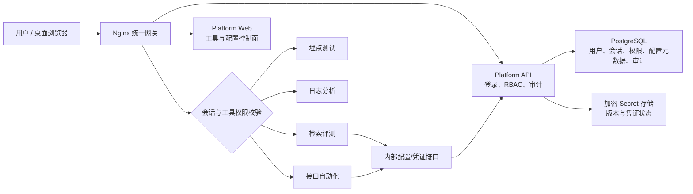

# 测试开发平台第二阶段产品需求文档

> 文档版本：V1.1  
> 项目阶段：第二阶段——身份、权限与配置控制面  
> 创建日期：2026-08-10  
> 文档状态：待评审  
> 适用平台：`test-platform`  
> 当前接入工具：埋点测试、日志分析、检索评测、接口自动化  
> 修订记录：V1.1（2026-08-10）确认普通会话 RefreshSession、Admin Login、专用服务账号、请求重放边界、配置生效矩阵及 `dev/prod` 环境方案

---

## 1. 文档摘要

第二阶段将测试开发平台从“统一工具入口”升级为“统一身份与配置控制面”，重点解决以下问题：

1. 用户只登录一次，即可在平台首页和各工具之间保持统一会话；
2. 平台统一管理用户、角色、工具访问与操作权限；
3. 关键操作自动进入审计日志，能够追溯“谁在什么时间做了什么、结果如何”；
4. 各子项目分散的业务配置和 Secret 迁移到平台 Web 管理，不再要求日常登录服务器修改 `.env`；
5. 对检索评测和接口自动化的 Token 建立生命周期管理，优先自动登录、自动刷新和失败告警，减少人工替换 Token；
6. 各工具仍保持独立项目、独立服务和独立业务逻辑，平台不复制工具核心代码。

本阶段的核心交付不是简单增加一个登录页，而是形成可供后续测试 Agent、用例管理、报告中心等模块复用的身份、权限、配置和审计基础能力。

---

## 2. 背景与现状

### 2.1 第一阶段现状

当前平台已具备：

- React + TypeScript + Vite 平台首页；
- FastAPI 平台 API；
- PostgreSQL 与 Alembic；
- Nginx 统一入口和 Docker Compose 服务编排；
- 埋点测试、日志分析、检索评测、接口自动化四个独立工具入口；
- 工具目录、健康检测和故障隔离。

当前平台尚未具备：

- 用户登录与统一会话；
- 用户、角色和权限模型；
- 对工具页面和接口的服务端访问控制；
- 审计日志；
- 配置中心或 Secret 管理能力；
- Token 到期状态、自动更新和统一告警。

### 2.2 当前配置管理问题

各项目分别维护自己的 `.env` 或平台专用凭证文件，存在以下问题：

- 配置项数量多、位置分散，不容易确认某项配置由谁使用；
- 修改配置需要登录服务器、找到对应文件并重启服务；
- Secret 与普通配置混在一起，缺少遮罩、加密、权限隔离和操作记录；
- Token 过期后依赖人工发现、人工替换，容易影响任务执行；
- 无法快速判断一个工具当前是“配置缺失”“凭证过期”还是“服务故障”；
- `.env` 文件的复制、备份和排障过程可能扩大敏感信息暴露面；
- 同一个配置可能在独立模式和平台模式中产生两份值，容易不一致。

### 2.3 两个 Token 场景的现状澄清

#### Truthy_Search 检索账号

`AUTH_TOKEN` 当前仍由工具从环境变量或配置文件读取。它不是平台统一管理的 Secret，过期后仍可能需要人工更新。

#### Truthy_Search Admin 公共信息采集

当前代码已经实现以下能力：

- 使用 `SEARCH_ADMIN_USERNAME` 和 `SEARCH_ADMIN_PASSWORD` 调用 Admin Login；
- 从登录响应中取得 Session Token 和过期时间；
- 在 Token 临近过期或服务端判定失效时自动重新登录；
- Session Token 只保存在工具进程内存中，不写入日志、SQLite 或报告。

但是，Admin 用户名和密码目前仍来自 `Truthy_Search/.env`，只是由平台 Compose 以只读文件方式挂载到容器。**这不等于平台已经具备 Secret 管理能力**。目前没有 Secret 数据库、加密存储、Web 配置页、版本记录或 Secret 权限控制。

第二阶段应将 Admin 用户名和密码迁入平台 Secret 管理；工具继续负责自己的 Admin 登录和内存 Token 刷新。平台负责凭证的安全保存、授权下发、健康状态和变更审计，不需要持久化该 Admin Session Token。

#### Truthy_ApiAutoTest2 接口自动化

当前普通业务会话已经支持：

- 使用 `RefreshSession` 刷新 `AUTH_TOKEN`；
- Refresh Token 失效或刷新失败时，使用 `CreateAnonymousSession` 重建匿名会话；
- 将新会话写回 `.env.platform`。

但是 `ADMIN_SESSION_TOKEN`、`ADMIN_OPERATOR_ID`、`ADMIN_OPERATOR_NAME` 仍是静态配置。当前没有通过 Admin 用户名和密码自动登录并取得 Admin Session 的完整链路，因此该 Token 到期后仍需人工替换。

经外部契约确认，`Truthy_ApiAutoTest2` 可复用 Truthy_Search 当前使用的 Admin 用户名/密码登录接口，且登录响应稳定返回 Session Token、Operator ID、Operator Name 和过期时间。第二阶段应直接实现 Admin 自动登录、临期更新和失败状态上报，不再把“Web 手工替换 `ADMIN_SESSION_TOKEN`”作为目标方案。

---

## 3. 产品目标与成功标准

### 3.1 产品目标

#### G1：统一身份与会话

- 用户通过平台登录一次；
- 在 `/`、`/trackevents/`、`/log-filter/`、`/truthy-search/`、`/api-autotest/` 之间访问时不重复登录；
- 退出登录后，平台和所有受保护工具入口立即失效；
- 未登录用户不能通过直接输入工具 URL 绕过登录。

#### G2：统一权限

- 平台管理员可以在 Web 中管理用户、角色和权限；
- 不同用户可以看到和使用不同工具；
- “能看见工具”“能执行任务”“能查看结果”“能管理配置/Secret”相互独立；
- 所有权限必须由服务端校验，不能只依赖前端隐藏按钮。

#### G3：统一审计

- 登录、权限变更、配置发布、Secret 替换、凭证刷新、任务执行等关键操作可追溯；
- 审计记录不能被普通用户修改或删除；
- 审计日志不得保存密码、Token 或 Secret 明文。

#### G4：统一配置与 Secret

- 日常业务配置和工具配置可在 Web 中完成查看、校验、修改、发布和回滚；
- Secret 可在 Web 中新增或替换，但保存后不能再次查看明文；
- 各工具不再依赖人工编辑项目 `.env` 完成日常配置维护；
- 配置按工具、环境和敏感级别集中分类，明确生效方式和影响范围。

#### G5：凭证生命周期自动化

- 平台可显示凭证“正常、临期、已过期、配置缺失、验证失败、需要人工处理”状态；
- 能自动刷新的 Token 由系统自动刷新并保存新版本；
- 能通过账号密码重新登录的场景，Token 失效后自动重新登录；
- 无法自动续期时，提前告警并提供最短人工恢复路径；
- 工具任务不再直接改写项目 `.env` 作为长期状态存储。

### 3.2 可衡量成功标准

- 100% 的平台页面和四个工具入口受统一登录保护；
- 直接访问无权限工具路径返回 `403` 或统一无权限页，不发生业务请求；
- 用户、角色、工具权限、配置和 Secret 均可通过 Web 管理；
- 除启动配置白名单外，日常运维不需要登录服务器修改 `.env`；
- Truthy_Search Admin 公共信息采集不需要人工维护 Session Token；
- Truthy_ApiAutoTest2 普通业务 Token 能自动刷新或重建，刷新结果进入平台 Secret 存储而不是写回 `.env.platform`；
- Truthy_ApiAutoTest2 Admin Token 通过与 Truthy_Search 相同的 Admin Login 自动获取和更新，不再要求人工替换；
- 所有权限和配置变更均生成可检索审计记录；
- 审计日志、应用日志、任务日志、接口响应和前端状态中均不出现 Secret 明文；
- 单个工具凭证失败不会导致平台和其他工具不可用。

---

## 4. 范围与边界

### 4.1 本阶段包含

1. 本地用户名和密码登录；
2. PostgreSQL 服务端会话和同源 Cookie；
3. 用户、角色、权限和工具级授权；
4. 平台及工具路径的网关鉴权；
5. 审计日志采集、查询和导出；
6. 配置定义、配置值、校验、发布、版本和回滚；
7. Secret 加密存储、替换、版本、状态和最小权限访问；
8. 配置/Secret 按环境和工具隔离；
9. Truthy_Search 与 Truthy_ApiAutoTest2 的凭证接入适配；
10. 凭证自动刷新、重新登录、状态检查和站内告警；
11. 现有四个工具的权限接入；
12. 管理后台所需的桌面 Web 页面。
13. `dev`、`prod` 两个部署环境的配置与 Secret 隔离、校验和发布。

### 4.2 本阶段不包含

- 企业 SSO、LDAP、OIDC 或第三方身份源；
- 用户自助注册、短信或邮件找回密码；
- Redis、Celery、通用任务中心或跨工具 Worker 平台；
- Kubernetes、服务注册中心或容器编排管理页面；
- 允许 Web 任意添加环境变量名称或任意执行容器命令；
- 在 Web 中查看或导出已有 Secret 明文；
- HashiCorp Vault、云 KMS 等外部 Secret 产品接入；
- 邮件、短信、Slack 或企业微信告警；
- 本阶段不创建 `staging` 预发环境，只预留后续扩展能力；
- 重构各工具核心分析、评测或自动化执行逻辑；
- 移动端适配。

### 4.3 “全部可以在 Web 配置”的准确边界

“全部”指所有**日常可变的业务配置、工具配置、账号密码和运行期凭证**，不包括平台启动前必须存在的基础设施配置。

配置分为五类：

| 类别 | 示例 | 存储位置 | Web 管理 | 说明 |
|---|---|---|---|---|
| 启动配置 | PostgreSQL 连接、主加密密钥、首次管理员引导密钥 | 部署环境或 Docker Secret | 否 | 平台启动和解密自身数据前必须存在，只保留最小白名单 |
| 平台普通配置 | 会话时长、审计保留天数、凭证预警阈值 | PostgreSQL | 是 | 通过配置中心管理 |
| 工具普通配置 | API URL、超时、轮询间隔、功能开关、目录逻辑配置 | PostgreSQL | 是 | 按工具和环境隔离 |
| 工具 Secret | 用户名、密码、Access Token、Refresh Token | 加密后的 Secret 存储 | 是 | 只能替换，默认不可回显明文 |
| 运行期凭证 | Session Token、过期时间、Operator 信息 | 加密后的 Secret/凭证状态存储或工具内存 | 自动管理 | 默认不要求用户手工编辑 |

平台应提供“启动配置白名单”文档。白名单之外的已登记配置不得继续要求维护人员手动修改项目 `.env`。

---

## 5. 目标用户与角色

### 5.1 目标用户

- 平台管理员：管理用户、角色、工具权限、配置和 Secret；
- 测试开发工程师：使用全部或部分工具，维护获授权工具配置，排查失败；
- 测试工程师：执行测试、查看自己或团队范围内结果；
- 研发/查看者：查看获授权的工具结果和报告，不修改配置；
- 审计查看者：只读查看审计日志，不具备 Secret 管理权限。

### 5.2 内置角色

系统初始提供以下角色，管理员可复制后调整，但内置角色标识不得删除：

| 角色 | 默认能力 |
|---|---|
| 平台管理员 | 用户、角色、权限、配置、Secret、审计和全部工具管理 |
| 测试开发 | 查看和执行授权工具、查看结果、维护授权工具普通配置；默认不能管理用户或查看 Secret 元数据以外内容 |
| 测试执行者 | 查看和执行授权工具、查看允许范围内的结果 |
| 只读查看者 | 查看授权工具与结果，不能执行或修改 |
| 审计查看者 | 查看和导出审计日志，不能修改权限、配置或 Secret |

---

## 6. 总体产品方案

### 6.1 架构原则

- 平台负责身份、授权、配置、Secret、审计和统一入口；
- 工具继续独立运行，核心业务逻辑归各工具所有；
- 浏览器只通过 Nginx 的统一域名访问平台和工具；
- 网关先鉴权再代理，禁止只在前端做权限控制；
- 工具通过受保护的内部接口读取其获授权的配置，不直接查询平台数据库；
- Secret 明文只在被授权工具实际使用时短暂存在于进程内存中；
- 配置变更采用“草稿—校验—发布—生效”流程；
- 凭证自动维护失败时安全降级，不无限重试，不影响其他工具。

### 6.2 目标架构



### 6.3 统一会话原则

- 平台使用同源、安全 Cookie，不在 `localStorage` 或 URL 中保存登录 Token；
- Cookie 作用域覆盖 `/`，因此各子路径共享同一平台会话；
- 会话存储在 PostgreSQL，服务重启后有效会话可继续使用；
- 默认空闲超时 8 小时、绝对有效期 24 小时，管理员可在 Web 调整；
- 退出登录、账号禁用、密码重置和角色收回后，相关会话立即失效；
- 高风险管理操作可要求输入当前密码再次确认；
- 修改类请求必须具备 CSRF 防护。

---

## 7. 功能需求

### 7.1 登录与账户

#### 7.1.1 登录

- 登录字段：用户名、密码；
- 登录成功后跳转到原目标页面或平台首页；
- 登录失败使用统一提示，不暴露“用户名存在但密码错误”等枚举信息；
- 连续失败触发速率限制和短时锁定；
- 记录登录成功、登录失败、退出、会话失效等审计事件；
- 首次启动通过一次性引导创建第一个平台管理员，引导完成后自动关闭。

#### 7.1.2 账户管理

管理员可在 Web 中：

- 创建用户；
- 设置姓名、用户名、状态和角色；
- 重置密码；
- 启用或禁用账号；
- 强制退出该用户的全部会话；
- 查看账号最后登录时间和最近安全事件。

MVP 不提供公开注册和用户自助找回密码。

#### 7.1.3 密码安全

- 密码使用 Argon2id 等适合密码存储的算法哈希，禁止可逆加密或明文保存；
- 默认最少 12 个字符，允许密码管理器生成的长密码；
- 不强制无意义的周期改密；发生管理员重置或泄露风险时要求更新；
- 密码、Cookie 和 CSRF Token 不进入日志或审计详情。

### 7.2 角色与权限

#### 7.2.1 权限模型

采用 RBAC：用户关联一个或多个角色，角色包含权限；权限可附带工具范围。

权限分为两组：

**平台权限**

| 权限 | 说明 |
|---|---|
| `platform.user.manage` | 管理用户和用户状态 |
| `platform.role.manage` | 管理角色和权限 |
| `platform.audit.view` | 查看审计日志 |
| `platform.audit.export` | 导出审计日志 |
| `platform.config.manage` | 管理平台级普通配置 |
| `platform.secret.manage` | 替换平台级 Secret |

**工具权限**

| 权限 | 说明 |
|---|---|
| `tool.view` | 在首页看到工具并访问工具页面 |
| `tool.execute` | 提交、取消或重新执行工具任务 |
| `tool.result.view` | 查看任务结果、日志和报告 |
| `tool.config.manage` | 修改该工具普通配置 |
| `tool.secret.manage` | 替换该工具 Secret、执行凭证校验 |

工具权限必须带工具范围，例如 `tool.execute:truthy-search`。角色可以授权单个工具，也可以授权全部工具。

#### 7.2.2 权限生效规则

- 用户拥有多个角色时，权限取并集；
- 本阶段不增加显式“拒绝”规则，避免权限冲突；
- 禁用用户优先级最高，禁用后所有权限和会话立即失效；
- 工具首页只展示拥有 `tool.view` 的工具；
- Nginx/平台鉴权层必须拦截没有 `tool.view` 的直接路径访问；
- 工具执行接口必须再次校验 `tool.execute`，不能依赖页面入口已校验；
- 管理配置和管理 Secret 分离，避免普通配置管理员接触敏感凭证；
- 权限变更保存后立即对新请求生效，并终止已被收回权限的相关会话或高风险操作。

### 7.3 审计日志

#### 7.3.1 审计日志是什么

审计日志是一份不可随意修改的关键操作记录。它与普通运行日志不同：

- 普通运行日志回答“程序哪里报错了”；
- 审计日志回答“是谁在什么时间，以什么身份，对哪个对象做了什么，是否成功”。

例如，当检索任务突然认证失败时，审计日志可以帮助确认：

- 哪个管理员最后替换了检索账号；
- 配置何时发布到哪个环境；
- 凭证测试是否成功；
- 哪次自动刷新失败；
- 谁修改了某个用户的工具权限；
- 谁在什么时间执行或取消了测试任务。

它的主要价值是安全追责、故障排查、变更回溯和权限治理。即使平台只在内网使用，这些能力也能显著降低“配置被改坏但不知道谁改的、何时改的、原来是什么”的排查成本。

#### 7.3.2 审计内容

每条审计记录至少包含：

- 事件 ID、发生时间；
- 操作者用户 ID、用户名和当时的角色快照；
- 操作类型和目标对象类型/ID；
- 工具与环境范围；
- 操作结果：成功、失败、拒绝；
- 失败原因的安全错误码；
- `request_id`、来源 IP、User-Agent；
- 普通配置变更前后差异；
- Secret 操作只记录“已替换、版本号、状态”，不记录明文和明文差异。

必须审计的事件包括：

- 登录成功、失败、退出、锁定、强制失效；
- 用户创建、禁用、密码重置；
- 角色和权限创建、修改、删除、分配；
- 配置草稿保存、校验、发布、回滚；
- Secret 创建、替换、校验、自动刷新、刷新失败；
- 工具任务提交、取消和失败；
- 审计日志查询中的导出操作。

#### 7.3.3 审计查询与保留

- 支持按时间、用户、工具、环境、操作类型和结果筛选；
- 支持查看单条事件详情；
- 支持 CSV 导出，导出动作本身也需审计；
- 默认保留 180 天，可通过平台普通配置调整；
- 审计记录只允许追加，不提供 Web 编辑或单条删除；
- 清理只能由系统按保留策略执行，并记录清理批次；
- 审计查看权限与平台管理员权限分离。

### 7.4 配置中心

#### 7.4.1 配置定义

平台为每个允许 Web 管理的配置项登记元数据：

- 配置键、中文名称、说明；
- 所属平台或工具；
- 适用环境；
- 类型：字符串、整数、布尔、枚举、JSON、URL、路径逻辑值、Secret；
- 是否必填、默认值和校验规则；
- 是否敏感；
- 生效方式：即时、下一任务、服务重启或部署变更；
- 是否允许 Web 修改；
- 影响说明和维护负责人。

Web 页面不得允许用户任意创建未登记的环境变量名，避免通过配置中心注入危险启动参数。

#### 7.4.2 配置页面

配置中心按“环境 → 工具 → 配置组”组织，至少提供：

- 搜索配置键和中文名称；
- 按“普通配置、Secret、缺失、异常、临期”筛选；
- 类型匹配的输入控件和即时格式校验；
- 当前发布版本、生效时间、修改人和生效方式；
- 配置状态：未配置、草稿、待发布、生效中、已生效、发布失败；
- 配置项使用说明和变更影响；
- 修改前后差异预览；
- 对当前环境执行校验；
- 发布确认和失败回滚。

#### 7.4.3 发布与生效

流程固定为：

```text
编辑草稿 → 格式校验 → 业务连通性/凭证校验 → 查看差异与影响 → 发布 → 工具确认生效
```

规则：

- 保存草稿不影响运行中的工具；
- 发布前必须通过类型和必填校验；
- 支持校验的 URL 或凭证可执行连通性测试；
- 发布时明确提示是否影响正在运行的任务；
- 需要重启的配置不得静默重启工具，必须显示影响并要求确认；
- 运行中任务默认使用提交时的配置版本，发布新版本不改变该任务；
- 发布失败时保持上一已生效版本；
- 普通配置可回滚到历史版本；Secret 回滚是重新启用旧的加密版本，不展示其明文。

#### 7.4.4 环境管理

第二阶段环境名称固定为：

| 环境 | 定位 | 本阶段状态 |
|---|---|---|
| `dev` | 当前开发与联调环境 | 默认环境，承接现有配置迁移 |
| `prod` | 稳定生产使用环境 | 本阶段新增，独立配置和凭证 |

环境规则：

- `dev` 与 `prod` 的普通配置、Secret、凭证状态和发布版本完全隔离；
- 普通配置可从 `dev` 提升为 `prod` 草稿，但必须重新校验并显式发布；
- Secret 不随普通配置自动复制到 `prod`，必须在目标环境单独配置或由授权迁移流程导入；
- `prod` 的配置发布、Secret 替换和回滚属于高风险操作，必须二次确认并生成审计事件；
- 页面始终清晰显示当前环境，禁止仅依靠颜色区分；
- 本阶段不创建 `staging`，但数据模型和接口不得把环境写死为只有两个值；
- 接口自动化工具现有执行参数 `env=test` 属于“被测业务环境”，与平台部署环境 `dev/prod` 是两个维度，页面和接口不得混用。

### 7.5 Secret 管理

#### 7.5.1 安全要求

- Secret 在数据库中必须加密存储，主加密密钥独立保存在部署环境或 Docker Secret；
- 前端提交 Secret 后，后续接口只返回掩码、版本、状态、修改人和时间；
- 不提供“显示原值”“复制原值”或明文导出；
- Secret 不进入 URL、日志、审计差异、错误响应、浏览器缓存或任务报告；
- 工具只能读取属于自身和当前环境的 Secret；
- 管理员能够替换 Secret，不代表可以读取历史明文；
- Secret 每次替换生成新版本，历史版本保留加密值和状态；
- 主加密密钥轮换必须支持逐步重加密，且不能与数据库备份存放在同一位置。

#### 7.5.2 Secret 状态

每个凭证显示以下状态之一：

- `未配置`；
- `待验证`；
- `正常`；
- `临近过期`；
- `已过期`；
- `验证失败`；
- `自动刷新中`；
- `需要人工处理`。

状态页展示最后验证时间、过期时间、最近错误的安全摘要和建议操作，但不展示凭证值或上游完整响应。

#### 7.5.3 Secret 使用与下发

- 工具通过内部身份认证调用平台配置/Secret 接口；
- 平台签发短时、仅限指定工具和环境的内部访问凭据；
- 工具不得使用用户浏览器会话读取 Secret；
- Secret 仅在任务开始或需要刷新时按需获取，避免长期落盘；
- 不向平台 API 容器挂载 Docker Socket；
- 迁移期间若必须生成兼容文件，应写入内存文件系统或受限运行目录，设置最小文件权限，并明确标记为过渡机制；
- 完成迁移后，`Truthy_Search/.env` 和 `Truthy_ApiAutoTest2/.env.platform` 不再作为平台模式的日常凭证来源或写回目标。

### 7.6 凭证生命周期管理

#### 7.6.1 通用规则

- 凭证记录可选过期时间、刷新提前量和刷新策略；
- 默认在过期前 60 分钟进入“临近过期”，具体值可按凭证类型配置；
- 自动刷新采用有限次数重试和退避，不得无限循环；
- 刷新成功生成新 Secret 版本并原子切换；
- 刷新失败保留最后可用版本，记录安全错误和审计事件；
- 连续失败后进入“需要人工处理”，在平台首页和配置中心显示站内告警；
- 凭证失败只影响依赖该凭证的工具能力，不影响平台登录和其他工具；
- 手动点击“立即校验”或“立即刷新”需要对应 `tool.secret.manage` 权限。
- 常规刷新以响应中的明确过期时间为主要依据，不依赖业务请求失败后再猜测 Token 是否失效；
- 每次发送业务请求前检查过期时间，临期时先刷新再发送，尽量避免“失败后重放”；
- 服务端仍可能提前撤销 Token，因此已确认的认证失败必须进入凭证异常状态并触发刷新，但不得把任意业务错误都当成认证失败；
- 只读查询可以在刷新成功后自动重放一次；创建任务、修改、删除等非幂等请求默认不自动重放，除非上游明确支持稳定幂等键；
- 非幂等请求在发送前必须确保 Token 在预估执行窗口内有效，遇到结果不确定时交由用户确认，避免重复创建任务或产生重复副作用。

#### 7.6.2 Truthy_Search 普通检索凭证

目标流程：

1. `AUTH_TOKEN`、`REFRESH_TOKEN`、用户和设备标识迁入平台 Secret/配置中心；
2. 工具执行检索前读取当前有效凭证；
3. 根据 `expires_time` 在 Access Token 临期前调用正式 `RefreshSession` 接口；
4. 刷新成功后原子保存新的 Access Token、Refresh Token、两个过期时间和 User ID，再激活新版本；
5. Refresh Token 已过期或刷新失败时，调用已确认存在的正式 Login/建会话接口重新取得完整会话；
6. 不再要求编辑 `Truthy_Search/.env`。

`RefreshSession` 的正式请求与响应契约见 17.1。示例中的所有 Token 必须使用脱敏占位符，不进入文档、测试夹具、日志或 Git。

#### 7.6.3 Truthy_Search Admin 公共信息凭证

目标流程：

1. `SEARCH_ADMIN_USERNAME` 和 `SEARCH_ADMIN_PASSWORD` 存入平台 Secret；
2. 工具在首次需要公共信息时按需读取账号密码；
3. 继续复用工具现有 `AdminClient` 登录、提前续期和认证失败后只重放一次的能力；
4. Session Token 保持只在工具内存中，不要求持久化到平台；
5. 平台接收工具上报的“最近登录成功、预计过期、最近失败”状态；
6. 修改账号密码后，在下一次登录或显式凭证重载时生效。

#### 7.6.4 Truthy_ApiAutoTest2 普通业务会话

目标流程：

1. 迁移 `AUTH_TOKEN`、`REFRESH_TOKEN`、`USER_ID`、`DEVICE_ID` 和过期时间；
2. 保留现有 `RefreshSession → CreateAnonymousSession` 降级策略；
3. 将当前 `persist_session_to_dotenv()` 写回改为平台内部 Secret 写回；
4. 新版本写入成功后再切换当前运行时上下文；
5. 不再把 `.env.platform` 作为动态会话数据库；
6. 任务详情只显示凭证状态，不显示任何 Token。

#### 7.6.5 Truthy_ApiAutoTest2 Admin 会话

目标流程：

1. 将 Admin 专用服务账号的用户名和密码存入平台 Secret；
2. 执行含 Admin 审计步骤的 Flow 前检查 Admin Session；
3. 缺失或临期时调用与 Truthy_Search 相同的 Admin Login；服务端提前撤销时，在识别为认证失败后重新登录；
4. 保存新的 `ADMIN_SESSION_TOKEN`、`ADMIN_OPERATOR_ID`、`ADMIN_OPERATOR_NAME` 和过期时间；
5. 只读 Admin 查询可在重新登录后重放一次；非幂等 Admin 写操作不自动重放；
6. 自动登录失败时中止依赖 Admin 的步骤，给出明确的凭证状态，不泄露上游响应。

Admin Login 契约已确认稳定返回 Session Token、Operator ID、Operator Name 和过期时间，因此手工维护 `ADMIN_SESSION_TOKEN` 不作为第二阶段正常运行方式。紧急人工替换只能作为受审计的故障恢复入口。

### 7.7 站内告警与状态汇总

平台首页增加“需要处理”摘要，但不改造成通用告警平台。至少覆盖：

- Secret 缺失；
- 凭证临近过期或已过期；
- 自动刷新连续失败；
- 配置发布失败；
- 工具配置版本未确认生效；
- 用户因登录失败被锁定。

告警支持进入对应配置、Secret 或用户详情页处理。普通用户只能看到其有权访问工具的非敏感状态。

---

## 8. 统一页面与交互要求

本阶段只面向桌面 Web，延续平台现有“清晰、克制、内容优先、工程师友好”的视觉系统，不重构工具核心页面。

### 8.1 全局导航

登录后全局导航至少包含：

- 工具；
- 配置中心；
- 凭证状态；
- 用户与角色（有权限时显示）；
- 审计日志（有权限时显示）；
- 当前用户菜单和退出登录。

各工具页面保留“返回平台”入口，并显示当前登录用户。没有权限的导航项不展示，但服务端仍必须校验。

### 8.2 登录页

- 单列、清晰的用户名和密码输入；
- 支持键盘 Tab、Shift+Tab、Enter；
- 错误提示与输入关联，屏幕阅读器可读；
- 密码可临时显示/隐藏；
- 登录提交中防止重复提交；
- 不展示具体账户存在状态。

### 8.3 用户与角色页

- 用户列表支持按状态、角色和关键字筛选；
- 用户详情展示角色、有效权限、活跃会话和最近安全事件；
- 角色编辑页按“平台权限”和“工具权限”分组；
- 权限修改前展示影响用户数量和工具范围；
- 删除自定义角色前必须处理仍关联的用户。

### 8.4 配置与 Secret 页

- 普通配置和 Secret 视觉上明确区分；
- Secret 输入默认遮罩，保存后只展示“已配置”和末次更新时间；
- 状态、风险、影响范围和生效方式优先展示；
- 发布前展示差异和受影响工具；
- 失败状态提供可执行的下一步，不只显示错误码；
- 页面离开时提示未保存草稿；
- 所有操作支持键盘完成并有可见焦点环。

### 8.5 审计页

- 默认展示最近 24 小时事件；
- 高风险事件如权限变更、Secret 替换和登录锁定具有清晰标签；
- 详情使用字段化信息，不直接展示原始日志大文本；
- Secret 相关详情只显示 Secret 名称、版本和状态。

### 8.6 统一状态

登录、权限、配置、Secret 和审计页面统一提供：

- 加载状态：骨架或明确进度，避免空白页面；
- 空状态：说明为什么为空及下一步；
- 权限不足：说明所需权限并提供返回入口；
- 会话过期：保存未提交的普通配置草稿，重新登录后恢复；Secret 明文不在浏览器持久化；
- 网络错误：提供重试，不清空已填写但尚未提交的普通配置；
- 发布失败：保留上一生效版本和本次失败原因的安全摘要。

---

## 9. 数据与领域对象

本节定义产品层对象，具体字段和索引由开发设计确定。

| 对象 | 用途 |
|---|---|
| User | 用户身份、状态和密码哈希 |
| Role | 可复用角色 |
| Permission | 稳定权限代码及说明 |
| UserRole | 用户与角色关联 |
| RolePermission | 角色、权限和工具范围关联 |
| Session | 服务端登录会话、过期时间和撤销状态 |
| ConfigDefinition | 配置项类型、说明、校验和生效方式 |
| ConfigValue | 普通配置在指定环境/工具下的版本值 |
| ConfigRelease | 一组配置的草稿、发布和回滚记录 |
| Secret | Secret 名称、范围和当前版本引用，不含明文展示能力 |
| SecretVersion | 加密值、版本、状态和过期元数据 |
| CredentialStatus | 最近校验、刷新、过期和错误状态 |
| AuditLog | 只追加的安全审计事件 |

数据要求：

- 用户名全局唯一；
- 权限代码稳定，不因中文名称改变；
- 配置键在“环境 + 工具 + 配置定义”范围内唯一；
- Secret 加密值与主密钥分离；
- 审计记录与业务对象使用稳定 ID 关联；
- 删除用户后保留审计中的历史主体快照；
- 时间统一按 UTC 存储，前端按 `Asia/Shanghai` 展示。

---

## 10. 接口需求

所有接口沿用 `/api/v1`、统一 `request_id` 和错误结构。以下为产品级资源范围，详细 Schema 在开发设计与接口文档中确定。

### 10.1 身份与会话

```text
POST   /api/v1/auth/login
POST   /api/v1/auth/logout
GET    /api/v1/auth/me
POST   /api/v1/auth/change-password
GET    /api/v1/auth/sessions
DELETE /api/v1/auth/sessions/{session_id}
```

### 10.2 用户与角色

```text
GET/POST        /api/v1/admin/users
GET/PATCH       /api/v1/admin/users/{user_id}
POST            /api/v1/admin/users/{user_id}/reset-password
DELETE          /api/v1/admin/users/{user_id}/sessions
GET/POST        /api/v1/admin/roles
GET/PATCH/DELETE /api/v1/admin/roles/{role_id}
GET             /api/v1/admin/permissions
```

### 10.3 配置与 Secret

```text
GET    /api/v1/config/definitions
GET    /api/v1/config/values
PUT    /api/v1/config/drafts/{scope}
POST   /api/v1/config/drafts/{scope}/validate
POST   /api/v1/config/drafts/{scope}/publish
POST   /api/v1/config/releases/{release_id}/rollback
GET    /api/v1/secrets
PUT    /api/v1/secrets/{secret_id}
POST   /api/v1/secrets/{secret_id}/validate
POST   /api/v1/secrets/{secret_id}/refresh
GET    /api/v1/credentials/status
```

约束：

- Secret 查询接口永不返回明文；
- Secret 写接口响应不回显提交值；
- 配置发布和 Secret 替换必须进行 CSRF 和权限校验；
- 内部工具读取接口与浏览器管理接口分离，使用工具身份而非用户 Cookie；
- API 错误不返回数据库连接、内部 URL、堆栈或上游敏感响应。

### 10.4 审计

```text
GET  /api/v1/audit/events
GET  /api/v1/audit/events/{event_id}
POST /api/v1/audit/exports
```

### 10.5 现有工具接口变化

- `GET /api/v1/tools` 只返回当前用户拥有 `tool.view` 权限的工具；
- `GET /api/v1/tools/{tool_id}/health` 仍返回工具健康状态，但要求该工具的查看权限；
- Nginx 在代理 `/trackevents/`、`/log-filter/`、`/truthy-search/`、`/api-autotest/` 前执行统一会话和工具权限检查；
- 工具的写操作需要在工具侧或统一鉴权适配层校验更细粒度权限。

---

## 11. 安全与隐私要求

### 11.1 必须满足

- 即使部署在内网，也必须使用 HTTPS；
- 会话 Cookie 设置 `HttpOnly`、`Secure` 和合适的 `SameSite`；
- 密码只保存安全哈希；
- Secret 使用经过审查的加密方案进行静态加密；
- 主加密密钥不进入数据库、Git 或前端构建；
- 所有输入进行服务端校验；
- 所有写操作进行权限和 CSRF 校验；
- 登录和 Secret 校验接口执行速率限制；
- Secret 在日志、审计、报告和错误响应中进行二次脱敏；
- 数据库备份可以包含加密后的 Secret，但主密钥必须单独备份；
- 禁止平台 API 挂载 Docker Socket；
- 禁止通过 Web 保存任意 Shell 命令、宿主机绝对路径或未登记环境变量。

### 11.2 权限绕过测试

必须验证：

- 未登录直接访问每个工具路径；
- 只有 `tool.view` 时调用执行接口；
- 只有普通配置权限时调用 Secret 接口；
- 修改请求中的工具 ID 或环境 ID；
- 使用已退出、已撤销或已禁用用户的会话；
- 使用工具 A 的内部凭据读取工具 B 的 Secret；
- 通过错误响应、审计导出和任务报告搜索 Secret。

---

## 12. 配置迁移要求

### 12.1 迁移原则

- 先盘点、分类和登记配置定义，再迁移值；
- 不直接将全部 `.env` 原样导入数据库；
- 不读取并展示现有 Secret 明文；迁移工具只执行受控导入，结果只显示成功/失败和键名；
- 每个工具先支持“双读但单写”：优先平台配置，缺失时暂时回退旧文件；
- 验证稳定后关闭旧文件回退；
- 动态 Token 只允许写回平台 Secret，不再写回 `.env`；
- 独立运行模式可以继续使用工具自己的 `.env`，但平台模式与独立模式不得同时修改同一运行数据或凭证状态。

### 12.2 迁移顺序

1. 建立配置项清单和启动配置白名单；
2. 先迁移普通配置，验证工具行为不变；
3. 再迁移静态 Secret，例如用户名和密码；
4. 接入 Truthy_Search Admin 账号并验证自动登录；
5. 将接口自动化普通会话写回切换到平台 Secret；
6. 补齐接口自动化 Admin 自动登录；
7. 关闭平台模式下对旧 `.env` 的日常读写；
8. 删除 Compose 中对应的项目 Secret 文件挂载前，完成回滚演练。

### 12.3 回滚原则

- 普通配置发布失败自动保留上一生效版本；
- Secret 新版本验证失败时不激活；
- 工具配置读取失败时使用最近一次有效缓存，不回退到未知或已过期版本；
- 迁移窗口内可临时恢复旧文件读取，但必须先停止平台对同一凭证的自动写回；
- 不允许平台 Secret 和旧 `.env` 同时作为可写真源；
- 回滚和恢复旧配置的操作必须进入审计日志。

---

## 13. 非功能需求

### 13.1 可用性

- 平台身份服务异常时，不允许以“无鉴权降级”方式开放工具；
- 配置中心异常不得影响已运行工具继续使用最近一次有效配置；
- Secret 服务短时异常时，已在运行进程内的有效凭证可继续使用；
- 单个凭证刷新失败不影响其他工具和其他凭证；
- 数据库恢复后，凭证状态和审计写入可继续工作，不重复执行不可幂等刷新。

### 13.2 性能

- 登录后普通页面会话校验 P95 小于 200 ms（内网环境，不含工具业务请求）；
- 用户权限变更在 5 秒内对新请求生效；
- 用户和审计列表首屏 P95 小于 1 秒（1 万条审计数据规模）；
- 配置/Secret 状态页在 100 个配置项规模下首屏 P95 小于 1 秒；
- 网关鉴权不能为每个静态资源产生一次完整数据库查询，应使用短时安全缓存或一次页面级授权策略。

### 13.3 可观测性

- 所有平台 API 继续生成 `request_id`；
- 登录、权限、配置发布和凭证刷新具有结构化指标；
- 记录刷新成功率、刷新失败次数、临期凭证数和发布失败数；
- 应用日志与审计日志分离；
- 监控数据只记录 Secret 标识，不记录值。

### 13.4 兼容性与可访问性

- 仅验收 1280px 及以上桌面浏览器；
- 支持当前主流 Chrome 桌面版本；
- 所有主要操作支持 Tab、Shift+Tab、Enter、Esc；
- 焦点状态清晰可见；
- 表单错误具有文本说明，不只依赖颜色；
- 支持 `prefers-reduced-motion`；
- 不新增无必要的前端依赖，复用现有 React 技术栈和设计 Token。

---

## 14. 验收场景

### 14.1 登录与会话

- 未登录访问平台和任一工具时进入登录页；
- 登录后依次进入四个工具无需重复登录；
- 刷新工具页面会话仍有效；
- 退出后直接访问历史工具 URL 被拦截；
- 禁用用户后其所有会话失效；
- 空闲和绝对超时按配置生效；
- CSRF 攻击请求被拒绝。

### 14.2 权限

- 只授权埋点测试的用户只看到并只能访问该工具；
- 只有查看权限的用户不能执行任务；
- 普通配置管理员不能替换 Secret；
- Secret 管理员不能因该权限自动获得用户管理能力；
- 修改角色后权限及时生效；
- 直接调用 API 或猜测 URL 不能绕过权限。

### 14.3 审计

- 登录、用户变更、权限变更、配置发布、Secret 替换和凭证刷新均生成审计记录；
- 可按用户、工具、时间、结果筛选；
- Secret 明文不出现在列表、详情、导出或数据库普通字段中；
- 普通用户不能修改或删除审计记录；
- 审计导出本身生成审计事件。

### 14.4 配置与 Secret

- 普通配置可编辑、校验、发布和回滚；
- 未登记配置键不能通过 Web 注入；
- Secret 保存后无法回显明文；
- Secret 验证失败时不替换当前有效版本；
- 需要重启的配置有明确影响提示；
- 运行中任务保持提交时的配置版本；
- 平台模式完成迁移后，日常配置变更不再要求编辑工具 `.env`。

### 14.5 Token 自动化

- Truthy_Search Admin 使用平台管理的用户名密码完成登录，Session 临期后自动重登；
- Truthy_Search 普通检索 Token 根据明确过期时间自动调用 `RefreshSession`，Refresh Token 失效时通过正式 Login/建会话接口重建；
- Truthy_ApiAutoTest2 普通会话成功刷新或重建后，新值进入平台 Secret，不改写 `.env.platform`；
- Truthy_ApiAutoTest2 Admin 会话通过与 Truthy_Search 相同的 Admin Login 自动获取和更新；
- 只读请求刷新后最多自动重放一次，非幂等写请求不会因认证刷新被盲目重放；
- 刷新失败时状态、告警和审计完整，且日志中无 Token；
- 停止一个工具不影响平台和其他工具的凭证状态查询。

### 14.6 回归

- 四个工具原有核心功能和独立运行模式不被破坏；
- 平台首页、工具目录和健康检测保持正常；
- 宿主机仍只暴露 Nginx 统一入口；
- 数据库迁移可从空库执行并可重复运行；
- 现有测试、第二阶段新增后端/前端/安全测试和桌面浏览器关键流程全部通过。

---

## 15. 分阶段交付建议

第二阶段作为一个产品阶段验收，但实施时拆成四个可独立验证的里程碑，降低一次性切换风险。

### 里程碑 A：身份与网关保护

- 用户、密码、会话；
- 登录页和当前用户；
- Nginx 统一鉴权；
- 四个工具路径不再匿名开放；
- 基础登录审计。

### 里程碑 B：RBAC 与完整审计

- 用户和角色管理；
- 工具级查看、执行、结果、配置和 Secret 权限；
- 权限即时生效；
- 审计查询和导出。

### 里程碑 C：配置与 Secret 控制面

- 配置定义、草稿、校验、发布、版本和回滚；
- Secret 加密、替换、状态和权限；
- 普通配置和静态账号密码迁移；
- 旧 `.env` 双读过渡。

### 里程碑 D：凭证自动化与关闭旧写回

- Truthy_Search 凭证适配；
- Truthy_ApiAutoTest2 普通会话写回平台；
- Truthy_ApiAutoTest2 复用 Truthy_Search Admin Login 完成自动登录；
- 凭证临期检查、刷新、站内告警和审计；
- 平台模式关闭旧 `.env` 日常读写并完成回滚演练。

---

## 16. 风险与缓解措施

| 风险 | 影响 | 缓解措施 |
|---|---|---|
| 把所有配置都放入数据库导致平台无法启动 | 平台自身产生循环依赖 | 保留严格、最小的启动配置白名单 |
| Secret 数据库与主密钥一起泄露 | 凭证被解密 | 主密钥与数据库分离、限制权限、支持轮换 |
| 只隐藏前端入口，没有保护工具路由 | 可直接输入 URL 越权 | 网关和工具写接口双重服务端校验 |
| Token 刷新后盲目重放非幂等请求 | 重复创建任务或产生重复副作用 | 请求前主动刷新；只读请求最多重放一次；写请求仅在有稳定幂等键时重放 |
| 新旧 `.env` 同时可写 | 凭证相互覆盖 | 迁移期单一写入源，完成后关闭旧写回 |
| 配置发布影响运行任务 | 结果不可复现 | 任务绑定配置版本，新配置只影响新任务 |
| 审计记录泄露 Secret | 扩大安全事件 | 结构化白名单字段、统一脱敏和专项测试 |
| 平台身份服务故障 | 所有新访问被阻断 | 安全失败关闭；已有工具使用最近有效配置继续运行，不开放匿名绕过 |
| PostgreSQL 中审计量增长 | 查询和存储压力 | 索引、分页、默认 180 天保留和批量清理 |
| 管理员误发布错误凭证 | 工具任务失败 | 发布前校验、新版本验证后激活、保留上一有效版本 |

---

## 17. 已确认外部契约与配置生效矩阵

本章结论已经确认，后续开发设计应直接以这些结论为输入，不再将其列为开放问题。

### 17.1 普通业务会话 RefreshSession

Truthy_Search 普通 `AUTH_TOKEN/REFRESH_TOKEN` 存在正式刷新或登录能力。已确认的刷新接口如下：

```http
POST https://gateway.spark-jam.top/gateway/invoke
Content-Type: application/json
Accept: */*
```

脱敏请求结构：

```json
{
  "comm": {
    "auth_token": "<current-access-token>",
    "device_id": "<device-id>",
    "install_id": "",
    "client_request_id": "<unique-request-id>",
    "trace_id": "",
    "platform": "ios",
    "app_version": "1.0.0",
    "locale": "zh-Hans-CN",
    "timezone": "UTC+08:00"
  },
  "requests": [
    {
      "id": "req_refresh_session",
      "service_name": "tool.identity.IdentityService",
      "method_name": "RefreshSession",
      "params": {
        "refresh_token": "<current-refresh-token>"
      }
    }
  ]
}
```

说明：`platform` 的规范值为 `ios`，不得额外嵌套单引号。`Host`、`Connection` 等传输层 Header 由 HTTP 客户端处理，不作为业务配置要求。

脱敏成功响应结构：

```json
{
  "code": 0,
  "message": "ok",
  "request_id": "<gateway-request-id>",
  "trace_id": "<trace-id>",
  "responses": [
    {
      "id": "req_refresh_session",
      "success": true,
      "code": 0,
      "message": "ok",
      "data": {
        "access_token": "<new-access-token>",
        "expires_time": 0,
        "refresh_expires_time": 0,
        "refresh_token": "<new-refresh-token>",
        "user_id": "<user-id>"
      }
    }
  ]
}
```

契约规则：

- 成功必须同时满足外层 `code=0`、对应 `responses[]` 的 `success=true` 和 `code=0`；
- 必须按请求 `id` 找到对应响应，不能默认永远读取数组第一项；
- `expires_time` 和 `refresh_expires_time` 为 Unix Epoch 毫秒；
- `access_token`、`refresh_token`、两个过期时间和 `user_id` 必须作为一个会话版本原子保存；
- 新版本完整校验并持久化成功后才能切换，禁止只更新 Access Token；
- Access Token 在临期窗口内先刷新再执行任务；Refresh Token 临期或过期时使用已确认存在的正式 Login/建会话能力重建完整会话；
- 用户提供的真实请求样例只用于确认契约，完整 Token 不进入 PRD、测试夹具、日志、审计或 Git。

### 17.2 Admin Login

- Truthy_ApiAutoTest2 使用与 Truthy_Search 相同的 Admin 用户名/密码登录接口；
- Admin Login 的 URL 继续按环境配置，不硬编码到业务代码；
- 请求使用 `method_name=Login`，账号来自平台 Secret；
- 成功响应稳定返回：
  - `responses[].data.session_token`；
  - `responses[].data.operator.operator_id`；
  - `responses[].data.operator.operator_name`；
  - `responses[].data.expire_time`；
- `expire_time` 按当前 Truthy_Search 契约解析为带时区的 ISO-8601 时间；
- Truthy_Search 可以继续只在进程内保存 Admin Session；
- Truthy_ApiAutoTest2 可在平台加密存储中保存 Admin Session 版本，供后续任务复用；
- 两个工具都必须在临期前主动重新登录，认证失败后的只读请求最多重放一次。

### 17.3 专用测试服务账号

- 上游允许使用专用测试服务账号，不使用个人账号；
- `dev` 和 `prod` 应使用不同的专用账号与 Secret；
- 服务账号遵循最小权限，只授予检索公共信息采集和接口自动化所需能力；
- 服务账号的创建、禁用和上游权限申请仍由上游系统负责；平台负责保存、使用、状态检查和变更审计；
- 禁止多人共享个人账号后再以“公共账号”名义录入平台。

### 17.4 Token 失效与请求重放策略

常规续期以明确过期时间为主，不等待业务请求失败：

1. 请求发送前检查 `expires_time`；
2. 进入临期窗口则先刷新或登录；
3. 刷新成功后再发送原业务请求；
4. 不把任意上游错误当成 Token 失效；
5. 服务端提前撤销 Token 时，只有被明确识别为认证失败的响应才触发一次刷新。

“重放”是指刷新凭证后再次发送刚才失败的原请求。安全规则如下：

| 请求类型 | 自动重放策略 | 原因 |
|---|---|---|
| 只读查询，如 Get、List、Debug、Cost | 刷新成功后最多一次 | 通常不会改变业务数据 |
| 创建任务，如 CreateIntentTask | 默认不自动重放 | 首次请求可能已经成功，重发可能创建重复任务 |
| 修改、删除、扣费或上传完成 | 默认不自动重放 | 可能产生不可逆或重复副作用 |
| 带上游正式幂等键的写请求 | 保持同一幂等键时最多一次 | 由上游保证重复请求只生效一次 |

由于上游已经稳定返回过期时间，本阶段不要求依赖一组固定失效错误码完成日常刷新。但开发设计仍需定义“已确认认证失败”的安全识别方式，用于处理服务端提前撤销账号或 Token 的异常情况；在无法确认错误性质时不得盲目重放写请求。

### 17.5 配置生效矩阵

根据当前项目代码，配置分为四种生效方式：

| 项目/配置类型 | 当前读取时机 | 第二阶段生效方式 | 是否需要重启 |
|---|---|---|---|
| 平台用户、角色、权限、会话、审计策略元数据 | 第二阶段由 PostgreSQL 动态读取 | 即时，对新请求生效 | 否 |
| 平台数据库地址、主加密密钥、监听和部署参数 | 进程或容器启动时 | 部署变更 | 是 |
| 平台日志级别、工具健康超时等现有 Pydantic Settings | 进程启动并由 `lru_cache` 缓存 | 服务重启；后续可逐项迁移为动态配置 | 是 |
| Truthy_Search 检索 API、业务凭证、轮询/超时、Admin 账号及运行开关 | 每个新 Run 创建 `SearchClient` 时调用 `Config.from_env()` | 下一任务生效 | 否，不影响运行中 Run |
| Truthy_Search 数据库路径、数据/导入/Raw/报告目录、Web 路由、Web Secret Key、显示时区、上传限制 | `create_app()` 启动时 | 服务重启 | 是 |
| Truthy_ApiAutoTest2 业务会话、Admin 会话及 `config/env/*.yaml` 执行配置 | 每个 pytest 子进程启动时加载 | 下一任务生效 | 否，不影响运行中任务 |
| Truthy_ApiAutoTest2 壳服务端口、基础路由、任务超时、任务保留数量、报告目录 | `create_app()` 启动时 | 服务重启 | 是 |
| TrackEvents_tess 主机、端口、基础路由和平台返回地址 | 模块导入时读取 | 服务重启 | 是 |
| log_filter_tool 基础路由、导出目录和平台返回地址 | Flask `create_app()` 时读取 | 服务重启 | 是 |
| Nginx 路由、安全头、上传限制，以及 Compose 端口、卷、网络 | 网关/容器启动或 reload 时 | 部署变更 | reload 或重建容器 |
| React 构建期配置和静态资源 | Vite 构建时 | 重新构建并部署 | 是 |

发布规则：

- 页面必须在编辑前展示该配置的生效方式；
- “下一任务生效”的配置不改变已经提交或运行中的任务；
- 需要重启的工具必须等待当前任务结束，并通过受控发布流程重启；
- `SEARCH_WEB_SECRET_KEY`、会话签名密钥等变更可能使现有工具会话失效，必须显示专项风险；
- 路由、端口、卷、数据库地址和主加密密钥属于部署变更，不开放为普通 Web 任意编辑项；
- 第二阶段不得为了实现 Web 配置而向平台 API 暴露 Docker Socket。

### 17.6 部署环境

- 当前环境正式命名为 `dev`；
- 第二阶段新增 `prod`；
- 本阶段不创建 `staging` 预发环境；
- `dev` 和 `prod` 使用独立配置版本、专用服务账号、Secret 和凭证状态；
- 普通配置允许从 `dev` 提升为 `prod` 草稿，Secret 不自动跨环境复制；
- 数据模型保留增加 `staging` 或其他环境的能力；
- 平台部署环境 `dev/prod` 与接口自动化的被测环境参数（当前 `test`）分别建模。

---

## 18. 最终完成定义

第二阶段完成需要同时满足：

1. 平台与四个工具共享登录会话，匿名和越权访问均被服务端阻止；
2. 用户、角色、工具权限和审计日志可在 Web 中管理和查询；
3. 所有日常业务配置和工具 Secret 进入统一控制面，只有文档化的最小启动配置继续由部署环境提供；
4. Secret 加密、遮罩、权限、版本和审计要求全部通过安全测试；
5. Truthy_Search Admin 账号由平台 Secret 管理，工具自动维护内存 Session；
6. Truthy_ApiAutoTest2 普通会话不再写回 `.env.platform`；
7. Truthy_ApiAutoTest2 Admin 会话通过与 Truthy_Search 相同的 Admin Login 自动登录和更新，不再依赖手工维护 `ADMIN_SESSION_TOKEN`；
8. 凭证临期、刷新失败和需要人工处理的状态可以在平台中被及时发现；
9. 四个工具核心功能、独立部署能力和故障隔离保持不变；
10. 文档、接口、迁移、回滚、自动化测试和桌面浏览器验收全部完成。
