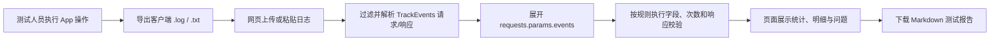

# 埋点测试工具：设计与搭建分享

> 本文基于项目中的《测试埋点功能 PRD》、使用说明、Docker 说明、核心代码和自动化测试整理，适合用于向测试开发同学说明该工具为什么做、如何设计以及如何运行。

## 1. 一句话介绍

这是一个面向测试人员的本地埋点校验工具：测试人员完成 App 操作并导出客户端日志后，将日志上传或粘贴到工具中，即可获得埋点事件统计、字段校验、服务端接收结果校验和 Markdown 测试报告。

## 2. 开发背景：为什么要做

产品埋点规则原本分散在两类 Excel 文档中：

- `1.0.0埋点.xlsx`：记录模块、上报时机、Action、业务子参及其说明。
- `需求埋点list(维护最新版).xlsx`：维护公参、Action 命名规则和 `page_from` 定义。

而客户端导出的日志同时混有多类 HTTP 请求，真正需要测试关注的是 `method=TrackEvents` 的请求与响应。仅依靠人工从日志中筛选、逐条比对文档，容易遗漏一个请求中的多条事件，也难以及时发现字段缺失、多传、取值错误或服务端未完整接收的问题。

因此，工具的目标不是替代 App 操作测试，而是把“操作后检查埋点”的人工核对环节标准化、自动化：从原始日志中识别埋点、依据规则校验、将问题汇总为可阅读的测试报告。

## 3. 目标与边界

### 本期要解决的问题

1. 只识别 TrackEvents 请求和响应，自动忽略如 `RefreshSession` 等无关请求。
2. 展开并统计请求中的全部 `events[]`，包括单次请求上报多条事件的情况。
3. 根据埋点规则检查事件是否定义、基础字段和业务参数是否正确。
4. 比对每个请求中的事件数与响应中的 `accepted_count`，确认服务端是否成功接收。
5. 提供无需改代码的页面操作和 Markdown 报告导出。

### 有意不做的部分

- 不直接接入线上埋点平台，也不自动执行 App 操作。
- 不提供账号、权限、数据库等平台化能力。
- 当前规则维护在 Python 代码中，尚未直接动态解析 Excel。
- 对 `clue`、`report` 等结构化子参只检查存在与非空，不做深层 Schema 校验。

这些边界体现了最小可用原则：先将测试人员最频繁、最容易出错的日志校验流程跑通，再按需求扩展。

## 4. 设计思路

整体上采用“**日志解析 → 事件提取 → 多维校验 → 报告呈现**”的分层流程。实现只依赖 Python 标准库，因此可直接本地运行，也可用 Docker 启动。

| 层次 | 对应实现 | 职责 |
| --- | --- | --- |
| 规则层 | `trackevents_core.py` 中的规则配置 | 维护 Action、模块、业务子参、公参和部分枚举约束。 |
| 解析层 | `LogParser` | 清洗日志前缀，识别 TrackEvents 请求/响应，恢复并解析 JSON。 |
| 校验层 | `analyze_log_text` 及各类 `_check` / `_validate` 函数 | 展开事件、校验字段与次数、校验请求响应对应关系。 |
| 报告层 | `build_markdown_report` | 生成汇总、事件明细、响应校验和问题列表。 |
| 交互层 | `trackevents_web.py` | 提供上传/粘贴日志、填写预期次数、结果页签和下载报告。 |

### 规则如何落地

产品文档中的 Action 及参数规则被收敛为代码中的可查询规则。校验分为四类：

1. **事件存在性**：`event_name` 必须在规则中定义；否则标记为未定义事件。
2. **基础一致性**：检查 `event_id`、`event_name`、`event_time_ms`、`properties`；同时比对 `properties.logtime == event_time_ms`、`properties.log_id == event_id`。
3. **参数校验**：检查必填公参和业务子参；未在规则中的业务字段以“疑似多传”提示，避免因产品文档滞后而误判失败。
4. **行为与服务端校验**：按配置比对事件触发次数；按日志顺序配对请求与响应，检查响应成功状态和 `accepted_count` 是否等于请求内事件数。

## 5. 工具运行流程



更具体地说，解析器逐行读取日志并移除时间、进程、`flutter: │` 等前缀；遇到 TrackEvents 标记后，通过 JSON 括号深度收集完整请求或响应。随后将每个 `events[]` 展开成独立事件，既能正确统计批量上报，也能把字段问题准确定位到具体 Action。

如果日志存在请求 JSON 交错、缺少 HTTP 起始行等不完整情况，解析器还会尝试从事件或响应信息中恢复 TrackEvents 数据；这是为了更贴近真实客户端日志的复杂格式。

## 6. 使用方式与输出

启动后，测试人员在浏览器中完成以下操作：

1. 上传 `.log` / `.txt` 文件，或直接粘贴日志文本。
2. 可选填写“预期触发次数 JSON”，例如 `{"app_foreground": 1}`。
3. 点击“开始解析”。
4. 在四个结果页签中查看：事件统计、事件明细、响应校验、报告文本。
5. 下载 `trackevents-report.md`，用于留存或提 Bug。

报告将至少呈现 TrackEvents 请求/响应数、事件总数、每个事件的实际与预期次数、字段错误、未定义事件，以及每次请求对应的响应接收情况。错误信息会定位到 Action 与字段名，避免测试人员重新翻找整段日志。

## 7. 关键取舍与工程化处理

- **先维护规则，再自动读 Excel**：PRD 中已有 Excel 自动读取规划，但当前将规则固化在代码里，降低第一版的解析复杂度，也便于快速校验规则正确性。
- **按日志顺序配对请求和响应**：当前日志没有稳定可用的请求 ID，因此以出现顺序配对；后续若日志提供可靠 ID，可升级为 ID 关联。
- **多传字段采用提示而非失败**：研发可能已新增字段但文档未同步。将其标为“疑似多传”可以暴露文档同步风险，同时减少误报。
- **无第三方 Web 框架**：Web 服务基于 Python 标准库实现，降低部署门槛；Docker 通过 8000 端口提供统一访问入口，并可只读挂载默认日志。

## 8. 当前验证情况

项目已有核心逻辑和 Web 层自动化测试，覆盖了以下关键风险：

- 仅提取 TrackEvents、正确展开批量事件，以及默认日志统计。
- 缺少业务字段、业务字段值和额外字段展示。
- 请求 JSON 交错、HTTP 起始行缺失、请求缺失时的恢复逻辑。
- 预期次数校验、基础路径、粘贴优先级、结果页签可访问性与错误提示。

本次整理时已运行：

```bash
python3 -m unittest -v test_trackevents_core.py test_trackevents_web.py
```

结果：**27 项测试全部通过**。

## 9. 后续可演进方向

1. 直接读取并版本化 Excel 埋点文档，减少手工同步规则。
2. 支持上传预期次数配置与导出 Excel 报告。
3. 将统计结果按测试用例或操作路径分组。
4. 增加结构化 JSON 参数的深层 Schema 校验。
5. 支持同一 Action 在不同页面或触发场景下使用差异化规则。

## 10. 分享时可以强调的价值

这个工具把埋点测试中“从杂乱日志中找证据、对照规则、确认服务端接收、整理结果”的链路收敛成一次可重复执行的检查。它既保留了测试人员对业务路径的判断，也把规则性、重复性的核对交给工具完成，从而让问题定位更清晰、测试结果更容易沉淀和复用。

> 待补充：如果分享需要量化成果，可在此处补入人工检查耗时、覆盖的埋点数量、历史发现的问题数或团队实际使用反馈。这些数据未在当前项目材料中记录，本文未作推测。
