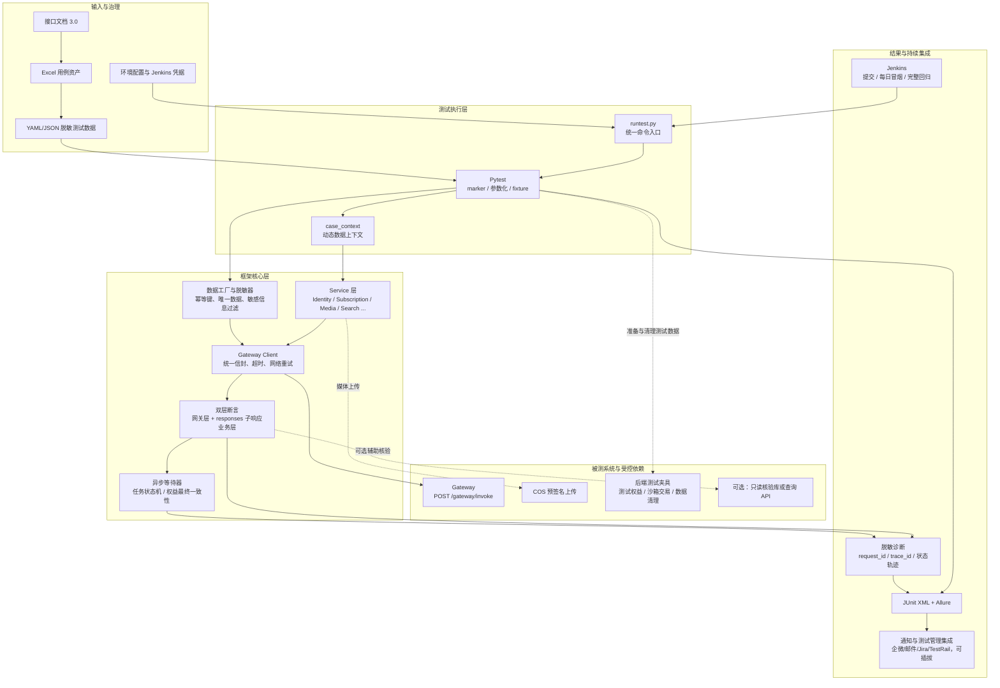
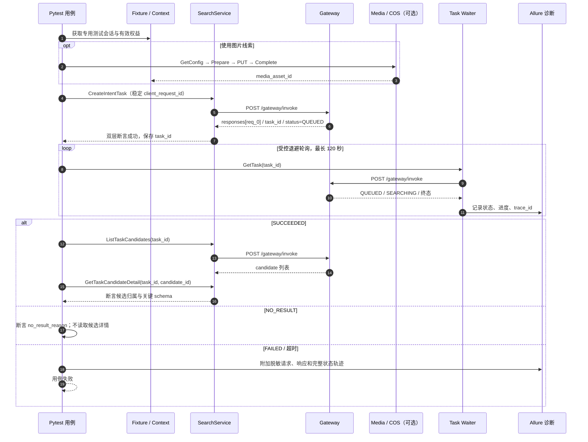
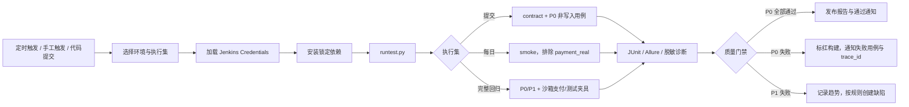

# 接口自动化测试框架流程图及待确认事项

## 1. 总体流程框架图

## 2. 关键业务流程图：搜索主链路

## 3. Jenkins 日常检查流程

## 4. 需要确认的事项

### 4.1 必须在开发前确认

| 编号   | 需确认事项      | 当前已知情况                                       | 确认的决定                                                           | 影响                                           |
| ---- | ---------- | -------------------------------------------- | --------------------------------------------------------------- | -------------------------------------------- |
| C-01 | 测试环境与账号隔离  | 文档提供了测试 Gateway 地址，但未说明测试租户和账号策略。            | 无账号策略。直接用device_id、user_id、auth_token这三个数据作为账号数据，后端会校验这3个数据的一致性 | 没有隔离账号，越权、历史、订单和搜索用例会相互污染。                   |
| C-02 | 测试权益/支付夹具  | 真实购买闭环需平台交易凭证；现有用例覆盖购买、恢复、过期和权益延迟。           | 后端可以发放/撤销短期权益、但模拟支付回调、沙箱交易还需要我这边去做                              | TC-001/003/004/027/028/029 无法稳定进入日常 Jenkins。 |
| C-03 | Token 刷新语义 | 现有 Excel 写为“旧 token 失效或按规则不可用”。              | RefreshSession 成功后，所有请求直接用最新的token就行了                           | 决定 TC-002/026 的精确断言。                         |
| C-04 | 搜索结果稳定性    | 搜索依赖第三方能力，文档允许 `SUCCEEDED/NO_RESULT/FAILED`。 | 都允许                                                             | 不能把固定候选数量或真人资料作为稳定断言。                        |
| C-05 | 搜索超时与限流    | 文档建议前 30 秒每 2–3 秒、后续 5–10 秒，且有用户/设备限流。       | 测试环境的最大 SLA、限流阈值为20s先吧                                          | 决定等待器最大时间、并发数和失败判定。                          |
| C-06 | 越权返回契约     | 文档列出 `NOT_FOUND` 与未授权类错误，但没有逐接口说明资源越权的返回。    | 无，先不管这个                                                         | 决定安全用例白名单与接口契约。                              |
| C-07 | 测试数据清理     | Gateway 公开能力中未见删除用户/订单/task。                 | 先不管这个                                                           | 避免订单、搜索历史和反馈数据长期堆积。                          |
| C-08 | 敏感信息治理     | 现有日志含会话/刷新凭证及 COS 预签名 URL。                   | 先不管这个                                                           | 防止测试框架与 Jenkins 二次泄漏。                        |

### 4.2 建议在第一阶段确认

| 编号   | 需确认事项       | 决策                                                | 影响                       |
| ---- | ----------- | ------------------------------------------------- | ------------------------ |
| S-01 | 技术版本与依赖治理   | Python 3.11+；使用 `pyproject.toml` + lock 文件；统一镜像源。 | 确保本地与 Jenkins 依赖一致、可复现。  |
| S-02 | HTTP 客户端    | 优先 Requests；                                      | 避免同一项目混用两套请求封装。          |
| S-03 | 测试数据格式      | 运行时统一 YAML/JSON；Excel 仅做资产和测试管理来源。                | 支持代码审查、参数化和版本追踪。         |
| S-04 | 数据库核验       | 默认黑盒；仅在有只读副本/查询 API 且必要时启用。                       | 避免日常测试依赖数据库权限和结构。        |
| S-05 | 通知与测试管理平台   | 使用的是飞书                                            | 决定 Jenkins 后置通知和结果回传适配器。 |
| S-06 | Allure 托管策略 | 按你的建议来                                            | 避免报告不可用或保存敏感大文件。         |
| S-07 | 并发策略        | 按你的建议来                                            | 避免限流、重复数据和偶发失败。          |
| S-08 | 分支门禁        | 按你的建议来，先出一个规则给我看看                                 | 形成稳定的 CI 质量门禁。           |

### 4.3 建议的确认顺序

1. 先确认 C-01、C-02、C-07、C-08：它们决定测试能否安全且可重复地运行。
2. 再确认 C-03～C-06：它们决定现有 TC-002、TC-005、TC-024 等用例的精确断言。
3. 最后确认 S-01～S-08：据此搭建代码骨架、Jenkins Job 和报告通知。

## 5. 评审后的第一期最小范围

若上述问题尚未全部确认，第一期仍可先落地以下不依赖支付夹具的范围：

- Gateway 信封封装、双层断言、日志脱敏、`runtest.py`、Allure/JUnit；
- Identity、Home、媒体配置及参数校验等单接口契约；
- 无 token / 无效 token、输入校验、基础 schema 等安全和异常用例；
- 搜索接口的入参与返回契约；异步搜索成功链路待确认 C-01～C-05 后接入；
- Jenkins 的契约回归任务，先不包含真实支付、真实人像和不受控的第三方检索结果。
