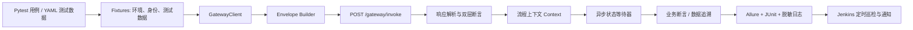

# 接口自动化测试框架的设计方案

## 1. 文档目的与现状结论

本文为 Truthy 客户端 Gateway 3.0 设计一套可本地执行、可持续扩展、可接入 Jenkins 日常巡检的接口自动化测试框架。框架以**接口契约、业务主流程、权限与幂等、异步任务状态机**为核心，而不是只校验 HTTP 状态码。

### 1.1 已审阅的项目资产

|资产|审阅结论|对框架的影响|
|---|---|---|
|`客户端接口文档 3.0.md`|统一入口为 `POST /gateway/invoke`；一次 Gateway 请求可包含多个 `requests[]`；业务成功由 `responses[].success/code/business_error_code` 判定。|封装统一 Gateway Client 和双层断言，禁止各用例自行拼装 HTTP 请求。|
|`完整请求日志，方便接口测试用.log`|真实链路覆盖刷新会话、媒体三段式上传、创建搜索、轮询、候选列表/详情、二次搜索；已观察到 `QUEUED → SEARCHING → SUCCEEDED`。顶层 `code=0` 时仍存在 `responses[0].code=301002`、`UNAUTHENTICATED`。|实现状态等待器；顶层响应与子响应分开断言；日志仅作样例来源，不能作为测试数据或提交到代码库。|
|`人际关系接口测试用例_副本.xlsx`|“多接口流程”中有 TC-001～TC-030 共 30 条，覆盖订阅、搜索、鉴权、幂等、越权和跨链路一致性；“单接口”为空。部分流程仍写为 `CreateIntent → StartTask → 获取报告`。|保留用例编号作为自动化 ID；按 3.0 协议迁移为 `CreateIntentTask → GetTask → ListTaskCandidates/GetTaskCandidateDetail`，补齐单接口契约用例。|

### 1.2 协议与自动化边界

- 测试环境基址：`http://gateway.spark-jam.top`；由配置覆盖，禁止把生产环境作为日常写入测试目标。
- 统一业务入口：`POST /gateway/invoke`。COS 图片直传不是 Gateway 调用，但属于媒体搜索流程的一部分。
- 新客户端主搜索流程使用 `CreateIntentTask`；`CreateIntent + StartTask` 仅保留一组兼容性回归用例，不作为主流程。
- C 端协议使用 `task_id` 与 `candidate_id`，不以内部 `report_id` 编排或断言。
- App Store / Google Play 真支付、第三方搜索供应商调用和真实人像图片，均不进入默认日常巡检；需要专用沙箱、可控回调和脱敏数据集。

## 2. 目标、非目标与质量门禁

### 2.1 目标

1. 将现有 30 条流程用例转为可重复执行的 Pytest 用例，保留 `TC-xxx` 可追溯性。
2. 建立服务级接口契约回归、P0 主链路、异常/权限、数据一致性四层测试。
3. 支持 token、订单、媒体资产、task、candidate 等动态数据自动提取、传递、标识和失败诊断；当前阶段不依赖自动清理能力。
4. 为异步搜索、权益最终一致性提供有限时、可观测、不会压垮服务的等待机制。
5. 在 Jenkins 中支持按环境/标签/计划触发，产出 JUnit XML、Allure 报告、原始请求摘要和脱敏日志。

### 2.2 非目标

- 不替代客户端 UI、App Store/Google Play 的端到端测试和性能压测。
- 不用生产账号、真实支付凭证、真实用户照片做定时任务。
- 不通过直接修改数据库伪造订阅或任务状态；需要后端提供测试夹具或受控测试 API。
- 不把完整请求日志、`auth_token`、refresh token、预签名上传 URL、真实人员线索写入 Git、Allure 或 Jenkins 控制台。

### 2.3 已确认的质量门禁

|任务|范围|允许失败|失败处理|
|---|---|---:|---|
|提交/合并请求|`contract` + `p0` 非写入用例|0|阻塞合并|
|每日冒烟|`smoke and p0`，排除 `payment_real`、`destructive` 和需人工支付的场景|0|标红并发送飞书通知；保留报告 30 天|
|发布前回归|P0/P1；支付成功、恢复、过期等仅在测试权益夹具可覆盖的范围内执行|P0 为 0；P1 失败需人工确认|P0 阻塞发布；P1 创建待确认项并发送飞书通知|
|手工扩展回归|沙箱交易、模拟支付回调、兼容接口和低优先级用例|按基线评估|人工触发；用于趋势和兼容性分析，不直接纳入日常任务|

## 3. 技术选型

采用 Python 3.11+、Pytest、Requests、Pydantic、Allure、pytest-xdist、pytest-rerunfailures 和 Jenkins Pipeline。

选择理由：Pytest 的 fixture、marker、参数化和断言重写适合 API 流程；Pydantic 适合约束统一 Gateway 信封与关键响应字段；Allure/JUnit 均可被 Jenkins 原生消费。依赖以 `pyproject.toml` 声明，并提交锁定依赖文件；本地和 Jenkins 使用统一镜像源及虚拟环境。



## 4. 推荐目录与职责划分

```text
Truthy_ApiAutoTest/
├── pyproject.toml
├── pytest.ini
├── README.md
├── config/
│   ├── env.test.yaml                 # 仅非敏感地址与运行参数
│   ├── env.staging.yaml
│   └── log_redaction.yaml
├── framework/
│   ├── client/gateway_client.py      # 唯一 HTTP 入口、超时、重试、请求日志
│   ├── client/cos_client.py          # PUT 上传与响应校验
│   ├── models/envelope.py            # 请求/响应 Pydantic 模型
│   ├── assertions/gateway_assert.py  # 网关层与业务层断言
│   ├── waiters/task_waiter.py        # 任务/权益轮询与状态机校验
│   ├── data/context.py               # 跨步骤动态变量、数据生命周期
│   ├── data/loader.py                # YAML/JSON 加载、schema 校验与进程内缓存
│   ├── data/factories.py              # 唯一名称、设备号、幂等键、线索生成
│   ├── security/redactor.py           # token、URL、个人信息脱敏
│   └── reporting/allure_helper.py
├── services/
│   ├── identity_service.py
│   ├── subscription_service.py
│   ├── media_service.py
│   ├── search_service.py
│   ├── report_service.py
│   ├── home_service.py
│   └── profile_feedback_service.py
├── tests/
│   ├── contract/                     # 单接口输入/输出契约
│   ├── flows/                        # 多接口业务流程
│   ├── security/                     # 鉴权、越权、数据隔离
│   ├── regression/                   # 兼容、历史缺陷
│   ├── data/cases/                   # 可提交的脱敏 YAML/JSON 数据
│   └── conftest.py
├── runtest.py                         # 本地/Jenkins 共用的 Python 执行入口
├── Jenkinsfile
├── allure-results/                   # 忽略提交
└── artifacts/                        # 忽略提交，含脱敏诊断包
```

### 4.1 分层约束

| 层                              | 允许做什么                                   | 禁止做什么                             |
| ------------------------------ | --------------------------------------- | --------------------------------- |
| `tests`                        | 表达业务步骤、引用 service、写业务断言和 marker         | 直接 `requests.post`、硬编码 token 或 ID |
| `services`                     | 以方法名封装 `params`，返回标准化 `GatewayResponse` | 拼接 base URL、吞掉业务失败                |
| `framework/client`             | 构造 `comm/execution/requests`、网络重试、脱敏记录  | 理解订阅或搜索业务规则                       |
| `framework/assertions/waiters` | 通用断言、状态机、退避轮询                           | 测试专用数据或环境硬编码                      |
| `framework/data`               | 加载/校验脱敏 YAML、JSON，缓存不可变数据，生成动态数据        | 保存 token、跨用例共享可变业务状态              |
| `config`                       | 非敏感配置与运行策略                              | 任何密钥、支付票据、真实 PII                  |

### 4.2 数据加载、参数化与缓存

数据驱动采用“测试代码负责行为、YAML/JSON 负责场景数据”的原则。`framework/data/loader.py` 统一提供 `load_case_data()`：

- 首次读取 YAML/JSON 后按文件路径与修改时间进行进程内缓存；文件改动后自动失效，避免每个参数化用例重复读盘。
- 加载后用 Pydantic 或 JSON Schema 校验 `id/title/markers/steps/expected` 的基本结构；数据格式错误应在收集用例阶段失败。
- `pytest.mark.parametrize` 用于同一接口的合法、非法、边界输入组合；复杂多接口流程仍保持一个测试函数，按步骤共享 function-scope `case_context`。
- Excel 是现有用例资产和迁移来源，不是运行时数据源。迁移完成后，以版本化 YAML/JSON 为唯一执行数据，Excel 可作为测试管理文档继续维护。

示例：

```python
@pytest.mark.parametrize("case", load_case_data("search/create_intent_task.yaml"), ids=lambda x: x["id"])
def test_create_intent_task_contract(entitled_user, case):
    response = search_service.create_intent_task(entitled_user.token, case["params"])
    assert_case_expectation(response, case["expected"])
```

缓存只适用于环境配置、静态测试样本和用例文件。token、订单号、媒体资产 ID、task ID 等必须在每个用例运行期间动态生成或通过 fixture 获取，绝不能缓存复用。

## 5. 核心框架设计

### 5.1 Gateway Client 与请求信封

`GatewayClient.invoke(service_name, method_name, params, *, auth_token=None, client_request_id=None)` 是用例唯一的网关入口：

1. 自动补齐 `comm.device_id/platform/app_version/locale/timezone`，并为每一次测试生成可检索的 `trace_id`（建议 `auto-{build_no}-{case_id}-{uuid8}`）。
2. 创建类调用（会话、订单、上传准备、搜索、反馈、二次搜索）必须接收调用方生成的稳定 `client_request_id`；网络重试沿用同一个值。
3. 默认单个 `requests[]`；仅在明确验证 Gateway 批量语义时才发送多个子请求，并按 `id` 匹配响应，不能依赖数组位置。
4. 连接超时 5 秒、读超时默认 15 秒；异步任务查询的单次超时不得超过剩余的 20 秒流程预算。只对连接异常、HTTP 502/503/504 进行最多 2 次指数退避重试。业务错误、HTTP 4xx、创建类未知结果不得盲目换幂等键重试。
5. 记录脱敏后的请求/响应、HTTP 状态、`request_id`、`trace_id`、耗时和 case ID；失败时作为 Allure 附件。

### 5.1.1 已确认的测试账号上下文

测试账号以 `device_id + user_id + auth_token` 三元组管理，三者必须来自同一次会话并保持一致：

- `device_id` 和 `auth_token` 按协议写入 `comm`；`auth_token` 用于服务端鉴权。
- `user_id` 在 `CreateAnonymousSession/GetMe` 后保存为测试上下文元数据，用于校验身份、订单、历史和任务归属；接口文档未要求客户端传递 `comm.user_id`，因此框架默认不发送该字段。
- 每次刷新成功后，`auth_token` 立即替换为最新 token，后续所有请求统一使用新 token；不对旧 token 是否仍可用做日常断言。
- 双用户越权用例暂不纳入第一期和日常门禁，待后续明确跨用户错误码契约后再启用。

### 5.2 双层断言（必须统一）

网关 HTTP 成功并不等于业务成功。框架提供以下两个显式断言，所有 service 调用必须二选一：

```python
response = search.create_intent_task(token, params, request_id)
assert_gateway_received(response)                 # HTTP 2xx + 顶层可解析
result = assert_business_success(response, "req_0")

response = subscription.create_order(no_token, params, request_id)
assert_business_error(response, "UNAUTHENTICATED", expected_code=301002)
```

| 断言                        | 校验内容                                                                                    |
| ------------------------- | --------------------------------------------------------------------------------------- |
| `assert_gateway_received` | HTTP 2xx、顶层 JSON、`request_id/trace_id/responses` 存在；不要求子请求成功。                           |
| `assert_business_success` | 目标 `responses[id]` 存在，`success=true`、`code=0`，并验证最小必要 `data` 字段。                        |
| `assert_business_error`   | 目标子响应 `success=false`，同时匹配 `business_error_code` 和数字 `code`；HTTP 业务状态如 401/403 仅作为辅助断言。 |
| `assert_schema`           | 关键字段类型、枚举、必填字段、禁止泄漏字段；不对动态文案做全量精确匹配。                                                    |

### 5.3 动态数据与 fixture

建议 fixture 作用域如下：

|fixture|作用域|产物|说明|
|---|---|---|---|
|`test_run_context`|session|build 标识、环境、trace 前缀|每次 Jenkins 构建唯一。|
|`anonymous_session`|function|`auth_token`、刷新 token、用户标识（只在内存）|避免用例相互污染。|
|`entitled_user`|function|已具备测试权益的专用账号|由测试夹具发放短期权益，不能依赖真实购买。|
|`media_asset`|function|`media_asset_id`|使用合规的测试图片；执行 Prepare → PUT → Complete。|
|`search_task`|function|`task_id`、最终状态、候选 ID|通过 `CreateIntentTask` 创建。|
|`case_context`|function|步骤输出字典|仅保存 ID 的掩码/摘要到报告。|

测试数据必须带前缀，例如 `autotest-{build_no}-{case_id}`，用于服务端筛选和人工追溯。当前阶段确认不建设自动清理：日常任务必须排除不可逆或高频写入的支付、订单、反馈场景；写入型用例仅在手工扩展回归中执行，并在报告中输出创建数据的脱敏标识。后续如提供删除能力或 TTL，再增加自动清理 fixture。

### 5.4 异步任务等待器

`wait_task_terminal(task_id, timeout=20)` 只调用 `GetTask`，返回最终快照，不在循环中使用固定 `sleep`：

- 0–10 秒：每 2 秒；10–20 秒：每 3 秒；最大等待 20 秒（当前测试环境 SLA/限流阈值确认值，可通过配置覆盖）。
- 终态：`SUCCEEDED`、`NO_RESULT`、`FAILED`、`EXPIRED`、`CANCELED`、`REJECTED`。
- 允许的正常路径：`QUEUED → SEARCHING → {SUCCEEDED|NO_RESULT|FAILED}`；实际允许缺失中间态，禁止成功后回退为进行中。
- 每次轮询记录状态、进度、`request_id/trace_id` 和耗时；超时报告完整状态轨迹。
- 收到 `RATE_LIMITED` 时按响应或配置退避；不能立即高频重试。

权益生效使用独立的 `wait_entitlement_allow()`，最大等待时间不超过 20 秒。它只在“后端测试夹具已发放权益”的场景使用；模拟支付回调和沙箱交易由测试侧后续补齐前，不进入日常自动化。

### 5.5 媒体上传流程

媒体流程封装为 `upload_media(file)`：`GetMediaUploadConfig → PrepareMediaUpload → PUT COS → CompleteMediaUpload`。

- 先校验文件类型、大小和文档返回的限制，再 PUT；PUT 需使用 `upload_headers`，只接受预签名 URL 的短期使用。
- `CompleteMediaUpload` 成功后断言 `status=uploaded` 和 `media_asset_id` 一致。
- 覆盖 `MEDIA_ASSET_NOT_UPLOADED`、`MEDIA_UPLOAD_EXPIRED`、不属于当前用户的媒体 ID；过期场景应重新 Prepare，而不是重放 URL。
- 测试图片使用无真实人脸或取得明确授权的固定脱敏样本；文件放在受访问控制的测试资产仓库，不进入公开报告。

## 6. 用例模型与现有 Excel 的迁移

### 6.1 标记体系

每个测试函数同时标记优先级、能力和运行风险：

```text
@pytest.mark.tc("TC-005")
@pytest.mark.p0
@pytest.mark.flow
@pytest.mark.search
@pytest.mark.async_task
@pytest.mark.requires_entitlement
def test_subscribed_user_create_search_and_view_candidates(...): ...
```

常用 marker：`p0/p1/p2`、`smoke`、`contract`、`flow`、`auth`、`idempotency`、`security`、`async_task`、`media`、`payment_sandbox`、`payment_real`、`compatibility`。默认命令排除 `payment_real` 和 `destructive`。

### 6.2 Excel 用例映射与修订

|原用例|自动化归属|3.0 修订要点|
|---|---|---|
|TC-001～004|`flows/test_subscription_flow.py`|将真实支付拆为 sandbox 成功、验单失败、恢复幂等；日常环境通过受控测试交易或权益夹具，不调用真实商店。|
|TC-005、017、019～022|`flows/test_search_flow.py`|主链路改为 `CreateIntentTask → GetTask → ListTaskCandidates → GetTaskCandidateDetail`；“获取报告”改为候选列表/详情断言。|
|TC-006、023|`flows/test_search_history.py`|以 `task_id` 校验历史、分页、排序、当前用户隔离。|
|TC-007～015|`security/test_subscription_access.py`、`flows/test_subscription_idempotency.py`|业务错误同时断言 `business_error_code` 与数值码；重复创建/验单必须复用同一幂等键。|
|TC-016、018、024|`security/test_search_access.py`|TC-016 未订阅拒绝、TC-018 重复启动兼容可在第一期实现；TC-024 跨用户 task/candidate 越权待明确错误码契约后启用。|
|TC-025～030|`flows/test_cross_domain_consistency.py`|以 token 解析身份、订单/权益/任务/历史一致性替代假定的 report ID；需要后端夹具模拟过期与失效。|

### 6.3 应新增的单接口契约集

Excel 的“单接口”页为空，应优先补齐以下契约用例，每个开放方法至少覆盖：成功、必填/边界参数、未鉴权、业务错误、响应 schema 五类。

|服务|重点接口与关键断言|
|---|---|
|Identity|`CreateAnonymousSession`、`RefreshSession`、`GetMe`；旧/新 token 的规则与身份连续性。|
|Subscription/Billing|商品可售、创建订单幂等、验单/恢复幂等、权益/额度账本一致性。|
|Media|配置、Prepare、Complete 及跨用户媒体隔离。|
|Search|FULL_NAME 恰好 1 条、LOCATION 独立 clue、多 PHOTO/SOCIAL_LINK、`match_strategy=UNION`、各终态、候选分页与详情。|
|Report/Profile Feedback|补图刷新任务、反馈字段枚举/图片、来源 task 关联。|
|Home|匿名与已登录的首页内容、样例详情按订阅态上锁。|

建议在 `tests/data/cases` 使用与 Excel 字段一一对应的 YAML 管理可参数化场景，例如：

```yaml
id: TC-019
title: 搜索任务状态轮询
markers: [p1, flow, async_task, search]
precondition: entitled_user
steps:
  - action: create_intent_task
    save: task_id
  - action: wait_task_terminal
    input: ${task_id}
expected:
  terminal_status: [SUCCEEDED, NO_RESULT, FAILED]
  status_never_regresses: true
```

YAML 只描述数据和步骤，不承载 Python 表达式或密钥；复杂断言仍在可审查的测试代码中实现。

## 7. 关键业务流程设计

### 7.1 P0：授权用户搜索与候选展示

```text
创建/获取专用测试会话
  → 获取权益（ALLOW）
  → 可选：媒体三段式上传，取得 media_asset_id
  → CreateIntentTask（FULL_NAME 必须正好一条）
  → GetTask 等待终态
  → SUCCEEDED：ListTaskCandidates → GetTaskCandidateDetail
  → NO_RESULT：校验 no_result_reason，不查询不存在的候选
  → FAILED：校验 error_code、诊断信息和无候选暴露
```

主要断言：`client_request_id` 重试返回相同 `task_id`；`accepted_query_type`、`clue_types`、`match_strategy` 与输入一致；轮询状态不可倒退。当前日常搜索巡检允许 `SUCCEEDED`、`NO_RESULT`、`FAILED` 三种终态：`SUCCEEDED` 才继续校验候选列表和详情，`NO_RESULT` 校验 `no_result_reason`，`FAILED` 校验 `error_code` 和可诊断性。只有协议错误、非法状态流转、20 秒超时或业务错误码不符合预期时才判为测试失败；跨用户读取验证延后启用。

### 7.2 P0：鉴权与数据隔离

每次以用户 A 创建资产或 task，再以用户 B 调用 `GetTask`、`ListTaskCandidates`、`GetTaskCandidateDetail`、历史/媒体相关接口。期望是协议定义的 `NOT_FOUND` 或拒绝访问，且绝不返回 A 的敏感内容。无 token/无效 token 场景应同时检查子响应错误码，避免只检查 HTTP 200。

### 7.3 P1：搜索二次精炼与报告补图

对已完成 task：

1. `RefineTask` 使用 `source_task_id`、职业/雇主等 `additional_details`；断言返回**新** task、来源关联和反馈 ID。
2. 等待新 task 终态，验证其归属仍为同一用户、原 task 不被修改。
3. `AddReportPhotos` 创建刷新任务，使用新的 `refresh_task_id` 轮询与查询候选，不假设内部 report ID 可见。

### 7.4 订阅/支付的环境隔离

|场景|执行方式|是否进入日常任务|
|---|---|---|
|商品列表、订单创建、未鉴权/无效商品|Gateway 测试环境|是|
|验单成功、权益发放、恢复交易|后端短期权益夹具；当前不依赖模拟支付回调或沙箱交易|权益发放/撤销可进入受控回归；验单成功和恢复交易暂不进入日常任务|
|真实扣款、真实商店回调、沙箱交易|由测试侧后续建设并人工批准执行|否|
|最终一致性|夹具先确认支付事件，再轮询 `GetSubscriptionStatus/GetEntitlement`|是|

后端已确认可提供受权限保护的“发放/撤销短期测试权益”夹具。模拟支付回调和沙箱交易由测试侧后续建设；在完成前，TC-001/003/004 的真实支付/恢复子场景不标记为日常稳定自动化，TC-027/028/029 可在测试权益夹具覆盖范围内逐步接入。

## 8. 配置、数据安全与可观测性

### 8.1 配置优先级

`命令行参数 > Jenkins 注入环境变量 > env.<name>.yaml > 默认值`。可提交 YAML 仅含 `base_url`、超时、轮询节奏、是否启用 COS 和测试数据集名称。以下项只通过 Jenkins Credentials/密钥管理注入：测试账号、refresh token、支付收据/JWS、COS 测试凭据（如有）、通知 Webhook。

### 8.2 现有日志的处理建议

现有日志中可见会话/刷新凭证和 COS 预签名 URL。当前确认暂不处理历史日志的轮换、迁移和保留策略；但新框架从第一期起必须执行最小保护：`.gitignore` 忽略 `*.log`、`artifacts/`、`.env*`（保留 `.env.example`），不得将原始日志作为 Allure 附件，且 redactor 至少掩码 `auth_token`、`refresh_token`、`upload_url`、签名参数、用户标识、姓名、社媒链接与图片路径。历史日志治理作为后续专项，不阻塞框架建设。

### 8.3 诊断内容

失败报告应包含 case ID、环境、构建号、service/method、耗时、脱敏请求/响应、顶层 `request_id`/`trace_id`、子请求 `id`、业务错误码和轮询轨迹。成功报告只保留摘要。这样研发可凭 trace 排查，而测试报告不会复制敏感载荷。

### 8.4 数据库核验与测试夹具边界

数据库能力设计为可选适配器，而不是测试用例的默认依赖：

- 默认以 Gateway 响应及后续查询接口完成黑盒断言；这也是 Jenkins 日常巡检的唯一必需能力。
- 如果后端提供只读副本或受限查询 API，可通过 `framework/adapters/verification_store.py` 对订单、权益、task 的关键落库结果做**只读**辅助核验，凭据由 Jenkins 单独注入。
- 测试代码禁止直接 `INSERT/UPDATE/DELETE` 业务表；构造权益发放/撤销等条件调用后端受审计的短期权益夹具 API。当前不要求夹具支持按构建标识清理；如后续提供删除能力或 TTL，再扩展清理流程。
- 数据库核验失败需同时展示关联的 `request_id/trace_id`，且不能以数据库字段替代 C 端协议的断言。

### 8.5 通知与测试管理集成

通知和测试管理平台通过 `framework/integrations/` 下的适配器实现，第一期接入飞书；核心测试代码不直接调用飞书、Jira 或 TestRail：

- `feishu_notifier` 仅接收构建摘要、P0 失败 case、trace ID 和 Allure 报告链接；不接收原始请求响应。
- `case_sync` 可根据 `TC-xxx` 回传执行状态、耗时、报告 URL 和缺陷链接；平台未配置时静默跳过，不影响测试结果。
- 适配器由 Jenkins 的凭据和开关启用，接口实现遵循统一 `publish(result_summary)` / `sync(case_results)` 契约，方便替换通知或管理平台。

## 9. Jenkins 设计

### 9.1 参数与凭据

构建参数：`TARGET_ENV`（test/staging）、`TEST_SUITE`（smoke/regression/contract）、`PYTEST_MARKERS`、`WORKERS`、`ALLURE_HISTORY`。凭据按最小权限分开存储：测试账号三元组（`device_id/user_id/auth_token`）、短期权益夹具凭据、`feishu-webhook`；模拟支付回调/沙箱交易凭据在后续接入时新增。禁止在 `sh -x`、参数默认值或报告中回显。

### 9.2 Jenkinsfile 示意

```groovy
pipeline {
  agent { label 'api-test-python311' }
  triggers { cron('H 2 * * 1-5') }
  options { timestamps(); timeout(time: 35, unit: 'MINUTES') }
  parameters {
    choice(name: 'TARGET_ENV', choices: ['test', 'staging'], description: '目标环境')
    choice(name: 'TEST_SUITE', choices: ['smoke', 'regression', 'contract'], description: '执行集')
  }
  stages {
    stage('Install') {
      steps { sh 'python -m pip install --require-hashes -r requirements.lock' }
    }
    stage('Test') {
      steps {
        withCredentials([string(credentialsId: 'api-test-user-a-token', variable: 'API_TEST_USER_A_TOKEN')]) {
          sh '''#!/bin/sh
            set +x
            python runtest.py --suite "$TEST_SUITE" --env "$TARGET_ENV" \\
              --exclude-marker payment_real --junitxml artifacts/junit.xml \\
              --alluredir allure-results
          '''
        }
      }
    }
  }
  post {
    always {
      junit allowEmptyResults: false, testResults: 'artifacts/junit.xml'
      archiveArtifacts artifacts: 'artifacts/**/*.json', allowEmptyArchive: true
      allure includeProperties: false, results: [[path: 'allure-results']]
    }
  }
}
```

Allure 通过 Jenkins Allure 插件托管：保留 30 天构建记录和历史趋势；失败用例仅附加脱敏请求/响应及状态轨迹，单个附件最大 1 MB，超过时截断并保留 trace ID。Pipeline 运行结束后由飞书适配器发送 P0 失败、失败 case、trace ID 和报告链接；不得发送原始响应。

## 10. 执行命令、并发与稳定性策略

`runtest.py` 是本地与 Jenkins 的唯一测试执行入口：负责解析环境、suite、marker、并发数、Allure/JUnit 输出目录和排除标签，最终组装并调用 Pytest。业务用例、Jenkinsfile 和开发人员本地执行均不得另建 Shell 包装或各自拼接不同的 Pytest 命令，以避免口径漂移。

```bash
# 本地契约回归（不写入真实支付）
python runtest.py --suite contract --env test --exclude-marker payment_real

# 每日 P0 冒烟
python runtest.py --suite smoke --markers p0 --env test --run-live-safe --alluredir allure-results

# 指定现有用例追踪执行
python runtest.py --markers tc_TC_005 --env staging -vv
```

- 媒体上传、创建订单、搜索、反馈等写入类用例使用 function-scope 独立数据；同一用户默认串行。
- 只对无共享状态的合同读取用例启用 `xdist`；搜索任务、订阅回调、相同用户的用例按资源锁分组。
- 网络瞬断可在 client 层重试；断言失败不可由 `rerunfailures` 掩盖。若允许一次重跑，只用于标记为 `flaky_candidate` 的非 P0 用例，并保留两次诊断。
- 每个测试设置总超时；单个异步流程超时必须输出状态轨迹，而不是无限等待。

## 11. 分阶段落地计划与验收标准

| 阶段                    | 内容                                                          | 交付物                                      | 验收标准                                   |
| --------------------- | ----------------------------------------------------------- | ---------------------------------------- | -------------------------------------- |
| 1. 基座（1–2 天）          | 项目骨架、配置、Gateway Client、脱敏、双层断言、Allure/JUnit、`runtest.py`    | 可运行框架与示例 contract case                   | 可在 test 环境执行；报告仅含脱敏内容。                 |
| 2. 身份/订阅契约（2–3 天）     | 账号三元组上下文、最新 token 切换、Identity、Subscription、Billing 基础用例和幂等键 | TC-001/002/007～015 的可执行子集                | 每个接口成功/鉴权/参数错误均有稳定断言；支付成功/恢复子场景明确排除。   |
| 3. 媒体/搜索主链路（3–4 天）    | COS 上传、CreateIntentTask、20 秒轮询、候选集/详情                       | TC-005/016～023、媒体契约集                     | 连续 5 次运行无协议错误、非法状态流转或超时；三种已确认终态均可正确诊断。 |
| 4. 权益夹具与扩展流程（2–3 天）   | 短期权益发放/撤销、过期、二次搜索/补图                                        | TC-027～030 的可执行子集、Refine/AddReportPhotos | 无 DB 直连；写入数据带可追溯前缀；越权用例暂不纳入。           |
| 5. Jenkins 与治理（1–2 天） | Pipeline、凭据、飞书通知、Allure 30 天趋势基线                            | Jenkins job、运行手册                         | 工作日自动运行；P0 失败能定位到 trace/case 并发送飞书通知。  |

完成定义：P0 冒烟全部稳定自动化；P1 用例明确标注“可自动化/依赖短期权益夹具/仅手工扩展/暂不自动化”；每个失败都可通过 case ID、请求 trace 和脱敏附件复现；Jenkins 连续 5 个工作日成功运行。写入数据当前不自动清理，必须通过前缀和报告标识可人工追溯。

## 12. 已确认的实施决策与后续边界

1. 测试账号上下文由 `device_id + user_id + auth_token` 组成；服务端校验一致性，自动化请求默认使用 `device_id + 最新 auth_token`，`user_id` 用于本地归属断言。
2. 后端支持发放/撤销短期权益；模拟支付回调和沙箱交易由测试侧后续建设，因此真实支付成功、恢复交易不进入日常任务。
3. RefreshSession 后所有后续请求使用最新 token；旧 token 有效期不纳入断言范围。
4. 搜索的 `SUCCEEDED`、`NO_RESULT`、`FAILED` 均是允许终态；测试只校验协议、状态机和各终态的诊断数据，不断言固定候选资料。
5. 当前异步搜索最大等待时间为 20 秒；按 2 秒、3 秒的受控退避轮询，超时判为失败并输出状态轨迹。
6. 跨用户越权、数据自动清理和历史日志治理暂不在第一期范围；对应测试默认不进入日常门禁。
7. 运行时数据采用 YAML/JSON，默认黑盒断言，可选只读数据库核验；技术栈为 Python 3.11+、Requests、Pytest、`pyproject.toml` 与锁定依赖文件。
8. Jenkins 使用 Allure 插件保存 30 天报告及趋势，读取/契约用例可并发，同一用户的订阅、搜索、支付串行；结果通过飞书通知。
9. 门禁规则以第 2.3 节为准：提交阻断协议/P0 非写入失败，每日冒烟阻断 P0，发布前 P0 阻断、P1 人工确认，手工扩展回归不纳入日常。

---

本方案以现有 Gateway 3.0 文档、真实链路日志、Excel 用例和已确认事项为输入。实施按第 11 节推进，并将尚未建设的支付模拟、沙箱交易、越权契约、自动清理和历史日志治理保持在日常巡检范围之外。
