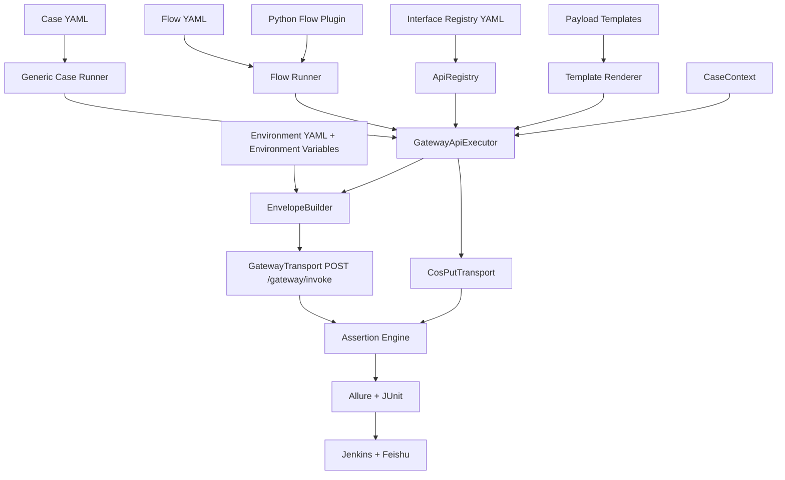

# 配置驱动通用化改造详细设计

> 评审状态：草案，等待用户 Review。本文档通过后再移入 `docs/` 并进入实现阶段。

## 1. 文档目标

本次改造不是重新实现一套普通 REST API 框架，而是围绕项目真实协议，建立一套 **单一 Gateway 地址、配置化业务路由、数据驱动用例、可扩展多接口流程** 的自动化测试框架。

改造后的目标使用方式如下：

1. 普通单接口：增加一条接口配置和一份用例 YAML，不再新增 Python Service 方法。
2. 标准多接口流程：通过 Flow YAML 编排调用、提取、断言和等待。
3. 特殊流程：只有 COS PUT、异步复杂状态机、外部夹具等场景才编写 Python 插件。
4. 所有 Gateway 业务调用统一执行 `POST {gateway_base_url}/gateway/invoke`。
5. 真正调用哪个业务方法，只由 `requests[].service_name`、`requests[].method_name` 和 `requests[].params` 决定。

## 2. 已确认的真实协议

### 2.1 Transport 边界

| Transport | 地址/来源 | HTTP 方法 | 用途 |
|---|---|---|---|
| Gateway | test：`http://gateway.spark-jam.top/gateway/invoke` | `POST` | 除图片二进制外的全部业务接口 |
| COS PUT | `PrepareMediaUpload` 响应中的预签名 `upload_url` | `PUT` | 图片二进制上传 |

框架不再为 Identity、Subscription、Search 等业务分别配置 URL 和 HTTP Method。Gateway URL 和 POST 方法属于环境级固定配置，接口配置只记录业务路由信息。

### 2.2 Gateway 最小请求结构

根据本次补充说明，默认请求根对象由 `comm` 和 `requests` 组成：

```json
{

"comm": {

"auth_token": "anon.dXNlcl8wNTNiZmExZTA0ZWJlNDc3MzFmNTc0YWU.3d7bfbaed6b805014c7b9a74ab36713b",

"user_id": "user_053bfa1e04ebe47731f574ae",

"device_id": "3685c5ab-6b76-48ed-9308-91b8f7143353",

"client_request_id": "crid_1784087090369799",

"platform": "ios",

"app_version": "1.0.3",

"locale": "zh-Hans-CN",

"country": "CN",

"timezone": "UTC+08:00"

},

"requests": [

{

"id": "req_0",

"service_name": "tool.people_insight.SearchService",

"method_name": "GetTask",

"params": {

"task_id": "task_186372c69076f1eabb556a92"

}

}

]

}
```

说明：

- 文档示例只使用占位符，不保存真实 token。
- `auth_token` 是用户登录后获取的 token。
- `comm` 是整个 Gateway envelope 共享的客户端上下文。
- `requests` 是业务子请求数组；每项通过 `service_name + method_name` 路由。
- `params` 只包含该业务方法自己的参数。
- `user_id` 写入 `comm`，用户身份由 `auth_token` + `user_id` + `device_id` 解析。
- 空值字段默认不序列化，避免发送未确认字段。
- 当前接口文档中存在可选 `execution` 对象，但本次用户确认的默认请求结构不包含它。因此目标实现默认只发送 `comm + requests`；只有协议再次确认后才允许通过环境配置显式开启 `execution`。

### 2.3 Gateway 响应和双层结果

目标框架继续按两层结果处理：

```text
HTTP 层
  └── HTTP 2xx：只表示 Gateway 收到并返回 envelope

Gateway 顶层
  ├── code
  ├── message
  ├── request_id
  ├── trace_id
  └── responses[]
        ├── id                # 与 requests[].id 对应
        ├── code
        ├── success
        ├── business_error_code
        ├── http_status
        ├── message
        └── data
```

业务成功必须同时满足：

1. HTTP 状态为 2xx；
2. Gateway 顶层结构有效；
3. 目标 `responses[].id` 能与子请求 ID 对应；
4. 当子响应成功时 `success == true` 且 `code == 0`，"message": "ok"；
5. 当子响应失败时，`success == false` 且 `code != 0`；这时才会有 `business_error_code` 与 `http_status`，`message` 为错误描述。
6. 用例配置的业务字段和 Schema 断言通过。

## 3. 当前实现与目标实现的差距

| 领域     | 当前实现                                  | 目标实现                                                          |
| ------ | ------------------------------------- | ------------------------------------------------------------- |
| 接口管理   | `services/*.py` 中硬编码 Service 和 Method | `data/interfaces/*.yaml` 统一注册                                 |
| 请求地址   | `GatewayClient` 统一拼接，但当前拒绝远程 HTTP     | 环境配置固定 Gateway 地址；test HTTP 必须显式授权                            |
| 请求信封   | 只支持单子请求，且默认带 `execution`              | 默认 `comm + requests`；同时支持单请求和批量请求，先不带execution                |
| `comm` | 代码模型字段较少                              | 使用配置 Schema 管理固定字段、动态字段和可选字段                                  |
| 接口参数   | 写在 Service 方法签名和测试代码中                 | 接口 Schema + Payload 模板 + Case 数据分层管理                          |
| 用例数据   | 大量内嵌在 `test_*.py`                     | `data/cases` 为普通用例数据唯一入口                                      |
| 多接口流程  | 主要写 Python 测试函数                       | 标准流程使用 Flow YAML，复杂流程使用`pytest-yaml`（主要指`pytest-yaml-yoyo`）实现 |
| 通用调用方式 | `service.create_xxx(...)`             | `api_executor.execute("identity.refresh_session", ...)`       |
| 扩展成本   | 新增接口通常需要改 Service 和测试代码               | 普通接口只增加 YAML，不修改框架代码                                          |

### 3.1 是否应该继续改造当前框架

结论：**不建议继续在当前目录结构上做大规模增量改造，建议冻结 V1，并行从最小 V2 重新搭建。**

原因：

1. 当前框架先实现了 8 个业务 Service、多个 Adapter、Flow 和大量 Mock 测试，但通用接口注册、Case YAML 和通用 Driver 尚未成为主链路。
2. Service 方法大多只是把 Python 参数重新组装后调用同一个 `GatewayClient.invoke()`，对于单一 Gateway 协议存在较多重复封装。
3. 当前已有 300 多条测试主要验证框架组件和既有业务流程，数量多不等于新增接口成本低。
4. 如果在原目录内边运行边移动 Service、Data、Tests 和 Core，容易长期保留两套调用方式，进一步增加理解成本。
5. 直接删除全部现有实现也不合适，因为 Gateway 安全策略、脱敏、双层断言、Waiter 和 COS PUT 已经过大量离线测试。

推荐采用“冻结 V1 + 最小 V2 + 按接口迁移”的方式：

```text
V1：只作为行为对照和回归基线，不继续增加普通接口

V2 第一个可运行版本：
  Environment Config
  + Interface Registry
  + Envelope Builder
  + Gateway Transport
  + Generic Executor
  + Case YAML
  + Generic Pytest Driver

验证 GetHomeContent / RefreshSession
  -> 再迁移其他接口
  -> 最后接入 Flow、COS、Jenkins、Allure、飞书
```

### 3.2 V1 代码处理建议

| V1 组件                 | 处理方式                | 原因                      |
| --------------------- | ------------------- | ----------------------- |
| Gateway 请求安全、超时、重试逻辑  | 提取并简化后复用            | 已有较完整安全测试               |
| Pydantic Gateway 响应模型 | 复用并扩展               | 双层响应结构仍然一致              |
| 双层断言                  | 复用                  | 属于协议核心能力                |
| Redactor              | 复用并缩小配置入口           | token、COS URL 脱敏不可缺少    |
| TaskWaiter            | 等搜索流程迁移时再复用         | V2 第一阶段不需要提前引入          |
| COS Client            | 等媒体流程迁移时再复用         | 属于例外 Transport          |
| `services/*.py`       | 普通接口不迁移             | 由 Interface Registry 取代 |
| 现有业务 Flow             | 作为迁移参考，不直接复制        | 优先改成 Flow YAML          |
| Entitlement Adapter   | 有真实协议后再接入           | 当前不是 V2 最小闭环必需项         |
| Jenkins、Allure、飞书     | V2 核心稳定后接入          | 避免 CI 代码干扰最小核心设计        |
| 现有 300 多条测试           | 保留 V1 执行；V2 只迁移有效行为 | 不机械复制内部实现测试             |

### 3.3 V2 第一版代码规模控制

V2 第一阶段只实现以下核心文件，不提前创建未使用模块：

```text
data/
├── environments/env.test.yaml
├── interfaces/home.yaml
├── interfaces/identity.yaml
└── cases/
    ├── home/get_home_content.yaml
    └── identity/refresh_session.yaml

core/
├── config.py
├── models.py
├── registry.py
├── envelope.py
├── gateway.py
├── executor.py
├── assertions.py
├── context.py
└── redactor.py

tests/
├── test_api_cases.py
└── unit/

runtest.py
```

第一阶段不创建 Subscription、Billing、Search、Report、Feedback、Entitlement、Flow、Jenkins 或飞书代码。只有 Home 和 Identity 的通用闭环验证通过后，才按实际接口逐个增加。

## 4. 总体架构



### 4.1 核心原则

- **Gateway 地址只在环境配置中出现一次**，接口配置不允许声明任意 URL。
- **接口定义与用例数据分离**：接口定义描述“怎么路由”，用例数据描述“传什么、期望什么”。
- **动态数据只保存在 CaseContext 内存中**，不回写 YAML，不跨用例共享。
- **普通场景配置化，复杂场景插件化**，不把所有逻辑强行塞进 YAML。
- **执行器统一处理安全、日志、脱敏、断言和报告**，用例不能直接调用 `requests.post()`。

## 5. 推荐目录

```text
Truthy_ApiAutoTest/
├── config/                              # 框架自身行为配置
│   ├── framework.yaml                   # 重试、超时、缓存、报告限制
│   └── log_redaction.yaml               # 脱敏规则
├── data/                                # 所有可版本化的接口与用例数据
│   ├── environments/
│   │   ├── env.test.yaml
│   │   └── env.staging.yaml
│   ├── interfaces/                      # 接口注册中心
│   │   ├── identity.yaml
│   │   ├── subscription.yaml
│   │   ├── billing.yaml
│   │   ├── media.yaml
│   │   ├── search.yaml
│   │   ├── report.yaml
│   │   ├── home.yaml
│   │   └── profile_feedback.yaml
│   ├── payloads/                        # 可复用请求参数模板
│   │   ├── search/
│   │   └── media/
│   ├── cases/                           # 单接口用例数据
│   │   ├── identity/
│   │   ├── subscription/
│   │   ├── search/
│   │   └── ...
│   ├── flows/                           # 多接口流程数据
│   │   ├── identity_refresh_flow.yaml
│   │   ├── subscription_flow.yaml
│   │   └── search_main_flow.yaml
│   ├── schemas/                         # 接口、用例、流程和响应 Schema
│   └── public_samples/                  # 可提交的脱敏公开样例
├── core/                                # 工具与通用框架代码统一入口
│   ├── config/
│   │   ├── settings.py
│   │   └── loader.py
│   ├── registry/
│   │   ├── api_registry.py
│   │   └── models.py
│   ├── execution/
│   │   ├── api_executor.py
│   │   ├── envelope_builder.py
│   │   ├── flow_runner.py
│   │   ├── template_renderer.py
│   │   └── context.py
│   ├── http/
│   │   ├── gateway_transport.py
│   │   ├── cos_put_transport.py
│   │   └── session_factory.py
│   ├── assertions/
│   ├── logging/
│   ├── reporting/
│   ├── notification/
│   ├── waiters/
│   └── adapters/
├── flows/                               # 仅复杂流程的 Python 插件
│   ├── media_upload_flow.py
│   └── search_task_flow.py
├── tests/
│   ├── drivers/
│   │   ├── test_api_cases.py            # 自动发现 data/cases
│   │   └── test_flow_cases.py           # 自动发现 data/flows
│   ├── special/                         # 无法配置化的特殊测试
│   ├── live_safe/
│   └── unit/
├── runtest.py                           # 本地和 Jenkins 唯一运行入口
├── Jenkinsfile
└── README.md
```

### 5.1 为什么不是一个扁平 `utils/` 目录

HTTP、日志、Allure、断言、飞书等确实应该统一归属框架工具层，但不建议全部堆进一个文件夹。目标方案使用 `core/` 作为统一入口，再按职责分包：

- 查找工具代码时只需要进入 `core/`；
- 每个子包职责清晰，避免形成几十个无关联文件的 `utils/`；
- Jenkinsfile 保留根目录，因为 Jenkins 默认从仓库根目录读取它；
- Jenkins 的通知和结果解析代码仍归 `core/notification`、`core/reporting` 管理。

## 6. 环境配置设计

### 6.1 `data/environments/env.test.yaml`

```yaml
environment: test

gateway:
  base_url: http://gateway.spark-jam.top
  invoke_path: /gateway/invoke
  http_method: POST

  # 远程明文 HTTP 只允许 test 环境显式开启，并限制唯一主机。
  allow_insecure_http: true
  allowed_hosts:
    - gateway.spark-jam.top

  connect_timeout_seconds: 5
  read_timeout_seconds: 15
  max_retries: 2

  envelope:
    include_execution: false
    omit_none: true

comm:
  device_id: ${factory.device_id}
  client_request_id: ${factory.client_request_id}
  platform: ios
  app_version: 1.0.3
  locale: zh-Hans-CN
  country: CN
  timezone: UTC+08:00

  # 可选字段未配置时不进入请求体。
  install_id: null
  trace_id: ${factory.trace_id}
  advertising_id: null
  app_package: null
```

### 6.2 敏感字段来源

以下内容禁止写入任何 YAML：

- `auth_token`；
- `refresh_token`；
- 平台支付票据、JWS 和 receipt；
- COS 预签名 URL；
- 飞书 Webhook；
- 真实用户身份信息和私人搜索线索。

敏感值只能来自：

1. Jenkins Credentials / 环境变量；
2. 当前用例前置接口的响应；
3. function-scope fixture；
4. 当前 `CaseContext` 内存。

### 6.3 配置优先级

框架运行配置继续使用：

```text
命令行 > Jenkins 环境变量 > env.<name>.yaml > framework 默认值
```

请求参数合并优先级为：

```text
Flow Step 参数
  > Case request.params
  > Payload Template
  > Interface params.default
```

环境固定 `comm` 字段不能被普通 Case YAML 任意覆盖。允许覆盖的字段必须在接口或运行入口白名单中声明，例如测试 app_version；`auth_token`、目标 URL 和安全开关不能由 Case 数据覆盖。

## 7. `comm` 字段管理

| 字段                  | 来源                         | 生命周期        | 默认规则                            |
| ------------------- | -------------------------- | ----------- | ------------------------------- |
| `device_id`         | DynamicDataFactory         | 每用例或每会话     | 同一会话流程保持不变，不同用例隔离               |
| `client_request_id` | DynamicDataFactory         | 每个逻辑业务调用    | 网络重试复用；创建类接口可镜像到 params         |
| `platform`          | Environment YAML           | 当前环境        | 固定值                             |
| `app_version`       | Environment YAML / CLI 白名单 | 当前执行        | 固定值                             |
| `locale`            | Environment YAML           | 当前执行        | 固定值                             |
| `country`           | Environment YAML           | 当前执行        | 固定值                             |
| `timezone`          | Environment YAML           | 当前执行        | 固定值                             |
| `auth_token`        | CaseContext / Credentials  | 当前会话        | 仅 auth=required/optional 时按策略写入 |
| `trace_id`          | DynamicDataFactory         | 每个 envelope | 用于日志、Allure 和飞书定位               |
| 其他可选字段              | Environment YAML           | 当前执行        | 未配置则省略                          |

### 7.1 `client_request_id` 规则

建议生成格式：

```text
autotest-{build_no}-{case_id}-{operation}-{uuid8}
```

规则：

- 同一次逻辑调用的 HTTP 重试必须复用相同 ID；
- 同一用例验证幂等时必须显式复用相同 ID；
- 不同用例默认生成不同 ID；
- 若某业务方法要求 `params.client_request_id`，接口配置通过 `mirror_to_params` 将同一值写入 params，禁止生成第二个不同值。

## 8. 接口注册中心

### 8.1 接口唯一名称

接口使用稳定逻辑名称：

```text
{domain}.{snake_case_method}
```

示例：

- `identity.create_anonymous_session`
- `identity.refresh_session`
- `subscription.get_entitlement`
- `search.create_intent_task`
- `media.prepare_upload`

测试用例只引用逻辑名称，不直接重复写 `service_name` 和 `method_name`。

### 8.2 `data/interfaces/identity.yaml`

```yaml
version: 1
domain: identity
service_name: tool.identity.IdentityService

interfaces:
  refresh_session:
    method_name: RefreshSession
    description: 刷新当前匿名或登录会话
    transport: gateway
    auth: optional
    safety_level: live_safe

    idempotency:
      comm_client_request_id: generated
      mirror_to_params: false

    params:
      required:
        - refresh_token
      properties:
        refresh_token:
          type: string
          sensitive: true
          source_allowed:
            - context
            - environment

    response:
      required_data_fields:
        - access_token
        - expires_time
        - refresh_token
        - refresh_expires_time
      sensitive_fields:
        - access_token
        - refresh_token
```

接口注册文件只描述：

- `service_name`；
- `method_name`；
- 鉴权要求；
- 安全等级；
- params 的结构和默认值；
- 是否需要稳定幂等 ID；
- 最小响应结构；
- 敏感字段。

接口注册文件不保存：

- 真实 token；
- 某一条测试用例的具体数据；
- 多接口调用顺序；
- 任意 Python 表达式；
- 任意 Gateway 之外的 URL。

### 8.3 注册中心公共接口

```python
class ApiRegistry:
    def get(self, api_name: str) -> ApiDefinition: ...
    def list_by_domain(self, domain: str) -> list[ApiDefinition]: ...
    def reload_if_changed(self) -> None: ...
```

要求：

- 启动或收集测试时一次性加载并校验；
- API 名称重复直接失败；
- 未知字段按配置版本策略处理；
- 文件按路径、修改时间和大小缓存；
- 配置错误在测试收集阶段暴露，而不是运行到一半才失败。

## 9. Payload 与 Case 数据

### 9.1 Payload 模板

Payload 模板用于保存大对象或跨用例复用的请求结构，例如 Search clues：

```yaml
name: search.full_name_location
params:
  match_strategy: UNION
  clues:
    - type: FULL_NAME
      value: ${case.full_name}
    - type: LOCATION
      value: ${case.location}
```

模板只能做变量替换和数据合并，禁止执行 Python、Shell、HTTP 或文件读取。

### 9.2 单接口 Case YAML

```yaml
version: 1
api: identity.refresh_session

cases:
  - id: TC-002-REFRESH-SUCCESS
    title: 刷新会话成功并替换最新 token
    markers:
      - contract
      - p0
      - auth

    preconditions:
      fixtures:
        - anonymous_session

    request:
      params:
        refresh_token: ${context.refresh_token}

    expected:
      gateway:
        http_status: 200
        code: 0
      response:
        request_id: req_0
        code: 0
        success: true
        required_data_fields:
          - access_token
          - expires_time
          - refresh_token
          - refresh_expires_time

    extract:
      context.access_token: responses[0].data.access_token
      context.refresh_token: responses[0].data.refresh_token
```

### 9.3 Case 数据职责

Case YAML 可以管理：

- 用例 ID 和标题；
- markers；
- 请求参数；
- 前置 fixture 名称；
- HTTP、Gateway、业务和 Schema 期望；
- 响应字段提取规则；
- mock 场景的脱敏响应数据。

Case YAML 不管理：

- Gateway URL；
- HTTP Session、重试和超时实现；
- 真实凭据；
- 任意可执行 Python 代码；
- 跨用例共享的 token、task_id、order_id。

## 10. Gateway Envelope 构建

### 10.1 单接口构建过程

```text
api_name
  -> ApiRegistry 获取 service_name/method_name
  -> 合并 interface defaults / payload / case params
  -> TemplateRenderer 解析 ${context.*} 与 ${factory.*}
  -> Param Schema 校验
  -> 生成 req_0
  -> CommBuilder 构造 comm
  -> 生成并冻结 envelope JSON
  -> GatewayTransport POST /gateway/invoke
  -> 网络重试继续复用同一冻结 JSON
```

### 10.2 批量接口构建

框架保留 Gateway 原生 `requests[]` 数组能力：

```python
api_executor.execute_batch(
    calls=[
        ApiCall("identity.get_me", params={}),
        ApiCall("subscription.get_entitlement", params={"product_code": "people_insight"}),
    ],
    context=case_context,
)
```

生成：

```json
{
  "comm": { "...": "..." },
  "requests": [
    {
      "id": "req_0",
      "service_name": "tool.identity.IdentityService",
      "method_name": "GetMe",
      "params": {}
    },
    {
      "id": "req_1",
      "service_name": "tool.subscription.SubscriptionService",
      "method_name": "GetEntitlement",
      "params": {
        "product_code": "people_insight"
      }
    }
  ]
}
```

批量调用约束：

- 所有子请求共享同一个 `comm` 和 `auth_token`；
- request ID 在 envelope 内唯一；
- 响应必须按 `responses[].id` 映射，不能只依赖数组下标；
- 默认禁止把不同安全等级的子请求混在同一 envelope；
- 默认禁止把只读和真实写入请求混在同一 envelope；
- 批量执行顺序和失败中止规则需在 `execution` 协议确认后才启用配置化控制。

## 11. 通用执行器

### 11.1 公共接口

```python
class GatewayApiExecutor:
    def execute(
        self,
        api_name: str,
        *,
        params: dict | None = None,
        payload_ref: str | None = None,
        context: CaseContext,
        request_id: str | None = None,
        client_request_id: str | None = None,
    ) -> GatewayCallResult: ...

    def execute_batch(
        self,
        calls: list[ApiCall],
        *,
        context: CaseContext,
        client_request_id: str | None = None,
    ) -> GatewayBatchResult: ...
```

### 11.2 执行器职责

执行器负责：

1. 查询接口配置；
2. 合并和渲染参数；
3. 校验 params；
4. 构造 `comm + requests`；
5. 根据接口配置决定是否写入 `comm.auth_token`；
6. 生成并保持 request ID、client request ID 和 trace ID；
7. 调用 Gateway Transport；
8. 解析标准响应；
9. 生成脱敏诊断和 Allure 附件；
10. 返回按 request ID 可查询的标准结果。

执行器不负责：

- 判断具体订阅或搜索业务逻辑；
- 自动猜测缺失业务参数；
- 自动调用未在流程中声明的接口；
- 在失败后创建第二个幂等 ID；
- 将动态数据写回 YAML。

## 12. Flow YAML 多接口流程

### 12.1 支持的步骤类型

第一版 Flow DSL 只支持以下受控动作：

| 动作 | 用途 |
|---|---|
| `call` | 调用一个接口配置 |
| `batch` | 在同一 Gateway envelope 中调用多个接口 |
| `extract` | 从响应提取字段到 CaseContext |
| `assert` | 执行声明式断言 |
| `wait` | 使用已注册 Waiter 轮询异步接口 |
| `when` | 基于已提取值执行有限条件分支 |
| `plugin` | 调用白名单 Python 流程插件 |

DSL 禁止 `eval`、任意 import、Shell、SQL 和动态文件访问。

### 12.2 身份刷新流程示例

```yaml
version: 1
id: FLOW-IDENTITY-REFRESH
title: 创建匿名会话后刷新并读取当前用户
markers: [contract, p0, auth]

steps:
  - name: create_session
    call: identity.create_anonymous_session
    params:
      consent_policy_version: "2026-06-01"
    assert:
      business_success: true
    extract:
      context.access_token: responses[0].data.access_token
      context.refresh_token: responses[0].data.refresh_token
      context.user_id: responses[0].data.user_id

  - name: refresh_session
    call: identity.refresh_session
    params:
      refresh_token: ${context.refresh_token}
    assert:
      business_success: true
    extract:
      context.access_token: responses[0].data.access_token
      context.refresh_token: responses[0].data.refresh_token

  - name: get_me
    call: identity.get_me
    assert:
      business_success: true
      equals:
        responses[0].data.user_id: ${context.user_id}
```

### 12.3 异步搜索流程

标准搜索流程可以配置 `call + wait + extract + assert`，但具体状态合法迁移仍由 `TaskWaiter` Python 组件实现：

```yaml
- name: create_task
  call: search.create_intent_task
  payload_ref: search.full_name_location
  extract:
    context.task_id: responses[0].data.task_id

- name: wait_task
  wait:
    waiter: search_task
    api: search.get_task
    id_from: context.task_id
    timeout_seconds: 20
    terminal_states: [SUCCEEDED, NO_RESULT, FAILED]
```

## 13. 图片上传流程

图片上传是唯一不直接 POST Gateway 的请求链：

```text
Gateway: GetMediaUploadConfig
  -> Gateway: PrepareMediaUpload
  -> COS PUT: upload_url + upload_headers + binary body
  -> Gateway: CompleteMediaUpload
```

该流程使用 `media_upload` Python 插件，不把二进制内容或预签名 URL写入 YAML：

```yaml
- name: upload_photo
  plugin: media_upload
  input:
    file_path_from: environment.TEST_MEDIA_PATH
  extract:
    context.media_asset_id: result.media_asset_id
```

安全要求：

- 未提供 `TEST_MEDIA_PATH` 时跳过真实上传；
- 预签名 URL 和签名参数必须完全脱敏；
- 禁止重定向；
- 只允许 HTTPS 预签名 URL；
- 上传文件大小、类型和读取稳定性必须校验；
- Complete 只在 PUT 成功后执行。

## 14. 变量与上下文

### 14.1 变量命名空间

| 命名空间 | 示例 | 说明 |
|---|---|---|
| `env` | `${env.gateway.base_url}` | 环境非敏感配置，只读 |
| `case` | `${case.full_name}` | 当前 Case YAML 数据 |
| `context` | `${context.access_token}` | 当前用例动态数据 |
| `factory` | `${factory.client_request_id}` | 动态生成值 |
| `secret` | `${secret.payment_receipt}` | 仅由 Credentials 提供，禁止输出 |
| `step` | `${step.create_task.task_id}` | 当前 Flow 已完成步骤输出 |

### 14.2 CaseContext 生命周期

- function scope；
- 每个用例独立；
- 支持 token 原子替换；
- 支持 task、candidate、media、order 等动态 ID；
- 敏感字段 `repr=False`；
- 用例结束后清空；
- 不序列化到缓存或测试数据文件。

## 15. 断言配置

### 15.1 通用断言层级

```yaml
expected:
  gateway:
    http_status: 200
    code: 0
  response:
    request_id: req_0
    code: 0
    success: true
    business_error_code: ""
    required_data_fields:
      - access_token
```

支持的第一版声明式断言：

- `equals` / `not_equals`；
- `contains`；
- `exists` / `not_exists`；
- `type`；
- `length`、`min_length`、`max_length`；
- `one_of`；
- `matches`，仅允许受限正则；
- `schema`；
- `business_success` / `business_error`；
- `state_transition`，委托已注册状态机。

复杂业务一致性断言继续保留在 Python assertion plugin 中，禁止在 YAML 写 Python 表达式。

## 16. 用例自动发现与管理

### 16.1 通用 Driver

`tests/drivers/test_api_cases.py` 负责：

1. 扫描 `data/cases/**/*.yaml`；
2. 在 Pytest 收集阶段校验数据；
3. 根据每个 Case 生成参数化测试项；
4. 把 YAML markers 映射为 Pytest marker；
5. 调用 `GatewayApiExecutor`；
6. 执行断言和提取；
7. 使用 Case ID 作为报告唯一标识。

`tests/drivers/test_flow_cases.py` 以相同方式扫描 `data/flows/**/*.yaml`。

### 16.2 新增普通接口的操作步骤

```text
1. 在 data/interfaces/{domain}.yaml 注册 service_name 和 method_name
2. 如参数结构可复用，在 data/payloads 增加模板
3. 在 data/cases/{domain} 增加 Case YAML
4. 执行 python3 runtest.py --suite contract --env test
5. 不修改 Gateway Client，不新增 Service 类，不新增 test 函数
```

### 16.3 什么时候仍然需要 Python

仅以下场景需要 Python：

- 新 Transport，例如不是 Gateway/COS 的新协议；
- 二进制或流式文件处理；
- 有严格时间预算的异步状态机；
- 复杂跨步骤不变量；
- 后端测试夹具适配器；
- 无法安全表达为声明式规则的特殊断言。

## 17. 日志、脱敏、Allure 和飞书

### 17.1 统一事件模型

每次调用只产生结构化、脱敏后的事件：

```text
case_id
step_name
api_name
request_sub_id
gateway_request_id
trace_id
http_status
gateway_code
business_code
elapsed_ms
attempts
safe_request_summary
safe_response_summary
```

禁止记录：

- 原始 `auth_token` / `refresh_token`；
- 完整 COS URL；
- 支付凭据；
- 私人搜索线索；
- 用户 ID 原文；
- 文件二进制内容。

### 17.2 Allure

Allure 展示：

- API 逻辑名称；
- Service / Method；
- 脱敏后的 comm 摘要；
- params 字段名和脱敏值；
- Gateway 顶层结果；
- 目标子响应结果；
- Flow 步骤时间线；
- Task 状态轨迹；
- 失败 case ID、request ID 和 trace ID。

附件继续限制为最大 1 MB。

## 18. HTTP 安全设计

### 18.1 test 环境 HTTP 冲突

当前框架安全策略拒绝远程明文 HTTP，而真实 test Gateway 是：

```text
http://gateway.spark-jam.top/gateway/invoke
```

实现阶段必须在以下两种方案中确认一种：

#### 方案 A：Gateway 提供 HTTPS（推荐）

- 环境配置改为 `https://gateway.spark-jam.top`；
- 保持当前“远程只允许 HTTPS”规则；
- token 不经明文网络传输。

#### 方案 B：test 环境显式允许 HTTP

- 仅 `environment=test` 可开启 `allow_insecure_http: true`；
- 同时要求 `allowed_hosts` 精确包含 `gateway.spark-jam.top`；
- staging/prod 永久禁止此配置；
- Jenkins 日志必须显示“明文 HTTP 风险已显式开启”，但不能显示 token；
- 禁止重定向；
- URL 禁止 userinfo；
- 这只是框架侧风险限制，不能解决 token 在网络中明文传输的问题。

未确认前，不修改当前 Gateway URL 安全策略。

## 19. 安全等级与执行门禁

每个接口注册时声明：

```yaml
safety_level: offline | live_safe | live_write | payment_real | destructive
```

执行器在发起网络请求前统一检查：

- Case 和 Interface 的安全等级取更严格者；
- 普通 YAML 不能降低接口自身等级；
- `live_safe` 需要 `--run-live-safe`；
- `live_write/payment_real/destructive` 不提供自动执行入口；
- 批量 envelope 中只要存在一个高风险请求，整体按最高风险处理；
- 未授权时在网络调用前 skip 或阻断。

## 20. 兼容与迁移策略

本次不在 V1 原结构中继续叠加抽象，也不一次性删除现有实现。采用“V1 冻结、V2 独立搭建、逐接口对照迁移”：

### 阶段 0：冻结和基线

- V1 不再新增普通接口和新的 Service 包装；
- 保存全量离线测试结果和当前目录快照；
- 明确 V2 的独立目录或 Git 分支；
- V1 只承担行为参考和回归对照。

### 阶段 A：协议与配置模型

- 确认 HTTP/HTTPS、安全主机、`execution`、批量语义和 comm 字段；
- 建立 `data/interfaces`、`data/cases`、`data/flows` Schema；
- 建立配置校验测试。

### 阶段 B：Registry 与通用执行器

- 实现 ApiRegistry、TemplateRenderer、EnvelopeBuilder；
- 实现单接口 execute；
- 从现有 GatewayClient 中提取必要的安全、超时、重试和脱敏行为，但不复制其业务依赖；
- 用 `GetHomeContent` 验证新旧调用结果一致。

### 阶段 C：单接口数据迁移

- 先迁移 Identity、Home、Subscription 读取接口；
- 再迁移 Search 参数化契约；
- 通用 Driver 取代重复的 Service 测试函数；
- 每迁移一个接口，都保留新旧结果对照测试。

### 阶段 D：Flow 与特殊插件

- 迁移身份刷新、订阅查询、搜索主链路；
- Media Upload 和 Task Waiter 保留 Python 插件；
- 实现批量 execute_batch，但仅在协议确认后启用 live 测试。

### 阶段 E：CI 切换与旧代码收敛

- Jenkins 切换到通用 Driver；
- Allure 按 Case YAML ID 聚合；
- 删除已经没有消费者的 Service 方法；
- 保留复杂业务 Flow Plugin；
- README 改为“如何新增接口/数据/流程”。

## 21. 测试策略

### 21.1 单元测试

- Interface YAML Schema；
- Case/Flow YAML Schema；
- 变量替换与禁止表达式；
- 参数合并优先级；
- comm 固定字段与动态字段；
- request ID 唯一性；
- client request ID 重试复用；
- response ID 映射；
- HTTP 安全主机和协议门禁；
- 敏感字段脱敏。

### 21.2 Mock 契约测试

- 单子请求成功/业务失败；
- 多子请求部分失败；
- responses 顺序变化但 ID 映射正确；
- 缺少子响应、重复 ID、未知 ID；
- HTTP 3xx/4xx/5xx；
- 非 JSON、结构缺失和新增字段；
- 写接口、支付和危险流程默认零网络。

### 21.3 安全联调

- Home 读取；
- CreateAnonymousSession / RefreshSession / GetMe；
- Subscription 读取；
- 已授权的公开演示搜索；
- COS 上传仍需 `TEST_MEDIA_PATH` 和危险授权。

## 22. 验收标准

改造完成后必须满足：

1. 新增普通 Gateway 接口不修改 Python 框架代码；
2. 新增接口只需 Interface YAML + Case YAML；
3. Gateway URL 只在环境配置中维护一次；
4. 所有业务调用固定 POST `/gateway/invoke`；
5. `service_name/method_name/params` 完全由接口注册和用例数据生成；
6. 默认 envelope 只包含 `comm + requests`，除非配置明确开启已确认扩展；
7. 支持一个 envelope 内 1～N 个子请求；
8. 响应按子请求 ID 映射；
9. token、预签名 URL 和用户标识不进入 YAML、日志或报告；
10. 普通用例、Flow 和 Jenkins 使用同一 `runtest.py`；
11. 现有安全 marker 和危险门禁不弱化；
12. 现有离线测试和已迁移用例全部通过。

## 23. 需要用户确认的事项

以下事项会影响实现，详细设计通过前需要确认：

1. **test Gateway 是否确实只能使用 HTTP？** 是否可以提供 HTTPS 地址？
2. 如果只能 HTTP，是否确认采用“test 环境显式允许 HTTP + 精确主机白名单”的方案？
3. **请求根对象是否默认严格只有 `comm + requests`？** 当前接口文档中的 `execution` 是否不需要发送？
4. `requests` 数组是否已经支持一次发送多个业务子请求？多请求是顺序执行还是并行执行？
5. 多请求中某一项失败后，后续项是否继续执行？如果没有 `execution`，服务端默认规则是什么？
6. `responses[].id` 是否保证与 `requests[].id` 一一对应且唯一？
7. 子请求 ID 是否固定使用 `req_0/req_1`，还是允许任意字符串？
8. `comm.client_request_id` 是否每次请求都必传，还是只在创建类接口必传？
9. 创建类接口中，`comm.client_request_id` 与 `params.client_request_id` 是否必须使用相同值？
10. `comm.country` 是否为正式支持字段？当前客户端接口文档未列出该字段，但真实请求示例包含它。
11. test 环境固定值是否确认为：`platform=ios`、`app_version=1.0.3`、`locale=zh-Hans-CN`、`country=CN`、`timezone=UTC+08:00`？
12. 自动化测试的 `device_id` 希望每个用例动态生成，还是固定使用一个测试设备 ID？
13. `RefreshSession` 是否完全不需要 `comm.auth_token`，只在 params 传 refresh token？
14. 是否同意使用受限变量语法 `${namespace.field}`，并禁止 YAML 中执行 Python 表达式？
15. 是否同意普通单接口由通用 Driver 自动发现，复杂场景才保留 Python 用例？

## 24. 敏感凭据说明

本次沟通中出现过一段真实格式的 refresh token。该值不会写入本文档或项目文件。为了避免凭据被误用，建议立即在服务端使其失效并重新生成测试凭据。
