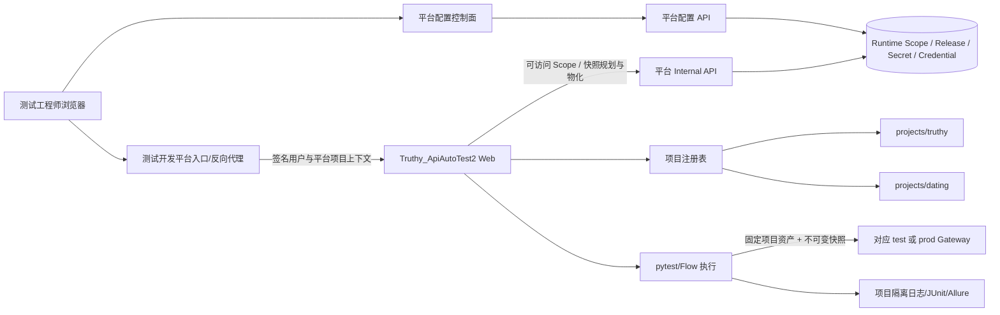
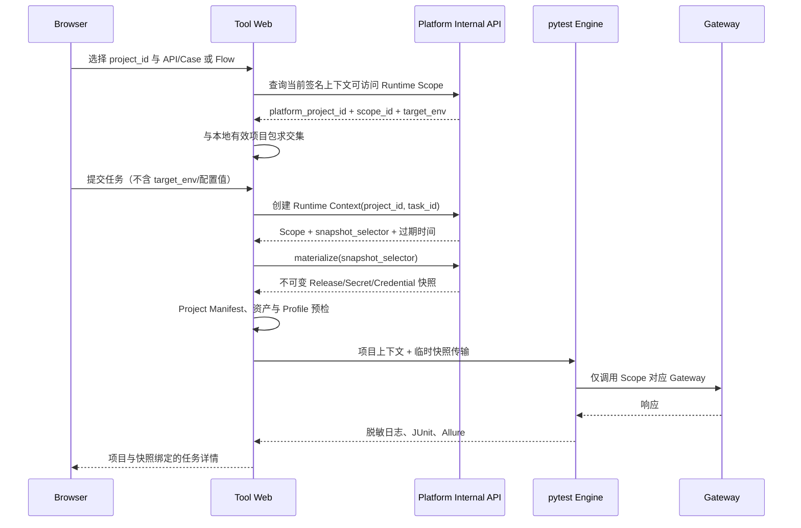

# Gateway 通用接口自动化多项目支持与 Dating 接入详细开发设计与实施计划

> **For agentic workers:** REQUIRED SUB-SKILL: Use superpowers:subagent-driven-development (recommended) or superpowers:executing-plans to implement this plan task-by-task. Steps use checkbox (`- [ ]`) syntax for tracking.

**Goal:** 在保留现有 Gateway 执行能力和测试开发平台接入能力的基础上，把 `Truthy_ApiAutoTest2` 改造成集中式多项目接口自动化工具，完成 Truthy 标准化迁移、Dating test 首期接入、七类 Web 页面以及平台 Runtime Scope 控制面建设。

**Architecture:** 测试开发平台是运行配置、Release、Secret/Credential、身份权限与 Runtime Scope 的唯一真源；`Truthy_ApiAutoTest2/projects/<project_id>/` 是 API、Case、Flow、Scenario 与 fixture 测试资产的唯一真源。平台通过版本化 Runtime Scope/快照契约向工具下发不可变运行配置；工具在当前项目上下文中收集、执行并隔离任务、日志和报告。

**Tech Stack:** Python 3、pytest、Flask/Jinja2/原生 JavaScript、YAML、FastAPI、SQLAlchemy、Alembic、React/TypeScript/Vite、Jenkins、JUnit、Allure。

**Spec:** [`接口自动化多项目支持与Dating接入-PRD.md`](./接口自动化多项目支持与Dating接入-PRD.md) V1.3；视觉基线为 `/Users/admin/Testproject/design-reference/接口自动化工具 (1).png`。

## Global Constraints

- Dating 当前只有 `test` 和未来的 `prod`，不存在 `staging`。
- dev 平台只能解析 `target_env=test`；prod 平台只能解析 `target_env=prod`。
- 工具 Web 不提供接口环境切换，不接收可覆盖环境、Gateway、超时、轮询或 Secret 的表单字段。
- 平台配置模式必须 fail-closed；不得从根 YAML、项目 YAML、`.env` 或进程环境变量回退运行值。
- 工具内不建设“项目配置”“配置状态”“配置异常”独立页面；运行问题只在概览和任务提交位置内联提示，并深链到平台配置中心。
- 接口自动化页面、项目资产、任务 API、任务状态机、执行、日志与报告仍位于 `Truthy_ApiAutoTest2`；平台只承载入口、身份、RBAC、Runtime Scope 和配置控制面。
- 不为 Dating 复制执行引擎，不以配置键前缀或伪 Tool ID 模拟项目隔离。
- 本文中的界面示例数据只用于说明布局；实际 API、Case、Flow、Profile、Release、数量和状态必须由项目包与平台快照动态返回。

---

## 1. 文档信息

| 项目 | 内容 |
| --- | --- |
| 文档版本 | V1.0 |
| 日期 | 2026-08-27 |
| 状态 | 可执行开发基线 |
| 对应 PRD | `Gateway 通用接口自动化多项目支持与 Dating 首期接入 PRD` V1.3 |
| 代码范围 | `Truthy_ApiAutoTest2/`、`test-platform/` |
| 视觉范围 | 最新截图中的七类工具页面、平台配置控制面和 DEV/TEST、PROD/PROD 环境标识 |
| 不包含 | Figma 文件编辑、在线 YAML 编辑、跨项目 Flow、任务草稿、任意环境切换、队列系统重构 |

### 1.1 成功标准

1. dev 平台可分别选择并执行 Truthy/test 与 Dating/test，且运行配置、Credential、会话、资产、任务、日志和报告不串用。
2. prod 平台只解析各项目 prod Scope；dev 页面没有任何切换到 prod 的入口。
3. Dating 用例库展示 PRD 定义的 11 个 Gateway API，并可执行 P0 单接口和两个 P0 Flow。
4. Web 七类页面均由 Flask/Jinja2 壳服务提供，在 `/api-autotest` Base Path 下直接访问和刷新无 404。
5. 平台配置中心按 Runtime Scope 编辑、校验、发布、回滚 Release，并管理 Scope 绑定的 Secret/Credential。
6. 第三个 fixture 项目仅新增项目包和平台数据，不修改公共执行分支即可被发现、预检和执行。

---

## 2. 设计输入与优先级

实现冲突按以下顺序裁决：

1. 用户最新明确说明：只有 test/prod；dev→test、prod→prod；配置由平台统一管理；工具没有配置异常页。
2. PRD V1.3：功能范围、职责边界、数据口径、错误码和验收标准。
3. 最新界面截图：页面布局、信息层级、控件位置和视觉表现。
4. 现有代码：复用既有 Flask 壳服务、任务状态机、平台 Runtime Context、配置 Release、Secret/Credential 和视觉 Token。

截图中的文字和样例不是接口协议或测试数据指令。特别是 REST 路径、Profile 名、任务 ID 和统计数字不能直接硬编码到实现。

---

## 3. 当前实现基线与差距

### 3.1 可复用能力

| 当前能力 | 现有位置 | 复用方式 |
| --- | --- | --- |
| Gateway API/Case/Flow YAML 加载 | `utils/custom/api_loader.py`、`case_loader.py`、`flow_loader.py` | 参数化项目根目录，不复制加载器 |
| Flow 执行、轮询、终止清理和媒体 PUT | `utils/custom/flow_runner.py` | 保留状态机，将旧媒体动作升级为通用签名上传动作 |
| Flask Base Path 壳服务 | `web/app.py` | 扩充页面与 API，继续使用 Blueprint `url_prefix` |
| 任务启动、取消、超时、恢复 | `web/task_manager.py` | 增加项目、Scope、快照与测试资产选择，不重写执行状态机 |
| 任务 JSON、JUnit、Allure、脱敏日志 | `web/task_store.py`、`junit_report.py`、报告脚本 | 增加项目目录与不可变快照元数据 |
| 平台 Runtime Context/快照规划与物化 | `test-platform/backend/app/api/internal.py` | 从工具级配置扩展为 Scope 级配置 |
| 平台 Release、Secret、Credential | `models/configuration.py`、`api/configuration.py` | 复用 owner 模型并新增 Runtime Scope 绑定 |
| 平台配置控制面 | `frontend/src/App.tsx` 的 `ConfigPage` | 增加 Scope 选择器，不在工具内复制页面 |
| Apple-inspired 视觉 Token | `test-platform/web/styles.css` | 工具 CSS 使用同名角色 Token，保持跨服务一致 |

### 3.2 必须解决的差距

| 差距 | 当前表现 | 目标 |
| --- | --- | --- |
| 项目资产路径 | 加载器固定读取根 `data/` | 只读取 `projects/<project_id>/data/` |
| CLI | 只有 `--env/--module/--tag/--flow` | 增加 `--project/--target-env/--config-source/--api/--case` |
| 单接口选择 | Web 只能提交 `run_type=single` 和 tag | 可精确选择 API + Case |
| Web 页面 | 仅首页、用例库、任务详情 3 个模板 | 落地七类页面及统一侧栏/页头 |
| 模板复用 | 3 个模板分别内联 CSS/JS，无 Jinja 继承 | 公共 `base.html`、统一静态 CSS/JS |
| 任务字段 | 输入仅 `env/run_type/flow/tag` | 固化项目、平台环境、接口环境、Scope、Release、Profile 和资产快照 |
| 平台配置作用域 | Release/Secret 仅按 `environment + owner(tool)` | Release/Secret 归属 `tool_project_scope` |
| Credential 作用域 | 仅 `tool + environment + provider` | 增加 `runtime_scope_id`，同名 Profile 跨项目隔离 |
| Runtime Context | 快照只验证工具级 Release | 解析并验证唯一 Runtime Scope |
| 配置来源 | 仍有 YAML/`.env` 合并和继承进程环境 | 平台模式只读取一次物化快照；本地模式显式隔离 |
| Dating 资产 | 尚无标准项目包 | 建立 11 API、P0 Cases、P0 Flows 与 fixture 契约 |

---

## 4. 最新界面稿评审结论与实现修正

### 4.1 总体结论

最新截图已经符合 PRD 的主要信息架构：工具页面不含配置菜单；环境以只读徽标展示；项目切换、单接口任务、Flow 任务、用例库、任务记录和任务详情被拆分；平台配置控制面单独存在。

开发时不能逐字复制截图中的样例数据，必须执行以下修正：

| 截图位置 | 风险或冲突 | 开发规则 |
| --- | --- | --- |
| Dating 用例库 | 截图展示 `/api/v1/profile` 等 REST 路径，与 PRD Gateway 协议不符 | 展示 API ID、名称、`service_name`、`method_name`、Profile；Dating 必须是 PRD 的 11 个方法 |
| 单接口任务 | 截图接口示例为 `GET /api/v1/profile` | 表单值使用项目包 API ID；只在资产确有展示路径时附加显示，不能用 REST 路径替代 Gateway 方法 |
| Profile | 截图出现 `dating-user`、`dating-admin-ready` | Profile 从 Manifest/Case/Flow 解析；P0 Dating 默认使用 `anonymous_session`，不得硬编码或错误要求 Truthy Admin |
| 项目上下文 | 截图将 Runtime Scope 简写为 `dating.test` | UI 可显示易读短名，但 title/详情必须展示稳定 `scope_id`、平台项目、项目、target_env 和 Release |
| 任务 ID | 截图示例缺少随机后缀 | 保留现有全局唯一格式 `YYYYMMDD-HHMMSS-xxxx`，避免并发碰撞 |
| 单接口页面 | 截图有“保存草稿” | P0 删除任务草稿按钮；平台配置页的 Release 草稿不受影响 |
| 任务记录 | 截图包含 `Search` 等示例项目 | 正式页面只显示授权 Scope 与本地项目包的交集；fixture 项目仅在 dev/test 验收模式展示 |
| 配置控制面 | 截图只有工具选择，无法区分 Truthy/Dating | 平台页增加平台项目、工具项目、接口环境/Scope 选择；DEV 下接口环境固定 TEST |
| 配置字段 | 截图使用 `GATEWAY_API_URL`、`ADMIN_LOGIN_API_URL` | 页面展示中文名称和逻辑键，如 `gateway.base_url`；环境变量名只属于兼容适配层 |
| 任务详情重试 | 容易误解为复用旧配置 | 重试创建新任务，重新解析当前 Scope/Release/Profile；原任务快照保持不变并记录 `retry_of` |

### 4.2 页面导航与路由

| 页面 | 工具路由 | 侧栏状态 | 说明 |
| --- | --- | --- | --- |
| 概览 | `/` | 概览 | 统计、运行上下文、快速开始、最近任务 |
| 切换项目 | `/projects` | 概览下的项目入口或页头项目选择器 | 展示授权项目与 Scope 摘要，不编辑配置 |
| 创建单接口任务 | `/tasks/new/single` | 执行任务 | 精确选择 API/Case |
| 创建 Flow 任务 | `/tasks/new/flow` | 执行任务 | 展示真实步骤、轮询/超时和终止清理 |
| 用例库 | `/catalog` | 用例库 | API/Case/Flow 三标签只读目录 |
| 任务记录 | `/tasks` | 任务记录 | 全部项目/当前项目作用域、筛选和分页 |
| 任务详情 | `/tasks/<task_id>` | 任务详情 | 仅在具体任务路由激活，不提供无任务的空详情页 |

所有链接和静态资源必须通过 `url_for` 或 `window.__BASE_PATH__` 生成，禁止硬编码 `/` 或 `/api-autotest`。

### 4.3 视觉与可用性约束

- 继续使用平台现有角色色：canvas `#f5f5f7`、surface `#ffffff`、text `#1d1d1f`、accent `#0071e3`、success `#248a3d`、warning `#8a4a00`、danger `#d70015`。
- 使用现有 10px 控件圆角、16px 容器圆角和克制阴影；状态卡与表格优先边框分层，不把每个文本块都做成卡片。
- 桌面优先，按 1440px 设计；常用 1280px 宽度必须完整可操作。更窄宽度允许表格受控横向滚动，但项目、状态和操作列不能消失。
- 所有输入有 `<label>`，按钮有文本；可见 `:focus-visible`；状态同时包含图标/文本和颜色；错误区域使用 `role="alert"`。
- 加载、空数据、无权限、平台不可用、项目包缺失和 Scope 禁用不能共用一个泛化空状态。
- 项目选择保存在 URL 查询参数或服务端可信会话状态中；刷新可恢复，切换项目会清空不兼容的 API/Case/Flow/tag 选择。

---

## 5. 总体架构



### 5.1 职责边界

| 能力 | 测试开发平台 | `Truthy_ApiAutoTest2` |
| --- | --- | --- |
| 登录、RBAC、平台项目上下文 | 唯一实现 | 消费签名上下文，不自建账号体系 |
| Runtime Scope | 创建、启停、授权、审计 | 查询、选择、校验、固化，不编辑 |
| Release/Secret/Credential | 编辑、发布、回滚、加密与生命周期 | 只读取物化快照和非敏感状态 |
| 项目 Manifest 与测试资产 | 不存储、不编辑 | 唯一实现与版本管理 |
| 七类接口自动化页面 | 只提供入口和代理 | 唯一实现 |
| 任务状态机、执行、取消、结果 | 不复制 | 唯一实现 |
| 日志/JUnit/Allure | 授权代理或链接 | 生成、隔离、脱敏、绑定任务 |

### 5.2 核心运行链路



---

## 6. 平台 Runtime Scope 与配置设计

### 6.1 数据模型

在 `test-platform/backend/app/models/configuration.py` 新增通用表 `tool_project_scopes`：

| 字段 | 类型/约束 | 说明 |
| --- | --- | --- |
| `id` | `String(64)` PK | 建议 `tps_<uuid>`，创建后不可变 |
| `environment_id` | FK `environments.id` | 平台环境：`dev` 或 `prod` |
| `tool_id` | FK `tools.id` | 本工具为 `api-autotest` |
| `platform_project_id` | FK `projects.id` | 平台 RBAC 项目主键 |
| `project_id` | `String(32)` | 工具项目键，如 `truthy`、`dating` |
| `target_env` | `String(16)` | 接口环境：`test` 或 `prod` |
| `display_name` | `String(128)` | 平台可覆盖展示名，不改变 `project_id` |
| `status` | `active/disabled` | 禁用后禁止新任务，历史任务仍可读 |
| `is_default` | Boolean | 兼容期默认项目；同一平台项目/工具/环境最多一个 |
| `revision` | Integer | 乐观锁 |
| `created_by/updated_by` | `String(64)` | 审计主体 |
| `created_at/updated_at` | timezone datetime | 审计时间 |

数据库约束：

1. 唯一键：`environment_id + tool_id + platform_project_id + project_id + target_env`。
2. 环境映射检查：只允许 `dev/test` 或 `prod/prod`。
3. `project_id` 满足 `^[a-z][a-z0-9-]{1,31}$`。
4. 默认 Scope 使用部分唯一索引，避免同一上下文多个默认项目。
5. 不物理删除已被任务、Release 或审计引用的 Scope，只允许禁用。

### 6.2 Release 与 Secret 绑定

复用现有通用 owner 模型：

- `ConfigDefinition` 继续归属 `owner_type=tool, owner_id=api-autotest`，描述工具支持的逻辑配置键和类型。
- `ConfigRelease`、`ConfigActivation`、`Secret` 改为归属 `owner_type=tool_project_scope, owner_id=<scope_id>`。
- 配置 API 在 owner 为 Scope 时，校验 Release Item/Secret 使用的 Definition 必须属于该 Scope 的 `tool_id`。
- 配置发布只做类型、引用和 Scope 一致性校验；项目/资产的条件化 `required_keys` 由工具预检根据 Manifest 和本次目标判断。
- 旧的工具级 `api-autotest` Release/Secret 只用于一次迁移，不进入新任务选择路径。

平台配置字段使用逻辑键，例如：

```text
gateway.base_url
gateway.path
gateway.method
gateway.headers
gateway.comm
request.timeout_seconds
flow.analysis.poll_interval_seconds
flow.analysis.timeout_seconds
upload.timeout_seconds
```

不得新增 `DATING_TEST_*`、`TRUTHY_TEST_*` 等前缀键。

### 6.3 Credential 绑定

`Credential` 和 `UserCredential` 增加可空 `runtime_scope_id`：

- 对 `api-autotest` 新写入和新执行，`runtime_scope_id` 必填。
- 非多项目旧工具允许暂时为 `NULL`，避免一次改动破坏无关工具。
- 删除旧的全局唯一约束后，以部分唯一索引分别保证：
  - legacy：`tool_id + environment_id + provider_type`，条件 `runtime_scope_id IS NULL`；
  - scoped：`runtime_scope_id + provider_type`，条件 `runtime_scope_id IS NOT NULL`；
  - 用户凭证 scoped：`user_id + runtime_scope_id + provider_type`。
- Session write-back 必须从 Runtime Context 取得 `scope_id`，只能更新该用户、该 Scope、该 Profile 的版本。
- 快照和任务记录只暴露 Profile、状态、版本和过期时间，不暴露值、长度、掩码、指纹或存在于其他 Scope 的信息。

### 6.4 Scope 迁移

新增迁移：

`test-platform/backend/alembic/versions/20260827_0021_add_tool_project_scopes.py`

升级步骤：

1. 创建 `tool_project_scopes` 及索引/约束。
2. 给 Credential 表增加 `runtime_scope_id` 和新索引。
3. 创建 Truthy/dev/test Scope，但默认先不激活新读取路径。
4. 对能人工确认属于 Truthy 的现有 `api-autotest` Release、Activation、Secret、Credential 绑定/迁移到 Truthy Scope，保留版本和审计字段。
5. 无法确认归属的数据保留但不激活，并输出迁移审计记录。
6. 新代码切换为 Scope 读取后，停止工具级 fallback。
7. Dating Scope/Release/Credential 通过平台配置中心新建，不复制 Truthy Credential。

Downgrade 只撤销新 Scope 引用和新结构，不删除旧工具级记录；已经创建的 scoped 敏感版本必须由运维明确处理，迁移脚本不得静默覆盖。

---

## 7. 平台 API 契约

### 7.1 管理端 Runtime Scope API

所有路径位于平台 API Base URL 下：

```http
GET    /runtime-scopes?tool_id=api-autotest&environment_id=dev&platform_project_id=<id>&status=active
GET    /runtime-scopes/<scope_id>
POST   /runtime-scopes
PATCH  /runtime-scopes/<scope_id>
```

创建请求：

```json
{
  "environment_id": "dev",
  "tool_id": "api-autotest",
  "platform_project_id": "project_dating",
  "project_id": "dating",
  "target_env": "test",
  "display_name": "Dating",
  "is_default": false
}
```

服务端忽略任何客户端派生的环境映射结果并自行校验。更新仅允许修改 `display_name/status/is_default/revision`，唯一身份字段不可变。

### 7.2 配置 API 复用规则

现有 Release/Secret API 继续使用，但 owner 改为：

```json
{
  "environment_id": "dev",
  "owner_type": "tool_project_scope",
  "owner_id": "tps_xxx"
}
```

平台必须在查询、创建草稿、校验、发布、回滚、Secret 替换和 Promote 时验证：

- Scope 属于同一 `environment_id`；
- 操作者拥有平台项目和配置权限；
- Definition 属于 Scope 对应工具；
- Promote 只复制普通配置为目标 Scope 草稿，不复制或激活 Secret/Credential；
- prod Scope 必须预先存在且目标环境为 prod。

### 7.3 Internal Scope 列表

```http
GET /internal/tools/api-autotest/runtime-scopes
Authorization: Bearer <tool-client-token>
X-Platform-User-Context: <signed-context>
```

返回当前平台实例、签名用户和当前平台项目可访问的 Scope 元数据，不包含配置值：

```json
{
  "items": [
    {
      "scope_id": "tps_dating_dev_test",
      "platform_project_id": "project_dating",
      "project_id": "dating",
      "display_name": "Dating",
      "platform_environment": "dev",
      "target_env": "test",
      "status": "active",
      "is_default": false,
      "active_release": {"id": "rel_x", "version": 3, "status": "active"},
      "management_url": "/settings/config?scope_id=tps_dating_dev_test"
    }
  ]
}
```

`management_url` 由平台生成；工具不拼接 Secret 或配置值。平台打开深链时再次执行 RBAC。

### 7.4 Runtime Context 与快照

扩展现有请求：

```http
POST /internal/tools/api-autotest/runtime-contexts
X-Platform-User-Context: <signed-context>

{
  "resource_type": "task",
  "resource_id": "20260827-142301-a1b2",
  "project_id": "dating"
}
```

平台从工具客户端确定 `platform_environment`，从签名上下文确定用户和平台项目，从固定映射确定 `target_env`，再解析唯一 Scope。浏览器和工具均不能提交这些字段覆盖结果。

`RuntimeContextResponse` 新增：

```json
{
  "runtime_context_id": "rtx_x",
  "expires_at": "2026-08-27T15:00:00+08:00",
  "runtime_scope": {
    "scope_id": "tps_dating_dev_test",
    "platform_project_id": "project_dating",
    "project_id": "dating",
    "platform_environment": "dev",
    "target_env": "test"
  },
  "snapshot_selector": {
    "runtime_scope_id": "tps_dating_dev_test",
    "release_id": "rel_x",
    "system_secret_versions": {},
    "credential_versions": {}
  }
}
```

物化接口必须验证 selector 中所有 Release、Secret 和 Credential 均属于同一 Scope。响应增加 `config_source=platform` 和 Scope 元数据。`config-ack` 也按 Scope 的 Activation 校验，不再查工具级 Activation。

---

## 8. 工具项目包与执行上下文设计

### 8.1 目录

```text
Truthy_ApiAutoTest2/
├── projects/
│   ├── truthy/
│   │   ├── project.yaml
│   │   ├── data/{api,apis,cases,flows,scenarios}/
│   │   └── fixtures/
│   └── dating/
│       ├── project.yaml
│       ├── data/{api,apis,cases,flows,scenarios}/
│       └── fixtures/
├── runtime/<project_id>/<task_id>/
├── logs/<project_id>/<target_env>/
├── reports/task-reports/<project_id>/<task_id>/
└── tasks/<task_id>.json
```

根 `data/` 在 Truthy 迁移验收后删除，不同时扫描新旧目录。项目运行配置不进入 `projects/<project_id>/env/`。

### 8.2 `ProjectRegistry`

新增 `utils/custom/project_registry.py`，包含：

- `ProjectManifest`：不可变 dataclass，保存 schema、ID、展示名、能力、配置契约和脱敏扩展。
- `ProjectPackage`：Manifest 与已验证项目根路径。
- `ProjectRegistry.discover(projects_root)`：只扫描一级目录，按 ID 排序。
- `ProjectRegistry.get(project_id)`：安全解析，拒绝 `/`、`..`、绝对路径和符号链接越界。
- `validate_project_package(package)`：检查 Manifest schema、目录、API/Case/Flow/Scenario 引用、能力和 fixture 边界。

发现失败不能跳过并继续执行该项目。列表 API 可返回该包 `package_status=invalid` 和仓库相对错误；任务提交必须失败为 `PROJECT_CONFIG_INVALID`。

### 8.3 运行上下文

扩展 `utils/custom/runtime_context.py`，新增不可变元数据：

```python
ProjectRuntimeContext(
    project_id,
    project_root,
    platform_project_id,
    platform_environment,
    target_env,
    runtime_scope_id,
    config_source,
    release_id,
    release_version,
    credential_profiles,
)
```

所有加载器和 FlowRunner 接收此上下文或其中的 `project_root`，不再自行回到仓库根寻找资产。路径解析统一调用一个 `resolve_project_path()`，解析后必须仍位于项目根内。

### 8.4 配置来源分离

`config_loader.load_settings()` 改为显式二选一：

- `config_source=platform`：只读取 TaskManager 物化的版本化快照；不加载环境 YAML、`.env` 或继承的配置环境变量。
- `config_source=local`：用于显式独立调试，按本地规则读取；页面/日志醒目标记 LOCAL，不从平台入口开放。

平台快照跨 pytest 子进程使用任务专属临时文件传输：

1. TaskManager 在 `runtime/<project>/<task>/` 创建 mode `0600` 的快照文件。
2. 子进程只接收 `APIAUTOTEST_CONFIG_SOURCE=platform` 和 `APIAUTOTEST_RUNTIME_SNAPSHOT_FILE=<受控路径>`。
3. loader 校验 schema、task/project/scope 一致性后一次读入内存。
4. 任务终态删除快照文件；启动恢复时清理无活跃任务的残留文件。
5. 任务 JSON、日志和报告不保存快照明文；只保存非敏感 selector/版本元数据。

这是一种短生命周期 IPC，不是可编辑本地配置，也不能作为平台失败时的回退。

### 8.5 CLI

目标命令：

```bash
python runtest.py --project dating --target-env test --config-source local --api GetMe --case get_me_success
python runtest.py --project dating --target-env test --config-source local --flow single_image_analysis_happy_path
python runtest.py --project truthy --target-env test --config-source local --tag smoke
```

兼容规则：

- `python runtest.py --env test` 映射为 `--project truthy --target-env test` 并输出弃用警告。
- 旧 Jenkins 未传 `PROJECT_ID` 时补 `truthy`。
- 平台模式 `--target-env` 仅作断言，必须等于快照的 target_env；不能用于切换环境。
- `--api` 与 `--case` 必须属于同一项目；`--case` 不能脱离 `--api`。
- `--flow` 与 `--api/--case` 互斥。
- `--validate-projects` 只做静态校验，不发业务网络请求。

---

## 9. Dating 首期资产设计

### 9.1 Manifest

`projects/dating/project.yaml`：

```yaml
schema_version: 1
project_id: dating
display_name: Dating AI Assistant
capabilities:
  - gateway
  - signed_binary_upload
config_contract:
  required_keys:
    - gateway.base_url
    - gateway.path
    - gateway.comm
    - flow.analysis.poll_interval_seconds
    - flow.analysis.timeout_seconds
  credential_profiles:
    - anonymous_session
redaction:
  extra_keys: []
```

Manifest 不包含 test/prod、URL、Token、Secret、超时值或默认 Scope。

### 9.2 11 个 API

| API ID | Service | Method | Profile |
| --- | --- | --- | --- |
| `CreateAnonymousSession` | `tool.identity.IdentityService` | `CreateAnonymousSession` | public |
| `RefreshSession` | `tool.identity.IdentityService` | `RefreshSession` | `anonymous_session` |
| `GetMe` | `tool.identity.IdentityService` | `GetMe` | `anonymous_session` |
| `GetMediaUploadConfig` | `tool.dating.DatingMediaService` | `GetMediaUploadConfig` | `anonymous_session` |
| `PrepareMediaUpload` | `tool.dating.DatingMediaService` | `PrepareMediaUpload` | `anonymous_session` |
| `CompleteMediaUpload` | `tool.dating.DatingMediaService` | `CompleteMediaUpload` | `anonymous_session` |
| `CreateAnalysisTask` | `tool.dating.DatingAssistantService` | `CreateAnalysisTask` | `anonymous_session` |
| `GetAnalysisTask` | `tool.dating.DatingAssistantService` | `GetAnalysisTask` | `anonymous_session` |
| `GetAnalysisResult` | `tool.dating.DatingAssistantService` | `GetAnalysisResult` | `anonymous_session` |
| `DeleteTaskData` | `tool.dating.DatingAssistantService` | `DeleteTaskData` | `anonymous_session` |
| `GetQuotaStatus` | `tool.subscription.SubscriptionService` | `GetQuotaStatus` | `anonymous_session` |

禁止实现 `GetTask` 或 `GetTaskResult` 的公共引擎兼容分支。

### 9.3 Flow 名称与步骤

P0：

- `anonymous_session_refresh`：CreateAnonymousSession → GetMe → RefreshSession → GetMe。
- `single_image_analysis_happy_path`：创建/复用会话 → 上传配置 → 准备上传 → 通用签名 PUT → 完成上传 → 创建任务 → 轮询 GetAnalysisTask → 成功后 GetAnalysisResult → DeleteTaskData → 验证删除后不可访问。

P1：

- `nine_image_boundary`。
- `analysis_failure_terminal`。
- `create_analysis_idempotency`。

`run_on_termination` 的清理步骤必须在 UI 明示“终止后仍执行”。轮询间隔和总超时只取当前 Release；公共引擎没有 Dating 常量。

### 9.4 通用签名上传

将现有 `prepared_media_upload` 实现抽象为注册动作 `signed_binary_upload`：

- 输入：签名 URL、允许的 Header、fixture 相对路径、内容类型、可选长度。
- URL/Header 从前置 API 的提取结果获取；fixture 只能来自当前项目包。
- 限制允许的 HTTP 方法为配置声明值，P0 为 PUT；不转发 Gateway 身份 Header。
- 日志只记录域名、状态码、耗时和脱敏错误，不记录查询签名或完整 URL。
- 签名过期、外部 4xx/5xx、超时统一归类 `EXTERNAL_UPLOAD_FAILED`，保留稳定子原因。
- 迁移期旧动作名可映射到新注册动作并告警；项目资产迁移完成后删除别名。

---

## 10. Web 页面与业务 API 设计

### 10.1 公共页面骨架

新增 `web/templates/base.html` 和 `web/static/app.css`、`web/static/app.js`：

- `base.html` 负责平台页头、只读环境徽标、项目快速选择、侧栏、主内容、全局错误和 Base Path 注入。
- 各页面使用 Jinja block；不引入 React/Vue 或新 UI 依赖。
- `app.js` 按 `body[data-page]` 初始化页面，公共封装只包含 Base Path fetch、错误展示、项目状态保存和 HTML 转义。
- 敏感值永不进入模板、DOM、浏览器存储或 URL。

### 10.2 七类页面

#### 概览

- 统计：今日任务、接口用例数、最近成功耗时；数据来自任务与当前目录。
- 当前运行上下文卡：`平台 DEV → 接口 TEST`、项目、Scope 短名、Release、Profile 总体状态。
- 快速开始：单接口/Flow 按钮、当前 Scope 和 Release 只读摘要。
- 最近任务：项目、类型、状态、相对时间；跨项目数据取决于列表作用域权限。
- Scope/Release/Profile 异常在卡片原位展开，并显示平台返回的管理深链。

#### 切换项目

- 列表来源为“平台授权且启用 Scope”与“有效本地项目包”的交集。
- 每项显示展示名、项目 ID、API/Case/Flow 数、target_env、Scope 状态。
- 右侧上下文显示平台、接口环境、Scope、Release、Profile；不显示或编辑配置值。
- Scope 有、项目包无：`PROJECT_PACKAGE_NOT_FOUND`，责任方为工具版本/部署。
- 项目包有、Scope 无：`RUNTIME_SCOPE_NOT_FOUND`，责任方为平台配置中心。

#### 创建单接口任务

- 字段：项目（只读当前选择）、API、Case、可选 tag。
- Case 下拉随 API 联动，只显示当前项目资产。
- 右侧预览展示 Scope、Release、target_env、实际 Profile 与预计用例数。
- 无“保存草稿”；提交按钮在预检未通过时禁用并给出文本原因。

#### 创建 Flow 任务

- 字段：项目、Flow、可选 tag；超时和轮询只读展示 Release 实际值。
- 右侧步骤预览按 Flow 定义生成；API、wait、poll、action、termination cleanup 使用不同文本标识。
- UI 展示步骤口径与任务详情一致；轮询内部尝试可折叠，不计作额外业务步骤。

#### 用例库

- API、Cases、Flows 三个标签分别显示数量。
- API 列：ID、名称、Service、Method、Profile、状态、详情入口。
- Case 列：API、Case ID、名称、tag、前置条件、状态。
- Flow 列：Flow、tag、业务步骤数、所需 Profile、状态。
- 搜索只过滤当前标签和当前项目；只读，不支持编辑 YAML。

#### 任务记录

- 作用域：当前项目/全部项目，显式保存在 URL。
- P0 筛选：项目、状态、执行类型、时间范围；分页默认 20，最大 100。
- 环境作为只读列，当前实例不会出现另一平台环境。
- 历史缺项目字段的记录显示“Truthy（历史任务）”。

#### 任务详情

- 顶部：任务 ID、状态、重试、Allure；取消只在 pending/running 显示。
- 摘要：总数/通过/失败/错误/跳过、耗时、Release。
- 快照：平台环境、接口环境、平台项目、工具项目、Scope、配置来源、Release、Profile 元数据。
- 单接口显示 API/Case；Flow 显示同口径步骤及可展开轮询尝试。
- 重试创建新任务并记录 `retry_of`；不覆盖旧任务。
- 错误分类区分资产、Scope/Release/Profile、上传、异步超时、断言和基础设施错误。

### 10.3 工具业务 API

```http
GET  /api/projects
GET  /api/projects/<project_id>/context
POST /api/preflight
GET  /api/catalog?project_id=dating&type=apis|cases|flows&query=
POST /api/tasks
GET  /api/tasks?project_id=dating|all&status=&run_type=&date_from=&date_to=&page=&page_size=
GET  /api/tasks/<task_id>
POST /api/tasks/<task_id>/cancel
POST /api/tasks/<task_id>/retry
GET  /api/tasks/<task_id>/result
GET  /api/tasks/<task_id>/logs?tail=500
GET  /api/report/meta?task_id=<id>
```

单接口提交：

```json
{
  "project_id": "dating",
  "run_type": "single",
  "api_id": "GetMe",
  "case_id": "get_me_success",
  "tag": "smoke"
}
```

Flow 提交：

```json
{
  "project_id": "dating",
  "run_type": "flow",
  "flow_id": "single_image_analysis_happy_path",
  "tag": "regression"
}
```

请求中的 `env` 只在兼容旧任务时映射；新页面不发送。若请求包含 `target_env`、Gateway、timeout、Release 或 Secret 覆盖字段，服务端返回 `400 INVALID_PARAMS`。

预检响应采用同一状态模型：

```json
{
  "ready": false,
  "project": {"project_id": "dating", "package_status": "valid"},
  "runtime": {
    "platform_environment": "dev",
    "target_env": "test",
    "scope_id": "tps_dating_dev_test",
    "scope_status": "active",
    "config_source": "platform",
    "release": {"id": "rel_x", "version": 3, "status": "active"}
  },
  "profiles": [
    {"id": "anonymous_session", "status": "missing", "missing_keys": ["ACCESS_TOKEN"]}
  ],
  "errors": [
    {
      "code": "PROJECT_CREDENTIAL_MISSING",
      "message": "当前 Flow 所需凭证未就绪",
      "scope_id": "tps_dating_dev_test",
      "release_id": "rel_x",
      "logical_keys": ["ACCESS_TOKEN"],
      "management_url": "/settings/credentials?scope_id=tps_dating_dev_test"
    }
  ]
}
```

预期未就绪状态可用 HTTP 200 + `ready=false` 展示；签名上下文无效/越权用 403；平台不可达或快照物化失败用 503。`POST /api/tasks` 必须重新执行同一服务端预检，不能信任前端结果。

---

## 11. 任务模型、状态与隔离

### 11.1 任务记录 V2

任务 JSON 新增或固化：

```json
{
  "schema_version": 2,
  "id": "20260827-142301-a1b2",
  "status": "pending",
  "project": {
    "platform_project_id": "project_dating",
    "project_id": "dating",
    "display_name": "Dating"
  },
  "runtime": {
    "platform_environment": "dev",
    "target_env": "test",
    "runtime_scope_id": "tps_dating_dev_test",
    "config_source": "platform",
    "release_id": "rel_x",
    "release_version": 3,
    "credential_profiles": [{"id": "anonymous_session", "version": 4}]
  },
  "selection": {
    "run_type": "single",
    "api_id": "GetMe",
    "case_id": "get_me_success",
    "flow_id": null,
    "tag": "smoke"
  },
  "retry_of": null
}
```

不持久化签名用户 Header、Secret 值、完整运行快照、上传签名 URL 或原始请求/响应。

### 11.2 状态机

沿用 `pending → running → succeeded/failed/cancelled/timed_out`，终态不可逆。新增规则：

- Scope/Release/Profile/资产预检失败时不创建 running 任务；提交 API 返回对应错误。
- Popen 启动失败写 `failed`，错误分类为 infrastructure。
- `FLOW_ASYNC_TIMEOUT` 是执行错误，可生成 JUnit/详情；不等同 TaskManager 总超时。
- 重试生成新 ID，不修改原任务状态和快照。
- 单槽执行策略本期保留；`SLOT_BUSY` 继续返回 409，不在本需求引入队列。

### 11.3 隔离路径

| 资源 | 路径/键 |
| --- | --- |
| 项目资产 | `projects/<project_id>/...` |
| Runtime 临时快照 | `runtime/<project_id>/<task_id>/snapshot.json` |
| 会话 | `runtime/<project_id>/<scope_id>/<subject>/...` |
| 日志 | `logs/<project_id>/<target_env>/<task_id>/...` |
| JUnit | `reports/junit/<project_id>/<task_id>.xml` |
| Allure | `reports/task-reports/<project_id>/<task_id>/current` |
| 任务唯一键 | 全局 `task_id`，记录内必须含 `project_id` |

所有报告读取先用任务记录解析项目，再验证 `report-meta.json` 同时绑定 `task_id + project_id`。

---

## 12. 安全、隐私与可靠性

- 工具只信任平台签名上下文和内部 API 解析结果；浏览器传入的 Scope、平台项目和环境字段无效。
- Project Path 使用 resolve 后前缀校验，禁止目录穿越和跨项目 Flow/fixture 引用。
- 平台快照文件 mode 0600、任务终态删除、崩溃恢复清理；禁止加入 Git 和报告。
- 脱敏扩展覆盖 Authorization、Cookie、Token/Secret/Password、签名 URL 查询参数、operator 信息、会话材料和项目 Manifest 的 `extra_keys`。
- 列表和详情继续复用平台 own/project/global 授权决策；越权任务统一 404，避免资源枚举。
- 所有平台 Runtime API 响应 `Cache-Control: no-store`；浏览器端不写 localStorage/sessionStorage 保存运行快照。
- 运行前静态校验和快照预检不发 Gateway 或外部存储请求。
- 平台 API 不可用时禁止启动任务，展示 `PROJECT_RUNTIME_CONFIG_UNAVAILABLE` 或 `CONFIG_SNAPSHOT_MATERIALIZE_FAILED`，不回退本地配置。

---

## 13. 文件改动设计

### 13.1 `Truthy_ApiAutoTest2`

| 操作 | 文件/目录 | 目的 |
| --- | --- | --- |
| 新增 | `utils/custom/project_registry.py` | Manifest、项目发现、路径边界与静态校验 |
| 修改 | `utils/custom/runtime_context.py` | 项目/Scope/Release 不可变运行上下文 |
| 修改 | `utils/custom/config_loader.py` | platform/local 显式配置源与快照 schema |
| 修改 | `utils/custom/api_loader.py`、`case_loader.py`、`flow_loader.py` | 只读取传入项目包 |
| 修改 | `utils/custom/flow_runner.py` | 通用签名上传、项目 fixture 边界、稳定错误分类 |
| 修改 | `runtest.py`、`test_cases/conftest.py` | 新 CLI、项目参数化、兼容映射 |
| 新增 | `projects/truthy/`、`projects/dating/` | 两个标准项目包 |
| 删除 | 根 `data/`（迁移验收后） | 消除双资产源 |
| 修改 | `web/app.py` | 七类路由、项目/预检/任务业务 API |
| 修改 | `web/task_manager.py`、`task_store.py` | 项目快照、单接口选择、Scope 快照和隔离路径 |
| 修改 | `web/catalog.py`、`credentials.py` | 项目目录与按需 Profile 预检；平台模式不查 `.env` |
| 新增 | `web/templates/base.html`、`projects.html`、`task_create.html`、`task_history.html` | 公共布局和新增页面 |
| 修改 | `web/templates/index.html`、`catalog.html`、`task_detail.html` | 继承公共布局并对齐最新设计 |
| 新增 | `web/static/app.css`、`web/static/app.js` | 统一样式和共享交互 |
| 修改 | 报告/Jenkins/Docker 相关脚本与配置 | 传递项目、Base Path 和隔离目录 |
| 修改/新增 | `tests/` | 注册、配置源、隔离、Dating、Web 与兼容测试 |

### 13.2 `test-platform`

| 操作 | 文件 | 目的 |
| --- | --- | --- |
| 新增 | `backend/alembic/versions/20260827_0021_add_tool_project_scopes.py` | Scope 与 Credential 作用域迁移 |
| 修改 | `backend/app/models/configuration.py` | `ToolProjectScope` 与 Credential Scope |
| 修改 | `backend/app/schemas/configuration.py` | 管理端 Scope/Release/Secret/Credential schema |
| 修改 | `backend/app/schemas/internal.py` | Scope 列表、Runtime Context、Selector/快照字段 |
| 修改 | `backend/app/api/configuration.py` | Scope CRUD、owner 校验、发布/回滚/Promote |
| 修改 | `backend/app/api/internal.py` | 授权 Scope 列表、解析、规划、物化、ack、session write-back |
| 修改 | `frontend/src/App.tsx` | 配置控制面 Scope 选择和深链恢复 |
| 修改 | `frontend/src/app.css` | 复用现有 Token 补 Scope 控件状态，不重做平台框架 |
| 修改 | `frontend/src/App.test.tsx` | Scope 选择、固定环境、发布与深链测试 |
| 修改 | `backend/tests/test_api.py`、`test_phase2.py`、`test_migrations.py`、`test_projects_and_grants.py` | API、迁移、RBAC 与隔离覆盖 |

---

## 14. 详细实施计划

### Task 1: 建立平台 Runtime Scope 模型与迁移

**Files:**

- Create: `test-platform/backend/alembic/versions/20260827_0021_add_tool_project_scopes.py`
- Modify: `test-platform/backend/app/models/configuration.py`
- Modify: `test-platform/backend/app/schemas/configuration.py`
- Test: `test-platform/backend/tests/test_migrations.py`
- Test: `test-platform/backend/tests/test_api.py`

- [ ] 编写失败测试：Scope 五元组唯一、`dev/test` 和 `prod/prod` 可创建、交叉映射拒绝、同上下文只能一个默认 Scope。
- [ ] 运行 `cd test-platform/backend && python -m pytest tests/test_migrations.py tests/test_api.py -q`，确认新用例先失败。
- [ ] 新增 `ToolProjectScope`、Credential/UserCredential 的 `runtime_scope_id` 与部分唯一索引。
- [ ] 编写 Alembic upgrade/downgrade；升级不自动激活无法确认归属的数据。
- [ ] 再次运行上述测试并检查 SQLite 测试数据库约束真实生效。
- [ ] Commit: `feat(platform): add tool project runtime scopes`

### Task 2: 将 Release、Secret、Credential 管理作用域化

**Files:**

- Modify: `test-platform/backend/app/api/configuration.py`
- Modify: `test-platform/backend/app/schemas/configuration.py`
- Modify: `test-platform/backend/app/models/configuration.py`
- Test: `test-platform/backend/tests/test_phase2.py`
- Test: `test-platform/backend/tests/test_promote_environment.py`

- [ ] 编写失败测试：同名逻辑键在 Truthy/test 与 Dating/test 返回不同值；跨 Scope 发布、Secret 引用和 Credential 读取被拒绝。
- [ ] 增加 `tool_project_scope` owner 解析和“Definition 属于 Scope 对应 Tool”的校验。
- [ ] 修改 Release 创建/更新/校验/发布/回滚、Secret Replace、Credential 查询与写入。
- [ ] 修改 Promote：只生成目标 Scope 普通配置草稿，不复制 Secret/Credential，不自动激活。
- [ ] 运行 `cd test-platform/backend && python -m pytest tests/test_phase2.py tests/test_promote_environment.py -q`。
- [ ] Commit: `feat(platform): scope config and credentials by runtime project`

### Task 3: 扩展 Internal Runtime Context 与快照契约

**Files:**

- Modify: `test-platform/backend/app/schemas/internal.py`
- Modify: `test-platform/backend/app/api/internal.py`
- Test: `test-platform/backend/tests/test_api.py`
- Test: `test-platform/backend/tests/test_projects_and_grants.py`

- [ ] 编写失败测试：授权 Scope 列表、项目解析、固定环境映射、禁用/越权 Scope、跨 Scope selector、session write-back 隔离。
- [ ] 新增 Internal Scope 列表接口，返回元数据和平台生成的管理深链。
- [ ] 扩展 Runtime Context 请求/响应、Snapshot Selector 和 Runtime Config 响应。
- [ ] 使规划、物化、ack、Credential 状态和 session write-back 全部校验同一 `scope_id`。
- [ ] 确认所有错误响应和审计元数据不含 Secret、签名上下文或 Runtime Context 明文。
- [ ] 运行 `cd test-platform/backend && python -m pytest tests/test_api.py tests/test_projects_and_grants.py -q`。
- [ ] Commit: `feat(platform): resolve scoped runtime snapshots`

### Task 4: 修改平台配置控制面

**Files:**

- Modify: `test-platform/frontend/src/App.tsx`
- Modify: `test-platform/frontend/src/app.css`
- Modify: `test-platform/frontend/src/App.test.tsx`

- [ ] 编写失败测试：选择工具后必须选择平台项目/工具项目 Scope；DEV 只读显示 TEST；深链恢复指定 Scope；切换 Scope 清空旧草稿。
- [ ] 在 `ConfigPage` 增加平台项目、项目、Scope 选择与只读环境摘要。
- [ ] Release API owner 改为 `tool_project_scope/<scope_id>`；Definition 仍按 Tool 加载。
- [ ] Secret/Credential 入口携带 `scope_id`，不在 URL 携带值。
- [ ] 保留配置 Release 的“保存草稿/校验/发布/回滚”，不要与已删除的“任务草稿”混淆。
- [ ] 运行 `cd test-platform/frontend && npm test -- --run App.test.tsx` 和 `npm run build`。
- [ ] Commit: `feat(platform-ui): select runtime scope in config center`

### Task 5: 实现工具项目注册表与 Manifest 校验

**Files:**

- Create: `Truthy_ApiAutoTest2/utils/custom/project_registry.py`
- Modify: `Truthy_ApiAutoTest2/utils/custom/api_loader.py`
- Modify: `Truthy_ApiAutoTest2/utils/custom/case_loader.py`
- Modify: `Truthy_ApiAutoTest2/utils/custom/flow_loader.py`
- Create: `Truthy_ApiAutoTest2/tests/test_project_registry.py`
- Create: `Truthy_ApiAutoTest2/tests/test_project_isolation.py`

- [ ] 先写失败测试：合法项目发现、未知 schema/能力、重复 ID、目录穿越、跨项目 API/Flow/fixture 引用、单项目解析错误。
- [ ] 实现 Manifest dataclass、注册、路径安全和静态验证。
- [ ] 参数化三个加载器，彻底移除它们自行选择根 `data/` 的能力。
- [ ] 运行 `cd Truthy_ApiAutoTest2 && python -m pytest tests/test_project_registry.py tests/test_project_isolation.py tests/test_catalog.py -q`。
- [ ] Commit: `feat(autotest): add validated project packages`

### Task 6: 分离 platform/local 配置源并接入临时快照

**Files:**

- Modify: `Truthy_ApiAutoTest2/utils/custom/config_loader.py`
- Modify: `Truthy_ApiAutoTest2/utils/custom/runtime_context.py`
- Modify: `Truthy_ApiAutoTest2/web/task_manager.py`
- Modify: `Truthy_ApiAutoTest2/web/credentials.py`
- Create: `Truthy_ApiAutoTest2/tests/test_runtime_config.py`
- Modify: `Truthy_ApiAutoTest2/tests/test_task_manager.py`

- [ ] 先写失败测试：平台模式忽略根 YAML/`.env`/继承配置变量；快照 schema/Scope 不匹配失败；临时文件权限与终态清理；平台不可用不回退。
- [ ] 修改 `load_settings` 为互斥来源，平台模式只读取受控快照。
- [ ] TaskManager 物化后创建 0600 文件，子进程只接收来源和路径；记录仅保存元数据。
- [ ] 将 `web/credentials.py` 改为“按目标 Profile 预检适配器”，平台模式不扫描本地 `.env`。
- [ ] 运行 `cd Truthy_ApiAutoTest2 && python -m pytest tests/test_runtime_config.py tests/test_task_manager.py tests/test_web_routes.py -q`。
- [ ] Commit: `feat(autotest): consume fail-closed platform snapshots`

### Task 7: 参数化 CLI/pytest 并迁移 Truthy 项目包

**Files:**

- Modify: `Truthy_ApiAutoTest2/runtest.py`
- Modify: `Truthy_ApiAutoTest2/test_cases/conftest.py`
- Create: `Truthy_ApiAutoTest2/projects/truthy/project.yaml`
- Move: `Truthy_ApiAutoTest2/data/**` → `Truthy_ApiAutoTest2/projects/truthy/data/**`
- Move: Truthy 测试素材 → `Truthy_ApiAutoTest2/projects/truthy/fixtures/**`
- Modify: `Truthy_ApiAutoTest2/Jenkinsfile`（若参数位于其他 Jenkins 文件，以实际入口为准）
- Test: 现有 loader、Flow 和真实用例收集测试

- [ ] 先写失败测试：`--project`、`--api/--case`、`--flow` 互斥、旧 `--env` 映射 Truthy、Jenkins 缺省项目、任务补全项目。
- [ ] 增加 CLI 参数和 pytest option/fixture，所有收集使用 `ProjectRuntimeContext`。
- [ ] 使用保留历史的移动方式迁移 Truthy 资产；不修改 service/method、参数、断言、步骤和变量。
- [ ] 对迁移前后目录生成规范化资产清单并比较；通过后删除根 `data/` 读取分支。
- [ ] 运行 `cd Truthy_ApiAutoTest2 && python -m pytest tests -q && python runtest.py --validate-projects`；真实 Gateway 用例在已配置环境单独运行。
- [ ] 运行 Truthy test smoke，保存迁移前后用例数和结果对比。
- [ ] Commit: `feat(autotest): migrate truthy into standard project package`

### Task 8: 扩展任务模型与项目级产物隔离

**Files:**

- Modify: `Truthy_ApiAutoTest2/web/task_store.py`
- Modify: `Truthy_ApiAutoTest2/web/task_manager.py`
- Modify: `Truthy_ApiAutoTest2/web/app.py`
- Modify: `Truthy_ApiAutoTest2/scripts/publish_allure_report.sh`
- Modify: `Truthy_ApiAutoTest2/scripts/fetch_jenkins_report.sh`
- Modify: `Truthy_ApiAutoTest2/tests/test_task_store.py`
- Modify: `Truthy_ApiAutoTest2/tests/test_report_scripts.py`

- [ ] 先写失败测试：任务 V2 字段、历史 Truthy 回填、项目过滤、跨项目日志/报告拒绝、meta 双绑定、重试新任务。
- [ ] 实现任务快照、项目隔离路径和历史兼容读取；旧记录不回写敏感信息。
- [ ] 修改 JUnit/Allure 发布路径和报告读取校验。
- [ ] 保留单槽状态机，确认取消、总超时和启动恢复不回归。
- [ ] 运行 `cd Truthy_ApiAutoTest2 && python -m pytest tests/test_task_store.py tests/test_task_manager.py tests/test_report_scripts.py tests/test_junit_report.py -q`。
- [ ] Commit: `feat(autotest): isolate tasks and reports by project`

### Task 9: 新增 Dating 项目包与通用签名上传

**Files:**

- Create: `Truthy_ApiAutoTest2/projects/dating/project.yaml`
- Create: `Truthy_ApiAutoTest2/projects/dating/data/api/**`
- Create: `Truthy_ApiAutoTest2/projects/dating/data/apis/**`
- Create: `Truthy_ApiAutoTest2/projects/dating/data/cases/**`
- Create: `Truthy_ApiAutoTest2/projects/dating/data/flows/**`
- Create: `Truthy_ApiAutoTest2/projects/dating/data/scenarios/**`
- Create: `Truthy_ApiAutoTest2/projects/dating/fixtures/**`
- Modify: `Truthy_ApiAutoTest2/utils/custom/flow_runner.py`
- Create: `Truthy_ApiAutoTest2/tests/test_dating_assets.py`
- Modify: FlowRunner 相关测试

- [ ] 先写失败测试：11 API 完整性、GetAnalysis 方法名裁决、Case/Flow 引用、轮询终态、成功后才取结果、终止清理、上传脱敏和 fixture 越界。
- [ ] 新增 11 API 与 P0 Cases；依赖特殊数据的 Case 显式标注前置条件。
- [ ] 新增两个 P0 Flow，配置轮询引用逻辑键而非常量。
- [ ] 将上传动作注册为 `signed_binary_upload`，为 Truthy 旧名提供有期限别名。
- [ ] 在 dev 平台创建 Dating/test Scope 和首个 Release/Credential；不要复制 Truthy Admin。
- [ ] 运行 `cd Truthy_ApiAutoTest2 && python -m pytest tests/test_dating_assets.py tests/test_project_isolation.py -q`。
- [ ] 在已配置 dev/test 环境运行 Dating 单接口和两个 P0 Flow；外部阻塞必须记录稳定错误码和可复现证据。
- [ ] Commit: `feat(autotest): add dating gateway project`

### Task 10: 实现项目、目录、预检和任务 Web API

**Files:**

- Modify: `Truthy_ApiAutoTest2/web/app.py`
- Modify: `Truthy_ApiAutoTest2/web/catalog.py`
- Modify: `Truthy_ApiAutoTest2/web/credentials.py`
- Modify: `Truthy_ApiAutoTest2/web/task_manager.py`
- Modify: `Truthy_ApiAutoTest2/tests/test_web_routes.py`
- Modify: `Truthy_ApiAutoTest2/tests/test_catalog.py`

- [ ] 先写失败测试：授权 Scope/项目包交集、项目切换清空条件、动态目录数量、统一预检、不可覆盖 target_env、API/Case 归属、列表筛选和重试。
- [ ] 实现 `/api/projects`、项目上下文、`/api/preflight` 和项目化 catalog。
- [ ] 扩展任务创建为 single/flow/all 的强类型选择；服务端重复预检。
- [ ] 复用平台资源授权过滤任务列表和详情；错误码映射保持 PRD 分类。
- [ ] 运行 `cd Truthy_ApiAutoTest2 && python -m pytest tests/test_web_routes.py tests/test_catalog.py -q`。
- [ ] Commit: `feat(autotest-web): expose multi-project task APIs`

### Task 11: 落地最新界面稿的七类页面

**Files:**

- Create: `Truthy_ApiAutoTest2/web/templates/base.html`
- Create: `Truthy_ApiAutoTest2/web/templates/projects.html`
- Create: `Truthy_ApiAutoTest2/web/templates/task_create.html`
- Create: `Truthy_ApiAutoTest2/web/templates/task_history.html`
- Create: `Truthy_ApiAutoTest2/web/static/app.css`
- Create: `Truthy_ApiAutoTest2/web/static/app.js`
- Modify: `Truthy_ApiAutoTest2/web/templates/index.html`
- Modify: `Truthy_ApiAutoTest2/web/templates/catalog.html`
- Modify: `Truthy_ApiAutoTest2/web/templates/task_detail.html`
- Modify: `Truthy_ApiAutoTest2/web/app.py`
- Modify: `Truthy_ApiAutoTest2/tests/test_web_routes.py`

- [ ] 先补页面契约测试：七条页面路由、Base Path 静态资源、无配置菜单、无环境下拉、无任务草稿、直接刷新、关键 aria/label。
- [ ] 建立公共布局与视觉 Token，保持最新截图的信息层级。
- [ ] 实现概览、项目切换、单接口/Flow、目录、记录和详情的加载/空/错误/无权限状态。
- [ ] 将截图中的 REST/Profile/统计样例替换为 API 返回数据；Dating 目录断言 11 API。
- [ ] 使用真实浏览器在 1440px 和 1280px 覆盖：切项目、预检失败、提交、取消、筛选、详情、重试、Base Path 刷新。
- [ ] 对照最新截图检查布局、间距、状态层级和固定环境徽标；检查键盘焦点和状态非纯颜色表达。
- [ ] 运行 `cd Truthy_ApiAutoTest2 && python -m pytest tests/test_web_routes.py -q`。
- [ ] Commit: `feat(autotest-web): implement multi-project workbench`

### Task 12: Jenkins、平台入口与 Base Path 联调

**Files:**

- Modify: `Truthy_ApiAutoTest2/Jenkinsfile` 及实际调用脚本
- Modify: `Truthy_ApiAutoTest2/web/app.py`
- Modify: `test-platform` 中 `api-autotest` 工具注册/代理配置对应文件
- Modify: 相关部署配置和测试

- [ ] 新增失败测试/联调脚本：`PROJECT_ID` 传递、旧任务缺省 Truthy、平台签名 Header、静态资源、任务深链接和报告链接。
- [ ] Jenkins 参数增加 `PROJECT_ID`；`TARGET_ENV` 由目标平台解析或仅断言，不允许自由跨环境。
- [ ] 确认平台 dev 入口只能访问 dev 工具客户端，prod 同理；代理覆盖所有页面、API、static 和 reports。
- [ ] 在 `/api-autotest` 下刷新 `/projects`、`/tasks/new/flow`、`/tasks/<id>` 均返回正确页面。
- [ ] 执行平台后端、前端和工具完整测试与构建。
- [ ] Commit: `feat(integration): route scoped api automation tasks`

### Task 13: 数据迁移、真实环境验收与第三项目扩展验证

**Files:**

- Modify: 迁移脚本/数据种子（使用项目现有迁移与配置发布机制）
- Create later deliverable: `Truthy_ApiAutoTest2/docs/Gateway接口自动化新项目接入指南.md`
- Update: PRD、开发设计和运维说明中的最终字段/路径（仅当实现事实有变化）

- [ ] 备份并盘点现有 api-autotest 工具级 Release/Secret/Credential；人工确认 Truthy 归属。
- [ ] 执行 0021 迁移，创建并发布 Truthy/dev/test、Dating/dev/test Scope；不创建 staging 数据。
- [ ] 验证 dev 无 prod Scope 可选、prod 无 test Scope 可选；非法 API 请求被服务端拒绝。
- [ ] 完成 Truthy 回归、Dating 11 API 目录、P0 单接口和两个 P0 Flow 验收。
- [ ] 运行敏感信息扫描，确认任务 JSON、日志、JUnit、Allure、URL 和浏览器存储零明文。
- [ ] 添加最小 fixture 项目，只增加项目包和 Scope/Release 数据，证明公共引擎和平台业务代码零修改。
- [ ] 输出新项目接入指南，并将临时旧动作别名/工具级读取路径列入明确清理版本。
- [ ] Commit: `docs(autotest): document multi-project onboarding`

---

## 15. 测试矩阵

| 层级 | 关键覆盖 |
| --- | --- |
| Manifest/加载器单元测试 | schema、能力、路径边界、项目内唯一、跨项目引用、错误相对路径 |
| 配置源单元测试 | platform/local 互斥、无 YAML/.env 回退、快照 schema、临时文件清理 |
| 平台模型/API | Scope 唯一、环境映射、RBAC、Release/Secret/Credential 隔离、session write-back |
| Runtime 快照 | 规划/物化同 Scope、历史版本、禁用/越权/过期、ack |
| TaskManager | single/flow/all、项目快照、单槽、取消、总超时、恢复、重试 |
| Web API | 项目交集、预检、动态目录、禁止环境覆盖、分页筛选、错误码 |
| Web UI | 七页面、Base Path、加载/空/错/403、键盘、1280/1440、设计核对 |
| Truthy 回归 | 迁移前后资产清单、API/Case/Flow 数、smoke/full 结果 |
| Dating | 11 API、P0 Cases、两个 P0 Flow、上传、轮询、清理、隐私 |
| 隔离 | 同名 API/Case/Flow、同名 Profile、Release、会话、日志、报告 |
| 安全 | Header/Token/Secret/签名 URL 脱敏、路径穿越、越权任务 404 |
| 扩展性 | 第三个项目零公共引擎/平台业务代码修改 |

### 15.1 最终验证命令

```bash
cd /Users/admin/Testproject/test-platform/backend
python -m pytest -q

cd /Users/admin/Testproject/test-platform/frontend
npm test
npm run build

cd /Users/admin/Testproject/Truthy_ApiAutoTest2
python -m pytest tests -q
python runtest.py --validate-projects
```

真实 Gateway 测试必须在已发布的 dev/test Scope 下单独执行；未配置外部依赖不能用 skip 后的 0 退出码冒充通过。需要核对 JUnit 中 collected/executed/skipped 数和稳定错误码。

---

## 16. 发布、回滚与观测

### 16.1 发布顺序

1. 先发布平台数据库和后端 Scope API，保持旧工具读取路径暂时可用。
2. 创建并验证 Truthy/dev/test Scope 与迁移 Release。
3. 发布工具项目注册、平台快照消费和 Truthy 标准包；切换后禁止工具级 fallback。
4. 创建 Dating/dev/test Scope、Release/Credential，发布 Dating 项目包。
5. 发布工具七类页面和平台配置控制面 Scope 选择。
6. 更新 Jenkins/入口并完成第三项目验收。

### 16.2 回滚边界

- UI 可独立回滚到前一版本，但已创建的 scoped 数据不得删除。
- 工具切换前可继续旧路径；一旦 Truthy 资产根目录删除且新任务已写 V2，不允许静默回滚到双目录扫描。
- Scope API 故障时任务 fail-closed；不得临时启用本地配置回退。
- Dating 项目可通过 Scope `disabled` 停止新任务，不影响 Truthy 和历史任务。
- prod 发布和 prod Scope 独立执行；不得用 dev/test 数据作为 prod 紧急回退。

### 16.3 观测指标

- 按 `platform_environment/project_id/target_env/runtime_scope_id` 统计任务数、成功率和耗时。
- 记录 Scope 解析失败、快照物化失败、Profile 缺失、外部上传失败、Flow 异步超时的稳定错误码计数。
- 审计 Scope 创建/禁用、Release 发布/回滚、Secret/Credential 版本变化和 session write-back。
- 日志只记录 ID/版本/状态，不记录敏感值。

---

## 17. PRD 验收映射

| PRD 范围 | 设计章节 | 实施任务 |
| --- | --- | --- |
| FR-001 项目注册 | 8.1–8.2 | Task 5 |
| FR-002 CLI 项目选择 | 8.5 | Task 7 |
| FR-003 单接口 | 10.2–10.3 | Task 7、10、11 |
| FR-004 Flow | 8.3、9.3 | Task 7、9、10、11 |
| FR-005 Gateway 项目化 | 8、9 | Task 5、7、9 |
| FR-006 会话与凭证 | 6.3、12 | Task 2、3、6、9 |
| FR-007 签名上传 | 9.4 | Task 9 |
| FR-008 Web 项目/目录 | 10 | Task 10、11 |
| FR-009 任务模型 | 11 | Task 8、10 |
| FR-010 日志报告隔离 | 11.3、12 | Task 8 |
| FR-011 Jenkins | 8.5、14 Task 12 | Task 12 |
| FR-012 静态校验 | 8.2 | Task 5、7 |
| FR-013 Runtime Scope/快照 | 6–7 | Task 1–4、6 |
| FR-014 内联预检 | 10.2–10.3 | Task 10、11 |
| Dating 11 API/P0 Flow | 9 | Task 9 |
| 七类页面/无配置页 | 4、10 | Task 11 |
| dev→test、prod→prod | Global Constraints、6、7 | Task 1、3、4、12、13 |

---

## 18. Definition of Done

- [ ] 平台和工具测试全部通过，前端构建成功。
- [ ] Truthy 与 Dating 都是标准项目包，根 `data/` 不再作为运行资产源。
- [ ] dev/test 和 prod/prod 映射由服务端、数据库和 UI 三层一致约束。
- [ ] 平台模式只读取 Scope 快照，无 YAML/`.env`/进程配置回退。
- [ ] Release、Secret、Credential、会话和快照严格绑定 Scope。
- [ ] Dating 目录为 PRD 的 11 个 Gateway 方法，不含截图的 REST mock 数据。
- [ ] Dating P0 不依赖 Truthy Admin Credential。
- [ ] 七类页面可用，无“项目配置/配置异常”页面和任务草稿按钮。
- [ ] 概览、项目切换、任务预览共用同一个预检状态模型。
- [ ] 任务、日志、JUnit 和 Allure 绑定项目与不可变快照；重试不改旧任务。
- [ ] Base Path、直接刷新、平台签名身份和配置深链联调通过。
- [ ] 敏感信息扫描通过。
- [ ] 第三个项目零公共引擎与平台业务代码修改接入成功。
- [ ] 实现后的字段、路径、测试命令和新项目接入文档与本设计同步。
