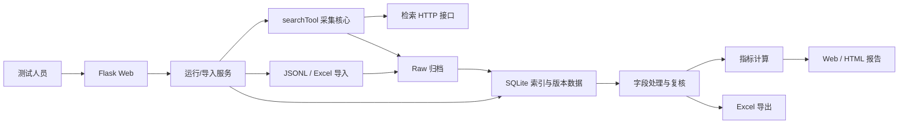
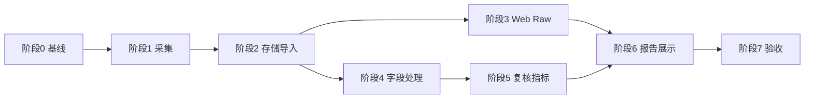

# searchTool v1.3 MVP 开发设计与开发计划

## 1. 文档信息

| 项目 | 内容 |
| --- | --- |
| 文档名称 | searchTool v1.3 MVP 开发设计与开发计划 |
| 文档版本 | v1.0 |
| 对应需求 | [《searchTool v1.3 检索分析系统 MVP PRD》](./searchTool_v1.3_PRD需求整理.md) |
| 当前状态 | 待技术评审 |
| 适用环境 | 本地或测试环境，单用户 |
| 核心目标 | 打通采集/导入、原始数据、字段处理、复核、指标和报告闭环 |

## 2. 设计目标

### 2.1 必须实现

1. Web 启动 `FULL_NAME` 和 `FULL_NAME_SOCIAL` 检索。
2. JSONL 和 Excel 历史结果导入。
3. Evaluation、Run、Query、Candidate 的统一管理。
4. 完整 Raw 数据保存和 Web 下钻查看。
5. Candidate Detail 单人失败后继续剩余候选人。
6. 测试人员维护版本化字段配置。
7. 基准数据导入、候选人判定和字段复核。
8. 核心指标计算。
9. 单 Run 与 baseline/candidate 报告。
10. JSONL、Excel 和静态 HTML 导出。

### 2.2 明确不实现

- `FULL_NAME_PHOTO` 和照片 PUT 链路；
- 登录、角色和权限；
- 多用户并发编辑；
- Redis、Celery、消息队列和分布式任务；
- React/Vue 等前端工程；
- 测试开发平台集成；
- 候选人分页；
- 自动网页核验和 AI 自动结论；
- provider/evidence/social_accounts 的猜测性模块映射；
- 未确认字段路径的真实成本与 PDL 统计。

## 3. 现有系统评估

### 3.1 可直接复用

| 现有能力                          | 复用方式                        |
| ----------------------------- | --------------------------- |
| `Config.from_env()`           | 继续读取接口、Header、Token、轮询和文件配置 |
| `SearchClient.call()`         | 继续作为四个接口的统一 HTTP 客户端        |
| `validate_input()`            | 扩展 Query 元数据后继续使用           |
| `process_one()`               | 保留顺序流程，增加 Raw、进度和候选人失败隔离    |
| `run_batch()`                 | 保持 CLI 使用，增加可选回调            |
| 日期 + 输入名输出规则                  | 继续作为 CLI 原始文件命名规则           |
| `result_to_excel.py`          | 继续作为 Excel 导出入口             |
| `result_to_excel_builder.mjs` | 继续使用 artifact-tool 生成工作簿    |
| 现有单元测试                        | 扩展，不删除已有覆盖                  |

### 3.2 当前差距

| 差距                               | 影响                         |
| -------------------------------- | -------------------------- |
| 只保存固定结果字段                        | 新接口字段可能无法进入后续分析            |
| Candidate Detail 任一失败会终止整个 Query | 不符合“继续剩余候选人”要求             |
| 没有持久化索引                          | 无法按 Run/Query/Candidate 查询 |
| 没有历史导入模型                         | JSONL、Excel 无法统一管理         |
| 字段路径写在 Excel 构建器中                | Web 与 Excel 难以共用处理结果       |
| 人工复核只在 Excel                     | 无法形成可追溯报告数据                |
| 没有报告数据快照                         | 字段配置变化后结果不可复现              |
| Excel 运行依赖 Node/artifact-tool    | Web 启动时需要增加可用性检查           |

## 4. 技术选型

### 4.1 推荐技术栈

| 层级       | 选型                                      | 原因                    |
| -------- | --------------------------------------- | --------------------- |
| Web      | Flask 3.x                               | 本地单用户、路由和模板需求简单       |
| 页面       | Jinja2 + 原生 JavaScript + CSS            | 无构建链，便于集成测试平台前先独立运行   |
| 数据库      | SQLite（Python `sqlite3`）                | 标准库、单文件、事务和查询能力满足 MVP |
| HTTP     | 现有 `requests`                           | 保持现有接口调用不变            |
| 配置       | 现有 `python-dotenv`                      | 继续使用 `.env`           |
| Excel 导入 | `openpyxl`                              | 只负责读取规范化历史工作簿         |
| Excel 导出 | 现有 `result_to_excel.py` + artifact-tool | 避免重写已验证的导出逻辑          |
| HTML 报告  | Jinja2 静态渲染                             | 与 Web 报告共用数据模型和模板     |
| 测试       | `unittest` + Flask test client          | 延续现有测试风格              |

### 4.2 不选择的方案

| 方案                 | MVP 不采用原因                      |
| ------------------ | ------------------------------ |
| FastAPI + 前后端分离    | 引入异步、API Schema 和独立前端工程，首版收益不足 |
| Django             | 内置能力较多，但对当前单用户工具过重             |
| React/Vue          | 页面以表格、表单和详情为主，不需要 SPA          |
| PostgreSQL/MySQL   | 本地单用户无需独立数据库服务                 |
| SQLAlchemy/Alembic | MVP 表结构固定且规模小，可用显式 SQL 保持透明    |
| Celery/Redis       | 同时只允许一个采集任务，不需要分布式调度           |
| 任意 Python 脚本字段转换   | 存在安全、复现和维护风险                   |

### 4.3 新增依赖

`requirements.txt` 建议增加：

```text
Flask>=3.0,<4
openpyxl>=3.1,<4
```

不增加其他运行依赖。

## 5. 总体架构



### 5.1 设计原则

1. 采集、处理、复核和报告分开，任一后处理失败不能修改 Raw。
2. Raw 只追加，结构化结果可以按新配置重建。
3. Web 和 CLI 共用同一采集核心，不复制接口流程。
4. Web 和 Excel 读取同一份处理结果，不分别维护字段提取逻辑。
5. 每个正式结果记录采集版本、字段配置版本、基准版本和规则版本。
6. 所有外部输入先校验再落库。
7. 单用户不等于无边界：Web 默认只监听 `127.0.0.1`。

## 6. 运行形态

### 6.1 进程模型

MVP 使用一个 Flask 进程：

- Web 请求在线程中处理；
- 搜索批次由 `ThreadPoolExecutor(max_workers=1)` 后台执行；
- 同一时间最多一个状态为 `RUNNING` 的采集 Run；
- 每个 Web 请求和后台任务独立创建 SQLite 连接，不跨线程共享连接；
- 开发启动也关闭 Flask 自动 reloader，避免重复创建后台执行器；
- 导入、字段处理和报告生成优先同步执行；
- 处理量证明会阻塞页面后，再复用同一后台执行器。

不引入独立 Worker 和队列。

### 6.2 中断处理

应用启动时检查数据库中遗留的 `RUNNING` Run：

- 标记为 `INTERRUPTED`；
- 保留已完成 Query、Candidate 和 Raw；
- 不自动重复发起接口请求；
- 测试人员可创建新 Run 重新执行；
- 已产生真实成本的旧 Run 不删除。

### 6.3 启动命令

建议入口：

```bash
cd /Users/admin/Testproject/Truthy_Search
python3 web_app.py --env-file .env
```

默认访问：

```text
http://127.0.0.1:8080
```

现有 CLI 保持可用：

```bash
python3 search_tool.py --env-file .env
```

## 7. 文件与模块设计

### 7.1 最小文件计划

| 文件 | 操作 | 责任 |
| --- | --- | --- |
| `search_tool.py` | 修改 | Raw 采集、进度回调、候选人失败隔离 |
| `analysis_store.py` | 新增 | SQLite 初始化、事务和查询 |
| `analysis_service.py` | 新增 | 执行、导入、处理、复核、指标和导出编排 |
| `web_app.py` | 新增 | Flask 创建、路由、参数校验和错误页 |
| `result_to_excel.py` | 修改 | 支持处理结果导出入口 |
| `result_to_excel_builder.mjs` | 修改 | 动态表头写入处理后候选人行 |
| `requirements.txt` | 修改 | Flask、openpyxl |
| `.env.example` | 修改 | Web、数据库和数据目录示例 |
| `README.md` | 修改 | 安装、启动、导入和备份说明 |
| `templates/*.html` | 新增 | 服务端页面 |
| `static/app.css` | 新增 | 统一页面样式 |
| `static/app.js` | 新增 | 状态轮询、JSON 折叠和确认操作 |
| `tests/test_analysis_store.py` | 新增 | 数据库和版本测试 |
| `tests/test_analysis_service.py` | 新增 | 导入、处理、指标和报告测试 |
| `tests/test_web_app.py` | 新增 | 页面与动作测试 |
| `tests/test_search_tool.py` | 修改 | Raw 和部分详情失败测试 |
| `tests/test_result_to_excel.py` | 修改 | 动态处理结果导出测试 |

### 7.2 控制文件数量

- SQLite DDL 直接放在 `analysis_store.py`，不单独创建迁移框架。
- 字段处理、指标和导入首版放在 `analysis_service.py`。
- 当单个文件明显超过可维护范围时，再按真实职责拆分，开发初期不预建空模块。
- 页面模板按页面粒度拆分，公共结构只放 `base.html`。

## 8. 配置设计

### 8.1 保留配置

继续使用：

- `SEARCH_API_URL`；
- `SEARCH_HTTP_HEADERS_JSON`；
- `AUTH_TOKEN`；
- `DEVICE_ID`；
- `USER_ID`；
- `POLL_INTERVAL_SECONDS`；
- `MAX_POLL_COUNT`；
- `HTTP_TIMEOUT_SECONDS`；
- `SEARCH_INPUT_FILE`；
- `SEARCH_OUTPUT_DIR`；
- `ALLOW_DUPLICATE_RUN`；
- 现有 `EXCEL_*`。

### 8.2 新增配置

```dotenv
SEARCH_WEB_HOST=127.0.0.1
SEARCH_WEB_PORT=8080
SEARCH_DATA_DIR=data
SEARCH_DB_FILE=data/searchtool_v1_3.db
SEARCH_IMPORT_DIR=data/imports
SEARCH_RAW_DIR=data/raw
SEARCH_REPORT_DIR=output/reports
```

规则：

- 相对路径统一相对于项目目录解析，不相对于终端当前目录；
- 启动时创建缺失的数据目录；
- 数据库目录不可指向项目根目录或系统目录；
- Web 页面不得显示任何鉴权配置值。

## 9. 数据存储设计

### 9.1 存储边界

SQLite 保存：

- 可查询的标识、状态和结构化数据；
- 字段配置、基准、复核和报告快照；
- Raw 记录索引。

文件系统保存：

- 原始上传文件；
- 标准化 JSONL 归档；
- Excel 和静态 HTML 导出；
- 超大 Raw JSON 可选独立文件。

MVP 默认 Raw JSON 同时保存在 SQLite TEXT 字段和标准化 JSONL 中，便于查询与恢复。若真实数据量超过 SQLite 可接受范围，再将大对象改为文件引用，不在首版提前复杂化。

建议目录布局：

```text
data/
  searchtool_v1_3.db
  imports/
    <run_id>/
      source.jsonl 或 source.xlsx
  raw/
    <evaluation_id>/
      <run_id>/
        results.jsonl
        failures.jsonl
output/
  reports/
    <evaluation_id>/
      <report_id>/
        report.html
        report.xlsx
```

所有数据库路径保存为相对于项目数据目录的路径，移动项目时不写死用户主目录。

### 9.2 SQLite 基础设置

每个连接执行：

```text
PRAGMA foreign_keys = ON
PRAGMA journal_mode = WAL
PRAGMA busy_timeout = 5000
```

写操作使用显式事务：

- 一个 Query 的 Task、Candidate、Raw 和 Failure 同一事务提交；
- 单个 Candidate Detail 失败作为候选级失败提交；
- 导入每个文件为一个事务；
- 字段配置发布为一个事务；
- 报告快照生成成功后再更新状态。

### 9.3 表结构

#### 9.3.1 `evaluations`

| 字段 | 类型 | 规则 |
| --- | --- | --- |
| `evaluation_id` | TEXT | 主键，用户提供或系统生成 |
| `name` | TEXT | 必填 |
| `notes` | TEXT | 可空 |
| `created_at` | TEXT | ISO 8601 |
| `updated_at` | TEXT | ISO 8601 |

#### 9.3.2 `datasets`

| 字段 | 类型 | 规则 |
| --- | --- | --- |
| `dataset_id` | TEXT | 主键 |
| `name` | TEXT | 必填 |
| `source_type` | TEXT | `JSONL` / `EXCEL` |
| `source_file` | TEXT | 归档文件相对路径 |
| `checksum` | TEXT | SHA-256，用于重复提示 |
| `query_count` | INTEGER | 合法 Query 数 |
| `created_at` | TEXT | ISO 8601 |

#### 9.3.3 `dataset_queries`

| 字段 | 类型 | 规则 |
| --- | --- | --- |
| `dataset_id` | TEXT | 外键 |
| `query_id` | TEXT | `input_id`，联合主键 |
| `person_id` | TEXT | 可空但报告配对需要 |
| `query_stage` | TEXT | `FULL_NAME` / `FULL_NAME_SOCIAL` |
| `match_strategy` | TEXT | 默认 `UNION` |
| `clues_json` | TEXT | 原始数组 JSON |
| `additional_details_json` | TEXT | 原始数组 JSON |
| `metadata_json` | TEXT | 难度、标签等扩展信息 |

约束：

- 同一数据集 `query_id` 唯一；
- 不接受 `FULL_NAME_PHOTO`；
- Query JSON 保持原始顺序。

#### 9.3.4 `runs`

| 字段 | 类型 | 规则 |
| --- | --- | --- |
| `run_id` | TEXT | 主键，UUID |
| `evaluation_id` | TEXT | 外键 |
| `dataset_id` | TEXT | 外键，可为空用于旧结果导入 |
| `run_label` | TEXT | current/baseline/candidate/自定义 |
| `system_version` | TEXT | 必填 |
| `source_type` | TEXT | `EXECUTION` / `JSONL_IMPORT` / `EXCEL_IMPORT` |
| `status` | TEXT | Run 状态枚举 |
| `result_schema_version` | TEXT | 采集格式版本 |
| `results_file` | TEXT | 标准化结果相对路径 |
| `failures_file` | TEXT | 标准化失败相对路径 |
| `total_queries` | INTEGER | 总数 |
| `success_queries` | INTEGER | 成功数 |
| `failed_queries` | INTEGER | 失败数 |
| `started_at` | TEXT | 可空 |
| `finished_at` | TEXT | 可空 |
| `message` | TEXT | 最新进度或失败原因 |
| `created_at` | TEXT | ISO 8601 |

#### 9.3.5 `run_queries`

| 字段 | 类型 | 规则 |
| --- | --- | --- |
| `run_id` | TEXT | 外键，联合主键 |
| `query_id` | TEXT | 联合主键 |
| `person_id` | TEXT | 数据集或历史元数据 |
| `query_stage` | TEXT | 两种 MVP 阶段 |
| `task_id` | TEXT | 可空 |
| `status` | TEXT | Query 状态 |
| `current_stage` | TEXT | 当前/失败接口阶段 |
| `candidate_count_total` | INTEGER | 可空 |
| `candidate_count_listed` | INTEGER | 默认0 |
| `detail_success_count` | INTEGER | 默认0 |
| `detail_failure_count` | INTEGER | 默认0 |
| `llm_cost` | REAL | 预留，可空 |
| `total_cost` | REAL | 预留，可空 |
| `pdl_called` | INTEGER | 预留，可空 |
| `error` | TEXT | Query 级错误 |
| `started_at` | TEXT | 可空 |
| `finished_at` | TEXT | 可空 |

#### 9.3.6 `candidates`

| 字段 | 类型 | 规则 |
| --- | --- | --- |
| `candidate_pk` | TEXT | 主键，内部 UUID |
| `run_id` | TEXT | 外键 |
| `query_id` | TEXT | 外键组成部分 |
| `candidate_id` | TEXT | List 返回 ID |
| `candidate_rank` | INTEGER | 从1开始 |
| `rank_score` | REAL | 可空 |
| `detail_status` | TEXT | `SUCCESS` / `FAILED` |
| `detail_error` | TEXT | 可空 |
| `ui_sections_json` | TEXT | 成功时保存完整对象 |
| `detail_data_json` | TEXT | 完整 Candidate Detail data |
| `list_item_json` | TEXT | List 原始候选对象 |
| `created_at` | TEXT | ISO 8601 |

唯一约束：

```text
run_id + query_id + candidate_rank
```

同一个接口 `candidate_id` 出现重复时仍保留不同 rank，但记录数据异常。

#### 9.3.7 `raw_records`

| 字段 | 类型 | 规则 |
| --- | --- | --- |
| `raw_id` | TEXT | 主键 |
| `run_id` | TEXT | 外键 |
| `query_id` | TEXT | 可空 |
| `candidate_pk` | TEXT | 可空 |
| `stage` | TEXT | Input/Create/Get/List/Detail/Import |
| `sequence_no` | INTEGER | GetTask 轮询顺序等 |
| `payload_json` | TEXT | 完整脱敏业务数据 |
| `collected_at` | TEXT | ISO 8601 |

Raw 不提供更新接口，只允许新增和读取。

#### 9.3.8 `failures`

| 字段 | 类型 | 规则 |
| --- | --- | --- |
| `failure_id` | TEXT | 主键 |
| `run_id` | TEXT | 外键 |
| `query_id` | TEXT | 可空 |
| `candidate_id` | TEXT | 候选级失败时填写 |
| `scope` | TEXT | `INPUT` / `QUERY` / `CANDIDATE` / `IMPORT` / `PROCESS` |
| `stage` | TEXT | 失败阶段 |
| `error` | TEXT | 可读错误 |
| `created_at` | TEXT | ISO 8601 |

#### 9.3.9 `field_schemas`

| 字段 | 类型 | 规则 |
| --- | --- | --- |
| `schema_version` | TEXT | 主键 |
| `name` | TEXT | 必填 |
| `definitions_json` | TEXT | 完整字段配置数组 |
| `created_by` | TEXT | 可空，单用户人工填写 |
| `created_at` | TEXT | ISO 8601 |
| `is_active` | INTEGER | 当前默认版本 |

已发布配置不可原地修改。编辑现有版本时复制后生成新版本。

#### 9.3.10 `process_runs`

| 字段 | 类型 | 规则 |
| --- | --- | --- |
| `process_id` | TEXT | 主键 |
| `run_id` | TEXT | 外键 |
| `schema_version` | TEXT | 外键 |
| `baseline_version` | TEXT | 可空 |
| `rule_version` | TEXT | 处理规则版本 |
| `status` | TEXT | PROCESSING/COMPLETED/FAILED |
| `error_count` | INTEGER | 默认0 |
| `created_at` | TEXT | ISO 8601 |
| `finished_at` | TEXT | 可空 |

#### 9.3.11 `processed_candidates`

| 字段 | 类型 | 规则 |
| --- | --- | --- |
| `process_id` | TEXT | 外键，联合主键 |
| `candidate_pk` | TEXT | 外键，联合主键 |
| `fields_json` | TEXT | `field_key -> 结构化值` |
| `empty_fields_json` | TEXT | 非空判断结果 |
| `processing_errors_json` | TEXT | 字段级错误 |

#### 9.3.12 `baseline_sets`

| 字段 | 类型 | 规则 |
| --- | --- | --- |
| `baseline_version` | TEXT | 主键 |
| `name` | TEXT | 必填 |
| `source_type` | TEXT | JSONL/EXCEL |
| `source_file` | TEXT | 归档路径 |
| `checksum` | TEXT | SHA-256 |
| `created_at` | TEXT | ISO 8601 |

#### 9.3.13 `baseline_people`

| 字段 | 类型 | 规则 |
| --- | --- | --- |
| `baseline_version` | TEXT | 外键，联合主键 |
| `person_id` | TEXT | 联合主键 |
| `display_name` | TEXT | 可空 |
| `fields_json` | TEXT | `field_key -> 基准值` |
| `evidence_json` | TEXT | 可选 |

#### 9.3.14 `reviews`

| 字段 | 类型 | 规则 |
| --- | --- | --- |
| `process_id` | TEXT | 外键，联合主键 |
| `candidate_pk` | TEXT | 外键，联合主键 |
| `judgement` | TEXT | HIT/NOT_HIT/SUSPECTED/PENDING_REVIEW |
| `reason` | TEXT | SOCIAL_MATCH/SOCIAL_CONFLICT/NO_STRONG_FIELD/MANUAL |
| `evidence` | TEXT | 人工说明或链接 |
| `field_scores_json` | TEXT | 字段完整度/准确率及人工覆盖 |
| `reviewer` | TEXT | 可空 |
| `review_note` | TEXT | 可空 |
| `reviewed_at` | TEXT | 可空 |

#### 9.3.15 `reports`

| 字段 | 类型 | 规则 |
| --- | --- | --- |
| `report_id` | TEXT | 主键 |
| `evaluation_id` | TEXT | 外键 |
| `baseline_process_id` | TEXT | 可空 |
| `candidate_process_id` | TEXT | 必填 |
| `report_type` | TEXT | SINGLE/COMPARE |
| `status` | TEXT | READY/STALE/FAILED |
| `metrics_json` | TEXT | 聚合指标快照 |
| `html_file` | TEXT | 静态报告路径 |
| `excel_file` | TEXT | 可空 |
| `created_at` | TEXT | ISO 8601 |

### 9.4 关键索引

至少创建：

- `runs(evaluation_id, created_at)`；
- `run_queries(run_id, status, query_stage)`；
- `run_queries(person_id, query_stage)`；
- `candidates(run_id, query_id, candidate_rank)`；
- `failures(run_id, scope, stage)`；
- `process_runs(run_id, created_at)`；
- `reviews(process_id, judgement)`。

## 10. 采集核心改造

### 10.1 保持兼容

现有 `process_one()` 和 `run_batch()` 的默认调用方式继续可用。新增参数必须可选，避免 Web 功能破坏 CLI。

建议新增回调协议：

```python
ProgressCallback = Callable[[dict[str, Any]], None]
RawCallback = Callable[[dict[str, Any]], None]
```

回调事件只包含脱敏业务信息，不包含 Auth Token 和 Header。

### 10.2 进度事件

事件示例：

```json
{
  "event": "query_stage",
  "input_id": "case-001",
  "task_id": "task_xxx",
  "stage": "GetTask",
  "status": "SEARCHING",
  "message": "继续轮询"
}
```

事件类型：

- `query_started`；
- `query_stage`；
- `candidate_started`；
- `candidate_succeeded`；
- `candidate_failed`；
- `query_succeeded`；
- `query_failed`。

### 10.3 Raw 采集

每次调用后保存：

- CreateIntentTask 请求业务参数和响应 body；
- 每次 GetTask 响应及轮询序号；
- ListTaskCandidates 响应；
- 每名 Candidate Detail 响应；
- 失败时可获得的业务响应和错误。

禁止保存：

- `auth_token`；
- `device_id` 和 `user_id` 的鉴权副本；
- Cookie；
- 完整 HTTP Header。

设备和用户标识是否属于必须追溯信息，本 MVP 按敏感配置处理，不进入 Raw。

### 10.4 v1.3 结果 JSONL

在不删除旧字段的前提下扩展：

```json
{
  "result_schema_version": "1.3",
  "run_id": "run_xxx",
  "input_id": "case-001",
  "task_id": "task_xxx",
  "query_stage": "FULL_NAME",
  "candidate_count_total": 10,
  "candidate_count_listed": 10,
  "detail_success_count": 9,
  "detail_failure_count": 1,
  "task_fields": {
    "llm_cost": null,
    "total_cost": null,
    "pdl_called": null
  },
  "raw": {
    "create_intent_task": {},
    "get_task_history": [],
    "list_task_candidates": {}
  },
  "results": [
    {
      "candidate_rank": 1,
      "candidate_id": "candidate_xxx",
      "rank_score": 0.91,
      "detail_status": "SUCCESS",
      "detail_error": "",
      "list_item_raw": {},
      "detail_data_raw": {},
      "ui_sections": {}
    }
  ]
}
```

详情失败候选人仍在 `results[]` 中：

```json
{
  "candidate_rank": 2,
  "candidate_id": "candidate_yyy",
  "rank_score": 0.72,
  "detail_status": "FAILED",
  "detail_error": "HTTP 请求失败: timeout",
  "list_item_raw": {},
  "detail_data_raw": null,
  "ui_sections": null
}
```

### 10.5 Candidate Detail 失败隔离

候选人循环内部单独捕获 `FlowError`：

1. 只记录当前 `candidate_id` 的失败；
2. 向 `failures.jsonl` 写一条 `scope=CANDIDATE` 记录；
3. 结果中保留 List item 和 rank；
4. 更新失败数量；
5. 继续下一候选人。

以下仍属于 Query 级失败：

- CreateIntentTask 失败；
- GetTask 失败、未知状态或超时；
- ListTaskCandidates 整体失败；
- List 响应 `items` 不是数组。

List 中单项不是对象或缺少 `candidate_id` 时按候选级数据错误记录并继续，不能发起详情请求。

### 10.6 Query 状态

| 条件 | 状态 |
| --- | --- |
| List 为空 | `NO_CANDIDATE` |
| 全部详情成功 | `SUCCESS` |
| 至少一个详情失败 | `PARTIAL_DETAIL_FAILED` |
| Query 级流程失败 | `FAILED` |

`PARTIAL_DETAIL_FAILED` 属于 Run 已完成 Query，不计入接口全链路成功数，报告单独展示。

## 11. 历史导入设计

### 11.1 导入统一流程

```text
上传文件
  → 后缀和大小校验
  → SHA-256 重复检查
  → 解析为统一中间记录
  → 业务字段校验
  → 预览合法/错误数量
  → 用户确认导入
  → 归档原文件
  → 事务写入 SQLite
  → 生成标准化 JSONL
```

### 11.2 JSONL 结果导入

支持：

- v1.2 旧结果；
- 当前包含 candidate rank/score 的结果；
- v1.3 Raw 增强结果；
- `failures.jsonl` 可选。

兼容规则：

| 缺失内容 | 处理 |
| --- | --- |
| `candidate_rank` | 按数组顺序补充 |
| `rank_score` | 为空 |
| `candidate_count_total` | 为空 |
| Raw | 标记 `LEGACY_PARTIAL_RAW` |
| `query_stage/person_id` | 从 Query 元数据补充，否则为空并阻止正式配对 |

### 11.3 Excel 结果导入

只支持项目生成的规范化工作簿，不承诺解析任意 Excel。

必需 Sheet：

- `候选结果`。

可选 Sheet：

- `Query对比`；
- `失败记录`；
- `Raw数据`；
- `说明`。

最低必需列：

- `query_id`；
- `task_id`；
- `candidate_id`；
- `candidate_rank`。

导入限制：

- Excel 只能恢复工作簿中存在的结构化字段；
- 无法恢复的 HTTP Raw 标记为缺失；
- `Raw数据` 按引用和分块序号重组；
- 人工复核列可以导入 `reviews`；
- 公式列不作为核心事实来源；只读取工作簿缓存值，缺少缓存时留空；
- 外部链接和宏不执行。

### 11.4 Query 数据集导入

JSONL 继续使用当前任务格式，并增加元数据：

```json
{
  "input_id": "case-001",
  "person_id": "person-001",
  "query_stage": "FULL_NAME_SOCIAL",
  "match_strategy": "UNION",
  "clues": [],
  "additional_details": [],
  "tags": ["common_name"]
}
```

校验：

- `input_id` 唯一；
- `query_stage` 只允许两个 MVP 值；
- `clues` 非空；
- `FULL_NAME` 必须存在全名线索；
- `FULL_NAME_SOCIAL` 必须同时存在全名和 Social Link 线索；
- 不在导入器中猜测未知 clue 类型。

Excel Query 导入使用固定 Sheet `Queries`，列中复杂数组以 JSON 字符串保存。

### 11.5 基准数据导入

JSONL 结构：

```json
{
  "person_id": "person-001",
  "display_name": "JOJO",
  "fields": {
    "social_urls": ["https://example.com/jojo"],
    "profile.Identity.Location": "Shanghai"
  },
  "evidence": {}
}
```

Excel 使用 `基准数据` Sheet：

- `person_id` 必填且唯一；
- `display_name` 可空；
- 其他列名使用 `field_key`；
- 多值字段使用 JSON 数组或换行值；
- 导入时按字段配置的数据类型解析。

## 12. 字段配置与处理设计

### 12.1 配置结构

单字段定义：

```json
{
  "field_key": "social_urls",
  "display_name": "Social URLs",
  "module": "Social",
  "source_stage": "GetTaskCandidateDetail",
  "source_path": "ui_sections.social.data.profiles[*].url",
  "data_type": "array",
  "array_mode": "collect",
  "empty_rule": "default",
  "normalizer": "social_url",
  "scoring_role": ["identity", "completeness", "accuracy"],
  "compare_mode": "url_set",
  "enabled": true,
  "sort_order": 100
}
```

`compare_mode` 是开发实现所需配置，支持：

- `exact`；
- `normalized_text`；
- `set`；
- `url_set`；
- `manual`。

### 12.2 路径语法

MVP 只支持：

- 点号对象键：`summary.data.avatar_url`；
- 固定数组索引：`items[0].description`；
- 数组通配：`profiles[*].url`。

不支持：

- 任意表达式；
- 条件过滤；
- 函数调用；
- `eval`；
- 用户上传 Python/JavaScript。

### 12.3 内置转换器

仅保留当前必要的内置转换器：

- `identity`：原值；
- `trim_text`：文本去首尾空格；
- `number`：有限数值转换；
- `percentage`：0–1 与0–100规范化；
- `social_url`：Social URL 规范化；
- `string_list`：数组转稳定字符串列表；
- `profile_sections`：处理当前 Profile sections/items 结构。

复杂新结构无法表达时记录处理异常，后续再增加有测试覆盖的转换器。

### 12.4 Social URL 规范化

规范化步骤：

1. 去首尾空格；
2. Host 转小写；
3. 移除 `www.`；
4. 移除 URL fragment；
5. 移除 `utm_*` 等明确跟踪参数；
6. 移除末尾 `/`；
7. 保留能够识别账号的路径和非跟踪查询参数。

Social Link 已确认不会回显，因此规范化后一致可作为命中证据。

同平台冲突判断：

- 先从 URL Host 和配置映射识别平台；
- 基准与返回存在相同平台但规范化 URL 不一致，标记冲突；
- 冲突优先于普通字段一致；
- 同时出现匹配与冲突时标记 `PENDING_REVIEW`，不自动给最终 HIT。

### 12.5 处理算法

对每个成功详情候选人：

1. 读取 `detail_data_json`；
2. 按字段配置提取原始值；
3. 按数据类型校验；
4. 执行 normalizer；
5. 判断空值；
6. 保存到 `processed_candidates.fields_json`；
7. 记录字段级错误；
8. 生成候选人命中建议；
9. 不自动覆盖已有人工 Review。

详情失败候选人只生成失败状态，不生成正常空字段。

### 12.6 配置版本

版本命名建议：

```text
field-schema-20260723-001
```

保存规则：

- 每次保存生成新版本；
- 新版本复制完整字段集后再应用修改；
- 报告引用版本快照；
- 活跃版本只影响新处理任务；
- 删除操作表现为新版本中 `enabled=false`。

## 13. 基准与复核设计

### 13.1 候选人命中建议

MVP 不使用照片规则。

顺序：

1. 同平台 Social Link 冲突：建议 `NOT_HIT`；
2. 至少一个 Social Link 匹配且无冲突：建议 `HIT`；
3. 同时存在匹配与冲突：建议 `PENDING_REVIEW`；
4. 没有 Social 强绑定信息：建议 `SUSPECTED`；
5. 其他情况：建议 `NOT_HIT`。

人工最终判定优先于系统建议。

### 13.2 Review 保存

候选人复核页面一次提交：

- 最终 judgement；
- reason；
- evidence；
- reviewer；
- note；
- 字段得分。

更新使用数据库事务。页面提交前带当前 `reviewed_at`：

- 数据库时间未变化则更新；
- 已变化则提示页面过期并要求刷新；
- 即使单用户也避免浏览器多标签覆盖。

### 13.3 字段得分

字段级建议：

- `exact/normalized_text`：相等为1，否则0；
- `set/url_set`：
  - 完整度 = 正确找回的基准项数 / 基准项数；
  - 准确率 = 正确返回项数 / 返回项数；
- `manual`：系统不生成得分，等待人工填写。

人工可以覆盖建议得分，必须填写备注。

字段得分范围：

```text
0.0 <= score <= 1.0
```

缺少基准值时不填0，保存为 `null`。

### 13.4 复核完成条件

Query 可以进入正式报告需要：

- 至少一个候选人有最终判定，或明确全部 `NOT_HIT/SUSPECTED`；
- 命中候选人的评分字段已确认；
- `manual` 字段不存在未完成项；
- 基准数据版本存在。

未完成时可以生成“预览报告”，但必须标记 `PENDING_REVIEW`。

## 14. 指标计算设计

### 14.1 单 Query

```text
retrieval_success = 是否至少存在一个最终 HIT
```

命中候选人：

```text
matched_completeness =
  22个评分内容字段完整度得分之和 / 22
```

准确率：

```text
matched_accuracy =
  非空且可评分字段准确率得分之和 / 非空且可评分字段数
```

非命中候选人：

```text
nonmatched_completeness =
  22个内容字段中非空字段数 / 22
```

### 14.2 单 Run 聚合

```text
成功率 = 成功 Query 数 / 纳入统计 Query 数

命中完整度均值 =
  成功 Query 的命中候选人完整度总和 / 成功 Query 数

命中准确率均值 =
  成功 Query 的命中候选人准确率总和 / 有准确率 Query 数

非命中平均完整度 =
  所有非命中候选人完整度总和 / 非命中候选人数
```

分母为0时返回“不适用”，不返回0。

### 14.3 baseline/candidate 配对

配对键：

```text
person_id + query_stage
```

配对前检查：

- Query 输入一致；
- 基准版本一致；
- 字段配置版本一致；
- 规则版本一致。

不一致时禁止正式配对，展示差异原因。

配对分类：

- 持续命中；
- 新增命中；
- 退化未命中；
- 持续未命中。

### 14.4 成本和 PDL

字段未接入前：

- 预留列为 `null`；
- 报告展示“数据未接入”；
- 不计算总额、均值或次数；
- 不把缺失值转为0。

`cost_currency` 不创建 MVP 正式结构化列；如果接口 Raw 中出现该字段，先随 Raw 保存，待字段含义确认后再进入小版本设计。

字段路径确认后通过字段配置或小版本接入。

### 14.5 指标快照

报告生成时保存：

- 分子；
- 分母；
- 百分比；
- 明细对象 ID 列表；
- 数据版本；
- 生成时间。

下钻优先使用快照中的对象 ID，避免后续复核变化导致数字与明细不一致。

复核或处理结果变化后，将关联报告标记 `STALE`。

## 15. Web 页面设计

### 15.1 页面清单

| 页面 | 核心功能 |
| --- | --- |
| 首页 | Evaluation 列表和状态 |
| 创建评测 | 创建 Evaluation、选择数据来源 |
| 数据集导入 | JSONL/Excel 校验、预览、确认 |
| Evaluation 详情 | Run 列表、创建执行/导入 Run |
| Run 详情 | 进度、状态、Query 列表、处理入口 |
| Query 详情 | 输入、Task、候选人、Raw、失败 |
| Candidate 详情 | 业务视图、Raw JSON、复核 |
| 字段配置列表 | 版本列表、启用状态 |
| 字段配置编辑 | 复制版本、编辑字段、发布 |
| 基准数据 | 导入、版本和 Person 查看 |
| 处理结果 | 处理状态、错误和复核进度 |
| 报告 | 单 Run 或版本对比 |

### 15.2 页面交互原则

- 所有列表服务端分页；
- Raw JSON 点击后再加载；
- URL 和图片不在列表页批量加载；
- 危险动作使用 POST；
- 删除不进入 MVP，避免误删 Raw；
- 导入和执行前展示确认摘要；
- 错误页显示可行动的错误，不显示堆栈和 Token。

### 15.3 Run 进度

前端每 2 秒请求状态：

```text
GET /api/runs/<run_id>/status
```

响应：

```json
{
  "run_id": "run_xxx",
  "status": "RUNNING",
  "total_queries": 100,
  "completed_queries": 28,
  "success_queries": 27,
  "failed_queries": 1,
  "current_query_id": "case-029",
  "current_stage": "GetTask",
  "message": "SEARCHING"
}
```

终态后停止轮询。

### 15.4 Raw JSON 查看

- 服务端返回 JSON；
- 前端渲染可折叠树；
- 默认折叠大数组；
- 提供字段名/值搜索；
- 提供复制路径与复制值；
- 单次只加载一个 Raw；
- 不将完整 Raw 嵌入列表 HTML。

## 16. Web 路由设计

### 16.1 页面路由

| Method | Path | 用途 |
| --- | --- | --- |
| GET | `/` | Evaluation 列表 |
| GET/POST | `/evaluations/new` | 创建评测 |
| GET | `/evaluations/<id>` | 评测详情 |
| POST | `/evaluations/<id>/runs` | 创建执行 Run |
| GET | `/runs/<run_id>` | Run 详情 |
| GET | `/runs/<run_id>/queries/<query_id>` | Query 详情 |
| GET | `/candidates/<candidate_pk>` | Candidate 详情 |
| GET/POST | `/imports` | 历史数据导入 |
| GET | `/field-schemas` | 字段配置列表 |
| GET/POST | `/field-schemas/new` | 创建字段配置 |
| POST | `/runs/<run_id>/process` | 启动字段处理 |
| GET/POST | `/baselines` | 基准导入和列表 |
| POST | `/processes/<process_id>/candidates/<candidate_pk>/review` | 保存复核 |
| POST | `/reports` | 生成报告 |
| GET | `/reports/<report_id>` | 查看报告 |
| GET | `/downloads/<type>/<id>` | 受控下载 |

### 16.2 JSON 状态路由

| Method | Path | 用途 |
| --- | --- | --- |
| GET | `/api/runs/<run_id>/status` | Run 进度 |
| GET | `/api/raw/<raw_id>` | 单条 Raw JSON |
| GET | `/api/field-schemas/<version>` | 配置详情 |
| GET | `/api/processes/<process_id>/status` | 处理状态 |

### 16.3 输入校验

- ID 只作为数据库查询参数，不拼接 SQL；
- 上传文件名通过 `secure_filename` 处理；
- 只允许 `.jsonl`、`.json`、`.xlsx`；
- 文件大小设置可配置上限；
- 下载只能使用数据库保存的相对路径；
- 所有枚举在服务端再次校验；
- JSON 路径禁止包含脚本表达式。

## 17. 报告设计

### 17.1 共用模型

Web 与静态 HTML 使用同一个 `ReportModel`：

```text
metadata
summary
query_stage_metrics
paired_metrics
module_metrics
field_metrics
case_groups
cost_status
warnings
```

Jinja Web 页面和静态导出只负责展示，不重新计算指标。

### 17.2 报告区块

1. 执行摘要；
2. `FULL_NAME` 和 `FULL_NAME_SOCIAL` 核心指标；
3. baseline/candidate 相同条件对比；
4. 同人配对四象限；
5. 模块返回率；
6. 22字段完整度和准确率；
7. Social 专项；
8. 失败与部分详情失败；
9. 改善、退化、疑似和持续未命中案例；
10. 成本/PDL“未接入”状态。

### 17.3 静态 HTML

- 使用与 Web 相同的模板片段；
- CSS 内嵌或使用相对本地资源；
- 不依赖外部 CDN；
- 人物级案例允许输出；
- 标注真实数据/Mock；
- 标注字段、基准和规则版本；
- 不包含 Token、Header 和 `.env`；
- 报告文件名包含日期、evaluation 和版本。

### 17.4 报告过期

以下变化将报告标记 `STALE`：

- 重新处理生成新 `process_id`；
- 复核结果变化；
- 基准版本变化；
- 报告关联 Run 状态变化。

旧报告文件保留，不覆盖；新生成报告使用新 `report_id`。

## 18. Excel 设计

### 18.1 共用处理结果

Web 不再让 Excel 构建器重复提取 `ui_sections`。

导出流程：

```text
processed_candidates + run/query/review
  → 生成 processed_export.jsonl
  → result_to_excel.py processed
  → result_to_excel_builder.mjs
  → xlsx
```

`processed_export.jsonl` 每行是一名候选人，字段键来自当前 `FieldSchema`。

### 18.2 兼容旧模式

保留：

- `single`；
- `compare`；
- `--run-dir`；
- `--results-file`；
- `.env EXCEL_*`。

新增 `processed` 模式，不删除旧逻辑。

### 18.3 Excel 可用性检查

Web 启动时检查：

- Node 是否可用；
- artifact-tool 是否可加载；
- 构建器文件是否存在。

失败时：

- Web、采集和报告继续可用；
- Excel 导出按钮显示不可用原因；
- 不阻塞 MVP 主流程启动。

## 19. 安全设计

### 19.1 监听范围

- 默认 `127.0.0.1`；
- MVP 文档不建议监听 `0.0.0.0`；
- 无权限系统时不得暴露到公共网络。

### 19.2 敏感配置

- `.env` 不进入 Web；
- 日志不记录 Token、Header 和完整请求 envelope；
- 异常信息移除 URL 中可能的签名参数；
- 导入文件不允许读取工作区外任意路径；
- 下载路径通过数据库 ID 间接解析。

### 19.3 Excel 与 HTML

- Excel 文本继续防公式注入；
- 不执行宏和外部连接；
- 静态 HTML 对文本做默认转义；
- URL 只允许 `http/https` 成为可点击链接；
- 人物案例只在受控环境分享。

## 20. 日志与可观测性

### 20.1 应用日志

记录：

- Run、Query、Candidate 标识；
- 阶段；
- 状态变化；
- 耗时；
- 错误类型。

不记录：

- Token；
- Header；
- 完整个人数据；
- 完整 Raw JSON。

### 20.2 用户可见错误

错误需要包含：

- 操作；
- 对象 ID；
- 失败阶段；
- 可读原因；
- 建议下一步。

例如：

```text
Run run_xxx 的 case-003 在 GetTask 阶段超时；
已保存前序响应并继续下一 Query。
```

## 21. 非功能设计

### 21.1 规模

设计基线：

```text
100 Person
× 2 query_stage
× 2 system_version
× 每个 Query 实际返回全部候选人
```

不对候选人数做 Top 5 限制。

### 21.2 性能策略

- Query 列表默认每页50条；
- Candidate 列表默认每页50条；
- Raw 按需加载；
- 报告使用已处理数据，不重复解析所有 Raw；
- 大字段不出现在首页和列表；
- SQLite 查询使用必要索引；
- Excel 导出异步化仅在实际阻塞时增加。

### 21.3 备份

最小备份对象：

- SQLite 数据库；
- `data/imports`；
- `data/raw`；
- `output/reports`；
- 原始 results/failures JSONL。

备份前确保无运行中的写事务。恢复时数据库和文件目录必须来自同一时间点。

## 22. 测试设计

### 22.1 测试原则

- 不在自动测试中调用真实接口；
- HTTP 使用 `FakeSession`；
- SQLite 使用临时目录数据库；
- 每个测试独立初始化 Schema；
- 文件导入使用最小夹具；
- 报告指标使用手工可计算样本；
- 每个错误修复先增加复现测试。

### 22.2 采集测试

覆盖：

1. `QUEUED → SEARCHING → SUCCEEDED`；
2. List 返回0人；
3. List 返回超过5人并请求全部详情；
4. 第2名详情失败，第3名仍继续；
5. Query 状态为 `PARTIAL_DETAIL_FAILED`；
6. Candidate 失败同时写 results 和 failures；
7. Raw 保存四个阶段；
8. Raw 不包含 Token；
9. 进度事件顺序；
10. CLI 旧用法仍通过。

### 22.3 Store 测试

覆盖：

- 初始化幂等；
- 外键；
- Query 事务提交；
- Raw 不提供更新；
- 唯一键；
- Run 计数；
- `RUNNING → INTERRUPTED` 恢复；
- 报告 STALE；
- SQLite 文件备份可重新打开。

### 22.4 导入测试

JSONL：

- v1.2；
- v1.3；
- 坏 JSON；
- 重复 input_id；
- 缺失 person/query stage；
- 候选人详情失败。

Excel：

- 标准工作簿；
- 缺少必需 Sheet；
- 缺少必需列；
- Raw 分块还原；
- 公式注入文本；
- 重复文件校验和。

### 22.5 字段处理测试

- 点路径；
- 固定数组索引；
- 数组通配；
- 缺失路径；
- 类型错误；
- Social URL 规范化；
- Profile sections 内置转换；
- schema 版本不覆盖；
- 旧数据重新处理；
- 详情失败候选人不生成正常空值。

### 22.6 复核和指标测试

- Social 匹配；
- Social 同平台冲突；
- 匹配与冲突并存；
- SUSPECTED 按未命中；
- 单值完整度/准确率；
- 多值完整度/准确率；
- 分母为0返回不适用；
- baseline/candidate 配对；
- Query 输入不一致拒绝正式配对；
- 成本字段为空不按0。

### 22.7 Web 测试

- 首页；
- 创建 Evaluation；
- 上传类型和大小限制；
- 创建 Run；
- 已有 RUNNING 时拒绝新执行；
- 状态 API；
- Run/Query/Candidate 页面；
- Raw API；
- 保存 Review；
- 生成报告；
- 路径穿越；
- 错误页不泄漏配置。

### 22.8 Excel/HTML 测试

- processed 模式动态表头；
- 所有候选人行数；
- Review 列；
- 超长 Raw；
- Excel 公式错误扫描；
- HTML 文本转义；
- 静态 HTML 不依赖外部 CDN；
- 人物案例存在且不包含鉴权配置。

### 22.9 端到端验收夹具

固定最小数据：

- 2 Person；
- 每人 `FULL_NAME` 和 `FULL_NAME_SOCIAL`；
- baseline/candidate 两个 Run；
- 包含 HIT、NOT_HIT、SUSPECTED；
- 包含一个 Candidate Detail 失败；
- 包含一个未知新增字段；
- 包含一条失败 Query；
- 成本字段为空。

验收输出：

- Run/Query/Candidate 页面；
- 处理结果；
- Review；
- 单 Run 报告；
- 对比报告；
- Excel；
- 静态 HTML。

## 23. 开发阶段与计划

### 23.1 阶段0：基线冻结与开发准备

目标：保证现有 CLI 和 Excel 能力有可回归基线。

任务：

1. 运行现有14项测试；
2. 保存当前 JSONL 结构夹具；
3. 记录现有 Excel 导出检查结果；
4. 增加 Flask/openpyxl 依赖；
5. 定义数据库 Schema 版本 `1`；
6. 确认数据目录加入忽略规则，避免提交人物数据和数据库。

交付：

- 依赖更新；
- 基线测试记录；
- 数据目录约定。

验收：

- 现有测试全部通过；
- CLI 仍可运行；
- 不提交真实 `.env` 和 Raw。

预计工作量：1–2人日。

### 23.2 阶段1：采集核心 v1.3

目标：先让数据采集满足 Raw 和部分详情失败要求。

任务：

1. 定义 v1.3 result/failure Schema；
2. 增加进度和 Raw 回调；
3. 保存 Create/Get/List/Detail Raw；
4. Candidate Detail 单人失败隔离；
5. 保留 List item 和失败候选人；
6. 扩展 Query 状态；
7. 保持旧 CLI 参数和输出命名；
8. 补充回归测试。

验收：

- 6名候选人返回时请求6次详情；
- 中间一名失败后继续；
- results/failures 可完整追溯；
- Raw 无鉴权信息；
- 现有测试无回归。

预计工作量：2–3人日。

### 23.3 阶段2：SQLite 与历史导入

目标：建立统一内部数据和旧数据进入路径。

任务：

1. 实现 `analysis_store.py`；
2. 初始化表和索引；
3. 实现 Dataset JSONL 导入；
4. 实现结果 JSONL 导入；
5. 实现规范化 Excel 导入；
6. 实现基准 JSONL/Excel 导入；
7. 文件归档和 SHA-256；
8. 实现事务、重复提示和错误预览；
9. 增加 Store/Importer 测试。

验收：

- JSONL 与 Excel 最终产生统一 Run/Query/Candidate；
- 历史 Raw 缺失有明确标记；
- 重复文件不静默覆盖；
- 坏记录不污染合法事务；
- 数据库可重新打开。

预计工作量：3–4人日。

### 23.4 阶段3：Web 执行与原始数据中心

目标：完成“启动/导入 → 查看原始数据”。

任务：

1. Flask 应用工厂和配置；
2. Evaluation/Run 创建；
3. 后台执行器；
4. 进度状态 API；
5. Run 和 Query 列表；
6. Query/Candidate 详情；
7. Raw JSON 按需加载；
8. 失败记录；
9. 页面分页、筛选和基础样式；
10. Web 测试。

验收：

- Web 可启动真实配置下的 searchTool；
- 页面可查看进度；
- 可以导入历史结果；
- 100人列表分页；
- 可下钻全部候选人和 Raw；
- 同一时间只允许一个执行 Run。

预计工作量：4–5人日。

此阶段完成后已经形成第一个可用里程碑，可先投入真实数据采集和查看。

### 23.5 阶段4：字段配置与处理

目标：摆脱固定 Excel 字段映射。

任务：

1. 默认字段配置；
2. FieldSchema 版本页面；
3. 路径解析；
4. 内置 normalizer；
5. Profile sections 转换；
6. processed_candidates；
7. 重新处理；
8. 处理错误页面；
9. 动态字段测试。

验收：

- 新增普通字段不改采集代码；
- 新配置可处理历史 Raw；
- 旧处理结果不覆盖；
- 配置错误可追溯；
- Web 展示使用处理结果。

预计工作量：3–4人日。

### 23.6 阶段5：基准、复核与指标

目标：让报告指标有可追溯数据来源。

任务：

1. 基准版本管理；
2. Social URL 规范化；
3. 候选人建议判定；
4. Candidate Review；
5. 字段比较和人工覆盖；
6. 单 Query 指标；
7. Run 聚合；
8. baseline/candidate 配对；
9. 报告 STALE 机制；
10. 公式与边界测试。

验收：

- Social 匹配/冲突正确；
- 复核修改可追踪；
- 四项核心质量指标与手算一致；
- 未完成复核不能输出正式结论；
- 成本空值不被当成0。

预计工作量：4–5人日。

### 23.7 阶段6：报告与导出

目标：完成从处理数据到可展示报告。

任务：

1. `ReportModel`；
2. Web 单 Run 报告；
3. baseline/candidate 对比；
4. 同人配对；
5. 字段和案例附录；
6. 静态 HTML；
7. processed Excel 模式；
8. 下钻链接；
9. 报告快照和版本信息；
10. HTML/Excel 验证。

验收：

- Mock 报告核心区块齐全；
- 指标可下钻；
- 静态 HTML 可独立打开；
- HTML 允许人物案例且无鉴权信息；
- Excel 与 Web 候选人行数和字段一致；
- Excel/Node 不可用时 Web 主流程不受影响。

预计工作量：4–5人日。

### 23.8 阶段7：集成验收与文档

目标：完成真实环境交付。

任务：

1. 全量自动测试；
2. 端到端固定夹具；
3. 小批真实数据；
4. 100人真实数据验收；
5. 性能和磁盘检查；
6. 安全检查；
7. README、备份和恢复说明；
8. 数据迁移说明；
9. 已知限制清单。

验收：

- PRD 验收项全部有证据；
- 现有 CLI/Excel 无回归；
- 真实100人流程可完成；
- 数据可备份和恢复；
- 无真实凭证进入版本库。

预计工作量：2–3人日。

### 23.9 总体工作量

| 里程碑 | 阶段 | 预计工作量 |
| --- | --- | ---: |
| M1 数据可用 | 0–3 | 10–14人日 |
| M2 分析可用 | 4–5 | 7–9人日 |
| M3 报告可用 | 6–7 | 6–8人日 |
| 合计 | 0–7 | 23–31人日 |

该估算包含开发、自测和文档，不包含后端字段确认、正式接口异常和大规模人工基准标注时间。

## 24. 依赖关系与关键路径



关键路径：

```text
采集 Raw
  → 统一存储
  → 字段处理
  → 基准/复核
  → 指标
  → 报告
```

Web Raw 页面可以在指标开发前先交付，降低一次性交付风险。

## 25. 风险与缓解

| 风险 | 影响 | 缓解 |
| --- | --- | --- |
| 接口返回结构继续变化 | 固定字段失效 | 完整 Raw + 配置版本 + 字段错误 |
| Candidate Detail 大量失败 | Query 数据不完整 | 单候选人隔离并显式标记 |
| Raw 数据过大 | SQLite 和页面变慢 | 按需加载、索引、后续文件引用 |
| Excel 历史数据不完整 | 无法恢复接口 Raw | 标记 legacy，不伪造 |
| 字段配置错误 | 指标错误 | 新版本、预览、错误记录、旧报告不变 |
| 基准数据质量不足 | 准确率不可信 | 版本化基准和人工复核 |
| Social URL 规则误判 | HIT 错误 | 冲突优先、匹配+冲突转人工 |
| Flask 进程中断 | Run 状态遗留 | 启动标记 INTERRUPTED，保留已完成数据 |
| 无权限系统 | 人物数据暴露 | 仅监听 localhost，受控测试环境 |
| artifact-tool 不可用 | Excel 导出失败 | Web/HTML 独立，启动健康检查 |
| 范围继续增长 | MVP 延期 | 新需求先进入后续需求池 |

## 26. 回滚策略

### 26.1 代码回滚

- CLI 入口和旧参数不删除；
- 新 Web 功能独立入口；
- Excel 旧模式保留；
- 每阶段通过测试后再进入下一阶段；
- 不在阶段间进行无关重构。

### 26.2 数据回滚

- Raw 不更新、不删除；
- 字段配置新增版本，不原地修改；
- 重新处理生成新 `process_id`；
- 报告生成新 `report_id`；
- 数据库变更先备份；
- Schema 初始化只执行向前兼容的幂等操作。

如果阶段失败，可以停用 Web，继续使用现有 CLI 和 JSONL/Excel 流程。

## 27. PRD 需求覆盖矩阵

| PRD 需求 | 设计章节 | 验证 |
| --- | --- | --- |
| Web 启动执行 | 6、10、15、16 | Web/采集集成测试 |
| 历史 JSONL/Excel 导入 | 11 | 导入测试 |
| 单用户无权限 | 6、19 | localhost 与安全检查 |
| FULL_NAME/FULL_NAME_SOCIAL | 9、11 | 数据集校验测试 |
| 原始数据中心 | 9、15 | Run/Query/Candidate 页面 |
| 全部候选人 | 10、21 | 超过5人采集测试 |
| 单详情失败继续 | 10 | 部分失败测试 |
| 动态字段配置 | 12 | 路径与版本测试 |
| JSONL/Excel 基准 | 11、13 | 基准导入测试 |
| Web 复核 | 13、15 | Review 测试 |
| 四项核心质量指标 | 14 | 手算夹具 |
| 成本/PDL 预留 | 9、14 | null 行为测试 |
| 单 Run/版本对比报告 | 14、17 | 报告测试 |
| Excel 兼容 | 18 | 旧模式和 processed 测试 |
| 静态 HTML 人物案例 | 17、19 | HTML 安全测试 |
| 报告下钻 Raw | 14、15、17 | 端到端测试 |

## 28. 完成定义

v1.3 MVP 只有在同时满足以下条件时才算完成：

1. PRD 第17章验收标准全部通过；
2. 现有 searchTool 与 Excel 测试无回归；
3. 新增采集、存储、导入、处理、复核、指标、Web 和报告测试通过；
4. 100人真实数据可完成运行或导入；
5. Candidate Detail 单人失败不会中断剩余候选人；
6. 未知新字段可以在 Raw 中查看并通过配置提取；
7. 报告数字能够下钻到对应原始记录；
8. JSONL、Excel 和 HTML 可以成功导出；
9. 无 Token、Cookie、`.env` 或真实鉴权配置进入页面、报告和版本库；
10. README、备份、恢复、迁移和已知限制文档齐全。
