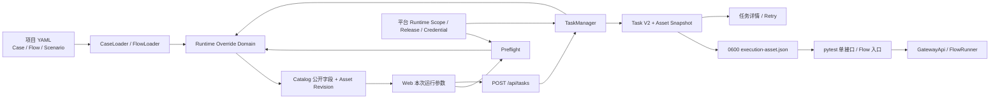

# 接口自动化“仅本次运行参数修改”详细开发设计与实施计划

> **For agentic workers:** REQUIRED SUB-SKILL: Use `superpowers:subagent-driven-development` (recommended) or `superpowers:executing-plans` to implement this plan task-by-task. Steps use checkbox (`- [ ]`) syntax for tracking.

**Goal:** 在不修改 YAML 唯一真源和平台配置唯一真源的前提下，为单接口 Case 与 Flow 增加 Web 任务级静态业务参数覆盖，并以不可变资产快照完成预检、执行、历史查看和重试。

**Architecture:** 工具内共享的 `runtime_overrides` 领域模块统一完成 Case 与 Flow 静态请求参数自动发现、可选声明校验、资产版本计算、覆盖值校验、安全深拷贝合并、公开视图和执行快照完整性校验。Flow 自动发现仅遍历真实 API 步骤的 `step_data.<step>.params`，动态模板和框架保留语义字段安全跳过。Catalog、Preflight、TaskManager 和 pytest 只调用该模块；浏览器仅提交逻辑字段和值，不能提交目标路径。任务记录保留完整内部资产快照，pytest 通过任务专属 `0600` 临时文件执行，终态删除临时文件而保留历史审计快照。

**Tech Stack:** Python 3、pytest、Flask/Jinja2、原生 JavaScript、YAML、JSON、SHA-256、现有 TaskManager/TaskStore、JUnit、Allure。

**Spec:** [`接口自动化仅本次运行参数修改-PRD.md`](./接口自动化仅本次运行参数修改-PRD.md) V1.2；上位约束为 [`接口自动化多项目支持与Dating接入-PRD.md`](./接口自动化多项目支持与Dating接入-PRD.md) V1.3。

> **V1.2 实施修订：** 下文原始任务步骤保留为实施历史；凡涉及 Case 或 Flow 必须显式声明 `runtime_inputs`、未声明返回空字段、GetQuotaStatus 仅开放一个枚举字段或 Flow 采用显式最小白名单的描述，均由本修订替代。Case 自动发现安全静态 `request.params`；Flow 按 API 步骤自动发现安全静态 `step_data.<step>.params`。两者都提供自由输入，显式声明仅作为可选元数据和约束，同一目标不重复生成。

## Global Constraints

- YAML 继续是 API、Case、Flow、Scenario 和 fixture 的唯一真源；本功能不得写回任何项目资产文件。
- 平台继续是 Runtime Scope、Release、Gateway、公共 `comm`、Header、超时、轮询、Secret/Credential 和会话配置的唯一真源。
- dev 平台固定执行 test，prod 平台固定执行 prod；浏览器不得提交或覆盖环境。
- Case 自动开放安全静态 `request.params` 标量叶子；Flow 自动开放真实 API 步骤中安全静态的 `step_data.<step>.params` 标量叶子。
- 动态模板、Token、Secret、Gateway、Header、Profile、断言、提取规则、Flow 拓扑、文件路径和轮询配置均不可覆盖。
- P0 只支持 `string`、`integer`、`number`、`boolean`、`enum`，不支持对象、数组、任意 JSON、空值删除或字段新增。
- 非空 `runtime_overrides` 最多 32 项，规范化 JSON 最大 32 KiB，单个字符串最大 4096 个 Unicode 字符。
- `run_type=all` 和仅按标签批量执行不接受 `runtime_overrides`。
- 执行日志继续按当前产品规则保留请求业务参数和响应原文；本需求不调整日志目录、报告目录或脱敏策略。
- 不新增数据库、平台迁移、平台配置字段、公共 CLI 覆盖参数、前端框架或任务队列。
- 直接在 `/Users/admin/Testproject/api-autotest` 当前本机工作目录实施，不创建新的 worktree；实施前后保留用户已有未提交改动，只暂存当前任务确认过的文件。

---

## 1. 设计判断与交付范围

### 1.1 设计判断

这是面向测试工程师的桌面产品工作台，不是营销页面。主要任务是在创建单接口或 Flow 任务时快速、安全地修改少量业务参数，因此信息顺序固定为：

```text
当前测试资产与默认值
    ↓
本次修改及字段错误
    ↓
平台 Scope / Release / Profile 预检
    ↓
提交任务与查看不可变快照
```

页面保持当前 Apple-inspired 中性工作台风格，复用已有字体、颜色、圆角、间距和组件，不为每个字段增加独立阴影卡片，不引入弹窗式 YAML 编辑器。

### 1.2 本文交付边界

本文覆盖：

- YAML `runtime_inputs` 的可执行 schema；
- Case、Flow、Scenario Loader 接入；
- 共享校验、哈希、合并及快照模块；
- Catalog、Preflight、Task、Retry API；
- Task V2 增量字段及内部/公开视图隔离；
- TaskStore 私有执行资产文件；
- pytest 单接口和 Flow 对快照的消费；
- 创建任务、用例库和任务详情页面；
- Dating P0 验收资产；
- TDD、回归、本机发布、浏览器及 dev/test 真实链路验收。

本文不包含 Case/Flow 数据库存储、Web 永久编辑、审批发布、对象/数组编辑或平台配置控制面改造。

---

## 2. 现有实现基线与差距

### 2.1 可直接复用的能力

| 能力 | 当前位置 | 本期复用方式 |
| --- | --- | --- |
| Case YAML 白名单和展开 | `utils/custom/case_loader.py` | 在 Case 允许字段中增加 `runtime_inputs`，保持 `execution_case` 构造不变 |
| Flow/Scenario 配对和步骤校验 | `utils/custom/flow_loader.py` | 在 Scenario 校验结束后校验 Flow 运行时参数目标 |
| 只读用例目录 | `web/catalog.py` | 基于 Loader 已校验结果返回公开字段定义与资产版本 |
| 项目和资产归属校验 | `web/task_manager.py::_validate_input` | 保持当前项目隔离，增加资产快照解析入口 |
| 平台预检 | `web/app.py::_preflight_response` | 在现有文件输入校验之后、平台预检之前增加参数校验 |
| Task V2 | `web/task_manager.py`、`web/task_store.py` | 增量增加 `input.runtime_overrides` 和 `asset_snapshot`，不升版本 |
| 0600 文件和任务运行目录 | `TaskStore._write_manifest`、`runtime/<project>/<task>` | 新增 `execution-asset.json`，不新建另一套根目录 |
| pytest 资产收集 | `test_cases/test_single_api.py`、`test_gateway_flow.py` | 有内部执行快照时读取快照，无快照时保持 YAML 路径 |
| 原生 JS 任务表单 | `web/static/app.js::initTaskForm` | 增加字段状态、预检和提交字段，不引入框架 |
| Base Path 和共享模板 | `web/templates/base.html` | 所有链接继续使用现有 `base` 和 Flask 路由 |

### 2.2 当前差距

| 差距 | 当前行为 | 目标行为 |
| --- | --- | --- |
| 资产声明 | Case/Scenario 不允许 `runtime_inputs` | 资产显式声明字段、类型、约束和服务端目标 |
| Catalog | 只返回 Case/Flow 摘要 | 返回公开字段定义、默认值和 `asset_revision` |
| Preflight | 只校验资产选择、图片和平台上下文 | 同时校验资产版本与运行时覆盖值 |
| Task API | 不接受业务覆盖值 | 接受 `asset_revision + runtime_overrides`，拒绝路径和配置覆盖 |
| Task 记录 | 只记录选择与平台快照 | 记录基础值、覆盖值、最终值和完整内部执行资产 |
| pytest | 子进程重新读取当前 YAML | 有任务快照时只执行已固化资产 |
| Retry | 复制选择和图片 | 同时复制逻辑覆盖值，并对当前资产 schema 重新校验 |
| Web | 没有参数输入区 | 显示被明确开放的字段、修改状态、恢复默认和差异摘要 |

---

## 3. 总体架构



### 3.1 数据职责

| 数据 | 唯一真源 | 是否可由浏览器修改 |
| --- | --- | --- |
| Case/Flow/Scenario 基础值 | 项目 YAML | 否 |
| `runtime_inputs` 声明 | 项目 YAML | 否 |
| 本次覆盖值 | 当前任务请求与 Task V2 | 仅本次任务 |
| 最终执行资产 | Task V2 `asset_snapshot` | 否，服务端生成 |
| 环境/Gateway/comm/Secret/Credential | 平台 Release/Scope | 否 |
| 图片内容 | 当前任务私有输入目录 | 仅 multipart 上传 |

### 3.2 关键设计决定

1. 新增一个 `utils/custom/runtime_overrides.py`，避免 Case、Flow、Catalog 和 TaskManager 各自实现不同的规则。
2. 浏览器只接触公开字段定义，不返回 `target.scope`、`target.path` 或 `step_id` 的内部映射。
3. TaskManager 在任务记录落盘前重新加载资产并比较版本，消除 Preflight 与提交之间的竞态。
4. Task V2 保存完整内部资产快照；API 规范化响应删除内部目标和 `resolved_execution_asset`，避免列表/详情响应过大。
5. pytest 使用 `API_AUTOTEST_EXECUTION_ASSET_FILE` 读取任务快照；该变量只由 TaskManager 设置，不增加公共 CLI 参数。
6. 平台运行规划提供器只收到既有资产选择字段，不接收 `runtime_overrides` 业务数据。
7. Retry 不复用旧平台配置快照；它复制旧逻辑覆盖值和可用图片，再使用当前 YAML schema 与当前平台 Release 创建新任务。

---

## 4. 文件结构与职责

### 4.1 新增文件

| 文件 | 单一职责 |
| --- | --- |
| `utils/custom/runtime_overrides.py` | 运行时字段声明校验、受控路径解析、值校验、规范化哈希、覆盖合并、公开视图和执行文件读取校验 |
| `tests/test_runtime_overrides.py` | 领域规则、Loader 接入、哈希和合并的单元测试 |
| `tests/test_execution_asset.py` | TaskStore 私有文件及 pytest 快照消费的跨进程边界测试 |

### 4.2 修改文件

| 文件 | 修改内容 |
| --- | --- |
| `utils/custom/case_loader.py` | 允许并校验 Case `runtime_inputs`，把规范化定义随展开结果返回 |
| `utils/custom/flow_loader.py` | 校验 Scenario 顶层 `runtime_inputs` 与 Flow API 步骤绑定，随 FlowCase 返回 |
| `web/catalog.py` | 为 Case/Flow 返回公开输入字段和资产版本 |
| `web/task_store.py` | 写入、定位和精准清理 `execution-asset.json` |
| `web/task_manager.py` | 预览、提交、快照、执行文件、终态清理和 Retry |
| `web/app.py` | 请求契约、Preflight 错误模型、Task 参数传递和公开任务视图 |
| `test_cases/conftest.py` | 读取并校验内部执行资产，注册快照标签和注入快照 API 注册表 |
| `test_cases/test_single_api.py` | 平台任务存在快照时直接使用固化 `single_case` |
| `test_cases/test_gateway_flow.py` | 平台任务存在快照时直接使用固化 `flow_case` |
| `web/templates/task_form.html` | 本次运行参数区、差异预览和安全文案 |
| `web/templates/task_detail.html` | 资产版本、覆盖差异及两类重试入口 |
| `web/templates/catalog.html` | Case/Flow 临时参数数量列 |
| `web/static/app.js` | 字段渲染、类型解析、恢复默认、预检、提交、预填和详情展示 |
| `web/static/app.css` | 参数分组、修改状态、差异表和焦点样式 |
| `tests/test_catalog.py` | Catalog 新契约和内部目标不泄露测试 |
| `tests/test_task_store.py` | 执行资产文件权限、原子写入和清理测试 |
| `tests/test_task_manager.py` | 提交快照、版本冲突、执行文件、Retry 和平台数据隔离测试 |
| `tests/test_web_routes.py` | API 合约、错误码、multipart、公开视图和页面结构测试 |
| `tests/test_dating_assets.py` | Dating 三个验收资产声明测试 |
| `tests/test_project_isolation.py` | 同名字段跨项目隔离测试 |
| `projects/dating/data/cases/GetQuotaStatus.yaml` | 开放一个单接口静态业务字段 |
| `projects/dating/data/scenarios/multi_image_analysis.yaml` | 开放 `analysis_locale` |
| `projects/dating/data/scenarios/multi_image_reply.yaml` | 开放 `reply_locale` |

### 4.3 明确不修改

- `test-platform/backend/`、`test-platform/frontend/`；
- 平台数据库迁移；
- `projects/*/project.yaml` 配置契约；
- `runtest.py` 公共 CLI 参数；
- Gateway 协议、日志目录和报告目录；
- 现有图片上传 multipart 字段。

---

## 5. YAML 与领域数据设计

### 5.1 Case 声明

```yaml
api: GetQuotaStatus
cases:
  - id: get_analysis_quota_success
    name: 查询 Dating Analysis 月度额度
    tags: [dating, smoke, quota]
    request:
      params:
        product_code: dating_assistant
        entitlement_code: quota.dating.analysis.monthly
    runtime_inputs:
      quota_entitlement_code:
        label: 额度类型
        description: 仅影响本次 GetQuotaStatus 请求
        type: enum
        options:
          - quota.dating.analysis.monthly
          - quota.dating.reply.monthly
        target:
          scope: case_request
          path: $.entitlement_code
        required: true
    assert:
      http_status: 200
```

### 5.2 Flow/Scenario 声明

```yaml
name: Dating 多图关系分析并保留任务数据
variables: {}
runtime_inputs:
  analysis_locale:
    label: Analysis 结果语言
    description: 修改 CreateAnalysisTask 的 locale
    type: enum
    options: [en-US, zh-CN]
    target:
      scope: flow_step_request
      step_id: create_analysis
      path: $.locale
    required: true
step_data:
  create_analysis:
    params:
      client_request_id: "{{client_request_id}}"
      asset_ids: "{{asset_ids}}"
      locale: en-US
```

`runtime_inputs` 放在 Scenario，而不是 Flow YAML，原因是被修改的 `step_data.params` 属于 Scenario；Flow YAML 的 `inputs.media_files` 继续只表示外部文件输入和步骤拓扑。

### 5.3 声明字段白名单

| 字段 | 必填 | 规则 |
| --- | --- | --- |
| `label` | 是 | 非空字符串，最多 80 字符 |
| `description` | 否 | 字符串，最多 240 字符 |
| `type` | 是 | 五种 P0 类型之一 |
| `required` | 是 | 必须为布尔值 |
| `options` | 仅 enum | 1～100 个不重复非空字符串 |
| `min_length` | string 可选 | 0～4096 的整数 |
| `max_length` | string 可选 | 1～4096，且不小于 `min_length` |
| `pattern` | string 可选 | 可编译正则，表达式最长 256 字符 |
| `minimum` | number/integer 可选 | 非布尔数值 |
| `maximum` | number/integer 可选 | 非布尔数值，且不小于 `minimum` |
| `target` | 是 | Case 或 Flow 对应的固定对象结构 |

任何未知字段都使项目静态校验失败，避免拼写错误被静默忽略。

### 5.4 规范化内部定义

Loader 将 YAML 声明转成以下内部结构：

```python
{
    "analysis_locale": {
        "key": "analysis_locale",
        "label": "Analysis 结果语言",
        "description": "修改 CreateAnalysisTask 的 locale",
        "type": "enum",
        "required": True,
        "options": ["en-US", "zh-CN"],
        "constraints": {},
        "target": {
            "scope": "flow_step_request",
            "step_id": "create_analysis",
            "path": ["locale"],
        },
        "default_value": "en-US",
        "group": {
            "step_id": "create_analysis",
            "step_name": "CreateAnalysisTask",
        },
    }
}
```

内部 `path` 使用字符串 token 数组，不在执行期解释任意 JSONPath。公开响应移除 `target`，仅保留字段描述、约束、默认值和 `group`。

### 5.5 动态值与保留目标判断

以下任一条件成立时，声明无效：

- 基础值是字符串且包含 `{{runtime_variable}}` 一类模板表达式；
- 路径不存在或中间节点不是对象；
- 最终目标是对象或数组；
- 路径包含数组索引、通配符、过滤或递归表达式；
- 逻辑键、路径 token 或语义命中 Token、Secret、Credential、Gateway、Header、环境、Scope、Release、超时、轮询、幂等键、任务 ID、素材 ID、签名 URL 或文件路径；
- Flow `step_id` 不存在、不是 API 步骤，或 Scenario 没有对应 `step_data.params`；
- 两个逻辑字段指向同一目标。

保留字段判断不能只看字符串名称；例如 `url` 作为普通聊天文本字段不应仅因名称误判，但位于 Gateway/上传/传输配置语义时必须拒绝。P0 的可写根已被限制在 Case 请求 params 或 Scenario API 步骤 params，因此再用保留 token 作为第二道防线。

---

## 6. `runtime_overrides` 领域模块设计

### 6.1 公共接口

新文件 `utils/custom/runtime_overrides.py` 提供以下稳定接口：

```python
class RuntimeOverrideError(ValueError):
    """运行时声明、覆盖值、资产版本或执行快照不合法。"""

    status_code: int
    error_code: str
    message: str
    field_errors: list[dict[str, str]]


def validate_case_runtime_inputs(
    case: dict[str, Any],
    *,
    scope: str,
) -> dict[str, dict[str, Any]]:
    """校验 Case 声明并返回带默认值的内部定义。"""


def validate_flow_runtime_inputs(
    flow: dict[str, Any],
    scenario: dict[str, Any],
    *,
    scope: str,
) -> dict[str, dict[str, Any]]:
    """校验 Scenario 声明、步骤绑定和静态目标。"""


def canonical_sha256(document: Any) -> str:
    """返回带 `sha256:` 前缀的稳定规范化 JSON 摘要。"""


def build_case_asset_snapshot(
    project_id: str,
    single_case: dict[str, Any],
    api_definitions: dict[str, dict[str, Any]],
) -> dict[str, Any]:
    """生成未覆盖的单接口基础资产快照。"""


def build_flow_asset_snapshot(
    project_id: str,
    flow_case: dict[str, Any],
    api_definitions: dict[str, dict[str, Any]],
) -> dict[str, Any]:
    """生成未覆盖的 Flow 基础资产快照。"""


def public_asset_contract(snapshot: dict[str, Any]) -> dict[str, Any]:
    """返回不含目标路径和完整执行资产的浏览器安全视图。"""


def apply_runtime_overrides(
    snapshot: dict[str, Any],
    runtime_overrides: Any,
    *,
    expected_revision: str | None,
    require_revision: bool,
    schema_change_error: bool = False,
) -> dict[str, Any]:
    """校验并在深拷贝上应用覆盖，返回新的不可变资产快照。"""


def load_execution_asset_file(
    path: Path,
    *,
    runtime_root: Path,
    project_id: str,
    task_id: str,
) -> dict[str, Any]:
    """校验任务执行文件身份、路径、schema 和内容摘要。"""


def load_execution_asset_from_environment(
    *,
    runtime_root: Path,
    project_id: str,
    task_id: str,
    environ: Mapping[str, str] | None = None,
) -> dict[str, Any] | None:
    """从内部环境变量读取执行文件；未配置时返回 None。"""
```

### 6.2 常量

```python
RUNTIME_INPUT_TYPES = frozenset({"string", "integer", "number", "boolean", "enum"})
RUNTIME_OVERRIDE_MAX_FIELDS = 32
RUNTIME_OVERRIDE_MAX_BYTES = 32 * 1024
RUNTIME_OVERRIDE_MAX_STRING_LENGTH = 4096
RUNTIME_INPUT_KEY_PATTERN = re.compile(r"^[A-Za-z][A-Za-z0-9_-]{0,127}$")
RUNTIME_INPUT_PATH_PATTERN = re.compile(
    r"^\$\.[A-Za-z_][A-Za-z0-9_]*(?:\.[A-Za-z_][A-Za-z0-9_]*)*$"
)
DYNAMIC_TEMPLATE_PATTERN = re.compile(r"{{[^{}]+}}")
```

### 6.3 规范化哈希

```python
def canonical_sha256(document: Any) -> str:
    payload = json.dumps(
        document,
        ensure_ascii=False,
        sort_keys=True,
        separators=(",", ":"),
        allow_nan=False,
    ).encode("utf-8")
    return f"sha256:{hashlib.sha256(payload).hexdigest()}"
```

`asset_revision` 计算输入包括：项目 ID、资产类型、资产 ID、基础执行资产、当前资产所需 API 定义和规范化 `runtime_inputs`；不包括任务 ID、用户、平台配置、图片、mtime 或覆盖值。

`runtime_input_schema_revision` 只对规范化字段定义计算。`resolved_asset_revision` 对应用覆盖后的 `resolved_execution_asset` 计算，用于临时文件完整性校验。

### 6.4 值类型规则

| 类型 | Python 合法值 | 特别规则 |
| --- | --- | --- |
| string | `str` | 不自动把数字转字符串 |
| integer | `int` | `bool` 必须拒绝 |
| number | `int` 或 `float` | `bool`、NaN、Infinity 必须拒绝 |
| boolean | `bool` | 不接受字符串 `"true"` |
| enum | `str` | 必须精确命中 options，区分大小写 |

前端可以做即时校验，但服务端是唯一权威。服务端不得做隐式类型转换，避免用户看到的值与 Gateway 实际值不同。

### 6.5 覆盖结果

```python
{
    "schema_version": 1,
    "project_id": "dating",
    "asset_type": "flow",
    "asset_id": "multi_image_analysis",
    "asset_revision": "sha256:<base-asset-digest>",
    "runtime_input_schema_revision": "sha256:<runtime-input-schema-digest>",
    "runtime_input_definitions": {"analysis_locale": {}},
    "runtime_inputs": [{"key": "analysis_locale", "default_value": "en-US"}],
    "applied_overrides": [
        {
            "key": "analysis_locale",
            "label": "Analysis 结果语言",
            "step_id": "create_analysis",
            "base_value": "en-US",
            "override_value": "zh-CN",
            "resolved_value": "zh-CN",
        }
    ],
    "resolved_asset_revision": "sha256:<resolved-asset-digest>",
    "resolved_execution_asset": {
        "flow_case": {},
        "api_definitions": {},
    },
}
```

`runtime_inputs` 是公开字段列表，`runtime_input_definitions` 和 `resolved_execution_asset` 是内部字段。

---

## 7. Loader 与 Catalog 设计

### 7.1 CaseLoader

在 `_ALLOWED_CASE_FIELDS` 增加 `runtime_inputs`。`_expand_collection` 完成 `request.params` 校验后调用：

```python
runtime_inputs = validate_case_runtime_inputs(case, scope=case_scope)
```

展开结果增加：

```python
{
    "id": full_id,
    "api_id": api_id,
    "case_id": case_id,
    "name": name,
    "tags": tags,
    "runtime_inputs": runtime_inputs,
    "execution_case": build_execution_case(
        api_definitions[api_id],
        params,
        assertions,
        extract=extract,
        name=name,
    ),
}
```

没有声明时返回空字典，不改变现有执行对象。

### 7.2 FlowLoader

`_validate_flow` 先保留现有步骤和 Scenario 数据校验，再调用：

```python
runtime_inputs = validate_flow_runtime_inputs(
    flow,
    scenario,
    scope=f"Scenario {flow_id}",
)
```

为避免改变 `_validate_flow` 当前“返回引用 API ID 列表”的契约，可以在 `load_flow_cases` 中于 `_validate_flow` 成功后调用该函数，并把结果加入 `flow_case["runtime_inputs"]`。

### 7.3 Catalog

`build_catalog` 已加载完整 API 定义、Case 和 Flow。对每个资产构建基础快照并调用 `public_asset_contract`：

```python
case_snapshot = build_case_asset_snapshot(
    selected_project_id or "truthy",
    single_case,
    definitions,
)
cases.append({
    "api": single_case["api_id"],
    "id": single_case["case_id"],
    "name": single_case["name"],
    "tags": list(single_case["tags"]),
    "asset_revision": case_snapshot["asset_revision"],
    "runtime_inputs": case_snapshot["runtime_inputs"],
    "runtime_input_count": len(case_snapshot["runtime_inputs"]),
    "status": "available",
})
```

Flow 同理。响应中不得出现：

- `runtime_input_definitions`；
- `target`；
- `resolved_execution_asset`；
- YAML 文件系统路径；
- 平台配置或 Credential 值。

---

## 8. API 与 Preflight 设计

### 8.1 新版请求字段白名单

```python
NEW_TASK_PAYLOAD_KEYS = {
    "project_id",
    "run_type",
    "api_id",
    "case_id",
    "flow_id",
    "tag",
    "asset_revision",
    "runtime_overrides",
    "inputs",  # 仅 Preflight；Task JSON 提交仍禁止
}
```

新版请求出现未知顶层字段时返回 `INVALID_PARAMS`。旧版无 `project_id` 的兼容请求继续只接受既有 `env/run_type/flow/tag`，并明确拒绝 `runtime_overrides`。

### 8.2 Preflight 顺序

```text
1. 校验请求顶层字段
2. 校验项目、run_type、API/Case/Flow 归属
3. 校验图片元数据
4. 构建当前基础资产快照
5. 比较 asset_revision 并校验 runtime_overrides
6. 返回字段级错误或覆盖差异
7. 继续现有 Scope / Release / Config Contract / Profile 校验
8. 合并成同一 ready/errors 响应
```

参数错误优先于平台错误，便于用户在当前页面直接修正。`POST /api/preflight` 仍以 HTTP 200 返回 `ready=false` 的业务状态；`POST /api/tasks` 对运行时参数错误返回 400，对资产版本变化返回 409。

### 8.3 Preflight 响应

```json
{
  "ready": true,
  "project": {},
  "runtime": {},
  "profiles": [],
  "asset": {
    "asset_type": "flow",
    "asset_id": "multi_image_analysis",
    "asset_revision": "sha256:<base-asset-digest>",
    "runtime_input_schema_revision": "sha256:<runtime-input-schema-digest>",
    "runtime_inputs": [],
    "applied_overrides": [],
    "override_count": 1
  },
  "errors": []
}
```

### 8.4 错误响应

扩展 `SubmissionError`，增加可选 `details`：

```python
class SubmissionError(RuntimeError):
    def __init__(
        self,
        status_code: int,
        error_code: str,
        message: str,
        *,
        details: dict[str, Any] | None = None,
    ) -> None:
        super().__init__(message)
        self.status_code = status_code
        self.error_code = error_code
        self.message = message
        self.details = details or {}
```

错误处理器响应：

```json
{
  "error": "字段值不符合运行约束",
  "error_code": "RUNTIME_OVERRIDE_CONSTRAINT_FAILED",
  "field_errors": [
    {
      "field": "analysis_locale",
      "code": "RUNTIME_OVERRIDE_CONSTRAINT_FAILED",
      "message": "请选择 en-US 或 zh-CN"
    }
  ]
}
```

现有错误响应没有 `details` 时保持原结构。

### 8.5 错误码映射

| 错误码 | Preflight | Task 提交/Retry |
| --- | --- | --- |
| `RUNTIME_OVERRIDE_NOT_SUPPORTED` | `ready=false` | 400 |
| `RUNTIME_OVERRIDE_UNKNOWN_KEY` | `ready=false` | 400 |
| `RUNTIME_OVERRIDE_TYPE_INVALID` | `ready=false` | 400 |
| `RUNTIME_OVERRIDE_CONSTRAINT_FAILED` | `ready=false` | 400 |
| `RUNTIME_OVERRIDE_TARGET_INVALID` | `ready=false` | 400 |
| `RUNTIME_OVERRIDE_PAYLOAD_TOO_LARGE` | `ready=false` | 400 |
| `RUNTIME_OVERRIDE_SCHEMA_CHANGED` | `ready=false` | 409 |

---

## 9. TaskManager、TaskStore 与 Retry 设计

### 9.1 TaskManager 新接口

```python
def preview_asset(
    self,
    selection: dict[str, Any],
    *,
    asset_revision: str | None = None,
    runtime_overrides: Any = None,
) -> dict[str, Any] | None:
    """构建当前资产并返回浏览器安全预览；all 返回 None。"""


def submit(
    self,
    env: str | None = None,
    run_type: str = "",
    flow: str | None = None,
    tag: str | None = None,
    signed_user_context: str = "",
    *,
    project_id: str | None = None,
    api_id: str | None = None,
    case_id: str | None = None,
    flow_id: str | None = None,
    asset_revision: str | None = None,
    runtime_overrides: Any = None,
    retry_of: str | None = None,
    uploads: Iterable[Any] | None = None,
    _retry_input_record: dict[str, Any] | None = None,
) -> dict[str, Any]:
    """按 Task 5 定义的校验、快照、持久化和启动顺序创建新任务。"""
```

### 9.2 资产加载

新增私有方法：

```python
def _build_selected_asset_snapshot(
    self,
    task_input: dict[str, Any],
) -> dict[str, Any] | None:
    package = self._registry.get(task_input["project_id"])
    definitions = load_api_definitions(package.root)
    if task_input["run_type"] == "single":
        full_id = f"{task_input['api_id']}::{task_input['case_id']}"
        selected = load_single_cases(package.root, (full_id,))[0]
        return build_case_asset_snapshot(package.project_id, selected, definitions)
    if task_input["run_type"] == "flow":
        selected = load_flow_cases(package.root, task_input["flow_id"])[0]
        return build_flow_asset_snapshot(package.project_id, selected, definitions)
    return None
```

### 9.3 提交时机

资产快照应在获取任务锁之前构建并校验，以免 YAML 解析占用单槽锁；进入锁后不再读取 YAML。顺序如下：

```text
_validate_input
_precheck_credentials
_build_selected_asset_snapshot
apply_runtime_overrides
    ↓
进入单槽锁
new_task_id
平台 runtime plan
保存图片或克隆图片
构造 Task V2 + asset_snapshot
TaskStore.save
启动子进程
```

对于普通 Web 提交，非空覆盖值必须提供并命中 `asset_revision`。对于内部 Retry，`require_revision=False`，但任何字段删除、类型变化或不再开放都转换为 409 `RUNTIME_OVERRIDE_SCHEMA_CHANGED`。

### 9.4 平台数据隔离

`_plan_runtime` 不把完整 `task_input` 传给平台 Provider，改为只传：

```python
PLATFORM_SELECTION_KEYS = (
    "project_id",
    "run_type",
    "api_id",
    "case_id",
    "flow_id",
    "tag",
)
provider_selection = {
    key: task_input.get(key)
    for key in PLATFORM_SELECTION_KEYS
}
```

`runtime_overrides`、基础值和最终值始终留在 `api-autotest`。

### 9.5 Task V2 增量字段

```json
{
  "schema_version": 2,
  "input": {
    "project_id": "dating",
    "run_type": "flow",
    "flow_id": "multi_image_analysis",
    "asset_revision": "sha256:<base-asset-digest>",
    "runtime_overrides": {
      "analysis_locale": "zh-CN"
    }
  },
  "asset_snapshot": {
    "schema_version": 1,
    "asset_type": "flow",
    "asset_id": "multi_image_analysis",
    "asset_revision": "sha256:<base-asset-digest>",
    "runtime_input_schema_revision": "sha256:<runtime-input-schema-digest>",
    "runtime_input_definitions": {},
    "runtime_inputs": [],
    "applied_overrides": [],
    "resolved_asset_revision": "sha256:<resolved-asset-digest>",
    "resolved_execution_asset": {}
  }
}
```

`_normalize_task_record` 必须移除 `runtime_input_definitions` 和 `resolved_execution_asset`，公开以下字段：

```json
{
  "asset_snapshot": {
    "asset_type": "flow",
    "asset_id": "multi_image_analysis",
    "asset_revision": "sha256:<base-asset-digest>",
    "runtime_input_schema_revision": "sha256:<runtime-input-schema-digest>",
    "runtime_inputs": [],
    "applied_overrides": [],
    "override_count": 1
  }
}
```

### 9.6 TaskStore 私有文件

新增：

```python
def execution_asset_path(self, task_id: str, project_id: str) -> Path:
    return self.console_dir(task_id, project_id) / "execution-asset.json"


def save_execution_asset(
    self,
    task_id: str,
    project_id: str,
    document: dict[str, Any],
) -> Path:
    path = self.execution_asset_path(task_id, project_id)
    path.parent.mkdir(parents=True, exist_ok=True)
    self._write_manifest(path, document)
    return path


def cleanup_execution_asset(self, task_id: str, project_id: str) -> None:
    self.execution_asset_path(task_id, project_id).unlink(missing_ok=True)
```

写入文件结构：

```json
{
  "schema_version": 1,
  "task_id": "20260829-120000-abcd",
  "project_id": "dating",
  "asset_type": "flow",
  "asset_id": "multi_image_analysis",
  "asset_revision": "sha256:<base-asset-digest>",
  "resolved_asset_revision": "sha256:<resolved-asset-digest>",
  "resolved_execution_asset": {}
}
```

文件权限固定 `0600`，路径固定为：

```text
runtime/<project_id>/<task_id>/execution-asset.json
```

它与同目录的 `snapshot.json`、`console.log` 是同一任务的不同产物：

- `snapshot.json`：平台运行配置和凭证快照；
- `execution-asset.json`：工具测试资产快照；
- `console.log`：子进程输出。

终态、启动失败、取消、超时和服务重启恢复时只精准删除两个临时 JSON，保留 `console.log` 和历史 Task V2。

### 9.7 Retry

直接 Retry：

```python
original_overrides = (
    original.get("input", {}).get("runtime_overrides") or {}
)
return self.submit(
    project_id=str(project_id),
    run_type=str(selection.get("run_type") or ""),
    api_id=selection.get("api_id"),
    case_id=selection.get("case_id"),
    flow_id=selection.get("flow_id"),
    tag=selection.get("tag"),
    runtime_overrides=original_overrides,
    asset_revision=None,
    retry_of=task_id,
    _retry_input_record=original,
    signed_user_context=signed_user_context,
)
```

“修改参数后重试”不调用 Retry API，而是进入：

```text
/tasks/new/single?retry_from=<task_id>
/tasks/new/flow?retry_from=<task_id>
```

页面读取授权后的任务公开详情，预选项目和资产、填入原逻辑覆盖值；图片必须重新选择时给出明确提示。

---

## 10. pytest 执行快照设计

### 10.1 内部环境变量

TaskManager 在 Popen 环境增加：

```text
API_AUTOTEST_EXECUTION_ASSET_FILE=/Users/admin/Testproject/api-autotest/runtime/dating/<task_id>/execution-asset.json
```

不增加 `--runtime-overrides-file` 或任意文件路径 CLI 参数，防止公共入口扩展为不受控资产注入。

### 10.2 文件读取校验

`load_execution_asset_file` 必须校验：

- 文件存在、是普通文件且不是符号链接；
- 文件名为 `execution-asset.json`；
- 文件路径严格等于 `runtime_root/<project_id>/<task_id>/execution-asset.json`，而不是仅检查最后两级目录；
- `schema_version=1`；
- 文件内项目和任务身份与 pytest 参数一致；
- 资产类型、ID 和执行对象结构匹配；
- `canonical_sha256(resolved_execution_asset)` 等于 `resolved_asset_revision`。

任何失败在 platform 模式下必须使 pytest 非零退出，不能回退当前 YAML。

### 10.3 pytest_configure

有执行资产文件时，只从快照中注册所选 Case/Flow 的 tags；没有文件时保持当前项目全量 YAML marker 注册逻辑。这可以避免任务创建后无关 YAML 改动影响已固化任务收集。

### 10.4 单接口入口

`test_cases/test_single_api.py::_load_case_params`：

```python
execution_asset = load_execution_asset_from_environment(
    runtime_root=PROJECT_ROOT / "runtime",
    project_id=project_id,
    task_id=str(config.getoption("--task-id") or ""),
)
if execution_asset is not None:
    if execution_asset["asset_type"] != "case":
        raise CaseConfigError("执行资产类型与单接口入口不匹配")
    single_case = deepcopy(
        execution_asset["resolved_execution_asset"]["single_case"]
    )
    return [_as_pytest_param(single_case, project_id)]
```

将当前构造 `pytest.param` 的代码提取为小函数 `_as_pytest_param`，避免 YAML 路径和快照路径复制 marker 逻辑。

### 10.5 Flow 入口

`test_cases/test_gateway_flow.py::_load_selected_flow_cases` 在存在快照时返回唯一固化 `flow_case`。图片仍从现有 `API_AUTOTEST_TASK_INPUT_MANIFEST_FILE` 独立读取并注入 `media_files`，不会进入 `runtime_overrides`。

### 10.6 Gateway API 注册表

`gateway_api` fixture 优先使用：

```python
execution_asset["resolved_execution_asset"]["api_definitions"]
```

没有执行资产文件时继续调用 `load_api_definitions(project_package.root)`。这样所选 API、自动会话依赖和 Flow 引用在任务开始后都不受当前 YAML 变化影响。

---

## 11. Web 页面与交互设计

### 11.1 创建任务页

在资产选择与标签之后、Preflight 之前增加一个真实内容分组，不新增侧栏菜单：

```html
<section class="runtime-inputs" id="task-runtime-inputs" aria-labelledby="runtime-input-heading" hidden>
  <div class="runtime-inputs-heading">
    <div>
      <h3 id="runtime-input-heading">本次运行参数</h3>
      <p>仅影响本次新任务，不修改用例文件和平台配置。</p>
    </div>
    <button class="text-button" id="runtime-input-reset-all" type="button" hidden>
      全部恢复默认值
    </button>
  </div>
  <div id="runtime-input-fields"></div>
  <p class="field-message" id="runtime-input-summary" aria-live="polite"></p>
</section>
```

如果没有声明字段，区域仍显示克制空态：`该用例未开放临时参数，将按 YAML 默认值执行。`

### 11.2 字段布局

- 字段按 Case 或 Flow 步骤分组；
- 每行左侧显示标签、说明、步骤/API，右侧是控件与“恢复默认值”；
- 默认值使用等宽文本展示；
- 修改后显示“已修改”文本徽标，不只改变颜色；
- 字段错误紧邻控件并进入 `aria-describedby`；
- `boolean` 使用有明确“是/否”文本的 select，不使用仅靠状态颜色的开关；
- `enum` 使用 select；其余使用对应原生 input；
- 不显示内部 `target.path`。

### 11.3 前端状态

`initTaskForm` 增加：

```javascript
let runtimeInputDefinitions = [];
let runtimeOverrides = {};
let assetRevision = "";
let retrySource = null;
```

选择资产时：

1. 从 Catalog 找到资产；
2. 清空旧资产覆盖值；
3. 保存 `asset_revision`；
4. 渲染 `runtime_inputs`；
5. 如果存在 `retry_from`，只应用逻辑键仍存在且类型兼容的原覆盖值；
6. 调用 Preflight。

提交 payload：

```javascript
if (Object.keys(runtimeOverrides).length) {
  payload.asset_revision = assetRevision;
  payload.runtime_overrides = Object.assign({}, runtimeOverrides);
}
```

默认值未修改时不提交字段；`false`、`0` 不能因 truthy 判断丢失。

### 11.4 输入解析

```javascript
function parseRuntimeInputControlValue(definition, rawValue) {
  if (definition.type === "boolean") return { ok: true, value: rawValue === "true" };
  if (definition.type === "integer") {
    if (!/^-?\d+$/.test(rawValue)) return { ok: false, message: "请输入整数" };
    return { ok: true, value: Number.parseInt(rawValue, 10) };
  }
  if (definition.type === "number") {
    const value = Number(rawValue);
    if (rawValue.trim() === "" || !Number.isFinite(value)) {
      return { ok: false, message: "请输入有限数值" };
    }
    return { ok: true, value };
  }
  return { ok: true, value: rawValue };
}
```

只有 `ok=true` 时才写入 `runtimeOverrides`；格式错误立即显示在控件下方、清空 `lastPreflight` 并禁用提交。客户端校验用于即时反馈，服务端仍重新校验所有类型和约束。

### 11.5 Preflight 防竞态

沿用 `preflightGeneration`。任何项目、资产、字段或图片变化都推进代次。返回成功后使用响应中的最新 `asset.asset_revision` 更新本地版本；如果收到 `RUNTIME_OVERRIDE_SCHEMA_CHANGED`：

- 禁止提交；
- 重新获取 Catalog；
- 保留仍兼容的输入草稿；
- 显示“用例已更新，请重新确认本次参数”；
- 用户再次确认并通过 Preflight 后才启用提交。

### 11.6 预览区

在现有 Scope/Release/Profile 下增加：

- 资产版本：显示 SHA-256 前 12 位，完整值在 title；
- 本次修改：`未修改` 或 `2 项`；
- 差异表：仅展示已修改字段的基础值 → 最终值；
- Flow 图片摘要继续独立显示。

### 11.7 任务详情

新增“本次运行参数”Panel：

- 无覆盖：显示“本任务按 YAML 默认值执行”；
- 有覆盖：展示字段、步骤、基础值、覆盖值、最终值；
- 展示资产 ID 和版本；
- 不返回或显示目标路径、完整执行资产或平台 Secret；
- 原始业务值不脱敏，与当前日志策略一致。

操作区改为：

- `按原运行参数重试`：调用现有 Retry API；
- `修改参数后重试`：进入带 `retry_from` 的创建页；
- `取消任务`、`查看 Allure` 保持原逻辑。

### 11.8 用例库

Case 和 Flow 表增加“临时参数”列：

- `0`：显示“未开放”；
- 大于 0：显示“可修改 N 项”；
- 只读，不提供编辑按钮。

### 11.9 视觉与可访问性

- 沿用 `#f5f5f7`、`#ffffff`、`#1d1d1f`、`#6e6e73`、`#0071e3`；
- 使用 8px 间距网格、10px 控件圆角、12～16px 容器圆角；
- 参数行用分隔线组织，不做 Bento 卡片墙；
- 1280px 和 1440px 完整可操作；本期不承担移动端；
- 所有输入具备 `<label>`、`aria-describedby`、可见 `:focus-visible`；
- 错误、已修改和成功状态必须有文本；
- 动画限制为 150～250ms，并在 `prefers-reduced-motion` 下关闭非必要过渡。

---

## 12. 兼容、安全与失败策略

### 12.1 向后兼容

- 没有 `runtime_inputs` 的 YAML 正常加载，返回空字段列表；
- 老 Web/API 客户端不提交新字段时行为不变；
- 历史任务没有 `asset_snapshot` 时显示“未记录本次运行参数”；
- Task schema 保持 V2，新字段均可选；
- local CLI 和 Jenkins 不增加覆盖能力，继续读取 YAML；
- 图片 multipart 和任务保留逻辑不变。

### 12.2 安全边界

- 客户端永远不能提交目标路径或步骤映射；
- 不用 `eval`、通用 JSONPath 执行器或模板执行用户输入；
- 不通过 shell 拼接用户值；
- 不把业务覆盖值发送测试开发平台；
- 任务执行文件固定路径、0600、非符号链接、身份一致且带内容摘要；
- 平台模式缺少或篡改执行文件时 fail-closed，不回退 YAML；
- API 列表和任务详情不暴露完整内部执行快照；
- 凭证类语义既不能在 YAML 声明，也不能通过未知字段提交。

### 12.3 失败原子性

- 覆盖校验失败：不创建任务，不保存图片；
- 图片保存失败：不创建任务，清理半成品；
- Task JSON 保存失败：清理无主图片和执行临时文件；
- Popen 失败：任务置 `failed`，删除两个临时快照；
- pytest 非零：保留 Task V2、日志、JUnit/Allure，删除执行临时文件；
- 服务重启恢复：将旧 running/pending 任务按现有规则终态化，并精准删除遗留 `snapshot.json` 和 `execution-asset.json`。

---

## 13. 分任务实施计划

### Task 1: 建立运行时覆盖领域模型

**Files:**
- Create: `utils/custom/runtime_overrides.py`
- Create: `tests/test_runtime_overrides.py`

**Interfaces:**
- Produces: `RuntimeOverrideError`、`canonical_sha256`、`validate_case_runtime_inputs`、`validate_flow_runtime_inputs`、`build_case_asset_snapshot`、`build_flow_asset_snapshot`、`public_asset_contract`、`apply_runtime_overrides`、`load_execution_asset_file`、`load_execution_asset_from_environment`。
- Consumes: 仅 Python 标准库和 Loader 已解析的普通 dict；不得依赖 Flask、TaskManager 或平台模块。

- [ ] **Step 1: 保存当前基线**

Run:

```bash
cd /Users/admin/Testproject/api-autotest
python3 -m pytest tests/test_catalog.py tests/test_task_manager.py tests/test_web_routes.py -q
python3 runtest.py --validate-projects
```

Expected: 记录现有通过数量；已有失败单独记录，不把它们归因于本需求。

- [ ] **Step 2: 编写声明、类型、动态值和保留字段失败测试**

```python
def make_case_snapshot(input_type):
    """构造仅含一个可编辑字段的最小单接口快照。"""
    default_values = {
        "integer": 1,
        "number": 1.5,
        "boolean": True,
        "string": "base",
    }
    default_value = default_values[input_type]
    case = {
        "request": {"params": {"editable": default_value}},
        "runtime_inputs": {
            "editable": {
                "label": "可编辑值",
                "type": input_type,
                "required": True,
                "target": {"scope": "case_request", "path": "$.editable"},
            }
        },
    }
    runtime_inputs = validate_case_runtime_inputs(case, scope="Case Demo::success")
    single_case = {
        "id": "Demo::success",
        "api_id": "Demo",
        "case_id": "success",
        "name": "Demo success",
        "tags": ["unit"],
        "runtime_inputs": runtime_inputs,
        "execution_case": {"request": {"params": {"editable": default_value}}},
    }
    api_definitions = {
        "Demo": {
            "id": "Demo",
            "request": {
                "service_name": "example.DemoService",
                "method_name": "Demo",
            },
        }
    }
    return build_case_asset_snapshot("dating", single_case, api_definitions)


def test_case_runtime_input_rejects_dynamic_target():
    case = {
        "request": {"params": {"client_request_id": "{{client_request_id}}"}},
        "runtime_inputs": {
            "request_id": {
                "label": "请求 ID",
                "type": "string",
                "required": True,
                "target": {"scope": "case_request", "path": "$.client_request_id"},
            }
        },
    }
    with pytest.raises(RuntimeOverrideError) as error:
        validate_case_runtime_inputs(case, scope="Case demo")
    assert error.value.error_code == "RUNTIME_OVERRIDE_TARGET_INVALID"


@pytest.mark.parametrize(
    ("input_type", "value"),
    [("integer", True), ("number", float("nan")), ("boolean", "true")],
)
def test_runtime_override_rejects_implicit_or_non_finite_values(input_type, value):
    snapshot = make_case_snapshot(input_type=input_type)
    with pytest.raises(RuntimeOverrideError) as error:
        apply_runtime_overrides(
            snapshot,
            {"editable": value},
            expected_revision=snapshot["asset_revision"],
            require_revision=True,
        )
    assert error.value.error_code == "RUNTIME_OVERRIDE_TYPE_INVALID"
```

- [ ] **Step 3: 运行测试并确认失败**

Run:

```bash
python3 -m pytest tests/test_runtime_overrides.py -q
```

Expected: FAIL，原因是模块或公共接口尚不存在。

- [ ] **Step 4: 实现最小领域模块**

实现前述接口、常量、字段白名单、受控对象路径、五种类型、大小限制和稳定哈希。关键错误类：

```python
class RuntimeOverrideError(ValueError):
    """携带稳定 HTTP/业务错误和字段错误的领域异常。"""

    def __init__(
        self,
        status_code: int,
        error_code: str,
        message: str,
        *,
        field_errors: list[dict[str, str]] | None = None,
    ) -> None:
        super().__init__(message)
        self.status_code = status_code
        self.error_code = error_code
        self.message = message
        self.field_errors = list(field_errors or [])
```

- [ ] **Step 5: 补齐哈希稳定、深拷贝、不存在路径、重复目标、32 项和 32 KiB 边界测试**

Run:

```bash
python3 -m pytest tests/test_runtime_overrides.py -q
```

Expected: PASS。

- [ ] **Step 6: 检查本任务差异并提交检查点**

```bash
git diff -- utils/custom/runtime_overrides.py tests/test_runtime_overrides.py
git add utils/custom/runtime_overrides.py tests/test_runtime_overrides.py
git commit -m "feat(api-autotest): add runtime override domain model"
```

只在确认差异不含用户既有无关内容时提交；否则保留未提交并继续下一任务。

### Task 2: 接入 CaseLoader、FlowLoader 与项目静态校验

**Files:**
- Modify: `utils/custom/case_loader.py:32-40,123-219`
- Modify: `utils/custom/flow_loader.py:219-481,484-556`
- Modify: `tests/conftest.py:123-242`
- Modify: `tests/test_runtime_overrides.py`
- Test: `tests/test_project_registry.py`

**Interfaces:**
- Consumes: Task 1 的 `validate_case_runtime_inputs`、`validate_flow_runtime_inputs`。
- Produces: `single_case["runtime_inputs"]` 和 `flow_case["runtime_inputs"]`，均为内部规范化 dict。

- [ ] **Step 1: 编写 Loader 接入失败测试**

先扩展现有 `multi_project_root` 夹具：在 Dating `GetMe::get_me_success` 的 `request.params.locale` 写入 `en-US`，并声明 Case 字段 `client_locale`；在 `dating_demo_flow` 的 `step_data.get_me.params.locale` 写入 `en-US`，并在同名 Scenario 顶层声明指向 `get_me` 步骤的同名字段。这个公共夹具后续被 Catalog、TaskManager 和 Web 路由测试共用，不再另造同义测试项目。

```python
def test_case_loader_returns_normalized_runtime_inputs(multi_project_root):
    project = multi_project_root / "projects" / "dating"
    selected = load_single_cases(
        project,
        ("GetMe::get_me_success",),
    )[0]
    field = selected["runtime_inputs"]["client_locale"]
    assert field["default_value"] == "en-US"
    assert field["target"]["path"] == ["locale"]


def test_flow_loader_rejects_runtime_input_targeting_unknown_step(multi_project_root):
    project = multi_project_root / "projects" / "dating"
    scenario = project / "data/scenarios/dating_demo_flow.yaml"
    scenario.write_text(
        scenario.read_text(encoding="utf-8").replace(
            "step_id: get_me",
            "step_id: missing",
        ),
        encoding="utf-8",
    )
    with pytest.raises(FlowConfigError, match="missing"):
        load_flow_cases(project, "dating_demo_flow")
```

- [ ] **Step 2: 运行测试确认未知字段失败**

Run:

```bash
python3 -m pytest tests/test_runtime_overrides.py tests/test_project_registry.py -q
```

Expected: FAIL，Case 当前拒绝 `runtime_inputs` 或 Flow 不返回声明。

- [ ] **Step 3: 修改两个 Loader**

Case：把 `runtime_inputs` 加入 `_ALLOWED_CASE_FIELDS`，在 params 校验后调用共享模块，并随展开结果返回。

Flow：在 `_validate_flow` 完整成功后校验 Scenario `runtime_inputs`，随 FlowCase 返回；不得改变 `inputs.media_files` 逻辑。

- [ ] **Step 4: 验证无声明资产兼容与全项目校验**

Run:

```bash
python3 -m pytest tests/test_runtime_overrides.py tests/test_project_registry.py tests/test_project_isolation.py -q
python3 runtest.py --validate-projects
```

Expected: 全部 PASS，现有项目无需立即增加声明。

- [ ] **Step 5: 提交检查点**

```bash
git diff -- utils/custom/case_loader.py utils/custom/flow_loader.py tests/conftest.py tests/test_runtime_overrides.py tests/test_project_registry.py
git add utils/custom/case_loader.py utils/custom/flow_loader.py tests/conftest.py tests/test_runtime_overrides.py tests/test_project_registry.py
git commit -m "feat(api-autotest): validate runtime inputs in asset loaders"
```

### Task 3: 扩展 Catalog 公开契约

**Files:**
- Modify: `web/catalog.py:101-215`
- Modify: `tests/test_catalog.py`

**Interfaces:**
- Consumes: Loader 规范化定义、`build_case_asset_snapshot`、`build_flow_asset_snapshot`、`public_asset_contract`。
- Produces: Case/Flow 的 `asset_revision`、`runtime_inputs` 和 `runtime_input_count`。

- [ ] **Step 1: 编写 Catalog 契约失败测试**

```python
def test_catalog_exposes_runtime_inputs_without_internal_targets(project_root):
    catalog = build_catalog(project_root, "dating")
    flow = next(item for item in catalog["flows"] if item["id"] == "multi_image_analysis")
    assert flow["asset_revision"].startswith("sha256:")
    assert flow["runtime_input_count"] >= 1
    serialized = json.dumps(flow, ensure_ascii=False)
    assert '"target"' not in serialized
    assert "resolved_execution_asset" not in serialized
```

- [ ] **Step 2: 运行测试确认失败**

```bash
python3 -m pytest tests/test_catalog.py -q
```

Expected: FAIL，Catalog 尚未返回新字段。

- [ ] **Step 3: 实现 Case/Flow 公开投影**

复用当前已加载 `definitions`；不要重新扫描其他项目，不要把某个坏 Flow 的错误扩大为整个 Catalog 失败。

- [ ] **Step 4: 验证字段顺序、稳定哈希和坏资产降级**

```bash
python3 -m pytest tests/test_catalog.py tests/test_project_isolation.py -q
```

Expected: PASS。

- [ ] **Step 5: 提交检查点**

```bash
git add web/catalog.py tests/test_catalog.py
git commit -m "feat(api-autotest): expose runtime input catalog contracts"
```

### Task 4: 增加 TaskStore 私有执行资产文件

**Files:**
- Modify: `web/task_store.py:79-188,422-470`
- Modify: `tests/test_task_store.py`
- Create: `tests/test_execution_asset.py`

**Interfaces:**
- Produces: `execution_asset_path`、`save_execution_asset`、`cleanup_execution_asset`。
- Consumes: 任务 ID 与项目 ID 的现有路径安全校验、`_write_manifest` 的 0600 原子写入。

- [ ] **Step 1: 编写权限和精准清理失败测试**

```python
def test_execution_asset_is_0600_and_cleanup_keeps_console(store):
    task_id = "20260829-120000-abcd"
    project_id = "dating"
    console = store.console_log_path(task_id, project_id)
    console.parent.mkdir(parents=True)
    console.write_text("keep", encoding="utf-8")
    path = store.save_execution_asset(
        task_id,
        project_id,
        {"schema_version": 1, "task_id": task_id, "project_id": project_id},
    )
    assert stat.S_IMODE(path.stat().st_mode) == 0o600
    store.cleanup_execution_asset(task_id, project_id)
    assert not path.exists()
    assert console.read_text(encoding="utf-8") == "keep"
```

- [ ] **Step 2: 运行测试确认方法不存在**

```bash
python3 -m pytest tests/test_task_store.py tests/test_execution_asset.py -q
```

Expected: FAIL，TaskStore 尚无执行资产方法。

- [ ] **Step 3: 实现路径、写入和清理**

使用固定文件名，禁止接受浏览器文件名；不得递归删除任务目录。

- [ ] **Step 4: 验证路径穿越、符号链接和原子写入**

```bash
python3 -m pytest tests/test_task_store.py tests/test_execution_asset.py -q
```

Expected: PASS。

- [ ] **Step 5: 提交检查点**

```bash
git add web/task_store.py tests/test_task_store.py tests/test_execution_asset.py
git commit -m "feat(api-autotest): persist private execution asset snapshots"
```

### Task 5: 扩展 TaskManager 提交、快照与 Retry

**Files:**
- Modify: `web/task_manager.py:74-84,156-266,364-560,563-650,812-930,989-1028,1212-1260`
- Modify: `tests/test_task_manager.py`
- Modify: `tests/test_project_isolation.py`

**Interfaces:**
- Consumes: Tasks 1～4 的领域与 TaskStore 接口。
- Produces: `preview_asset`、扩展后的 `submit`、Task V2 `asset_snapshot`、内部执行文件生命周期和兼容 Retry。

- [ ] **Step 1: 编写提交与版本冲突失败测试**

```python
def test_submit_persists_resolved_asset_snapshot(
    multi_project_root,
    make_manager,
    monkeypatch,
):
    manager = make_manager(multi_project_root)
    patch_command(monkeypatch, manager, "raise SystemExit(0)")
    selection = manager._validate_input(
        None,
        "flow",
        None,
        None,
        project_id="dating",
        flow_id="dating_demo_flow",
    )
    preview = manager.preview_asset(
        selection,
        runtime_overrides={"client_locale": "zh-CN"},
    )
    record = manager.submit(
        project_id="dating",
        run_type="flow",
        flow_id="dating_demo_flow",
        asset_revision=preview["asset_revision"],
        runtime_overrides={"client_locale": "zh-CN"},
    )
    assert record["input"]["runtime_overrides"] == {"client_locale": "zh-CN"}
    assert record["asset_snapshot"]["applied_overrides"][0]["resolved_value"] == "zh-CN"


def test_submit_rejects_stale_asset_revision(multi_project_root, make_manager):
    manager = make_manager(multi_project_root)
    with pytest.raises(SubmissionError) as error:
        manager.submit(
            project_id="dating",
            run_type="single",
            api_id="GetMe",
            case_id="get_me_success",
            asset_revision=f"sha256:{'0' * 64}",
            runtime_overrides={"client_locale": "zh-CN"},
        )
    assert error.value.status_code == 409
    assert error.value.error_code == "RUNTIME_OVERRIDE_SCHEMA_CHANGED"
```

- [ ] **Step 2: 编写平台隔离与 Retry 失败测试**

验证 Provider 收到的 selection 不含 `runtime_overrides`；Retry 使用旧逻辑值、当前资产版本和新平台快照；当前 schema 删除字段后返回 409。

- [ ] **Step 3: 运行目标测试确认失败**

```bash
python3 -m pytest tests/test_task_manager.py tests/test_project_isolation.py -q
```

Expected: FAIL，新参数或快照尚未实现。

- [ ] **Step 4: 实现资产预览、提交和 Task V2**

在锁外构建快照；在记录保存前把 `asset_revision` 规范化为服务端实际版本。`run_type=all` 有覆盖值时抛 `RUNTIME_OVERRIDE_NOT_SUPPORTED`。

- [ ] **Step 5: 实现执行文件生命周期**

Popen 前调用 `save_execution_asset` 并设置 `API_AUTOTEST_EXECUTION_ASSET_FILE`；启动失败、终态和恢复时调用精准清理。

- [ ] **Step 6: 实现 Retry schema 变化映射**

Retry 不携带旧 `asset_revision`；领域层任何 unknown/type/constraint/target 变化统一映射为 409 `RUNTIME_OVERRIDE_SCHEMA_CHANGED`。

- [ ] **Step 7: 运行回归**

```bash
python3 -m pytest tests/test_task_manager.py tests/test_task_store.py tests/test_project_isolation.py tests/test_runtime_snapshot.py -q
```

Expected: PASS，现有单槽、取消、超时、图片克隆和平台快照测试不回归。

- [ ] **Step 8: 提交检查点**

```bash
git add web/task_manager.py tests/test_task_manager.py tests/test_project_isolation.py
git commit -m "feat(api-autotest): snapshot per-task runtime overrides"
```

### Task 6: 让 pytest 执行固化资产

**Files:**
- Modify: `test_cases/conftest.py:33-148,165-339`
- Modify: `test_cases/test_single_api.py:35-101`
- Modify: `test_cases/test_gateway_flow.py:65-165,252-340`
- Modify: `tests/test_execution_asset.py`
- Modify: `tests/test_project_cli.py`

**Interfaces:**
- Consumes: `API_AUTOTEST_EXECUTION_ASSET_FILE` 和 `load_execution_asset_file`。
- Produces: 平台任务的 Case/Flow/API definitions 全部来自固化快照；普通 CLI 仍使用 YAML。

- [ ] **Step 1: 编写快照优先与篡改失败测试**

```python
TASK_ID = "20260829-120000-abcd"


class FakePytestConfig:
    """只实现收集函数所需 getoption 的最小 pytest Config 替身。"""

    def __init__(self, project):
        self.options = {
            "--project": project,
            "--task-id": TASK_ID,
            "--api": None,
            "--case": None,
            "--flow": None,
        }

    def getoption(self, name):
        return self.options.get(name)


def fake_pytest_config(*, project):
    return FakePytestConfig(project)


def write_execution_asset(tmp_path, *, asset_type, locale="en-US"):
    task_dir = tmp_path / "runtime" / "dating" / TASK_ID
    task_dir.mkdir(parents=True)
    api_definitions = {
        "GetMe": {
            "id": "GetMe",
            "request": {
                "service_name": "example.IdentityService",
                "method_name": "GetMe",
            },
        }
    }
    if asset_type == "case":
        resolved = {
            "single_case": {
                "id": "GetMe::get_me_success",
                "api_id": "GetMe",
                "case_id": "get_me_success",
                "name": "获取当前用户成功",
                "tags": ["smoke"],
                "execution_case": {"request": {"params": {"locale": locale}}},
            },
            "api_definitions": api_definitions,
        }
        asset_id = "GetMe::get_me_success"
    else:
        resolved = {
            "flow_case": {
                "id": "dating_demo_flow",
                "name": "Dating Demo Flow",
                "tags": ["regression"],
                "flow": {"steps": [{"id": "get_me", "api": "GetMe"}]},
                "scenario": {
                    "step_data": {"get_me": {"params": {"locale": locale}}}
                },
            },
            "api_definitions": api_definitions,
        }
        asset_id = "dating_demo_flow"
    document = {
        "schema_version": 1,
        "task_id": TASK_ID,
        "project_id": "dating",
        "asset_type": asset_type,
        "asset_id": asset_id,
        "resolved_asset_revision": canonical_sha256(resolved),
        "resolved_execution_asset": resolved,
    }
    path = task_dir / "execution-asset.json"
    path.write_text(json.dumps(document), encoding="utf-8")
    path.chmod(0o600)
    return path


def test_single_collection_uses_snapshot_after_yaml_changes(tmp_path, monkeypatch):
    snapshot_path = write_execution_asset(tmp_path, asset_type="case", locale="zh-CN")
    monkeypatch.setenv("API_AUTOTEST_EXECUTION_ASSET_FILE", str(snapshot_path))
    collected = _load_case_params(fake_pytest_config(project="dating"))
    single_case = collected[0].values[0]
    assert single_case["execution_case"]["request"]["params"]["locale"] == "zh-CN"


def test_execution_asset_hash_mismatch_fails_closed(tmp_path):
    path = write_execution_asset(tmp_path, asset_type="flow")
    document = json.loads(path.read_text())
    document["resolved_execution_asset"]["flow_case"]["name"] = "tampered"
    path.write_text(json.dumps(document), encoding="utf-8")
    with pytest.raises(RuntimeOverrideError, match="完整性"):
        load_execution_asset_file(
            path,
            runtime_root=tmp_path / "runtime",
            project_id="dating",
            task_id=TASK_ID,
        )
```

- [ ] **Step 2: 运行测试确认 YAML 仍被读取或文件未校验**

```bash
python3 -m pytest tests/test_execution_asset.py tests/test_project_cli.py -q
```

Expected: FAIL。

- [ ] **Step 3: 实现 session 级执行资产读取**

在 `conftest.py` 用 session 级缓存调用共享 `load_execution_asset_from_environment(runtime_root=PROJECT_ROOT / "runtime", project_id=str(config.getoption("--project")), task_id=str(config.getoption("--task-id") or ""))`。platform 模式配置了环境变量时，捕获 `RuntimeOverrideError` 并执行 `pytest.fail(str(error), pytrace=False)`；未配置时返回 `None`。单接口收集、Flow 收集和 `gateway_api` fixture 只读这一个缓存结果，不各自重复打开文件。

- [ ] **Step 4: 接入单接口、Flow 和 Gateway API definitions**

提取当前 pytest 参数包装小函数，确保 tags、ID 和 Allure 元数据不变。图片 manifest 继续独立校验。

- [ ] **Step 5: 验证任务开始后 YAML 变化不影响执行**

```bash
python3 -m pytest tests/test_execution_asset.py tests/test_project_cli.py tests/test_dating_flow_behavior.py -q
```

Expected: PASS。

- [ ] **Step 6: 提交检查点**

```bash
git add test_cases/conftest.py test_cases/test_single_api.py test_cases/test_gateway_flow.py tests/test_execution_asset.py tests/test_project_cli.py
git commit -m "feat(api-autotest): execute immutable task asset snapshots"
```

### Task 7: 扩展 Flask Preflight、Task API 与公开任务视图

**Files:**
- Modify: `web/app.py:63-82,747-753,1024-1178,1259-1452,1455-1494,1603-1693,1749-1780`
- Modify: `tests/test_web_routes.py`

**Interfaces:**
- Consumes: `TaskManager.preview_asset`、扩展 `submit`、`SubmissionError.details`。
- Produces: 新请求字段、Preflight `asset`、字段级错误和不泄露内部快照的任务详情。

- [ ] **Step 1: 编写 API 契约失败测试**

```python
@pytest.fixture
def runtime_web_client(multi_project_root, make_manager):
    manager = make_manager(multi_project_root)
    app = create_app(
        project_root=multi_project_root,
        settings=make_settings(),
        task_manager=manager,
    )
    app.config["TESTING"] = True
    return app.test_client(), manager


def runtime_flow_contract(web_client):
    response = web_client.get("/api/catalog?project_id=dating")
    assert response.status_code == 200
    return next(
        item
        for item in response.get_json()["flows"]
        if item["id"] == "dating_demo_flow"
    )


def submit_runtime_override_task(web_client, manager, monkeypatch):
    patch_command(monkeypatch, manager, "raise SystemExit(0)")
    flow = runtime_flow_contract(web_client)
    response = web_client.post("/api/tasks", json={
        "project_id": "dating",
        "run_type": "flow",
        "flow_id": "dating_demo_flow",
        "asset_revision": flow["asset_revision"],
        "runtime_overrides": {"client_locale": "zh-CN"},
    })
    assert response.status_code == 201
    return response.get_json()


def test_preflight_returns_runtime_override_preview(runtime_web_client):
    web_client, _manager = runtime_web_client
    flow = runtime_flow_contract(web_client)
    response = web_client.post("/api/preflight", json={
        "project_id": "dating",
        "run_type": "flow",
        "flow_id": "dating_demo_flow",
        "asset_revision": flow["asset_revision"],
        "runtime_overrides": {"client_locale": "zh-CN"},
    })
    assert response.status_code == 200
    payload = response.get_json()
    assert payload["asset"]["override_count"] == 1
    assert payload["asset"]["applied_overrides"][0]["resolved_value"] == "zh-CN"


def test_task_detail_does_not_expose_internal_targets_or_execution_asset(
    runtime_web_client,
    monkeypatch,
):
    web_client, manager = runtime_web_client
    task = submit_runtime_override_task(web_client, manager, monkeypatch)
    payload = web_client.get(f"/api/tasks/{task['id']}").get_json()
    serialized = json.dumps(payload, ensure_ascii=False)
    assert "runtime_input_definitions" not in serialized
    assert "resolved_execution_asset" not in serialized
    assert '"target"' not in serialized
```

- [ ] **Step 2: 编写未知字段、非法类型、all、旧客户端和 multipart 测试**

确保 JSON Task 中 `inputs` 仍被拒绝，multipart 的 `task_payload` 可以携带覆盖值，图片和普通参数各自校验。

- [ ] **Step 3: 运行 Web 路由测试确认失败**

```bash
python3 -m pytest tests/test_web_routes.py -q
```

Expected: FAIL，新字段未传给 TaskManager 或响应无 `asset`。

- [ ] **Step 4: 实现请求白名单、Preflight 和提交映射**

保持现有平台禁止字段集合；新字段不能绕过 `FORBIDDEN_TASK_OVERRIDE_KEYS`。运行时参数错误加入 Preflight `errors`，Task 提交使用正确 400/409。

- [ ] **Step 5: 实现公开任务快照投影和 Retry 错误详情**

`_normalize_task_record` 只返回公开字段；历史任务无快照时返回 `asset_snapshot=None` 或省略，前端两者都兼容。

- [ ] **Step 6: 运行路由与任务回归**

```bash
python3 -m pytest tests/test_web_routes.py tests/test_task_manager.py tests/test_catalog.py -q
```

Expected: PASS。

- [ ] **Step 7: 提交检查点**

```bash
git add web/app.py tests/test_web_routes.py
git commit -m "feat(api-autotest): add runtime override task APIs"
```

### Task 8: 实现 Web 表单、用例库和任务详情

**Files:**
- Modify: `web/templates/task_form.html:11-76`
- Modify: `web/templates/task_detail.html:5-31`
- Modify: `web/templates/catalog.html:11-24`
- Modify: `web/static/app.js:318-586,621-710`
- Modify: `web/static/app.css`
- Modify: `tests/test_web_routes.py`

**Interfaces:**
- Consumes: Catalog `runtime_inputs/asset_revision`、Preflight `asset`、Task 公开 `asset_snapshot`。
- Produces: 本次运行参数编辑、恢复默认、差异预览、详情展示和修改后重试。

- [ ] **Step 1: 编写页面结构失败测试**

```python
def test_task_form_contains_accessible_runtime_input_region(client):
    web_client, _manager = client
    html = web_client.get("/tasks/new/flow").get_data(as_text=True)
    assert 'id="task-runtime-inputs"' in html
    assert 'id="runtime-input-fields"' in html
    assert 'id="runtime-input-reset-all"' in html
    assert "仅影响本次新任务" in html


def test_task_detail_contains_runtime_override_panel_and_two_retry_actions(
    runtime_web_client,
    monkeypatch,
):
    web_client, manager = runtime_web_client
    task = submit_runtime_override_task(web_client, manager, monkeypatch)
    html = web_client.get(f"/tasks/{task['id']}").get_data(as_text=True)
    assert 'id="detail-runtime-inputs"' in html
    assert 'id="task-retry-edit"' in html
    assert "按原运行参数重试" in html
```

- [ ] **Step 2: 运行结构测试确认失败**

```bash
python3 -m pytest tests/test_web_routes.py -q
```

Expected: FAIL，新 DOM 尚不存在。

- [ ] **Step 3: 修改模板和 CSS**

使用语义化 section、label、description 和 field error；字段列表使用分隔线，复用当前 `.panel`、`.field`、`.inline-status`、`.text-button`。

- [ ] **Step 4: 实现前端状态和控件渲染**

新增函数：

```javascript
function runtimeAssetFromCatalog(catalog, mode, apiId, caseId, flowId) {
  if (mode === "single") {
    return (catalog.cases || []).find((item) => item.api === apiId && item.id === caseId) || null;
  }
  return (catalog.flows || []).find((item) => item.id === flowId) || null;
}

function runtimeInputFieldMarkup(definition) {
  const key = String(definition.key || "");
  const controlId = `runtime-input-${key}`;
  let control;
  if (definition.type === "enum") {
    control = `<select id="${escapeHtml(controlId)}" data-runtime-input="${escapeHtml(key)}">${(definition.options || [])
      .map((value) => `<option value="${escapeHtml(String(value))}">${escapeHtml(String(value))}</option>`)
      .join("")}</select>`;
  } else if (definition.type === "boolean") {
    control = `<select id="${escapeHtml(controlId)}" data-runtime-input="${escapeHtml(key)}"><option value="true">是</option><option value="false">否</option></select>`;
  } else {
    const inputType = ["integer", "number"].includes(definition.type) ? "number" : "text";
    const step = definition.type === "integer" ? "1" : "any";
    control = `<input id="${escapeHtml(controlId)}" data-runtime-input="${escapeHtml(key)}" type="${inputType}" step="${step}" aria-describedby="${escapeHtml(controlId)}-description ${escapeHtml(controlId)}-error">`;
  }
  return `<div class="runtime-input-row"><div><label for="${escapeHtml(controlId)}">${escapeHtml(definition.label || key)}</label><p id="${escapeHtml(controlId)}-description" class="field-hint">${escapeHtml(definition.description || "仅影响本次新任务")}</p></div><div>${control}<p id="${escapeHtml(controlId)}-error" class="field-error" aria-live="polite"></p><button class="text-button" type="button" data-reset-runtime-input="${escapeHtml(key)}">恢复 YAML 默认值</button></div></div>`;
}

function setRuntimeInputControlValue(definition, value) {
  const control = byId(`runtime-input-${definition.key}`);
  if (control) control.value = value === null || value === undefined ? "" : String(value);
}

function parseRuntimeInputControlValue(definition, rawValue) {
  if (definition.type === "boolean") return { ok: true, value: rawValue === "true" };
  if (definition.type === "integer") {
    if (!/^-?\d+$/.test(rawValue)) return { ok: false, message: "请输入整数" };
    return { ok: true, value: Number.parseInt(rawValue, 10) };
  }
  if (definition.type === "number") {
    const value = Number(rawValue);
    if (rawValue.trim() === "" || !Number.isFinite(value)) {
      return { ok: false, message: "请输入有限数值" };
    }
    return { ok: true, value };
  }
  return { ok: true, value: rawValue };
}

function runtimeInputDiffRowMarkup(item) {
  const group = item.step_name || item.step_id || "单接口请求";
  return `<tr><td>${escapeHtml(item.label || item.key)}</td><td>${escapeHtml(String(group))}</td><td><code>${escapeHtml(JSON.stringify(item.base_value))}</code></td><td><code>${escapeHtml(JSON.stringify(item.resolved_value))}</code></td></tr>`;
}

function syncRuntimeResetState() {
  byId("runtime-input-reset-all").hidden = Object.keys(runtimeOverrides).length === 0;
}

function renderRuntimeInputs(asset) {
  runtimeInputDefinitions = asset ? (asset.runtime_inputs || []) : [];
  assetRevision = asset ? String(asset.asset_revision || "") : "";
  byId("task-runtime-inputs").hidden = false;
  byId("runtime-input-fields").innerHTML = runtimeInputDefinitions.length
    ? runtimeInputDefinitions.map((definition) => runtimeInputFieldMarkup(definition)).join("")
    : '<p class="empty-state">该用例未开放临时参数，将按 YAML 默认值执行。</p>';
  runtimeInputDefinitions.forEach((definition) => {
    setRuntimeInputControlValue(definition, definition.default_value);
  });
  byId("runtime-input-fields").querySelectorAll("[data-runtime-input]").forEach((control) => {
    control.addEventListener("input", () => {
      const definition = runtimeInputDefinitions.find((item) => item.key === control.dataset.runtimeInput);
      if (!definition) return;
      const parsed = parseRuntimeInputControlValue(definition, control.value);
      const error = byId(`runtime-input-${definition.key}-error`);
      error.textContent = parsed.ok ? "" : parsed.message;
      control.setAttribute("aria-invalid", parsed.ok ? "false" : "true");
      if (!parsed.ok) {
        delete runtimeOverrides[definition.key];
        lastPreflight = null;
        submit.disabled = true;
        syncRuntimeResetState();
        return;
      }
      if (Object.is(parsed.value, definition.default_value)) delete runtimeOverrides[definition.key];
      else runtimeOverrides[definition.key] = parsed.value;
      syncRuntimeResetState();
      runPreflight();
    });
  });
  byId("runtime-input-fields").querySelectorAll("[data-reset-runtime-input]").forEach((button) => {
    button.addEventListener("click", () => {
      resetRuntimeInput(button.dataset.resetRuntimeInput);
      syncRuntimeResetState();
      runPreflight();
    });
  });
  byId("runtime-input-reset-all").onclick = () => {
    runtimeOverrides = {};
    runtimeInputDefinitions.forEach((definition) => {
      setRuntimeInputControlValue(definition, definition.default_value);
    });
    syncRuntimeResetState();
    runPreflight();
  };
  syncRuntimeResetState();
}

function collectRuntimeOverrides() {
  return Object.assign({}, runtimeOverrides);
}

function resetRuntimeInput(key) {
  delete runtimeOverrides[key];
  const definition = runtimeInputDefinitions.find((item) => item.key === key);
  if (definition) setRuntimeInputControlValue(definition, definition.default_value);
}

function renderRuntimeOverrideDiff(assetPreview) {
  const rows = assetPreview && assetPreview.applied_overrides || [];
  byId("runtime-input-diff").innerHTML = rows
    .map((item) => runtimeInputDiffRowMarkup(item))
    .join("");
}
```

每个函数都只操作明确 DOM 容器；切换资产时先清空状态，再渲染新字段。

- [ ] **Step 5: 实现 `retry_from` 预填**

使用 `URLSearchParams(window.location.search)` 读取任务 ID；通过 `/api/tasks/<id>` 获取授权后的公开记录，不从 localStorage 恢复业务值。图片不能程序化预填时显示重新选择提示。

- [ ] **Step 6: 增加用例库数量列和任务详情差异表**

任务列表只增加轻量“参数修改”文本标识，不新增筛选控件。

- [ ] **Step 7: 运行后端页面测试**

```bash
python3 -m pytest tests/test_web_routes.py tests/test_catalog.py -q
```

Expected: PASS。

- [ ] **Step 8: 使用真实浏览器完成桌面验收**

在 1280×800 和 1440×900 视口覆盖：无字段、合法修改、类型错误、恢复默认、版本冲突、图片 + 参数、Preflight 失败、详情和两类 Retry。检查键盘焦点、错误文本和 `prefers-reduced-motion`。

- [ ] **Step 9: 提交检查点**

```bash
git add web/templates/task_form.html web/templates/task_detail.html web/templates/catalog.html web/static/app.js web/static/app.css tests/test_web_routes.py
git commit -m "feat(api-autotest): add per-run parameter editing UI"
```

### Task 9: 为 Dating 增加 P0 验收声明

**Files:**
- Modify: `projects/dating/data/cases/GetQuotaStatus.yaml`
- Modify: `projects/dating/data/scenarios/multi_image_analysis.yaml`
- Modify: `projects/dating/data/scenarios/multi_image_reply.yaml`
- Modify: `tests/test_dating_assets.py`
- Modify: `tests/test_dating_flow_behavior.py`

**Interfaces:**
- Produces: 单接口 `quota_entitlement_code`、Flow `analysis_locale`、Flow `reply_locale`。
- Consumes: 已完成的 Loader 和领域规则；不新增 Dating 专属执行分支。

- [ ] **Step 1: 编写 Dating 声明失败测试**

```python
def test_dating_runtime_input_examples_are_available(project_root):
    catalog = build_catalog(project_root, "dating")
    quota_case = next(
        item for item in catalog["cases"]
        if item["api"] == "GetQuotaStatus"
        and item["id"] == "get_analysis_quota_success"
    )
    analysis = next(item for item in catalog["flows"] if item["id"] == "multi_image_analysis")
    reply = next(item for item in catalog["flows"] if item["id"] == "multi_image_reply")
    assert [field["key"] for field in quota_case["runtime_inputs"]] == ["quota_entitlement_code"]
    assert [field["key"] for field in analysis["runtime_inputs"]] == ["analysis_locale"]
    assert [field["key"] for field in reply["runtime_inputs"]] == ["reply_locale"]
```

- [ ] **Step 2: 运行测试确认声明缺失**

```bash
python3 -m pytest tests/test_dating_assets.py tests/test_dating_flow_behavior.py -q
```

Expected: FAIL，三个资产尚未开放字段。

- [ ] **Step 3: 增加最小 YAML 声明**

Analysis 和 Reply 仅开放 `locale`；不要开放 `client_request_id`、`asset_ids`、`task_id`、上传 Header 或图片路径。GetQuotaStatus 仅开放额度 entitlement 枚举。

- [ ] **Step 4: 验证项目静态校验和动态链路不被覆盖**

```bash
python3 runtest.py --validate-projects
python3 -m pytest tests/test_dating_assets.py tests/test_dating_flow_behavior.py tests/test_project_isolation.py -q
```

Expected: PASS。

- [ ] **Step 5: 提交检查点**

```bash
git add projects/dating/data/cases/GetQuotaStatus.yaml projects/dating/data/scenarios/multi_image_analysis.yaml projects/dating/data/scenarios/multi_image_reply.yaml tests/test_dating_assets.py tests/test_dating_flow_behavior.py
git commit -m "feat(dating): declare safe per-run parameters"
```

### Task 10: 完整回归、本机发布与验收

**Files:**
- Verify only: 当前任务全部修改文件
- Update only if implementation differs: `docs/接口自动化仅本次运行参数修改-PRD.md`、本文档

**Interfaces:**
- Consumes: Tasks 1～9 的完整功能。
- Produces: 本机 dev 平台可验收版本、测试证据和回滚点。

- [ ] **Step 1: 运行格式和静态差异检查**

```bash
cd /Users/admin/Testproject/api-autotest
git diff --check
python3 runtest.py --validate-projects
```

Expected: 无 whitespace 错误，Truthy 与 Dating 项目均 `[OK]`。

- [ ] **Step 2: 运行工具完整单元回归**

```bash
python3 -m pytest tests -q
```

Expected: 全部 PASS，无未解释回归。

- [ ] **Step 3: 运行关键执行入口回归**

```bash
python3 -m pytest tests/test_runtime_overrides.py tests/test_execution_asset.py tests/test_task_manager.py tests/test_web_routes.py tests/test_dating_assets.py tests/test_dating_flow_behavior.py -q
```

Expected: 全部 PASS。

- [ ] **Step 4: 检查敏感边界和 YAML 未写回**

确认：

- Catalog/Task API 不含 `target`、`resolved_execution_asset`；
- 平台 Provider 请求不含 `runtime_overrides`；
- 命令参数不含用户业务值；
- 执行后三个 Dating YAML 的内容和 mtime 未被任务修改；
- Task V2 保留覆盖值和内部快照；
- 终态不存在 `execution-asset.json` 和平台 `snapshot.json`，但任务 JSON、图片、console、日志和报告仍存在。

- [ ] **Step 5: 发布本机 api-autotest 服务**

```bash
cd /Users/admin/Testproject/test-platform
./scripts/dev-up.sh api-autotest
```

Expected: 脚本构建并启动 `api-autotest`，版本与内容 SHA 校验通过。

- [ ] **Step 6: 验证健康和 Base Path**

```bash
curl --fail http://127.0.0.1:8080/api-autotest/health
```

Expected: HTTP 200，`service=api-autotest`，版本不是 `unknown`。

- [ ] **Step 7: 浏览器功能验收**

打开：

```text
http://127.0.0.1:8080/api-autotest/tasks/new/single
http://127.0.0.1:8080/api-autotest/tasks/new/flow
http://127.0.0.1:8080/api-autotest/catalog
```

验收：

1. Dating GetQuotaStatus 显示一项临时参数；
2. Analysis 和 Reply 各显示 locale；
3. 修改、恢复和错误提示正确；
4. 图片与 locale 可同时提交；
5. 任务详情显示差异和资产版本；
6. 两类 Retry 创建新任务，原任务不变；
7. 页面刷新不出现 Base Path 404；
8. 1280px、1440px 和键盘操作通过。

- [ ] **Step 8: dev/test 真实 Gateway 验收**

使用已配置的 Dating test Scope/Credential：

1. 执行 GetQuotaStatus，并把 entitlement 从 Analysis 临时改为 Reply；
2. 使用已授权测试图片执行 `multi_image_analysis`，把 locale 改为 `zh-CN`；
3. 执行 `multi_image_reply`，把 locale 改为 `zh-CN`；
4. 再次不带覆盖执行，确认恢复 YAML 默认 `en-US`；
5. 不调用 prod Gateway。

外部额度、COS 或 LLM Worker 不可用时记录为外部依赖失败，不修改框架结论。

- [ ] **Step 9: 最终差异审查与提交**

```bash
git status --short
git diff --stat
git diff --check
```

确认只包含当前功能和此前已知用户改动后，再执行最终提交：

```bash
git add utils/custom/runtime_overrides.py utils/custom/case_loader.py utils/custom/flow_loader.py web/catalog.py web/task_store.py web/task_manager.py web/app.py test_cases/conftest.py test_cases/test_single_api.py test_cases/test_gateway_flow.py web/templates/task_form.html web/templates/task_detail.html web/templates/catalog.html web/static/app.js web/static/app.css tests/test_runtime_overrides.py tests/test_execution_asset.py tests/test_catalog.py tests/test_task_store.py tests/test_task_manager.py tests/test_web_routes.py tests/test_dating_assets.py tests/test_dating_flow_behavior.py tests/test_project_isolation.py projects/dating/data/cases/GetQuotaStatus.yaml projects/dating/data/scenarios/multi_image_analysis.yaml projects/dating/data/scenarios/multi_image_reply.yaml docs/接口自动化仅本次运行参数修改-PRD.md docs/接口自动化仅本次运行参数修改-详细开发设计与实施计划.md
git commit -m "feat(api-autotest): support per-run request parameters"
```

---

## 14. 测试矩阵

| 维度 | 场景 | 期望 |
| --- | --- | --- |
| 兼容 | 无 `runtime_inputs` | 行为、请求和报告与当前一致 |
| Case | 合法 enum 覆盖 | 只有所选 Case 最终请求改变 |
| Flow | 合法 locale 覆盖 | 只有声明的创建任务步骤改变 |
| 文件 | 图片 + locale | 两个输入通道同时工作 |
| 类型 | bool 传给 integer | 400 `RUNTIME_OVERRIDE_TYPE_INVALID` |
| 约束 | enum 不命中 | 400 `RUNTIME_OVERRIDE_CONSTRAINT_FAILED` |
| 白名单 | 未声明逻辑键 | 400 `RUNTIME_OVERRIDE_UNKNOWN_KEY` |
| 动态值 | `client_request_id` | 项目静态校验失败 |
| 敏感值 | Token/Secret target | 项目静态校验失败 |
| 环境 | 提交 target_env/Gateway | 400 `INVALID_PARAMS` |
| 批量 | all + overrides | 400 `RUNTIME_OVERRIDE_NOT_SUPPORTED` |
| 竞态 | Preflight 后 YAML 改变 | 409 `RUNTIME_OVERRIDE_SCHEMA_CHANGED` |
| 快照 | 任务开始后 YAML 改变 | 当前任务继续使用快照 |
| 篡改 | execution file 内容变化 | pytest fail-closed |
| Retry | 当前 schema 兼容 | 新任务使用旧逻辑值与当前 Release |
| Retry | 当前 schema 删除字段 | 409 并要求重新确认 |
| 历史 | 旧 Task V2 无快照 | 正常显示“未记录” |
| 隔离 | Truthy/Dating 同名 key | 只使用当前项目声明 |
| 清理 | 成功/失败/取消/超时/重启 | 临时 JSON 删除，审计产物保留 |
| UI | 1280/1440、键盘、焦点 | 完整可操作、状态非纯颜色 |

---

## 15. 发布与回滚

### 15.1 发布顺序

1. 完成领域、Loader、任务和执行器测试；
2. 完成 Web 页面和 API 回归；
3. 增加 Dating 三个最小声明；
4. 运行全部工具测试和项目校验；
5. 使用 `./scripts/dev-up.sh api-autotest` 发布本机 dev；
6. 先验收单接口，再验收 Analysis，最后验收 Reply；
7. 不发布或调用 prod。

### 15.2 回滚

本需求无数据库迁移，回滚只需恢复上一版 `api-autotest` 镜像/代码：

- 旧代码会忽略 Task V2 的新增字段或将其作为普通 JSON 保留；
- 历史任务和报告不需要迁移；
- 如果只需关闭入口，可先移除三个 Dating `runtime_inputs` 声明并重新部署，页面立即恢复只读默认执行；
- 不得用平台配置开关模拟资产参数，也不得回退到浏览器任意 JSON 输入。

### 15.3 发布门禁

- 工具完整测试通过；
- 项目静态校验通过；
- Catalog 和 Task API 不泄露内部目标；
- no-override 行为有回归证据；
- 本机版本页显示 api-autotest 新内容 SHA；
- dev/test 真实链路至少完成一条单接口和一条图片 Flow；
- 无 prod 请求。

---

## 16. Definition of Done

- YAML 和平台配置唯一真源边界未改变；
- 五种 P0 类型、白名单、动态值和保留字段规则完整实现；
- Catalog、Preflight、Task、Task Detail 和 Retry 契约一致；
- Task V2 保存不可变内部资产快照，公开 API 不泄露内部映射；
- pytest 平台任务从 0600 文件执行快照，缺失或篡改时 fail-closed；
- 单接口、Flow、图片输入、取消、超时、重启恢复和历史任务无回归；
- Dating 三个验收字段可用，且不开放动态 ID、素材或凭证；
- 1280px、1440px、键盘、焦点、错误恢复和 Base Path 验收通过；
- 本机 dev 平台已发布并可从 `http://127.0.0.1:8080/api-autotest/` 使用；
- 未新增平台迁移、数据库、公共 CLI 覆盖入口或前端依赖；
- 实现、PRD、本文档和页面文案一致。
