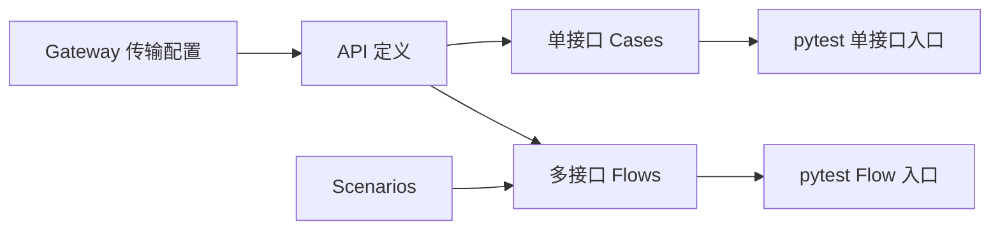
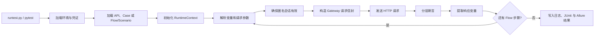
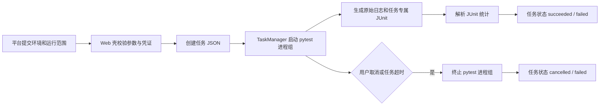

# 接口自动化工具：设计、演进与平台接入分享

> 本文基于 `api-autotest` 中的 MVP、V1.2、V1.3、Allure、Jenkins PRD与开发设计，以及 `test-platform/docs` 中的工具接入 PRD、开发计划和验收记录整理。本文聚焦现有 Gateway 接口自动化框架及其平台薄 Web 壳，不包含另一个独立项目 `api-test-agent` 的 AI 测试智能体方案。

## 1. 一句话介绍

这是一个面向 Gateway 业务的 YAML 数据驱动接口自动化工具：通过统一执行器读取 API 定义、单接口 Cases 和多接口 Flows，自动完成会话管理、参数传递、请求发送、分层断言、原始日志和报告生成；既可以在终端或 Jenkins 独立运行，也可以作为任务型工具接入测试开发平台。

## 2. 开发背景：为什么要做

Gateway 业务在传输层有高度一致性：所有业务接口最终都通过 HTTP `POST /gateway/invoke` 调用，变化主要集中在请求信封中的 `service_name`、`method_name`、业务参数和预期结果。

如果为每个接口重复编写 Python 测试，会带来几个问题：

- 请求信封、鉴权、公参和断言代码反复复制。
- 用例数据与执行逻辑耦合，非开发人员难以维护。
- 多接口场景需要手工管理前后置数据和等待逻辑。
- 原始 token、签名 URL 等调试信息需要在可追溯性、访问权限与保留期之间建立明确边界。
- 本地执行、CI 执行和平台执行可能形成三套不同语义。

因此，项目从一个最小目标开始：用一条命令执行一个 YAML 用例，稳定调用一个 Gateway 接口并完成基础断言。随后再逐步增加流程编排、运行时变量、报告、CI 和平台能力。

## 3. 版本演进

| 阶段 | 核心问题 | 主要交付 |
| --- | --- | --- |
| MVP | 先证明配置驱动单接口执行可行 | YAML 用例、Gateway 请求构造、分层断言、终端输出 |
| 会话与变量 | 接口之间需要传递动态数据 | `RuntimeContext`、响应提取、递归变量替换、匿名会话创建与刷新 |
| V1.2 | 固定流程无法持续扩展 | Flow + Scenario、多步骤执行、等待、轮询、COS PUT、文件日志 |
| V1.3 | 接口定义与测试数据混在一起 | APIs、Cases、Flows、Scenarios 分层，单接口和流程解耦 |
| Allure R1.0 | pytest 文本结果不便浏览和分享 | 业务化标题、有序步骤、原始执行附件、静态 HTML 报告 |
| Jenkins J1.0 | 需要稳定的手动和定时回归 | 参数化 Pipeline、JUnit、Allure、日志归档和失败状态 |
| 平台接入 | CLI 框架无法直接作为页面工具使用 | 薄 Web 壳、任务状态机、取消、结果查看、用例目录和报告托管 |

这条演进路径始终保留原执行核心：新能力围绕数据模型、报告或入口扩展，而不是推翻 pytest、YAML 和 Gateway 调用协议。

## 4. MVP：先验证最小闭环

MVP 只处理一个 Gateway 业务子请求：

```text
YAML 用例
  → 读取 service_name、method_name、params 和断言
  → 合成 comm + requests[req_0]
  → POST /gateway/invoke
  → 校验 HTTP、Gateway 顶层、目标子响应和 data_fields
```

它刻意不包含 Flow、变量提取、文件上传、报告平台和复杂环境管理。这个范围控制使项目先验证三个最关键的假设：统一 Gateway 协议能否被抽象、YAML 是否足以表达基础测试、通用断言是否能够定位失败层级。

## 5. V1.2：从单接口升级为通用流程

单接口能力稳定后，项目已经积累了运行时变量、匿名会话和一条媒体搜索固定流程，但流程解析和执行仍写在测试代码中。新增业务流程可能需要改 Python，无法做到真正的数据驱动。

V1.2 将一条业务流程拆为两份职责明确的 YAML：

- `data/flows/`：声明步骤顺序、接口调用、提取、等待和步骤关系。
- `data/scenarios/`：保存具体业务输入、步骤参数覆盖和场景断言。

两者按同名文件一一对应。新增普通流程时，只增加 Flow 和 Scenario，不需要修改执行器。

FlowRunner 支持的核心动作包括：

1. 调用普通 Gateway API。
2. 从响应 `data` 中按路径提取变量。
3. 在后续字典、列表或字符串中递归解析 `{{变量名}}`。
4. 固定时间等待。
5. 按字段值轮询，直到满足条件或超时。
6. 使用预签名 URL 执行 COS 二进制 PUT。

同时，日志从终端扩展为终端与文件双输出。每次 pytest 进程生成独立日志文件，记录 Flow、步骤、请求、响应、耗时、断言和异常上下文。

## 6. V1.3：拆分“接口是什么”和“怎样测试”

V1.2 的 `data/cases/*.yaml` 同时保存接口路由、请求数据、断言和提取规则。一个接口出现成功、缺参、多参和异常值等多组用例后，公共定义会被重复；Flow 想使用一个新接口时，也必须先创建单接口用例。

V1.3 将数据模型拆为五层：

| 目录 | 职责 | 不保存 |
| --- | --- | --- |
| `data/api/` | Gateway HTTP 地址和固定传输配置 | 业务接口和测试数据 |
| `data/apis/` | API 身份：`service_name`、`method_name` | 参数、断言和流程顺序 |
| `data/cases/` | 一个 API 的多条独立单接口用例 | 接口路由和流程步骤 |
| `data/flows/` | 多接口调用顺序、提取、等待和轮询 | 具体业务输入 |
| `data/scenarios/` | Flow 各步骤的参数和场景断言 | 接口路由和 Python 逻辑 |

依赖关系保持单向：



Cases 与 Flows 都依赖 API 定义，但彼此不依赖。这样修改单接口测试数据不会影响流程，修改流程场景也不会改变单接口用例。

## 7. 当前核心架构

| 模块 | 主要实现 | 职责 |
| --- | --- | --- |
| 配置层 | `config_loader.py` | 合并 settings、环境 YAML、`.env` 和进程环境变量 |
| API 定义层 | `api_loader.py` | 加载并校验 API 定义，构造可执行用例 |
| 单接口用例层 | `case_loader.py` | 加载一个 API 下的多条 Cases，校验 ID、标签和必填字段 |
| 流程加载层 | `flow_loader.py` | 配对 Flow 与 Scenario，校验引用和步骤结构 |
| 运行时上下文 | `runtime_context.py` | 变量保存、递归解析、响应提取和会话有效期判断 |
| 流程执行层 | `flow_runner.py` | 顺序执行 API、轮询、等待和上传动作 |
| Gateway 客户端 | `gateway_api.py` | 构造请求信封、确保会话、调用接口并写回刷新后的会话 |
| HTTP 层 | `http_client.py` | Gateway POST、COS PUT、耗时和原始请求/响应记录 |
| 断言层 | `assertions.py` | HTTP、Gateway、子响应及业务 data 分层断言 |
| 报告适配层 | `allure_reporter.py` | 动态标题、层级、步骤及原始执行附件 |
| 执行入口 | `runtest.py` + pytest | 解析环境、模块、标签和 Flow 参数，统一启动测试 |

项目没有自建测试运行时，而是把 pytest 保留为唯一执行器。加载器、执行器和报告层都围绕 pytest 参数化用例工作。

## 8. 一次接口测试如何运行



运行入口支持：

```bash
python3 runtest.py --env test
python3 runtest.py --env test --module GetMe
python3 runtest.py --env test --tag smoke
python3 runtest.py --env test --flow AnonymousSessionMediaSearch
```

`--module` 映射 pytest 关键字筛选，`--tag` 映射 marker 表达式，`--flow` 用于精确选择流程；额外 pytest 参数也可继续透传。

## 9. 会话与运行时变量设计

动态数据只存在于当前测试进程的 `RuntimeContext`，不会写回 YAML。前序步骤可以从业务响应 `data` 中提取 `task_id`、`candidate_id` 等变量，后续步骤通过 `{{变量名}}` 引用。

会话管理由 GatewayApi 统一完成：

1. access token 未过期且剩余时间大于两小时时直接复用。
2. 未过期且剩余时间小于或等于两小时时，refresh token 有效才调用 `RefreshSession`。
3. access token 已过期、缺失或过期时间无效时，直接调用 `CreateAnonymousSession`。
4. 临期刷新失败或 refresh token 不可用时，只回退创建一次匿名会话。
5. 新会话更新到当前运行时上下文；平台模式通过当前 Runtime Scope 的 Credential
   CAS 写回，独立 Truthy 兼容模式才允许写回本地 `.env`。

两小时边界按毫秒计算，恰好剩余两小时属于刷新区间。这种方式避免每条测试重复处理
登录逻辑，也避免 access token 仍有较长有效期时产生无意义的刷新请求。

## 10. 断言、日志与原文输出

断言按失败层级组织：

- HTTP 状态是否符合预期。
- Gateway 顶层 `code/message` 是否正确。
- `responses[req_0]` 的 `id/success/code/message` 是否正确。
- 业务 `data` 是否包含必要字段或满足场景期望。

根据当前排障要求，文件日志、终端、Web 日志 API、失败摘要、JUnit 和 Allure
共同保留原始请求、响应、Header、Token、签名 URL、异常及业务结果，不再以 `***`
替换字段。上传文件仍只记录名称、Content-Type 和字节数，不记录二进制正文。

文件路径固定为
`logs/<project_id>/<target_env>/<YYYY-MM-DD>/<timestamp>_<target_env>_<pid>.log`；
任务通过 `log_file` 关联当日目录下的唯一进程日志，不再增加任务 ID 文件夹。原始产物
可能包含有效凭证，因此查看与下载必须校验任务归属，文件日志按日期目录执行 7 天清理，
且不得公开分发。

## 11. Allure：把执行证据组织成报告

终端日志适合调试，但不适合非开发人员浏览。Allure 接入没有改变 YAML 协议或 pytest 退出码，只增加报告表达层：

- 每条单接口 Case 使用中文名称作为独立测试标题。
- Flow/Scenario 作为独立测试，内部 API、等待、轮询和上传按 YAML 顺序显示为 Step。
- 请求、响应、断言异常和上传摘要作为原始附件；媒体二进制不附加。
- 通过 suite、feature、story 和 tags 区分接口、用例和流程。

pytest 负责生成 `allure-results/`，Allure CLI 在执行环境外生成静态 HTML。测试执行和 HTML 生成解耦，因此报告工具不可用时，不会改变测试本身的成功或失败结论。

## 12. Jenkins：形成持续回归链路

Jenkins Pipeline 支持 `all`、`single` 和 `flow` 三种范围，并可指定具体 Flow。每次构建同时产出：

- JUnit XML：供 Jenkins 原生统计和判定。
- Allure 原始结果及 HTML：供查看业务步骤和原始执行附件。
- 执行日志：供完整排查。

pytest 退出码仍决定构建是否失败。报告生成失败最多将构建标为 `UNSTABLE`，不能覆盖已经存在的 pytest `FAILURE`。独立 Jenkins 任务 `truthy-api-autotest` 已完成手动、失败策略和定时构建验收；定时任务在验收后暂停。

## 13. 为什么平台接入采用“薄 Web 壳”

在接入测试开发平台之前，接口自动化是批跑型 CLI 框架，不是常驻页面工具。直接改造执行核心会影响终端和 Jenkins，因此平台侧选择在框架外增加一层薄 Web 服务：

- 不改变 YAML、加载器、断言和 pytest 测试语义。
- 通过参数数组启动 `python -m pytest` 子进程，不经过 shell。
- 提供任务提交、查询、取消、结果、日志、用例库和报告接口。
- 框架仍可脱离平台，通过 `runtest.py` 或 Jenkins 独立运行。

当前 Web 壳位于项目自身的 `web/` 目录，通过 Flask Blueprint 同时支持根路径独立模式和 `/api-autotest` 平台子路径。

## 14. 平台任务运行流程



任务状态为：

```text
pending → running → succeeded
pending → running → failed
pending/running → cancelled
```

MVP 使用单执行槽位，不排队；已有任务运行时，新提交返回 `409 SLOT_BUSY`。任务记录保存在 `tasks/<task_id>.json`，控制台输出单独保存并按展示长度截断，但不改写内容。JSON 使用临时文件、fsync 和原子替换写入，避免页面轮询时读到半份记录。

## 15. 平台与 Jenkins 的两条报告链路

平台触发和 Jenkins 执行承担不同职责：

```text
链路 A：Jenkins / 宿主机
pytest → allure-results → Allure HTML
→ 归档或拉取 → 原子发布到 reports/allure-current
→ 平台只读托管 HTML

链路 B：平台页面
提交任务 → pytest 子进程
→ junit-task-<task_id>.xml + 原始日志
→ 页面显示即时统计与日志
```

平台任务不在容器内安装 Node 或 Allure CLI，也不为每次页面触发生成 HTML。这样可以保持工具壳轻量，同时复用 Jenkins 已验证的完整报告链路。报告发布采用版本目录和 `current` 指针原子切换，发布中断时旧报告仍可访问。

## 16. 平台边界与隔离

- 对外只暴露平台网关 8080 端口；工具的 5003 端口仅在 Docker 内网可见。
- `projects/` 以只读卷挂载，平台只能浏览和执行项目包资产，不能在线修改。
- 平台按 Runtime Scope 物化权限为 `0600` 的任务短期快照，终态删除；平台模式不读取
  `.env.platform`、根 `.env`、项目 YAML 或同名进程环境变量作为回退。
- `tasks/`、`logs/`、`reports/` 使用独立持久化目录。
- 停止接口自动化容器不会影响平台首页和其他工具。
- 平台 API 或数据库不可用时，首页仍通过静态回退目录保留基础工具入口。
- 当前工具壳任务记录自持，不写入平台 PostgreSQL；未来平台任务中心通过适配器对接。

## 17. 已完成的历史验收

平台接入变更审查记录了以下实测结果：

- `run_type=all`：5 条单接口 + 3 条 Flow，共 8 条真实用例通过。
- Flow、tag、取消、超时、并发冲突和缺失 Admin 凭证均完成专项验收。
- 用例目录与磁盘一致：14 个 API、3 个 Flow、5 个 Case 文件，解析错误为 0。
- 平台网关隔离、工具停机降级、报告原子切换和凭证刷新写回均验证通过。
- 当时记录的壳服务测试为 125 项通过，平台冒烟为 6 项通过。

这些结果是对应接入阶段的历史验收记录，不等同于当前工作区每次运行的实时状态。

## 18. 本次整理时的验证情况

为了避免真实请求和凭证依赖，本次只执行了 Web 壳与离线框架回归，两个测试目录因各自存在同名 `conftest.py`，必须分开执行：

```bash
python3 -m pytest -q tests
python3 -m pytest -q \
  test_cases/test_framework.py \
  test_cases/test_v12.py \
  test_cases/test_v13.py \
  test_cases/test_allure_report.py
```

当前结果：

- Web 壳：132 passed，1 failed。失败原因为健康检查当前多返回 `content_sha256`，测试期望字典尚未同步。
- 离线框架回归：120 passed，1 failed。失败原因为 `NameWithConditionsSearch` 当前场景线索与测试基线不一致。
- 合计：252 项通过，2 项失败。

本次没有修改上述代码、用例或测试，也没有执行需要真实 Gateway 和凭证的 `test_single_api.py`、`test_gateway_flow.py`。这两项当前差异应在后续由项目维护者确认基线后处理。

## 19. 关键设计取舍

- **pytest 是唯一执行器**：本地、Jenkins 和平台最终都调用 pytest，减少语义分叉。
- **YAML 保存声明，Python 保存机制**：用例只描述接口、数据、步骤和预期，不允许嵌入任意 Python 表达式。
- **Cases 与 Flows 解耦**：二者共享 API 定义，但各自管理测试数据和断言。
- **运行时变量不写回用例**：动态业务数据停留在内存上下文，避免污染版本化资产。
- **平台使用薄壳而非重写框架**：任务管理属于入口层，核心执行逻辑继续独立。
- **JUnit、Allure、日志各司其职**：JUnit负责机器统计，Allure 负责结构化展示，日志负责完整诊断。
- **报告失败不掩盖测试失败**：执行结论优先于展示链路。

## 20. 后续可演进方向

1. 修复或确认当前两项离线回归基线差异，恢复全绿门禁。
2. 将工具侧任务协议接入平台统一任务中心，同时保留独立模式。
3. 根据真实需求评估在线用例 Review、OpenAPI 导入或用例生成，但不改变现有执行安全边界。
4. 继续扩展断言与数据构造能力，同时避免在 YAML 中加入任意代码执行。
5. 对历史 Allure 报告、趋势和通知能力做独立评估，不耦合测试执行核心。

## 21. 分享时可以强调的价值

这个工具不是简单把 requests 调用放进 pytest，而是把接口自动化拆成了可长期维护的资产体系：API 定义负责复用，Cases 负责单点验证，Flows 和 Scenarios 负责业务链路，RuntimeContext 负责动态数据，报告与 CI 负责结果沉淀，薄 Web 壳负责平台协作。

它最值得分享的设计点，是每次演进都尽量保护上一层的稳定契约：从单接口到多流程、从终端到 Jenkins、再到平台页面，执行核心始终保持独立和可回归。

> 待补充：仓库没有统一记录手工回归耗时、接口覆盖率增长和实际发现缺陷数量。如果分享需要量化收益，应补入团队真实数据。
