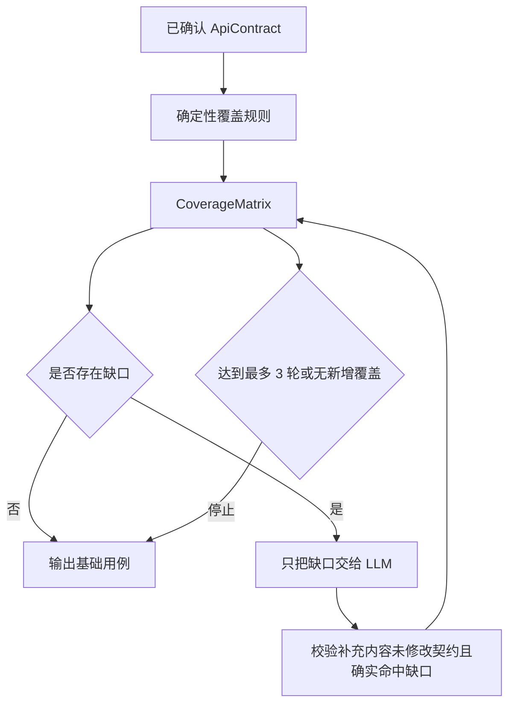
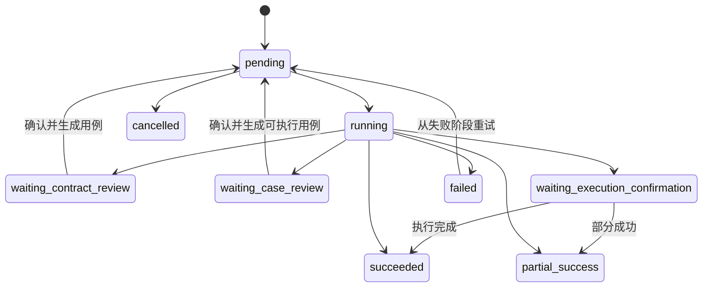
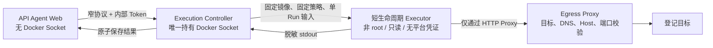

# API 测试智能体：从接口文档到可信测试资产与受控执行

> 分享定位：这是测试平台中的重点项目之一。它不是一个“让大模型直接发请求”的脚本生成器，而是一套把接口文档逐步转化为**可追溯契约、覆盖矩阵、经人工确认的测试用例、静态校验后的可执行资产，以及可选受控执行结果**的测试工作流。

---

## 1. 一句话介绍

API 测试智能体面向接口开发期和联调期，解决的是：

> 如何从不完整、格式不统一、甚至存在歧义的接口文档中，建立可信的接口契约，系统化设计测试场景，并在人工确认和安全隔离后完成验证。

它的核心价值并不是“生成速度快”，而是把原来依赖测试人员经验完成的接口理解、覆盖分析、用例设计和执行准备过程，变成一条**有证据、有门禁、有版本、有状态、可回退**的流水线。

---

## 2. 为什么要开发这个工具

### 2.1 接口测试真正困难的部分并不是发送 HTTP 请求

成熟工具已经可以很好地发送请求，但在接口开发和联调阶段，测试人员仍需要反复完成这些工作：

- 阅读 OpenAPI、Swagger、Markdown、Curl 示例或零散说明；
- 确认 method、path、参数位置、必填性、Schema、鉴权和响应码；
- 判断文档中哪些内容是明确事实，哪些只是推断；
- 为每个接口补齐正常、异常、边界、鉴权、幂等和业务场景；
- 维护接口之间的前置依赖和动态变量；
- 把测试设计翻译为可以真正运行的请求和断言；
- 执行前再次核对目标环境、写操作、脚本和数据风险；
- 从失败结果中提取可复现信息，整理缺陷草稿。

这是一条典型的高认知负担、重复劳动多、又不能完全相信自动生成结果的链路。

### 2.2 早期能力存在“能生成，但还不够可信”的问题

项目早期已经具备接口文档解析、基础用例生成、可执行用例生成和旧命令行执行能力，但继续平台化时暴露出几个关键问题：

1. OpenAPI/Swagger 也依赖 LLM 解析，确定性不足且浪费模型调用；
2. Prompt 输出直接接近执行格式，缺少中立的契约资产层；
3. 缺少字段证据、冲突、歧义和未解决项的显式表达；
4. 覆盖判断过度依赖模型给出的“100%”，补齐循环缺少硬上限；
5. 契约与用例缺少正式的人审门禁和并发版本控制；
6. 文档小改动后只能重建任务，旧资产和新资产关系不清晰；
7. Web 服务、模型生成和真实请求如果处于同一执行边界，安全风险过高；
8. 失败后阶段产物、错误分类和重试入口不够清晰。

因此，项目目标从“生成 API 测试脚本”升级为“构建可信的 API 测试资产流水线”。

---

## 3. 产品定位：它与接口自动化平台有什么不同

API 测试智能体和已有 Gateway 接口自动化工具并不是替代关系。

| 对比项 | API 测试智能体 | Gateway 接口自动化工具 |
| --- | --- | --- |
| 主要阶段 | 接口开发期、联调期 | 接口稳定后的持续回归期 |
| 核心目标 | 理解契约、探索风险、补齐覆盖、尽早发现问题 | 稳定执行、流程验证、持续运行 |
| 资产特点 | AI 参与生成、变化快、必须人工确认 | 显式 YAML、确定性强、适合版本管理 |
| 主要用户 | 测试工程师、测试开发 | 测试开发、CI/CD |
| 执行原则 | 默认关闭，经过多重门禁后才能受控执行 | 面向稳定资产执行 |

当前版本也明确不做：

- 不做通用低代码流程编排器；
- 不自动执行所有 AI 生成内容；
- 不把失败直接提交为正式 Bug；
- 不自动发布到 Gateway、Git、测试管理系统或 CI/CD；
- 不支持 Postman Collection、GraphQL、gRPC、WebSocket 和 AsyncAPI 导入；
- 不承担压测和 P95/P99 性能平台职责。

---

## 4. 项目的演进路线

| 阶段 | 主要能力 | 解决的问题 |
| --- | --- | --- |
| 早期 CLI | 文档解析、基础用例、运行用例、直接执行与报告 | 验证 AI 生成 API 用例的可行性 |
| 独立平台接入 | Web 任务、日志、产物、配置快照、文件优先 | 让能力成为可使用的测试平台工具 |
| V2.0 可信闭环 | 确定性契约解析、Evidence、质量门禁、覆盖矩阵、两次 Review、可执行用例 | 从“一次生成”升级为分阶段可信资产 |
| V2.0 S2 试点 | Controller、Egress Proxy、单 Run Executor、安全确认、结果与缺陷草稿 | 验证真实执行的安全边界 |
| V2.1 执行前优化 | 文档修订、分析范围、重新分析、问题闭环、`stale` 失效 | 解决文档变化和 Review 可操作性 |
| 物理拆分与独立发布 | 独立源码、依赖锁、四镜像 Release、独立 runtime 和回滚 | 形成真正独立的产品与安全边界 |

这条路线反映了一个重要认识：

> AI 测试工具的成熟过程，不是不断增加 Prompt，而是不断增加确定性、可审查性和安全边界。

---

## 5. 当前总体架构

```mermaid
flowchart LR
    U["测试人员"] --> W["API Agent Web 工作台"]
    W --> T["任务与版本存储"]
    W --> Q["单槽持久化 FIFO"]
    Q --> R["阶段式生成 Runner"]

    R --> D["文档预检与格式识别"]
    D --> O["OpenAPI/Swagger 确定性解析"]
    D --> L["非结构化文档受限 LLM 解析"]
    O --> C["ApiContract + Evidence"]
    L --> C
    C --> G["契约质量门禁"]
    G --> CR["契约 Review"]
    CR --> M["覆盖矩阵与基础用例"]
    M --> BR["用例 Review"]
    BR --> E["可执行用例与静态校验"]

    E -. "生产默认禁止" .-> X["Execution Controller"]
    X --> P["Egress Proxy"]
    X --> EX["单 Run Executor"]
    EX --> P
    P --> API["已登记测试目标"]
    EX --> REP["脱敏结果、报告与缺陷草稿"]
```



架构中最重要的不是组件数量，而是三条边界：

1. **确定性事实与模型推断分开**；
2. **生成资产与人工确认分开**；
3. **生成系统与真实请求执行分开**。

---

## 6. 第一层：文档导入和预检

### 6.1 支持与拒绝的格式

当前格式识别器支持：

- OpenAPI 3.x JSON/YAML；
- Swagger 2.0 JSON/YAML；
- 非结构化 JSON/YAML；
- Markdown、文本和其他非结构化接口说明。

以下格式会返回稳定的 `DOCUMENT_FORMAT_UNSUPPORTED`，不会被误当作普通文档继续生成：

- Postman Collection；
- AsyncAPI / WebSocket；
- GraphQL；
- gRPC / proto。

### 6.2 为什么预检必须先于模型

预检负责完成模型不应该承担的事情：

- UTF-8、扩展名、大小和字符数校验；
- JSON/YAML 语法检查；
- YAML 使用 `safe_load`，并限制 Alias 数量；
- 识别规范版本和接口数量；
- 检测可能的 Secret 风险；
- 生成脱敏预览；
- 文档中的 Server/Base URL 只作为元数据，不自动成为真实执行目标。

这样做可以把“不合法输入”和“模型理解失败”区分开，也避免让模型接触本可以确定性处理的工作。

---

## 7. 第二层：建立中立的 ApiContract

系统没有把 Prompt 返回值直接当作可执行脚本，而是先转换为统一的 `ApiContract`。

契约主要包含：

- 接口 ID、名称、method 和相对 path；
- Server 元数据；
- path、query、header、cookie 参数；
- Request Body 和 Schema；
- Response 状态码、Schema 和示例；
- Security Requirement；
- 接口依赖；
- 字段级 Evidence；
- unresolved、ambiguity、conflict；
- 质量报告和 Review 状态。

契约的状态为：

```text
draft → confirmed_candidate → confirmed
                         ↘ changed / deprecated
```

### 7.1 OpenAPI 为什么必须确定性解析

对 OpenAPI/Swagger，method、path、参数位置、Schema、响应码等已经有明确机器语义，因此交给标准解析器：

- 本地 `$ref` 按规范解析；
- method/path 等字段直接绑定 OpenAPI Pointer Evidence；
- 结构化字段不允许被 LLM 覆盖；
- LLM 只适合补充缺失说明或提出歧义建议。

### 7.2 非结构化文档为什么仍然需要 LLM

Markdown、Curl 示例或自然语言说明没有稳定 Schema，需要模型识别候选接口。但模型只在受限范围内工作：

- 先按章节拆分文档；
- 只把相关切片交给模型；
- 输出必须通过严格 Pydantic Schema；
- 解析失败只进行有限次数重试；
- 鉴权失败等确定错误快速失败；
- 所有字段必须回到原文做 Grounding；
- 无证据事实进入 blocker，而不是悄悄写入契约。

---

## 8. Evidence 与防幻觉机制

每个重要契约字段都可以附带 `FieldEvidence`，记录：

- `field_path`：证据支持哪个字段；
- `source_type`：OpenAPI 节点、原文引用或人工覆盖；
- `source_pointer`：JSON Pointer、行号范围或 Review 版本；
- `quote`：经过控制和脱敏的证据文本；
- `evidence_type`：`explicit`、`inferred`、`missing`、`conflict`；
- 文档版本与置信度。

证据类型的含义是：

| 类型 | 含义 | 能否直接成为确认事实 |
| --- | --- | --- |
| `explicit` | 原文或规范节点明确说明 | 可以 |
| `inferred` | 模型根据上下文推断 | 不能直接越过门禁 |
| `missing` | 执行必需但文档没有提供 | 需要补充或人工处理 |
| `conflict` | 多处描述互相冲突 | 必须 Review |

### 8.1 契约质量门禁

质量门禁不是让模型自评，而是代码计算：

- method 和 path 必须有显式 Evidence；
- blocker 级 unresolved、ambiguity、conflict 必须关闭；
- 不允许存在无依据契约事实；
- 综合完整度、证据率、Schema、冲突率计算质量分；
- 达到最低分且没有 blocker，才进入 `confirmed_candidate`。

默认实现中的门槛由 `CONTRACT_QUALITY_MIN_SCORE` 控制，当前阶段 Runner 默认读取 `0.8`；质量门禁函数本身默认值为 `0.90`。最终运行值以服务配置为准。

### 8.2 人工处理不是覆盖历史，而是生成新证据

Review 支持：

- `bind_evidence`：重新绑定文档行号或 Pointer；
- `edit_field`：修改白名单内字段；
- `remove_inference`：删除没有依据的推断；
- 人工确认：创建 `human_override` Evidence，并要求填写原因。

每次处理都会生成新的契约版本和审计记录，旧版本仍然保留。

---

## 9. V2.1：为什么增加文档修订和分析范围

真实联调中，文档很少一次稳定。测试人员可能只补充一个 Header 的必填性、修改一个路径，或暂时只分析某个模块。如果每次变化都重建任务，会丢失 Review 上下文，也无法说明旧用例基于哪个文档。

因此 V2.1 增加了两类版本资产：

### 9.1 DocumentRevision

- 可在原任务中查看完整脱敏文档；
- 创建修订版时必须提供 `base_version` 和修改原因；
- 支持版本 Diff，最多返回受控数量的差异行；
- 每个版本保存内容 SHA、父版本、创建人和时间；
- 并发修改返回 `DOCUMENT_VERSION_CONFLICT`。

### 9.2 AnalysisScopeVersion

分析范围可以版本化定义：

- 包含或排除的接口；
- method、path、模块和 tag 过滤；
- 是否分析请求、响应、鉴权、错误码和依赖；
- 项目、模块与测试环境元数据。

重新分析前，系统生成影响预览和 `preview_sha256`，显示：

- 将使用的文档与范围版本；
- 预计分析接口数量；
- 当前确认契约数量；
- 哪些下游资产会过期；
- 旧 Run 和缺陷草稿会继续只读保留。

只有提交的 SHA 与最新预览一致，才会创建新的 `GenerationAttempt`。

---

## 10. 第三层：覆盖矩阵和基础测试用例

契约确认后，系统不直接生成最终脚本，而是先建立可 Review 的 `BaseTestCase` 和 `CoverageMatrix`。

### 10.1 确定性覆盖先行

代码根据契约字段生成可以确定的覆盖项：

- 正常请求；
- 必填参数缺失；
- 参数类型与枚举；
- 数值或长度边界；
- 鉴权缺失；
- 错误响应；
- 写接口的重复提交与幂等；
- 已明确的接口依赖。

业务场景无法仅从结构推断，因此会形成明确缺口，交给受限 LLM 补充，而不是伪装成已经覆盖。

### 10.2 补齐循环有硬上限



补齐最多 3 轮，并记录：

- 缺口对应的接口与覆盖维度；
- 确定性规则、LLM 或人工的决策来源；
- 关联的用例 ID；
- 当前轮次和停止原因；
- 用户接受缺口时的理由。

这比“让模型回答覆盖率是否 100%”更可信，因为覆盖率来自结构化矩阵，而不是自然语言自评。

---

## 11. 第四层：两道人审门禁

### 11.1 契约 Review

测试人员确认“系统是否正确理解了接口”：

- method、path、参数、Body、Response、鉴权和依赖；
- 字段 Evidence 是否匹配原文；
- blocker、冲突和歧义是否已经处理；
- 接口是否属于本次分析范围。

至少一个契约进入 `confirmed`，才能生成基础用例。

### 11.2 用例 Review

测试人员确认“测试设计是否合理”：

- 编辑、新增、确认或禁用基础用例；
- 按接口、维度、风险、来源和状态筛选；
- 查看覆盖项和用例的对应关系；
- 对覆盖缺口填写原因后接受；
- 高风险用例必须逐条确认；
- 只读用户不能确认高风险用例。

所有 Review 写操作使用 `base_version` 乐观锁；版本不匹配返回 `REVIEW_VERSION_CONFLICT`，避免多人或多标签页静默覆盖。

---

## 12. 第五层：生成可执行用例，但仍不执行

经确认的基础用例被转换为 `ExecutableCase`，其中包括：

- 目标接口和相对 path；
- headers、query、body；
- 变量定义及其来源；
- 前置用例依赖；
- 断言定义；
- 可选 setup/teardown 脚本；
- 风险等级和静态校验结果。

### 12.1 静态校验内容

在进入执行预览前，代码会检查：

- path 必须是相对路径，不能把文档 URL 直接带入；
- 依赖用例必须存在；
- 依赖图不能存在环；
- 变量使用必须能找到来源；
- 断言操作符必须在允许集合内；
- 高风险用例必须经过确认；
- setup/teardown 脚本必须通过 AST 安全策略。

当前支持的断言模型包括：

- `status_code`；
- `equals` / `not_equals`；
- `contains`；
- `exists`；
- `schema`。

校验失败的用例被标记为 `disabled`，通过后才是 `ready`。如果只有部分用例通过，任务进入 `partial_success`，不会把全部结果伪装成成功。

### 12.2 脚本为什么只做静态检查

脚本策略通过 Python AST 禁止：

- `subprocess`、`socket`、`ctypes`、`multiprocessing` 等模块；
- `eval`、`exec`、`compile`、`open`、`__import__` 等调用；
- 双下划线和危险属性访问。

更重要的是，当前真实 Executor 对包含 setup/teardown 脚本的用例仍明确拒绝，不把静态检查等同于安全执行任意代码。

---

## 13. 任务、Attempt、版本和 Run 为什么要分开

### 13.1 四种对象

| 对象 | 代表什么 | 是否可变 |
| --- | --- | --- |
| Task | 用户的一次完整 API 测试工作 | 生命周期状态可更新 |
| GenerationAttempt | 从某个阶段开始的一次生成或重试 | 创建后保留来源版本和结果 |
| Versioned Asset | 文档、范围、契约、覆盖、基础用例、可执行用例 | 追加新版本，不覆盖旧版本 |
| ExecutionRun | 对固定可执行用例版本的一次真实执行 | 每次重试创建新 Run |

### 13.2 为什么不能只用一个 task.json

如果所有内容都覆盖在一个任务文件里，就无法回答：

- 这批用例基于哪个文档和契约版本？
- 重新分析失败后，上一个有效版本还能不能使用？
- 一次重试是继续旧执行，还是创建了新的执行事实？
- 缺陷草稿引用的是哪次 Run 的哪个失败结果？

因此，版本信封会保存：

- `schema_version`；
- `kind` 和递增 `version`；
- 内容 `sha256`；
- `source_versions`；
- 生命周期状态与过期原因；
- 创建人和创建时间。

文件通过原子写入保存，读取时重新计算 SHA，防止半写文件或内容漂移。

---

## 14. 文档变化后的 stale 失效机制

重新分析成功生成新契约后：

- 旧契约、覆盖矩阵、基础用例和可执行用例不删除；
- 基于旧契约的下游版本被标记为 `stale`；
- `stale` 资产仍可查看和下载；
- `stale` 用例不能进入新的执行预览；
- 已生成的执行确认 SHA 立即失效；
- 旧 Run、报告和缺陷草稿保持原终态，并显示来源版本。

这个机制避免了一个非常危险的问题：

> 页面上看起来已经重新分析了新文档，后台却仍然执行旧契约生成的用例。

---

## 15. 任务状态与阶段状态

### 15.1 Task 状态



任务状态表达生命周期，`stage` 表达当前具体步骤。Review 等待不是失败，也不占用长时间生成进程。

### 15.2 用例阶段状态

V2.1 将正常业务状态和系统错误分开：

| `stage_state` | 含义 |
| --- | --- |
| `blocked` | 契约尚未确认 |
| `not_generated` | 尚未请求生成 |
| `generating` | 当前 Attempt 正在运行 |
| `ready` | 产物可 Review |
| `partial_success` | 部分接口生成成功 |
| `failed` | 当前 Attempt 失败，旧资产仍保留 |
| `stale` | 上游版本变化，只读展示 |

前置条件未满足使用业务状态或 409，不再滥用 503；503 只表示依赖服务或平台配置真正不可用。

---

## 16. 真实执行为什么必须单独设计

真实 API 执行面对的不是普通生成功能风险，而是：

- SSRF、DNS Rebinding 和重定向绕过；
- Host Header 欺骗；
- AI 生成写请求误伤环境；
- 恶意脚本逃逸；
- Secret 泄露到日志、报告或模型；
- 跨 Run 数据访问；
- 容器资源耗尽和孤儿容器；
- Docker Socket 带来的宿主机高权限风险。

因此真实执行没有放进 Web 进程或生成 Runner，而是拆成三个组件：



### 16.1 Controller 的窄协议

浏览器和 Web 服务不能指定：

- 任意镜像或命令；
- 宿主机路径和挂载；
- 环境变量；
- 网络模式；
- Linux Capability；
- Docker 通用管理操作。

Controller 只接受 Run ID、逻辑输入输出位置、输入 SHA、固定策略 ID 和超时。

### 16.2 一个 Run 一个 Executor

每次 Run 使用独立短生命周期容器：

- 非 root UID 10003；
- 根文件系统只读；
- `cap_drop=ALL`；
- `no-new-privileges`；
- 0.5 CPU、256MB 内存、64 PID；
- 只读挂载当前 Run 输入；
- 完成、失败、取消或超时后强制回收。

### 16.3 默认拒绝网络

Executor 不能直接访问任意网络，只能经 Egress Proxy 访问登记目标。代理逐次校验：

- scheme、host、port 和 path；
- Host Header；
- DNS 解析结果；
- loopback、link-local、metadata、private 和混淆 IP；
- 重定向后的新目标。

允许访问内网地址时必须通过目标的显式 CIDR 配置，不能因为“测试环境一般在内网”就默认放开。

---

## 17. 执行确认、结果和缺陷草稿

### 17.1 执行前确认

执行预览包含：

- 逻辑目标和脱敏地址；
- 可执行用例版本与 SHA；
- ready 用例列表；
- 写请求数量；
- 高风险用例数量；
- 脚本数量；
- 最终 `confirmation_sha256`。

只要预览内容变化，旧确认 SHA 就失效，返回 `EXECUTION_CONFIRMATION_STALE`，必须重新确认。

### 17.2 Run 生命周期

```text
created → validating → provisioning → running → reporting → succeeded
                 ↘ failed / cancelled / timed_out
```

终态 Run 不允许覆盖；重试会创建新的 Run。

### 17.3 结果与失败分类

每条 `CaseResult` 保存：

- passed、failed、error、skipped、cancelled 状态；
- 请求和响应摘要；
- 断言结果；
- 耗时与性能候选；
- 错误签名；
- 产品缺陷候选、环境阻断、测试数据问题、用例问题等分类。

Executor 对 Authorization、Cookie、Token、Password、Secret 等字段递归脱敏；响应正文最多读取 1MiB，非 JSON 文本摘要进一步限制长度。

### 17.4 缺陷草稿

失败结果可以生成本地 `DefectDraft`：

- 引用固定 Run 和 CaseResult；
- 包含复现步骤、期望与实际结果、分类和严重程度建议；
- 使用版本号和 SHA 管理编辑；
- 可查看、修改和下载；
- 不自动提交到外部缺陷系统。

---

## 18. 平台接入与任务运行时

API Agent 作为独立 Web 工具接入测试平台：

- 平台负责统一入口、身份、权限和 LLM 配置；
- Agent 服务保存自己的任务、日志、Review 和版本资产；
- Agent 通过平台 Client Token 获取运行配置；
- 子进程启动前才注入模型配置，Web 主进程不提前初始化 LLM；
- 每次执行保存模型名称、配置 Release 和 Prompt Bundle SHA；
- 无数据库配置时仍能以文件优先方式生成和下载产物。

### 18.1 单槽持久化 FIFO

生成任务通过单槽 FIFO 运行，原因是：

- 避免本机模型调用和文件写入并发失控；
- 队列状态写入磁盘，服务重启后仍可恢复；
- 每个阶段使用独立子进程，隔离模型配置和工作目录；
- 排队时间、运行时间和 Review 等待时间分开计算；
- 超时终止完整进程组；
- 取消和自然完成通过锁控制终态竞争。

### 18.2 阶段式 Runner

当前 Runner 支持三个明确入口：

| `from_stage` | 处理内容 | 下一门禁 |
| --- | --- | --- |
| `document_preflight` | 格式识别、契约解析、范围过滤、质量门禁 | `waiting_contract_review` |
| `base_case_generation` | 覆盖矩阵、基础用例、有限补齐 | `waiting_case_review` |
| `executable_generation` | 可执行用例转换和静态校验 | `succeeded` / `partial_success` |

每个阶段完成后立即保存版本资产；后续失败不会让已完成阶段消失。

---

## 19. 文件与产物模型

任务目录按任务隔离，核心结构可以概括为：

```text
task-id/
├── task.json
├── request.json
├── execution.json
├── input/
├── logs/
├── attempts/
├── versions/
│   ├── documents/
│   ├── analysis-scopes/
│   ├── contracts/
│   ├── coverage/
│   ├── base-cases/
│   ├── executable-cases/
│   └── defect-drafts/
├── runs/
└── published/
```

主要产物包括：

- 文档预检报告；
- `api-contract.json` 和契约质量报告；
- 覆盖矩阵；
- 基础测试用例；
- 可执行用例与静态校验报告；
- Run 输入、CaseResult 和测试报告；
- 本地缺陷草稿；
- 审计日志和 Artifact Registry。

下载接口只接受登记过的 Artifact ID，不接受浏览器提供任意文件 path；解析后的文件必须仍位于任务根目录并且是普通文件。

---

## 20. 独立发布为什么是产品设计的一部分

API 测试智能体最初与功能测试智能体共用源码和构建上下文，这会导致：

- 公共代码修改需要承担两边回归；
- 一个智能体发布会牵连另一个智能体镜像；
- 版本、依赖和回滚边界不清晰；
- API 真实执行的高安全等级无法形成独立工程边界。

现在 `api-test-agent` 是自包含项目，独立拥有：

- 源码、依赖锁、测试和版本；
- Agent、Controller、Egress、Executor 四个镜像；
- 配置、Secret、runtime、任务目录和回滚入口；
- 发布清单与迁移校验记录。

四个镜像作为同一个 API Agent Release 整体发布和回滚，禁止混用未经验证的版本组合。

---

## 21. 当前运行与发布边界

这里需要严格区分“代码具备什么”和“生产当前开放什么”。

### 21.1 当前独立发布支持

- 可信文档解析；
- 契约 Evidence 和质量门禁；
- 契约 Review；
- 覆盖矩阵和基础用例 Review；
- 可执行用例生成与静态校验；
- 文档修订、分析范围和重新分析；
- 版本资产、日志与下载。

### 21.2 当前真实执行边界

- `API_EXECUTION_ENABLED=false` 是默认值；
- `API_EXECUTION_TARGETS=[]` 是默认值；
- 即使错误配置为 true，`prod` / `production` 环境仍由代码返回 false；
- 本机、无生产数据、单登记目标的 S2 试点经过专项评审；
- 该试点批准不等于生产批准；
- 生产启用前仍需完成 Docker Socket 风险处置或专项渗透、CVE 与签名、凭证轮换、HTTPS、孤儿回收演练和多方审批。

因此，对外分享时应表述为：

> 安全执行架构和本机试点已经完成验证，但当前生产交付范围仍是可信生成与 Review，真实执行保持失败关闭。

---

## 22. 安全设计汇总

| 风险 | 设计控制 |
| --- | --- |
| LLM 幻觉 | 确定性解析优先、字段 Evidence、Grounding、质量门禁 |
| 文档投毒或不安全格式 | 格式白名单、安全 YAML、大小限制、不支持协议显式拒绝 |
| 误执行旧资产 | 来源版本、`stale` 标记、确认 SHA 失效 |
| 高风险或写操作 | 逐条 Review、执行预览、权限和最终确认 |
| 任意代码 | AST 静态策略；真实 Executor 当前拒绝脚本 |
| SSRF 与网络绕过 | 逻辑目标登记、Egress Proxy、DNS/Host/重定向重校验 |
| 容器逃逸与资源耗尽 | 单 Run 容器、非 root、只读、cap drop、CPU/内存/PID/超时 |
| Secret 泄露 | 执行器无平台和模型凭证、结果多层脱敏、审计不存正文 |
| 跨任务和路径穿越 | 独立任务目录、Artifact 登记、containment 校验 |
| 并发覆盖 | `base_version` 乐观锁、SHA 和原子写入 |
| 生产误开启 | 默认 false、空目标列表、生产环境代码级禁止 |

---

## 23. 当前实现的验证情况

本次整理在 `api-test-agent` 根目录执行：

```bash
python3 -m pytest -q
```

结果：

```text
58 passed, 1 warning
```

测试覆盖的关键行为包括：

- OpenAPI 3 和 Swagger 2 确定性解析；
- Postman、GraphQL、AsyncAPI、gRPC/WebSocket 拒绝；
- YAML Alias 限制；
- 非结构化文档 Grounding 与有限重试；
- 契约质量门禁与 CSRF Header Evidence 样例；
- 确定性覆盖、最多三轮补齐和业务补充约束；
- 高风险用例、变量、脚本和依赖环静态阻断；
- 文档修订、分析范围、重新分析和 `stale`；
- Review 版本冲突与角色权限；
- 阶段式 Runner 和阶段产物保留；
- Controller 窄协议、SSRF、Host Header、重定向和策略校验；
- Executor 请求/响应脱敏；
- 执行确认 SHA、Run、慢响应和缺陷草稿；
- 上传、Artifact containment、CSRF 和失败关闭；
- runtime 迁移的幂等、冲突和路径安全。

唯一警告来自 LangGraph checkpoint 依赖的待弃用提示，不代表当前测试失败。

本次验证没有调用真实外部 LLM，也没有访问真实生产接口。

---

## 24. 最值得重点分享的设计取舍

### 1. 能确定的事情不交给模型

OpenAPI 是机器可读契约，应由确定性解析器负责；LLM 只处理非结构化语义和业务补充。

### 2. Prompt 输出不是正式资产

模型结果先进入严格 Schema、Evidence 和质量门禁，再经过人工 Review，最后才成为可执行用例。

### 3. 覆盖率不能由模型口头宣布

覆盖来自显式 CoverageMatrix；LLM 只能补缺口，并且最多三轮、必须通过结构校验。

### 4. 人工不是失败兜底，而是正式工作流节点

契约、基础用例和执行风险分别确认，系统状态机显式停在门禁处等待人处理。

### 5. 历史不覆盖，只追加版本并标记失效

文档、契约、用例、Run 和缺陷草稿都有来源版本；重新分析不会删除旧事实。

### 6. 生成和执行必须是不同安全域

Web/Runner 不发送目标请求；Executor 不拥有模型、平台和数据库凭证；只有独立 Controller 管理固定执行容器。

### 7. “具备执行代码”不等于“允许生产执行”

能力实现、试点评审和生产开放是三个不同阶段。当前生产仍明确失败关闭。

---

## 25. 当前局限与后续方向

### 当前局限

- 非结构化文档的业务语义仍依赖模型质量；
- 复杂跨接口依赖和动态数据准备能力仍有限；
- 当前本地文件版本适合现阶段规模，尚未迁移数据库与对象存储；
- 真实 Executor 的断言能力仍是受限集合；
- setup/teardown 脚本尚未具备可开放的安全运行时；
- 未支持 Postman、GraphQL、gRPC、WebSocket 和 AsyncAPI；
- 缺陷只生成本地草稿，不自动提交外部系统；
- 暂未把稳定资产自动发布到 Gateway 或 CI/CD；
- 生产真实执行仍未批准。

### 推荐后续方向

1. 建立契约解析和用例生成黄金数据集，持续评估正确率；
2. 统计人工修改率、Evidence 命中率和 blocker 闭环率；
3. 增强依赖图、变量提取和测试数据治理；
4. 做文档 Diff 到受影响接口、用例和重测范围的推荐；
5. 设计稳定资产向 Gateway 的人工发布流程；
6. 在规模增长后评审数据库元数据与对象存储混合方案；
7. 完成生产执行所需的安全门禁与独立审批。

---

## 26. 推荐的重点分享讲法

建议不要按照目录逐个讲模块，而是围绕“为什么不能相信一次生成”展开。

### 第一部分：问题

“发送接口请求并不难，难的是文档是否可信、覆盖是否完整、用例是否能安全执行。”

### 第二部分：错误方案

展示早期一条 Prompt 从文档直接生成脚本会带来的问题：事实幻觉、覆盖自评、缺少人审、目标混入、历史覆盖和执行风险。

### 第三部分：五层资产

```text
DocumentRevision
    ↓
ApiContract + Evidence
    ↓
CoverageMatrix + BaseTestCase
    ↓
ExecutableCase + Static Validation
    ↓
ExecutionRun + CaseResult + DefectDraft
```

### 第四部分：三道可信边界

1. 确定性解析与 LLM 分工；
2. 契约 Review 与用例 Review；
3. Agent 生成域与独立执行域。

### 第五部分：用一个真实接口走完整流程

推荐选一个带鉴权、Header、请求体和错误码的接口，展示：

1. 原始文档；
2. 解析后的字段与 Evidence；
3. 一个未 Grounding 的 blocker 如何处理；
4. 覆盖矩阵如何发现缺口；
5. 人工确认后的基础用例；
6. 静态校验如何禁用危险用例；
7. 文档修改后旧资产如何变成 `stale`；
8. 执行预览和安全架构为何不能跳过。

### 第六部分：结果与边界

最后明确当前已验证能力、生产未开放能力，以及未来如何与稳定接口自动化工具衔接。

---

## 27. 分享时可以直接使用的总结

> 我在设计 API 测试智能体时，最初关注的是怎么让模型理解接口文档并生成测试用例。真正开始平台化之后，我发现核心问题不是“能不能生成”，而是“生成内容为什么可信、文档变化后怎么追溯、真实请求怎样保证安全”。所以最终没有把它做成一个 Prompt 包装器，而是拆成文档版本、接口契约、字段证据、覆盖矩阵、两道人审、可执行用例和独立执行 Run。能确定的 OpenAPI 字段由代码解析，模型只补非结构化语义；所有模型输出都必须经过 Schema、Grounding 和质量门禁；真实执行则与 Web 和模型进程完全隔离。这样，即使模型不稳定、文档发生变化或执行失败，系统仍然能解释每个资产来自哪里、为什么被确认、哪些已经过期，以及一次请求到底在什么安全边界内发生。

---

## 28. 本文档依据

本总结主要依据以下源码与文档交叉整理：

- `api-test-agent/README.md`
- `api-test-agent/agents/api_test/`
- `api-test-agent/services/api_agent/`
- `api-test-agent/services/execution_controller/`
- `api-test-agent/services/egress_proxy/`
- `api-test-agent/executor/`
- `api-test-agent/tests/`
- `test-platform/docs/PRD-API测试智能体端到端闭环-V2.0.md`
- `test-platform/docs/DEV_PLAN-API测试智能体端到端闭环-V2.0.md`
- `test-platform/docs/PRD-API测试智能体执行前阶段优化-V2.1.md`
- `test-platform/docs/DEV_PLAN-API测试智能体执行前阶段优化-V2.1.md`
- `test-platform/docs/S2-API测试智能体真实执行安全评审-V2.0.md`
- `test-platform/docs/AI测试智能体独立接入PRD.md`
- `test-platform/docs/两个AI测试智能体源码物理拆分与独立发布_PRD.md`
- `test-platform/docs/两个AI测试智能体独立发布与归档运行手册.md`

> 待补充的业务数据：仓库没有统一记录实际节省工时、契约解析准确率、人工修改比例、覆盖提升、缺陷命中率和生产使用规模。重点分享时建议加入 1～2 个真实联调案例，并使用可核验数据对比“人工阅读文档”与“智能体分阶段工作流”的效果。
