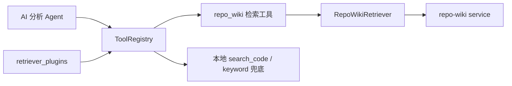

# repo-wiki 代码检索接入方案

## 目标

repo-wiki 作为项目级代码智能检索插件接入 AI 分析链路，并排在本地关键词检索前。后续替换 Sourcegraph、AST 索引、自研 HTTP 检索服务时，不改 AI 分析主链路，只新增或替换 `retrieval.Retriever` adapter。

## 架构



## 配置模型

沿用项目级 `retriever_plugins`，不把检索配置塞进 `project_ai_configs`。

`repo_wiki` 插件配置示例：

```json
{
  "endpoint": "http://127.0.0.1:8766",
  "apiKey": "",
  "repo": "bug_agent",
  "branch": "main",
  "topK": 10,
  "timeoutMs": 8000,
  "searchPath": "/search_symbols",
  "expandDepth": 1,
  "rewrite": true
}
```

字段说明：

- `endpoint`: repo-wiki 服务地址。
- `apiKey`: 可选。存在时通过 `Authorization: Bearer <apiKey>` 发送。
- `repo`: 可选。repo-wiki 内注册的仓库名；为空时自动使用当前缺陷绑定仓库名。
- `branch`: 可选。为空时自动使用当前缺陷所在迭代绑定分支，迭代未绑定时使用项目仓库默认分支。
- `topK`: 默认返回条数。
- `timeoutMs`: HTTP 超时，默认 8000。
- `searchPath`: 搜索接口路径，默认 `/search_symbols`。
- `expandDepth`: 语义搜索扩展调用关系深度。
- `rewrite`: 是否允许 repo-wiki 重写搜索 query。

## 执行顺序

`ToolRegistry.ResolveWithPlugins` 先加载启用的项目检索插件，按 `sort_order` 升序生成工具，再追加基础工具。

默认顺序：

1. `repo_wiki`: `sort_order = 0`
2. `keyword`: `sort_order = 10`
3. `rag`: `sort_order = 20`, 默认关闭
4. `requirement`: `sort_order = 30`, 默认关闭

`keyword` 仍作为本地兜底，不作为独立插件工具注入，因为基础 `search_code` 已覆盖本地代码搜索。

## 接口适配

repo-wiki adapter 向 `endpoint + searchPath` 发送：

```json
{
  "query": "用户输入或缺陷描述",
  "repo": "bug_agent",
  "branch": "main",
  "top_k": 10,
  "expand_depth": 1,
  "rewrite": true
}
```

返回解析兼容以下外层字段：

- 数组根节点
- `data`
- `results`
- `symbols`
- `hits`

单条结果兼容字段：

- 文件：`file_path` / `filePath` / `path` / `document`
- 符号：`symbol_id` / `symbolId` / `id`
- 行号：`line` / `line_start` / `lineStart`
- 摘要：`snippet` / `content` / `summary` / `name`
- 分数：`score`

## 替换其他工具

新增工具只需要：

1. 新增 `server/internal/retrieval/<provider>.go`
2. 实现 `retrieval.Retriever`
3. 在 `RegisterBuiltinPlugins` 注册 provider 名称
4. 给 `retriever_plugins` 增加一条项目级配置

AI 分析、修复、前端配置页无需变更。
