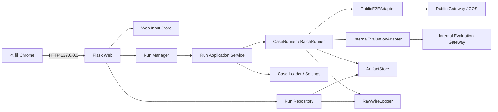

# Dating AI Assistant 双流程自动化评测工具 Web 改造 MVP 开发设计与执行计划

> **For agentic workers:** REQUIRED SUB-SKILL: Use `superpowers:executing-plans` to implement this plan task by task. Before each functional change, use `superpowers:test-driven-development`; before declaring completion, use `superpowers:verification-before-completion`.

## 0. 文档信息

| 项目 | 内容 |
|---|---|
| 文档版本 | V0.1.0 |
| 日期 | 2026-08-31 |
| 状态 | 可执行设计 |
| 目标仓库 | `/Users/admin/Testproject/dating_tool` |
| 参考仓库 | `/Users/admin/Testproject/api-autotest` |
| 产品依据 | `/Users/admin/Testproject/dating_tool/docs/Dating AI Assistant 双流程自动化评测工具 Web 改造 MVP PRD.md` |
| Python | 3.12 |
| Web 技术 | Flask 3、Jinja2、原生 JavaScript、原生 CSS |

### 0.1 目标

在现有 `dating_tool` CLI 和双模式执行内核之上增加一个仅本机使用的 Web 工作台，让测试人员可以从浏览器完成：

1. 完整 E2E 小规模验证：有序截图进入公开链路，执行 Identity、Preferences/Quota、Media、OCR、Task、Result 和 Delete；
2. 快速批量评测：上传 `aidating.eval.case.v1` JSONL，直接执行 Internal Reply/Analysis Evaluation 的 Create、Poll、Result、Diagnostics 和 Delete；
3. 查看 Run、Case、Task、Result、Diagnostics、Cleanup 和完整 Wire Log；
4. 取消尚未完成的 Run，并确保已有远端 Task 仍进入清理流程。

### 0.2 明确结论：可以复用，但必须是“选择性迁移”

第一版不需要从零设计界面。`api-autotest` 的页面结构、视觉样式、多图交互、列表、详情和日志查看均可直接作为迁移基线。

但不能把整个 `api-autotest` Web 后端复制进来，因为它的核心是 Project Registry、Flow YAML、pytest 子进程、JUnit/Allure 和通用 TaskManager；`dating_tool` 已经有自己的 Case Loader、Runner、Adapter、Artifact 和 Wire Logger。整体复制会形成第二套执行器，并导致 CLI 与 Web 行为不一致。

最终策略为：

```text
复用界面骨架和局部浏览器交互
        +
保留 dating_tool 的真实执行内核
        +
新增很薄的 Flask API、后台 Run 管理和 Artifact 查询层
```

### 0.3 不进入本期

- AI Judge；
- 自然语言质量评分；
- 正式 HTML/PDF 报告；
- JUnit/Allure；
- 自动发布、自动门禁和 CI；
- 用例在线编辑器；
- 数据库；
- React、Vue、Node 构建链；
- WebSocket；
- 公网部署和多人权限系统。

---

## 1. 现状评估与复用清单

### 1.1 `dating_tool` 当前可直接保留的执行能力

| 现有模块 | 当前职责 | Web 改造策略 |
|---|---|---|
| `src/aidating_eval/cases.py` | E2E JSON、Eval JSONL 读取和本地协议校验 | 保留，Web 上传后调用同一 Loader |
| `src/aidating_eval/config.py` | 环境变量、HTTP allowlist、staging opt-in、目录配置 | 保留，浏览器不得自行传入凭证或 Gateway |
| `src/aidating_eval/runner.py` | Case 生命周期、状态轮询、重试、`finally` Cleanup | 保留，作为唯一执行逻辑 |
| `src/aidating_eval/scheduling.py` | Eval 并发、Create 间隔、共享限流 | 保留，Web 只传 1～5 的并发值 |
| `src/aidating_eval/adapters/public_e2e.py` | Public Reply/Analysis E2E | 保留，不在 Flask 中重写方法映射 |
| `src/aidating_eval/adapters/internal_evaluation.py` | Internal Reply/Analysis Evaluation | 保留，不在 Flask 中重写 Gateway 调用 |
| `src/aidating_eval/artifacts.py` | Run/Case Artifact 持久化 | 扩展 Manifest 状态，不替换 |
| `src/aidating_eval/wire_logging.py` | 完整请求、响应和异常日志 | 保留，每个 Web Run 绑定一个日志文件 |
| `src/aidating_eval/cli.py` | 参数解析、装配、执行、退出码 | 提取应用服务后改为薄入口，命令保持兼容 |

### 1.2 `api-autotest` 可复用范围

| 来源 | 复用级别 | 复用内容 | 必须删除或改写的内容 |
|---|---:|---|---|
| `web/templates/base.html` | 高 | 顶部栏、侧栏、主内容容器、基础 Jinja 布局 | 项目切换、概览、接口目录、平台文案 |
| `web/templates/task_form.html` | 高 | 双栏表单、主输入区、右侧预检和 Flow 预览 | Single/Flow/Batch 通用模式、Project/Profile/Release 字段 |
| `web/templates/tasks.html` | 高 | 状态筛选、表格结构、空状态 | pytest、报告、项目列 |
| `web/templates/task_detail.html` | 高 | 摘要卡、时间线、结果区、日志区 | JUnit/Allure、重试、报告下载 |
| `web/static/app.css` | 高 | 色彩变量、卡片、表单、状态徽标、表格、日志样式 | 无用选择器和通用平台样式 |
| `web/static/app.js` | 中 | DOM 工具、时间格式化、多图列表、轮询、日志刷新 | 通用项目选择、FlowRunner、报告、Credential Profile 分支 |
| Dating Flow YAML | 只读参考 | 步骤名称、描述、页面 Flow 文案 | 不作为运行输入，不引入 YAML 执行器 |
| `web/app.py` | 低 | Flask application factory、测试 client 和路由组织方式 | 不能整文件复制；其 Project/pytest/report 依赖不适用 |
| `web/task_manager.py` | 不复用 | 无 | pytest 子进程模型与 AI Task Runner 不同 |
| `web/task_store.py` | 不复用 | 可参考安全 ID 和列表排序思路 | 不迁移 JUnit/report 数据结构，不新增数据库式 TaskStore |

### 1.3 Flow YAML 与真实执行链路的差异

`api-autotest` 中现有 Dating Flow 可以帮助复用页面，但不能视为完整协议真相：

- 现有 Reply Flow 可参考 Preferences、多图上传、Create/Poll/Result，但缺少本期要求的 Identity 显式阶段和 Delete；
- 现有 Analysis Flow 可参考多图上传、Create/Poll/Result，但缺少 Quota 和 Delete；
- Internal Evaluation 是 `dating_tool` 已实现的新链路，不应由旧 Flow YAML 推导；
- 页面步骤必须来自 Dating 专用只读 Flow Catalog，并通过测试与 Adapter 方法常量保持一致。

因此，“复用 Flow 界面”不等于“复用 Flow 执行器”。

---

## 2. 总体技术架构

### 2.1 架构图



### 2.2 核心原则

1. `RunApplicationService` 是 CLI 和 Web 的共同应用入口；
2. `CaseRunner`、`BatchRunner` 和两个 Adapter 仍是唯一业务执行器；
3. Flask 只接收输入、调用服务、查询本地状态和转发取消；
4. 浏览器不接触 Gateway URL、API Key、Device ID、Service Name、Method Name 或原始 Params；
5. Artifact 是历史状态的事实来源，内存状态只覆盖正在运行的 Run；
6. Web 首期一次只调度一个 Run，Eval Run 内部仍可并发 1～5 个 Case；
7. 页面每 3 秒轮询本地 Flask，不改变后端 Gateway 的 Poll 频率；
8. 原始 Wire Log 按当前需求完整展示，不做 Web 端二次脱敏；Web 必须固定绑定本机回环地址。

### 2.3 进程和并发模型

- Flask 主线程负责本地 HTTP 请求；
- `RunManager` 使用一个 `ThreadPoolExecutor(max_workers=1)` 执行 Run；
- 同一时间只允许一个 Run 进入 `running`，后续 Run 为 `waiting`；
- E2E Run 内部固定串行；
- Eval Run 继续由 `BatchRunner` 按用户选择的 1～5 并发运行；
- `RunControl` 是取消和停止创建新 Task 的唯一控制对象；
- Web 进程退出时只发出停止请求并等待有限时间，不强杀正在执行 Cleanup 的线程。

采用单 Run 队列是 MVP 的刻意约束：它可以防止多个浏览器批次叠加后突破 staging 的 5 个在途 Task 和 120 请求/分钟限制，同时不影响单个 Eval 批次内部的受控并发。

---

## 3. 目标目录结构

```text
dating_tool/
  pyproject.toml
  README.md
  src/aidating_eval/
    application.py                 # CLI/Web 共用应用服务
    domain.py                      # 增补 Run 状态和值对象
    artifacts.py                   # 增补原子 Manifest 更新
    cli.py                         # 改为薄入口
    web/
      __init__.py
      app.py                       # Flask factory、路由和本地启动入口
      flow_catalog.py              # 四条只读 Flow 描述
      input_store.py               # Web 临时输入和 Case Fixture 生成
      run_manager.py               # 后台队列、取消和活动状态
      run_repository.py            # Artifact/日志只读查询
      view_models.py               # 领域对象到页面/API 的映射
      templates/
        base.html
        task_form.html
        tasks.html
        task_detail.html
      static/
        app.css
        app.js
  runtime/
    web-inputs/                    # 私有临时 Draft；Git 忽略
  artifacts/                       # 现有 Run Artifact；Git 忽略
  logs/                            # 现有完整 Wire Log；Git 忽略
  tests/
    unit/
      test_application.py
      test_artifacts.py
      test_web_flow_catalog.py
      test_web_input_store.py
      test_web_run_manager.py
      test_web_run_repository.py
      test_web_routes.py
      test_web_assets.py
    integration/
      test_web_flows.py
    staging/
      test_web_staging_smoke.py
```

不创建新的 `FlowRunner`、`TaskStore`、数据库模型或前端工程目录。

---

## 4. 共用应用服务设计

### 4.1 提取原因

当前 CLI 中的 Adapter 装配、数据加载、Case 选择、Run ID、Artifact、Wire Logger、批量调度和退出码汇总属于应用逻辑。如果 Web 直接调用 CLI 私有函数或重新实现这些步骤，会产生两套入口行为。

本期新增 `src/aidating_eval/application.py`，把这些逻辑组织为可测试的同步服务；CLI 和后台 Web Worker 都调用它。

### 4.2 核心数据类型

```python
@dataclass(frozen=True)
class RunRequest:
    mode: RunMode
    dataset_path: Path
    fixture_root: Path | None = None
    case_id: str | None = None
    eval_concurrency: int | None = None
    source_name: str | None = None


@dataclass(frozen=True)
class ValidationSummary:
    mode: str
    task_kind: str                 # reply / analysis / mixed
    case_ids: tuple[str, ...]
    case_count: int
    reply_count: int
    analysis_count: int
    message_count: int
    input_bytes: int
    media_count: int
    normal_create_requests: int
    worst_case_create_requests: int
    eval_concurrency: int | None


@dataclass
class PreparedRun:
    run_id: str
    request: RunRequest
    cases: tuple[CaseDefinition, ...]
    settings: Settings
    artifact_store: ArtifactStore
    wire_logger: RawWireLogger
    summary: ValidationSummary


@dataclass(frozen=True)
class RunExecutionResult:
    run_id: str
    status: str
    outcomes: tuple[CaseOutcome, ...]
    exit_code: int
    error_code: str | None
```

### 4.3 服务接口

```python
class RunApplicationService:
    def doctor(self, mode: RunMode) -> list[DoctorCheck]: ...

    def validate(self, request: RunRequest) -> ValidationSummary: ...

    def prepare(
        self,
        request: RunRequest,
        *,
        run_id: str | None = None,
    ) -> PreparedRun: ...

    def execute(
        self,
        prepared: PreparedRun,
        *,
        control: RunControl,
    ) -> RunExecutionResult: ...
```

约束：

- `validate` 只读临时文件并执行本地校验，不发起远端请求；
- `doctor` 可执行现有只读环境检查，并把凭证存在性转换为状态，不返回值本身；
- `prepare` 创建 Run ID、Artifact Manifest 和该 Run 的 Wire Log，但不创建远端 Task；
- `execute` 复用现有 Adapter、Runner、BatchRunner 和退出码规则；
- `execute` 的所有终态都更新 Manifest；
- `Settings.from_env` 继续是唯一配置入口；
- Web 传入的 `eval_concurrency` 只能覆盖当前 Run 的 1～5 调度值，不能覆盖 URL、Key 或协议字段。

### 4.4 CLI 改造

`dating-eval doctor/validate/run` 的参数、输出元数据和退出码保持兼容，但内部改为调用 `RunApplicationService`。

`cleanup --run` 首期可继续保留现有专用实现；当 Web 详情发现 Internal `cleanup_pending` 时，只展示现有补偿命令，不在本期增加“一键重试 Cleanup”。

---

## 5. Run Manifest 与本地状态设计

### 5.1 Manifest Schema

现有 Manifest 扩展为 `aidating.run.manifest.v1`：

```json
{
  "schema_version": "aidating.run.manifest.v1",
  "run_id": "run-20260831-...",
  "created_at": "2026-08-31T10:00:00+08:00",
  "updated_at": "2026-08-31T10:01:00+08:00",
  "started_at": "2026-08-31T10:00:02+08:00",
  "finished_at": null,
  "status": "running",
  "mode": "eval",
  "task_kind": "mixed",
  "case_ids": ["reply-001", "analysis-001"],
  "case_count": 2,
  "dataset_name": "staging-smoke.jsonl",
  "wire_log_path": "2026-08-31/20260831_100000_123456_run_12345.log",
  "cancel_requested": false,
  "cleanup_status": "in_progress",
  "summary": {
    "completed": 0,
    "expected_error": 0,
    "failed": 0,
    "blocked": 0,
    "cancelled": 0,
    "cleanup_pending": 0
  },
  "config": {
    "environment": "staging",
    "eval_concurrency": 3
  }
}
```

Manifest 不写聊天正文、图片二进制和环境变量原值。完整请求和响应只存在 Wire Log；实际 Result/Diagnostics 仍按现有 Artifact 文件保存。

### 5.2 原子更新

`ArtifactStore` 新增：

```python
def update_manifest(self, changes: Mapping[str, Any]) -> dict[str, Any]: ...
```

实现要求：

- 在进程内使用锁串行更新；
- 读取旧 Manifest 后合并允许字段；
- 写入同目录临时文件，`flush + fsync` 后原子替换；
- 文件权限保持 `0600`；
- 目录权限保持 `0700`；
- 禁止调用方覆盖 `run_id` 和 `schema_version`；
- 保持兼容旧 Manifest，列表页可以读取但用 `legacy` 标识缺失字段。

### 5.3 状态转换

```text
waiting -> validating -> running
running -> completed | failed | blocked | cancelled | cleanup_pending
```

细则：

- 点击取消时先设置 `cancel_requested=true`，Run 在当前 HTTP/Task 操作完成前仍显示 `running`；
- 当前活动 Case 完成 `finally` Cleanup 后，Run 才转为 `cancelled` 或 `cleanup_pending`；
- `expected_error` 只属于 Case，不作为 Run 成功伪装；
- 所有 Case 都是 `completed/expected_error` 且 Cleanup 完成时 Run 为 `completed`；
- 存在鉴权、能力未开放或 opt-in 缺失时 Run 为 `blocked`；
- 存在任何未完成 Cleanup 时 Run 优先为 `cleanup_pending`；
- Web 重启后发现 Manifest 仍为 `waiting/validating/running` 且该 Run 不在活动内存中，标记为 `failed`，本地 Code 为 `LOCAL_PROCESS_INTERRUPTED`；若存在已知未清理 Internal Task，则标记 `cleanup_pending`；不自动重发任务。

---

## 6. Web 临时输入设计

### 6.1 Draft 两阶段提交

为了避免校验后再次上传文件，Web 使用 Draft：

```text
浏览器选择文件
  -> POST /api/runs/validate
  -> 写入私有 Draft
  -> 同一 Loader 本地校验
  -> 返回 draft_id + 摘要
  -> POST /api/runs {draft_id}
  -> RunManager 原子认领 Draft
  -> 执行结束后删除 Draft
```

### 6.2 Draft 目录

```text
runtime/web-inputs/<draft_id>/
  draft.json
  dataset.json                 # E2E 时生成
  dataset.jsonl                # Eval 时保存
  media/
    0001-original-name.png
    0002-original-name.png
```

`draft_id` 由 `uuid4().hex` 生成，不能由浏览器指定。

### 6.3 E2E 表单到 Case Fixture 的转换

Web 只生成现有 Loader 已支持的 `aidating.e2e.case.v1`，不直接构造 Adapter 参数。

Reply 示例结构：

```json
{
  "schema_version": "aidating.e2e.case.v1",
  "case_id": "web-reply-smoke-001",
  "task_kind": "reply",
  "locale": "en-US",
  "media": [
    {"path": "media/0001-chat.png"}
  ],
  "preferences": {
    "dating_goal": "serious_relationship",
    "your_voice": "warm_direct"
  },
  "reply": {
    "requested_intent": "flirt",
    "background": "Met twice."
  },
  "expect": {
    "task_status": "succeeded",
    "result_schema": "dating.reply_generation.v1"
  }
}
```

Analysis 使用同一 Schema，`task_kind=analysis`，写入 `analysis.other_person_name/background`，不得出现 Reply Preferences 字段。

### 6.4 Eval JSONL

- 浏览器只能上传一个 `.jsonl` 文件；
- 文件内容必须逐行通过现有 `aidating.eval.case.v1` Loader；
- 页面不支持直接编辑 JSONL；
- Case 筛选只允许从校验结果返回的 `case_id` 列表中选择；
- 未选择 Case 时，任一行非法都阻止整批提交；
- 选择单 Case 时，该 Case 必须独立校验通过；
- 并发必须为整数 1～5；
- JSONL 临时副本运行后删除，Artifact 仅保留文件名和统计摘要。

### 6.5 路径和文件安全

- 只允许浏览器上传，不接受服务端绝对路径；
- 文件名先取 basename，再生成内部顺序名；
- 拒绝空文件、符号链接、路径穿越和超出配置上限的请求体；
- E2E 图片继续由现有 `media_validation.py` 检查真实格式、扩展名、大小和 EXIF；
- 文件落盘使用 `0600`，Draft 目录使用 `0700`；
- Draft 被创建 Run 认领后不能再次使用；
- 进程启动时清理超过 24 小时且未被活动 Run 使用的 Draft；
- Run 成功、失败、阻塞、取消和异常退出的正常清理路径均执行 Draft 删除。

---

## 7. 后台 Run 管理设计

### 7.1 `RunManager` 接口

```python
class RunManager:
    def submit(self, draft_id: str) -> SubmittedRun: ...
    def cancel(self, run_id: str) -> RunSnapshot: ...
    def get_active(self, run_id: str) -> RunSnapshot | None: ...
    def list_active(self) -> list[RunSnapshot]: ...
    def shutdown(self, timeout_seconds: float = 10.0) -> None: ...
```

内部状态：

```python
@dataclass
class ActiveRun:
    run_id: str
    control: RunControl
    future: Future[RunExecutionResult]
    draft_id: str
    submitted_at: datetime
```

### 7.2 提交流程

1. 校验 Draft 存在、未过期且未被认领；
2. 原子认领 Draft；
3. 使用 `RunApplicationService.prepare` 创建 Run、Manifest 和 Wire Log；
4. 将任务提交到单 Worker Executor；
5. 后台调用 `execute`；
6. 将 Case Outcome 汇总进 Manifest；
7. 在 Worker `finally` 删除 Draft；
8. Future 完成后从活动表移除，但历史状态仍由 Artifact 提供。

若 `prepare` 失败，不返回伪 Run ID；接口返回稳定本地错误码，并清理未认领或半创建 Draft。

### 7.3 取消语义

- `waiting` Run：取消后不进入执行器，状态直接为 `cancelled`，删除 Draft；
- `running` Run：调用 `RunControl.request_stop("RUN_CANCELLED")`；
- Runner 停止创建新远端 Task；
- 已知远端 Task 仍执行现有 `finally` Delete；
- 终态 Run 再次取消返回当前终态，HTTP 200；
- 不提供线程强杀，不把浏览器断开视为取消；
- 页面刷新只查询状态，不产生新的任务或幂等键。

---

## 8. Run Repository 与日志查询

### 8.1 `RunRepository` 职责

```python
class RunRepository:
    def list_runs(self, query: RunQuery) -> RunPage: ...
    def get_run(self, run_id: str) -> RunDetail: ...
    def get_case(self, run_id: str, case_id: str) -> CaseDetail: ...
    def tail_log(self, run_id: str, line_count: int = 200) -> LogTail: ...
```

只读来源：

- `artifacts/<run_id>/manifest.json`；
- `artifacts/<run_id>/run-state.jsonl`；
- `artifacts/<run_id>/cases/<case_id>/*.json`；
- Manifest 绑定的 `logs/<date>/<file>.log`。

### 8.2 查询规则

- Run ID、Case ID 必须通过安全名称校验；
- 只读取固定允许文件名：`metadata/task/result/diagnostics/cleanup/error.json`；
- 禁止任意 `path` 参数；
- 解析后确认 `resolve()` 仍位于配置根目录；
- 拒绝符号链接；
- 列表默认按创建时间倒序，默认 50 条，最大 100 条；
- 筛选字段为 `mode/task_kind/status`；
- 活动 Run 使用 `RunManager` 的内存快照覆盖磁盘的短暂延迟；
- Artifact JSON 读取失败时展示 `LOCAL_ARTIFACT_INVALID`，不能令整个列表接口 500。

### 8.3 Wire Log

- 默认返回末尾 200 行；
- `tail` 只允许 100、200、500 三档；
- 只根据 Manifest 中的相对 `wire_log_path` 解析；
- API 不接受日志文件名或绝对路径；
- 返回完整原始行，不二次脱敏；
- 不提供下载路由；
- 日志不存在或写入失败时返回 `LOG_UNAVAILABLE`，Run 本身仍可查看；
- 读取实现从文件尾部按块扫描，避免每次轮询加载整个日志。

---

## 9. Flow Catalog 设计

### 9.1 目标

`flow_catalog.py` 只为页面提供步骤描述，不参与执行。

```python
@dataclass(frozen=True)
class FlowStep:
    key: str
    title: str
    description: str
    method_names: tuple[str, ...] = ()


@dataclass(frozen=True)
class FlowDefinition:
    mode: str
    task_kind: str
    title: str
    steps: tuple[FlowStep, ...]
```

### 9.2 四条固定 Flow

| Flow | 步骤 |
|---|---|
| E2E Reply | Identity → Reply Readiness → Preferences → Media Config → Prepare/PUT/Complete → CreateReplyTask → GetTask → GetTaskResult → DeleteTaskData |
| E2E Analysis | Identity → Media Config → Prepare/PUT/Complete → GetQuotaStatus → CreateAnalysisTask → GetAnalysisTask → GetAnalysisResult → DeleteTaskData |
| Eval Reply | Validate Transcript → CreateReplyEvaluationTask → GetReplyEvaluationTask → GetReplyEvaluationResult → GetEvaluationDiagnostics → DeleteReplyEvaluationTaskData |
| Eval Analysis | Validate Transcript → CreateAnalysisEvaluationTask → GetAnalysisEvaluationTask → GetAnalysisEvaluationResult → GetEvaluationDiagnostics → DeleteAnalysisEvaluationTaskData |

Contract 测试必须把 Catalog 中的方法名和 `PUBLIC_METHODS`、`EVALUATION_METHODS` 做映射校验，避免 UI 文案漂移；Catalog 永远不能被 Runner 读取。

---

## 10. Flask Web API 设计

### 10.1 Application Factory

```python
def create_app(
    *,
    application_service: RunApplicationService | None = None,
    run_manager: RunManager | None = None,
    repository: RunRepository | None = None,
    input_store: WebInputStore | None = None,
) -> Flask: ...
```

生产启动入口固定：

```text
dating-eval-web
```

默认绑定：

```text
host = 127.0.0.1
port = 5005
```

仅允许环境变量 `AIDATING_WEB_PORT` 覆盖端口；MVP 不提供 Host 覆盖，防止误绑定公网地址。

### 10.2 页面路由

| Method | Path | 作用 |
|---|---|---|
| GET | `/` | 302 到 `/runs/new` |
| GET | `/runs/new` | 创建任务页 |
| GET | `/runs` | 任务记录页 |
| GET | `/runs/<run_id>` | 任务详情页 |
| GET | `/health` | 本地进程健康检查，不访问 staging |

### 10.3 本地 API 契约

#### GET `/api/doctor?mode=e2e|eval`

响应：

```json
{
  "success": true,
  "mode": "eval",
  "blocking": false,
  "checks": [
    {"name": "api_key", "status": "pass", "code": "CONFIGURED"},
    {"name": "staging_opt_in", "status": "pass", "code": "ENABLED"}
  ]
}
```

不返回 API Key、Device ID、Token 和环境变量原值。

#### POST `/api/runs/validate`

Content-Type：`multipart/form-data`。

E2E 字段：

```text
mode=e2e
task_kind=reply|analysis
case_id=<optional>
locale=en-US
background=<optional>
dating_goal=<reply only>
your_voice=<reply only>
requested_intent=<reply only, optional>
other_person_name=<analysis only, optional>
media=<one or more ordered files>
```

Eval 字段：

```text
mode=eval
task_kind=dataset
case_id=<optional selector>
eval_concurrency=1..5
dataset=<one JSONL file>
```

成功响应：

```json
{
  "success": true,
  "draft_id": "2b1c...",
  "expires_at": "2026-08-31T11:00:00+08:00",
  "summary": {
    "mode": "eval",
    "task_kind": "mixed",
    "case_count": 8,
    "reply_count": 4,
    "analysis_count": 4,
    "message_count": 96,
    "input_bytes": 18024,
    "media_count": 0,
    "eval_concurrency": 3
  },
  "case_options": [
    {"case_id": "reply-001", "task_kind": "reply"}
  ],
  "flow_keys": ["eval_reply", "eval_analysis"]
}
```

失败响应统一为：

```json
{
  "success": false,
  "error": {
    "code": "INPUT_INVALID",
    "message": "用于本地排查的说明",
    "fields": {"dataset": ["第 3 行消息数量不足"]}
  }
}
```

此接口只做本地校验，不调用 staging。

#### POST `/api/runs`

请求：

```json
{"draft_id": "2b1c..."}
```

成功返回 HTTP 202：

```json
{
  "success": true,
  "run_id": "run-20260831-...",
  "status": "waiting",
  "detail_url": "/runs/run-20260831-..."
}
```

#### GET `/api/runs`

Query：`mode`、`task_kind`、`status`、`page`、`page_size`。

响应包含 Run 摘要、分页信息和最后更新时间，不包含聊天正文。

#### GET `/api/runs/<run_id>`

返回：

- Manifest 摘要；
- 当前 Run/取消状态；
- Flow 步骤和基于事件的步骤状态；
- Case 行；
- Cleanup 汇总；
- 日志是否可用。

#### GET `/api/runs/<run_id>/cases/<case_id>`

返回允许的 Artifact 原始 JSON：`metadata/task/result/diagnostics/cleanup/error`。此接口会返回业务正文，页面默认折叠显示。

#### GET `/api/runs/<run_id>/logs?tail=200`

```json
{
  "success": true,
  "run_id": "run-...",
  "tail": 200,
  "truncated": true,
  "lines": ["完整原始日志行"]
}
```

#### POST `/api/runs/<run_id>/cancel`

运行中返回：

```json
{
  "success": true,
  "run_id": "run-...",
  "status": "running",
  "cancel_requested": true
}
```

终态重复调用返回 HTTP 200 和原终态。

### 10.4 HTTP 状态码

| HTTP | 场景 |
|---|---|
| 200 | 查询、校验、幂等取消成功 |
| 202 | Run 已进入后台队列 |
| 400 | 表单或数据集本地错误 |
| 404 | Draft/Run/Case 不存在 |
| 409 | Draft 已认领、过期或状态冲突 |
| 413 | 上传体超过本地限制 |
| 500 | 未分类本地错误；响应仍带稳定本地 Code |

后端业务失败不直接转换为 Flask 500；它属于 Run/Case 结果，通过详情 API 展示。

---

## 11. 页面与交互设计

### 11.1 视觉复用策略

直接迁移 `api-autotest` 的桌面工作台视觉基线：

- 近白页面背景和浅灰分区；
- 系统蓝作为主操作色；
- 左侧窄导航；
- 清晰的卡片边界和中等信息密度；
- 状态用文本和颜色共同表达；
- 原始日志使用等宽字体；
- 不使用夸张渐变、玻璃拟态、大面积阴影和营销式 Dashboard。

迁移时只保留实际被三个页面使用的 CSS，避免把 326 行样式原样复制后留下无效选择器。

### 11.2 全局布局

顶部栏：

- 产品名：`Dating AI Assistant Eval`；
- 环境状态：`local / staging`；
- 不展示 Key、Device ID 和账户信息。

侧栏：

1. 创建任务；
2. 任务记录。

不出现项目选择、概览、接口目录、报告中心或配置中心。

### 11.3 创建任务页

#### 左栏

1. 一级 Tab：`完整 E2E`、`快速批量评测`；
2. E2E 二级选项：Reply、Analysis；
3. E2E 文件区：有序多图、移除、清空、文件类型和大小；
4. Reply 字段：Dating Goal、Your Voice、Requested Intent、Background；
5. Analysis 字段：Other Person Name、Background；
6. Eval 文件区：一个 JSONL、Case 选择、并发 1～5；
7. `校验输入` 和 `开始执行` 两个动作。

#### 右栏

- 环境检查；
- 本地校验摘要；
- 输入/Case/消息/字节/预计任务数；
- 并发和 staging 限制；
- 阻塞项及稳定 Code；
- 真实 Flow 步骤预览。

交互规则：

- 文件或字段变化后，旧 Draft 立即失效，开始按钮禁用；
- 必须重新点击校验并取得新 Draft；
- 校验通过且 Doctor 无阻塞项时，开始按钮启用；
- E2E/Eval 切换时清空另一模式的文件控件和 Draft；
- 提交成功后跳转 Run 详情；
- 创建请求只发一次，按钮进入 loading 并防重复点击。

### 11.4 任务记录页

字段：

- Run ID；
- 创建时间；
- 模式；
- Reply/Analysis/Mixed；
- Case 数；
- Run 状态；
- Cleanup 状态；
- 最后更新时间。

筛选：模式、类型、状态。默认最近 50 条，无数据时给出“创建第一条任务”的明确入口。

### 11.5 任务详情页

按顺序展示：

1. Run 摘要；
2. 当前状态和取消按钮；
3. 执行时间线；
4. Case 结果表；
5. 选中 Case 的 Task/Result/Diagnostics/Cleanup/Error 折叠区；
6. 完整 Wire Log 尾部。

页面每 3 秒轮询本地详情和日志；Run 进入终态后停止自动轮询，用户仍可手动刷新日志。

### 11.6 可访问性和桌面适配

- 使用语义化 `nav/main/form/table/details`；
- 所有输入都有可见 `label`；
- Tab 支持键盘方向键和正确 ARIA 状态；
- 文件移除按钮包含文件名的可访问文本；
- Focus Ring 不得被全局样式移除；
- 状态不能只依赖红绿颜色；
- 辅助文字保持足够对比度；
- 遵守 `prefers-reduced-motion`；
- MVP 以 1280px 和 1440px macOS Chrome 为验收尺寸；不承诺手机端布局。

---

## 12. 前端代码迁移策略

### 12.1 模板

采用“复制后立即删减”的方式迁移四个模板：

1. 先复制 `base.html` 的布局骨架；
2. 删除项目、Release、Catalog、Report 导航；
3. 将 `task_form.html` 改成 Dating 专用字段；
4. 将 `tasks.html` 改为 Run 列表；
5. 将 `task_detail.html` 改为 Artifact 和 Wire Log 详情；
6. 模板不包含 Gateway Service/Method 判断，Flow 由服务端序列化。

### 12.2 JavaScript

从 `api-autotest/web/static/app.js` 选择性迁移：

- `byId`、HTML escape、时间和大小格式化；
- 多图文件列表、顺序、移除和清空；
- 状态徽标映射；
- Flow 步骤渲染；
- 任务列表拉取与筛选；
- 任务详情和日志轮询。

以下逻辑重新按本地 API 编写：

- multipart Draft 校验；
- Doctor；
- Draft 失效；
- Run 创建；
- Case Artifact 切换；
- 取消；
- 终态停止轮询。

不迁移 Project、Credential、Runtime Scope、Release、JUnit、Allure、retry、pytest 状态和通用 Flow 分支。

### 12.3 CSS

保留并重新命名通用设计 Token，保留：

- 顶部栏、侧栏和主容器；
- Panel、Form、Button、Tabs；
- Media List；
- Status Badge；
- Table；
- Timeline；
- Code/Log Viewer；
- Loading、Empty、Error 状态。

删除未被 DOM 使用的选择器；页面样式测试检查关键 Class 存在，但不以字符串快照锁死全部 CSS。

---

## 13. 错误、重试与 Cleanup 映射

### 13.1 本地错误码

| Code | 场景 |
|---|---|
| `WEB_INPUT_INVALID` | multipart 字段或文件不合法 |
| `DRAFT_NOT_FOUND` | Draft 不存在或已清理 |
| `DRAFT_ALREADY_CLAIMED` | 重复创建 Run |
| `RUN_NOT_FOUND` | Run 不存在 |
| `CASE_NOT_FOUND` | Case 不属于该 Run |
| `LOCAL_ARTIFACT_INVALID` | Artifact 无法解析 |
| `LOCAL_PROCESS_INTERRUPTED` | Web 重启导致活动 Run 丢失 |
| `LOG_UNAVAILABLE` | 日志缺失或不可读 |

后端稳定业务 Code 保留原值，不由 Web 改名。

### 13.2 停止创建新 Task

以下 Code 触发现有批次控制停止：

- `UNAUTHENTICATED`；
- `PERMISSION_DENIED`；
- `FEATURE_NOT_READY`；
- 用户取消；
- SIGINT/SIGTERM；
- Web 正常 shutdown。

### 13.3 Retry

- Web 不增加“一键重试”；
- 网络结果未知时继续由现有 Runner 复用原幂等键；
- `INPUT_INVALID`、`IDEMPOTENCY_CONFLICT` 不自动重试；
- `EVALUATION_LIMIT_EXCEEDED` 继续使用共享 Cooldown；
- 页面刷新绝不触发远端 Retry；
- 用户重新创建 Run 时生成新的 Run ID 和真实重复运行幂等键。

### 13.4 Cleanup 优先级

```text
远端任务终态/异常/取消
  -> Adapter/Runner finally Delete
  -> 写 cleanup.json
  -> 汇总 Case Cleanup
  -> 决定 Run terminal status
  -> 删除本地 Draft
```

日志写入失败、浏览器断开和页面异常不能绕过远端 Cleanup。

---

## 14. 依赖与打包

### 14.1 `pyproject.toml`

新增：

```toml
dependencies = [
  "requests>=2.34.2,<3",
  "python-dotenv>=1.2.3,<2",
  "Pillow>=12.3,<13",
  "Flask>=3.0,<4",
]

[project.scripts]
dating-eval = "aidating_eval.cli:main"
dating-eval-web = "aidating_eval.web.app:main"

[tool.setuptools.package-data]
"aidating_eval.web" = [
  "templates/*.html",
  "static/*.css",
  "static/*.js",
]
```

不新增生产 WSGI Server；该工具明确只用于本机测试。

### 14.2 环境变量

沿用已有变量，并新增：

```text
AIDATING_WEB_PORT=5005
AIDATING_WEB_INPUT_ROOT=runtime/web-inputs
```

不新增页面可编辑的 Key、Device、Gateway 或 Allow-Insecure 配置。

### 14.3 `.gitignore`

确认继续忽略：

```text
.env
artifacts/
logs/
runtime/web-inputs/
datasets/media/staging-*.png
```

---

## 15. 测试设计

### 15.1 测试分层

| 层级 | 目标 | 默认访问 staging |
|---|---|---:|
| Unit | 应用服务、状态、Draft、Repository、路由、View Model | 否 |
| Contract | Flow 方法、请求字段、状态和错误映射 | 否 |
| Fake Integration | Web → Service → Runner → Fake Adapter → Artifact | 否 |
| Browser | 页面、交互、轮询、键盘和视觉 | 否 |
| Staging Smoke | 三条已开放真实链路和 Reply readiness | 仅显式 opt-in |

### 15.2 Unit 覆盖

- CLI 与 Web 调用相同 `RunApplicationService`；
- `validate` 不进行任何网络调用；
- E2E 表单生成合法现有 Case Schema；
- 多图顺序不变；
- Eval JSONL 统计和单 Case 选择；
- 非法并发、非法 Case、坏 JSONL、图片错误；
- Draft 的创建、认领、过期和清理；
- Manifest 原子更新、旧版本兼容、权限；
- Run 队列和幂等取消；
- 取消后不再创建新 Task；
- Run/Case/日志路径穿越和符号链接逃逸；
- 日志尾部 100/200/500 行；
- 活动内存状态覆盖 Artifact；
- Web 重启后的中断状态；
- 所有路由成功和稳定错误响应；
- Flask 默认绑定参数测试；
- 打包后的模板和静态文件可读取。

### 15.3 Fake Integration

四条完整用例：

1. Public Reply：Identity → Readiness → Preferences → Media → Task → Result → Delete；
2. Public Analysis：Identity → Media → Quota → Task → Result → Delete；
3. Internal Reply：Create → Poll → Result → Diagnostics → Delete；
4. Internal Analysis：Create → Poll → Result → Diagnostics → Delete。

每条用例从 Flask `POST /api/runs/validate` 开始，经后台 Run 执行，再通过详情 API 检查结果和 Cleanup，不能直接调用 Adapter 绕过 Web 集成层。

另覆盖：

- Reply + Analysis Mixed Eval；
- 默认并发 3、最大 5；
- Create 间隔；
- `EVALUATION_LIMIT_EXCEEDED` 共享等待；
- 确定性安全降级；
- 301～500 条 Analysis 截断；
- 网络未知重放幂等键；
- 用户取消；
- Cleanup `NOT_FOUND` 和 `cleanup_pending`。

### 15.4 Browser 验收

使用真实浏览器在 1280×800 和 1440×900 下检查：

- E2E/Eval 和 Reply/Analysis 切换；
- 多图顺序、移除和清空；
- JSONL 摘要、Case 选择和并发；
- Draft 失效和防重复提交；
- Waiting/Running/Completed/Failed/Blocked/Cancelled/Cleanup Pending；
- 任务列表筛选和空状态；
- 详情时间线、Artifact 折叠区和完整日志；
- 键盘 Tab、Focus、Tab 控件和取消按钮；
- `prefers-reduced-motion`；
- 长 Run ID、长错误码、长日志行不破坏布局。

### 15.5 真实 staging

只有以下条件同时成立才运行：

- `.env` 已由用户本地配置；
- `AIDATING_RUN_STAGING_TESTS=1`；
- Internal 临时 HTTP 的显式允许已配置；
- 测试数据脱敏。

验收链路：

1. Internal Reply：Result + Diagnostics + Delete；
2. Internal Analysis：Result + Diagnostics + Delete；
3. Internal Mixed JSONL：Web 批次完成；
4. Public Analysis：脱敏截图 + Result + Delete；
5. Public Reply：先 readiness；未开放时在 Media Upload 前显示稳定阻塞；开放后再执行 Result + Delete。

每条 Smoke 都必须从任务详情确认对应 Wire Log，并确认本地 Draft 已删除。

---

## 16. 可执行开发计划

### 执行约束

- 在 `/Users/admin/Testproject/dating_tool` 原地开发；
- 只把 `/Users/admin/Testproject/api-autotest` 当作只读参考；
- 不修改 `api-autotest`；
- 不修改父目录其他项目；
- 不执行 Git commit 或 push，除非用户后续明确授权；
- 每个任务遵循：先增加失败测试并确认 RED，再做最小实现，再跑目标测试和默认回归；
- 每个任务结束检查 `git diff -- dating_tool` 或等价范围，避免跨项目修改；
- 默认测试绝不访问 staging。

### Task 1：提取 CLI/Web 共用应用服务

**目标**：把当前 CLI 中的装配和执行编排提取为稳定应用端口，保持 CLI 行为不变。

**新增文件**：

- `src/aidating_eval/application.py`
- `tests/unit/test_application.py`

**修改文件**：

- `src/aidating_eval/cli.py`
- `src/aidating_eval/domain.py`
- `tests/unit/test_cli.py`

**步骤**：

1. 写失败测试：`validate` 返回 E2E/Eval 摘要且无网络调用；
2. 写失败测试：`execute` 为 E2E 串行、Eval 使用 BatchRunner；
3. 写失败测试：应用服务复用退出码和停止规则；
4. 实现 `RunRequest/ValidationSummary/PreparedRun/RunExecutionResult`；
5. 实现 `RunApplicationService`；
6. 让 CLI 委托应用服务，保持命令参数和输出不变；
7. 跑目标测试；
8. 跑全部原有 Unit 和 Integration，确认没有执行语义回归。

**验证命令**：

```bash
python -m unittest tests.unit.test_application tests.unit.test_cli -v
python -m unittest discover -s tests -p 'test_*.py' -v
dating-eval --help
```

**完成条件**：CLI 所有旧测试通过，Web 后续不再依赖 CLI 私有函数。

### Task 2：扩展 Manifest 并实现历史 Run Repository

**目标**：为列表、详情、状态恢复和日志绑定提供可靠本地数据源。

**新增文件**：

- `src/aidating_eval/web/__init__.py`
- `src/aidating_eval/web/run_repository.py`
- `src/aidating_eval/web/view_models.py`
- `tests/unit/test_web_run_repository.py`

**修改文件**：

- `src/aidating_eval/artifacts.py`
- `tests/unit/test_artifacts.py`

**步骤**：

1. 写 Manifest 原子更新、权限和不可变字段失败测试；
2. 写旧 Manifest 兼容测试；
3. 写 Run 列表排序、筛选和分页失败测试；
4. 写 Case 固定文件白名单测试；
5. 写 `../`、绝对路径和符号链接逃逸测试；
6. 写 Wire Log 尾部读取和非法 tail 测试；
7. 实现 Manifest Schema 和 `update_manifest`；
8. 实现 Repository 和 View Model；
9. 跑目标和全量回归。

**验证命令**：

```bash
python -m unittest tests.unit.test_artifacts tests.unit.test_web_run_repository -v
python -m unittest discover -s tests -p 'test_*.py' -v
```

**完成条件**：重启进程后可仅依靠 Artifact 重建历史列表和详情，任意路径读取被拒绝。

### Task 3：实现 Web Draft 与输入转换

**目标**：把浏览器文件安全转换成现有 E2E JSON 或 Eval JSONL，并调用同一 Loader 校验。

**新增文件**：

- `src/aidating_eval/web/input_store.py`
- `tests/unit/test_web_input_store.py`

**修改文件**：

- `.gitignore`

**步骤**：

1. 写 E2E Reply 和 Analysis Case 生成失败测试；
2. 写多图顺序和元数据测试；
3. 写 Eval Mixed 统计、Case 筛选和并发测试；
4. 写文件过期、重复认领和 Draft 清理测试；
5. 写路径、文件名、符号链接和文件权限测试；
6. 实现 `WebInputStore.create_e2e_draft/create_eval_draft/claim/delete/purge_stale`；
7. 使用 `RunApplicationService.validate` 二次确认生成数据；
8. 跑目标和全量回归。

**验证命令**：

```bash
python -m unittest tests.unit.test_web_input_store tests.unit.test_cases tests.unit.test_media_validation -v
python -m unittest discover -s tests -p 'test_*.py' -v
```

**完成条件**：Web 不需要接受任意服务端路径，生成 Fixture 与现有 CLI 数据格式完全兼容。

### Task 4：实现后台 RunManager 和取消

**目标**：HTTP 请求快速返回，Run 在单队列后台执行，并复用现有 RunControl 清理。

**新增文件**：

- `src/aidating_eval/web/run_manager.py`
- `tests/unit/test_web_run_manager.py`

**修改文件**：

- `src/aidating_eval/application.py`
- `src/aidating_eval/artifacts.py`

**步骤**：

1. 写单 Run 执行、后续 Run waiting 的失败测试；
2. 写 waiting Run 取消测试；
3. 写 running Run 取消后停止创建新 Case 的测试；
4. 写已有 Task 仍 Cleanup 的测试；
5. 写终态幂等取消测试；
6. 写 Worker 异常时 Manifest 和 Draft 清理测试；
7. 实现 Executor、ActiveRun、Future callback 和 shutdown；
8. 跑目标、Runner 和 Scheduling 回归。

**验证命令**：

```bash
python -m unittest tests.unit.test_web_run_manager tests.unit.test_runner tests.unit.test_scheduling -v
python -m unittest discover -s tests -p 'test_*.py' -v
```

**完成条件**：取消不会新增远端 Task，已知 Task 的 Delete 仍可观察，Draft 最终删除。

### Task 5：实现 Flask API 和打包

**目标**：冻结本地 API 契约，并让 Web 服务可通过项目脚本启动。

**新增文件**：

- `src/aidating_eval/web/app.py`
- `tests/unit/test_web_routes.py`

**修改文件**：

- `pyproject.toml`

**步骤**：

1. 写 `create_app` 注入 Fake Service/Manager/Repository 的路由测试；
2. 写 `/health`、Doctor、Validate、Create、List、Detail、Case、Log、Cancel 测试；
3. 写 multipart 缺字段、超限、Draft 冲突和稳定错误响应测试；
4. 写默认 Host 固定 `127.0.0.1` 测试；
5. 实现 Flask factory、JSON 错误处理和路由；
6. 新增 Flask 依赖、`dating-eval-web` 脚本和 package data；
7. 从全新临时 venv 安装项目，确认模板尚未加入前至少入口可导入；
8. 跑目标和全量回归。

**验证命令**：

```bash
python -m unittest tests.unit.test_web_routes -v
python -m compileall -q src tests
python -m unittest discover -s tests -p 'test_*.py' -v
dating-eval-web --help
```

**完成条件**：所有本地 API 可用，HTTP 创建返回 202，不等待 AI Task 完成。

### Task 6：迁移创建任务页和 Flow 预览

**目标**：复用 `api-autotest` 双栏界面和多图交互，完成 Dating 专用创建页。

**新增文件**：

- `src/aidating_eval/web/flow_catalog.py`
- `src/aidating_eval/web/templates/base.html`
- `src/aidating_eval/web/templates/task_form.html`
- `src/aidating_eval/web/static/app.css`
- `src/aidating_eval/web/static/app.js`
- `tests/unit/test_web_flow_catalog.py`
- `tests/unit/test_web_assets.py`

**修改文件**：

- `src/aidating_eval/web/app.py`

**步骤**：

1. 写四条 Flow Catalog 与 Adapter 方法映射测试；
2. 写页面不存在 Project/pytest/JUnit/Allure/Report 文案的测试；
3. 写页面包含双模式、任务类型、多图、JSONL、并发和预检区域的测试；
4. 迁移并删减 `base.html/task_form.html/app.css`；
5. 选择性迁移多图和 Flow JavaScript；
6. 实现 Doctor、Draft Validate、Draft 失效和 Run Create；
7. 检查按钮防重复提交和错误状态；
8. 跑 Flask Client 和静态资源测试；
9. 启动本地 Web，用浏览器覆盖完整交互。

**验证命令**：

```bash
python -m unittest tests.unit.test_web_flow_catalog tests.unit.test_web_assets tests.unit.test_web_routes -v
python -m unittest discover -s tests -p 'test_*.py' -v
```

**完成条件**：创建页无需从零设计，视觉和交互继承 `api-autotest`，执行字段完全符合 Dating PRD。

### Task 7：迁移任务记录、详情和完整日志

**目标**：从 Artifact 和 Wire Log 展示历史与实时状态。

**新增文件**：

- `src/aidating_eval/web/templates/tasks.html`
- `src/aidating_eval/web/templates/task_detail.html`

**修改文件**：

- `src/aidating_eval/web/static/app.css`
- `src/aidating_eval/web/static/app.js`
- `src/aidating_eval/web/app.py`
- `tests/unit/test_web_assets.py`
- `tests/unit/test_web_routes.py`

**步骤**：

1. 写列表筛选、空状态和旧 Artifact 页面测试；
2. 写详情摘要、时间线、Case 表和 Artifact 折叠区测试；
3. 写完整日志轮询和终态停止测试；
4. 写取消显示和幂等操作测试；
5. 迁移并改造 `tasks.html/task_detail.html`；
6. 迁移列表、详情和日志轮询 JavaScript；
7. 删除报告、重试和通用平台 UI；
8. 用长 ID、长错误码和长日志行进行浏览器检查；
9. 跑目标和全量回归。

**验证命令**：

```bash
python -m unittest tests.unit.test_web_routes tests.unit.test_web_assets tests.unit.test_web_run_repository -v
python -m unittest discover -s tests -p 'test_*.py' -v
```

**完成条件**：用户可以从列表进入任一 Run，并看到对应 Case、Cleanup 和完整请求响应日志。

### Task 8：Fake Web 集成、异常和清理闭环

**目标**：证明 Web 没有创建第二执行器，四条链路都经过现有 Runner/Adapter。

**新增文件**：

- `tests/integration/test_web_flows.py`

**修改文件**：

- 按失败测试所需最小修正相关 Web 模块

**步骤**：

1. 从 Flask Client 提交 Public Reply Fake；
2. 从 Flask Client 提交 Public Analysis Fake；
3. 从 Flask Client 提交 Internal Reply Fake；
4. 从 Flask Client 提交 Internal Analysis Fake；
5. 增加 Mixed Eval、限流、网络未知、安全降级和 Analysis 截断；
6. 增加取消、鉴权失败、未知状态和 Cleanup Pending；
7. 逐条断言 Adapter 调用顺序、Artifact、Manifest、日志绑定和 Draft 删除；
8. 跑完整默认回归并确认没有外网请求。

**验证命令**：

```bash
python -m unittest tests.integration.test_web_flows -v
python -m unittest discover -s tests -p 'test_*.py' -v
```

**完成条件**：四条 Fake 链路和异常 Cleanup 全部通过，Web 路由中不存在 Gateway 调用代码。

### Task 9：Staging Smoke、浏览器 QA 和文档交付

**目标**：完成真实链路、UI 和仓库安全边界的最终验收。

**新增文件**：

- `tests/staging/test_web_staging_smoke.py`

**修改文件**：

- `README.md`
- `.env.example`（只增加变量名和安全示例，不写真实值）

**步骤**：

1. 在显式 opt-in 下跑 Internal Reply；
2. 跑 Internal Analysis；
3. 跑 Internal Mixed JSONL；
4. 跑 Public Analysis 脱敏截图；
5. 跑 Public Reply readiness，开放时再跑完整链路；
6. 从页面逐条确认 Result、Diagnostics、Cleanup、Wire Log 和 Draft 删除；
7. 使用浏览器在 1280×800、1440×900 检查创建、列表和详情；
8. 检查键盘操作、Focus、错误、空状态、取消和 reduced motion；
9. 更新 README：安装、启动、环境、两种模式、日志敏感性、停止服务和 Cleanup；
10. 扫描源码、文档、Fixture、Git 暂存区，确认无真实 Key、Token、Device ID、签名 URL 和真实媒体；
11. 执行最终全量验证。

**最终验证命令**：

```bash
python -m compileall -q src tests
python -m unittest discover -s tests -p 'test_*.py' -v
dating-eval --help
dating-eval doctor --mode e2e
dating-eval doctor --mode eval
dating-eval-web --help
```

真实 Smoke 仅在用户环境已经 opt-in 时执行：

```bash
AIDATING_RUN_STAGING_TESTS=1 python -m unittest tests.staging.test_web_staging_smoke -v
```

**完成条件**：默认测试全绿；当前已开放三条真实能力成功并完成 Delete；Public Reply 未开放时具有媒体上传前的明确阻塞证据；浏览器三页面验收通过。

---

## 17. 任务依赖与建议顺序

```text
Task 1 应用服务
  -> Task 2 Manifest/Repository
  -> Task 3 Draft
  -> Task 4 RunManager
  -> Task 5 Flask API
  -> Task 6 创建页
  -> Task 7 列表/详情/日志
  -> Task 8 Fake Integration
  -> Task 9 Staging/Browser/Docs
```

Task 2 和 Task 3 在接口冻结后可以并行实现，但为了避免共享修改 `application.py/artifacts.py`，本项目首次落地建议仍按上述顺序串行执行。

---

## 18. PRD 验收追踪矩阵

| PRD 验收项 | 设计落点 | 测试落点 |
|---|---|---|
| 只绑定 `127.0.0.1` | `web/app.py:main` | `test_web_routes.py` |
| E2E/Eval + Reply/Analysis | 创建页、Draft | `test_web_assets.py`、`test_web_input_store.py` |
| E2E 有序多图 | InputStore + 前端文件列表 | Unit + Browser |
| Eval JSONL/Case/并发 | InputStore + Application | Unit + Fake Integration |
| 正确 Flow | Flow Catalog | Contract Test |
| 重启后历史可读 | Artifact + Repository | `test_web_run_repository.py` |
| Task/Result/Diagnostics/Cleanup/Error | Case Detail API | Route + Browser |
| 完整 Wire Log | Manifest 日志绑定 + tail API | Repository + Browser |
| 取消和 Cleanup | RunManager + RunControl | Manager + Integration |
| 无 Judge/报告/CI | 模板和路由白名单 | Asset/Route Test |
| 四条 Fake 链路 | 现有 Runner/Adapter | `test_web_flows.py` |
| 真实 Internal Reply/Analysis | Staging Smoke | `test_web_staging_smoke.py` |
| Public Analysis | Staging Smoke | 同上 |
| Public Reply readiness | Adapter prepare_run 前置 | Unit + Staging |
| 临时文件删除 | InputStore finally | Unit + Staging |
| 无真实凭证入库 | Git/文件扫描 | Final Verification |

---

## 19. 风险与处理

| 风险 | 影响 | 处理 |
|---|---|---|
| Public Reply/Preferences staging 尚未开放 | 无法完成真实 Reply E2E | 保持分层验收；readiness 在媒体前阻塞，Fake/Contract 先完成 |
| 原始日志包含全部凭证和正文 | 本机泄露风险 | 固定回环地址、目录 Git 忽略、路径白名单、不提供下载、不把值写入页面其他区域 |
| Web 进程异常退出 | Public Token 不可跨进程 Cleanup | Manifest 标记中断；Internal 可用现有 cleanup；Public 依赖 TTL，并在 README 明示 |
| 多个批次同时突破 staging 限制 | 限流或测试污染 | 单 Run Executor；单 Eval 批次内部最大 5 |
| 直接整搬 `api-autotest` | 形成第二执行器和大量无关代码 | 按复用矩阵逐文件删减；测试禁止 Web 直接调用 Gateway |
| Artifact 中存在旧版本数据 | 列表解析失败 | Repository 宽容读取，缺失字段标记 legacy，单条损坏不拖垮列表 |
| 长日志导致页面卡顿 | 详情不可用 | 默认 tail 200，最大 500；后端从文件尾按块读取 |
| Browser 重复提交 | 重复 Run/幂等混乱 | Draft 单次认领、按钮锁定、POST 返回 202 后立即跳转 |

---

## 20. 最终开发判断

本次改造不应从零重新做一个测试平台，也不应把 `api-autotest` 整体复制成新项目。最短且风险最低的路径是：

1. 直接复用 `api-autotest` 的四个页面骨架、视觉样式和多图/列表/日志交互；
2. 删除所有通用测试平台、pytest、报告、项目管理和 Flow 执行逻辑；
3. 为 `dating_tool` 提取一个 CLI/Web 共用的 `RunApplicationService`；
4. 增加 Flask、Draft、RunManager 和 Artifact Repository 四个薄层；
5. 所有真实请求继续完全由当前 Public/Internal Adapter 和 Runner 执行。

这样既能明显缩短第一版页面开发时间，也能保证 Web 与已经验证过的 CLI 双流程保持同一套协议、状态机、限流、幂等和 Cleanup 行为。
