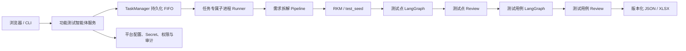
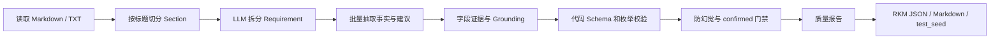
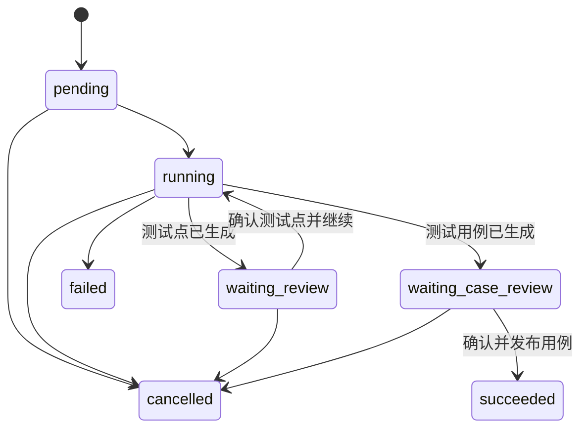

# 功能测试智能体：从需求理解到可发布测试资产

> 本文基于 `functional-test-agent` 的需求拆解 PRD、知识模型、工作流、Prompt、服务实现、Review 实现与测试，以及 `test-platform/docs` 中的独立接入、在线测试点 Review、在线测试用例 Review、脑图工作台和独立发布资料整理。本文同时区分初始设计、后续演进与当前实际实现。

## 1. 一句话介绍

功能测试智能体不是一次调用模型直接生成一批测试用例，而是一条带证据、质量校验、覆盖补齐和人工门禁的测试资产生产流水线：它先将自然语言需求拆成可追溯的 Requirement，再生成并校验测试点，经过人工 Review 后生成测试用例，再经过第二次 Review，最终发布版本化 JSON 和 Excel 产物。

## 2. 为什么要开发这个工具

传统的功能测试设计通常从 PRD 直接进入测试点和测试用例编写：

```text
PRD → 测试点 → 测试用例
```

这一过程的问题并不只是“编写很耗时”，更重要的是质量口径不稳定：

- PRD 表达方式不统一，正常流程容易识别，异常、边界、权限和状态流转容易遗漏。
- 不同测试人员对同一需求的拆解粒度不同，覆盖结果依赖个人经验。
- 模型直接阅读整篇 PRD 时，可能机械切分，也可能补充原文没有的事实。
- 测试点和测试用例生成后，很难解释它们来自哪段需求、覆盖了哪些约束。
- 人工修改结果往往发生在本地文件中，原稿、修改稿和最终版本缺少清晰边界。
- AI 生成与人工决策如果没有门禁，错误内容可能直接进入正式测试资产。

因此项目把流程升级为：

```text
PRD
→ 需求知识模型 RKM
→ 结构化 test_seed
→ 测试点生成与覆盖补齐
→ 人工 Review
→ 测试用例生成与覆盖补齐
→ 人工 Review
→ 版本化 JSON / XLSX
```

核心目标不是替代测试人员，而是把重复的提取、整理和覆盖检查交给智能体，把需求歧义、风险判断和正式发布保留给人。

## 3. 产品目标与边界

### 核心目标

1. 将原始需求拆成单一、可验证、可测试的 Requirement。
2. 将需求事实与 AI 推断的测试建议分开保存。
3. 为每项重要事实绑定原文证据，避免需求被模型曲解。
4. 从结构化需求生成测试点，并检查覆盖缺口、自动补齐。
5. 从确认测试点生成可执行测试用例，并再次检查覆盖关系。
6. 在测试点和测试用例两个阶段都保留人工 Review 门禁。
7. 让原稿、草稿、AI 建议、确认版本和正式产物彼此隔离、可追溯。
8. 同时支持 CLI 独立运行与测试开发平台异步任务模式。

### 明确不做

- 不让 AI 自动裁决互相冲突的需求。
- 不让无原文证据的推断成为正式需求事实。
- 不建设复杂知识图谱数据库或通用低代码 Agent 平台。
- 不在需求拆解失败时伪造低可信 Requirement。
- 不把聊天框作为平台唯一入口，关键参数使用结构化表单。
- 不自动把产物提交到 Git、测试管理系统或 CI/CD。
- 不做多人实时协同、自动保存和三方版本合并。
- 不包含 API 测试智能体的用例生成、数据库或真实执行能力。

## 4. 项目演进路线

| 阶段 | 要解决的问题 | 主要变化 |
| --- | --- | --- |
| 初始功能智能体 | 从需求生成测试点和用例 | Tool Calling Agent + 两条 LangGraph 生成工作流 |
| 需求拆解 V1.0 | PRD 直接生成测试点不稳定 | 引入轻量 Requirement、测试对象、约束、状态、权限和 GWT |
| 需求拆解 V1.2 | 模型可能曲解或扩写需求 | 引入字段证据、Grounding Check、事实/建议分层和质量门禁 |
| test_seed 集成 | 完整 Requirement 上下文过重 | 聚合为面向测试点生成的结构化 test_seed |
| 平台独立接入 | 本地脚本不适合多用户长任务 | 独立服务、异步任务、子进程隔离、上传、日志和产物协议 |
| 在线测试点 Review | 下载 JSON 再上传效率低 | 在线增删改、CAS 草稿、确认版本和 AI Review |
| 在线测试用例 Review | 用例生成后缺少第二道人工门禁 | 用例草稿、覆盖校验、AI 建议、确认发布 JSON/XLSX |
| 脑图工作台 | 表格难以理解层级与覆盖关系 | 脑图编辑、只读表格、版本视图和统一任务工作台 |
| 自由脑图 Review | 结构保护导致节点难编辑 | 草稿树与业务 JSON 分层，允许先编辑、后校验、再确认风险 |
| 源码物理拆分 | 两个智能体共享仓库影响独立发布 | 建立独立项目、镜像、依赖锁、runtime 和回滚边界 |

## 5. 当前总体架构



架构可分为四层：

| 层次 | 主要模块 | 职责 |
| --- | --- | --- |
| 需求理解层 | `requirement_decomposition/` | 文档切片、Requirement 拆解、事实抽取、证据校验、test_seed 输出 |
| 测试设计层 | `agents/functional_test/workflows/` | 测试点和测试用例生成、覆盖验证与补齐 |
| Review 与版本层 | `services/common/review.py`、`case_review.py`、`mindmap_review.py`、`versioned_review.py` | 草稿、CAS、脑图、确认版本和一致性校验 |
| 服务与运行时层 | `services/common/`、`services/functional_agent/` | 上传、任务队列、子进程、权限、日志、产物、AI Review 和发布 |

平台通过明确的 `operation` 调用工作流，不依赖模型从自然语言中猜测要执行哪项操作；CLI 仍保留原 Tool Calling Agent 入口，方便独立使用。

## 6. 第一层：需求知识模型 RKM

RKM 位于 PRD 和测试点之间，负责把自然语言需求转换为稳定的结构化输入。

一个 Requirement 不是标题或段落的机械切片，而是一个能独立验证的业务目标或规则。它需要表达：

- 需求 ID、标题、领域、模块和功能；
- 测试对象，例如字段、按钮、角色、状态或数据对象；
- 前置条件、触发动作和业务约束；
- 合法及非法状态流转；
- 权限规则、主流程和异常流程；
- Given / When / Then 验收标准；
- 风险标签、测试生成提示；
- 原文来源、证据、不确定项和冲突项。

例如“用户可以取消待支付订单，已支付订单不可取消，非本人不可操作”，不会只生成一个笼统功能点，而是拆出状态规则和权限规则，并记录对应原文依据。

## 7. 需求拆解是怎样运行的



职责被刻意拆开：

- LLM 负责理解语义、拆分 Requirement、抽取对象、约束、状态、权限和 GWT。
- Prompt 负责限定拆解口径和输出格式。
- LangChain 负责组织固定调用链和结构化解析。
- Pydantic 与代码负责 Schema、枚举、证据、状态模型和质量校验。
- 人工负责确认冲突、不确定项和最终测试资产。

项目不使用多 Agent、向量数据库或长期记忆来完成需求拆解，因为这里需要的是可重复的固定流水线，不是开放式自主规划。

## 8. 防幻觉：事实、建议和证据必须分层

这是本项目最重要的设计之一。

### 需求事实与测试建议分离

```json
{
  "requirement_facts": {
    "constraints": ["订单状态必须为待支付"]
  },
  "test_design_suggestions": {
    "risk_tags": ["幂等"],
    "negative_suggestions": ["重复点击取消订单"]
  }
}
```

原文明确说明的内容可以进入 `requirement_facts`；模型基于测试经验补充的并发、幂等或边界方向只能进入 `test_design_suggestions`，不能伪装成需求。

### 字段级证据

关键字段不仅有 Requirement 级 `source_trace`，还要绑定 section 和 quote。代码检查 quote 是否确实来自原始文档，防止模型自造引用。

### evidence_type

| 类型 | 含义 | 处理方式 |
| --- | --- | --- |
| `explicit` | 原文明确支持 | 可以作为需求事实 |
| `inferred` | 模型或测试经验推断 | 只能作为测试建议 |
| `missing` | 原文缺失 | 进入 unresolved |
| `conflict` | 多处原文冲突 | 等待人工确认 |

### Grounding Check 与质量门禁

无证据字段会被移动到建议或标记问题；存在关键 unresolved、conflict、非法状态模型或 Schema 错误时，Requirement 不得进入 confirmed。模型置信度只是提示，不直接决定事实是否可信。

## 9. 为什么测试点生成优先消费 test_seed

完整 RKM 包含证据、元数据和质量信息，直接塞给测试点 Prompt 会造成上下文过长。项目因此将每个 Requirement 聚合为精简的 `test_seed`：

- 测试对象；
- 前置条件与业务约束；
- 权限规则；
- 合法和非法状态流转；
- 风险标签；
- 可验证预期结果；
- 负向建议；
- 不确定项和证据摘要。

测试点生成、覆盖校验和缺失点补充都优先消费这一结构化上下文。

这里有一个重要的降级边界：

- 用户显式执行 `decompose_requirement` 时，拆解失败会令该任务失败，不生成低可信 Requirement。
- 用户执行测试点生成或完整流程时，需求拆解是质量增强；如果拆解调用失败或没有 test_seed，主链会记录原因并回退到原始需求文档，保留既有功能测试生成能力。

## 10. 测试点生成：不是一次生成，而是覆盖闭环

测试点 LangGraph 的节点为：

```text
首次生成测试点
→ 验证测试点覆盖率
→ 有缺口：补充缺失测试点
→ 再次验证覆盖率
→ 覆盖完成：输出全部测试点
```

生成时重点消费需求对象、约束、权限、状态流转、预期结果和风险标签。覆盖校验检查现有测试点是否覆盖需求上下文；补充阶段只针对明确缺口，不重新生成整批结果。

测试点拥有稳定 ID。后续测试用例使用 `test_point_id` 建立关联，因此不能仅凭名称相似去重：名称相近但 ID 不同，可能对应两个独立需求风险。

## 11. 测试用例生成：逐点生成并再次补齐

测试用例工作流同样是闭环：

```text
读取确认测试点
→ 分批生成初始测试用例
→ 验证测试点与用例覆盖关系
→ 为缺失测试点补充用例
→ 再次验证
→ 保存测试用例
```

每个测试点至少需要一条用例覆盖。用例保留 `test_point_id`，并包含模块、功能、场景、用例名称、优先级、前置条件、测试步骤、测试数据、预期结果和实际结果等字段。

补充用例时遵守两个边界：

- 步骤必须围绕当前测试点，不能跨测试点混合设计。
- 如果测试点来自不确定信息，用例必须明确标为“需确认”，不能把它写成已确认业务事实。

## 12. 为什么必须有两道人审门禁

只有测试点 Review，没有测试用例 Review，仍然可能出现：

- 测试点方向正确，但步骤不可执行；
- 测试数据不明确；
- 预期结果不可验证；
- 用例引用了错误测试点；
- AI 补充内容与人工意图不一致。

因此完整任务状态为：



测试点确认后，Runner 只读取不可变的确认版本生成用例；测试用例确认后，发布器只从同一不可变确认 JSON 生成最终 JSON 和 XLSX。这使人工决定和最终产物之间有稳定证据链。

## 13. 在线 Review 的文件与版本模型

每种 Review 资源都被分为：

```text
模型原稿
→ 可变草稿
→ AI 建议
→ 不可变确认版本 v1 / v2 / ...
→ 正式发布产物
```

核心一致性机制包括：

- 草稿通过 `revision + sha256` 做 CAS，防止多个页面或过期请求静默覆盖。
- 确认版本采用创建式写入，不修改旧版本。
- 相同 SHA 的重复确认保持幂等。
- 原稿通过 artifact registry 定位，不扫描任意目录猜测文件。
- 下载接口只能按已登记产物 ID 访问，不能接受任意文件路径。
- 发生 CAS 冲突时保留浏览器本地内容，允许下载本地副本后处理。

项目使用文件级 JSON 而不是数据库保存 Review。对于单实例、持久化卷和明确版本协议的当前规模，这比引入数据库更直接，也便于独立发布和回滚。

## 14. AI Review：只给建议，不直接改稿

测试点和测试用例都支持三类 AI 操作：

1. `supplement`：补充缺失内容。
2. `rewrite_selected`：改写用户明确选中的项。
3. `generate_from_instruction`：按用户说明生成建议。

AI Review 的输入绑定当前草稿 revision 和 SHA。模型输出经过 Pydantic、数量限制和业务校验，形成独立 suggestion 文件。建议默认不会覆盖草稿；用户应用建议后，只改变浏览器当前状态，仍需显式保存和确认。

正式生成任务、测试点 AI Review 和测试用例 AI Review 共用同一个持久化 FIFO。这样可以避免单服务内多个模型任务争抢配置、资源或进程级上下文。

## 15. 脑图工作台为什么经历两次设计升级

### 第一阶段：从 JSON 上传升级为在线工作台

早期平台方案为了降低风险，采用“下载 JSON → 本地修改 → 上传确认”。这个方案稳定，但使用成本高。在线 Review 随后增加表格编辑、筛选、分页、复制、撤销和 AI 建议。

### 第二阶段：用脑图表达层级与覆盖关系

测试点和用例天然具有“模块 → 功能 → 场景 → 测试点 → 用例”的层级，脑图比长表格更容易发现覆盖空洞。工作台采用：

- 脑图作为主要编辑入口；
- 表格作为完整字段校对视图；
- 版本页查看原稿、草稿、确认和发布版本；
- 任务头部持续显示状态、数量、版本和下一步操作。

### 第三阶段：从受限脑图改为自由脑图草稿

最初脑图为了保护标准业务 JSON，对根节点、分组节点和叶子节点设置了大量编辑限制，导致用户“点不了、改不了、拖不了”。当前方案将脑图草稿与正式业务数据分层：

```text
自由编辑
→ 实时校验和问题标记
→ 显式保存草稿
→ 展示风险摘要
→ 用户确认继续或发布
```

业务质量问题允许保存，但身份、CSRF、路径、文件大小、节点数量、XSS、公式注入和 CAS 等技术安全边界仍然强制执行。

## 16. schema version 2：脑图与标准资产分层

当前 Review 草稿信封包含两部分：

- `rows`：Runner、JSON 和 XLSX 使用的标准测试资产数组。
- `mindmap`：用户自由调整的树结构和暂时不规范的编辑状态。

二者共享同一个 revision 和 SHA。旧 schema version 1 草稿按需投影，不批量重写；旧 CLI 和 Runner 仍只读取标准数组 JSON。

测试用例脑图将前置条件、全部步骤、预期结果和测试数据各表达为一个直属内容节点，避免每条步骤都展开成大量结构节点。不能立即转换为标准字段的临时结构仍可保存在脑图草稿中，直到用户整理或确认风险。

## 17. 任务运行时与平台接入

平台入口提供四种明确操作：

| operation | 行为 | 主要终态 |
| --- | --- | --- |
| `decompose_requirement` | 只生成结构化 Requirement、质量报告和 test_seed | `succeeded` / `failed` |
| `generate_test_points` | 生成测试点并等待 Review | `waiting_review` |
| `generate_test_cases` | 从需求或已确认测试点生成用例 | `waiting_case_review` 或 `succeeded` |
| `full_pipeline` | 需求拆解、测试点、Review、用例、Review、发布 | 分阶段流转 |

平台创建任务后立即返回任务 ID，不同步等待模型完成。每个任务拥有独立目录：

```text
runtime/<env>/functional/tasks/<task_id>/
├── task.json
├── request.json
├── execution.json
├── input/
├── work/
├── published/
├── console.log
├── artifacts.json
└── runner-result.json
```

TaskManager 使用子进程运行 `services.functional_agent.runner`。子进程进入任务专属 `work/` 目录后再加载工作流，避免旧代码中的相对 `output/` 和进程级 `_tool_config` 在任务之间互相覆盖。

## 18. 输入、日志和产物协议

### 输入

- 功能任务仅支持 UTF-8 `.md` 和 `.txt`。
- 单文件最大 5 MiB，解码文本最多 500,000 字符。
- 服务端生成保存名称，不把用户文件名当作路径。
- 拒绝绝对路径、`..`、符号链接和路径穿越。

### 日志

- 子进程 stdout/stderr 合并写入任务日志。
- 页面按游标读取尾部内容，不一次返回无限大日志。
- 对 API Key、Token、Cookie、Authorization 和连接串进行二次脱敏。
- 日志不是最终结果来源，正式状态和产物以结构化任务记录为准。

### 产物

产物登记类型包括 Requirement JSON/Markdown、质量报告、test_seed、测试点 JSON/Markdown、测试用例 JSON/XLSX、Review 输入和确认版本。每项产物记录 ID、类型、大小、创建时间、阶段和 SHA-256。

## 19. 安全与隔离设计

- 浏览器身份由平台可信请求头提供，Nginx 清除客户端伪造头后再注入。
- 普通用户默认只查看自己的任务；管理员或负责人按权限查看全局任务。
- 所有写操作执行 RBAC、任务所有权、CSRF 和审计校验。
- LLM 配置和 Secret 通过功能项目专属 Platform Client Token 获取，不写入仓库或任务产物。
- 功能项目不保存 API 测试数据库、Controller、执行目标或其凭证。
- 容器以 UID 10001 非 root 用户运行，单 worker 保证一个持久化调度器。
- 本地 Compose 使用只读根文件系统，并为 `/tmp` 配置 `noexec,nosuid` tmpfs。
- 仅 runtime 目录可写，Platform Client Token 以只读 Secret 文件挂载。
- 最终 XLSX 对以 `= + - @` 开头的文本增加前缀，防止公式注入。
- 发布过程先在临时目录完整生成 JSON 和 XLSX，再原子切换并登记，避免半成品产物。

## 20. 为什么要物理拆分为独立项目

早期功能智能体和 API 智能体位于同一源码仓库，共用配置、依赖和部分运行时。即使平台入口分开，仍会带来发布耦合、Secret 边界模糊和回滚风险。

当前 `functional-test-agent` 已成为独立项目，必须自己拥有：

- 需求拆解、测试点生成和测试用例生成；
- 两类 Review 和两类 AI Review；
- 任务 FIFO、任务存储、上传、产物、审计和平台 Client；
- 工作台模板、静态资源、测试、镜像和依赖锁；
- CLI 兼容入口。

它明确不得包含 API 智能体的数据库、Controller、Egress、Executor 和目标凭证。平台发布时只更新功能智能体镜像，不要求同步发布 API 智能体。

## 21. 部署与运行方式

本地开发：

```bash
python3 -m pip install -r requirements.lock
python3 -m pytest -q
node --test tests/ui/*.test.mjs
```

CLI：

```bash
python3 -m agents.functional_test.case_generator_agent \
  --document /absolute/path/requirement.md

python3 -m agents.functional_test.case_generator_agent \
  --reviewed-test-points /absolute/path/points.json
```

独立服务：

```bash
export PLATFORM_RUNTIME_ENV=dev
export AGENT_DATA_DIR="$PWD/runtime/dev/functional"
python3 -m services.functional_agent.app
```

容器默认使用 Gunicorn 单 worker、8 threads，监听 5004；平台路径为 `/functional-test-agent/`。镜像使用不可变版本号，不使用 `latest`；回滚只需将平台镜像引用切回上一版本，并保留 runtime 卷。

## 22. 当前验证情况

本次整理时执行：

```bash
python3 -m pytest -q
node --test tests/ui/*.test.mjs
```

结果：

- Python：**87 passed，3 skipped**。
- 前端交互：**25 passed，0 failed**。

前端测试覆盖节点增删改、拖动、批量粘贴、撤销/重做、缩放、用例与测试点重新关联、5000 条线性投影以及固定第三方脑图库哈希。跳过的 Python 测试未在本次环境执行；本次也未调用真实外部 LLM 或平台服务，因此不把离线测试结果解释为外部模型链路验收。

## 23. 最值得分享的设计取舍

### 1. 不是相信模型，而是管理模型输出

模型负责理解，证据、Schema、质量门禁和人工确认共同决定什么可以成为正式资产。

### 2. 生成不是一次动作，而是覆盖闭环

测试点和测试用例都经历“首次生成 → 覆盖校验 → 定向补齐 → 再校验”，减少整批重生成带来的漂移。

### 3. 人工不是兜底，而是工作流正式节点

`waiting_review` 和 `waiting_case_review` 是明确状态，不是流程外的手工操作。人工确认版本是后续生成和发布的唯一输入。

### 4. AI 建议与人工草稿分离

AI 不直接覆盖内容；建议有独立文件、版本和校验结果，用户应用后仍需保存和确认。

### 5. 编辑自由度与正式数据质量分层

脑图允许暂时不规范，正式 JSON 仍保持结构化约束。系统通过可见问题和风险确认引导用户，而不是用“不能操作”代替校验。

### 6. 平台化不重写核心工作流

平台使用异步任务、子进程和任务目录包裹原 LangGraph 与 CLI 能力，既解决多用户隔离，也保留独立运行和回滚能力。

## 24. 当前局限与后续方向

1. 当前需求文档正式支持范围仍以 Markdown/TXT 为主，PDF、Word、图片等需先验证解析链路。
2. 外部 LLM 的质量和延迟仍会影响生成体验，需要持续维护 Prompt 回归样本和模型评估。
3. 文件任务模型适合当前单实例 FIFO；若未来需要多实例并发，需要重新设计分布式调度和一致性。
4. 当前没有多人实时协作、评论、分享授权和三方合并。
5. 测试资产尚未自动同步到测试管理平台、Git 或 CI，需要另行定义审批和外部系统边界。
6. 需求变更影响分析、历史版本差异和覆盖趋势仍可进一步增强。
7. 真实业务场景仍需持续积累标注样本，验证“需求证据 → 测试点 → 测试用例”的端到端准确率。

## 25. 推荐的重点分享讲法

分享时可以按下面五句话组织主线：

1. **最初的问题**：PRD 直接生成测试用例不稳定，漏规则也可能编造规则。
2. **第一个关键设计**：在 PRD 与测试点之间增加带证据的需求知识模型。
3. **第二个关键设计**：测试点和测试用例都使用覆盖验证与定向补齐闭环。
4. **第三个关键设计**：把两次人工 Review、版本和 AI 建议变成正式工作流节点。
5. **最终结果**：形成一个可以独立发布、接入平台、可追溯且可回滚的测试资产生产系统。

> 待补充：仓库没有统一记录实际节省工时、真实项目覆盖率提升、人工修改比例和历史缺陷命中数量。重点分享时建议补入 1～2 个真实需求案例，对比“原始 PRD → RKM → 测试点 → 用例 → 人工修改”的全过程和量化结果。
