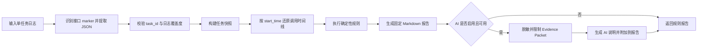

# 日志工具：设计、演进与搭建分享

> 本文基于 `log_filter_tool` 中 V1、V1.5、V2、V3、V4 PRD，V1.5 与 V4 开发设计，当前代码、部署配置和自动化测试整理。文中会区分“已经实现”和“仅完成产品设计”的能力。

## 1. 一句话介绍

日志工具最初用于从混杂、冗长的客户端日志中快速筛选某个接口的请求与响应，随后演进为接口统计工具，并进一步增加 People Insight 检索链路的专项分析能力：自动还原任务执行过程，以确定性规则检查路由、候选、社交资料、图片和成本，再输出带证据的 Markdown 报告。

## 2. 开发背景：为什么要做

客户端调试日志通常同时包含多个 HTTP 接口，请求头、请求体、响应头和响应体交错出现，还可能带有 Flutter 控制台前缀。测试人员为了排查一个接口，需要在大段日志里反复搜索 method、手工拼接请求与响应，再判断调用是否成功，效率低且容易遗漏。

第一版要解决的问题很直接：用户把日志粘贴到 Web 页面，工具自动提取所有 method，并按精确方法名过滤出对应的请求和响应日志块。

随着使用深入，单纯“找到日志”仍然不够：

- 测试人员还要人工计算请求数、响应数、成功率和未响应数，因此产生了 V1.5 的结构化统计需求。
- 汇总统计无法区分同一接口的多次调用，也不能明确哪个响应属于哪个请求，因此设计了 V2 单次请求链路。
- 即使能够看到单次链路，HTTP 失败、业务失败、超时、异常和无响应仍需人工分类，因此设计了 V3 失败分析。
- People Insight 检索是由 Agent、多条工作线和多个 Provider 组成的复杂流程，单个接口成功并不代表整个检索正确，因此 V4 转向专项链路分析。

## 3. 版本演进与真实交付状态

| 版本 | 要解决的问题 | 主要能力 | 当前状态 |
| --- | --- | --- | --- |
| V1 | 从长日志中快速找到指定接口 | 粘贴日志、提取 method、按 method 精确过滤请求和响应 | 已实现并保留 |
| V1.5 | 人工统计接口调用情况 | 解析日志块，提取 ID 和状态码，统计请求、响应、成功、失败、未响应及状态码分布 | 已实现 |
| V2 | 汇总统计看不到单次调用链路 | 按 `request_id`、`trace_id` 等关联请求与响应，计算耗时 | 仅有 PRD，未实现 |
| V3 | 单次链路仍需人工判断失败类型 | 分类 HTTP/业务失败、超时、异常、无响应，提取错误并给出建议 | 仅有 PRD，未实现 |
| V4 | People Insight 多工作线排查成本高 | 任务快照、时间线还原、确定性规则、成本核对、可选 AI 说明 | 已实现 |

这条演进路线体现了两个思路：通用能力保持轻量，复杂业务问题通过专项分析模块解决；规划文档与实际交付状态分开记录，避免范围失真。

## 4. 第一阶段：从日志过滤到接口统计

### V1：先解决“找得到”

V1 使用 Python + Flask 单体应用，用户不需要安装桌面客户端，也不需要数据库。核心流程是：

1. 接收用户粘贴的日志或加载默认样例。
2. 识别 `method=XXX` 和 `"method_name": "XXX"` 两类格式。
3. 根据日志边框拆分日志块；格式不完整时退化为逐行处理。
4. 按 method 精确匹配，避免选择 `GetTask` 时误包含 `GetTaskCandidateDetail`。
5. 保持原始顺序，返回相关请求与响应，并支持复制和导出。

### V1.5：再解决“看得懂整体情况”

V1.5 在过滤结果之上增加了结构化解析。每个日志块尽量提取：

- method、日志类型和原始文本；
- `request_id`、`trace_id`；
- HTTP 状态码和时间信息。

随后按 method 汇总请求次数、响应次数、成功数、失败数、未响应数、成功率和状态码分布。无法解析的日志会以降级方式保留原文，不因为单个异常块导致整个页面失败。

## 5. V2、V3 的设计价值与未落地边界

V2 设计了请求与响应的关联优先级：优先使用 `request_id`，其次使用 `trace_id`；字段不足时才根据 method、时间先后或日志距离推测，并必须把结果标记为“推测关联”。这能避免将不可靠关联伪装成确定事实。

V3 在单次调用之上设计了规则驱动的失败分类：

- HTTP 4xx/5xx；
- HTTP 成功但业务字段表示失败；
- 超时关键词或疑似超时；
- Exception、Traceback 等异常；
- 有请求但无响应；
- JSON 或日志边界不完整。

排查建议只用于缩小方向，不承诺给出唯一根因。由于 V2、V3 尚未进入当前实现，分享时应将它们描述为“演进设计和需求沉淀”，不能作为现有功能演示。

## 6. V4：为什么要做 People Insight 专项分析

People Insight 的正确性无法通过一个 HTTP 状态码判断。一次任务可能经历：任务创建和轮询、Local/LLM/Wiki/PDL 路由、Social Profile、图片反查、Face Comparison、候选合并、报告生成和 Provider 成本汇总。

原先测试人员需要手工查找 `task_id`、对齐 GetTask 终态、将倒序工具记录还原为时间线，再核对不同接口中的候选、诊断和成本。真实问题还包括：技术错误被误判为普通无结果、高成本 Provider 调用顺序不合理、社交资料未合并、图片语义混用、不同接口诊断不一致以及成本缺失等。

V4 的目标因此从“过滤某个接口”升级为“解释一个完整任务”：

1. 把同一任务的多接口日志转换为统一任务快照。
2. 按真实时间还原 Agent 和 Provider 调用链路。
3. 用固定规则检查路由、候选、社交、图片、状态和成本。
4. 每条判断提供可核对证据；证据不足时明确表示无法判断。
5. AI 只改善说明可读性，不参与确定性事实判断。

## 7. 当前整体架构

| 模块 | 文件 | 主要职责 |
| --- | --- | --- |
| 通用 Web 与日志过滤 | `app.py` | Flask 路由、日志块拆分、method 过滤、接口统计、导出、健康检查及平台安全接入 |
| People Insight 解析 | `people_search_analyzer.py` | 识别 Gateway/Flutter 与 QueryChainLogger 日志、提取跨行 JSON、选择单任务、生成统一快照和时间线 |
| 确定性规则与报告 | `people_search_rules.py` | 执行规则检查、形成 verdict、生成固定 Markdown 报告和脱敏 Evidence Packet |
| 可选 AI 说明 | `people_search_ai.py` | 读取 AI 配置、控制证据大小、调用模型、失败降级和附加 AI 说明 |
| 页面 | `templates/index.html` | 日志输入、method 过滤、统计展示、People Insight 分析、复制和导出 |
| 版本化分析说明 | `skills/people-search-log-analyzer/SKILL.md` | 约束 AI 的分析顺序、证据边界和输出结构 |

应用保持 Flask 单体结构，没有为专项分析引入复杂类体系或独立服务。生产环境使用 Gunicorn，通过 Docker 暴露 5001 端口。

## 8. 通用日志过滤运行流程


如果标准边框缺失，解析逻辑会退化为非空行处理；如果选择“全部”，则保持原始日志不变。整个过程只在当前请求内存中完成，不使用数据库。

## 9. People Insight 专项分析运行流程



首版一次只分析一个 People Insight 任务。检测到多个 `task_id` 时，不会把不同任务混合，而是返回任务列表并提示用户先过滤。分析开始前会检查 CreateIntentTask、GetTask、候选、Debug 和成本等证据覆盖度；缺少证据时给出“无法判断”，而不是推断接口未调用。

## 10. 确定性规则如何设计

当前实现包含 13 项规则检查，覆盖终态与状态一致性、Public Figure 路由、LLM 输出与截断、PDL fallback 和候选质量、Social Profile 队列、图片反查、Face Comparison 语义、候选一致性、成本一致性及停止原因。

规则结论被限制在四类：已确认正常、已确认异常、需要确认、无法判断。关键原则包括：

- HTTP 200 不等于业务成功。
- 单个工具报错不等于整个任务失败。
- 没看到调用记录前，必须先检查日志是否完整。
- Provider 返回候选不等于候选已通过质量门。
- `found_online` 不代表人物身份一致，也不代表盗图。
- 未执行 Face Comparison 时不能输出人脸相似结论。
- 成本为 0 且状态为 `UNPRICED` 时不能解释为免费。

固定报告包含总体结论、日志覆盖度、实际执行链路、Provider 与成本、正常项、异常项、需要确认项和证据不足项。

## 11. AI 的定位与降级策略

V4 采用“确定性规则优先，AI 可选”的方案：

1. 程序先完成结构化解析和规则判断。
2. 对任务快照、规则结果和证据进行脱敏，并限制最大字节数。
3. 只有显式启用并配置模型后，才调用 AI 生成简洁说明。
4. AI 不允许修改事实、规则结论或把“需要确认”升级为“已确认异常”。
5. AI 关闭、超时、HTTP 错误、非法 JSON 或空响应时，仍返回完整的固定规则报告。

因此，模型是报告表达层的增强项，而不是日志分析正确性的单点依赖。

## 12. 安全、部署与平台接入

- 日志在内存中处理，只有用户主动导出时才写入服务端固定目录。
- 客户端不能指定任意导出路径；容器内 `/exports` 映射到已配置的宿主机目录。
- API Key 不写入 Compose 明文，通过只读 secret 文件挂载。
- People Insight 规则分析默认开启，AI 默认关闭。
- 新旧路由统一支持平台 base path，并保留 CSRF 校验和审计上报。
- 服务对请求体设置容量边界；测试覆盖 10 MB 日志处理和 25 MB 超限拒绝。

## 13. 当前验证情况

项目测试按阶段覆盖了通用过滤、解析契约、任务快照、规则审计、Flask 页面与导出、AI 降级、安全脱敏、Docker 配置、大日志和历史回归样本。

本次整理时已运行：

```bash
python3 -m unittest discover -s tests -p 'test_*.py'
```

结果：**175 项测试全部通过**。

## 14. 关键设计取舍

- **单体应用继续演进**：复用 Flask、页面和现有日志输入，不为专项分析拆新服务。
- **通用过滤与专项分析并存**：原有 method 过滤不受影响，People Insight 使用独立入口和模块。
- **规则优先于模型**：可复现、可测试的判断写成程序规则，模型只负责解释。
- **不完整证据不强判**：将“异常”“需要确认”和“无法判断”分开，降低误报。
- **规划与实现分开**：V2、V3 的设计可以继续指导后续通用能力建设，但当前不伪装为已交付。

## 15. 后续可演进方向

1. 评估是否继续落地 V2 通用请求关联和 V3 通用失败分类。
2. 支持在一份日志中选择多个 task_id 分别分析，而不是要求用户预先过滤。
3. 随 People Insight 路由策略和 Provider 变化持续版本化规则集。
4. 对已标注样本持续做误报、漏报和规则覆盖回归。
5. 在不削弱证据边界的前提下改善报告摘要和问题定位效率。

## 16. 分享时可以强调的价值

日志工具的价值不只是“搜索日志”，而是逐步把排查过程中的重复劳动沉淀为结构化能力：V1 解决定位，V1.5 解决统计，V4 解决复杂业务链路的证据化判断。它保留原始日志供人工复核，同时把稳定、可重复的分析步骤交给程序规则执行，使测试结论更快、更一致，也更容易被开发和产品理解。

> 待补充：仓库没有记录人工排查耗时、实际使用人数、历史 Bug 命中数量等量化结果。如分享需要，可在此补入团队真实数据。
