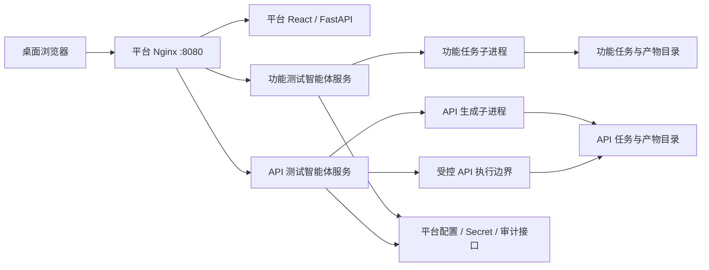

# AI 测试智能体独立接入测试开发平台 PRD

> 文档版本：V1.1  
> 创建日期：2026-08-12  
> 文档状态：已评审（第 21 章确认项已形成产品结论）  
> 修订记录：V1.1（2026-08-12）确认 MVP 排队策略、Review 方式、API 执行开关、任务保留策略、上传类型与上限、目标访问初始策略、API 用例文件优先保存、历史产物范围、模型信息展示和任务可见性  
> 源项目：`AItestcase_Agents`  
> 目标平台：`test-platform`  
> 接入对象：功能测试用例生成智能体、API 接口测试智能体  
> 推荐入口：`/functional-test-agent/`、`/api-test-agent/`  
> 方案定位：同仓库双服务、运行时独立、外围适配、渐进式安全隔离

相关现有文档：

- `AItestcase_Agents/README.md`：两个智能体的总体架构、运行方式和数据流；
- `AItestcase_Agents/docs/functional_test_requirement_decomposition_integration_design.md`：功能测试工作流接入需求拆解模块的设计；
- `test-platform/README.md`：平台身份、RBAC、配置、Secret、审计和部署边界；
- `test-platform/docs/Truthy_ApiAutoTest2接入PRD.md`：现有任务型工具的接入先例；
- `test-platform/docs/平台框架升级开发设计与计划.md`：平台工具分类和任务协议演进方向。

---

## 1. 文档目的

本文档定义 `AItestcase_Agents` 中两个测试智能体分别接入测试开发平台的产品需求和验收边界。

本次接入需要同时解决两个问题：

1. 两个智能体虽然位于同一代码仓库，但应在平台中具备独立入口、独立服务、独立配置、独立权限、独立任务和独立产物；
2. 在尽量不改变现有提示词、LangGraph 工作流、生成逻辑和产物格式的前提下，解决多用户并发、文件上传、输出隔离、长任务、依赖管理、敏感配置和动态脚本执行等平台化问题。

本文档作为产品需求基线，供后续详细设计、开发计划、接口设计、测试计划和上线评审使用。本期不直接规定所有内部类和文件的最终实现方式，但明确不可突破的功能、安全和兼容性边界。

---

## 2. 项目背景

### 2.1 当前系统

`AItestcase_Agents` 当前包含两个核心智能体：

| 智能体 | 当前职责 | 核心链路 |
|---|---|---|
| 功能测试用例生成智能体 | 基于需求文档生成测试点和功能测试用例 | 需求读取 → 需求拆解 → 测试点生成 → 覆盖检查与补齐 → 人工修改测试点（可选）→ 测试用例生成 → JSON/Markdown/Excel 输出 |
| API 接口测试智能体 | 基于 API 文档生成并执行接口测试 | API 文档解析 → 基础用例生成 → 覆盖补齐 → 可执行用例生成 → 预执行/执行 → 数据库保存 → 测试报告 |

两个智能体共同使用部分基础能力，包括：

- LLM 配置与模型客户端；
- LangChain、LangGraph 和 Pydantic；
- 公共工具、结果模型和部分运行时工具；
- 项目根目录 `.env`；
- 当前仓库的 Python 包导入路径；
- 当前工作目录下的 `output/` 产物结构。

### 2.2 当前主要问题

当前代码以本地脚本和单用户执行为主要使用方式，直接接入多用户 Web 平台存在以下问题：

1. 两个智能体没有稳定、独立的常驻 Web/API 服务入口；
2. 功能智能体通过进程级 `_tool_config` 保存 `project_name`、`module_id` 和 `thread_id`，并发任务可能互相覆盖；
3. 输入主要使用本地绝对路径，浏览器无法安全地直接提供服务器文件路径；
4. 输出目录依赖当前工作目录、项目名和模块名，任务之间可能复用或覆盖产物；
5. LLM 工作流可能运行数分钟，不适合由浏览器请求同步等待；
6. 当前入口大量使用控制台输出，缺少统一任务状态、结构化结果和产物协议；
7. 项目依赖声明未完整覆盖实际运行依赖，不利于构建可复现镜像；
8. LLM、数据库和目标环境凭证需要纳入平台 Secret 管理；
9. API 智能体会执行 LLM 生成的 Python 前后置脚本，仅设置超时不足以构成安全隔离；
10. 两个智能体虽然源码在一起，但平台用户需要把它们理解为两个用途、权限和风险等级不同的工具。

### 2.3 接入机会

测试开发平台已经具备以下可复用能力：

- React + TypeScript 桌面工作台；
- FastAPI 平台控制面；
- PostgreSQL 和 Alembic 工具目录；
- Nginx 统一入口与子路径代理；
- 登录会话、RBAC 和工具级权限；
- 普通配置、加密 Secret、配置 Release；
- 工具 Client Token 和内部配置读取接口；
- 审计事件接收能力；
- 独立工具容器、健康探测和统一不可用页面；
- 已有任务型工具的任务、日志、取消和产物展示经验。

因此，两个智能体可在保持源码同仓的同时先完成运行时独立，再根据稳定运行情况决定是否物理拆分仓库。

---

## 3. 产品目标

### 3.1 总体目标

将两个智能体作为两个独立工具接入测试开发平台：

```text
测试开发平台
├── 功能测试智能体
│   ├── 需求拆解
│   ├── 测试点生成与人工 Review
│   └── 功能测试用例生成
└── API 测试智能体
    ├── API 文档解析
    ├── API 测试用例生成
    └── 受控 API 测试执行与报告
```

### 3.2 成功标准

- 平台首页分别展示“功能测试智能体”和“API 测试智能体”两个工具卡片；
- 两个工具具有独立的 URL、容器、健康状态、权限、配置、Secret、任务目录和产物目录；
- 停止任一智能体服务不影响平台和另一智能体；
- 用户可上传文档并创建异步任务，无需填写服务器本地路径；
- 创建任务后立即获得任务 ID，浏览器不需要同步等待 LLM 工作流完成；
- 功能智能体完整保留“只生成测试点 → 人工修改 → 继续生成测试用例”的流程；
- API 智能体完整保留“解析 → 生成 → 执行 → 报告”能力，但生成和实际执行使用不同权限和隔离级别；
- 每个任务的输入、日志、状态和产物互相隔离，不发生跨用户或跨项目覆盖；
- 保持现有核心提示词、工作流和输出格式兼容，不因接入平台改变用例设计语义；
- 两个智能体仍可在平台之外通过原有脚本方式独立运行；
- 当前自动化测试基线全部通过，并补充服务入口、任务隔离和端到端测试；
- 平台只暴露统一网关端口，两个服务端口不直接暴露给宿主机或外部网络；
- API 动态脚本只能在受控执行边界内运行，不能访问平台数据库、其他工具 Secret 或未经允许的目标网络。

### 3.3 交付物

- 功能测试智能体薄 Web/API 适配服务；
- API 测试智能体薄 Web/API 适配服务；
- 两套独立任务与产物管理能力；
- 两套平台工具目录、Nginx 路由、Compose 服务和权限定义；
- 两套配置、Secret 与审计接入能力；
- 功能测试智能体桌面工作台页面；
- API 测试智能体桌面工作台页面；
- 新增自动化测试、部署说明、回滚说明和安全验收记录；
- 后续物理拆分源码仓库的评估结论，不要求首期完成物理拆分。

### 3.4 非目标

本期明确不包含：

- 立即将两个智能体拆成两个 Git 仓库；
- 重写 LangGraph 工作流或替换 LangChain；
- 重做现有提示词体系；
- 改变现有 JSON、Markdown、Excel 或 API 报告的业务字段含义；
- 建设通用低代码 Agent 编排平台；
- 引入 Redis、Celery、Kafka 或 Kubernetes 作为 MVP 前置条件；
- 多实例并行调度和水平扩容；
- 在线编辑智能体 Prompt；
- 自动将生成用例提交到 Git、测试管理系统或 CI/CD；
- 移动端和窄屏适配；
- 对现有功能做与平台接入无关的重构或顺便优化。

---

## 4. 用户与权限

### 4.1 目标用户

| 用户 | 主要诉求 |
|---|---|
| 测试工程师 | 上传需求或 API 文档，生成测试点和测试用例，下载产物 |
| 测试开发工程师 | 配置运行环境，查看工作流日志，执行 API 测试，分析失败 |
| 测试负责人 | 查看任务结果、质量门禁、用例产出和审计记录 |
| 平台管理员 | 管理工具权限、模型配置、Secret、运行限制和服务状态 |
| 只读用户 | 查看已授权任务和产物，不创建或执行任务 |

### 4.2 权限模型

复用平台现有通用权限，并增加必要的高风险动作区分。

| 权限 | 功能测试智能体 | API 测试智能体 |
|---|---|---|
| `tool.view` | 查看工具与任务 | 查看工具与任务 |
| `tool.execute` | 创建生成任务、继续 Review 任务 | 创建解析和用例生成任务 |
| `tool.result.view` | 查看和下载产物 | 查看和下载生成产物、报告 |
| `tool.config.manage` | 管理普通配置 | 管理普通配置 |
| `tool.secret.manage` | 管理 LLM Secret | 管理 LLM、数据库与环境 Secret |
| `api-test-agent.execute` | 不适用 | 真实发送 API 请求并执行动态脚本 |
| `task.cancel` | 取消运行任务 | 取消运行任务 |

权限要求：

- 拥有 API 用例生成权限不等于拥有真实执行权限；
- API 执行页面和接口必须同时校验 `tool.execute` 与 `api-test-agent.execute`；
- 只读用户不得通过直接调用 API 绕过页面权限；
- Nginx 清除浏览器提供的 `X-Platform-*` 请求头，仅注入平台鉴权产生的可信身份头；
- 工具服务的任务记录必须保存创建者用户 ID 和用户名快照，用于结果可见性与审计。

### 4.3 任务可见性

MVP 默认规则：

- 普通用户只能查看自己创建的任务及其产物；
- 测试负责人或管理员可查看工具范围内全部任务；
- 任务详情、日志和产物接口执行同一套可见性校验；
- 不允许仅凭可猜测的任务 ID 下载其他用户产物。

上述规则已确认为 MVP 正式产品规则，不提供同项目成员自动共享。后续如需协作共享，应增加显式授权或分享机制，不扩大默认可见范围。

---

## 5. 总体方案

### 5.1 方案原则

采用“同仓库双服务、运行时独立”的方式：

- 保留 `AItestcase_Agents` 作为源码仓库；
- 两个服务分别构建镜像、启动进程和挂载数据目录；
- 公共代码只保留一份，避免首期复制后产生版本漂移；
- 两个 Web/API 适配层只负责输入校验、任务调度、状态记录、日志、产物登记和平台协议适配；
- 智能体核心工作流仍由原模块执行；
- 每个任务使用独立子进程和独立工作目录；
- API 的真实网络执行进一步放入受限执行边界。

### 5.2 目标架构



### 5.3 工具注册建议

| 字段 | 功能测试智能体 | API 测试智能体 |
|---|---|---|
| 工具 ID | `functional-test-agent` | `api-test-agent` |
| 名称 | 功能测试智能体 | API 测试智能体 |
| 入口 | `/functional-test-agent/` | `/api-test-agent/` |
| 分类 | `ai-testing` | `ai-testing` |
| 短码 | `FT AI` | `API AI` |
| 健康地址 | `http://functional-test-agent:<port>/functional-test-agent/health` | `http://api-test-agent:<port>/api-test-agent/health` |
| 核心特性 | 需求拆解、测试点、功能用例 | API 解析、用例生成、受控执行 |

端口号由详细设计根据现有 Compose 占用情况确定，不在 PRD 中固化。

### 5.4 源码独立策略

本期不移动现有核心目录，建议形成如下逻辑边界：

```text
AItestcase_Agents/
├── agents/
│   ├── functional_test/       # 功能智能体核心
│   ├── api_test/              # API 智能体核心
│   └── common/                # 当前共享能力
├── requirement_decomposition/ # 功能智能体依赖
├── prompts/                   # 需求拆解 Prompt
└── services/                  # 新增薄服务层，具体结构由详细设计确定
    ├── functional_agent_web/
    └── api_agent_web/
```

物理拆仓应满足第 16 章的触发条件后另立项目，不作为本期验收项。

---

## 6. 通用任务协议

### 6.1 任务状态机

```text
pending → running → waiting_review → running → succeeded
   │          │            │          │
   └──────────┴────────────┴──────────┴→ failed
              │            │
              └────────────┴────────────→ cancelled
```

状态说明：

| 状态 | 含义 |
|---|---|
| `pending` | 已接受任务，等待子进程启动 |
| `running` | 智能体工作流正在运行 |
| `waiting_review` | 已生成可编辑中间产物，等待用户确认或上传修改版本 |
| `succeeded` | 当前目标完成，最终产物已登记 |
| `failed` | 启动、工作流或产物登记失败 |
| `cancelled` | 用户取消或系统确认执行进程已终止 |

状态流转必须原子保存。任务达到终态后，不得被迟到的子进程退出码覆盖。

### 6.2 通用接口

两个服务在各自基础路径下实现一致的接口语义：

| 方法 | 路径 | 说明 |
|---|---|---|
| `POST` | `{BASE}/api/v1/tasks` | 创建任务 |
| `GET` | `{BASE}/api/v1/tasks` | 分页查询任务 |
| `GET` | `{BASE}/api/v1/tasks/{task_id}` | 获取任务详情 |
| `POST` | `{BASE}/api/v1/tasks/{task_id}/cancel` | 取消任务 |
| `POST` | `{BASE}/api/v1/tasks/{task_id}/resume` | 以 Review 产物继续任务 |
| `GET` | `{BASE}/api/v1/tasks/{task_id}/logs` | 获取脱敏日志 |
| `GET` | `{BASE}/api/v1/tasks/{task_id}/artifacts` | 查询产物清单 |
| `GET` | `{BASE}/api/v1/tasks/{task_id}/artifacts/{artifact_id}` | 下载单个产物 |
| `GET` | `{BASE}/health` | 服务健康检查 |

### 6.3 创建任务响应

创建任务成功后立即返回 HTTP `202`：

```json
{
  "id": "task_20260812_xxxx",
  "agent_type": "functional",
  "operation": "generate_test_points",
  "status": "pending",
  "created_at": "2026-08-12T10:00:00+08:00"
}
```

不得让创建任务请求同步等待 LLM 完成。

### 6.4 任务数据模型

任务至少记录：

- `id`；
- `agent_type`；
- `operation`；
- `status`；
- `created_by_user_id`、`created_by_username`；
- `project_id`、`module_id`；
- `environment`；
- 输入文件元数据，不保存浏览器伪造的本地路径；
- `config_release_id` 和配置版本；
- Prompt/模型标识；
- 创建、开始、结束时间；
- 当前阶段；
- 结果摘要；
- 稳定错误码和脱敏错误摘要；
- 产物清单；
- 子进程信息仅保存在服务端，不返回进程敏感细节。

### 6.5 任务存储

MVP 可使用文件级任务存储，但必须满足：

- 一个任务一个目录；
- JSON 使用同目录临时文件加原子替换写入；
- 同一服务内的并发读写使用互斥保护；
- 服务重启时将遗留的 `pending/running` 任务恢复为明确失败状态，错误码为 `WORKER_INTERRUPTED`；
- 任务 ID 使用不可预测的随机部分并校验固定格式；
- 任务摘要默认保留 180 天；输入、日志和产物默认保留 90 天；
- 每个智能体最多保留 500 个已结束任务，时间和数量条件取先到者；
- `pending`、`running` 和 `waiting_review` 任务不参与自动清理；
- 产物到期后保留任务摘要、结果统计、错误码、配置版本和产物过期标记，页面仍可查看任务历史，但不再承诺下载已清理文件；
- 清理前 7 天在任务详情展示产物即将到期提示；
- 保留天数、最大数量和预警天数均为普通配置，可由管理员调整；
- 清理任务文件时同步处理任务专属输入、日志和产物，不影响审计日志的独立保留策略；
- 不删除仍在运行或处于 `waiting_review` 的任务；
- 后续迁移平台任务中心时保持 API 语义兼容。

MVP 的完整任务内容不是天然永久保存在平台 PostgreSQL。平台数据库当前主要保存身份、权限、配置、Secret、审计和工具目录；智能体任务记录与大文件产物由各自服务保存。后续接入平台统一任务中心时，可将任务摘要迁入数据库，文件产物仍需独立对象存储或文件存储。

---

## 7. 通用输入、日志与产物需求

### 7.1 文件上传

用户通过浏览器上传需求或 API 文档。服务端必须：

- 校验扩展名、MIME 类型、实际大小和空文件；
- 功能测试智能体 MVP 支持 `.md`、`.txt`；
- API 测试智能体 MVP 支持 `.md`、`.txt`、`.json`、`.yaml`、`.yml`，其中 JSON/YAML 作为文本型 API/OpenAPI 文档交给现有解析链路处理；
- 单文件最大 5 MiB，解码后的文本最多 500,000 个字符，任一限制超出即拒绝；
- 每个任务 MVP 只接收一个主文档；粘贴文本同样受 500,000 字符限制；
- 文件必须可按 UTF-8 解码；是否增加编码自动识别由详细设计评估，但不得静默产生乱码；
- 不得因扩展名存在就默认支持 PDF、Word 或图片；新增类型需另行验证解析链路；
- 使用服务端生成的文件名保存，不直接使用用户文件名作为磁盘路径；
- 原始文件名仅作为经过转义的展示元数据；
- 保存到 `tasks/<task_id>/input/`；
- 禁止 `..`、绝对路径、符号链接和路径穿越；
- 配置单文件和单任务总大小上限；
- 任务失败时保留输入的期限由保留策略控制。

### 7.2 任务目录

建议逻辑结构：

```text
data/<agent>/tasks/<task_id>/
├── task.json
├── input/
├── work/
├── output/
├── console.log
└── artifacts.json
```

适配层以任务目录作为子进程工作目录，使原有相对 `output/` 行为自然落入任务隔离空间。原智能体显式写入仓库固定目录的地方，由详细设计采取最小改动参数化处理。

### 7.3 日志

- 子进程标准输出和标准错误合并写入任务 `console.log`；
- 前端默认查看尾部日志，支持手动加载更多，不一次返回无限大文件；
- 日志接口只返回 UTF-8 安全文本和服务端生成的游标；
- 展示前执行二次脱敏，覆盖 API Key、Token、Cookie、Authorization、数据库密码和常见连接串；
- 不向前端展示平台 Client Token、Secret 明文、完整环境变量、容器绝对路径或 Python traceback 全文；
- `waiting_review`、失败步骤和终态必须在日志中有稳定事件标记；
- 页面日志使用等宽字体，提供复制和自动滚动开关；
- 日志不是最终结果来源，结果以结构化任务记录和产物为准。

### 7.4 产物

每个产物至少包含：

- `artifact_id`；
- 类型，如 `requirements_json`、`test_points_json`、`test_cases_json`、`test_cases_xlsx`、`api_report_json`；
- 文件名；
- 大小；
- 创建时间；
- SHA-256；
- 所属阶段；
- 是否为 Review 输入或最终产物；
- 下载权限。

下载接口不得接受任意文件系统路径，只允许按任务已登记的 `artifact_id` 获取文件。

---

## 8. 功能测试智能体需求

### 8.1 工具首页

工具首页按照“新建任务 → 等待 Review → 最近任务”的顺序组织，至少包含：

- 工具名称与简短说明；
- “新建功能测试任务”主操作；
- 当前运行任务和待 Review 任务提示；
- 最近任务列表；
- 服务状态和配置就绪提示；
- 返回测试开发平台入口。

不使用聊天框作为唯一入口。核心参数应使用结构化表单，智能体自然语言输入可作为可选补充说明。

### 8.2 支持操作

| `operation` | 输入 | 输出 | 终态 |
|---|---|---|---|
| `decompose_requirement` | 需求文档、项目、模块 | 结构化 Requirement、质量报告、test seed | `succeeded` 或 `failed` |
| `generate_test_points` | 需求文档、项目、模块 | 测试点 JSON/Markdown | `waiting_review` |
| `generate_test_cases` | 需求文档或已确认测试点 | 测试用例 JSON/Excel | `succeeded` |
| `full_pipeline` | 需求文档、项目、模块 | 测试点、测试用例、拆解产物 | 默认在测试点阶段进入 `waiting_review` |

MVP 优先实现 `generate_test_points`、`generate_test_cases` 和带人工门禁的 `full_pipeline`。

### 8.3 新建任务表单

| 字段 | 必填 | 说明 |
|---|---|---|
| 项目名称/ID | 是 | 用于任务归属和产物展示，不直接作为未经校验的目录名 |
| 模块名称/ID | 是 | 用于模块归属和输出元数据 |
| 需求文档 | 是 | 上传文件或粘贴文本二选一 |
| 操作类型 | 是 | 生成测试点、生成用例、完整流程 |
| 功能名称 | 否 | 用于需求拆解子目录和结果标题 |
| 补充说明 | 否 | 传给 Agent 的受控自然语言上下文 |
| 环境 | 是 | 默认 `dev`，用于选择配置 Release |

页面不得允许用户填写任意服务器输出路径或需求文件绝对路径。

### 8.4 测试点 Review

测试点生成成功后，任务进入 `waiting_review`。页面必须提供：

- 测试点数量、覆盖检查摘要和需求拆解质量摘要；
- 下载原始测试点 JSON；
- 上传修改后的测试点 JSON；
- 对上传内容进行 JSON 结构校验；
- 展示校验错误所在项和原因；
- 确认后继续生成测试用例；
- 放弃/取消任务；
- 保留原始测试点和人工修改版本，禁止覆盖原文件；
- 在任务记录中保存 Review 人、时间和文件 SHA-256。

MVP 不要求实现复杂的在线表格编辑器。优先采用“下载 JSON → 本地修改 → 上传确认”，降低改造和数据丢失风险。后续可另立需求增加在线编辑。

### 8.5 结果摘要

功能任务详情至少展示：

- 当前阶段和状态时间线；
- 需求拆解数量；
- 测试点数量；
- 测试用例数量；
- 质量门禁状态；
- 未确认、冲突或不确定项数量；
- 产物列表；
- 失败阶段与脱敏错误摘要。

所有数字必须来自真实产物或结构化工作流结果，不允许使用前端估算值。

### 8.6 兼容性要求

- 保留现有 `generator_test_points` 和 `generator_case` 的业务行为；
- 保留需求拆解缓存复用语义，但缓存限定在当前任务目录内；
- 保留当前测试点和用例 JSON 字段；
- 保留 Excel 产物；
- 平台接入不得改变现有命令行入口的参数和默认行为；
- 服务层不得依赖模块级 `_tool_config` 实现多任务并发；MVP 通过单任务子进程隔离保持原调用方式，后续再改为显式上下文。

---

## 9. API 测试智能体需求

### 9.1 工具首页

工具首页至少包含：

- “生成 API 测试用例”主入口；
- “执行 API 测试”高风险入口，仅对有权限用户展示；
- 当前运行状态；
- 最近生成任务与执行任务；
- 环境配置就绪状态；
- 目标访问策略提示；
- 报告入口；
- 返回测试开发平台入口。

### 9.2 支持操作

| `operation` | 风险级别 | 输入 | 输出 |
|---|---|---|---|
| `parse_api_document` | 低 | API 文档 | 结构化 API 信息 |
| `generate_api_cases` | 中 | API 文档、环境元数据 | 基础用例和可执行用例 |
| `execute_api_cases` | 高 | 已生成用例、目标环境 | 执行结果和报告 |
| `full_pipeline` | 高 | API 文档、目标环境 | 解析、生成、执行和报告 |

MVP 默认开放解析和生成。API 实际执行首期默认关闭；即使代码具备执行入口，生产和 dev 的默认功能开关也必须为关闭。只有第 14.3 节安全门禁通过、目标允许列表已配置并完成单独评审后，才能通过新版本配置显式启用。

### 9.3 新建生成任务表单

| 字段 | 必填 | 说明 |
|---|---|---|
| 项目名称/ID | 是 | 任务归属 |
| 模块名称/ID | 是 | 任务归属 |
| API 文档 | 是 | 上传文件或粘贴文本 |
| 测试环境 | 是 | 选择平台登记的环境，不直接输入 Secret |
| Base URL | 条件必填 | 优先来自配置；允许有权限用户选择登记值，不允许任意内网地址 |
| Application | 否 | 保留当前 `test_env` 语义 |
| Client Type | 否 | 保留当前 `test_env` 语义 |
| 额外信息 | 否 | 项目和模块等结构化元数据 |
| 生成后是否申请执行 | 否 | 默认关闭；打开时仍需独立权限和确认 |

### 9.4 生成结果

生成任务详情至少展示：

- 解析出的接口数量；
- 基础用例数量；
- 可执行用例数量；
- 被禁用或预执行不通过的用例数量；
- 覆盖补齐轮次；
- 产物列表；
- 文件保存结果；如管理员显式启用了可选数据库写入，则额外展示数据库保存结果；
- 失败步骤与脱敏错误摘要。

### 9.5 执行确认

真实执行前必须显示确认界面，明确：

- 目标环境与 Base URL；
- 预计执行用例数量；
- 是否包含写操作或清理脚本；
- 使用的配置 Release；
- 数据库连接配置名称，不显示密码；
- 动态脚本执行风险提示；
- “执行将向目标环境发送真实请求”的明确说明。

用户需要主动确认，不得因“生成后执行”勾选而绕过最终确认。

### 9.6 执行结果

执行详情优先展示：

- 状态；
- 开始时间和耗时；
- 环境和目标；
- 总数、通过、失败、错误、跳过；
- 通过率；
- 失败用例和错误摘要；
- 请求方法、经过脱敏的 URL、状态码；
- 日志和报告产物；
- 重试入口，重试创建新任务而非覆盖原任务。

状态不能只依赖颜色，必须同时展示文本或图标。

### 9.7 数据库配置

- MVP 采用“文件产物优先、数据库写入可选”的策略；无数据库配置时仍必须能够完成 API 文档解析、用例生成和文件下载；
- API 用例生成默认不强制写入数据库，避免把当前数据库结构固化为长期用例资产模型；
- 可选数据库写入通过普通配置开关启用，默认关闭；启用后数据库失败不得删除已经成功生成的文件产物，但任务应明确标记“生成成功、数据库保存失败”；
- 前端不得提交数据库密码；
- 数据库配置由平台 Secret 和普通配置组合提供；
- 任务记录保存配置 Release ID，不保存 Secret 明文；
- API 智能体只获得当前环境、当前工具范围内所需的 Secret；
- 禁止使用代码中的默认生产密码；
- 仅当任务选择了数据库写入而数据库配置缺失时，任务在写入前返回或记录稳定错误码 `CONFIG_NOT_READY`；纯文件生成不受影响；
- 数据库连接失败信息必须脱敏，不得返回完整 DSN。

### 9.8 动态脚本兼容性

保留现有 setup/teardown 脚本能力，但执行边界必须满足：

- 生成阶段可进行语法校验，不在 Web 服务主进程中执行脚本；
- 实际执行在独立受限进程或执行容器内完成；
- 设置单脚本、单用例和整任务超时；
- 限制 CPU、内存、进程数和可写目录；
- 使用非 root 用户；
- 根文件系统只读，仅任务工作目录可写；
- 删除不必要的 Linux capabilities；
- 不挂载 Docker Socket、平台 KEK、平台数据库凭证或其他工具目录；
- 网络只允许平台配置批准的测试目标及必要的 DNS；
- 执行结果和日志回传前进行脱敏；
- 取消任务时终止完整进程组。

仅使用 Python `exec()` 超时不能被视为通过该安全门禁。

---

## 10. 平台集成需求

### 10.1 工具目录

通过 Alembic 迁移确定性写入两个工具定义。升级和降级必须可验证，不允许由应用启动时临时插入生产数据。

### 10.2 Nginx 路由

新增两个子路径：

```text
/functional-test-agent/
/api-test-agent/
```

每条路由必须：

- 执行平台 `auth_request`；
- 设置正确的 `$platform_tool_id`；
- 清除浏览器伪造的身份头；
- 注入可信平台身份和权限头；
- 转发 `X-Forwarded-Prefix`；
- 对 401、403、鉴权服务异常和工具服务异常使用平台既有处理；
- 不用超长 `proxy_read_timeout` 代替异步任务；
- 禁止两个工具服务端口直接暴露给宿主机。

### 10.3 Compose

新增两个独立服务和独立数据卷或宿主机目录：

- `functional-test-agent`；
- `api-test-agent`；
- 如详细设计确认需要，增加只用于 API 实际执行的隔离服务；
- 两套服务使用独立 Client Token；
- 两套服务具有独立健康检查；
- 两套输出目录不得互相挂载为可写；
- 公共源码可来自同一构建上下文，但运行用户、命令和数据卷必须独立；
- 平台模式与本地独立模式不得同时写同一任务或产物目录。

### 10.4 配置和 Secret

建议登记以下配置类别，具体键名在详细设计中确认：

功能测试智能体：

- 模型名称、Base URL；
- 工作流超时；
- 最大上传大小；
- 任务保留数量/天数；
- 测试用例生成批大小；
- 覆盖矩阵开关；
- Prompt 版本只读标识；
- LLM API Key（Secret）。

API 测试智能体：

- 模型名称、Base URL；
- 工作流和执行超时；
- 最大上传大小；
- 任务保留策略；
- 允许的目标域名、端口和 CIDR 策略；
- API 实际执行功能开关，默认 `false`；
- API 用例数据库写入开关，默认 `false`；
- 默认 Application 和 Client Type；
- LLM API Key（Secret）；
- 测试数据库账号密码（Secret）；
- 目标环境 Token/Cookie（Secret）。

配置生效遵循平台 Release 机制。每个任务记录创建时的 Release ID，运行中不得被新发布配置改变。

两个智能体的默认保留配置为：任务摘要 180 天、输入/日志/产物 90 天、每个智能体最多 500 个已结束任务、到期前 7 天预警。

### 10.5 审计

至少记录：

- 创建、继续、取消、重试任务；
- 上传 Review 文件；
- 下载产物；
- API 实际执行确认；
- 配置/Secret 使用版本；
- 任务成功和失败；
- 权限拒绝；
- 目标策略拒绝。

审计元数据不得包含上传文档全文、Prompt 全文、Secret 明文、请求完整 Header 或响应敏感正文。

---

## 11. 页面与交互需求

### 11.1 设计原则

页面面向桌面端测试工程师，遵循现有平台设计系统：

- 以状态和内容为中心，不采用营销式大 Hero；
- 一个页面只保留一个主要任务；
- 重要信息按“当前状态 → 下一步操作 → 细节”排列；
- 使用现有系统字体、颜色、间距和组件，不新增第二套设计系统；
- 卡片只用于真实内容分组，任务列表和产物优先使用表格或分隔列表；
- 日志、JSON 和命令使用等宽字体；
- 动画仅用于状态变化，并适配 `prefers-reduced-motion`。

### 11.2 页面结构

两个工具均包含：

1. 概览/新建任务；
2. 任务列表；
3. 任务详情；
4. 配置就绪状态；
5. 产物与日志。

功能智能体额外包含测试点 Review 区；API 智能体额外包含执行确认与报告区。

### 11.3 任务列表

- 列包括：任务 ID、操作、项目/模块、创建者、状态、阶段、创建时间、耗时和结果摘要；
- 支持按状态、操作和创建者筛选；
- 默认按创建时间倒序；
- 长文本截断后可查看完整内容；
- 明确提供加载态、空态和错误态；
- 有未终态任务时轮询，终态后停止轮询；
- 不使用虚假进度百分比。若工作流没有可靠进度，只展示阶段和已完成步骤。

### 11.4 任务详情

页面顶部展示：

- 当前状态；
- 当前阶段；
- 下一步操作；
- 创建/开始时间和耗时；
- 环境与配置版本；
- 取消、继续、重试或下载等适用动作。

普通用户可在任务详情“生成信息”区域查看本任务实际使用的模型名称、模型版本/标识、Prompt 版本、配置 Release 版本和创建时间。页面不得展示 Prompt 全文、模型 API Key、Base URL 中的敏感查询参数或内部调试配置。

下方按顺序展示结果摘要、失败信息、产物、日志和技术元数据。失败信息需固定展示失败阶段、稳定错误码、摘要和时间戳。

### 11.5 高风险操作

- 取消任务前明确说明会终止当前工作流；
- API 实际执行必须二次确认；
- 删除历史任务如后续提供，必须说明会删除输入、日志和产物；
- 不可撤销操作不得只依赖图标表达。

### 11.6 可访问性

- 桌面验收视口为宽度 1280px 及以上；
- 所有交互控件支持键盘访问并有清晰焦点；
- 图标按钮具有可访问名称；
- 状态除颜色外同时提供文本、图标或形状；
- 正文与背景满足 WCAG AA 对比度；
- 对话框支持 Esc 关闭、焦点循环和关闭后的焦点恢复；
- 日志自动滚动可暂停，不影响键盘用户查看历史内容。

---

## 12. 兼容性与“不影响原功能”方案

### 12.1 核心原则

平台化改动优先位于外围服务层。现有核心工作流的输入输出通过适配器转换，原脚本入口继续可用。

### 12.2 问题与低影响方案

| 当前问题 | MVP 解决方案 | 对原功能影响 |
|---|---|---|
| `_tool_config` 为进程全局变量 | 每任务独立子进程，单进程只运行一个任务 | 原调用方式保持不变 |
| 浏览器不能提供本地路径 | 上传后保存到任务输入目录，再把容器内绝对路径传给原入口 | 原文档读取逻辑保持不变 |
| 输出目录可能冲突 | 每任务独立工作目录；必要的固定路径做最小参数化 | 产物内容和格式不变 |
| 工作流运行时间长 | HTTP `202 + task_id`，后台运行，前端轮询 | 工作流内部不变 |
| 返回主要是字符串和控制台日志 | 外层登记任务摘要、日志和文件；不要求首期重写全部返回值 | 原输出继续保留 |
| 依赖未完整声明 | 按当前可运行环境整理并锁定版本，不主动升级 | 避免版本变化造成行为漂移 |
| Secret 在 `.env` | 平台 Secret 在运行时注入同名环境变量 | `settings.py` 读取语义保持兼容 |
| API 动态脚本执行 | 保留能力，移动到受控执行边界 | 测试语义保留，访问范围受控 |

### 12.3 不允许的兼容方式

- 不得让两个 Web 服务共享同一个可写输出目录；
- 不得通过全局 `chdir` 在同一进程并发运行多个任务；
- 不得为了兼容而允许浏览器提交任意绝对路径；
- 不得将平台数据库或 Secret 目录直接挂载给 API 执行进程；
- 不得用无限增大 Nginx 超时替代异步任务；
- 不得复制公共代码到两个目录后分别修改而缺少同步机制；
- 不得删除 API 动态脚本功能来规避安全设计，除非后续产品明确决定下线该能力。

---

## 13. 非功能需求

### 13.1 性能与容量

- 创建任务接口在不包含文件上传耗时的情况下目标响应时间小于 2 秒；
- 任务查询接口目标响应时间小于 1 秒；
- 日志尾部查询不得读取完整大文件后再截断；
- MVP 每个智能体同一时间最多运行一个任务，其他任务进入该智能体独立的小队列；
- 队列上限必须可配置，建议默认等待 5 个任务；超过上限时返回 `TASK_QUEUE_FULL`，不得无限积压；
- 功能测试智能体与 API 测试智能体使用不同队列，一个服务的积压不阻塞另一个服务；
- 处于 `waiting_review` 的任务不占用运行槽位，但受任务保留策略保护；
- API 实际执行与 API 用例生成分别计算并发限制；
- 上传大小和文本字符上限必须可配置，MVP 默认分别为 5 MiB 和 500,000 字符。

### 13.2 可靠性

- 任务状态采用原子写入；
- 服务重启可识别遗留任务；
- 单个任务失败不导致 Web 服务退出；
- 任一智能体服务异常不影响另一智能体和平台；
- 健康检查不调用 LLM、数据库或目标测试环境；
- 产物登记失败与智能体工作流失败使用不同错误码。

### 13.3 可观测性

- 每个请求和日志事件关联 `request_id`、`task_id`；
- 记录任务排队、启动、阶段切换、终止和产物登记事件；
- 指标至少包括任务数量、成功/失败/取消数量、运行耗时和当前运行任务；
- 不把 Prompt 或用户文档全文写入普通运行日志；
- LLM 调用失败需区分超时、鉴权、限流、响应解析和质量门禁失败。

### 13.4 可维护性

- 两个服务共享的任务存储和安全工具应保持单一实现；
- 业务适配器分别依赖各自智能体模块，禁止功能服务导入 API 执行模块；
- 新增代码包含清晰中文注释，复杂接口说明参数、返回值和异常策略；
- 不无理由新增 Web 框架、任务队列或前端设计依赖；
- 依赖版本锁定并在镜像构建中可复现。

---

## 14. 安全需求

### 14.1 通用安全

- 全部页面和 API 经过平台鉴权；
- 对创建、继续、取消、下载和执行操作实施服务端权限校验；
- 文件名、项目名和模块名不能直接形成未清洗路径；
- 所有错误信息和日志经过脱敏；
- Secret 永不在页面回显；
- 任务记录不保存 Secret 明文；
- 上传文件不可作为可执行代码直接运行；
- 下载接口防止 IDOR 和目录越界；
- 两个服务使用非 root 用户；
- 容器不挂载 Docker Socket。

### 14.2 API 目标访问策略

API 执行前必须校验最终目标，包括重定向后的地址：

- 只允许平台配置登记的协议、域名/IP、端口；
- 默认禁止回环地址、链路本地地址、云元数据地址和平台内部服务网段；
- DNS 解析结果也必须经过策略校验，防止 DNS Rebinding；
- 重定向不得跳出允许范围；
- 目标策略失败时不发送请求，并记录审计事件；
- 如测试环境确实位于私网，应由管理员显式登记精确范围，不使用全私网放行作为默认值。

MVP 初始允许域名、端口和私网范围均为空，因此 API 实际执行保持关闭。管理员后续提供真实测试目标后，必须先登记精确协议、域名/IP、端口和必要 CIDR，再进行安全验证；未配置目标时只允许 API 文档解析和用例生成。

### 14.3 动态代码执行门禁

在以下条件全部通过前，平台不得开放 `execute_api_cases` 和 API `full_pipeline`：

- 执行进程/容器隔离已验证；
- 文件系统和用户权限限制已验证；
- 网络允许列表已验证；
- 资源限制与超时已验证；
- Secret 最小授权已验证；
- 取消完整进程组已验证；
- 日志二次脱敏已验证；
- 恶意 setup/teardown 样例测试已通过；
- 平台数据库、KEK、Client Token 和其他工具数据不可达；
- 安全评审书面批准。

---

## 15. 分阶段交付

### 15.1 阶段一：双工具 MVP

范围：

- 同仓库构建两个独立 Web/API 服务；
- 两个平台工具卡片和子路径；
- 文件上传、异步任务、状态、取消、日志、产物；
- 功能智能体测试点 Review 和用例生成闭环；
- API 文档解析和用例生成；
- 独立配置、Secret、权限和审计；
- API 实际执行入口保持关闭或仅限开发验证环境。

阶段完成标准：功能智能体全流程和 API 生成流程可由平台稳定使用，且不改变命令行行为。

### 15.2 阶段二：API 受控执行

范围：

- 隔离执行边界；
- 目标允许列表；
- 执行二次确认；
- 独立执行权限；
- 报告展示；
- 恶意脚本和网络边界安全测试。

阶段完成标准：第 14.3 节全部安全门禁通过，并在受控测试环境完成端到端验收。

### 15.3 阶段三：并发与平台任务中心

可选范围：

- 将模块级配置改为显式任务上下文；
- 增加可配置并发；
- 迁移到平台统一任务中心；
- 增加在线测试点编辑；
- 增加成本、Token、Prompt 版本和模型质量统计；
- 评估引入队列系统。

### 15.4 阶段四：源码物理拆分评估

是否拆成两个仓库由第 16 章指标决定，不作为前述阶段的强制依赖。

---

## 16. 物理拆分仓库决策标准

满足以下多数条件时，可启动物理拆分专项：

- 两个服务发布节奏长期独立；
- 负责人和维护团队不同；
- 公共模块依赖边界已经稳定；
- 两个服务的镜像依赖差异显著；
- 安全策略要求 API 执行源码与功能生成源码隔离；
- 共享模块可提取为有版本的内部包，或复制成本已被接受；
- 双服务已稳定运行至少一个发布周期；
- 拆分前后历史样例产物对比一致。

物理拆分时不得直接复制后各自演化未版本化的 `agents/common`。必须选择：

1. 提取为明确版本的内部公共包；或
2. 消除共享依赖，使两个仓库各自拥有完整但独立的实现。

---

## 17. 验收标准

### 17.1 平台接入验收

- [ ] 首页显示两个独立工具卡片；
- [ ] 两个入口均经过登录和工具权限校验；
- [ ] 两个健康状态可独立探测；
- [ ] 停止一个服务不影响另一个服务；
- [ ] 工具端口未暴露给宿主机；
- [ ] 平台不可用时遵循现有失败关闭安全策略；
- [ ] 两个工具配置和 Secret 相互隔离。

### 17.2 功能智能体验收

- [ ] 可上传需求文档并生成测试点；
- [ ] 测试点任务进入 `waiting_review`；
- [ ] 可下载原始 JSON、上传修改 JSON 并通过结构校验；
- [ ] 可基于人工修改测试点继续生成测试用例；
- [ ] JSON 和 Excel 产物可下载；
- [ ] 项目、模块和任务之间不存在输出覆盖；
- [ ] 需求拆解失败能够降级或以稳定错误码结束；
- [ ] 原有命令行入口仍可运行。

### 17.3 API 智能体验收

- [ ] 可上传 API 文档并完成解析；
- [ ] 可生成基础和可执行用例；
- [ ] 结果数量与产物真实一致；
- [ ] 前端不接收数据库密码明文；
- [ ] 无执行权限用户无法通过接口启动真实执行；
- [ ] 执行前展示目标和风险确认；
- [ ] 取消后完整进程组终止，终态不被覆盖；
- [ ] 报告中的 URL、Header、Cookie 和数据库信息完成脱敏；
- [ ] 动态脚本安全门禁全部通过后才开放正式执行。

### 17.4 并发与隔离验收

- [ ] 两个用户同时提交任务不会互相覆盖项目、模块或线程配置；
- [ ] 同名上传文件不会覆盖；
- [ ] 同名项目和模块的不同任务仍使用独立目录；
- [ ] 非任务所有者不能查看日志或下载产物；
- [ ] 非法路径、符号链接和伪造 artifact ID 被拒绝；
- [ ] 服务重启后遗留任务被确定性恢复；
- [ ] 清理任务不会删除其他任务产物。

### 17.5 UI 与可访问性验收

- [ ] 在 1280px、1440px 桌面视口检查核心页面；
- [ ] 新建、列表、详情、Review、确认和报告流程键盘可操作；
- [ ] 加载态、空态、错误态和无权限状态完整；
- [ ] 状态不只通过颜色表达；
- [ ] 对话框焦点管理正确；
- [ ] `prefers-reduced-motion` 下关闭非必要动画；
- [ ] 日志长文本可读，不破坏页面布局。

### 17.6 回归测试验收

- [ ] `AItestcase_Agents` 当前 38 项测试全部通过；
- [ ] 新增功能服务 API 和任务存储测试；
- [ ] 新增 API 服务 API 和任务存储测试；
- [ ] 新增文件上传与目录越界测试；
- [ ] 新增并发提交与原子落盘测试；
- [ ] 新增取消竞争条件测试；
- [ ] 新增权限与 IDOR 测试；
- [ ] 新增脱敏测试；
- [ ] 新增平台 Nginx 和 Compose 冒烟测试；
- [ ] 使用历史需求文档和 API 文档比较接入前后产物，关键字段和数量差异经过人工确认。

---

## 18. 错误码建议

| 错误码 | 含义 |
|---|---|
| `INVALID_INPUT` | 输入字段或上传文件不合法 |
| `UNSUPPORTED_DOCUMENT` | 文档类型未被当前解析链路支持 |
| `TASK_NOT_FOUND` | 任务不存在或当前用户不可见 |
| `TASK_CONFLICT` | 当前并发策略不允许创建或继续任务 |
| `TASK_QUEUE_FULL` | 当前智能体等待队列已达到配置上限 |
| `INVALID_TASK_STATE` | 当前状态不允许执行该操作 |
| `CONFIG_NOT_READY` | 必需普通配置或 Secret 缺失 |
| `LLM_AUTH_FAILED` | 模型服务鉴权失败 |
| `LLM_RATE_LIMITED` | 模型服务限流 |
| `LLM_TIMEOUT` | 模型调用超时 |
| `LLM_RESPONSE_INVALID` | 模型输出无法解析或修复 |
| `QUALITY_GATE_FAILED` | 需求拆解或覆盖质量门禁失败 |
| `REVIEW_FILE_INVALID` | 人工测试点文件格式不合法 |
| `WORKER_START_FAILED` | 子进程启动失败 |
| `WORKER_INTERRUPTED` | 服务重启或异常导致运行中断 |
| `TASK_TIMEOUT` | 整体任务超时 |
| `TARGET_NOT_ALLOWED` | API 目标不在允许范围 |
| `EXECUTION_PERMISSION_DENIED` | 用户无 API 真实执行权限 |
| `SCRIPT_POLICY_DENIED` | 动态脚本违反执行策略 |
| `ARTIFACT_NOT_READY` | 产物尚未产生 |
| `ARTIFACT_PUBLISH_FAILED` | 工作流完成但产物登记或发布失败 |

错误响应包含稳定错误码和用户可理解的中文摘要，不返回 Secret、原始异常堆栈或内部绝对路径。

---

## 19. 上线、回滚与数据保护

### 19.1 上线顺序

1. 固化现有测试和历史样例基线；
2. 构建功能智能体服务并完成独立验证；
3. 接入平台 dev 环境；
4. 构建 API 智能体生成服务并完成独立验证；
5. 接入平台 dev 环境；
6. 验证权限、配置、Secret、审计和产物隔离；
7. 先发布阶段一能力；
8. 完成安全门禁后单独发布 API 实际执行能力。

### 19.2 回滚

- 平台工具定义可通过 Alembic downgrade 回滚；
- Nginx 和 Compose 回滚到上一个已验证版本；
- 两个智能体服务可分别停止，不要求同时回滚；
- 回滚不得删除任务、上传文件或产物目录；
- 旧命令行入口始终保留作为应急运行方式；
- 配置 Release 和 Secret 版本保留，不导出明文；
- API 执行存在风险时可单独撤销执行权限或关闭执行功能开关，不影响 API 用例生成。

### 19.3 数据保护

- 上线前备份现有 `AItestcase_Agents/output`，但不将历史目录作为新任务的可写目录；
- 历史产物只读迁移或保留原位，不自动归入某个用户；
- 清理策略上线前先以 dry-run 列出目标；
- 默认只清理超过 90 天或超出每个智能体 500 个已结束任务范围的输入、日志和产物，任务摘要保留 180 天；时间与数量条件取先到者；
- 任务详情在产物到期前 7 天提示用户下载；清理后展示“产物已过期”，不得显示为任务失败；
- 删除任务应优先提供管理员确认，并记录审计；
- Secret、KEK 和 Client Token 不进入备份产物包。

---

## 20. 风险与缓解

| 风险 | 影响 | 缓解措施 |
|---|---|---|
| 同仓库依赖耦合 | 一个公共改动影响两个服务 | 双服务独立构建和回归；公共代码保持单一来源 |
| 模块级运行配置串任务 | 产物归属错误 | 每任务独立子进程；阶段三改显式上下文 |
| LLM 依赖版本漂移 | 生成结果变化或运行失败 | 按当前环境锁版本，不主动升级 |
| LLM 输出不稳定 | 任务失败或质量波动 | 保留现有修复、校验和质量门禁；记录模型与 Prompt 版本 |
| 长任务阻塞请求 | 网关超时 | 异步任务协议和状态轮询 |
| 文件路径越界 | 数据泄露或覆盖 | 服务端文件名、任务根目录、artifact 白名单 |
| 日志泄露 Secret | 凭证泄露 | 双层脱敏、截断、最小化日志 |
| 动态脚本逃逸 | 平台或内网受损 | 隔离执行、网络允许列表、资源限制和安全门禁 |
| 目标测试环境误操作 | 生产数据受影响 | 环境分级、权限、二次确认、目标白名单和审计 |
| 文件任务存储容量增长 | 磁盘耗尽 | 保留策略、容量监控和管理员清理 |
| 原功能回归 | 命令行或产物改变 | 外围适配、最小参数化、历史样例对比 |

---

## 21. 评审确认结论

以下结论作为详细设计和 MVP 验收的正式输入：

| 编号 | 议题 | 确认结论 |
|---|---|---|
| 1 | MVP 并发策略 | 每个智能体同一时间运行一个任务，使用各自独立、上限可配置的小队列；默认最多等待 5 个任务，超限返回 `TASK_QUEUE_FULL`。 |
| 2 | 功能测试 Review | 首期采用“下载测试点 JSON → 本地修改 → 上传 JSON → 校验并继续”，不建设在线编辑器。 |
| 3 | API 实际执行 | 首期默认关闭。完成动态脚本、网络、资源和 Secret 安全门禁，并配置目标允许列表后再单独启用。 |
| 4 | 任务保留 | 任务摘要保留 180 天；输入、日志和产物保留 90 天；每个智能体最多保留 500 个已结束任务，时间与数量条件取先到者；到期前 7 天提示；运行中和待 Review 任务不自动清理。所有阈值可配置。 |
| 5 | 上传类型与上限 | 功能智能体支持 `.md/.txt`；API 智能体支持 `.md/.txt/.json/.yaml/.yml`；单文件最大 5 MiB、文本最多 500,000 字符、每任务一个主文档。PDF、Word、图片不纳入首期。 |
| 6 | API 目标范围 | 当前没有初始允许目标，域名、端口和私网范围保持空，API 实际执行关闭；后续按真实测试环境精确登记。 |
| 7 | API 用例保存 | 采用文件产物优先。数据库写入不是生成任务的强制步骤，默认关闭、可配置启用；后续可替换为新的用例资产存储方案。 |
| 8 | 历史 `output/` | 不纳入 MVP，不自动展示或迁移，避免任务归属和敏感数据问题。 |
| 9 | Prompt/模型版本 | 普通用户可在任务详情查看模型名称/版本、Prompt 版本和配置 Release；不展示 Prompt 全文与任何 Secret。 |
| 10 | 任务结果可见性 | 仅任务创建者和管理员可见，不默认向同项目成员共享。 |

任务和产物保留策略说明：MVP 并非把所有任务文件永久保存在平台数据库。数据库适合保存结构化摘要和索引，而上传文件、日志、JSON、Excel 等大文件仍需要文件或对象存储。设置保留期限可以控制磁盘增长和敏感数据暴露时间；任务摘要保留时间更长，保证产物清理后仍能查询执行历史。后续若需要长期归档，可增加手动归档或对象存储策略，而不是无限保留所有运行文件。

---

## 22. 里程碑建议

| 里程碑 | 目标 | 主要输出 |
|---|---|---|
| M0 基线冻结 | 明确现状与兼容基线 | 依赖清单、测试结果、历史样例、风险清单 |
| M1 功能智能体服务化 | 完成功能流程平台闭环 | 服务、任务、Review、产物、测试 |
| M2 API 生成服务化 | 完成 API 解析和生成 | 服务、任务、用例产物、配置、测试 |
| M3 平台双入口 | 完成工具目录和统一鉴权 | Alembic、Nginx、Compose、RBAC、审计 |
| M4 API 安全执行 | 开放受控真实执行 | 隔离边界、目标策略、报告、安全验收 |
| M5 稳定性评估 | 决定是否物理拆仓 | 指标复盘和拆分决策文档 |

---

## 23. 最终产品定位

本项目不是把两个 Python 脚本简单挂到平台首页，而是将它们转化为两个职责明确、权限独立、运行隔离、结果可追踪的测试智能体工具。

首期的核心策略是：

> 保留现有智能体核心能力，通过薄服务层解决平台协议，通过任务子进程解决并发污染，通过独立容器和数据目录实现运行时拆分，通过权限与受控执行边界保护 API 真实执行能力。

该策略能够在较低回归风险下让两个智能体分别进入测试开发平台，并为后续并发扩展、统一任务中心和源码物理拆分保留清晰演进路径。
