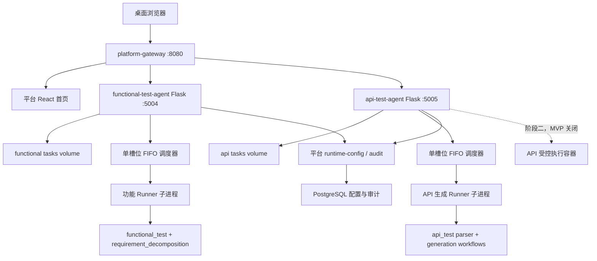
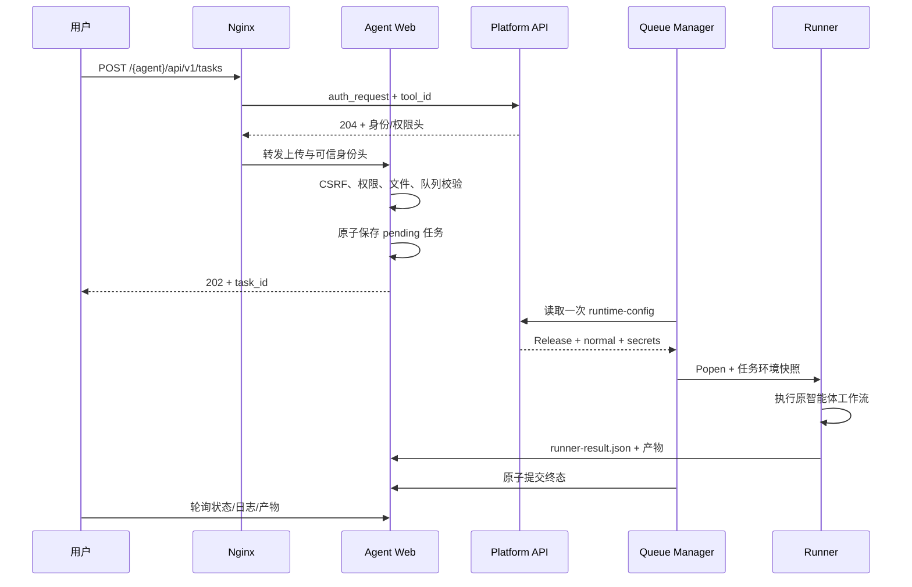
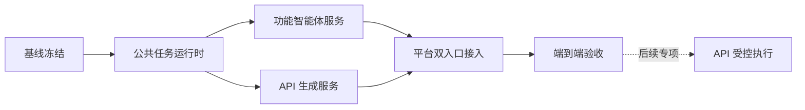

# AI 测试智能体独立接入测试开发平台开发设计与计划

> 文档版本：V1.0  
> 创建日期：2026-08-12  
> 文档状态：待开发评审  
> 对应 PRD：`test-platform/docs/AI测试智能体独立接入PRD.md` V1.1  
> 源项目：`AItestcase_Agents`  
> 目标平台：`test-platform`  
> 接入工具：`functional-test-agent`、`api-test-agent`  
> 方案定位：同仓库双服务、单槽位小队列、文件级任务存储、子进程隔离、API 执行默认关闭

---

## 1. 文档目的

本文档将已评审的《AI 测试智能体独立接入测试开发平台 PRD》转化为可直接执行的开发设计和实施计划，明确：

- 两个智能体的服务边界、源码边界和部署边界；
- 薄 Web 服务、公共任务运行时和智能体适配器的模块职责；
- API、任务状态、文件目录、产物和错误响应契约；
- 每个智能体单运行槽位、默认 5 个等待任务的持久化队列设计；
- 功能测试点下载、上传、校验和继续生成用例的 Review 流程；
- API 用例“文件优先、数据库可选”的最小核心改造；
- 平台鉴权、RBAC、配置 Release、Secret、审计、Nginx 和 Compose 接入；
- 页面结构、桌面交互、可访问性和状态设计；
- 自动化测试、浏览器验收、上线、回滚和风险控制；
- 分阶段任务拆分、依赖关系和完成标准。

本文档不直接实施代码。实际开发必须遵循“先冻结基线、再添加外层能力、最后进行必要的核心参数化”的顺序。

---

## 2. 需求理解与成功标准

### 2.1 需求理解

当前两个智能体共享一个代码仓库和部分公共能力，但平台接入后应表现为两个独立工具：

1. 功能测试智能体：负责需求拆解、测试点生成、人工 Review 和功能测试用例生成；
2. API 测试智能体：负责 API 文档解析和用例生成；真实 API 执行保留设计能力，但 MVP 默认关闭。

“独立”在本期指入口、服务进程、容器、配置、Secret、权限、任务、日志和产物独立，不要求立即拆成两个 Git 仓库。

### 2.2 技术成功标准

- 两个 Flask 服务由同一源码仓库构建，但使用不同启动入口、工具 ID、基础路径、端口和数据卷；
- 每个服务同一时间只运行一个子进程，另有最多 5 个 `pending` 任务；
- 队列在服务重启后可恢复，运行中断任务确定性标记为 `WORKER_INTERRUPTED`；
- 所有智能体任务在任务专属工作目录中执行，不共享可写 `output/`；
- 功能任务能在同一任务 ID 下完成测试点 Review 和用例生成；
- API 生成在没有 MySQL 配置时仍能生成并下载文件；
- 平台配置按任务读取一次不可变快照，Secret 只通过子进程环境变量传入内存；
- 浏览器无法提交服务器绝对路径、任意输出路径或任意 artifact 路径；
- 任务详情展示真实模型、Prompt Bundle 哈希和配置 Release；
- 普通用户只能访问自己的任务，管理员可访问全部任务；
- 原有脚本入口和当前 38 项测试保持通过。

### 2.3 交付边界

MVP 交付：

- 功能测试智能体完整平台闭环；
- API 文档解析和 API 用例生成闭环；
- API 数据库写入可选且默认关闭；
- API 实际执行入口由服务端功能开关强制关闭；
- 两套平台接入、权限、配置和审计；
- 自动化测试与桌面浏览器验收。

MVP 不交付：

- 在线编辑测试点；
- API 真实请求执行；
- PDF、Word、图片解析；
- 历史 `AItestcase_Agents/output/` 浏览；
- 平台统一任务数据库；
- Redis/Celery；
- 两个源码仓库的物理拆分。

### 2.4 PRD 评审结论追踪

| PRD 确认项 | 详细设计落点 |
|---|---|
| 每个智能体单任务 + 小队列 | 第 4.4、11、20.1 章：单槽位、持久化 FIFO、默认最多 5 个等待任务 |
| Review 下载/上传 JSON | 第 10.3、12.3～12.4、14.5、15.3 章 |
| API 实际执行默认关闭 | 第 7.2、13.1、13.6、24 章：配置默认 false、服务端强制拒绝 |
| 180/90 天、最多 500 条 | 第 10.5 章：摘要、产物和数量清理语义 |
| 上传类型和大小 | 第 10.2、14.1 章：功能 `.md/.txt`，API 额外 JSON/YAML，5 MiB/500,000 字符 |
| API 目标范围为空 | 第 7.2、13.6 章：`ALLOWED_TARGETS=[]`，MVP 不执行 |
| API 文件优先、数据库可选 | 第 13.3～13.5 章：`persist_to_database` 最小核心参数化 |
| 历史 `output/` 不纳入 MVP | 第 2.3、19.4、24 章：只备份，不挂载、不展示 |
| 普通用户查看模型/Prompt 版本 | 第 7.5、9.1、14.3、15.6 章 |
| 仅创建者和管理员查看任务 | 第 8.3、14.2～14.7、20.3 章：所有权 + `task.view.all` |

---

## 3. 当前代码评估

### 3.1 功能测试智能体

当前主要入口和依赖：

| 文件 | 当前职责 | 接入影响 |
|---|---|---|
| `agents/functional_test/case_generator_agent.py` | 创建 Tool Calling Agent，并通过自然语言选择生成测试点或用例 | 保留为命令行示例；平台不使用自然语言路由作为唯一控制入口 |
| `agents/common/tools/tools.py` | 暴露 `generator_test_points`、`generator_case`，保存模块级 `_tool_config` | 子进程内继续复用；服务主进程不得调用 `set_tool_config` |
| `agents/functional_test/workflows/case_generator_workflow.py` | 测试点和测试用例 LangGraph 工作流、文件输出 | 通过任务专属 `cwd` 隔离相对输出；显式输出目录继续传参 |
| `requirement_decomposition/pipeline.py` | 需求拆解、质量门禁、结构化产物 | 通过 `requirements_output_dir` 写入任务目录 |

当前测试点默认写入 `cwd/output/test_points/`，测试用例默认写入 `cwd/output/<project_id>/<module_id>/`。因此 MVP 可通过每任务独立 `cwd` 保留原写入逻辑，无需全量重构输出模块。

### 3.2 API 测试智能体

当前主要入口和依赖：

| 文件 | 当前职责 | 接入影响 |
|---|---|---|
| `agents/api_test/api_testcase_agent.py` | 文档读取、解析、生成、执行和报告的聚合入口 | 拆分调用已有公开步骤；MVP 不调用执行步骤 |
| `agents/api_test/parsers/ai_parser_api_document.py` | LLM 解析 API 文档 | 直接复用 |
| `agents/api_test/workflows/api_basecase_workflow.py` | 生成基础用例并按 `interface_id` 写 MySQL | 增加显式持久化开关，关闭时直接返回内存用例 |
| `agents/api_test/workflows/api_run_case_wrokflow.py` | 生成可执行用例、静态语法检查并写 MySQL | 增加显式持久化开关，关闭时保留生成结果但跳过数据库节点 |
| `agents/common/utils/api_testcase_execute.py` | 实际发送请求并回写执行结果 | MVP 不调用；阶段二放入受控执行边界 |
| `agents/common/utils/basecase.py` | 执行 setup/teardown Python 脚本 | MVP 生成阶段只做静态语法检查，不执行脚本 |

当前聚合入口即使未传 `interface_id` 也会生成时间戳 ID，从而触发数据库写入。为了实现 PRD 已确认的“文件优先、数据库可选”，必须进行小范围核心参数化，不能仅靠 Web 壳层规避。

### 3.3 公共配置

`agents/common/config/settings.py` 在模块导入时创建 LLM 客户端，当前模型名固定为 `deepseek-v4-flash`，Base URL 和 API Key 从环境变量读取。

实现约束：

- 子进程必须先获得环境变量，再导入智能体模块；
- Web 主进程不能提前导入 `settings.py`，避免使用错误或过期配置；
- 模型名增加环境变量覆盖能力，默认值保持当前值；
- 不升级 LangChain、LangGraph、Pydantic 或模型默认版本。

### 3.4 当前测试基线

文档编写时执行：

```text
python3 -m pytest -q
38 passed, 1 warning
```

警告来自 LangGraph checkpoint 依赖的待弃用提示，不属于本次接入失败。开发前需要再次保存完整依赖版本和测试输出作为基线。

---

## 4. 方案选择

### 4.1 Web 技术：Flask 3 + Jinja + 原生 JavaScript/CSS

两个工具壳均使用 Flask 3，理由：

- 与现有 `api-autotest/web` 任务型工具一致；
- 与智能体同为 Python，可直接复用任务存储、子进程和平台配置客户端；
- 页面是工具工作台，不需要再建立独立 React 工程；
- 可使用 Blueprint 显式支持平台子路径；
- 避免在一个仓库中引入第二套 Node 构建链路。

平台 React 前端只增加工具图标映射，工具卡片继续由平台工具目录动态生成。

### 4.2 服务模式：同仓库双 Flask 应用

两个服务共享任务运行时实现，但业务适配器和 Flask 应用入口独立：

```text
functional-test-agent service
  └── functional adapter

api-test-agent service
  └── api adapter

shared runtime
  ├── task store
  ├── queue manager
  ├── upload validation
  ├── artifact registry
  ├── platform client
  ├── identity/permission
  └── redaction
```

禁止功能服务导入 API 执行模块，禁止 API 服务导入功能测试 AgentExecutor。

### 4.3 执行模式：每任务独立子进程

Web 主进程不直接运行 LangGraph。每个任务通过参数数组启动：

```text
python -m services.functional_agent.runner --task-id <server-generated-id>
python -m services.api_agent.runner --task-id <server-generated-id>
```

不使用 shell 字符串，不把项目名、模块名、文件名或自然语言直接拼入命令。Runner 只依据服务端生成的任务 ID，从任务目录读取 `request.json`。

优点：

- `_tool_config` 被隔离在单任务进程；
- LLM 客户端按当前任务配置创建；
- 可按进程组取消；
- 控制台输出自然进入任务日志；
- 单个任务异常不会污染 Web 进程；
- 原工作流基本不变。

### 4.4 队列：内置持久化小队列

MVP 不引入 Redis/Celery。`pending` 任务记录本身就是持久化队列，后台调度线程按 `created_at + id` FIFO 选择下一个任务。

每个服务：

- 运行槽位：1；
- 默认等待上限：5；
- `waiting_review` 不占运行槽位和等待队列；
- 队列上限可通过平台普通配置调整；
- 队列满返回 HTTP 409 + `TASK_QUEUE_FULL`。

### 4.5 存储：文件任务记录，不新增任务数据库表

MVP 延续任务型工具现有文件存储经验：

- `task.json` 保存任务摘要和内部运行字段；
- `request.json` 保存经过校验的非敏感输入；
- `artifacts.json` 保存产物索引；
- 输入、日志和产物保存在任务目录；
- Platform PostgreSQL 继续保存工具目录、身份、权限、配置、Secret 和审计。

文件或对象存储仍是大产物的正确承载位置。平台统一任务表留到后续阶段。

### 4.6 前端刷新：轮询而非 SSE/WebSocket

任务页面每 5 秒轮询任务详情；日志通过游标增量读取。终态或 `waiting_review` 后停止自动轮询。

MVP 不使用 SSE/WebSocket，避免增加 Nginx 长连接、断线恢复和多实例状态同步复杂度。

---

## 5. 目标架构

### 5.1 总体架构



建议内部端口 `5004` 和 `5005`，与现有 `5001`～`5003` 顺序衔接；只通过 Compose `expose` 暴露给容器网络。

### 5.2 请求链路



### 5.3 服务故障边界

- 平台 API 不可用：新任务因无法读取配置而失败关闭；已完成任务仍可按身份头读取；Nginx 鉴权失败时整体拒绝；
- 功能服务不可用：只影响 `/functional-test-agent/`；
- API 服务不可用：只影响 `/api-test-agent/`；
- LLM 不可用：单任务失败，Web 服务保持健康；
- 任务卷不可写：健康接口仍可返回进程存活，但 readiness/首页配置状态显示存储不可用，新任务返回 `STORAGE_UNAVAILABLE`；
- MySQL 不可用：默认文件生成不受影响；仅可选数据库写入标记失败。

---

## 6. 推荐目录与模块设计

以下为实施阶段需要新增的最小结构。具体文件创建在开发开始前按项目约束逐项确认。

```text
AItestcase_Agents/
├── services/
│   ├── __init__.py
│   ├── common/
│   │   ├── __init__.py
│   │   ├── artifacts.py
│   │   ├── audit.py
│   │   ├── config.py
│   │   ├── errors.py
│   │   ├── identity.py
│   │   ├── platform_client.py
│   │   ├── redaction.py
│   │   ├── task_manager.py
│   │   ├── task_models.py
│   │   ├── task_store.py
│   │   ├── uploads.py
│   │   ├── static/
│   │   │   ├── agent-workbench.css
│   │   │   └── agent-workbench.js
│   │   └── templates/
│   │       ├── base.html
│   │       ├── task_list.html
│   │       └── task_detail.html
│   ├── functional_agent/
│   │   ├── __init__.py
│   │   ├── app.py
│   │   ├── adapter.py
│   │   ├── runner.py
│   │   └── templates/
│   │       ├── index.html
│   │       └── review.html
│   └── api_agent/
│       ├── __init__.py
│       ├── app.py
│       ├── adapter.py
│       ├── runner.py
│       └── templates/
│           └── index.html
├── tests/
│   └── services/
│       ├── test_task_store.py
│       ├── test_task_manager.py
│       ├── test_uploads.py
│       ├── test_artifacts.py
│       ├── test_permissions.py
│       ├── test_functional_routes.py
│       ├── test_functional_runner.py
│       ├── test_api_routes.py
│       └── test_api_runner.py
├── Dockerfile.functional-agent
├── Dockerfile.api-agent
├── requirements-functional-agent.lock
└── requirements-api-agent.lock
```

### 6.1 `services/common`

| 模块 | 职责 |
|---|---|
| `config.py` | 读取并校验 Web 服务自身环境变量，不导入智能体 LLM 配置 |
| `errors.py` | 稳定错误码和 HTTP 异常 |
| `identity.py` | 解析可信身份头、权限集合和任务所有权 |
| `platform_client.py` | 使用工具 Client Token 读取 runtime-config 和上报审计 |
| `task_models.py` | Pydantic 任务、产物、分页和响应模型 |
| `task_store.py` | 路径校验、原子 JSON、列表、保留与恢复 |
| `task_manager.py` | 持久化 FIFO、Popen、超时、取消、终态竞争控制 |
| `uploads.py` | 扩展名、MIME、大小、字符数、UTF-8 和安全文件名校验 |
| `artifacts.py` | 任务根目录内扫描、SHA-256、类型判定和下载解析 |
| `redaction.py` | 日志和错误摘要的二次脱敏 |
| `audit.py` | 构造幂等审计事件；失败时不影响主流程但记录本地告警 |

### 6.2 智能体 Adapter

Adapter 定义统一协议：

```python
class AgentAdapter(Protocol):
    def validate_request(self, payload: dict) -> dict: ...
    def build_runner_request(self, task: dict) -> dict: ...
    def collect_result(self, task_dir: Path) -> dict: ...
    def collect_artifacts(self, task_dir: Path) -> list[dict]: ...
```

功能和 API Adapter 分别实现该协议。公共任务管理器不知道 LangGraph、测试点或 API 用例字段。

### 6.3 Runner 进程

Runner 的约束：

- 启动后先读取 `request.json`；
- 校验任务目录属于配置的数据根；
- 配置 stdout/stderr 为 UTF-8；
- 设置工作目录为 `tasks/<id>/work/`；
- 在导入智能体模块前读取环境变量；
- 执行单一明确操作；
- 将结构化结果原子写入 `runner-result.json`；
- 异常时返回非零退出码，并写入不包含 Secret 的稳定错误标记；
- 不直接修改 `task.json`，终态只由 TaskManager 提交，防止并发覆盖。

---

## 7. 配置设计

### 7.1 Web 服务环境变量

| 变量 | 功能默认 | API 默认 | 说明 |
|---|---:|---:|---|
| `AGENT_WEB_HOST` | `0.0.0.0` | `0.0.0.0` | 监听地址 |
| `AGENT_WEB_PORT` | `5004` | `5005` | 容器内部端口 |
| `AGENT_BASE_PATH` | `/functional-test-agent` | `/api-test-agent` | 平台子路径，不带尾斜杠 |
| `AGENT_TOOL_ID` | `functional-test-agent` | `api-test-agent` | 固定工具 ID |
| `AGENT_DATA_DIR` | `/app/runtime/functional` | `/app/runtime/api` | 独立任务根目录 |
| `PLATFORM_HOME_URL` | `/` | `/` | 返回平台入口 |
| `PLATFORM_API_URL` | `http://platform-api:8000/api/v1` | 同左 | 平台内部 API |
| `PLATFORM_CLIENT_TOKEN_FILE` | `/run/secrets/platform-client-token` | 同左 | 只读 Client Token |
| `PLATFORM_RUNTIME_ENV` | `dev` | `dev` | 配置环境 |

服务启动时校验 `AGENT_TOOL_ID` 与应用类型一致，避免错误镜像或 Token 跨工具使用。

MVP 的 Tool Client 与一个 `PLATFORM_RUNTIME_ENV` 绑定，因此任务表单中的环境不是任意切换项：页面展示当前部署环境，提交值必须与服务环境一致。需要同时操作 dev/prod 时，应部署各自独立的服务实例和 Client Token；不得让 dev Client 读取 prod Secret。

### 7.2 平台普通配置定义

功能测试智能体建议定义：

| Key | 类型 | 默认值 | 生效方式 |
|---|---|---:|---|
| `LLM_MODEL` | string | `deepseek-v4-flash` | `next_task` |
| `LLM_BASE_URL` | url | 当前兼容地址 | `next_task` |
| `TASK_TIMEOUT_SECONDS` | integer | `3600` | `next_task` |
| `QUEUE_MAX_WAITING` | integer | `5` | `next_task` |
| `UPLOAD_MAX_BYTES` | integer | `5242880` | `next_task` |
| `UPLOAD_MAX_CHARACTERS` | integer | `500000` | `next_task` |
| `TASK_SUMMARY_RETENTION_DAYS` | integer | `180` | `next_task` |
| `TASK_ARTIFACT_RETENTION_DAYS` | integer | `90` | `next_task` |
| `TASK_MAX_COMPLETED` | integer | `500` | `next_task` |
| `ARTIFACT_EXPIRY_WARNING_DAYS` | integer | `7` | `next_task` |
| `CASE_GENERATION_BATCH_SIZE` | integer | 保持当前行为 | `next_task` |
| `COVERAGE_MATRIX_ENABLED` | boolean | 保持当前行为 | `next_task` |

API 测试智能体建议定义：

| Key | 类型 | 默认值 | 生效方式 |
|---|---|---:|---|
| `LLM_MODEL` | string | `deepseek-v4-flash` | `next_task` |
| `LLM_BASE_URL` | url | 当前兼容地址 | `next_task` |
| `TASK_TIMEOUT_SECONDS` | integer | `3600` | `next_task` |
| `QUEUE_MAX_WAITING` | integer | `5` | `next_task` |
| `UPLOAD_MAX_BYTES` | integer | `5242880` | `next_task` |
| `UPLOAD_MAX_CHARACTERS` | integer | `500000` | `next_task` |
| `TASK_SUMMARY_RETENTION_DAYS` | integer | `180` | `next_task` |
| `TASK_ARTIFACT_RETENTION_DAYS` | integer | `90` | `next_task` |
| `TASK_MAX_COMPLETED` | integer | `500` | `next_task` |
| `ARTIFACT_EXPIRY_WARNING_DAYS` | integer | `7` | `next_task` |
| `API_EXECUTION_ENABLED` | boolean | `false` | `next_task` |
| `DATABASE_PERSIST_ENABLED` | boolean | `false` | `next_task` |
| `ALLOWED_TARGETS` | string/JSON | `[]` | `next_task` |

`ALLOWED_TARGETS` 初始为空。MVP 页面不提供任意 Base URL 自由输入，生成任务可使用文档内 URL 作为用例元数据，但不会发送请求。

### 7.3 Secret 定义

功能智能体：

- `LLM_API_KEY`，MVP 必需。

API 智能体：

- `LLM_API_KEY`，MVP 必需；
- `DB_HOST`、`DB_PORT`、`DB_USER`、`DB_PASSWORD`、`DB_NAME`，仅启用数据库写入时必需；
- 目标环境 Token/Cookie 在阶段二根据真实环境另行定义，MVP 不创建虚假必填项。

### 7.4 配置快照

TaskManager 在任务真正取得运行槽位后读取一次：

```text
GET /api/v1/internal/tools/{tool_id}/runtime-config
Authorization: Bearer <tool-client-token>
```

处理原则：

- `pending` 时不读取 Secret，避免排队期间持有过期快照；
- 获取成功后把 normal 和 secrets 合并为子进程环境变量；
- 映射 `LLM_BASE_URL → base_url`、`LLM_API_KEY → DASHSCOPE_API_KEY`，保持当前智能体兼容；
- `LLM_MODEL` 通过对 `settings.py` 的最小参数化生效；
- 只把 `release_id`、`release_version`、模型名和非敏感版本信息写入任务记录；
- Secret 字典不写磁盘、不写日志、不传浏览器；
- 不把平台 Client Token 传入 Runner；
- 配置读取失败时任务终止为 `CONFIG_NOT_READY` 或 `PLATFORM_CONFIG_UNAVAILABLE`，并释放槽位。

### 7.5 Prompt Bundle 版本

代码中部分 Prompt 没有统一人工版本号，因此 Runner 启动时对当前智能体实际使用的 Prompt 文件计算确定性 SHA-256：

1. 按相对路径排序；
2. 哈希包含相对路径、分隔符和文件原始字节；
3. 保存完整哈希，普通页面显示前 12 位；
4. 同时保存应用镜像/源码版本 `APP_REVISION`（可用构建参数注入 Git commit）。

功能智能体 Bundle 包含 `agents/functional_test/prompts/` 和 `prompts/`；API 智能体 Bundle 包含 `agents/api_test/prompts/`。不得把 Prompt 全文写入任务记录。

---

## 8. 身份、权限和 CSRF 设计

### 8.1 网关鉴权

Nginx 为两个工具分别固定：

```text
$platform_tool_id = functional-test-agent
$platform_tool_id = api-test-agent
```

通过 `/__platform_authorize` 验证会话后注入：

- `X-Platform-User-ID`；
- `X-Platform-Username`；
- `X-Platform-Display-Name`；
- `X-Platform-Permissions`。

工具端口不暴露给宿主机，工具服务在 platform 模式下拒绝缺失 `X-Platform-User-ID` 的业务请求。健康接口例外，供容器和平台后端探测。

### 8.2 权限路由映射

修改平台 `required_tool_permission`：

| 请求 | 必需权限 |
|---|---|
| 工具首页、健康之外的普通 GET | `tool.view` |
| 任务列表、详情、日志、产物 GET | `tool.result.view` |
| 创建任务、上传 Review、继续任务 POST | `tool.execute` |
| 取消任务 POST | `task.cancel` |
| API 真实执行 POST | `api-test-agent.execute`，并由工具服务再次要求 `tool.execute` |

新增权限代码：

- `task.cancel`，资源类型 `tool`；
- `api-test-agent.execute`，资源类型 `tool`；
- `task.view.all`，资源类型 `tool`，仅用于管理员跨创建者查看任务。

建议内置授权：

- 平台管理员：三项均有；
- 测试开发：`task.cancel`，不默认授予 API 真实执行；
- 测试执行者：根据管理员显式授权决定 `task.cancel`；
- 只读用户：均无。

### 8.3 所有权校验

工具服务在 Nginx 权限之后继续校验：

```text
task.created_by_user_id == X-Platform-User-ID
OR 当前用户拥有 task.view.all
```

列表查询在服务端过滤，不把其他用户记录传给浏览器。404 同时用于“任务不存在”和“无权查看”，避免泄露任务存在性。

管理员判断不得只依赖用户名 `admin`，也不得复用测试开发角色已有的 `tool.config.manage`。MVP 使用专用 `task.view.all`，且只默认授予平台管理员。

### 8.4 CSRF

所有非 GET/HEAD/OPTIONS 请求校验双提交：

- Cookie：`tp_csrf`；
- Header：`X-CSRF-Token`；
- HTML 表单可使用 `_csrf` 隐藏字段；
- 比较使用常量时间函数；
- 失败返回 403 + `CSRF_INVALID`。

公共 JavaScript 提供统一 `agentFetch` 包装，不通过运行时修改全局 `window.fetch` 注入。

---

## 9. 任务数据模型

### 9.1 `task.json`

建议结构：

```json
{
  "schema_version": 1,
  "id": "task_20260812_01jxxxxxxxx",
  "agent_type": "functional",
  "operation": "generate_test_points",
  "status": "pending",
  "stage": "queued",
  "created_by_user_id": "user_xxx",
  "created_by_username": "tester",
  "project_id": "project-a",
  "project_name": "项目 A",
  "module_id": "personal-center",
  "module_name": "个人中心",
  "environment": "dev",
  "created_at": "2026-08-12T10:00:00+08:00",
  "started_at": null,
  "finished_at": null,
  "resume_requested_at": null,
  "cancel_requested_at": null,
  "config_release_id": null,
  "config_release_version": null,
  "model_name": null,
  "prompt_bundle_sha256": null,
  "app_revision": null,
  "result_summary": {},
  "error_code": null,
  "error_message": null,
  "artifacts_expire_at": null,
  "artifacts_expired": false,
  "internal": {
    "pid": null,
    "exit_code": null,
    "timeout": false,
    "revision": 1
  }
}
```

公共 API 响应必须通过 Pydantic 显式序列化，移除整个 `internal` 字段。

### 9.2 状态与阶段

状态表示生命周期，阶段表示工作流位置。

功能阶段建议：

```text
queued
loading_config
decomposing_requirement
generating_test_points
validating_test_points
waiting_for_review
generating_test_cases
publishing_artifacts
completed
```

API 生成阶段建议：

```text
queued
loading_config
parsing_api_document
generating_base_cases
generating_executable_cases
static_script_check
optional_database_persist
publishing_artifacts
completed
```

页面不得把阶段换算为虚假百分比。

### 9.3 合法状态流转

| 当前状态 | 操作/事件 | 下一状态 |
|---|---|---|
| `pending` | 取得槽位 | `running` |
| `pending` | 用户取消 | `cancelled` |
| `running` | 测试点生成完成 | `waiting_review` |
| `waiting_review` | 上传校验通过并确认继续 | `pending` |
| `waiting_review` | 用户取消 | `cancelled` |
| `running` | 最终任务成功 | `succeeded` |
| `running` | 子进程、超时或产物失败 | `failed` |
| `running` | 用户取消且进程退出 | `cancelled` |

`waiting_review → pending → running` 是 PRD 在持久化队列场景下的实现细化。Review 重新提交后必须遵守同一队列，不抢占正在运行的其他任务。

终态 `succeeded/failed/cancelled` 不允许再次修改。重试创建新任务，并保存 `retry_of_task_id`。

### 9.4 任务 ID

格式建议：

```text
task_YYYYMMDD_<ULID-or-cryptographic-random>
```

要求：

- 随机部分不可预测；
- 只允许 ASCII 小写字母和数字；
- 固定正则校验；
- 所有路径操作先校验 ID，再解析真实路径；
- 不依赖任务 ID 实现授权。

---

## 10. 文件与产物设计

### 10.1 目录结构

```text
<AGENT_DATA_DIR>/tasks/<task_id>/
├── task.json
├── request.json
├── runner-result.json
├── artifacts.json
├── console.log
├── input/
│   ├── source.md
│   └── review-test-points-v1.json
├── work/
│   └── output/
└── published/
    ├── requirements/
    ├── test-points/
    ├── test-cases/
    └── reports/
```

`work/` 是原工作流的 `cwd`。`published/` 只包含已经登记、允许下载的产物。发布使用“复制到同目录临时文件 → fsync → 原子替换”，避免用户下载半写文件。

### 10.2 上传处理

允许类型：

| 工具 | 扩展名 | 内容规则 |
|---|---|---|
| 功能智能体 | `.md`、`.txt` | UTF-8 文本 |
| API 智能体 | `.md`、`.txt`、`.json`、`.yaml`、`.yml` | UTF-8 文本；JSON/YAML 在保存前做基础语法解析 |
| Review | `.json` | UTF-8 JSON，必须符合测试点结构 |

限制：

- 单文件最大 5 MiB；
- 解码后最多 500,000 字符；
- 每个任务一个主文档；
- 文件名统一保存为 `source.<normalized-extension>`；
- 上传过程先写任务目录内临时文件，完成校验后原子重命名；
- 拒绝 NUL、路径分隔符伪装、符号链接和非普通文件；
- JSON/YAML 解析只用于语法校验，不构造 Python 对象标签，不使用不安全 YAML Loader。

### 10.3 Review 文件

Review 上传不覆盖原始测试点：

```text
published/test-points/generated.json
input/review-test-points-v1.json
input/review-test-points-v2.json
```

校验步骤：

1. 文件、大小、字符数和 JSON 语法；
2. 顶层为列表，或兼容 `test_point/test_points/point` 包装对象；
3. 列表非空；
4. 每项为对象并保留工作流所需字段；
5. 限制单次测试点数量，例如默认不超过 5,000；
6. 保存 SHA-256、Review 人和时间；
7. 通过后才把任务从 `waiting_review` 转为 `pending`。

失败返回 `REVIEW_FILE_INVALID`，原任务保持 `waiting_review`。

### 10.4 产物登记

`artifacts.json` 示例：

```json
{
  "schema_version": 1,
  "items": [
    {
      "id": "artifact_xxx",
      "type": "test_points_json",
      "name": "test_points.json",
      "relative_path": "published/test-points/test_points.json",
      "size": 10240,
      "sha256": "...",
      "stage": "generating_test_points",
      "created_at": "2026-08-12T10:10:00+08:00",
      "review_input": false,
      "expired": false
    }
  ]
}
```

下载时只依据已登记的 `relative_path`，解析后必须仍位于任务根目录，且目标为普通文件。浏览器不能传 `path`。

### 10.5 保留策略

清理器在服务启动后和每 24 小时运行一次，并在任务终态提交后进行轻量数量检查：

- 任务文件达到 90 天：删除 `input/`、`work/`、`published/`、`console.log` 和 `runner-result.json`，保留 `task.json` 与已过期的产物元数据；
- 任务摘要达到 180 天：删除剩余任务目录；
- 已结束任务超过 500：按结束时间删除最旧任务的完整目录，时间与数量条件取先到者；
- `pending/running/waiting_review` 永不自动清理；
- 距时间到期 7 天时计算 `expires_soon=true`；
- 数量上限导致的提前清理无法保证 7 天预警，因此页面需说明“容量上限也可能触发清理”；
- 审计日志由平台独立保留，不随任务目录删除。

清理实现必须先生成 dry-run 清单并逐个校验任务 ID 和根目录，不使用宽泛递归路径。

---

## 11. 队列与子进程设计

### 11.1 调度器

每个 Flask 应用创建一个 `TaskManager`：

- `threading.Condition` 保护队列状态和活动进程；
- 一个 daemon dispatcher thread；
- 一个 active task；
- `pending` 按 FIFO 排序；
- TaskStore 是事实来源，内存只保存 active PID 和等待线程；
- Flask 生产部署只运行一个 Web worker，避免两个进程各自启动调度器。

MVP 启动命令必须限制为单进程，例如一个 Gunicorn worker + 多线程，或直接使用已验证的单进程 WSGI Server。不得在未引入跨进程锁之前配置多个 worker。

### 11.2 提交原子性

提交在同一锁内完成：

1. 统计当前 `pending`；
2. 如等待数达到配置上限，返回 `TASK_QUEUE_FULL`；
3. 生成任务 ID 和目录；
4. 安全保存输入；
5. 原子保存 `request.json` 和 `task.json(status=pending)`；
6. 通知 dispatcher；
7. 返回 202。

若保存过程中失败，删除仅属于新任务的临时目录；不得留下可调度但输入不完整的 `pending` 记录。

### 11.3 启动任务

Dispatcher：

1. 选择最早 `pending`；
2. 读取平台配置快照；
3. 保存非敏感版本元数据；
4. 创建最小子进程环境；
5. 以 `start_new_session=True` 启动 Runner；
6. 在同一锁内保存 PID、`running` 和 `started_at`；
7. 等待进程或超时；
8. 读取 Runner 结果并登记产物；
9. 原子提交终态；
10. 释放槽位并通知调度器。

### 11.4 环境变量最小化

Runner 环境以允许列表构造，不直接复制 Web 主进程全部环境。允许：

- 必要的 `PATH`、区域和 Python 运行变量；
- LLM 普通配置与 Secret；
- 当前操作需要的可选数据库配置；
- `TASK_ID`、任务根和非敏感运行参数。

禁止传入：

- Platform Client Token；
- 平台数据库 URL；
- KEK 路径；
- Bootstrap Token；
- 另一个智能体的 Secret。

### 11.5 取消

- `pending`：直接原子更新为 `cancelled`；
- `waiting_review`：直接更新为 `cancelled`；
- `running`：设置 `cancel_requested_at`，向进程组发送 SIGTERM，默认等待 10 秒后 SIGKILL；
- 只有确认进程退出后才能提交 `cancelled`；
- 终态提交采用“首次合法终态获胜”；
- 取消与自然完成竞争时，在同一锁中检查当前状态；
- 取消成功后保留已完整发布的产物，未完整发布的临时文件不登记。

### 11.6 超时

- 单任务默认 3600 秒；
- 超时后终止完整进程组；
- 终态 `failed`，错误码 `TASK_TIMEOUT`；
- Review 等待时间不计入运行超时；
- 排队时间不计入运行超时，但页面分别展示排队时长与执行时长。

### 11.7 启动恢复

服务启动时：

- `running` → `failed/WORKER_INTERRUPTED`；
- `pending` 保持并重新进入 FIFO；
- `waiting_review` 保持；
- 终态保持；
- 清除遗留内部 PID；
- 删除未登记的 `.tmp` 文件；
- 不自动重跑中断任务，用户可点击重试创建新任务。

---

## 12. 功能测试智能体适配设计

### 12.1 创建任务

请求映射：

```text
project_name/module_name（展示值）
  → 服务端生成安全 project_slug/module_slug
document_file/document_text
  → input/source.md|txt
operation
  → Runner 明确分支
```

展示名称可以包含中文，但传给原工作流用于输出目录的 `project_id/module_id` 必须使用服务端生成的安全 slug。真实展示名称单独保存在任务元数据，不依赖目录名还原。

### 12.2 `generate_test_points`

Runner 顺序：

1. 设置 `cwd=task/work`；
2. `set_tool_config(project_slug, module_slug, task_id)`；
3. 调用 `generator_test_points.ainvoke(...)`；
4. 显式传入 `requirements_output_dir=task/work/output/requirements_docs/<feature_slug>`；
5. 从 `work/output/test_points/` 和需求拆解目录收集产物；
6. 解析测试点数量与质量摘要；
7. 写 `runner-result.json(next_status=waiting_review)`；
8. TaskManager 发布产物并进入 `waiting_review`。

平台不依赖 Tool 返回的中文字符串判断成功，必须以 Runner 退出码、结构化结果和实际文件三者共同判断。

### 12.3 `generate_test_cases`

入口来源：

- 新任务直接上传测试点 JSON；或
- 原任务在 Review 后继续。

Runner：

1. 读取最新版已确认 Review JSON；
2. 调用 `generator_case.ainvoke(test_points_path=...)`；
3. 使用安全 project/module slug；
4. 从 `work/output/<slug>/<slug>/` 收集 JSON/XLSX；
5. 解析实际用例数量；
6. 发布最终产物并返回 `succeeded`。

### 12.4 `full_pipeline`

MVP 的完整流程拆为两个子进程阶段，但保留同一个任务 ID：

```text
第一次 Runner：需求拆解 + 测试点 → waiting_review
用户 Review：上传并确认 → pending
第二次 Runner：读取 Review 测试点 → 测试用例 → succeeded
```

这样既保留人工门禁，也避免一个子进程在 Review 期间长期占用资源。

### 12.5 直接需求拆解

`decompose_requirement` 可直接调用 `run_decomposition(source_path, config_path, output_dir)`，输出 Requirement JSON、Markdown、test seed 和质量报告。若 MVP 排期紧张，该操作可在第二迭代开放，但底层 Adapter 预留明确分支。

### 12.6 失败映射

| 现象 | 错误码 |
|---|---|
| 文档为空/路径不存在 | `INVALID_INPUT` |
| LLM 未启用或无 Key | `CONFIG_NOT_READY` |
| LLM 超时/限流/鉴权 | `LLM_TIMEOUT` / `LLM_RATE_LIMITED` / `LLM_AUTH_FAILED` |
| JSON 多次修复失败 | `LLM_RESPONSE_INVALID` |
| 质量门禁失败 | `QUALITY_GATE_FAILED` |
| 工作流返回成功字符串但没有文件 | `ARTIFACT_PUBLISH_FAILED` |
| Review JSON 不合法 | `REVIEW_FILE_INVALID`，任务保持等待 Review |

---

## 13. API 测试智能体适配设计

### 13.1 MVP 操作边界

开放：

- `parse_api_document`；
- `generate_api_cases`。

关闭：

- `execute_api_cases`；
- 包含真实执行的 `full_pipeline`。

无论前端是否隐藏，服务端在 `API_EXECUTION_ENABLED=false` 时统一返回 403 + `FEATURE_DISABLED`。不得只依赖页面隐藏。

### 13.2 文档解析

Runner：

1. 读取 UTF-8 文档；
2. 调用 `AIAPIDocumentParser.parser(content)`；
3. 将返回内容规范化为 JSON；
4. 写入 `published/api-document/parsed-api.json`；
5. 摘要保存接口数量、method/path 和解析警告。

### 13.3 用例生成

生成任务按解析出的每个接口调用现有主工作流，并汇总：

- 基础用例；
- 可执行用例；
- 静态语法检查状态；
- disabled 用例；
- 可选数据库写入结果。

最终文件至少包含：

```text
published/test-cases/parsed-api.json
published/test-cases/base-cases.json
published/test-cases/executable-cases.json
published/test-cases/generation-summary.json
```

如现有用例结构适合表格，可在不丢字段的前提下额外生成 XLSX；JSON 是权威产物。

### 13.4 数据库可选开关的最小核心改造

新增并逐层传递：

```text
persist_to_database: bool = False
```

涉及行为：

1. `APITestCaseExecutor` 保存该参数；
2. 关闭时不自动生成用于持久化的 `interface_id`；
3. `MainState`、`StateNode`、`ApiState` 接收该参数；
4. 基础用例输出节点：关闭时直接返回生成的字典列表，不调用 `_save_base_cases_to_db`；
5. 可执行用例保存节点：关闭时返回 `{saved: false, skipped: true}`，但保留 `api_case`；
6. 主流程不得依赖数据库返回行才能继续生成；
7. Adapter 始终把内存用例写入任务 JSON 文件；
8. 开启数据库写入时保持现有表和 SQL 行为。

该改动不修改 Prompt、不修改生成字段、不修改执行器请求行为。必须先增加覆盖“关闭时完全不连接 MySQL、开启时保持原调用”的单元测试。

### 13.5 数据库失败语义

当 `DATABASE_PERSIST_ENABLED=true`：

- 文件生成成功、数据库成功：任务 `succeeded`；
- 文件生成成功、数据库失败：任务 `succeeded`，摘要标记 `database_persist_status=failed`，并展示稳定告警；
- 文件生成失败：任务 `failed`；
- 数据库失败不得把已经生成的内存用例替换为空列表；
- 不把 MySQL 原始异常或 DSN 返回前端。

### 13.6 阶段二执行边界

未来启用 API 执行时，不在 API Web 容器内直接调用 `TestExecutor`。推荐建立短生命周期受控执行容器或等价沙箱：

- 只挂载当前任务执行输入和输出目录；
- 不挂载源码可写目录、平台 Token、KEK 或数据库凭证；
- 非 root、只读根、最小 capabilities；
- CPU/内存/PID/时间限制；
- 目标网络 egress allowlist；
- 重定向和 DNS 解析后复检；
- setup/teardown 脚本逐用例超时；
- 结果通过受控目录返回；
- 全部安全门禁和单独评审通过后才实现。

MVP 不创建假的执行容器，也不声明安全能力已经完成。

---

## 14. HTTP API 详细设计

以下 `{BASE}` 分别为 `/functional-test-agent` 和 `/api-test-agent`。

### 14.1 创建任务

```http
POST {BASE}/api/v1/tasks
Content-Type: multipart/form-data
X-CSRF-Token: <cookie value>
```

公共字段：

| 字段 | 类型 | 约束 |
|---|---|---|
| `operation` | string | 工具允许操作枚举 |
| `project_name` | string | 1～128 字符 |
| `module_name` | string | 1～128 字符 |
| `environment` | string | `dev/prod` 等平台已登记环境 |
| `document_file` | file | 与 `document_text` 二选一 |
| `document_text` | string | 与文件二选一，最多 500,000 字符 |
| `feature_name` | string | 功能工具可选，最多 128 字符 |
| `additional_context` | string | 可选，最多 4,000 字符 |

成功：HTTP 202。队列满：HTTP 409。

### 14.2 任务列表

```http
GET {BASE}/api/v1/tasks?page=1&page_size=20&status=pending&operation=generate_test_points
```

- `page >= 1`；
- `1 <= page_size <= 100`；
- 默认倒序；
- 普通用户服务端过滤为自己任务；
- 返回 `items/total/page/page_size`；
- 列表不返回日志、请求文档内容或内部 PID。

### 14.3 任务详情

```http
GET {BASE}/api/v1/tasks/{task_id}
```

响应包含：

- 状态、阶段、时间线；
- 项目、模块、操作和环境；
- 排队时长和执行时长；
- 结果摘要；
- 模型名、Prompt Bundle 短哈希、配置 Release、应用版本；
- 错误码和脱敏摘要；
- Review 状态；
- 产物过期状态和过期时间；
- 可执行操作列表，如 `can_cancel/can_resume/can_retry`。

### 14.4 取消任务

```http
POST {BASE}/api/v1/tasks/{task_id}/cancel
```

- 必需 `task.cancel`；
- 仍需所有权或管理员权限；
- `pending/waiting_review` 同步返回取消后的记录；
- `running` 返回已接受取消请求，前端继续轮询；
- 终态返回 409 + `INVALID_TASK_STATE`。

### 14.5 上传 Review 并继续

```http
POST /functional-test-agent/api/v1/tasks/{task_id}/resume
Content-Type: multipart/form-data

review_file=<json>
```

- 仅 `waiting_review`；
- 校验失败返回 422 + `REVIEW_FILE_INVALID`；
- 成功保存新版本并把任务转为 `pending`；
- 队列已满返回 409，Review 文件可以安全保存为草稿，但任务保持 `waiting_review`，用户之后再次确认；
- 重复请求使用 `Idempotency-Key` 或 Review SHA-256 防止重复排队。

### 14.6 日志

```http
GET {BASE}/api/v1/tasks/{task_id}/logs?cursor=0&limit=65536
```

响应：

```json
{
  "content": "...",
  "next_cursor": 65536,
  "truncated": false,
  "complete": false
}
```

- `limit` 最大 256 KiB；
- Cursor 是字节偏移；
- 服务端按 UTF-8 安全边界返回；
- 内容经过二次脱敏；
- 产物过期后返回 410 + `ARTIFACT_EXPIRED`。

### 14.7 产物列表和下载

```http
GET {BASE}/api/v1/tasks/{task_id}/artifacts
GET {BASE}/api/v1/tasks/{task_id}/artifacts/{artifact_id}
```

下载设置：

- `Content-Disposition: attachment`；
- 安全文件名；
- `X-Content-Type-Options: nosniff`；
- JSON/Markdown 可选择预览接口，但 MVP 下载优先；
- 过期返回 410，不返回文件系统路径。

### 14.8 健康和就绪

```http
GET {BASE}/health
```

固定轻量响应：

```json
{"status":"ok","service":"functional-test-agent"}
```

可额外提供受保护的：

```http
GET {BASE}/api/v1/readiness
```

展示任务卷可写、配置 Release 是否存在和 LLM Key 是否已配置，但不发起 LLM 调用、不返回 Secret。

### 14.9 错误响应

```json
{
  "error": {
    "code": "TASK_QUEUE_FULL",
    "message": "当前等待任务已达到上限，请稍后重试",
    "request_id": "req_xxx"
  }
}
```

新增实现级错误码：

| 错误码 | HTTP |
|---|---:|
| `CSRF_INVALID` | 403 |
| `PERMISSION_DENIED` | 403 |
| `FEATURE_DISABLED` | 403 |
| `TASK_QUEUE_FULL` | 409 |
| `INVALID_TASK_STATE` | 409 |
| `REVIEW_FILE_INVALID` | 422 |
| `ARTIFACT_EXPIRED` | 410 |
| `STORAGE_UNAVAILABLE` | 503 |
| `PLATFORM_CONFIG_UNAVAILABLE` | 503 |

---

## 15. 页面设计

### 15.1 视觉与组件约束

- 复用平台中性色、系统蓝、圆角、字体和 8px 间距系统；
- 页面最大宽度建议 1280px；
- 不使用 AI 紫色渐变、发光、Bento 卡片墙或虚假实时指标；
- 日志和 JSON 使用等宽字体；
- 动效限制为 150～250ms 状态反馈；
- 支持 `prefers-reduced-motion`；
- 使用单一线性图标风格，图标不替代文字。

### 15.2 功能智能体首页

信息顺序：

1. 页面标题、服务状态、返回平台；
2. 新建任务表单；
3. 正在运行与排队状态；
4. 待 Review 任务；
5. 最近任务列表；
6. 配置就绪信息。

主按钮根据 operation 显示“生成测试点”或“开始完整流程”。页面不展示聊天气泡作为主要输入方式。

### 15.3 Review 页面

顶部：

- `waiting_review` 状态；
- 测试点数量；
- 需求拆解质量摘要；
- 下一步说明。

主要操作：

- 下载原始测试点 JSON；
- 选择修改后的 JSON；
- 显示文件名、大小和本地校验提示；
- 上传并继续；
- 取消任务。

页面明确说明上传会创建新版本而非覆盖原文件。

### 15.4 API 智能体首页

MVP 主目标是“生成 API 测试用例”：

- 上传 API 文档；
- 选择解析或生成；
- 展示数据库写入状态（默认关闭）；
- API 执行区显示“首期未启用”，不展示可点击执行按钮；
- 目标允许列表为空时显示中性说明，不标记服务故障；
- 最近生成任务和产物入口。

### 15.5 任务列表

列：

- 任务 ID；
- 操作；
- 项目/模块；
- 创建者（管理员可见全部时有意义）；
- 状态与阶段；
- 创建时间；
- 排队/执行耗时；
- 结果摘要；
- 操作。

支持状态和操作筛选，默认每页 20 条。加载、空、错误和权限不足状态必须独立设计。

### 15.6 任务详情

页面按以下层级：

1. 当前状态、阶段和下一步；
2. 取消/继续/重试/下载操作；
3. 结果统计；
4. 失败摘要；
5. 产物；
6. 日志；
7. 生成信息（模型、Prompt、Release、应用版本）；
8. 技术时间线。

状态必须用文本 + 图标/形状，不能仅靠颜色。

### 15.7 轮询和日志交互

- 未终态任务每 5 秒刷新详情；
- 页面隐藏时降低或暂停轮询；
- 请求失败采用有限退避，不无限快速重试；
- 日志按 cursor 增量加载；
- 用户向上滚动后暂停自动滚动；
- 提供“回到底部”和“复制当前日志”；
- `waiting_review` 和终态时停止自动请求日志，用户可手动刷新。

### 15.8 可访问性验收

- 1280px、1440px 桌面视口；
- 所有表单有可见 label 和错误关联；
- 键盘完成上传、提交、筛选、Review 和取消；
- 对话框 Esc 关闭、焦点循环和恢复；
- 正文满足 WCAG AA；
- 日志区域具有可访问名称，不劫持页面滚动；
- 文件过期、队列满、无权限和配置未就绪均提供文字说明。

---

## 16. 平台侧设计

### 16.1 Alembic 迁移

新增一个迁移，基于当前最新 revision 继续编号，完成：

1. 插入两个 `tools` 记录；
2. 插入 `task.cancel`、`task.view.all`、`api-test-agent.execute` 权限；
3. 插入两个工具的普通配置和 Secret 定义；
4. 为平台管理员授予全部新权限，包括 `task.view.all`；
5. 为测试开发角色授予两个工具的通用权限和 `task.cancel`；
6. 不默认向任何非管理员角色授予 `api-test-agent.execute`；
7. downgrade 只删除本迁移创建的数据，保留任务文件和审计记录。

工具建议排序：

| Tool ID | sort_order | icon_key |
|---|---:|---|
| `functional-test-agent` | 50 | `functional-ai` |
| `api-test-agent` | 60 | `api-ai` |

### 16.2 Tool Client

`bootstrap_clients.py` 增加：

```text
functional-test-agent: config.read, config.ack, audit.write
api-test-agent: config.read, config.ack, audit.write
```

MVP 不给两个 Client `credential.session.write`。真实 API 执行阶段若确有动态凭证写回需求，再按最小能力单独评审。

本地 `.runtime-secrets/` 需要生成两个至少 32 字符的随机 Token 文件，但不得提交仓库或写入文档示例值。

### 16.3 权限映射

修改 `backend/app/core/permissions.py`：

- 在工具权限集合中登记新权限；
- 为两个工具的 `/tasks/`、`/api/v1/tasks`、`/artifacts`、`/logs` GET 映射 `tool.result.view`；
- 为取消路径映射 `task.cancel`；
- 为 API 执行路径映射 `api-test-agent.execute`；
- 其他写请求继续映射 `tool.execute`。

工具服务仍进行第二次权限和所有权校验。

### 16.4 Nginx

新增两组 location，结构复用现有工具：

```nginx
location = /functional-test-agent { return 308 /functional-test-agent/; }
location /functional-test-agent/ { ... }

location = /api-test-agent { return 308 /api-test-agent/; }
location /api-test-agent/ { ... }
```

要求：

- `auth_request`；
- 固定 tool ID；
- 清除并重新注入平台身份头；
- `X-Forwarded-Prefix`；
- 上传大小至少覆盖 5 MiB，建议 location 明确 `client_max_body_size 6m`；
- `proxy_read_timeout` 保持短请求语义，例如 60 秒；
- 502/503/504 使用统一工具不可用页；
- 不为任务执行设置小时级同步超时。

### 16.5 Compose

新增：

- `functional-test-agent`，build context `../AItestcase_Agents`；
- `api-test-agent`，build context 同上；
- 独立环境变量、Client Token 和任务卷；
- `expose: 5004/5005`；
- 独立健康检查；
- gateway `depends_on` 增加两个服务。

建议卷：

```text
../AItestcase_Agents/runtime/functional:/app/runtime/functional
../AItestcase_Agents/runtime/api:/app/runtime/api
```

不挂载旧 `output/`，不把一个服务的数据目录挂载到另一个服务。平台模式启动前确认没有独立实例写相同 `runtime/`。

### 16.6 平台首页

工具目录动态返回两个工具。`ToolCard.tsx` 的小型图标映射增加：

```text
functional-ai → FT
api-ai → AI
```

仅补映射和匹配现有 CSS 的图标颜色，不修改首页架构，不新增营销模块。

---

## 17. Docker 与依赖设计

### 17.1 双镜像

两个 Dockerfile 都以相同 Python 小版本为基础，但安装不同锁定依赖：

- 功能镜像：功能工作流、需求拆解、Pandas/OpenPyXL、Flask 等；
- API 镜像：API 解析/生成、PyMySQL（可选写入）、Flask 等；
- MVP API 镜像虽包含现有执行代码依赖，但 Web 路由和功能开关禁止真实执行；如能安全裁剪而不影响生成，可在实现验证后减少依赖。

### 17.2 依赖冻结

当前 `pyproject.toml` 只声明 `pydantic` 和 `PyYAML`，不足以构建服务。开发阶段需要：

1. 从当前通过测试的环境导出直接依赖和版本；
2. 区分功能/API 两套最小直接依赖；
3. 生成锁定文件；
4. 在全新环境安装；
5. 运行当前 38 项测试和新增服务测试；
6. 不借此升级依赖大版本。

### 17.3 容器安全

- 创建非 root 用户；
- 源码目录只读；
- 仅 `/app/runtime/<agent>` 可写；
- Client Token 只读挂载到 Web 进程；
- 不挂载 Docker Socket；
- 设置 `init: true` 或等价进程回收机制；
- 配置 CPU、内存和 PID 限制；
- 日志输出不包含 Secret；
- 镜像中不复制仓库 `.env`、历史 `output/`、`.git` 或本机缓存。

---

## 18. 审计与可观测性

### 18.1 审计事件

| action | resource_type | 时机 |
|---|---|---|
| `agent.task.create` | `agent_task` | 创建成功/拒绝 |
| `agent.task.cancel` | `agent_task` | 请求取消 |
| `agent.task.resume` | `agent_task` | Review 后继续 |
| `agent.review.upload` | `agent_artifact` | Review 文件校验成功/失败 |
| `agent.artifact.download` | `agent_artifact` | 下载产物 |
| `agent.task.complete` | `agent_task` | 任务终态 |
| `agent.api.execute` | `agent_task` | 阶段二真实执行确认/拒绝 |

事件 ID 使用随机 UUID，平台接口幂等。元数据只包含任务 ID、operation、状态、环境、配置版本和产物类型，不包含文档正文、Prompt、Secret 或完整请求响应。

### 18.2 本地结构化日志

Web 服务日志字段：

- timestamp；
- level；
- service/tool_id；
- request_id；
- task_id；
- user_id；
- event；
- error_code；
- duration_ms。

Runner 的业务输出保留在 `console.log`，Web 服务日志不重复记录整段 LLM 输出。

### 18.3 指标

MVP 可先通过结构化日志统计，预留：

- 当前 running/pending/waiting_review 数；
- 创建、成功、失败、取消数；
- 排队时长和执行时长；
- LLM 错误分类；
- 产物发布失败数；
- 磁盘使用量与最早到期时间。

不新增 Prometheus 依赖作为 MVP 前置条件。

---

## 19. 文件影响范围

### 19.1 `AItestcase_Agents` 新增

| 路径 | 目的 |
|---|---|
| `services/common/*` | 公共任务、平台、安全、文件能力 |
| `services/functional_agent/*` | 功能智能体 Web、Adapter、Runner 和页面 |
| `services/api_agent/*` | API 智能体 Web、Adapter、Runner 和页面 |
| `tests/services/*` | 服务与运行时测试 |
| `Dockerfile.functional-agent` | 功能服务镜像 |
| `Dockerfile.api-agent` | API 服务镜像 |
| 两个依赖锁定文件 | 可复现构建 |

### 19.2 `AItestcase_Agents` 修改

| 路径 | 最小修改 |
|---|---|
| `agents/common/config/settings.py` | 模型名支持环境变量，默认保持现值 |
| `agents/api_test/api_testcase_agent.py` | 增加 `persist_to_database`，并暴露生成但不执行的结构化调用结果 |
| `agents/api_test/workflows/api_case_generator_main_workflow.py` | 透传持久化开关，内存用例不依赖数据库行 |
| `agents/api_test/workflows/api_basecase_workflow.py` | 关闭持久化时跳过 MySQL 并保留用例 |
| `agents/api_test/workflows/api_run_case_wrokflow.py` | 关闭持久化时跳过 MySQL 并保留可执行用例 |
| `pyproject.toml` | 补充服务包发现与测试配置；不作为唯一锁文件 |
| `.gitignore` | 忽略 `runtime/` 和任务临时文件 |

除上述必要参数化外，不修改 Prompt、核心业务规则、覆盖算法、用例字段和现有命令行默认行为。

### 19.3 `test-platform` 修改

| 路径 | 修改 |
|---|---|
| `backend/alembic/versions/<new>_add_ai_test_agents.py` | 工具、权限、配置与授权种子 |
| `backend/app/bootstrap_clients.py` | 两个 Tool Client |
| `backend/app/core/permissions.py` | 新工具路由权限映射 |
| `backend/tests/test_migrations.py` | upgrade/downgrade 数据断言 |
| `backend/tests/test_phase2.py` 或新测试 | 权限和 runtime-config 验证 |
| `docker-compose.yml` | 两个服务、卷、健康检查和依赖 |
| `nginx/nginx.conf` | 两个鉴权子路径 |
| `frontend/src/components/ToolCard.tsx` | 两个图标映射 |
| `frontend/src/app.css` | 与现有风格一致的小型图标样式 |
| `frontend/src/App.test.tsx` | 动态工具卡片渲染 |
| `tests/test_smoke.py` | 路由、鉴权和不可用隔离冒烟 |
| `README.md` | 启动、配置、运维和回滚说明 |

### 19.4 明确不修改

- 现有四个工具的业务源码；
- 平台身份、Session 和 Secret 加密算法；
- 平台主前端架构；
- 现有智能体 Prompt 内容；
- 旧 `AItestcase_Agents/output/` 内容；
- API 实际请求执行逻辑，MVP 只关闭入口而不重构其语义。

---

## 20. 自动化测试计划

### 20.1 公共任务运行时

- 原子保存、读取、分页和损坏 JSON 隔离；
- 任务 ID 和路径穿越；
- 同时提交时 FIFO 和等待上限；
- 两线程竞争最后一个队列位置只有一个成功；
- pending 取消；
- running 取消完整进程组；
- 取消与自然结束竞争；
- 超时终止；
- 终态不可覆盖；
- 启动恢复；
- Review 不占槽位；
- Review resume 重新排队；
- 90/180 天和 500 条保留策略；
- 清理不影响非目标任务。

### 20.2 上传和产物

- 所有允许扩展名；
- 不允许扩展名、空文件、超 5 MiB、超字符数；
- 非 UTF-8；
- JSON/YAML 语法错误和不安全 YAML 标签；
- `../`、绝对路径、双扩展名、NUL；
- 同名文件不覆盖；
- Review Schema；
- Artifact SHA-256；
- 伪造 artifact ID 和跨任务下载；
- 过期返回 410；
- 临时文件不被下载。

### 20.3 身份和权限

- 缺失平台身份头；
- 普通用户只看自己的任务；
- 管理员查看全部；
- 任务不存在和越权均返回 404；
- 创建需要 `tool.execute`；
- 结果需要 `tool.result.view`；
- 取消需要 `task.cancel`；
- API 执行需要双权限且功能开关开启；
- CSRF 缺失、不匹配和正确值；
- 浏览器伪造身份头由 Nginx 清除的冒烟测试。

### 20.4 功能 Adapter

- 任务专属 cwd；
- 安全 project/module slug；
- 生成测试点后进入 `waiting_review`；
- 原始和 Review 文件同时保留；
- Review 后生成 JSON/XLSX；
- 缓存只在任务内复用；
- 工作流成功但产物缺失判失败；
- Mock LLM 的结构化摘要；
- 历史样例接入前后字段对比。

### 20.5 API Adapter

- 文档解析产物；
- 多接口汇总；
- `persist_to_database=false` 时不得建立 MySQL 连接；
- `persist_to_database=true` 时保留现有保存调用；
- 数据库失败不丢文件用例；
- 静态脚本语法检查不执行脚本；
- `API_EXECUTION_ENABLED=false` 服务端拒绝；
- 解析/生成过程不发送真实 API 请求；
- 历史 API 文档产物对比。

### 20.6 平台测试

- Alembic upgrade 插入两个工具、权限和配置；
- downgrade 精确删除；
- Tool Client 作用域和能力；
- runtime-config 不能跨工具读取；
- required permission 路由矩阵；
- 首页两个工具卡片；
- Nginx 尾斜杠、静态资源、API、401、403、503；
- Compose config；
- 一个服务停止不影响另一个服务和平台。

### 20.7 回归命令

```bash
cd /Users/admin/Testproject/AItestcase_Agents
python3 -m pytest -q

cd /Users/admin/Testproject/test-platform/backend
python3 -m pytest -q

cd /Users/admin/Testproject/test-platform/frontend
npm test -- --run
npm run build
npm audit --audit-level=high

cd /Users/admin/Testproject/test-platform
python3 -m unittest discover -s tests -v
docker compose config
docker compose exec -T platform-gateway nginx -t
```

网络和 LLM 端到端测试必须使用专用 dev 配置，不混入默认单元测试。

---

## 21. 手工与浏览器验收

### 21.1 功能主流程

1. 登录有权限用户；
2. 上传 `.md` 需求；
3. 创建完整流程；
4. 观察排队、运行和阶段变化；
5. 进入 `waiting_review`；
6. 下载测试点 JSON；
7. 修改并上传；
8. 继续任务并重新排队；
9. 下载 JSON/XLSX；
10. 检查模型、Prompt、Release 和审计记录。

### 21.2 API 主流程

1. 上传 `.md`、`.json` 或 `.yaml` API 文档；
2. 完成解析或生成；
3. 在无数据库配置时下载用例 JSON；
4. 确认未发送真实 API 请求；
5. 确认执行入口处于关闭状态；
6. 查看静态脚本校验和生成摘要。

### 21.3 队列

- 每个智能体提交 6 个等待任务并确认第 6 个等待请求被拒绝；
- 功能和 API 队列互不影响；
- 取消 pending 后空出队列位置；
- waiting Review 不占运行槽位；
- 服务重启后 pending 继续、running 失败、Review 保留。

### 21.4 权限

- 创建者可查看；
- 另一普通用户收到 404；
- 管理员可查看；
- 只读用户不能创建、取消或上传 Review；
- 没有 `task.cancel` 的创建者也不能取消；
- 直接构造 API 请求不能绕过权限。

### 21.5 UI

- Chrome/Safari 当前稳定桌面版；
- 1280×800、1440×900；
- 加载、空、错误、队列满、Review、产物过期、无权限状态；
- 键盘导航和焦点；
- `prefers-reduced-motion`；
- 长日志、长文件名、中文项目名和长错误摘要。

---

## 22. 开发阶段与计划

工期为单名熟悉仓库的开发者估算，不包含外部 LLM、目标网络和安全团队等待时间。

### 阶段 0：基线冻结（1～2 人日）

任务：

- 保存 Python 和依赖版本；
- 运行并记录 38 项测试；
- 选择至少一个功能需求文档和一个 API 文档作为黄金样例；
- 记录当前 JSON/XLSX 的关键字段和数量；
- 备份旧 `output/`，标记只读；
- 确认本地未提交改动，不覆盖用户工作。

完成标准：基线报告可复现，历史样例可用于差异比较。

### 阶段 1：公共任务运行时（3～5 人日）

任务：

- Task models、store、queue manager；
- 原子写入、取消、超时和恢复；
- 上传、artifact、脱敏和身份模块；
- 平台配置客户端和审计客户端；
- 公共单元测试。

依赖：阶段 0。  
完成标准：使用假的 Runner 完成 FIFO、取消、恢复、保留和权限测试。

### 阶段 2：功能智能体服务（4～6 人日）

任务：

- 功能 Adapter 和 Runner；
- Flask 路由与页面；
- 测试点 Review；
- 产物收集和摘要；
- 功能镜像与独立模式；
- 历史样例对比。

依赖：阶段 1。  
完成标准：不接平台也能通过本地服务完成完整 Review 闭环。

### 阶段 3：API 生成服务（4～6 人日）

任务：

- 先编写无数据库复现测试；
- 实施 `persist_to_database` 最小参数化；
- API Adapter、Runner、路由和页面；
- 文件权威产物和可选数据库告警；
- API 镜像与独立模式；
- 确认不执行动态脚本、不发送真实请求。

依赖：阶段 1。可与阶段 2 在代码边界明确后交错进行，但共享运行时修改需串行合并。  
完成标准：无 MySQL 环境完成解析和生成，原数据库模式回归通过。

### 阶段 4：平台接入（3～5 人日）

任务：

- Alembic 工具、权限和配置；
- Tool Client；
- Nginx 和 Compose；
- 首页图标；
- runtime-config、CSRF、审计和权限联调；
- 平台测试与冒烟。

依赖：阶段 2、3。  
完成标准：平台唯一端口访问两个独立工具，身份、权限、配置和故障隔离通过。

### 阶段 5：端到端与发布准备（2～4 人日）

任务：

- 真实 dev LLM 验证；
- 双用户并发和队列；
- 1280/1440 浏览器验收；
- 容量与保留 dry-run；
- 安全检查、依赖审计；
- README、运维和回滚文档；
- 修复验收问题。

依赖：阶段 4。  
完成标准：MVP 验收清单全部通过，API 实际执行仍默认关闭。

### 阶段 6：API 受控执行（另立专项，暂不估入 MVP）

前置：真实测试目标、允许列表、隔离方案和安全评审。  
内容：执行沙箱、网络策略、资源限制、执行权限、二次确认、恶意脚本测试和报告。

---

## 23. 任务拆分与依赖



| ID | 工作包 | 依赖 | 主要验收 |
|---|---|---|---|
| W01 | 依赖与黄金样例基线 | 无 | 38 项通过、样例冻结 |
| W02 | 公共模型与错误码 | W01 | Schema 测试 |
| W03 | TaskStore 与保留 | W02 | 原子、恢复、清理 |
| W04 | QueueManager | W03 | 单槽位、5 等待、取消 |
| W05 | 上传与 Artifact | W02 | 安全和过期测试 |
| W06 | 平台 Client/身份/审计 | W02 | 作用域、CSRF、脱敏 |
| W07 | 功能 Adapter/Runner | W04、W05 | Review 全流程 |
| W08 | 功能 Web/UI | W06、W07 | 页面与权限 |
| W09 | API 持久化开关测试 | W01 | 无 DB 不连接 |
| W10 | API 核心最小改造 | W09 | 双模式回归 |
| W11 | API Adapter/Runner | W04、W05、W10 | 解析/生成文件 |
| W12 | API Web/UI | W06、W11 | 执行默认关闭 |
| W13 | 双镜像与锁依赖 | W08、W12 | 全新构建通过 |
| W14 | 平台迁移与权限 | W06 | upgrade/downgrade |
| W15 | Nginx/Compose/首页 | W13、W14 | 唯一入口与隔离 |
| W16 | E2E/浏览器/文档 | W15 | MVP 全验收 |

---

## 24. 上线步骤

1. 停止可能写入拟用 `runtime/functional`、`runtime/api` 的独立实例；
2. 备份平台 PostgreSQL、现有平台配置和旧智能体 `output/`；
3. 创建两个随机 Tool Client Token 文件，权限设为仅当前用户可读；
4. 构建两个镜像并在独立模式运行健康检查；
5. 执行 Alembic upgrade；
6. 运行 `platform-bootstrap` 注册两个 Client；
7. 在 dev 创建并发布两个工具配置 Release 和 LLM Secret；
8. 确认 `API_EXECUTION_ENABLED=false`、`DATABASE_PERSIST_ENABLED=false`、`ALLOWED_TARGETS=[]`；
9. 执行 `docker compose config`；
10. 启动两个服务并检查健康；
11. 验证 Nginx 配置并重启/重建 gateway；
12. 使用管理员、普通执行者、只读用户完成权限矩阵；
13. 使用黄金样例完成两个智能体主流程；
14. 观察任务卷、日志脱敏和审计；
15. 验收通过后开放给目标用户。

---

## 25. 回滚方案

### 25.1 功能开关回滚

优先级最高且影响最小：

- 禁用两个工具目录记录或撤销工具权限；
- API 执行和数据库写入始终可单独关闭；
- 不删除数据卷。

### 25.2 网关与服务回滚

- 恢复上一版 Nginx 和 Compose；
- 停止 `functional-test-agent`、`api-test-agent`；
- 其他平台工具继续运行；
- 任务目录保留只读，便于排查和恢复。

### 25.3 数据库迁移回滚

- Alembic downgrade 只删除本次工具、配置定义、权限和系统授权；
- downgrade 前确认没有仍运行的智能体任务；
- Secret 密文和审计如受外键/保留策略影响，详细迁移必须先定义清理顺序；
- 不把 Secret 明文导出作为回滚手段。

### 25.4 智能体代码回滚

- 恢复核心参数化前版本；
- 原命令行入口仍可使用；
- 旧 `output/` 不被新服务修改；
- 若仅 API 可选数据库改造有问题，可关闭 API 工具而不回滚功能工具。

---

## 26. 风险与缓解

| 风险 | 级别 | 缓解 |
|---|---|---|
| Flask 多 worker 启动多个调度器 | 高 | MVP 强制单 worker；测试启动配置；后续统一任务中心前不扩多进程 |
| 模块导入早于任务配置 | 高 | Web 主进程不导入 LLM 模块；Runner 环境就绪后再导入 |
| API 关闭 DB 后用例链路返回空 | 高 | 先写失败测试；保留内存基础用例；双模式回归 |
| `_tool_config` 串任务 | 高 | 每任务独立进程；主进程不调用 |
| 项目名造成路径越界 | 高 | 展示名与安全 slug 分离；任务根强校验 |
| 队列记录与内存不一致 | 中 | 文件为事实来源；锁内提交；启动扫描恢复 |
| Review 重复提交 | 中 | SHA-256/Idempotency-Key；合法状态检查 |
| Secret 泄漏到日志或 task.json | 高 | 最小环境、二次脱敏、Schema 明确排除、测试扫描 |
| 产物清理误删 | 高 | dry-run、任务 ID 校验、根目录 containment、逐任务删除 |
| Prompt 版本不可追踪 | 中 | Prompt Bundle SHA-256 + APP_REVISION |
| LLM 结果与本地历史不同 | 中 | 固定模型/依赖/Prompt，黄金样例人工比较 |
| API 执行被意外开放 | 高 | 默认 false、空 allowlist、服务端 403、无默认执行授权 |
| 文件存储达到容量上限 | 中 | 90/180/500 策略、容量告警、可配置清理 |

---

## 27. 开发完成检查单

### 开发前

- [ ] PRD V1.1 和本文档完成评审；
- [ ] 基线测试、依赖、样例和旧产物备份完成；
- [ ] 确认新增文件和目录获得实施授权；
- [ ] 确认不覆盖工作区已有修改；
- [ ] 确认 MVP API 实际执行保持关闭。

### 开发中

- [ ] 每次先写对应测试或复现用例；
- [ ] 公共运行时不导入具体智能体；
- [ ] 所有文件写入限制在任务根；
- [ ] 所有写接口有 CSRF、权限和所有权校验；
- [ ] 所有错误返回稳定错误码；
- [ ] Secret 不落盘、不进日志；
- [ ] 核心改动仅限模型名和数据库持久化参数化；
- [ ] 原命令行入口持续回归。

### 上线前

- [ ] 两个镜像从干净环境构建；
- [ ] 全部自动化测试通过；
- [ ] Alembic upgrade/downgrade 通过；
- [ ] `docker compose config` 与 `nginx -t` 通过；
- [ ] 双用户并发、队列和恢复通过；
- [ ] 1280px、1440px 浏览器验收通过；
- [ ] 日志、错误和下载脱敏通过；
- [ ] API 执行关闭、目标列表为空；
- [ ] 数据备份和回滚演练完成；
- [ ] 尚未验证的外部 LLM/数据库依赖在发布记录中明确。

---

## 28. 最终实施结论

MVP 采用一套共享任务运行时和两个独立 Flask 工具服务。两个智能体保持同仓库和公共代码单一来源，通过独立容器、独立数据目录、独立 Tool Client、独立配置和独立权限实现运行时拆分。

功能智能体以“生成测试点 → 下载/上传 JSON Review → 同任务重新排队 → 生成测试用例”为核心闭环；API 智能体以“解析与文件化生成”为核心闭环，数据库写入改为显式可选且默认关闭，真实 API 执行在安全专项完成前由服务端强制关闭。

该设计只对当前核心代码实施两类必要参数化：模型名从环境变量读取，以及 API 数据库持久化可关闭。其余平台能力全部放在薄服务和公共运行时中完成，从而最大限度保护既有工作流、Prompt、输出结构和命令行使用方式。
