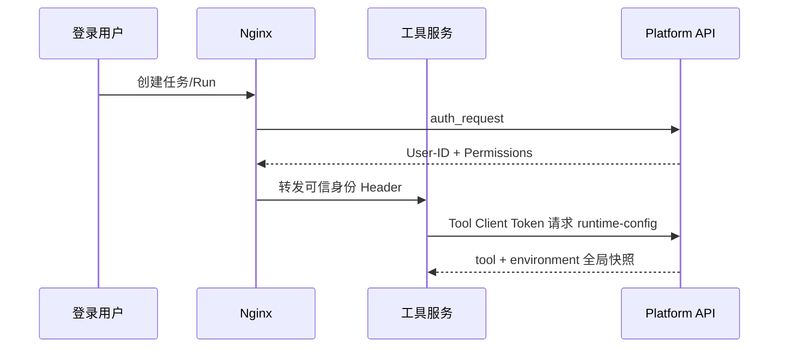
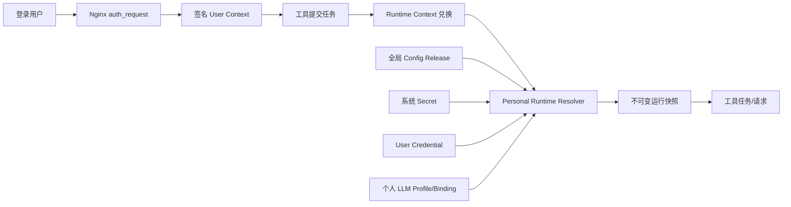
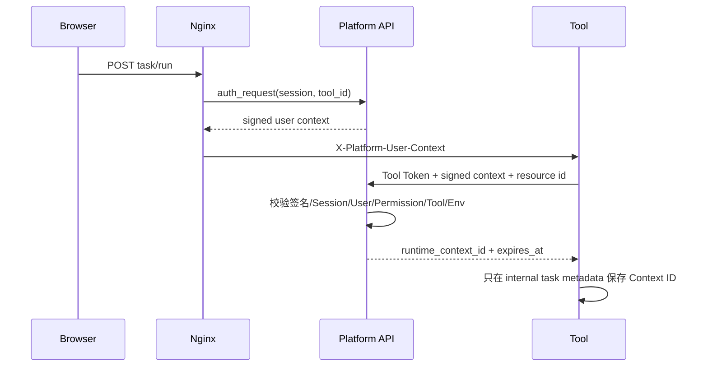

# 平台用户级凭证与 LLM 配置隔离开发设计

> 文档版本：V1.0
> 创建日期：2026-08-23
> 文档状态：待评审
> 需求依据：[PRD-平台用户级凭证与LLM配置隔离-V1.0.md](./PRD-平台用户级凭证与LLM配置隔离-V1.0.md)
> 实施计划：[DEV_PLAN-平台用户级凭证与LLM配置隔离-V1.0.md](./DEV_PLAN-平台用户级凭证与LLM配置隔离-V1.0.md)
> 目标仓库：`/Users/admin/Testproject`

---

## 1. 设计目标

本文把 PRD 的用户级隔离要求转换为数据库、API、运行时、工具适配、迁移和发布设计。核心目标是：

```text
同一环境内：系统配置共享，业务凭证按登录用户隔离。
```

实现必须同时满足：

- 个人数据不被现有全局 Resolver 查询；
- 工具不能自由声明另一个 `user_id`；
- 异步任务不把 Secret 或短期签名 Token 写入任务文件；
- 本机与线上已有业务凭证安全迁移给 `admin`；
- legacy 数据保留为首期兼容回滚资源；
- 不新增第三方依赖，不改变各工具核心业务流程。

---

## 2. 当前基线与根因

### 2.1 当前数据范围

当前主要唯一范围如下：

```text
Secret:      environment + owner_type + owner_id + definition
Credential:  environment + tool + provider_type
Activation:  environment + owner_type + owner_id
LLM Binding: tool + capability
```

这些范围没有登录用户。`created_by` 只用于审计，不表示资源所有权。

### 2.2 当前运行链路



网关和任务已经知道用户，但 `runtime-config` 只使用 Tool Client 的工具/环境信息，因此在最后一步丢失了用户主体。

### 2.3 不能直接在旧表增加 `user_id` 的原因

若在现有 `credentials` 表直接增加用户并写入多名用户数据，旧版 Resolver 回滚后仍会执行：

```text
WHERE tool_id = ? AND environment_id = ?
```

旧代码可能把多名用户的 CredentialItem 合并进同一响应。这与本期安全目标冲突，也使回滚不可控。

因此本设计采用**兼容隔离层**：

- 系统/legacy 数据继续留在现有表；
- 新个人 Credential 使用独立业务表；
- 新个人 Secret 仍复用现有加密原语，但使用旧 Resolver 不认识的 owner_type；
- 个人 LLM 复用 Profile/Release/Secret，增加所有权和个人 Binding 身份；
- 新 Resolver 显式忽略全局 Release 中的用户级字段。

---

## 3. 方案比较与选择

| 方案 | 优点 | 缺点 | 结论 |
|---|---|---|---|
| 所有配置表直接增加 `user_id` | 表数量少 | 旧 Resolver 可能混读；普通配置也被迫复制；回滚危险 | 不采用 |
| 每个用户复制完整配置中心 | 隔离直观 | Release、普通配置和系统 Secret 大量重复，超出需求 | 不采用 |
| 系统控制面 + Personal Overlay | 保留现有架构；个人数据独立；安全回滚；改动可分阶段 | 新增少量个人身份表和 Resolver 分支 | 采用 |

选定方案满足 PRD 已锁定的“普通配置全局、业务凭证个人”边界。

---

## 4. 总体架构

### 4.1 逻辑架构



### 4.2 组件职责

| 组件 | 新职责 |
|---|---|
| Platform API | 签发用户上下文、兑换 Runtime Context、管理个人资源、解析个人快照 |
| Nginx | 清除伪造 Header，转发平台签名用户上下文 |
| Tool Client | 继续证明工具/环境工作负载身份 |
| Runtime Context | 证明某个工具任务代表哪个已登录用户 |
| User Credential | 保存用户/工具/环境/Provider 的版本和状态 |
| Secret/SecretVersion | 继续保存加密值；个人 Secret 使用独立 owner_type |
| User LLM Binding | 把稳定能力目录映射到当前用户的个人 Profile |
| Credential Agent | 扫描、刷新和更新每名用户的 Credential |

### 4.3 信任边界

1. 浏览器提供的 `X-Platform-*` 一律不可信；
2. Nginx 只使用 `/internal/authorize` 返回的身份 Header；
3. Tool Client Token 只能证明工具，不能证明用户；
4. 短期签名 User Context 只能兑换一次或有限次 Runtime Context，不直接返回 Secret；
5. Runtime Context 必须与 Tool Client 的工具和环境一致；
6. 个人资源所有权只从服务端 Session/Context 推导；
7. 数据库和 KEK 同时可用时才能解密 Secret。

---

## 5. 配置分类设计

### 5.1 ConfigDefinition 扩展

在 `config_definitions` 增加：

| 字段 | 类型 | 默认值 | 说明 |
|---|---|---|---|
| `value_scope` | String(16) | `system` | `system` 或 `user` |
| `credential_provider_type` | String(64), nullable | `null` | 所属 Credential Provider；非 Credential 字段为空 |

约束：

```text
CHECK value_scope IN ('system', 'user')
credential_provider_type IS NOT NULL => owner_type = 'tool' AND value_scope = 'user'
```

运行时不得根据 key 名称推断作用域。

### 5.2 字段分类

#### Truthy Search

| Provider | 用户级字段 |
|---|---|
| `gateway_session` | `AUTH_TOKEN`、`REFRESH_TOKEN`、`EXPIRES_TIME`、`REFRESH_EXPIRES_TIME`、`DEVICE_ID`、`USER_ID`、`SEARCH_HTTP_HEADERS_JSON` |
| `admin_login` | `SEARCH_ADMIN_USERNAME`、`SEARCH_ADMIN_PASSWORD`、`SEARCH_ADMIN_HTTP_HEADERS_JSON` |

#### API AutoTest

| Provider | 用户级字段 |
|---|---|
| `gateway_session` | `AUTH_TOKEN`、`REFRESH_TOKEN`、`EXPIRES_TIME`、`REFRESH_EXPIRES_TIME`、`USER_ID`、`DEVICE_ID` |
| `admin_login` | `ADMIN_USERNAME`、`ADMIN_PASSWORD`、`ADMIN_SESSION_TOKEN`、`ADMIN_OPERATOR_ID`、`ADMIN_OPERATOR_NAME` |

#### LLM 与系统字段

- 旧 Agent 工具 Release 中的 `LLM_API_KEY` 标为 `user`，新 Resolver 不再从全局 Release 下发；
- LLM Profile/Binding 的 API Key 由个人资源所有权控制；
- Agent `DB_HOST/DB_PORT/DB_USER/DB_PASSWORD/DB_NAME` 保持 `system`；
- 平台、工具普通配置保持 `system`。

---

## 6. 数据库设计

### 6.1 新增 `user_credentials`

职责：个人 Credential 的状态、版本和刷新租约。

| 字段 | 类型 | 约束 |
|---|---|---|
| `id` | String(64) | PK，`ucred_<id>` |
| `user_id` | String(64) | FK `users.id`，非空 |
| `tool_id` | String(64) | FK `tools.id`，非空 |
| `environment_id` | String(32) | FK `environments.id`，非空 |
| `provider_type` | String(64) | 非空 |
| `status` | String(32) | 非空，默认 `missing` |
| `current_version` | Integer | 非空，默认 0 |
| `expires_at` | DateTime TZ | 可空 |
| `refresh_expires_at` | DateTime TZ | 可空 |
| `refresh_lease_until` | DateTime TZ | 可空 |
| `refresh_owner` | String(64) | 可空 |
| `last_error_code` | String(128) | 可空 |
| `last_checked_at` | DateTime TZ | 可空 |
| `created_at` | DateTime TZ | 非空 |
| `updated_at` | DateTime TZ | 非空 |

唯一约束：

```text
UNIQUE(user_id, tool_id, environment_id, provider_type)
```

索引：

```text
(environment_id, status, expires_at)
(user_id, environment_id, tool_id)
(refresh_lease_until, status)
```

### 6.2 新增 `user_credential_items`

职责：保存每个个人 Credential Version 的 SecretVersion 引用或非敏感元数据。

| 字段 | 类型 | 约束 |
|---|---|---|
| `id` | Integer | PK，自增 |
| `credential_id` | String(64) | FK `user_credentials.id`，级联删除 |
| `credential_version` | Integer | 非空 |
| `key` | String(128) | 非空 |
| `secret_version_id` | String(64) | FK `secret_versions.id`，可空 |
| `value_json` | JSON | 可空 |

唯一约束：

```text
UNIQUE(credential_id, credential_version, key)
```

个人 Secret 使用：

```text
Secret.owner_type = user_credential
Secret.owner_id   = user_credentials.id
```

旧 Resolver 只接受 `owner_type=tool`，因此无法读取个人 Secret。

### 6.3 修改 `llm_profiles`

增加：

| 字段 | 类型 | 约束 |
|---|---|---|
| `owner_user_id` | String(64) | FK `users.id`；数据库迁移过渡期允许空，新 API 禁止创建空所有者 |

唯一约束由全局名称改为：

```text
UNIQUE(owner_user_id, name_normalized)
```

Profile ID 仍全局唯一，Profile 的 ConfigDefinition、Release、Activation 和 Secret 继续使用现有表。`NULL` 只用于尚未执行 admin 数据迁移的 legacy Profile；个人 API 和新 Resolver 必须校验非空 `owner_user_id`，且不读取 `NULL` Profile。这样 0018 可先安全升级空库和旧库，再由应用迁移命令完成归属，避免在 Alembic 中解密或猜测用户。

### 6.4 新增 `user_llm_bindings`

职责：把稳定 `tool_llm_bindings` 能力目录映射为用户私有配置身份。

| 字段 | 类型 | 约束 |
|---|---|---|
| `id` | String(64) | PK，`ullmb_<id>` |
| `user_id` | String(64) | FK `users.id`，非空 |
| `binding_id` | String(64) | FK `tool_llm_bindings.id`，非空 |
| `created_at` | DateTime TZ | 非空 |
| `updated_at` | DateTime TZ | 非空 |

唯一约束：

```text
UNIQUE(user_id, binding_id)
```

创建时为该身份生成与现有 Binding 相同的 ConfigDefinition，作用域为：

```text
owner_type = user_llm_binding
owner_id   = user_llm_bindings.id
```

具体环境值继续由现有 ConfigRelease/Activation 区分。个人 API Key Override 使用：

```text
Secret.owner_type = user_llm_binding
Secret.owner_id   = user_llm_bindings.id
```

### 6.5 新增 `runtime_contexts`

| 字段 | 类型 | 约束 |
|---|---|---|
| `id` | String(64) | PK，至少 256 位随机强度，`rtx_<token>` |
| `user_id` | String(64) | FK `users.id`，非空 |
| `session_id` | String(64) | FK `platform_sessions.id`，非空 |
| `tool_id` | String(64) | FK `tools.id`，非空 |
| `environment_id` | String(32) | FK `environments.id`，非空 |
| `permission_version` | Integer | 非空 |
| `resource_type` | String(32) | 非空，`task/run/request` |
| `resource_id` | String(128) | 非空 |
| `status` | String(16) | `active/revoked/expired` |
| `expires_at` | DateTime TZ | 非空 |
| `created_at` | DateTime TZ | 非空 |
| `last_used_at` | DateTime TZ | 可空 |

索引：

```text
(tool_id, environment_id, status, expires_at)
(user_id, status, expires_at)
(session_id, status)
```

Runtime Context 不保存 Secret、签名 Token、权限列表或业务输入。

### 6.6 legacy 表策略

现有 `credentials`、`credential_items`、全局 `llm_binding` Release 和用户级工具 Secret 在本期保留为只读回滚资源：

- 新写操作不更新 legacy Credential；
- 新 Resolver 不读取 legacy 用户级值；
- 系统级 Config/Secret 继续正常使用；
- 回滚兼容版本可继续读取原 `admin` legacy 数据；
- 普通用户 Personal 数据不会出现在旧 Resolver 的查询范围。

### 6.7 Alembic 迁移

新增迁移：

```text
20260823_0018_add_user_credential_scopes.py
```

迁移只负责结构和非敏感元数据：

1. 扩展 ConfigDefinition；
2. 创建三张个人业务表和 Runtime Context 表；
3. 给 LlmProfile 增加 `owner_user_id` 并调整唯一约束；
4. 根据确定性键名标记 `value_scope` 和 `credential_provider_type`；
5. 旧 LLM Profile 的 `owner_user_id` 暂时保留为空，等待应用迁移命令归属 `admin`；
6. 新增权限 `platform.credential.readiness.view` 并授予平台管理员；
7. 不读取 KEK、不解密或复制真实 Secret；
8. Alembic 不依赖 `admin` 是否存在，保证空库可升级；唯一 `admin` 校验由应用迁移命令负责；
9. 支持空库和当前 `0017` 数据库升级。

---

## 7. User Context 与 Runtime Context

### 7.1 签名 Token

平台使用标准库 `hmac`、`hashlib`、`base64` 和规范 JSON，不新增 JWT 依赖。

Token 结构：

```text
base64url(canonical_json_claims).base64url(hmac_sha256(signature_key, payload))
```

Claims：

```json
{
  "v": 1,
  "sid": "sess_xxx",
  "uid": "usr_xxx",
  "pv": 3,
  "tid": "functional-test-agent",
  "env": "dev",
  "iat": 1787443200,
  "exp": 1787443500,
  "nonce": "random"
}
```

规则：

- 有效期固定不超过 300 秒；
- `tid` 来自授权接口的 `X-Tool-ID`，不来自浏览器；
- `env` 来自平台运行环境；
- 签名密钥来自独立只读文件 `USER_CONTEXT_SIGNING_KEY_FILE`；
- dev/prod 使用不同密钥；
- 不复用 Secret KEK、Bootstrap Token 或 Tool Client Token；
- 验证使用常量时间比较；
- Token 不写日志、审计、任务或数据库。

### 7.2 Nginx 转发

授权子请求增加：

```nginx
auth_request_set $platform_user_context $upstream_http_x_platform_user_context;
proxy_set_header X-Platform-User-Context $platform_user_context;
```

所有工具 location 都显式覆盖该 Header。浏览器自带同名 Header 不会传入工具。

### 7.3 Runtime Context 兑换



验证顺序：

1. Tool Client 有效且 URL tool_id 匹配；
2. 签名、版本、iat/exp、tool/env 匹配；
3. Session 未撤销且未过期；
4. User 为 active；
5. `permission_version` 与 Claims 一致；
6. 用户对工具仍具有 `tool.execute`；
7. resource_type/id 格式受白名单限制；
8. 创建最长 24 小时的 Runtime Context。

### 7.4 Runtime Context 使用

每次读取个人配置时重新检查：

- Context active 且未过期；
- User active；
- Session 未撤销；
- permission_version 未改变；
- Tool Client、tool_id、environment_id 一致；
- 用户仍具有工具执行权限。

使用成功只更新时间和脱敏审计。Context ID 在审计中仅记录不可反推的短摘要。

### 7.5 恢复与长任务

- 初始任务 Context TTL 覆盖队列等待和任务最大时长，硬上限 24 小时；
- Review 恢复、重新执行或延迟超过 TTL 时，必须在新的浏览器写请求中重新兑换 Context；
- 已启动子进程使用已注入的不可变快照，不继续调用 Context；
- 用户登出后，尚未加载 Secret 的排队任务失败；已经运行的任务按当前快照完成。

---

## 8. Secret 与加密设计

### 8.1 复用现有信封加密

个人 Secret 继续通过 `replace_secret()` 创建不可变 SecretVersion：

- 每版本独立 DEK；
- AES-256-GCM；
- KEK 只读文件；
- AAD 保持 `secret_id + environment_id + version`；
- dev/prod 独立 KEK；
- 保存后回读校验；
- 响应永不回显明文。

### 8.2 Personal Credential Secret

每个 UserCredential/definition 对应一个 Secret：

```text
environment_id = credential.environment_id
owner_type      = user_credential
owner_id        = credential.id
definition_id   = tool definition id
```

Resolver 在解密前必须校验 Secret、Credential、Runtime Context 的环境/工具/用户关联。

### 8.3 Personal LLM Secret

- Profile API Key：`owner_type=llm_profile`，Profile 自身验证 owner_user_id；
- Binding Override：`owner_type=user_llm_binding`，Binding 验证 user_id；
- 用户 A 的 Binding 不能引用用户 B 的 Profile；
- Profile/Binding Release 发布时冻结当前 SecretVersion；
- 运行快照记录 Secret Version ID/版本，不记录明文。

### 8.4 脱敏

禁止输出：

- 明文、长度、前后缀、哈希或可比指纹；
- User Context Token；
- Runtime Context ID 全值；
- Authorization Header；
- Provider 原始响应正文；
- 密文、nonce、wrapped DEK、KEK 版本组合。

允许输出配置状态、业务版本、过期时间、稳定错误码和资源 ID。

---

## 9. 公共 API 设计

所有接口沿用 Cookie Session、CSRF、统一错误结构和 `request_id`。

### 9.1 我的凭证

```text
GET  /api/v1/me/credentials?environment_id=dev
PUT  /api/v1/me/credentials/{tool_id}/{provider_type}
POST /api/v1/me/credentials/{credential_id}/validate
```

PUT 请求：

```json
{
  "environment_id": "dev",
  "expected_version": 0,
  "values": {
    "AUTH_TOKEN": "new value",
    "REFRESH_TOKEN": "new value",
    "DEVICE_ID": "device",
    "USER_ID": "upstream-user"
  }
}
```

规则：

- 首次创建 `expected_version=0`；
- 更新必须等于当前 Credential Version；
- 字段必须属于目标 tool/provider 且 `value_scope=user`；
- 未提交的已配置字段沿用当前版本；
- 必填字段在首次保存时必须齐全；
- 所有 Secret Version 和 Credential Version 在一个事务中激活；
- 响应不返回 `values`。

响应：

```json
{
  "id": "ucred_xxx",
  "tool_id": "truthy-search",
  "environment_id": "dev",
  "provider_type": "gateway_session",
  "status": "pending_validation",
  "current_version": 1,
  "expires_at": null,
  "refresh_expires_at": null,
  "last_checked_at": null,
  "last_error_code": null,
  "fields": [
    {"key": "AUTH_TOKEN", "display_name": "检索 Access Token", "required": true, "configured": true},
    {"key": "REFRESH_TOKEN", "display_name": "检索 Refresh Token", "required": true, "configured": true}
  ]
}
```

### 9.2 我的 LLM

```text
GET    /api/v1/me/llm/profiles?environment_id=dev
POST   /api/v1/me/llm/profiles
PATCH  /api/v1/me/llm/profiles/{profile_id}
POST   /api/v1/me/llm/profiles/{profile_id}/archive
POST   /api/v1/me/llm/profiles/{profile_id}/restore

GET    /api/v1/me/llm/bindings?environment_id=dev
PUT    /api/v1/me/llm/bindings/{binding_id}
POST   /api/v1/me/llm/test-connection
```

Profile/Binding 参数继续复用 Config Release/Secret 接口，但授权规则调整为：

- `llm_profile` 必须属于当前用户；
- `user_llm_binding` 必须属于当前用户；
- 当前用户必须具有目录 Binding 对应工具的 `tool.execute`；
- 请求体不接受 owner_user_id；
- 他人资源返回 404。

现有 `/api/v1/llm/*` 管理接口在迁移期只服务 legacy/管理员兼容，不作为个人页面数据源。

### 9.3 管理员就绪度

```text
GET /api/v1/admin/credential-readiness?environment_id=dev&user_id=&tool_id=&status=
```

需要 `platform.credential.readiness.view`。响应只包含用户、工具、Provider、状态、配置计数、版本、过期时间、最近检查和错误码。

---

## 10. 内部 API 设计

### 10.1 签发 Header

`GET /api/v1/internal/authorize` 响应增加：

```text
X-Platform-User-Context: <signed-short-lived-token>
```

### 10.2 兑换 Runtime Context

```http
POST /api/v1/internal/tools/{tool_id}/runtime-contexts
Authorization: Bearer <tool-client-token>
X-Platform-User-Context: <signed-token>
Content-Type: application/json

{
  "resource_type": "task",
  "resource_id": "task_xxx"
}
```

响应：

```json
{
  "runtime_context_id": "rtx_xxx",
  "expires_at": "2026-08-24T10:00:00Z"
}
```

### 10.3 运行配置

运行时采用“规划快照 → 执行时物化”两阶段，避免把明文 Secret 写入排队任务，同时保证已选版本不漂移。

第一阶段扩展现有接口，只返回非敏感引用：

```http
GET /api/v1/internal/tools/{tool_id}/runtime-config
    ?runtime_context_id=rtx_xxx
    &include_secrets=false
    &llm_capability=default
```

规则：

- 指定 `llm_capability` 时仍必须提供 Runtime Context，但 `include_secrets=false` 不加载 KEK；
- 无 Context 且 `include_secrets=false` 时只返回全局普通配置和系统 Secret 配置状态；
- Runtime Context 的用户决定 Personal Credential 和 LLM；
- 响应设置 `Cache-Control: no-store`；
- 响应新增 `subject_user_id`、`runtime_context_expires_at` 和个人 Credential 元数据；
- 响应中的 `snapshot_selector` 只包含 Release ID、Credential ID/Version、Profile/Binding Release ID 和 Secret Version ID，不含明文。

第二阶段在任务真正开始时物化已规划版本：

```http
POST /api/v1/internal/tools/{tool_id}/runtime-config/materialize
Authorization: Bearer <tool-client-token>
Content-Type: application/json

{
  "runtime_context_id": "rtx_xxx",
  "snapshot_selector": {
    "release_id": "rel_tool",
    "credential_versions": {"ucred_xxx": 3},
    "llm_binding_release_id": "rel_binding",
    "llm_profile_release_id": "rel_profile"
  }
}
```

物化规则：

- 重新校验 Runtime Context、Session、权限版本、工具和环境；
- 所有 Selector 对象再次按 `context.user_id` 查询，不能仅信任客户端 ID；
- 精确读取已规划的历史版本，不静默换成最新版本；
- 版本不存在、已损坏或与 Context 不匹配时返回 `RUNTIME_SNAPSHOT_INVALID`；
- Personal Secret 只在授权响应和运行进程内存中出现，不写入任务记录；
- 同步工具可在一个请求内连续完成规划和物化，排队工具必须分两阶段。

### 10.4 状态和 Session 写回

以下请求增加 `runtime_context_id`：

```text
POST /api/v1/internal/tools/{tool_id}/credential-status
PUT  /api/v1/internal/tools/{tool_id}/user-credentials/{credential_id}/session
```

校验：

```text
credential.user_id        == context.user_id
credential.tool_id        == client.tool_id == URL tool_id
credential.environment_id == client.environment_id == context.environment_id
```

写回继续使用 `expected_version`，防止旧任务覆盖用户新版本。

---

## 11. Runtime Resolver

### 11.1 系统快照

读取当前工具 active Release：

- 普通字段按现有逻辑返回；
- `value_scope=system` 的 Secret 可以按现有 Release 冻结版本返回；
- `value_scope=user` 的全局 Secret Item 一律忽略；
- 默认值仅用于普通系统字段。

### 11.2 个人 Credential

按 `(context.user_id, tool_id, environment_id)` 查询 UserCredential，逐 Provider 展开当前版本：

- SecretVersion 必须属于 `owner_type=user_credential` 且 owner_id 为当前 Credential；
- `include_secrets=false` 只返回 configured keys；
- Gateway Session 继续作为主会话元数据；
- Admin Login 只进入 provider metadata，不覆盖 Gateway 主会话；
- 缺失字段由工具按操作需要映射为 `PERSONAL_CREDENTIAL_NOT_CONFIGURED`。

### 11.3 个人 LLM

解析顺序：

1. 根据 `tool_id + capability_key` 找稳定 ToolLlmBinding；
2. 根据 `context.user_id + binding.id` 找 UserLlmBinding；
3. 读取当前环境 `owner_type=user_llm_binding` 的 active Release；
4. 读取 `PROFILE_ID`；
5. 校验 Profile 存在、未归档且 `owner_user_id=context.user_id`；
6. 读取当前环境 Profile active Release；
7. 合并 Profile 和 Binding 覆盖；
8. 选择 Binding Override 或 Profile API Key；
9. 生成包含 `user_id`、Release 和 SecretVersion 的 snapshot fingerprint；
10. `include_secrets=true` 时才解密 Key。

无个人 Binding/Profile 时返回 `PERSONAL_LLM_NOT_CONFIGURED`，不读取 legacy global Binding。

### 11.4 快照内容

```json
{
  "subject_user_id": "usr_xxx",
  "release_id": "rel_tool",
  "normal": {},
  "secrets": {},
  "credential_metadata": {
    "providers": {
      "gateway_session": {
        "credential_id": "ucred_xxx",
        "credential_version": 3,
        "status": "healthy"
      }
    }
  },
  "llm": {
    "profile_id": "llmp_xxx",
    "profile_release_id": "rel_xxx",
    "binding_id": "ullmb_xxx",
    "binding_release_id": "rel_xxx",
    "snapshot_id": "llms_xxx",
    "model": "model-name",
    "api_key_configured": true
  }
}
```

工具任务记录只保存上述非敏感 ID/版本和模型名，不保存 `secrets` 或 `api_key`。

快照生命周期固定为：

1. 创建任务时用 `include_secrets=false` 规划并持久化 `snapshot_selector`；
2. 排队期间不解密 Secret；
3. 执行开始时用有效 Runtime Context 物化一次，并只保存在执行进程内存；
4. 用户在第 3 步前登出或权限变化，物化失败；
5. 第 3 步后轮换 Key 不影响当前运行任务，新任务选择新版本。

---

## 12. Credential 生命周期设计

### 12.1 Agent 扫描

Credential Agent 改为扫描 `user_credentials`：

```text
status IN (pending_validation, healthy, expiring, expired, action_required)
AND refresh_lease_until 可获取
```

使用 `FOR UPDATE SKIP LOCKED` 和短事务；外部调用期间只保留租约，不持有数据库事务。

### 12.2 输入解析

`_definition_maps()` 按 Credential 的 tool/provider 读取：

```text
ConfigDefinition.owner_type = tool
ConfigDefinition.owner_id = credential.tool_id
ConfigDefinition.value_scope = user
ConfigDefinition.credential_provider_type = credential.provider_type
```

`_runtime_inputs()` 只读取当前 Credential 版本引用的 Secret，不扫描同工具其他用户的 Secret。

### 12.3 原子激活

刷新或登录成功后：

1. 重新锁定 UserCredential；
2. 校验 `current_version == expected_version`；
3. 为新值创建 owner 为该 UserCredential 的 SecretVersion；
4. 写入 `user_credential_items` 新版本；
5. 更新状态、过期时间和 `current_version`；
6. 清除租约；
7. 同事务写脱敏审计。

### 12.4 故障隔离

- 单条 Credential 失败只更新自身 `last_error_code`；
- 上游异常不输出响应正文；
- 认证失败和网络失败使用不同稳定错误；
- 其他用户和 Provider 继续扫描；
- legacy Credential Agent 写入路径停用。

---

## 13. 平台前端设计

### 13.1 路由

```text
/account/credentials   我的凭证
/account/llm           我的 LLM
/settings/credentials  管理员就绪度
/settings/llm          迁移期重定向 /account/llm
```

### 13.2 我的凭证页面

- 复用环境选择器、PageHeader、InlineMessage、StatusBadge 和现有对话框；
- 环境选择器只展示后端授权且存在于当前部署的环境命名空间；选择环境绝不跨数据库访问，本机与线上仍分别使用自己的数据库、KEK 和签名密钥；
- 按工具/Provider 卡片展示；
- 字段来自后端白名单，不在前端硬编码 Secret 值；
- 保存发送 `expected_version`；
- 成功后清空输入状态并重新请求元数据；
- 冲突时保留未提交输入但提示刷新确认；
- 页面卸载、登出和 Session 过期时清空输入；
- 不写 localStorage/sessionStorage。

### 13.3 我的 LLM 页面

现有 LLM 页面从“公共 Profile”调整为“我的 LLM 连接”：

- Profile 列表只返回当前用户；
- 工具 Binding 只显示用户具有 `tool.execute` 的能力；
- 保留草稿、revision、校验、发布、回滚和连接测试；
- 页面明确显示“仅你的任务使用”；
- 管理员 Host 白名单仍在系统配置页面维护。

### 13.4 管理员就绪度

- 只读表格；
- 支持用户、环境、工具、Provider、状态筛选；
- 不提供 Secret 编辑入口；
- 不展示字段级指纹；
- 无 `platform.credential.readiness.view` 时路由返回 403。

### 13.5 可访问性

- Label 与输入一一关联；
- 状态文本与图标并存；
- 对话框初始焦点、Esc 关闭和焦点返回；
- 保存/验证结果通过受控 `aria-live` 报告；
- 支持 reduced-motion；
- 桌面最小宽度 1280px。

---

## 14. 工具改造设计

### 14.1 公共工具行为

所有需要个人配置的工具执行：

1. 从可信请求 Header 读取签名 User Context；
2. 生成任务/Run/请求资源 ID；
3. 使用 Tool Client 兑换 Runtime Context；
4. 只保存 Runtime Context ID；
5. 用 Context ID 读取个人快照；
6. 快照只加载一次；
7. 不把签名 Token、Context ID 全值或 Secret 记录到日志。

### 14.2 功能测试智能体

涉及：

- `services/common/identity.py`：在内部 Identity 增加 `user_context_token`；
- `services/common/platform_client.py`：增加 Context 兑换和带 Context 的 runtime_config；
- `services/common/web.py`：创建/恢复/AI Review 请求时签发或更新 Context；
- `services/common/task_manager.py`：`ConfigLoader` 改为接收 Runtime Context ID；
- 任务 `internal` 保存 `runtime_context_id`，公共任务响应不包含；
- Runner 环境继续只注入白名单 Secret；
- `config_history` 增加用户/个人版本元数据，不保存 Context ID。

### 14.3 API 测试智能体

规则与功能智能体一致。Controller/Executor/Egress Proxy 不获得不需要的个人 API Key；只有实际模型进程获得 LLM Secret。

### 14.4 日志 AI

- `/people-search/analyze` 从 Nginx Header 获取签名 Context；
- 每次分析最多兑换一次 Context、读取一次个人 LLM 快照；
- 规则分析不依赖个人 LLM；
- Context/平台/LLM 失败时规则报告正常，`data.ai.status=FAILED`；
- 平台模式不回退 Compose Key；
- 独立模式继续使用 env/key file。

### 14.5 Truthy Search

- 创建 Run 前用当前请求 Header 兑换 Context；
- `prepare_run_client(runtime_context_id)` 读取当前用户 Credential；
- Run 记录用户 ID、Credential Version、Release ID 和 Context 的内部引用；
- 已构造 SearchClient 后后台线程不重新读取；
- Admin 状态上报携带 Runtime Context ID；
- 个人 Credential 缺失时 Run 不创建；
- 独立模式继续读取 `.env`。

### 14.6 API AutoTest

- 提交任务时保存创建用户和 Runtime Context ID；
- `runtime_environment_provider(runtime_context_id)` 获取个人快照；
- pytest 子进程只获得本任务个人 Credential 和版本；
- Session 写回携带 Context ID 并更新 UserCredential；
- 任务级 Admin 预检使用当前用户 configured keys；
- 独立模式继续读取原配置；
- 平台模式不读取或写入 `.env.platform`。

### 14.7 TrackEvents

该工具没有个人 Credential 或 LLM 调用，不改核心代码。Nginx 可以转发签名 Header，但工具不得记录它。

---

## 15. 授权设计

### 15.1 个人资源

个人资源不新增“管理他人”权限。授权条件为：

```text
current_user.active
AND resource.user_id == current_user.id
AND has_tool_permission(current_user, 'tool.execute', target_tool)
```

个人 Profile CRUD 允许活跃用户执行；个人 Binding 仍要求目标工具 `tool.execute`。

### 15.2 管理员资源

新增：

```text
platform.credential.readiness.view
```

只授予 `role_platform_admin`。其他现有角色不自动获得。

### 15.3 资源枚举防护

- 个人详情接口不接受 user_id；
- 他人 ID 与不存在 ID 均返回 404；
- 管理员聚合接口不返回 Secret ID/Version ID 明细；
- 审计查看仍要求 `platform.audit.view`。

---

## 16. 审计与错误设计

### 16.1 审计事件

新增事件沿用 PRD 第 10 节。事件 `metadata` 只允许：

- environment/tool/provider/capability；
- subject user ID；
- Credential/Profile/Binding ID；
- old/new version；
- outcome、duration、stable error code；
- resource_type 和脱敏 resource_id 摘要。

### 16.2 错误码

除 PRD FR-9 新增的稳定错误码外，继续复用：

```text
AUTH_REQUIRED
ACCOUNT_DISABLED
PERMISSION_DENIED
CSRF_INVALID
SECRET_UNAVAILABLE
TOOL_CLIENT_UNAUTHORIZED
TOOL_CLIENT_FORBIDDEN
LLM_TARGET_NOT_ALLOWED
LLM_CONNECTION_FAILED
```

内部错误只提供安全用户提示和 request_id。

---

## 17. 现有数据迁移设计

### 17.1 为什么分为 Schema 迁移和应用迁移

Alembic 不应读取 KEK，也不能安全处理真实 Secret。迁移分成：

1. Alembic：建表、字段、索引、权限、分类和 LLM 所有权；
2. 应用命令：在应用安全上下文中解密 legacy 值并重新加密为 Personal Secret。

### 17.2 管理命令

新增：

```text
python -m app.migrate_personal_credentials --environment dev --dry-run
python -m app.migrate_personal_credentials --environment dev --apply
```

prod 在对应生产数据库和 KEK 上单独执行。

### 17.3 确定性 ID

为保证幂等，迁移对象使用不暴露 Secret 的确定性 ID：

```text
UserCredential: sha256(user_id|environment|tool|provider)
UserLlmBinding: sha256(user_id|catalog_binding_id)
Personal Secret: sha256(owner_type|owner_id|definition_id|environment)
```

只截取固定长度作为内部 ID；命令输出不打印完整摘要。

### 17.4 Credential 导入算法

1. 查询唯一 active `admin`；
2. 按工具/环境/Provider 创建或查找 UserCredential；
3. 优先从 legacy Credential 当前版本读取对应字段；
4. 缺失字段再从 active Tool Release 的 legacy Secret Item 读取；
5. 在内存中解密；
6. 创建 owner_type 为 `user_credential` 的新 Secret/SecretVersion；
7. 创建 UserCredentialItem 和 Credential Version；
8. 复制状态、过期时间和最近检查；
9. 同事务写审计；
10. 不修改 legacy 行。

### 17.5 LLM 导入算法

1. Alembic 已将现有 Profile 所有权设为 admin；
2. 为 admin 和三个真实 catalog binding 创建 UserLlmBinding；
3. 克隆当前环境 global Binding 的普通 Release Items 到个人 Binding 草稿/active Release；
4. Profile Release 和 Profile Secret 可继续复用，因为 Profile 已明确归 admin；
5. global Binding API Key Override 若存在，在内存解密并重新加密到个人 Binding Secret；
6. 新个人 Binding Activation 指向克隆 Release；
7. legacy Binding/Activation 保持不变。

### 17.6 dry-run 输出

允许输出：

```text
environment、tool、provider、source found/missing、target exists/new、version、可迁移/冲突
```

禁止输出值、长度、前后缀、哈希、差异指纹、密文或完整 Secret ID。

### 17.7 冲突规则

- 目标不存在：创建；
- 目标由迁移命令创建且源版本未变：跳过；
- admin 已在个人页面更新目标：拒绝覆盖并报告冲突；
- 任意必填源值损坏：整个当前环境事务回滚；
- 迁移后只创建/激活个人副本，不删除 legacy。

---

## 18. 发布与回滚设计

### 18.1 功能开关

新增平台系统配置：

```text
PERSONAL_CREDENTIALS_ENABLED=false|true
PERSONAL_CREDENTIALS_WRITE_ENABLED=false|true
```

第一项控制 Runtime Resolver，第二项控制普通用户写入口。开关是版本化系统配置，prod 默认 false，不能通过环境变量绕过。

### 18.2 dev 发布顺序

1. 备份 PostgreSQL、KEK、任务、报告和 legacy Secret 文件；
2. 生成 dev User Context 签名密钥；
3. 执行 0018；
4. 发布 Platform API，保持两个开关 false；
5. 发布 Nginx User Context Header；
6. 发布所有工具兼容镜像；
7. 执行迁移 dry-run/apply；
8. 开启 Personal Resolver，保持写入口 false；
9. 验证 admin 全链路；
10. 开启写入口；
11. 双用户验收和安全哨兵；
12. 更新 README、接口文档和版本记录。

### 18.3 prod 发布顺序

prod 重复 dev 已验证流程，要求：

- 独立备份和签名密钥；
- 无运行中 Run/任务；
- 0018 在生产恢复副本演练通过；
- dry-run 输出经双人确认；
- admin 只读最小任务验证后才开启写入口。

### 18.4 回滚矩阵

| 阶段 | 可回滚目标 | 数据处理 |
|---|---|---|
| 写入口开启前 | 上一 legacy 镜像 | Personal 表保留；legacy 数据未变 |
| 仅 admin 已迁移 | 支持/不支持 Personal 的兼容镜像 | 优先关闭开关，不 downgrade |
| 普通用户已写入 | 仅支持 Personal Schema 的上一兼容镜像 | 禁止回滚到旧 Resolver |

任何阶段都不默认删除个人表、SecretVersion、KEK 或审计。

---

## 19. 测试设计

### 19.1 后端

- ConfigDefinition 分类和非法组合约束；
- UserCredential 唯一范围、乐观锁和字段白名单；
- A/B 用户列表、详情、写入、验证和 IDOR；
- 个人 LLM Profile 名称范围、所有权和跨用户引用；
- UserLlmBinding Release、Secret Override 和 dev/prod 隔离；
- User Context 签名、篡改、过期、tool/env/audience；
- Runtime Context Session/权限版本/禁用/过期校验；
- Runtime Resolver 忽略 global user-scope Secret；
- include_secrets=false 不加载 KEK；
- Credential Agent 多用户刷新与失败隔离；
- Session 写回 scope/expected_version；
- 管理员就绪度脱敏；
- 审计和错误脱敏。

### 19.2 数据库与迁移

- 空库升级和 0017 → 0018；
- admin 不存在时失败；
- 分类、表、索引、FK、唯一约束和权限种子；
- dry-run 无写入；
- apply 幂等；
- legacy 值重新加密到 admin Personal；
- Personal 更新后重跑不覆盖；
- migration output 哨兵扫描；
- legacy 表无修改；
- downgrade 门禁不误删个人数据。

### 19.3 前端

- 个人路由所有登录用户可见；
- 工具执行权限过滤；
- Secret 不回显、不持久化；
- expected_version 冲突；
- 个人 Profile/Binding；
- 管理员就绪度权限；
- 加载、空、错误、缺失、临期、失败；
- 键盘和焦点。

### 19.4 工具

- Header 不进入日志/任务文件；
- 每个任务只兑换一个 Context、读取一次快照；
- 两个用户任务使用不同版本；
- 恢复任务重新兑换 Context；
- 平台模式无 admin/env fallback；
- 独立模式回归；
- 日志规则报告降级；
- Truthy Search/API AutoTest Session 写回对应用户。

### 19.5 端到端

最小双用户矩阵：

```text
admin：迁移后的旧凭证 + LLM A
user-b：新建个人凭证 + LLM B
```

分别验证功能智能体、API 智能体、日志 AI、Truthy Search 和 API AutoTest。用唯一哨兵检查数据库普通列、API、Nginx/FastAPI/工具日志、审计、任务、报告和浏览器存储。

---

## 20. 文件影响范围

### 20.1 平台后端

```text
test-platform/backend/app/models/configuration.py
test-platform/backend/app/models/identity.py
test-platform/backend/app/models/llm.py
test-platform/backend/app/schemas/configuration.py
test-platform/backend/app/schemas/internal.py
test-platform/backend/app/schemas/llm.py
test-platform/backend/app/schemas/admin.py
test-platform/backend/app/api/configuration.py
test-platform/backend/app/api/internal.py
test-platform/backend/app/api/llm.py
test-platform/backend/app/api/admin.py
test-platform/backend/app/services/llm.py
test-platform/backend/app/services/secret_store.py
test-platform/backend/app/core/config.py
test-platform/backend/app/core/security.py
test-platform/backend/app/core/permissions.py
test-platform/backend/app/jobs/credential_agent.py
test-platform/backend/app/migrate_personal_credentials.py            # 必需的一次性安全迁移命令
test-platform/backend/alembic/versions/20260823_0018_add_user_credential_scopes.py
```

### 20.2 平台前端与网关

```text
test-platform/frontend/src/App.tsx
test-platform/frontend/src/App.test.tsx
test-platform/frontend/src/types/platform.ts
test-platform/frontend/src/app.css
test-platform/frontend/src/components/AppShell.tsx
test-platform/nginx/nginx.conf
test-platform/docker-compose.yml
test-platform/docker-compose.prod.yml
```

### 20.3 工具

```text
functional-test-agent/services/common/identity.py
functional-test-agent/services/common/platform_client.py
functional-test-agent/services/common/web.py
functional-test-agent/services/common/task_manager.py

api-test-agent/services/common/identity.py
api-test-agent/services/common/platform_client.py
api-test-agent/services/common/web.py
api-test-agent/services/common/task_manager.py

log_filter_tool/app.py
log_filter_tool/people_search_ai.py

Truthy_Search/web_app.py

Truthy_ApiAutoTest2/web/app.py
Truthy_ApiAutoTest2/web/task_manager.py
Truthy_ApiAutoTest2/test_cases/conftest.py
```

只在职责无法放入现有文件时创建 Alembic 和一次性迁移命令两个必需文件，不新增抽象层或第三方依赖。

---

## 21. PRD 可追踪矩阵

| PRD | 设计章节 |
|---|---|
| FR-1 | 5、6.1/6.2、9.2、13.2 |
| FR-2 | 6、8.3、9、15 |
| FR-3 | 7、10.1/10.2、14、15 |
| FR-4 | 10.3、11 |
| FR-5 | 6.1/6.2、10.4、12 |
| FR-6 | 6.3/6.4、8.3、9.2、11.3、13.3 |
| FR-7 | 9.3、13.4、15.2 |
| FR-8 | 6.7、17、18 |
| FR-9 | 16 |
| AC-1 | 6.1/6.2、9.2、11、19.1/19.5 |
| AC-2 | 9.2、11.2、19.1/19.5 |
| AC-3 | 9、15、19.1 |
| AC-4 | 6.3/6.4、10.3、11.3/11.4、19.1/19.5 |
| AC-5 | 7.2/7.3、15、19.1/19.5 |
| AC-6 | 7.3/7.4、10.3、11.2、19.1 |
| AC-7 | 7.5、10.3、11.4、19.4/19.5 |
| AC-8 | 10.3、11.4、14、19.4/19.5 |
| AC-9 | 12、19.1/19.5 |
| AC-10 | 8.4、10.3、11.1/11.3、19.1 |
| AC-11 | 17、18.2、19.2/19.5 |
| AC-12 | 6、7.1、17、18、19.2/19.5 |
| AC-13 | 9.3、13.4、15.2、19.1/19.3 |
| AC-14 | 2、6.2、17.4、18.4、19.2 |
| AC-15 | 8、13、16、17、19 |

---

## 22. 完成定义

只有以下条件全部满足才可宣布完成：

1. PRD FR-1～FR-9 均有实现和自动化证据；
2. AC-1～AC-15 全部通过；
3. admin 本机/线上迁移连续性验证通过；
4. 双用户、双环境、跨工具和跨 Profile 隔离测试通过；
5. legacy Resolver 无法查询 Personal Credential/Secret；
6. 个人写入口开启后仍具备兼容版本回滚路径；
7. Secret 哨兵在全部禁止位置为零；
8. 工具独立模式和全量回归无新增失败；
9. 数据库迁移、Nginx、Compose、前端构建和桌面验收通过；
10. README、接口文档、环境密钥说明和发布/回滚记录同步更新。
