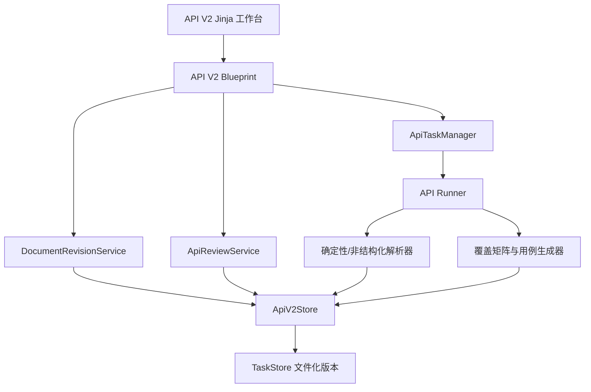

# API 测试智能体执行前阶段优化 V2.1 详细开发设计与计划

> 文档版本：V2.1
> 文档状态：待实施
> 产品依据：`PRD-API测试智能体执行前阶段优化-V2.1.md`
> 实施范围：确认分析范围、契约 Review、覆盖矩阵与基础用例 Review
> 实施边界：真实执行前，不修改真实执行安全门禁

## 1. 文档目标

本文档把 V2.1 PRD 转化为可编码、可测试、可灰度和可回滚的开发设计。重点解决：

1. 在原任务中查看和修订接口文档；
2. 重新确认分析范围并创建新的分析 Attempt；
3. 对冲突与未解决项进行字段级修改、补证和复核；
4. 修复覆盖矩阵响应结构错误和非标准 503；
5. 完善覆盖矩阵与基础用例 Review；
6. 保持所有旧版本可追溯，并阻止过期产物进入执行预览；
7. 为 P2 的数据库元数据与对象存储迁移预留明确边界，但本期不执行迁移。

## 2. 已确认产品决策

- 两个优化阶段均属于真实执行前阶段；
- 原始上传版本不可变，修改必须创建新的文档修订版本；
- 用户可在原任务内重新分析，不需要重新创建任务；
- 重新分析创建新的 `GenerationAttempt`，不覆盖旧 Attempt；
- 下游旧矩阵、基础用例和可执行用例标记为 `stale`，不删除；
- 旧 Run、报告和 Bug 草稿保持原终态和来源版本；
- 人工确认事实必须保存为 `human_override`，不能伪装成原文事实；
- 管理员、测试开发和测试人员均可逐条确认高风险基础用例；
- 现有“测试执行者”角色已有 `case.review` 与 `execute`，本期不新增权限迁移；
- P0、P1 继续使用文件化版本存储；
- P2 再独立实施 PostgreSQL 元数据与对象存储迁移；
- PRD 风险处理建议全部接受，作为强制开发约束；
- 不修改 `API_EXECUTION_ENABLED`、目标登记、容器、Egress 或最终执行确认逻辑。

## 3. 现有实现基线与根因

### 3.1 当前调用链

```text
Flask/Jinja 任务详情页
  └─ api-v2-workbench.js
      ├─ GET /contracts
      ├─ PUT /contracts/review
      ├─ POST /cases/generate
      ├─ GET /cases
      └─ PUT /cases/review

API Blueprint
  ├─ ApiReviewService
  ├─ ApiTaskManager
  ├─ API Runner
  └─ ApiV2Store / TaskStore
```

### 3.2 现有关键文件

| 文件 | 当前职责 | V2.1 改动方向 |
| --- | --- | --- |
| `services/api_agent/models.py` | V2 Schema 与状态 | 增加文档、范围、问题和版本状态模型 |
| `services/api_agent/v2_store.py` | 版本、Attempt、Run 文件存储 | 支持文档/范围版本和有效性元数据 |
| `services/api_agent/review_service.py` | 契约、用例 Review | 增加问题解决、复核和高风险角色规则 |
| `services/api_agent/blueprint.py` | API V2 路由 | 增加文档、范围、重新分析和问题接口；规范 `/cases` |
| `services/api_agent/task_manager.py` | 阶段排队与状态校验 | 增加重新分析入队与幂等控制 |
| `services/api_agent/runner.py` | 解析、用例、可执行用例阶段 | 读取文档/范围版本并处理下游失效 |
| `agents/api_test/contracts/unstructured_parser.py` | 非结构化文档解析 | 输出精确行号/字符范围 Evidence |
| `agents/api_test/contracts/quality_gate.py` | Grounding 和硬门禁 | 识别人工证据及已解决问题 |
| `services/api_agent/templates/task_detail.html` | 阶段工作台结构 | 增加原文、范围、问题解决和影响预览区域 |
| `services/common/static/api-v2-workbench.js` | 工作台交互 | 修复矩阵结构，增加修订/重分析/复核交互 |
| `services/common/static/api-v2-workbench.css` | API 工作台样式 | 增加编辑器、Diff、问题卡和 stale 状态 |

### 3.3 `coverage.filter` 根因

当前 `/cases` 返回：

```text
coverage.items                -> Coverage 版本信封中的 items 对象
coverage.items.items          -> 真正的 CoverageMatrixItem 数组
```

前端却执行：

```text
const coverage = cases.coverage?.items || []
coverage.filter(...)
```

因此 `coverage` 实际为对象，调用 `filter()` 报错。修复必须统一服务端响应 Schema，并在前端增加数组校验；不能只把前端路径临时改成 `items.items`，否则会继续固化含义不清的双层结构。

### 3.4 `REQUEST_FAILED (503)` 根因边界

前端请求封装仅在响应为标准 JSON 时读取业务错误码。任何返回 503 且没有 `{error:{code,message}}` 的响应，都会显示通用 `REQUEST_FAILED`。

需分别处理：

- 业务前置条件未完成：返回阶段状态或 409；
- 产物生成中：返回 `stage_state=generating`；
- 产物不存在：返回 `not_generated`，不抛服务故障；
- 平台配置、上游服务或代理不可用：才返回 503；
- 所有应用层 503 返回统一 JSON 和 `request_id`；
- Nginx 级 502/503 由网关补充统一错误页无法解决 JSON 契约时，前端显示“服务暂时不可用”，并保留 HTTP 状态和请求 ID。

### 3.5 当前存储

当前 `ApiV2Store` 将契约、矩阵、基础用例和可执行用例保存为任务目录内的版本化 JSON。平台 PostgreSQL 只管理平台侧账号、角色、权限和配置，不是 API Agent 用例内容的事实来源。

本期在现有架构上做增量实现，避免把功能修复与存储迁移绑定。

## 4. 总体设计

### 4.1 组件关系



### 4.2 最小模块调整

新增一个 API 专属服务文件：

```text
services/api_agent/document_service.py
```

职责只包括文档修订、范围版本、影响预览、重新分析准备和问题 Evidence 绑定。契约字段修改仍保留在 `ApiReviewService`，避免重复实现 Review 版本控制。

不新增前端框架、数据库表、后台队列组件或通用工作流引擎。

### 4.3 一致性原则

- 文档、范围、契约、矩阵和用例均采用追加版本；
- 每次派生物保存来源版本和 SHA；
- 页面所有写请求携带 `base_version`；
- 新 Attempt 开始前只更新“处理中”状态，不提前切换当前有效版本；
- 新阶段产物原子保存成功后再切换当前版本指针；
- 任一失败不清理旧版本或旧有效指针；
- 执行预览按当前有效版本链逐级校验 SHA。

## 5. 数据模型设计

### 5.1 DocumentRevision

在 `models.py` 增加严格 Pydantic 模型：

```text
DocumentRevision
  revision_id: str
  version: int
  source_type: upload | paste | revision
  source_filename: str
  media_type: str
  document_format: markdown | text | json | yaml | openapi2 | openapi3
  content: str
  content_sha256: str
  parent_version: int | null
  status: uploaded | editing | validated | analyzed | superseded
  validation_result: DocumentValidationResult
  change_reason: str
  created_by: ActorRef
  created_at: datetime
```

约束：

- `content_sha256` 只对规范化后的脱敏文本计算；
- `editing` 工作副本只存在于浏览器，不落为当前版本；
- 保存接口只产生 `validated` 或返回明确校验错误；
- 原始 v1 由现有 `input/source.md` 初始化登记，不改写原文件。

### 5.2 AnalysisScopeVersion

```text
AnalysisScopeVersion
  scope_id: str
  version: int
  document_version: int
  include_methods: list[str]
  include_paths: list[str]
  exclude_paths: list[str]
  modules: list[str]
  tags: list[str]
  analyze_request: bool
  analyze_response: bool
  analyze_security: bool
  analyze_errors: bool
  analyze_dependencies: bool
  project: str
  module: str
  environment: str
  sha256: str
  created_by: ActorRef
  created_at: datetime
```

所有 path 过滤规则只用于选择文档内接口，不允许写入真实目标 Host。

### 5.3 ReviewIssue 扩展

扩展现有 `ReviewIssue`，兼容旧字段：

```text
issue_id: str
contract_id: str
field_path: str
code: str
message: str
severity: info | warning | blocker
status: open | resolved | reopened | accepted_as_suggestion
current_value: Any
source_pointer: str
document_version: int
resolution_type: bind_evidence | edit_field | remove_inference | human_override | null
resolution_reason: str
resolved_by: ActorRef | null
resolved_at: datetime | null
reviewed_by: ActorRef | null
reviewed_at: datetime | null
```

兼容策略：旧任务缺少 `issue_id/status` 时，在读取层使用稳定哈希生成 ID，并默认为 `open`；不回写旧版本。

### 5.4 Evidence 定位

扩展 `FieldEvidence`：

```text
document_version: int | null
start_line: int | null
end_line: int | null
start_offset: int | null
end_offset: int | null
json_pointer: str | null
```

规则：

- OpenAPI/Swagger 优先使用 `json_pointer`；
- 文本使用行号和字符范围；
- `source_pointer` 继续保留以兼容旧任务；
- `human_override` 不填写伪造行号，必须填写人工原因。

### 5.5 版本有效性

在版本信封增加：

```text
lifecycle_status: current | stale | superseded
stale_reason: str
superseded_by: {kind, version, sha256} | null
```

旧版本没有该字段时，读取层根据 `current_versions` 推导，不批量改写。

## 6. 文件存储设计

### 6.1 V2.1 目录

```text
tasks/{task_id}/
├── input/
│   └── source.md
├── versions/
│   ├── documents/
│   │   ├── v1.json
│   │   └── v2.json
│   ├── analysis-scopes/
│   │   ├── v1.json
│   │   └── v2.json
│   ├── contracts/
│   ├── coverage/
│   ├── base-cases/
│   └── executable-cases/
├── attempts/
│   └── attempt_xxx/attempt.json
├── runs/
└── review-audit.json
```

### 6.2 ApiV2Store 调整

- `VERSION_KINDS` 增加 `documents` 与 `analysis-scopes`；
- 保留统一版本信封、原子写入和 SHA 校验；
- 增加 `load_effective_version()`，拒绝将 `stale` 版本用于派生或预览；
- 增加 `mark_downstream_stale()`，只追加失效登记，不修改旧产物正文；
- 增加 `list_versions()` 供历史和 Diff 使用；
- `save_version()` 继续在任务锁内分配版本号；
- 文档正文进入产物注册表前先脱敏，下载前再次脱敏。

### 6.3 原始文档兼容

首次读取旧 V2 任务时：

1. 若不存在 `versions/documents/v1.json`，从 `input/source.md` 构造只读虚拟 v1；
2. 只有用户保存修订或发起重新分析时，才正式登记 v1；
3. 不修改旧 `input/source.md`；
4. 如果原文件读取失败，返回 `DOCUMENT_SOURCE_NOT_AVAILABLE`，仍允许查看已生成契约。

## 7. 文档查看与修订设计

### 7.1 查询文档

```http
GET /api-test-agent/api/v1/tasks/{task_id}/documents
GET /api-test-agent/api/v1/tasks/{task_id}/documents/{version}
```

列表只返回元数据；详情按需返回脱敏内容，避免任务页首屏加载大文档。

详情响应：

```json
{
  "version": 2,
  "content_sha256": "sha256...",
  "document_format": "markdown",
  "content": "...脱敏内容...",
  "status": "validated",
  "parent_version": 1,
  "change_reason": "补充退出登录请求头必填说明",
  "can_edit": true
}
```

### 7.2 创建修订

```http
POST /api-test-agent/api/v1/tasks/{task_id}/documents/revisions
```

请求：

```json
{
  "base_version": 1,
  "content": "...",
  "change_reason": "补充请求头字段定义"
}
```

处理顺序：

1. RBAC、所有权和 CSRF；
2. 校验 `base_version`；
3. 限制字符数和嵌套复杂度；
4. 脱敏和格式识别；
5. JSON/YAML/OpenAPI 语法预检；
6. 保存新文档版本；
7. 写入审计；
8. 不自动开始重新分析。

### 7.3 文档 Diff

```http
GET /api-test-agent/api/v1/tasks/{task_id}/documents/compare?from=1&to=2
```

服务端使用标准库 `difflib` 生成按行差异；单次最多返回配置上限内的差异块。大文档允许按接口或章节筛选，不引入新的 Diff 依赖。

### 7.4 编辑安全

- Markdown 只以纯文本方式编辑，不执行 HTML；
- JSON/YAML 仅做安全解析和格式化；
- 禁止远程 `$ref` 拉取；
- 不在浏览器本地存储保存完整文档；
- 未保存离开时使用受控对话框提示；
- 所有内容在显示和下载前再次脱敏。

## 8. 分析范围与重新分析设计

### 8.1 范围接口

```http
GET /api-test-agent/api/v1/tasks/{task_id}/analysis-scope
PUT /api-test-agent/api/v1/tasks/{task_id}/analysis-scope
```

`PUT` 创建新范围版本，不覆盖旧范围。服务端对 include/exclude 规则进行规范化、去重和冲突检查。

### 8.2 影响预览

```http
POST /api-test-agent/api/v1/tasks/{task_id}/reanalyze/preview
```

请求指定 `document_version` 与 `scope_version`，响应包括：

- 文档 SHA 与范围 SHA；
- 预计包含/排除接口数；
- 当前契约、矩阵、基础用例和可执行用例版本；
- 将被标记为 `stale` 的版本；
- 保留的 Run 和草稿数量；
- 阻断原因和确认摘要 SHA。

### 8.3 发起重新分析

```http
POST /api-test-agent/api/v1/tasks/{task_id}/reanalyze
```

请求：

```json
{
  "document_version": 2,
  "scope_version": 2,
  "preview_sha256": "sha256...",
  "idempotency_key": "reanalyze_xxx"
}
```

门禁：

- 文档和范围版本均存在且有效；
- `preview_sha256` 与最新影响预览一致；
- 当前没有相同来源版本的活动 Attempt；
- 任务不处于真实 Run 的活动状态；
- 操作者具备契约 Review 权限和任务访问权。

### 8.4 状态转换

```text
waiting_contract_review ─┐
waiting_case_review ─────┼─> running(document_preflight) -> waiting_contract_review
waiting_execution_confirmation ─┘

failed/partial_success -> running(document_preflight) -> waiting_contract_review
```

重新分析只回到契约 Review，不自动生成基础用例或可执行用例。

### 8.5 下游失效时机

采用“新契约成功后失效”策略：

1. 创建 Attempt 时不改变旧有效产物；
2. 新解析失败时，旧版本继续可用但页面提示存在失败 Attempt；
3. 新契约版本成功保存后，在同一任务锁内切换当前契约；
4. 标记旧契约派生的矩阵、基础用例、可执行用例为 `stale`；
5. 清除任务当前执行确认 SHA；
6. 状态进入 `waiting_contract_review`。

该策略避免重新分析失败导致用户失去原有成功产物。

## 9. 冲突与未解决项设计

### 9.1 查询

```http
GET /api-test-agent/api/v1/tasks/{task_id}/review-issues?contract_id=...
```

响应必须包含字段路径、当前值、Evidence 定位、问题状态和可用动作。旧任务只显示粗粒度 Section，并明确标记“历史 Evidence 精度有限”。

### 9.2 解决接口

```http
PUT /api-test-agent/api/v1/tasks/{task_id}/review-issues/{issue_id}
```

通用请求字段：

```json
{
  "base_contract_version": 15,
  "action": "bind_evidence",
  "reason": "Curl 示例明确将 X-CSRF-Token 放在 Header",
  "payload": {}
}
```

动作设计：

| action | payload | 结果 |
| --- | --- | --- |
| `bind_evidence` | 文档版本、行号/Pointer、字段值 | 新增 explicit Evidence |
| `edit_field` | 字段白名单路径、新值 | 新增 human_override Evidence |
| `remove_inference` | 字段路径 | 删除无依据事实，可转 AI 建议 |
| `human_override` | 字段路径、新值、业务依据 | 保存人工决定和审计 |
| `accept_as_suggestion` | 原因 | 不作为契约事实，仅保留建议 |
| `reopen` | 原因 | 问题恢复 open |
| `review` | 复核结论 | 保存复核人和时间 |

### 9.3 嵌套字段修改

现有 `review_service.py` 以顶层字段白名单更新。V2.1 不实现通用 JSON Patch，而是使用受控字段路径：

```text
parameters[{index}].name
parameters[{index}].location
parameters[{index}].required
parameters[{index}].description
request_body.required
responses[{index}].status_code
security[{index}]
```

服务端解析字段路径后，只更新允许的 Pydantic 字段；禁止修改 ID、版本、Evidence 元数据和来源 SHA。

### 9.4 质量门禁

- `bind_evidence`：验证原文片段确实包含或明确支持字段值；
- `human_override`：人工证据视为可确认事实，但 UI 必须显示人工来源；
- `accept_as_suggestion`：从契约事实移除，不计入 Grounding；
- 每次操作重新运行 `apply_quality_gate()`；
- 所有 blocker 关闭且硬门禁通过后，状态进入 `confirmed_candidate`；
- `confirm` 仍是独立人工动作；
- 修改文档或字段后，受影响的已解决问题按字段路径重新打开。

### 9.5 样例问题闭环

针对退出登录 `X-CSRF-Token`：

1. `parameters[0].location`：选择 Curl 的 `-H 'X-CSRF-Token...'` 行，执行 `bind_evidence`；
2. `parameters[0].required`：补充文档“必填=是”后重新分析，或由测试人员执行 `human_override` 并填写业务依据；
3. 质量门禁重新计算；
4. 问题关闭后进入候选状态；
5. 测试人员确认契约。

## 10. 覆盖矩阵与基础用例接口设计

### 10.1 `/cases` 稳定响应

修改 `GET /tasks/{task_id}/cases`，不再返回嵌套版本信封：

```json
{
  "stage_state": "ready",
  "base_cases": {
    "version": 2,
    "sha256": "...",
    "source_versions": {"contracts": 16},
    "lifecycle_status": "current",
    "items": []
  },
  "coverage_matrix": {
    "version": 2,
    "sha256": "...",
    "contract_version": 16,
    "round_count": 1,
    "accepted_gap_ids": [],
    "partial_success": false,
    "lifecycle_status": "current",
    "items": []
  }
}
```

### 10.2 阶段状态计算

在服务端集中实现 `build_case_stage_view(record, versions)`：

```text
blocked          契约未确认
not_generated    已确认契约，但没有用例 Attempt
generating       用例 Attempt 活动中
ready            当前矩阵和用例版本有效
partial_success  当前结果部分成功
failed           最新 Attempt 失败
stale            上游契约版本已变化
```

GET 接口对上述状态均返回 200 和结构化状态。权限、任务不存在、版本冲突等继续使用对应 403/404/409。

### 10.3 前端兼容读取

发布兼容周期内，前端增加一次性规范化函数：

```text
normalizeCasePayload(payload)
```

只支持两类明确结构：

- V2.1：`base_cases.items`、`coverage_matrix.items`；
- 旧 V2：顶层基础用例 `items`、`coverage.items.items`。

若数组字段不是数组，显示 `CASE_RESPONSE_SCHEMA_INVALID`，记录 `request_id`，不执行 `filter/map`。

### 10.4 Review 写接口

现有 `PUT /cases/review` 请求保持兼容。响应升级为与 GET 相同的 V2.1 结构，避免写入后页面拿到不同形状的数据。

高风险确认规则：

- 管理员、测试开发、测试人员均可确认；
- 只读用户不可确认；
- 每条高风险用例必须单独记录确认人、确认时间和版本；
- 批量确认请求中的高风险用例逐条审计；
- 未确认高风险用例不得生成有效 `ExecutableCase`。

## 11. 错误契约设计

### 11.1 统一错误体

```json
{
  "error": {
    "code": "ERROR_CODE",
    "message": "可理解的中文说明",
    "retryable": false,
    "request_id": "req_xxx",
    "suggested_action": "建议动作",
    "details": {"field_path": "..."}
  }
}
```

### 11.2 新增稳定错误码

| 错误码 | HTTP | 场景 |
| --- | --- | --- |
| `DOCUMENT_SOURCE_NOT_AVAILABLE` | 404 | 原文不存在，但旧产物仍可用 |
| `DOCUMENT_VERSION_CONFLICT` | 409 | 文档修订版本冲突 |
| `DOCUMENT_VALIDATION_FAILED` | 422 | 文档格式或安全预检失败 |
| `ANALYSIS_SCOPE_INVALID` | 422 | 分析范围规则非法 |
| `REANALYZE_PREVIEW_EXPIRED` | 409 | 影响预览 SHA 已失效 |
| `REANALYZE_ALREADY_RUNNING` | 409 | 相同重新分析已运行 |
| `REVIEW_ISSUE_NOT_FOUND` | 404 | 问题不存在 |
| `EVIDENCE_RANGE_INVALID` | 422 | Evidence 范围不合法 |
| `REVIEW_ISSUE_STILL_BLOCKED` | 409 | 解决动作未通过质量门禁 |
| `CASE_RESPONSE_SCHEMA_INVALID` | 500 | 服务端产物结构损坏 |
| `PLATFORM_CONFIG_UNAVAILABLE` | 503 | 平台配置依赖不可用 |

### 11.3 request_id

- 应用入口为每个请求读取或生成 `X-Request-ID`；
- 标准错误体和响应 Header 都返回该 ID；
- 日志只用 request_id 关联，不打印文档正文或请求正文；
- 前端错误卡提供复制 request_id 操作。

## 12. 页面与交互设计

### 12.1 确认分析范围布局

保持现有三栏工作台：

- 左栏：接口列表、状态、冲突数量和版本；
- 中栏页签：契约字段、原始文档、分析范围；
- 右栏页签：Evidence、冲突与未解决项、历史；
- 顶部：文档版本、契约版本、待确认数、阻断数和重新分析入口。

### 12.2 原始文档编辑

- 默认只读；
- 点击“创建修订版”进入编辑；
- 保存前显示格式校验和差异摘要；
- 未保存离开使用站内对话框；
- 不使用浏览器 `confirm()`；
- 5 MB 内直接按需加载，超过阈值分段读取。

### 12.3 重新分析对话框

三步：

1. 选择文档版本；
2. 编辑分析范围；
3. 查看影响预览并输入确认。

确认页明确显示：旧产物不会删除、下游会标记过期、旧 Run 保留、新执行确认需重新生成。

### 12.4 问题卡

每条问题显示：

- 字段路径和当前值；
- 问题原因和严重级别；
- 当前 Evidence 引用；
- “重新绑定证据”“修改字段”“删除推断”“人工确认”“补充文档”操作；
- 解决状态、解决人和复核人。

禁止继续只显示两条相同的 `UNGROUNDED_FIELD` 文案。

### 12.5 覆盖矩阵

- 使用 `coverage_matrix.items`；
- 顶部显示覆盖项、已覆盖、缺口、轮次和部分成功状态；
- 每项展示接口、维度、来源、关联用例和缺口原因；
- 矩阵数据异常时显示结构错误卡，不影响基础用例列表尝试加载；
- `stale` 时整体只读并显示重新生成入口。

### 12.6 状态与无障碍

- `blocked/not_generated/generating/ready/partial_success/failed/stale` 使用文字与颜色双重表达；
- 对话框管理焦点、Esc 关闭和关闭后焦点恢复；
- 问题列表支持键盘选择；
- Evidence 高亮不只依赖背景色；
- 支持 `prefers-reduced-motion`。

## 13. 权限与审计设计

### 13.1 权限复用

| 操作 | 权限 |
| --- | --- |
| 查看原文/版本/问题 | `tool.result.view` |
| 修订文档、范围、重新分析 | `api-test-agent.contract.review` |
| 解决和复核契约问题 | `api-test-agent.contract.review` |
| Review 普通/高风险基础用例 | `api-test-agent.case.review` |
| 生成可执行用例 | `api-test-agent.case.review` |
| 最终执行确认 | `api-test-agent.execute` |

现有管理员、测试开发、测试执行者均已获得所需 Review 权限；只读角色不增加写权限。本期不新增数据库迁移。

### 13.2 审计动作

新增动作码：

```text
api.document.view
api.document.revision.create
api.document.diff.view
api.analysis_scope.update
api.reanalyze.preview
api.reanalyze.start
api.review_issue.resolve
api.review_issue.review
api.review_issue.reopen
api.coverage_gap.accept
api.high_risk_case.confirm
```

审计字段只包含 task、对象 ID、版本、字段路径、动作、结果、操作者和时间，不保存文档正文或字段敏感值。

## 14. Runner 与 Attempt 调整

### 14.1 请求负载

Runner 的 `request.json` 增加：

```text
document_version
document_sha256
scope_version
scope_sha256
reanalyze_reason
source_versions
```

Runner 必须从版本存储读取文档，不接受浏览器传入文件路径。

### 14.2 初始任务兼容

新建任务仍可沿用当前 `input/source.md` 流程。创建任务时同步登记文档 v1 和默认范围 v1；若登记失败，任务创建失败且不入队。

### 14.3 解析过滤

- OpenAPI 在确定性解析后按 method/path/tag 过滤；
- 非结构化文档先切片、识别接口，再按范围过滤；
- 被排除接口记录数量和原因，不生成契约；
- 分析范围不改变文档事实，只影响本 Attempt 的选择范围。

### 14.4 Attempt 失败

- 保存文档预检和已完成契约；
- `attempt.json` 记录稳定错误码和来源版本；
- 旧当前版本保持有效；
- 页面展示失败 Attempt 和重试入口；
- 重试复用相同 document/scope SHA，创建新 Attempt ID。

## 15. P2 存储演进设计边界

P2 单独设计，不与 P0/P1 同批上线：

- PostgreSQL 保存任务、版本索引、关联、Review、审计和可查询摘要；
- 对象存储保存文档、完整契约、矩阵、用例、报告和附件；
- 本地目录只用于 Attempt/Run 临时工作区；
- 采用新写双写、读取回退和后台登记方式迁移；
- 对象键包含 task、kind、version 和 SHA；
- 完成 SHA 核验、备份和回滚演练前不删除旧文件；
- P2 开发前需单独确认对象存储产品、容量、保留期和部署方式。

## 16. 文件级实施方案

### 16.1 修改文件

| 文件 | 修改内容 |
| --- | --- |
| `services/api_agent/models.py` | 新增文档、范围、问题状态和 Evidence 定位模型 |
| `services/api_agent/v2_store.py` | 新版本种类、列表、有效版本和 stale 操作 |
| `services/api_agent/blueprint.py` | 新接口、稳定 `/cases` 响应和错误语义 |
| `services/api_agent/review_service.py` | 字段路径修改、问题解决复核、高风险确认审计 |
| `services/api_agent/task_manager.py` | 重新分析幂等入队和允许状态 |
| `services/api_agent/runner.py` | 读取文档/范围版本、成功后失效下游 |
| `agents/api_test/contracts/unstructured_parser.py` | 精确文本 Evidence 定位 |
| `agents/api_test/contracts/quality_gate.py` | 新问题状态与人工证据门禁 |
| `services/api_agent/templates/task_detail.html` | 新工作区、对话框和空错误状态 |
| `services/common/static/api-v2-workbench.js` | 新交互、数据规范化和防御性校验 |
| `services/common/static/api-v2-workbench.css` | 文档、Diff、问题卡和 stale 样式 |
| `services/api_agent/errors.py` | 新稳定错误码和建议动作 |

### 16.2 必要新增文件

| 文件 | 理由 |
| --- | --- |
| `services/api_agent/document_service.py` | 文档版本、范围、Diff 和重新分析影响计算具有独立职责，避免继续扩大 Review 服务 |
| `tests/api_v2/test_document_revisions.py` | 文档修订、范围、Diff 和重新分析专项测试 |
| `tests/api_v2/test_review_issues.py` | 问题动作、Evidence、复核和权限专项测试 |

其余测试优先扩展现有文件，不增加额外抽象或目录。

### 16.3 不修改范围

- 不修改 Controller、Executor 和 Egress 实现；
- 不修改真实执行目标配置；
- 不新增外部 Bug Provider；
- 不修改功能测试智能体流程；
- 不把 API Agent 页面迁移到 React；
- 不创建数据库迁移；
- 不实现 P2 对象存储。

## 17. 测试设计

### 17.1 Schema 与存储

- DocumentRevision 正反例、SHA 和不可变性；
- AnalysisScope 过滤规则、去重和非法 Host；
- ReviewIssue 兼容旧数据；
- 文档/范围版本追加与冲突；
- `stale` 标记和有效版本读取；
- 原子写失败不切换当前指针；
- 旧任务虚拟文档 v1。

### 17.2 文档与重新分析

- 上传、粘贴、Markdown、JSON、YAML 和 OpenAPI 修订；
- 不支持格式拒绝；
- Secret 脱敏；
- Diff 上限和大文档；
- 影响预览 SHA 失效；
- 幂等键重复请求；
- 新解析失败保留旧有效产物；
- 新解析成功标记下游 stale；
- 旧 Run/草稿不变；
- 执行确认 SHA 失效。

### 17.3 问题解决

- Evidence 行号/Pointer 合法性；
- `bind_evidence` Grounding；
- `human_override` 原因必填；
- 删除 AI 推断；
- 接受为建议；
- 复核与重新打开；
- blocker 阻止确认；
- 非法嵌套字段路径拒绝；
- 版本冲突与审计。

### 17.4 覆盖矩阵与用例

- V2.1 `/cases` Schema；
- 旧双层结构兼容；
- `items=[]` 稳定类型；
- blocked/not_generated/generating/ready/partial_success/failed/stale；
- 页面不再出现 `coverage.filter`；
- Review 响应和 GET 响应结构一致；
- 管理员、测试开发、测试人员确认高风险用例；
- 只读角色被拒绝；
- stale 用例不能生成可执行用例。

### 17.5 错误和安全

- 409/422/503 使用正确错误码；
- 真实 503 返回标准 JSON；
- 非 JSON 网关错误的前端降级；
- request_id 贯穿响应和日志；
- RBAC、所有权、CSRF；
- 文档 HTML 不执行；
- 远程 `$ref` 不联网；
- 路径遍历和任意文件读取负向测试。

### 17.6 浏览器验收

在 1440×900 和 1280×800 验收：

- 原文查看和 Evidence 定位；
- 创建修订、Diff 和未保存提示；
- 重新确认范围、影响预览和重新分析；
- `UNGROUNDED_FIELD` 两种解决方式；
- 覆盖矩阵、筛选、空态、部分成功和 stale；
- 三种角色确认高风险用例；
- 版本冲突、503、失败 Attempt 和恢复；
- 键盘、焦点和 reduced motion。

## 18. 实施里程碑

### D0：基线、Schema 与黄金样例（1～2 人日）

目标：固化数据契约和复现当前问题。

工作：

- 保存现有工作区 diff 基线；
- 增加 DocumentRevision、AnalysisScope、ReviewIssue 扩展模型；
- 建立退出登录 `X-CSRF-Token` 黄金样例；
- 编写可复现 `coverage.filter` 响应形状的服务契约测试；
- 固化 V2.1 `/cases` JSON Schema。

验证：Schema、旧数据兼容和错误复现测试。

风险：旧 ReviewIssue 缺少新字段。通过读取层默认值解决，不迁移旧文件。

### D1：覆盖矩阵与错误契约修复（2～3 人日）

目标：先消除当前阻断页面使用的两个错误。

工作：

- 服务端规范化 `/cases` 响应；
- Review 响应使用同一结构；
- 前端兼容读取和数组防御；
- 实现阶段状态视图；
- 标准化应用层错误体和 request_id；
- 为非 JSON 503 增加明确降级文案。

验证：API Schema、页面 JS、503、空态、部分成功和回归测试。

风险：旧页面依赖原响应。保留一个兼容读取周期。

### D2：文档版本与查看修订（3～5 人日）

目标：在原任务查看、修订和比较文档。

工作：

- 扩展 ApiV2Store 版本种类；
- 实现 DocumentRevisionService；
- 兼容 `input/source.md`；
- 实现文档列表、详情、修订和 Diff API；
- 增加原文页签和修订编辑器；
- 增加脱敏、格式预检和大文档限制。

验证：版本、冲突、Diff、格式、安全、浏览器验收。

风险：大文档响应。详情按需加载并设置大小上限。

### D3：分析范围与重新分析（3～5 人日）

目标：不创建新任务即可重新确认范围并分析。

工作：

- 实现范围版本 API；
- 实现影响预览和确认 SHA；
- 扩展 TaskManager 重新分析入队；
- Runner 读取 document/scope 版本；
- 成功后切换契约并标记下游 stale；
- 失效执行确认 SHA；
- 增加三步重新分析对话框。

验证：幂等、状态、失败保留、成功失效和端到端 Mock 测试。

风险：错误时提前失效旧产物。必须在新契约提交成功后再失效。

### D4：冲突、Evidence 与人工复核（4～6 人日）

目标：问题可在页面完整闭环。

工作：

- 扩展 Evidence 精确定位；
- 实现问题查询、解决、复核和重新打开；
- 实现受控嵌套字段更新；
- 调整质量门禁；
- 实现问题卡和原文高亮；
- 完成退出登录黄金样例闭环。

验证：问题状态机、Grounding、人工证据、权限、审计和浏览器验收。

风险：人工决定污染文档事实。强制 `human_override` 展示和审计。

### D5：基础用例 Review 完善（2～4 人日）

目标：覆盖矩阵与用例可稳定 Review。

工作：

- 完善筛选、关联定位、缺口接受和轮次展示；
- stale 只读与重新生成；
- 固化三类角色的高风险确认；
- 生成可执行用例前摘要和阻断检查；
- 补齐空、失败和部分成功状态。

验证：角色、版本冲突、缺口、风险和可执行用例门禁。

风险：批量确认遗漏逐条审计。服务端对每个 case 单独写审计项。

### D6：回归、灰度与文档（2～3 人日）

目标：完成上线门禁和回滚验证。

工作：

- 运行 Agent、平台后端、前端和 Compose 回归；
- 使用已认证会话执行浏览器验收；
- 验证旧 V2 任务只读兼容；
- 更新 API/运维/用户说明；
- 完成关闭入口和版本只读回滚演练。

验证：全量测试、视觉验收、安全负向测试和回滚演练。

预计 P0/P1 总工作量：17～28 人日。P2 存储迁移不包含在该估算内。

## 19. 开发顺序与依赖

```text
D0 -> D1 -> D2 -> D3 -> D4 -> D5 -> D6
```

- D1 优先修复当前用户可见错误；
- D2 是 D3 的前置；
- D3 为 D4 提供精确文档版本；
- D4 完成后再进行完整用例 Review 验收；
- D5 不依赖真实执行；
- 任一里程碑不得启用真实执行。

## 20. 测试命令

```bash
cd /Users/admin/Testproject/api-test-agent
python3 -m pytest -q tests/api_v2
python3 -m pytest -q

cd /Users/admin/Testproject/test-platform/backend
python3 -m pytest -q

cd /Users/admin/Testproject/test-platform/frontend
npm test -- --run
npm run build

cd /Users/admin/Testproject/test-platform
docker compose config --quiet
python3 -m unittest discover -s tests -v
```

涉及浏览器页面时，使用已认证平台会话完成 1440×900 和 1280×800 验收。凭证不可写入代码、日志或测试产物。

## 21. 发布策略

### 21.1 P0 发布

- 先发布服务端兼容响应；
- 再发布可读取新旧响应的前端；
- 观察 `/cases` Schema 错误和 5xx；
- 稳定一个版本周期后移除旧双层结构输出。

### 21.2 P1 发布

- 使用普通功能开关控制“文档修订与重新分析”入口，默认仅本机测试环境开启；
- 旧任务先开放原文只读，再开放修订与重新分析；
- 灰度期间保存全部新 Attempt 和审计；
- 不影响已有执行开关。

## 22. 回滚方案

- 关闭文档修订与重新分析入口；
- 服务端保留旧任务和新版本文件，只读展示，不删除；
- 前端回滚时，服务端兼容层继续提供旧 `/cases` 结构；
- 新文档、范围、问题版本不降级改写为旧格式；
- 重新分析已生成的新契约可继续只读，必要时将当前指针切回上一个有效版本；
- stale 标记回滚必须基于来源 SHA 校验，不能人工直接删文件；
- 不需要数据库 downgrade，因为本期无数据库迁移。

## 23. 上线门禁

- `/cases` 契约测试通过，不再发生 `coverage.filter`；
- blocked/generating 不返回 503；
- 真实 503 具有标准错误体和 request_id；
- 文档修订不可覆盖旧版本；
- 重新分析失败不影响旧有效产物；
- 重新分析成功后旧下游产物全部 stale；
- stale 可执行用例不能进入执行预览；
- blocker 未解决不能确认契约；
- `human_override` 显示、版本和审计完整；
- 管理员、测试开发、测试人员均能确认高风险基础用例；
- 只读角色不能执行任何 Review 写操作；
- Secret、路径遍历、远程 `$ref` 和任意文件读取负向测试通过；
- `API_EXECUTION_ENABLED` 保持原配置，本功能不修改其值；
- 未创建真实容器、未配置新 Egress、未请求真实目标 API。

## 24. 开发完成定义

- D0～D6 交付项全部完成；
- 新增和修改代码符合现有 Flask/Jinja/Pydantic 架构；
- 所有写操作具有版本冲突控制、权限、CSRF 和审计；
- PRD 中已接受的六项风险处理决策全部落地；
- 自动化测试和浏览器验收通过；
- 旧任务、旧版本和旧 Run 可追溯；
- 当前文件存储事实和 P2 迁移边界在交付说明中明确记录；
- 提供修改文件、测试结果、已知风险和回滚说明；
- 不创建 Git 分支、提交或 PR，除非用户另行明确要求。
