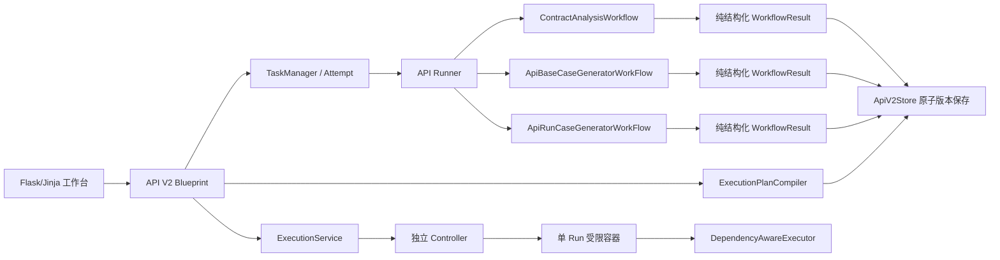

# API 测试智能体核心工作流融合改造 V2.4 开发设计与计划

> **实施代理要求：** 开发本计划时必须先使用 `superpowers:test-driven-development`，按里程碑执行时使用 `superpowers:executing-plans`；每个发布检查点完成前使用 `superpowers:verification-before-completion`。本项目工作区已有未提交改动，禁止创建分支、提交或 PR，禁止通过 `reset`、`checkout` 或覆盖文件清理现场。
> 文档版本：V2.4
> 日期：2026-08-21
> 产品依据：[PRD-API测试智能体核心工作流融合改造-V2.4.md](/Users/admin/Testproject/test-platform/docs/PRD-API测试智能体核心工作流融合改造-V2.4.md)
> 实施范围：P0 阶段一至四、P1 可观察性/状态/接口/追溯、P2 文件化质量统计
> 当前架构：Flask、Jinja、原生 JavaScript、Pydantic V2、文件化 `TaskStore`、LangGraph、独立 Controller、单 Run 受限容器

## 1. 目标、成功标准与边界

### 1.1 任务目标

把旧 API 测试智能体的 LangGraph/Workflow 从“历史兼容代码”恢复为阶段一至三的正式主生成引擎，同时由 V2 控制平面继续负责版本、Evidence、Review、权限、审计、静态安全和持久化；新增确定性的阶段四 `ExecutionPlan` 依赖编排，使单接口和多接口依赖链都能通过现有受控执行架构运行。

最终主链路固定为：

```text
接口文档
→ 阶段一 ContractAnalysisWorkflow
→ 契约 Review
→ 阶段二 ApiBaseCaseGeneratorWorkFlow
→ 基础用例 Review / 一键确认
→ 确认并生成执行定义
→ 阶段三 ApiRunCaseGeneratorWorkFlow
→ 可执行用例 Review
→ 阶段四 ExecutionPlanCompiler
→ 最终执行确认
→ Controller
→ 单 Run 受限容器 DependencyAwareExecutor
→ 逐节点结果、报告和本地 Bug 草稿
```

“确认并生成执行定义”只创建阶段三 Attempt 并自动生成可执行用例，不创建 `ExecutionRun`，也不发送 API 请求。只有阶段四计划完成 Review、最终确认和安全门禁后，才允许创建真实 Run。

### 1.2 可验证成功标准

- 非结构化登录接口解析结果保留请求体字段、Header/Cookie、鉴权结论、CSRF/会话要求和字段 Evidence。
- 阶段一至三的运行来源能够证明实际调用了旧核心 Workflow 的内部节点，而不是只显示旧 Prompt 名称。
- 登录接口不会因共享上下文生成商品、订单或支付等无文档依据场景。
- 基础用例具有前置条件、步骤、参数变化、数据、依赖、预期或探索观察目标，并必须人工确认。
- 点击“确认并生成执行定义”后创建独立阶段三 Attempt；刷新页面仍停留在真实当前阶段。
- 可执行用例可查看完整 Header、Query、Cookie、Body、依赖、变量提取、断言和静态校验结果。
- 多接口用例能够编译为稳定 DAG；循环、缺失依赖、变量无来源、未登记目标在创建 Run 前被阻断。
- 同一 Run 通过一个受控 Session/Cookie Jar 串行执行依赖节点；前置失败只阻断后继，独立分支继续。
- 执行器运行时不调用模型，不读取接口文档、基础用例或 Prompt，只读取已确认的不可变 `ExecutionPlan`。
- 每个工作流节点、计划编译节点和执行节点都有脱敏、可追溯的阶段记录；模型用量分别显示输入、输出、总 Token。
- 历史 V1、`legacy`、`v2_minimal`、V2.2/V2.3 产物继续只读可见，未重新通过 V2.4 门禁的历史执行定义不能创建新 Run。

### 1.3 非目标与硬边界

- 不恢复旧 MySQL 保存节点、`DBClient`、全局函数对象或旧 CLI `execute_test_cases()`。
- 不让 Workflow 直接写 `TaskStore`、任务状态、数据库或外部系统。
- 不允许模型生成或覆盖 Host、Credential、镜像、命令、网络模式、宿主路径或任意环境变量。
- 不把 Docker Socket、模型凭证、平台 Client Token、KEK 或数据库访问能力交给 Web 或 Executor。
- 不实现 Postman Collection、gRPC、WebSocket、GraphQL、压测、并发、吞吐量、P95/P99。
- 不实现外部 Bug 提交、稳定资产发布、Git/CI/CD 写入。
- P0 默认按确定性拓扑顺序串行执行，不做 DAG 并行调度。
- P2 继续读取不可变文件统计，不新增 PostgreSQL、对象存储、模型价格表或金额成本中心。

## 2. 实际代码基线与 PRD 差异

### 2.1 当前真实调用链

```text
POST /tasks/{task_id}/cases/generate
→ blueprint.generate_cases()
→ TaskManager 创建 base_case_generation Attempt
→ runner._base_case_stage()
→ generate_fused_cases()                      # 当前主路径
→ 保存 base-cases / coverage

POST /tasks/{task_id}/executable-cases/generate
→ blueprint.generate_executable()
→ TaskManager 创建 executable_generation Attempt
→ runner._executable_stage()
→ build_executable_cases()                    # 当前主路径
→ 保存 executable-cases

POST /tasks/{task_id}/execute
→ execution_service.RealExecutionService
→ Controller RuntimeAdapter
→ 单 Run 容器 executor/runner.py
→ for case in cases 顺序执行
```

当前平台 Runner 没有把 `ApiBaseCaseGeneratorWorkFlow` 和 `ApiRunCaseGeneratorWorkFlow` 作为主生成路径；旧 Workflow 的 V2 分支反而委托 `generate_fused_cases()` 或 `build_executable_cases()`，因此页面展示的 `v2_fused` 不能证明旧核心节点真正运行。

### 2.2 当前契约解析缺口

`AIAPIDocumentParser` 已能产生请求体相关结构，但 `contracts/unstructured_parser.py` 标准化时只映射 method、path、parameters 和 responses，未完整映射旧解析结果中的 request body、鉴权、Cookie/CSRF 和依赖。`quality_gate.py` 目前也未把“原文有请求体/鉴权信号但标准化结果为空”作为硬 blocker。

### 2.3 当前执行能力缺口

现有 `executor/runner.py` 已具备受控容器内的单请求执行、基础脱敏和部分断言，但仍是数组循环器：

- 不编译或验证依赖图；
- 不维护跨节点变量仓库；
- 不维护 Cookie Jar 和受控 Session；
- 不支持响应变量提取和原生类型注入；
- 不区分根因失败与依赖阻断；
- 未知断言操作符当前会被当作通过；
- setup/teardown 当前统一拒绝。

因此现有真实执行基础设施可复用，但业务执行内核必须按阶段四改造后才能满足多接口依赖需求。

### 2.4 文档歧义的实施解释

- PRD 4.1 中两个“真实接口执行”条目合并解释：平台控制平面负责编译/确认计划并通过现有 Controller 发起 Run；真正的目标请求只由受限容器内 `DependencyAwareExecutor` 发送。
- PRD 中第二个“4.3 人工门禁”按语义视为 4.6，不改变产品决策。
- PRD 的 `run.execute` 是产品能力名称。现有系统已经使用 `api-test-agent.execute` 作为真实 Run 权限，本期保留该稳定权限码，不重复创建同义权限。
- `ExecutableCaseV3`、`ExecutionPlanV1` 是产物 Schema 版本，不要求把任务 `schema_version=2` 迁移为任务 V3。

## 3. 总体架构设计

### 3.1 控制平面与生成/执行平面



职责固定如下：

| 层 | 负责 | 禁止 |
| --- | --- | --- |
| 页面/API 控制平面 | RBAC、CSRF、所有权、Review、确认、幂等、状态展示 | 直接请求目标 API |
| Runner | 创建输入快照、调用 Workflow、保存版本、切换状态、写事件 | 在 Workflow 节点中持久化 |
| 阶段一至三 Workflow | LangGraph 节点编排、模型调用、纯生成/校验 | MySQL、TaskStore、直接执行 |
| ExecutionPlanCompiler | 纯函数编译 DAG、变量和策略、生成确认 SHA | 模型调用、网络访问 |
| Controller | 内部鉴权、容器生命周期、资源/出口策略 | 理解业务 Prompt 或动态命令 |
| DependencyAwareExecutor | 按不可变计划执行 HTTP、变量、Cookie、断言、失败传播 | 访问模型/数据库/其他 Run |

### 3.2 核心接口约定

三个 Workflow 统一使用无副作用接口：

```python
class WorkflowRuntimeContext(BaseModel):
    task_id: str
    attempt_id: str
    workflow_id: str
    workflow_version: str
    input_versions: dict[str, int]
    event_sink: Callable[[WorkflowNodeEvent], None]
    model_invoker: Callable[[ModelCall], ModelResponse] | None

class WorkflowResult(BaseModel):
    status: Literal["ready", "partial_ready", "failed"]
    items: list[dict[str, Any]]
    rejections: list[GenerationRejection]
    quality_summary: dict[str, Any]
    workflow_provenance: WorkflowProvenance
```

`event_sink` 和 `model_invoker` 由 Runner 注入。Workflow 只能通过回调上报结构化事件和模型调用，不知道任务目录路径，也不得直接保存文件。

### 3.3 工作流版本快照

每个 Attempt 创建时冻结：

- `generation_kernel=v2_core_workflow`；
- workflow ID、语义版本和源码 SHA；
- Prompt ID、版本和 SHA；
- Contract/BaseCase/ExecutableCase 输入版本和 SHA；
- 覆盖规则、Grounding、安全策略版本；
- 模型逻辑名称和供应商返回模型名。

同一 Attempt 不允许切换 Workflow、Prompt 或内核。配置变化只影响新 Attempt。

## 4. Schema 与版本设计

### 4.1 契约产物 `ApiContractV3`

在现有 `ApiContract` 上新增或细化：

```text
artifact_schema_version: 3
auth_conclusion: none | required | optional | unresolved
auth_requirements[]:
  scheme_type: bearer | basic | api_key | cookie | session | csrf | oauth2 | custom
  credential_location: header | query | cookie | body | runtime_profile
  field_name
  scopes[]
  evidence_refs[]
request_body:
  required
  media_types[]
  schema
  fields[]:
    field_path / name / type / required / constraints / example / evidence_refs
body_signal_detected: bool
auth_signal_detected: bool
```

兼容规则：读取 V2 契约时，空 `security` 映射为 `auth_conclusion=unresolved`，绝不能推断为 `none`；只在内存兼容，不回写旧文件。OpenAPI 显式 `security: []` 或文档明确“无需鉴权”且有 Evidence 时才映射 `none`。

### 4.2 基础用例 `BaseTestCaseV3`

保留现有字段，并增加明确的工作流和覆盖引用：

```text
artifact_schema_version: 3
workflow_id / workflow_version / workflow_sha256
prompt_refs[]
coverage_refs[]
data_inputs[]: name / source / data_ref / value_hint / sensitive
dependency_refs[]: contract_id / case_id / variable / reason / evidence_refs
expected_results[]:
  kind: status | response_field | business | observation
  actual_path
  operator
  expected
  evidence_refs[]
review_status: draft | confirmed_candidate | confirmed | disabled
```

生成来源为 deterministic、LLM 或两者融合都只进入 `confirmed_candidate`。探索用例必须包含 observation，且人工确认后才可继续。

### 4.3 可执行定义 `ExecutableCaseV3`

```text
artifact_schema_version: 3
executable_case_id / version
base_case_id / contract_id
request:
  method / relative_path
  path_params / query / headers / cookies
  media_type / body
precondition_case_ids[]
variable_producers[]:
  name / extractor_type / source_path / required / sensitive
variable_consumers[]:
  name / destination / field_path / required / default_policy
assertions[] / observation_targets[]
data_refs[]
setup / teardown capability declarations
retry_policy
failure_policy
workflow/provenance/input versions
review_status: confirmed_candidate | confirmed | disabled
validation_status: pending | ready | disabled
```

执行定义不保存 Host 或真实 Credential。`target_id` 只在计划编译时选择，Host 仅在 Controller/Executor 的受控输入中解析。

### 4.4 `ExecutionPlanV1`

```text
plan_id / version / sha256
artifact_schema_version: 1
task_id
source_executable_version / source_executable_sha256
target_id / environment
resource_policy_id / egress_policy_id / credential_profile_ref
nodes[]:
  node_id / executable_case_id / request
  producers[] / consumers[]
  assertions[] / observation_targets[]
  timeout_policy / retry_policy / failure_policy
  setup_capabilities[] / teardown_capabilities[]
edges[]:
  from_node / to_node / source_type / source_ref / reason
topological_order[]
write_operation_count / high_risk_count / teardown_count
confirmation_summary / confirmation_sha256
status: draft | ready | confirmed | stale
created_by / confirmed_by / timestamps
```

确认 SHA 使用规范化计划正文、目标登记版本、安全策略版本和确认摘要计算。计划、执行定义、目标或策略任一变化，旧 SHA 失效。

### 4.5 Run 与逐节点结果

扩展 `ExecutionRun`：

- `execution_plan_id/version/sha256`；
- `source_executable_version/sha256`；
- `controller_request_id`；
- `node_summary`；
- `retry_of_run_id`。

新增 `ExecutionStepResult`：

```text
node_id / executable_case_id
status: passed | failed | error | blocked | skipped | cancelled | timed_out
dependency_node_ids[] / started_reason
started_at / finished_at / duration_ms
masked_request / masked_response
extracted_variables[]: name / source / sensitive / available
session_changes[]
assertion_results[] / observation_results[]
failure_classification / error_code / error_message
retry_count / blocked_descendant_ids[]
```

`CaseResult` 保留为报告兼容聚合；其 `status` 增加 `blocked` 和 `timed_out`，`step_results` 改为强类型序列化结果。读取历史字典列表继续兼容。

### 4.6 版本信封与生命周期

任务仍为 `schema_version=2`。`ApiV2Store.save_version()` 增加可选 `artifact_schema_version`，信封示例：

```json
{
  "schema_version": 2,
  "artifact_schema_version": 3,
  "kind": "executable-cases",
  "version": 4,
  "sha256": "...",
  "source_versions": {
    "contracts": 3,
    "base-cases": 5
  },
  "lifecycle_status": "current",
  "items": []
}
```

新增版本类型 `execution-plans`，目录为 `versions/execution-plans/`。契约更新使 coverage、base-cases、executable-cases、execution-plans stale；基础用例更新使 executable-cases、execution-plans stale；执行定义或策略更新使 execution-plans stale。历史 Run、报告和草稿不变。

## 5. 阶段一：核心契约解析工作流

### 5.1 节点设计

新增 `ContractAnalysisWorkflow`，节点和条件边固定为：

```text
preflight
→ route_format
├─ OpenAPI/Swagger → deterministic_parse
└─ 非结构化文档 → split_sections → legacy_ai_parse
→ contract_v2_adapter
→ request_body_completeness
→ auth_completeness
→ evidence_binding
→ contract_quality_gate
→ output_contract_candidates
```

结构化规范字段由确定性解析器读取；AI 只能补充文档中的业务说明或生成建议，不能覆盖确定性事实。所有节点返回数据和事件，不保存版本。

### 5.2 Adapter 规则

`V2ContractAdapter` 负责把确定性结果和旧 `AIAPIDocumentParser` 输出统一到 `ApiContractV3`：

- 参数按 path/query/header/cookie/body 分类；
- 旧 `requestBody`、Curl `-d/--data/--data-raw` 和字段表映射为结构化 request body；
- `Authorization`、Bearer、Token、Cookie、Session、CSRF 信号映射为鉴权候选；
- “无需会话/无需鉴权”映射为 `auth_conclusion=none`，但必须绑定原文；
- 冲突值进入 `conflict_items`，不得覆盖确定性结果；
- AI 推断没有直接依据时进入建议或 unresolved，不能进入 confirmed candidate。

### 5.3 完整性门禁

- 原文有 Body/JSON/Form/字段表/Curl data 信号但 `request_body` 为空：`CONTRACT_REQUEST_BODY_MISSING` blocker。
- 原文有鉴权、会话、Cookie、CSRF、Bearer、Authorization 或 Token 信号但结论仍 unresolved：`CONTRACT_AUTH_CONCLUSION_MISSING` blocker。
- `auth_conclusion=required` 但方案、位置、字段或 Evidence 不完整：`CONTRACT_AUTH_REQUIREMENT_INCOMPLETE` blocker。
- method、path、必填参数、请求体必填字段、关键响应码缺少 Evidence/人工决定：`CONTRACT_FIELD_EVIDENCE_MISSING`。
- OpenAPI 远程 `$ref` 不联网；记录 unresolved。循环或失效本地引用使用稳定错误。

### 5.4 Runner 接入

`runner._initial_stage()` 改为：准备输入快照 → 调用 `ContractAnalysisWorkflow.run()` → 校验 `WorkflowResult` → 原子保存契约版本和产物 → 更新 Attempt/任务状态。禁止在 Runner 中再次拼一套业务解析。

## 6. 阶段二：核心基础用例工作流

### 6.1 单接口 GenerationContext

每个 confirmed Contract 单独构造上下文，只包含当前接口、直接 Evidence、明确依赖摘要、分析范围、已接受建议、当前覆盖矩阵和同接口历史摘要。上下文构造器必须检查 Contract ID，禁止把同任务其他无关接口正文拼入 Prompt。

### 6.2 LangGraph 节点

改造现有 `ApiBaseCaseGeneratorWorkFlow`：

```text
validate_context
→ legacy_generate_base_cases          # 旧 L1-L5/T1-T4 Prompt
→ deterministic_coverage_merge        # V2 规则骨架
→ normalize_and_deduplicate
→ calculate_structured_gaps
→ should_supplement?
   ├─ yes → legacy_supplement_cases → validate_supplement → 回到 gap（最多3轮）
   └─ no  → grounding_and_completeness
→ risk_classification
→ output_base_case_candidates
```

旧“模型文本包含 100%”判断完全移除。循环条件只读结构化缺口、轮次、新增数量和连续缺口签名。

### 6.3 候选隔离与 Review

模型数组逐条经过对象校验、枚举归一化、Schema、Grounding、完整性和去重。一条失败只记录拒绝。存在合法确定性用例或模型用例时，任务进入 `waiting_case_review`，并展示生成/拒绝摘要。

一键确认：

- 只处理 current、`confirmed_candidate`、hard gate passed 的用例；
- blocker、stale、disabled 和不完整项跳过；
- 高风险用例在确认对话框单列，每条独立写审计；
- 管理员、测试开发、测试人员均可执行；只读角色不可执行。

### 6.4 阶段二到阶段三门禁

新增组合动作 `confirm-and-generate-executable`：

1. 校验 `base_version`、版本 SHA、确认摘要 SHA 和幂等键；
2. 在任务锁内完成可确认用例的确认和审计；
3. 至少一条 current confirmed 且 blocker 为零；
4. 创建 `executable_case_generation` Attempt，冻结输入版本/Workflow/Prompt；
5. 任务状态切换为 `generating_executable_cases`；
6. 返回 Attempt，不创建 Run。

已有 running Attempt 时返回同一 Attempt；阶段三失败后基础用例仍为 confirmed，可创建新的重试 Attempt。

## 7. 阶段三：核心可执行用例工作流

### 7.1 LangGraph 节点

改造现有拼写路径 `api_run_case_wrokflow.py`，保留模块名和类名以兼容旧 CLI：

```text
validate_confirmed_inputs
→ load_controlled_manifest           # 白名单工具、受控 data_ref，不扫描任意目录
→ legacy_generate_api_cases          # 旧 api_case_generator Prompt
→ load_controlled_test_data
→ normalize_request_candidates
→ repair_invalid_candidate           # 单条、有限重试
→ validate_request_completeness
→ validate_dependencies_and_variables
→ validate_assertions_and_grounding
→ validate_script_ast
→ output_executable_candidates
```

当前 V2 分支反向调用 `build_executable_cases()` 的逻辑移除。该函数拆为纯规范化/校验工具供节点复用；旧“保存用例”节点改为只返回结果。

### 7.2 受控资源清单

旧“加载工具函数和文件列表”不得扫描宿主目录。Runner 只传入：

- 固定工具 ID 和版本；
- 当前任务已登记的 `data_ref` 元数据；
- Baseline 数据的脱敏结构和版本 SHA；
- 允许的 setup/teardown capability；
- 依赖契约摘要。

Workflow 不能接收路径，也不能读取任意文件。

### 7.3 静态门禁

除 V2.3 已有变量、依赖、断言和 AST 检查外，增加：

- 契约必填 Body 为空；
- 必填 Path/Query/Header/Cookie 缺失；
- 鉴权 required 但没有 runtime placeholder/前置提取/Credential Profile 引用；
- 未知成功码被默认写成 200；
- 变量生产者/消费者类型不兼容；
- 响应提取表达式超出白名单；
- Host、Credential 明文、文件/进程/网络控制字段；
- 来源 Contract/BaseCase 非 current 或非 confirmed。

每条输出独立标记 ready 或 disabled。阶段整体状态为 ready、partial_ready 或 failed，不再借用任务级 `partial_success` 阻断 Review。

### 7.4 执行定义 Review

页面必须完整展示请求、依赖、变量、数据、断言、脚本能力、Workflow 和输入版本。执行定义只有经过 `executable.review` 的确认后才可进入计划编译。编辑请求、变量、依赖或断言后重新运行静态门禁并生成新版本。

## 8. 阶段四：依赖编排与受控执行

### 8.1 ExecutionPlanCompiler

新增无网络、无模型、无持久化的确定性编译器：

1. 读取选中的 current、confirmed、ready `ExecutableCaseV3`；
2. 从显式前置、变量生产消费、Cookie/Session/CSRF、契约依赖和人工顺序生成边；
3. 检查节点存在、变量来源唯一、类型、写操作前置条件和策略；
4. 使用稳定 Kahn 拓扑排序，候选节点按 `executable_case_id` 排序保证 SHA 可复现；
5. 检测循环、冲突和缺失；
6. 计算拓扑顺序、分支、风险摘要和确认 SHA；
7. 返回不可变 `ExecutionPlanV1` 候选，由服务层保存。

### 8.2 变量表达式策略

Executor 镜像当前没有 `jmespath` 依赖。P0 采用以下最小、安全方案：

- 原生支持 RFC 6901 JSON Pointer；
- Header、Cookie、status code 使用固定 extractor；
- 文本正则使用 Python `re`，限制响应长度、表达式长度、分组数量和执行输入；
- 旧核心中的简单点号路径在 Adapter 阶段确定性转换为 JSON Pointer；
- 无法无歧义转换的复杂 JMESPath 标记 `EXTRACTOR_EXPRESSION_UNSUPPORTED`，不得静默执行；
- 受控 JMESPath 完整支持放入后续需求池，除非实施时确认现有锁文件已有可复用依赖并完成镜像安全评审。

该选择不增加 Executor 第三方依赖，优先保证 P0 的登录/Cookie/CSRF/多接口链可执行。

### 8.3 RunContext 与调度

`DependencyAwareExecutor` 在单个容器内创建：

- `VariableStore`：保存值、原始类型、生产节点和 sensitive 标记；
- `CookieJar`：使用标准库 Cookie 支持，同 Run 共享；
- `NodeStateStore`：节点状态、输出引用和阻断原因；
- `TargetContext`：由受控输入提供已登记目标解析结果；
- `CredentialResolver`：只消费短生命周期 Secret 引用的运行时注入结果，不回写计划。

调度器按拓扑顺序串行执行。节点失败或 error 时递归标记后继 blocked；独立分支继续。取消或 Run 超时后，未开始节点为 cancelled/timed_out。teardown 按计划的清理策略单独执行并记录。

### 8.4 请求模板、提取和断言

- 在 Path、Query、Header、Cookie、JSON/Form Body 中递归解析受控变量占位符；
- 替换保留 int、float、bool、null、list、object 类型；
- required 变量缺失返回 `VARIABLE_VALUE_MISSING`，不替换空字符串；
- 请求后先更新 Cookie Jar，再提取变量，再执行断言；
- 断言只接受白名单，未知操作符必须失败关闭，不能默认通过；
- 探索用例只产出 observation，不进入产品缺陷自动分类；
- 写操作默认 retry=0；只读请求或已确认幂等写请求才允许有限重试。

### 8.5 ExecutionService 改造

`ExecutionPlan` 成为创建 Run 的唯一业务输入：

```text
execute preview
→ compile preview / blockers / confirmation summary
→ create immutable plan
→ review and confirm plan
→ create run with plan_id + plan_sha
→ Controller receives narrow IDs and input SHA
→ Executor reads current Run input containing resolved target + confirmed plan
```

`MockExecutionService` 和 `RealExecutionService` 共用计划校验、结果规范化、脱敏、性能规则和报告；差别只在 RuntimeAdapter。Run 输入不得再以未经计划确认的 `cases` 数组为业务源。

## 9. 状态机、Attempt 与失败恢复

### 9.1 任务状态

新增 API 专属状态并保持旧状态只读兼容：

```text
running_contract_analysis
waiting_contract_review
generating_base_cases
waiting_case_review
generating_executable_cases
waiting_executable_review
compiling_execution_plan
waiting_execution_confirmation
running
succeeded / failed / cancelled / timed_out
```

页面阶段不能仅由任务状态单值推断；应综合 current version、活动 Attempt、计划和最新 Run 恢复当前阶段，避免刷新回阶段一。

### 9.2 产物阶段状态

所有查询响应统一使用：`not_generated`、`generating`、`ready`、`partial_ready`、`failed`、`stale`。正常门禁返回 200 和 stage state；503 只用于真实平台依赖不可用。

### 9.3 Attempt 规则

- 阶段一至三每次生成或重试都创建新 Attempt；
- Attempt 保存输入版本、内核、Workflow/Prompt/策略快照；
- 重试复用明确的成功上游版本，不覆盖旧 Attempt；
- 阶段三失败不回退基础用例确认；
- 计划编译失败不回退执行定义 Review；
- Run 失败不改变计划和上游产物；
- 幂等键只对同任务、同阶段、同输入 SHA 生效。

## 10. API 设计

### 10.1 现有接口调整

- `GET /tasks/{task_id}/contracts`：增加 auth conclusion、request body completeness、Workflow 来源和 stage state。
- `GET /tasks/{task_id}/cases`：保持 `base_cases.items` 和 `coverage_matrix.items` 为数组，增加完整用例与 Workflow 字段。
- `PUT /tasks/{task_id}/cases/review`：支持一键确认可确认项和逐条高风险审计。
- `GET /tasks/{task_id}/executable-cases`：返回完整执行定义、stage state、版本、SHA、禁用原因和来源。
- 旧 `POST /executable-cases/generate` 保留兼容，但内部与组合接口共用同一创建 Attempt 服务。
- 旧 `/execute/preview` 在兼容期委托 ExecutionPlan preview；未有 V2.4 ready plan 时返回 `LEGACY_VALIDATION_REQUIRED` 或明确 blocker。

### 10.2 新增/固化接口

```http
POST /api-test-agent/api/v1/tasks/{task_id}/cases/confirm-all
POST /api-test-agent/api/v1/tasks/{task_id}/cases/confirm-and-generate-executable

GET  /api-test-agent/api/v1/tasks/{task_id}/executable-cases
PUT  /api-test-agent/api/v1/tasks/{task_id}/executable-cases/review

POST /api-test-agent/api/v1/tasks/{task_id}/execution-plans/preview
POST /api-test-agent/api/v1/tasks/{task_id}/execution-plans
GET  /api-test-agent/api/v1/tasks/{task_id}/execution-plans/{plan_id}
POST /api-test-agent/api/v1/tasks/{task_id}/execution-plans/{plan_id}/confirm
POST /api-test-agent/api/v1/tasks/{task_id}/execution-plans/{plan_id}/runs
GET  /api-test-agent/api/v1/tasks/{task_id}/runs/{run_id}/steps
```

所有写接口要求任务所有权、RBAC、CSRF、`base_version`/计划版本、修改原因、幂等键（创建类操作）、确认 SHA（确认类操作）和审计。浏览器请求不得包含 Host、Credential、镜像、命令、网络模式或宿主路径。

### 10.3 关键响应语义

`confirm-and-generate-executable` 成功返回 202：

```json
{
  "stage_state": "generating",
  "attempt_id": "attempt_xxx",
  "base_case_version": 3,
  "confirmed_count": 12,
  "skipped_count": 2,
  "high_risk_count": 1,
  "input_sha256": "..."
}
```

计划 preview 成功但有阻断仍返回 200：

```json
{
  "stage_state": "blocked",
  "source_executable_version": 4,
  "nodes": [],
  "edges": [],
  "blockers": [{"code": "VARIABLE_SOURCE_MISSING", "field_path": "..."}],
  "confirmation_sha256": ""
}
```

### 10.4 权限设计

保留现有：

- `api-test-agent.contract.review`；
- `api-test-agent.case.review`；
- `api-test-agent.execute`，作为 PRD `run.execute` 的稳定实现。

新增后继迁移 `20260821_0012_add_api_agent_v24_permissions.py`：

- `api-test-agent.executable.generate`；
- `api-test-agent.executable.review`。

不得修改或覆盖现有 `20260813_0011`。管理员、测试开发、测试执行者/测试人员获得两个新增权限；只读角色不获得。高风险基础用例确认继续要求 `case.review`，真实 Run 继续单独要求 `api-test-agent.execute`。

## 11. 存储布局与原子提交

```text
tasks/{task_id}/
├── versions/
│   ├── contracts/vN.json
│   ├── coverage/vN.json
│   ├── base-cases/vN.json
│   ├── executable-cases/vN.json
│   └── execution-plans/vN.json
├── attempts/{attempt_id}/
│   ├── attempt.json
│   ├── workflow-snapshot.json
│   ├── events.jsonl
│   ├── model-usage.json
│   ├── generation-provenance.json
│   └── candidate-decisions.json
└── runs/{run_id}/
    ├── run.json
    ├── input.json
    ├── execution-plan.json
    ├── step-results.json
    ├── case-results.json
    ├── dependency-propagation.json
    └── report.json
```

所有 JSON 使用临时文件、`fsync`、`os.replace` 和 SHA 校验。`events.jsonl` 继续追加并容忍单条损坏。工作流结果先全部通过 Schema 校验，随后由 Runner 在任务锁内保存版本并切换 current 指针；保存失败不得标记阶段 ready。

Run 输入只复制已确认计划和由安全层解析的运行时目标/Secret 引用，不复制完整接口文档、Prompt 或基础用例。

## 12. 可观察性与日志

### 12.1 阶段事件

阶段一至四每个节点都写：started、completed、skipped、retry、rejected 或 failed，包含 task/attempt/run/request ID、阶段、节点、Workflow/Prompt SHA、输入/输出版本、耗时、Token、错误码和脱敏摘要。

页面阶段记录面板支持 Attempt、stage、接口、node、level 筛选；生成期间 2～3 秒 cursor 增量刷新，页面隐藏时降频，Review/终态最后刷新一次后停止。生成来源和模型调用明细默认收起。

### 12.2 应用日志和审计

- Python 标准库 JSON 日志覆盖 Web 请求、TaskManager、Runner、Workflow callback、Controller client 和报告生成。
- Review、版本、权限、确认和 Run 操作使用审计记录；审计不保存文档/请求/响应正文。
- Executor 只输出受控结构化步骤结果和必要的脱敏技术事件，不打印 Secret/Cookie 原值。
- 非管理员不返回堆栈和绝对路径；`request_id` 用于关联页面错误、应用日志和 StageEvent。

### 12.3 Token 和文件化指标

独立展示调用次数、输入 Token、输出 Token、总 Token、未报告调用数。供应商未返回 usage 时只显示“未报告”，不估算。P2 按 Attempt、阶段、Workflow、节点、模型、Prompt、项目、模块聚合有效率、拒绝率、blocker 率和单位产物 Token；成本固定为 `null/not_configured`。

## 13. 页面与交互设计

设计判断：这是桌面端高密度测试工作台，不是营销页。沿用现有 Apple-inspired token、Flask/Jinja 和原生 JavaScript，重要信息按“当前状态 → 下一步 → 技术详情”排列。

### 13.1 阶段导航

左侧导航调整为：

1. 契约分析与确认；
2. 覆盖矩阵与基础用例；
3. 可执行用例；
4. 依赖计划与执行；
5. 结果、报告与 Bug 草稿。

刷新后依据服务端 stage state、活动 Attempt、current 版本、计划和最新 Run 恢复当前阶段；已完成阶段可访问，未来阶段显示门禁原因。

### 13.2 阶段二

- 用例列表 + 详情工作区，默认展示步骤、数据、依赖和预期，不只显示标题。
- “一键确认全部可确认用例”返回已确认和跳过清单。
- “确认并生成执行定义”显示输入版本、高风险、禁用、缺口和 SHA，确认后切换阶段三生成态。

### 13.3 阶段三

- 以折叠分组展示 Request、Variables、Dependencies、Assertions、Scripts、Validation、Provenance。
- Header/Cookie 的值默认脱敏；占位符和来源可见。
- 生成来源与模型调用明细默认收起。
- ready、disabled、partial_ready 使用文字与颜色双重提示。

### 13.4 阶段四

- 同时提供依赖图列表视图和拓扑顺序视图；不新增图形库，P0 用语义 HTML/CSS 节点与边表格呈现。
- 每条边显示来源：显式依赖、变量、Cookie/Session、契约或人工顺序。
- 最终确认对话框列出目标、写操作、高风险、变量、Cookie/鉴权、重试、失败传播、资源/出口策略和 SHA。
- 报告提供“依赖图结果”和“时间顺序”两个视图，区分根因失败、blocked 后继和独立分支。

所有交互支持键盘、可见焦点、`aria-current`、非颜色状态提示和 `prefers-reduced-motion`。仅验收 1280px 及以上桌面视口。

## 14. 文件修改设计

### 14.1 核心生成引擎

| 文件 | 变更 |
| --- | --- |
| `agents/api_test/workflows/contract_analysis_workflow.py` | 新增阶段一纯 LangGraph 编排；必要新文件，集中节点与条件边 |
| `agents/api_test/contracts/v2_adapter.py` | 新增旧解析结果/确定性结果到 ApiContractV3 的纯 Adapter |
| `agents/api_test/contracts/unstructured_parser.py` | 保留请求体、鉴权、Cookie/CSRF、依赖和精确 Evidence |
| `agents/api_test/contracts/quality_gate.py` | 增加请求体/鉴权完整性 blocker |
| `agents/api_test/parsers/ai_parser_api_document.py` | 扩展结构化输出契约，不改变旧导入路径 |
| `agents/api_test/prompts/api_document_parser.py` | 新增 V2.4 Prompt 版本和合法输出示例，保留旧 `prompt` |
| `agents/api_test/workflows/api_basecase_workflow.py` | 恢复为阶段二主图；移除反向委托和 MySQL 副作用 |
| `agents/api_test/prompts/base_case_generator.py`、`base_case_check_coverage.py`、`supplement_case.py` | 保留旧 Prompt，新增 V2.4 受控上下文和结构化输出版本 |
| `agents/api_test/cases/fused_kernel.py`、`coverage.py`、`grounding.py` | 降级为图内确定性工具，不再作为整阶段主引擎 |
| `agents/api_test/workflows/api_run_case_wrokflow.py` | 恢复为阶段三主图，保留拼写路径兼容，移除 DB/目录扫描/直接执行 |
| `agents/api_test/prompts/api_case_generator.py`、`unified_api_case_generator.py` | 新增 V2.4 完整请求/依赖/变量输出契约 |
| `agents/api_test/cases/executable.py`、`script_policy.py` | 拆为规范化和完整静态门禁工具 |

### 14.2 控制平面、计划与执行

| 文件 | 变更 |
| --- | --- |
| `services/api_agent/models.py` | 增加 V3 产物、ExecutionPlan、StepResult、鉴权结论和兼容验证器 |
| `services/api_agent/runner.py` | 只编排三个 Workflow、保存结果和状态，不重复生成逻辑 |
| `services/api_agent/v2_store.py` | 新增 execution-plans、artifact schema、stale 传播和计划读取 |
| `services/api_agent/execution_plan.py` | 新增纯编译器、稳定拓扑、确认 SHA；必要新文件 |
| `services/api_agent/review_service.py` | 一键确认、执行定义 Review、版本冲突和逐条高风险审计 |
| `services/api_agent/blueprint.py` | 新增组合确认、执行定义和计划/步骤接口 |
| `services/api_agent/execution_service.py` | 以 confirmed ExecutionPlan 创建 Run，规范化 StepResult |
| `services/api_agent/stage_events.py` | Workflow callback、阶段四节点事件和统计扩展 |
| `services/execution_controller/contracts.py` | 窄请求增加 plan ID/SHA，不接受业务自由字段 |
| `executor/runner.py` | 升级为 DependencyAwareExecutor、RunContext、提取/注入/失败传播 |
| `test-platform/backend/alembic/versions/20260821_0012_add_api_agent_v24_permissions.py` | 后继权限迁移，不修改 0011 |

### 14.3 页面

| 文件 | 变更 |
| --- | --- |
| `services/api_agent/templates/task_detail.html` | 五阶段工作台、基础/执行定义详情、计划和步骤报告 |
| `services/common/static/api-v2-workbench.js` | 阶段恢复、一键确认、阶段三触发、计划/Run/步骤交互 |
| `services/common/static/api-v2-workbench.css` | 现有命名空间内增加详情、DAG 列表和状态样式 |

不引入 React/Vue、图标库、图形库或新的前端构建工具。

## 15. 分里程碑可执行开发计划

### M0：基线、黄金集和 Schema 先行

**目标：** 用测试固定真实缺口、V3 产物和历史兼容，不修改运行时开关。

**先写失败测试：**

- `tests/api_v2/test_contract_parsing.py`：登录文档请求体/鉴权/CSRF 不得丢失。
- `tests/api_v2/test_core_workflows.py`：证明 Workflow 节点实际运行且无 MySQL/TaskStore 副作用。
- `tests/api_v2/test_models.py`：ApiContractV3、BaseTestCaseV3、ExecutableCaseV3、ExecutionPlan、StepResult 正反例。
- `tests/api_v2/test_execution_plan.py`：稳定拓扑、循环、缺失依赖、变量冲突黄金测试。
- 历史 V1/V2/legacy/v2_minimal fixture 只读兼容。

**实现：** 扩展 `models.py` 和兼容读取层；新增登录、Cookie/CSRF、多接口链、独立分支、循环依赖黄金样例。

**验证：** 模型正例通过，非法 Host/明文 Credential/未知断言/无来源变量失败；现有历史 fixture 不被回写。

### M1：阶段一主工作流和完整契约

**目标：** 非结构化解析完整保留请求体、鉴权和 Evidence。

**步骤：**

1. 为 Adapter 和完整性门禁补失败测试。
2. 实现 `V2ContractAdapter`。
3. 实现 `ContractAnalysisWorkflow` 节点和 callback。
4. 修改旧文档解析 Prompt 的 V2.4 输出契约。
5. 把 `runner._initial_stage()` 切到 Workflow。
6. 浏览器验证 blocker、原文定位、人工处理和重新分析。

**完成标准：** 登录请求体和 `X-CSRF-Token`/Cookie/会话结论可见；缺失时 blocker 生效；OpenAPI 确定性结果不被 LLM 覆盖。

### M2：阶段二旧核心基础用例主图

**目标：** 恢复旧测试设计能力，并由 V2 结构化覆盖和 Grounding 约束。

**步骤：**

1. 写登录接口无跨业务幻觉、L1-L5/T1-T4、步骤/预期/依赖黄金测试。
2. 将 `ApiBaseCaseGeneratorWorkFlow` 改为纯主图。
3. 把 fused kernel、coverage、grounding 接为图内工具。
4. 实现最多三轮、提前终止、单条拒绝和 partial_ready。
5. Runner 保存 WorkflowResult、provenance、events 和 usage。
6. 实现一键确认可确认用例及独立高风险审计。

**完成标准：** 页面能看到完整基础用例；登录接口不生成商品/订单/支付；一条坏候选不拖垮阶段；所有候选仍需人工确认。

### M3：阶段二到三的人工门禁

**目标：** 固化“确认并生成执行定义”的原子语义和刷新恢复。

**步骤：**

1. 写 CSRF、RBAC、所有权、版本冲突、SHA 失效、幂等和 blocker 测试。
2. 实现 confirm-all 与 confirm-and-generate 服务/API。
3. 创建并入队 `executable_case_generation` Attempt。
4. 服务端输出明确 stage state；前端按真实状态恢复阶段。
5. 验证阶段三失败不回退阶段二。

**完成标准：** 点击组合按钮自动进入阶段三，但 Run 数量不变且无目标请求；刷新不回阶段一。

### M4：阶段三旧核心可执行用例主图

**目标：** 使用旧核心请求生成能力输出完整、安全的 ExecutableCaseV3。

**步骤：**

1. 写 Body、Header、Cookie、CSRF、变量、依赖、断言、data_ref 和脚本负向测试。
2. 改造 `ApiRunCaseGeneratorWorkFlow`，移除 MySQL、目录扫描和反向委托。
3. 修改 V2.4 Prompt 与逐条修复。
4. 扩展静态完整性、安全和 Grounding 门禁。
5. Runner 保存执行定义和拒绝摘要。
6. 实现可执行用例查询、Review 和详情页。

**完成标准：** ready 用例请求完整且可查看；Body null、伪造 200、变量无来源、stale、高风险未确认均不能进入计划。

### M5：ExecutionPlan 编译和 Review

**目标：** 将已确认执行定义确定性编译为不可变 DAG。

**步骤：**

1. 写显式依赖、变量、Cookie/Session、人工顺序和稳定 SHA 测试。
2. 实现 `ExecutionPlanCompiler` 和安全策略校验。
3. 扩展 `ApiV2Store` execution-plans 与 stale 传播。
4. 实现 preview/create/get/confirm API。
5. 实现计划列表、边来源、拓扑和确认 UI。

**完成标准：** 相同输入产生相同拓扑和 SHA；循环/缺失/冲突/未登记目标不能确认计划或创建 Run。

### M6：DependencyAwareExecutor 和 Mock 全链路

**目标：** 在不访问真实目标的 Mock 阶段验证依赖执行语义。

**步骤：**

1. 写 Executor 单元测试：JSON Pointer、类型保留、Cookie Jar、变量缺失、断言失败、blocked 传播、独立分支和取消/超时。
2. 将 `executor/runner.py` 升级为依赖执行器。
3. 改造 Fake Runtime/MockExecutionService 使用 ExecutionPlan。
4. 保存 step-results、propagation 和报告。
5. 验证未知断言失败关闭、写操作不自动重试。

**完成标准：** Mock 登录 → Cookie/CSRF → 受保护接口 → 退出登录链通过；前置失败时后继 blocked、独立分支继续。

### M7：真实受控执行接入与安全回归

**目标：** 在保持现有 Controller/容器/Egress 边界下接入计划输入。

**步骤：**

1. 扩展 Controller 窄契约只接收 plan ID/SHA 和固定输入/输出 ID。
2. 改造 RealExecutionService 校验 confirmed plan、目标、权限、确认 SHA 和开关。
3. 更新固定 Executor 镜像并执行镜像扫描/负向测试。
4. 先在 Fake/Mock 目标验证；真实本机无生产数据目标必须由用户明确启用并再次确认。
5. 验证 Web/Runner 不发送目标请求，只有受限容器出网。

**完成标准：** 一个 Run 一个容器；计划是唯一业务输入；真实请求仅到已登记测试目标；取消、超时、回收和审计通过。

### M8：可观察性、页面和 P2 指标

**目标：** 用户能证明每阶段运行了什么、用了哪个 Prompt/模型、消耗多少 Token，以及节点为何失败。

**步骤：**

1. 补齐 Workflow/Compiler/Executor 节点事件。
2. 阶段记录 cursor 自动刷新和筛选。
3. 输入/输出/总 Token 独立展示；默认收起 provenance 和调用明细。
4. 扩展 P2 按 Workflow/节点/产物统计。
5. 完成 1440×900、1280×800 浏览器验收。

**完成标准：** 阶段一至四都有真实脱敏事件；页面不虚构进度；历史缺失记录显示“历史版本未记录”。

### M9：全量回归、灰度和交付

**目标：** 完成兼容、安全、真实黄金链和回滚验证。

**步骤：**

1. 运行 API Agent、平台后端、前端、Compose 和平台集成全量测试。
2. 静态扫描确认平台路径不导入旧执行入口、MySQL 保存节点或外部提交能力。
3. 使用脱敏黄金任务回放阶段一至四。
4. 检查工作区 diff，只报告本需求文件，不处理无关改动。
5. 输出 M0-M9 状态、文件、测试、差异、风险、回滚与安全声明。

## 16. 测试矩阵

### 16.1 自动化重点

| 领域 | 必测场景 |
| --- | --- |
| 阶段一 | OpenAPI/Swagger 100% method/path；非结构化 Body/Auth；无鉴权显式结论；Evidence；冲突；远程 `$ref` 拒绝 |
| 阶段二 | 登录无跨域幻觉；步骤/预期/依赖完整；三轮上限；单条隔离；一键确认；高风险审计 |
| 阶段门禁 | 组合确认 202；幂等；409；CSRF；RBAC；无 Run；刷新恢复 |
| 阶段三 | Header/Query/Cookie/Body；data_ref；变量；依赖；断言依据；AST；stale；逐条禁用 |
| 计划 | 稳定拓扑；循环；缺失节点；变量冲突；Cookie 边；写操作策略；SHA 失效 |
| Executor | 原生类型；JSON Pointer；Cookie Jar；blocked 传播；独立分支；取消；超时；未知断言失败 |
| 安全 | SSRF/DNS/重定向；目标白名单；无 Host/Credential；脱敏；路径遍历；Prompt 注入不改变权限 |
| 兼容 | V1、legacy、v2_minimal、V2.2/V2.3 只读；旧 Workflow/CLI import；无历史回写 |
| 可观察性 | 每节点事件；Token 拆分；未报告；cursor；request_id；非管理员无路径/堆栈 |

### 16.2 测试命令

每个里程碑先运行相关文件，最终运行：

```bash
cd /Users/admin/Testproject/api-test-agent
python3 -m pytest -q tests/api_v2
python3 -m pytest -q

cd /Users/admin/Testproject/test-platform/backend
python3 -m pytest -q

cd /Users/admin/Testproject/test-platform/frontend
npm test -- --run
npm run build

cd /Users/admin/Testproject/test-platform
docker compose config --quiet
python3 -m unittest discover -s tests -v
docker compose exec -T platform-gateway nginx -t
```

真实受控执行前额外验证：

```bash
cd /Users/admin/Testproject/api-test-agent
python3 -m pytest -q tests/api_v2/test_execution_plan.py
python3 -m pytest -q tests/api_v2/test_executor_runner.py
python3 -m pytest -q tests/api_v2/test_controller.py tests/api_v2/test_controller_app.py
python3 -m pytest -q tests/api_v2/test_egress_proxy.py
```

浏览器验收使用已认证会话，在 1440×900 和 1280×800 覆盖五个阶段、加载/空/错误/partial_ready/stale/权限不足、键盘焦点、对话框和 reduced motion。

## 17. 发布、灰度与回滚

### 17.1 配置

新增生成内核值 `v2_core_workflow`，不复用 `v2_fused` 模糊表达。Attempt 创建后冻结该值。

- 本机开发/测试：在 M1-M6 自动化通过后启用 `v2_core_workflow`。
- 生产：初始继续 `v2_minimal`，只部署兼容读取和查询；黄金集、历史兼容、浏览器和安全门禁通过后再单独切换。
- 执行开关不由本期代码自动修改；真实 Run 仍服从现有 `API_EXECUTION_ENABLED` 和环境安全配置。

### 17.2 发布顺序

1. Schema/读取兼容和权限迁移；
2. 阶段一 Workflow；
3. 阶段二 Workflow 和人工门禁；
4. 阶段三 Workflow 和执行定义 Review；
5. ExecutionPlan API/UI；
6. Mock Executor；
7. 经安全验证的真实 Executor 镜像与 Controller 契约；
8. 可观察性和 P2 统计；
9. 本机黄金任务回放；
10. 生产灰度配置另行审批。

### 17.3 回滚

- 将新 Attempt 内核切回 `v2_minimal`，不影响已创建 Attempt 的冻结快照。
- 关闭阶段三组合入口和 ExecutionPlan 新建入口；已有 V3 产物只读保留。
- Controller 继续接受兼容期旧窄请求，必要时停止 V2.4 Run 新建，不删除 Run。
- Alembic `0012` downgrade 只移除新增权限映射，不删除文件化产物。
- 不把 V3 文件降级改写为 V2，不回退历史 Run/报告/Bug 草稿。

## 18. 风险与缓解

| 风险 | 影响 | 缓解 |
| --- | --- | --- |
| 旧 Workflow 混有 MySQL、目录扫描和执行副作用 | 平台越权或数据污染 | 以导入静态测试和纯接口测试阻断；Runner 只注入 callback，不注入路径/DB |
| 旧 Prompt 输出与 V3 Schema 差异大 | 单条拒绝率高 | 新增 V2.4 Prompt、逐条修复和拒绝摘要；不放宽安全字段 |
| Artifact V3 与 Task V2 混淆 | 误触任务迁移 | 信封显式 `artifact_schema_version`，任务 schema 不变 |
| 多接口依赖推断错误 | 错序或变量污染 | 依赖来源可见、确定性编译、人工 Review、稳定拓扑和确认 SHA |
| Cookie/Secret 泄漏 | 安全事故 | 内存 RunContext、字段级 sensitive、存储/展示/下载三次脱敏 |
| 写操作重试产生重复数据 | 测试数据污染 | 默认不重试；仅显式幂等和人工确认后允许 |
| 执行器升级破坏当前单接口 | 回归 | 单接口计划作为一节点 DAG，先跑现有 executor 全量回归 |
| 工作区已有大量未提交改动 | 覆盖用户工作 | 每里程碑保存 `git diff --` 基线，只做增量 patch，不 reset/checkout |

## 19. 完成定义与最终交付

V2.4 只有在以下条件全部满足时才可声明完成：

- M0-M9 的自动化与浏览器验收均有结果记录；
- 阶段一至三的 provenance 显示真实 Workflow ID、节点、Prompt 和输入版本；
- 登录/Cookie/CSRF/多接口依赖黄金链在 Mock 中通过；
- 经用户授权的本机测试目标真实链路通过，或明确记录尚未授权/未验证；
- 历史任务兼容、权限、安全负向和回滚验证通过；
- 不存在平台调用旧 MySQL 保存或旧 CLI 直接执行；
- 不存在外部 Bug 提交、资产发布或未登记目标访问；
- 最终交付逐项列出修改文件、PRD 差异、测试命令/结果、失败回放、未完成项、风险和回滚。

最终安全声明必须明确记录当次实施环境的真实事实：`API_EXECUTION_ENABLED` 实际值、是否发送真实请求、目标是否为已登记无生产数据环境、是否创建受限容器、是否配置 Egress/凭证，以及是否存在外部提交或资产发布能力。不得沿用过期结论或模板化声明。
