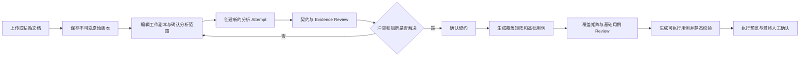

# API 测试智能体执行前阶段优化 PRD

> 文档版本：V2.1
> 文档状态：待评审
> 适用产品：API 测试智能体
> 优化范围：确认分析范围、覆盖矩阵与基础用例 Review
> 前置文档：`PRD-API测试智能体端到端闭环-V2.0.md`

## 1. 文档目的

本 PRD 优化 API 测试智能体进入真实执行前的两个阶段：

1. 确认分析范围与接口契约 Review；
2. 覆盖矩阵与基础用例 Review。

两个阶段都属于执行前阶段。完成本 PRD 后，用户仍需经过可执行用例生成、静态校验、执行预览和最终人工确认，才允许进入受控执行。本次优化不得绕过 `API_EXECUTION_ENABLED`、目标登记、角色权限或执行确认门禁。

## 2. 背景与现状问题

### 2.1 确认分析范围阶段

当前页面能够展示解析后的接口契约，但存在以下问题：

- 无法查看任务实际使用的完整原始文档或粘贴内容；
- 无法在当前任务中修订文档并重新分析，只能重新创建任务；
- “冲突与未解决项”仅展示错误码和说明，没有字段路径、对应原文和解决入口；
- 嵌套字段虽然可由后端 Review 服务修改，但当前页面只开放名称、方法、路径和说明；
- Evidence 切片过大或截断时，可能出现原文实际存在、系统却判定未 Grounding 的情况；
- 用户无法区分“文档缺失”“AI 推断”“Evidence 绑定错误”和“人工业务决定”。

当前样例任务中的两个 `UNGROUNDED_FIELD` 实际对应退出登录接口的：

- `parameters[0].location`：`X-CSRF-Token` 是否位于 Header；
- `parameters[0].required`：`X-CSRF-Token` 是否必填。

其中 Header 可由 Curl 原文直接证明，属于 Evidence 绑定问题；必填性没有直接的结构化描述，需要补充文档或进行有审计的人工确认。

### 2.2 覆盖矩阵与基础用例 Review 阶段

当前存在两个可复现的错误表现：

1. `undefined: coverage.filter is not a function`
   - 覆盖矩阵文件使用版本信封保存；
   - `/cases` 接口又把完整覆盖矩阵版本信封放入 `coverage`；
   - 实际数组位于 `coverage.items.items`；
   - 前端按 `coverage.items` 为数组调用 `filter()`，因此发生类型错误。

2. `REQUEST_FAILED: 请求失败 (503)`
   - 表示服务返回 HTTP 503，但没有返回前端约定的标准 JSON 错误体；
   - 前端只能回退显示 `REQUEST_FAILED`，用户无法判断是产物生成中、平台配置不可用、上游服务不可用还是代理异常；
   - 正常的“尚未生成”“正在生成”“前置 Review 未完成”不得使用 503 表达。

### 2.3 当前存储事实

基础用例、覆盖矩阵和可执行用例当前没有保存到平台 PostgreSQL 数据库，而是保存在 API Agent 的任务目录中：

```text
tasks/{task_id}/versions/base-cases/v{n}.json
tasks/{task_id}/versions/coverage/v{n}.json
tasks/{task_id}/versions/executable-cases/v{n}.json
```

每个版本具有版本号、SHA、来源版本和创建信息。该方式适合本机、单实例和 P0 验证，但不适合作为多实例、长期资产和高可用场景的最终存储方案。

## 3. 产品目标与非目标

### 3.1 产品目标

- 用户可在当前任务内查看原始文档、创建修订版本并重新分析；
- 重新分析保留旧版本、Review、用例和报告，不覆盖历史产物；
- 冲突与未解决项能够定位到字段和原文，并通过补证、修改、删除推断或人工确认完成闭环；
- 覆盖矩阵和基础用例使用稳定、明确的接口契约；
- 正常门禁、生成中和系统故障使用不同状态表达；
- 明确短期文件存储治理与长期混合存储方案；
- 重新分析后，所有受影响的下游产物和执行确认自动失效，避免执行旧用例。

### 3.2 非目标

- 不在此阶段执行真实接口请求；
- 不修改或放宽最终执行安全门禁；
- 不增加 Postman、gRPC、WebSocket 或 GraphQL 导入；
- 不增加外部 Bug 提交或稳定资产发布；
- 不提供多人实时协同编辑；
- 不把可执行用例生成为可在平台 Web 进程中直接运行的任意代码；
- P0 不强制迁移所有既有任务文件到数据库或对象存储。

## 4. 用户与权限

| 操作 | 管理员 | 测试开发 | 测试人员 | 只读用户 |
| --- | --- | --- | --- | --- |
| 查看脱敏原文和历史版本 | 是 | 是 | 是 | 是 |
| 创建文档修订版本 | 是 | 是 | 是 | 否 |
| 重新确认范围并重新分析 | 是 | 是 | 是 | 否 |
| 修改契约字段和 Evidence | 是 | 是 | 是 | 否 |
| 人工确认关键事实 | 是 | 是 | 是 | 否 |
| 确认高风险基础用例 | 是 | 是 | 是 | 否 |

所有写操作继续执行任务所有权、RBAC、CSRF、乐观锁和审计检查。

## 5. 优化后的执行前流程



## 6. 阶段一：确认分析范围与契约 Review

### 6.1 原始文档查看

需求编号：`PRE-01`

- 页面增加“原始文档”页签，与“契约字段”“Evidence”“版本历史”并列；
- 支持查看上传文件或粘贴文本的完整脱敏内容；
- 显示文件名、格式、字符数、SHA、创建时间、来源方式和当前使用版本；
- Markdown/TXT 提供文本视图；JSON/YAML 提供格式化视图和原文视图；
- 点击 Evidence 时定位并高亮对应原文片段；
- 原始上传版本始终只读，不允许覆盖。

验收标准：

- 用户能够确认系统实际分析的是哪一个文档版本；
- Evidence 不得只显示 `section-001`，必须能够定位到具体行、JSON Pointer 或字符范围；
- 展示前执行 Secret 和敏感数据脱敏。

### 6.2 文档修订

需求编号：`PRE-02`

- 用户点击“创建修订版”后，从当前版本生成可编辑工作副本；
- 支持编辑粘贴文本、Markdown、JSON 和 YAML；
- OpenAPI/Swagger 修订保存前必须通过语法、格式和支持类型预检；
- 保存修订时必须填写修改说明；
- 保存产生新的不可变 `DocumentRevision`，不得覆盖原始文档或旧修订；
- 页面提供当前版本与上一版本的文本差异；
- 同时编辑时使用 `base_version` 检测冲突，冲突返回 409，禁止静默覆盖。

文档版本状态：

```text
uploaded → editing → validated → analyzed → superseded
```

### 6.3 重新确认分析范围

需求编号：`PRE-03`

用户可在当前任务中重新选择：

- 文档修订版本；
- 包含或排除的接口；
- method、path、模块、标签过滤条件；
- 是否分析请求、响应、鉴权、错误码和依赖；
- 项目、模块和测试环境元数据。

提交前必须展示影响预览：

- 将使用的文档版本和 SHA；
- 预计重新分析的接口数量；
- 当前已确认契约数量；
- 将被标记为过期的覆盖矩阵、基础用例和可执行用例版本；
- 已有 Run 和 Bug 草稿只读保留，不会删除。

确认后创建新的 `GenerationAttempt`，从文档预检和契约解析阶段重新执行。不得要求用户重新创建任务。

### 6.4 下游版本失效规则

需求编号：`PRE-04`

- 重新分析不得删除任何旧产物；
- 新契约版本生成后，基于旧契约生成的覆盖矩阵、基础用例和可执行用例标记为 `stale`；
- `stale` 产物可查看和下载，但不得进入新的执行预览；
- 旧 Run、CaseResult、报告和 Bug 草稿保持原终态，并显示其来源版本；
- 已生成的执行确认 SHA 立即失效；
- 用户可从失败 Attempt 重试，不重复执行仍然有效的上游阶段。

### 6.5 冲突与未解决项工作区

需求编号：`PRE-05`

每个问题必须显示：

- 问题码、严重级别和可理解的中文说明；
- `contract_id`、接口 method/path 和 `field_path`；
- 当前字段值、值来源和置信度；
- 当前 Evidence 原文、位置和 Evidence 类型；
- 判定失败原因；
- 对确认状态和下游生成的影响；
- 推荐操作。

支持以下解决动作：

1. **重新绑定原文依据**：用户在当前文档版本中选择准确片段，建立新的字段级 Evidence；
2. **修改字段值**：支持 method、path、参数、请求体、响应、鉴权、依赖等白名单业务字段；
3. **删除 AI 推断**：移除无依据且不应作为契约事实的字段，可保留为 AI 建议；
4. **补充文档后重新分析**：跳转至文档修订并保留问题上下文；
5. **人工确认事实**：当文档未明确但测试人员能够做出业务决定时，记录为 `human_override`，必须填写依据或原因；
6. **保持未解决**：不影响保存草稿，但继续阻止契约确认。

人工确认不得伪装成原文 Evidence，页面必须明确显示“人工决定”。

### 6.6 复核与质量门禁

需求编号：`PRE-06`

- 每次解决操作生成新契约版本并重新运行质量门禁；
- 问题状态为 `open/resolved/reopened/accepted_as_suggestion`；
- 解决人与最终复核人可以为同一人，审计中必须分别记录两个动作；
- `blocker` 未解决时不得确认契约；
- 仅有非阻断建议时允许进入 `confirmed_candidate`；
- 批量确认只能处理已通过硬门禁的候选契约；
- 修订文档或重新分析导致事实变化时，已解决问题可以自动变为 `reopened`。

## 7. 阶段二：覆盖矩阵与基础用例 Review

### 7.1 稳定响应契约

需求编号：`PRE-07`

`GET /api-test-agent/api/v1/tasks/{task_id}/cases` 返回明确分离的两个版本对象：

```json
{
  "stage_state": "ready",
  "base_cases": {
    "version": 2,
    "sha256": "sha256...",
    "source_versions": {"contracts": 16},
    "items": []
  },
  "coverage_matrix": {
    "version": 2,
    "sha256": "sha256...",
    "contract_version": 16,
    "round_count": 1,
    "accepted_gap_ids": [],
    "partial_success": false,
    "items": []
  }
}
```

约束：

- `base_cases.items` 和 `coverage_matrix.items` 始终为数组；
- 数组为空时返回 `[]`，不得返回对象、`null` 或省略字段；
- 前端渲染前仍需进行结构校验，异常时展示“响应数据不符合契约”，不得抛出未捕获 JavaScript 错误；
- 为旧响应提供一个兼容读取周期，完成迁移后移除双层 `items`；
- 增加 API Schema 测试，防止服务端和页面再次产生结构漂移。

### 7.2 阶段状态与错误语义

需求编号：`PRE-08`

正常读取接口使用以下 `stage_state`：

| 状态 | 含义 | 页面表现 |
| --- | --- | --- |
| `blocked` | 契约尚未确认 | 显示前置条件，不显示错误 |
| `not_generated` | 尚未请求生成 | 显示“生成用例”入口 |
| `generating` | 生成 Attempt 运行中 | 显示等待状态和 Attempt ID |
| `ready` | 产物可 Review | 展示矩阵与用例 |
| `partial_success` | 部分接口成功 | 展示成功项和失败归因 |
| `failed` | 当前 Attempt 失败 | 保留旧产物并提供重试 |
| `stale` | 上游版本已变化 | 只读展示并要求重新生成 |

错误码规则：

- 前置条件不满足使用业务状态或 409，不使用 503；
- 产物仍在生成时返回状态对象，不使用 503；
- 503 仅用于平台配置服务、依赖服务或代理确实暂时不可用；
- 所有非 2xx 响应必须返回统一 JSON：

```json
{
  "error": {
    "code": "PLATFORM_CONFIG_UNAVAILABLE",
    "message": "平台配置服务暂时不可用",
    "retryable": true,
    "request_id": "req_xxx",
    "suggested_action": "稍后重试或联系管理员"
  }
}
```

### 7.3 覆盖矩阵 Review

需求编号：`PRE-09`

- 按接口和覆盖维度展示正常、必填缺失、类型、枚举、边界、鉴权、错误响应、幂等和业务场景；
- 每个覆盖项显示规则来源、关联用例、是否必需、覆盖状态和缺口原因；
- 支持按接口、维度、覆盖状态、来源和风险筛选；
- 点击覆盖项可定位对应基础用例；
- 接受缺口必须填写理由并生成新矩阵版本；
- 补齐最多 3 轮，页面显示当前轮次、停止原因和未覆盖项；
- `partial_success` 必须保留成功接口的矩阵和用例。

### 7.4 基础用例 Review

需求编号：`PRE-10`

- 用例按接口分组，展示名称、目标、维度、来源、风险、状态和契约版本；
- 支持编辑、新增、确认、禁用和批量操作；
- 编辑使用 `base_version` 乐观锁；
- 高风险用例默认不可执行，必须由管理员、测试开发或测试人员逐条确认；
- 契约或文档版本变化后，用例显示 `stale`，不得进入可执行用例生成；
- 生成可执行用例前展示基础用例数量、已确认数量、禁用数量、高风险数量和覆盖缺口。

## 8. 数据与存储方案

### 8.1 P0：治理现有文件存储

为避免本次界面与流程优化扩大为基础设施迁移，P0 保留现有任务目录存储，但必须补齐：

- 所有源文档、契约、矩阵、基础用例和可执行用例使用不可变版本文件；
- 原子写入、`fsync`、`os.replace` 和 SHA 校验；
- 当前版本指针和产物注册表在锁内更新；
- API 不接受任意文件路径，只接受 task、version 和 artifact ID；
- Review 和重新分析不得覆盖或删除旧版本；
- 页面与接口只读取当前有效版本，历史版本显式指定；
- 增加备份、保留期、磁盘容量告警和损坏恢复测试。

### 8.2 P2：数据库元数据 + 对象存储不可变产物

推荐的长期方案为混合存储：

**PostgreSQL 保存：**

- Task、Attempt、阶段状态和当前版本指针；
- Contract、Coverage、Case、Run、DefectDraft 的 ID 与关联关系；
- Review 决定、版本元数据、SHA、审计和可查询摘要；
- 乐观锁版本、权限范围和保留策略。

**对象存储保存：**

- 原始文档及修订版本；
- 完整契约、覆盖矩阵、基础用例和可执行用例 JSON；
- 请求/响应附件、日志、报告和下载文件；
- 以 task、kind、version 和 SHA 组成不可变对象键。

**本地文件系统仅保存：**

- 当前 Attempt 和 Run 的短生命周期工作目录；
- 可重建缓存；
- 受控容器的当前 Run 输入与输出。

选择该方案的原因：

- 数据库适合事务、筛选、权限、关联和审计；
- 大文档和大 JSON 全部放数据库会造成表膨胀、备份和查询成本上升；
- 对象存储适合不可变大对象、版本和生命周期管理；
- 可执行用例保持声明式 JSON，执行器读取固定 Schema，不存储或执行任意用户代码。

### 8.3 迁移原则

- P2 迁移不得阻塞 P0、P1 功能交付；
- 先实现双读和新写入，再后台登记既有文件版本；
- 迁移后校验对象 SHA 与旧文件一致；
- 既有 Run 和草稿保持原引用可访问；
- 完成核验和回滚演练前不得删除旧文件；
- 本 PRD 不授权直接执行数据迁移。

## 9. 服务接口需求

新增或调整接口：

| 方法 | 路径 | 用途 |
| --- | --- | --- |
| GET | `/tasks/{task_id}/documents` | 查询原始文档与修订版本 |
| GET | `/tasks/{task_id}/documents/{version}` | 查看指定脱敏文档版本 |
| POST | `/tasks/{task_id}/documents/revisions` | 创建文档修订版本 |
| GET | `/tasks/{task_id}/documents/compare` | 查看版本差异 |
| GET | `/tasks/{task_id}/analysis-scope` | 查看当前分析范围 |
| PUT | `/tasks/{task_id}/analysis-scope` | 保存新的分析范围版本 |
| POST | `/tasks/{task_id}/reanalyze` | 以指定文档和范围创建新 Attempt |
| GET | `/tasks/{task_id}/review-issues` | 查询冲突与未解决项 |
| PUT | `/tasks/{task_id}/review-issues/{issue_id}` | 解决、复核或重新打开问题 |
| GET | `/tasks/{task_id}/cases` | 返回稳定的矩阵与基础用例契约 |

所有写接口必须包含 CSRF、`base_version`、修改原因和操作者身份。`reanalyze` 必须使用幂等键，避免重复点击创建多个相同 Attempt。

## 10. 状态、版本与审计

### 10.1 新增核心对象

- `DocumentRevision`：不可变文档版本、SHA、来源版本、修改说明；
- `AnalysisScopeVersion`：包含/排除规则及其版本；
- `ReviewIssue`：字段问题、状态、解决动作和复核信息；
- `GenerationAttempt`：绑定文档版本、范围版本和上游版本。

### 10.2 审计要求

记录以下事件：

- 查看敏感原文；
- 创建、保存和放弃文档修订；
- 修改分析范围和发起重新分析；
- 绑定 Evidence、修改字段、删除推断、人工确认和复核；
- 接受覆盖缺口、编辑或确认基础用例；
- 版本冲突、权限拒绝和重复提交。

审计只记录对象、版本、字段路径、动作和结果，不记录未脱敏正文或 Secret。

## 11. 非功能要求

### 11.1 安全

- 原始文档保存、展示、差异和下载前执行脱敏；
- 远程 `$ref` 不联网解析；
- 文档编辑器不得执行 HTML、脚本或文档内链接；
- 用户不能通过文档内容指定真实执行 Host；
- 人工确认不能绕过角色权限和最终执行确认。

### 11.2 可靠性

- 后续阶段失败不得影响文档、契约和已生成用例的访问；
- 重新分析、Review 和矩阵操作均采用追加版本；
- 接口返回结构必须通过服务 API 契约测试；
- 页面不得因单个字段类型异常导致整个阶段不可用。

### 11.3 性能

- 5 MB 以内文本首次展示目标小于 2 秒；
- 大文档使用分段加载，不一次把全部内容注入 HTML；
- 文本差异可按章节或接口范围计算；
- 任务列表和阶段页面不得读取全部历史版本正文。

### 11.4 可用性与无障碍

- 错误信息必须包含具体对象、字段和建议操作；
- 问题状态不得只依赖颜色；
- Evidence 高亮、问题操作和确认对话框支持键盘操作；
- 保存、重新分析和离开未保存页面时提供明确状态提示。

## 12. 优先级与交付范围

### P0：阻断问题修复

- 修复覆盖矩阵双层 `items` 数据契约；
- 增加前端响应结构防御性校验；
- 统一 503 和业务门禁错误体；
- 未解决项显示 `field_path`、当前值和 Evidence；
- 支持参数、请求体、响应和鉴权字段的人工修改与复核；
- 保留现有文件化版本存储。

### P1：任务内重新分析闭环

- 查看完整脱敏原文；
- 文档修订、差异和版本冲突；
- 重新确认分析范围；
- 创建新 Attempt 并标记下游产物 `stale`；
- 重新绑定 Evidence、删除推断和人工确认；
- 正常阶段状态取代通用 503。

### P2：长期存储治理

- PostgreSQL 元数据与对象存储不可变产物；
- 双读、新写和既有版本登记；
- 备份、生命周期、容量和恢复演练；
- 完成后再评估是否停止以本地文件作为事实来源。

## 13. 验收标准

### 13.1 确认分析范围

- 可在原任务查看系统实际使用的脱敏原文；
- 可创建修订版并从该版本重新分析，无需创建新任务；
- 旧契约、用例、Run 和草稿仍可追溯；
- 下游旧产物明确标记 `stale` 且不能进入执行预览；
- 每个冲突项显示具体字段路径和对应原文；
- Header Evidence 绑定正确后能够消除相应 `UNGROUNDED_FIELD`；
- 人工确认必填性时生成 `human_override` Evidence、原因和审计；
- 未解决 blocker 不能确认契约。

### 13.2 覆盖矩阵与基础用例 Review

- `coverage_matrix.items` 在所有响应中均为数组；
- 不再出现 `coverage.filter is not a function`；
- 未生成和生成中不再显示为 503；
- 真实 503 返回稳定错误码、请求 ID、是否可重试和建议动作；
- 部分成功时可查看成功接口、失败接口和失败原因；
- 覆盖缺口、来源、关联用例和补齐轮次可追溯；
- 高风险用例未经管理员、测试开发或测试人员确认，不得进入可执行用例生成。

### 13.3 存储与版本

- 明确证明 P0 仍使用文件化版本 JSON，而不是数据库；
- 文件版本具备 SHA、来源版本、原子写入和历史保留；
- P2 存储迁移开始前另行完成数据模型、容量、备份和回滚评审；
- 不因本 PRD 自动删除或迁移任何既有任务数据。

## 14. 测试要求

- 文档修订 Schema、格式预检、版本冲突和脱敏测试；
- 重新分析的幂等、Attempt、失败重试和下游失效测试；
- Evidence 重新绑定、人工确认、删除推断和复核测试；
- `ReviewIssue` 状态机与权限测试；
- `/cases` 响应 Schema 和旧格式兼容测试；
- 覆盖矩阵为空、部分成功、损坏和版本不一致测试；
- 业务门禁、生成中、配置不可用和真实 503 的错误语义测试；
- 浏览器验证不再出现未捕获 JavaScript 类型错误；
- 回归验证 `API_EXECUTION_ENABLED` 和最终执行确认未被绕过。

## 15. 成功指标

- 因文档小范围修订而重新创建任务的比例下降 80%；
- 冲突项能够从页面完成闭环的比例不低于 95%；
- 覆盖矩阵页面未捕获 JavaScript 错误为 0；
- 正常业务门禁被展示为系统 5xx 的次数为 0；
- 所有重新分析和人工确认操作的版本、原因和人员可追溯率为 100%；
- 不存在重新分析后误执行旧可执行用例的情况。

## 16. 已确认风险处理决策

以下处理方案均已确认，进入开发约束，不再作为待确认项：

| 项目 | 已确认风险 | 已接受的处理决策 |
| --- | --- | --- |
| 文档编辑 | 修改原文可能改变大量接口 | 提交前展示影响预览，旧版本只读保留 |
| 人工确认 | 用户可能把推断当成文档事实 | 强制标记 `human_override`，填写原因并审计 |
| Evidence 定位 | 旧任务只有粗粒度 Section | 旧任务允许显示粗粒度证据，新 Attempt 使用行号或 Pointer |
| 下游失效 | 重新分析后旧用例仍可能被误选 | 所有预览按有效版本 SHA 校验，`stale` 一律阻断 |
| 存储迁移 | 直接迁移会扩大范围并增加数据风险 | P0 保留文件，P2 独立评审和迁移 |
| 兼容性 | 旧页面依赖 `/cases` 现有响应 | 提供一个兼容周期并增加契约测试 |

## 17. 产品结论

本次两个优化阶段都位于真实执行之前。推荐先修复 P0 的数据契约、错误语义和问题解决入口，再实现任务内文档修订与重新分析闭环。当前文件化版本存储不是本轮报错的直接原因，不应为了修复页面问题立即迁移；长期应采用 PostgreSQL 保存可查询元数据、对象存储保存不可变产物、本地目录仅作为临时工作区的混合方案。
