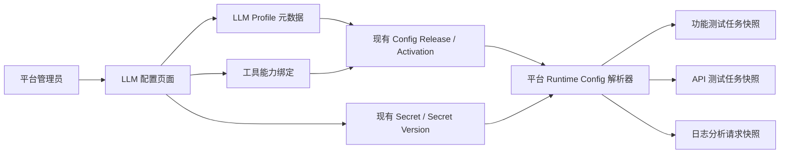

# TestPlatform LLM 统一配置中心开发设计与实施计划

> 文档版本：v1.0  
> 编写日期：2026-08-17  
> 状态：待确认，确认后生成最终执行计划并进入开发  
> 适用平台版本：计划随平台级升级发布为 `1.01.000`  
> 关联范围：`test-platform`、`functional-test-agent`、`api-test-agent`、`log_filter_tool`

## 1. 文档目的

本设计用于把当前分散在平台配置、工具 Release、Compose 环境变量和 Secret 文件中的 LLM 配置，收敛为测试开发平台统一管理的 LLM 控制面。

本次不是简单地把 `.env` 字段搬到 Web，也不为没有直接调用 LLM 的工具创建无效配置。最终目标是：

- 平台管理员可以创建可复用的公共 LLM Profile；
- 每个真实使用 LLM 的工具或能力可以按 `dev/prod` 选择 Profile；
- 工具可以覆盖少量运行参数，必要时使用独立 API Key；
- 普通参数有草稿、校验、发布、回滚和审计；
- API Key 使用现有信封加密体系，保存后永不回显；
- 每个任务或分析请求只使用一次确定的不可变 LLM 配置快照；
- 平台模式不再依赖散落的 LLM 环境变量和 Secret 文件；
- 工具独立模式继续保留 `.env` 或 Secret 文件，不破坏独立运行能力。

本文锁定数据结构、权限、Secret、安全边界、API、工具改造、迁移和回滚方案。确认本文后，再生成逐文件、逐命令的最终执行计划。

## 2. 实施边界

### 2.1 本期交付

- 新增平台管理页面 `/settings/llm`；
- 新增 LLM Profile 和工具绑定两个业务域；
- 支持 `dev/prod` 独立配置与 Secret；
- 支持 OpenAI-compatible 协议；
- 支持 Base URL、模型、Temperature、Max Tokens、请求超时和启用状态；
- 支持 Profile 公共 API Key；
- 支持工具绑定独立 API Key 覆盖；
- 支持配置草稿、校验、发布、回滚、连接测试和审计；
- 接入功能测试智能体、API 测试智能体和日志分析中的 People Search AI 总结；
- 提供任务级或请求级不可变配置快照；
- 保留工具独立模式的原配置方式。

### 2.2 本期不实现

- 不给 `TrackEvents_tess`、`Truthy_Search`、`Truthy_ApiAutoTest2` 创建 LLM 绑定；
- 不把 Truthy_Search 上游内部使用的模型视为本平台可切换模型；
- 不增加模型网关、转发代理、统一计费或 Token 用量结算；
- 不增加自动模型发现、模型列表同步或 Provider SDK；
- 不增加模型自动故障切换、负载均衡或多模型编排；
- 不管理 Prompt、Skill 文件或知识库；
- 不实现用户个人 API Key；
- 不实现 API Key 自动刷新，LLM API Key 按长期 Secret 管理；
- 不在自动化测试中调用真实付费模型；
- 不为平台挂载 Docker Socket；
- 不改变三个工具的核心测试、解析或规则算法。

## 3. 当前实现审计

### 3.1 实际 LLM 使用情况

| 工具/能力 | 是否直接调用 LLM | 当前配置来源 | 当前快照语义 | 本期处理 |
|---|---:|---|---|---|
| 功能测试智能体 | 是 | 平台工具 Release：`LLM_MODEL`、`LLM_BASE_URL`、`LLM_API_KEY` | 每个任务开始时读取一次平台配置 | 接入公共 Profile，保留任务快照 |
| API 测试智能体 | 是 | 平台工具 Release：`LLM_MODEL`、`LLM_BASE_URL`、`LLM_API_KEY` | 每个任务开始时读取一次平台配置 | 接入公共 Profile，保留任务快照 |
| 日志分析 / People Search AI 总结 | 是 | Compose 环境变量和只读 API Key 文件 | 每次请求读取进程环境和文件 | 改为每次分析请求读取平台快照 |
| 埋点分析 | 否 | 无 | 无 | 不显示 LLM 配置 |
| 检索评测 | 否（本工具没有可切换模型客户端） | 上游接口和 Admin 凭证 | 无 | 不显示 LLM 配置 |
| 接口自动化 | 否 | pytest/任务执行配置 | 无 | 不显示 LLM 配置 |

### 3.2 可直接复用的平台能力

平台第二阶段已经提供：

- `dev/prod` 环境模型；
- `config_definitions` 白名单；
- `config_releases` 草稿、revision 乐观锁、发布和回滚；
- `config_activations` 当前生效 Release；
- `secrets/secret_versions` AES-256-GCM 信封加密；
- 发布时冻结 Secret Version；
- 工具 Client Token、工具/环境隔离和 `config.read` 能力；
- `runtime-config` 的 `Cache-Control: no-store`；
- 结构化审计；
- 两个 Agent 在任务开始时读取一次配置并记录 Release ID。

因此，本期不新增第二套 Release、Secret 或环境体系。LLM Profile 和绑定只作为新的业务作用域接入现有配置控制面。

### 3.3 当前问题

1. 两个 Agent 虽然已由平台管理 LLM 参数，但配置分别属于各自工具，无法复用公共模型配置。
2. 日志分析仍从 Compose 和 `.runtime-secrets/llm-api-key` 读取，无法在 Web 发布和回滚。
3. 同一个 Base URL、模型和 API Key 可能被重复维护，更新时容易遗漏。
4. 当前界面无法明确看到“哪个工具正在使用哪个模型配置”。
5. 日志分析没有记录平台 LLM Profile/Release，结果难以追溯。
6. 如果直接让工具实时读取可变 Profile，运行中的任务可能发生模型漂移。

## 4. 总体设计



核心原则：

- Profile 是可复用的模型连接配置；
- Binding 表示某个工具能力选择哪个 Profile；
- Profile 与 Binding 的具体参数继续通过现有 Release 发布；
- API Key 继续通过现有 Secret Version 冻结；
- 平台只在工具请求运行配置时解密；
- 工具在一个任务或分析请求内不再次读取配置；
- Web 永远只看到 Secret 是否配置、版本和状态，不看到明文。

## 5. 数据结构设计

### 5.1 新增业务身份表

本期只新增两张业务身份表。参数版本、激活关系和 Secret 不重复建表。

#### 5.1.1 `llm_profiles`

| 字段 | 类型 | 约束 | 说明 |
|---|---|---|---|
| `id` | String(64) | PK | `llmp_<uuid>` |
| `name` | String(128) | 非空 | 页面显示名称，例如 `DeepSeek Shared` |
| `name_normalized` | String(128) | 唯一、非空 | 名称去空格、小写后的唯一值 |
| `description` | Text | 非空、默认空 | 用途说明，不保存凭证 |
| `protocol` | String(32) | 非空 | 本期只允许 `openai_compatible` |
| `is_archived` | Boolean | 非空、默认 false | 归档后不能创建新绑定，历史 Release 保留 |
| `created_by` | String(64) | 非空 | 创建用户 ID |
| `created_at` | DateTime TZ | 非空 | 创建时间 |
| `updated_at` | DateTime TZ | 非空 | 更新时间 |

Profile 本身不绑定环境。`dev/prod` 的具体值由现有 `config_releases.environment_id` 区分，因此同一个 Profile 可以在两个环境使用不同 Base URL、模型和 API Key。

#### 5.1.2 `tool_llm_bindings`

| 字段 | 类型 | 约束 | 说明 |
|---|---|---|---|
| `id` | String(64) | PK | `llmb_<uuid>` |
| `tool_id` | String(64) | FK `tools.id` | 真实工具 ID |
| `capability_key` | String(64) | 非空 | 工具内部稳定能力键 |
| `display_name` | String(128) | 非空 | 页面显示名称 |
| `description` | Text | 非空、默认空 | 能力边界说明 |
| `created_by` | String(64) | 非空 | 创建用户 ID |
| `created_at` | DateTime TZ | 非空 | 创建时间 |
| `updated_at` | DateTime TZ | 非空 | 更新时间 |

唯一约束：

```text
UNIQUE(tool_id, capability_key)
```

首批确定性创建三个绑定身份：

| Tool ID | capability_key | 显示名称 |
|---|---|---|
| `functional-test-agent` | `default` | 功能测试智能体默认模型 |
| `api-test-agent` | `default` | API 测试智能体默认模型 |
| `log-filter` | `people-search-summary` | People Search 日志 AI 总结 |

`capability_key` 为后续一个工具内部使用多个 Profile 留出稳定边界，但本期不拆分功能 Agent 内部的需求拆解、Review 和用例生成模型。

### 5.2 复用现有配置 Release

扩展现有 `owner_type`：

```text
platform | tool | llm_profile | llm_binding
```

#### Profile 配置定义

创建 Profile 时，平台在同一事务中为该 Profile 创建以下白名单定义：

| key | 类型 | 必填 | 默认值 | 校验 | apply_mode |
|---|---|---:|---|---|---|
| `BASE_URL` | url | 是 | 无 | HTTP(S)，无 userinfo/query/fragment | `next_task` |
| `MODEL` | string | 是 | 无 | 1–128 字符 | `next_task` |
| `TEMPERATURE` | float | 是 | `0.2` | `0.0–2.0` | `next_task` |
| `MAX_TOKENS` | int | 是 | `4096` | `1–131072` | `next_task` |
| `TIMEOUT_SECONDS` | int | 是 | `60` | `1–600` | `next_task` |
| `ENABLED` | bool | 是 | `true` | 布尔值 | `next_task` |
| `API_KEY` | secret | 是 | 无 | 保存后不回显 | `next_task` |

定义作用域：

```text
owner_type = llm_profile
owner_id   = <llm_profile.id>
```

Base URL 统一保存 API 根路径，例如：

```text
https://dashscope.aliyuncs.com/compatible-mode/v1
```

调用方按 OpenAI-compatible 协议拼接 `/chat/completions`。不再让某些工具保存完整 endpoint、另一些工具保存 API 根路径。

#### Binding 配置定义

创建 Binding 时，平台在同一事务中创建：

| key | 类型 | 必填 | 默认值 | 说明 |
|---|---|---:|---|---|
| `PROFILE_ID` | string | 是 | 无 | 当前环境选择的 Profile |
| `ENABLED` | bool | 是 | `true` | 是否允许该能力调用 LLM |
| `MODEL_OVERRIDE` | string | 否 | `null` | 非空时覆盖 Profile |
| `TEMPERATURE_OVERRIDE` | float | 否 | `null` | 非空时覆盖 Profile |
| `MAX_TOKENS_OVERRIDE` | int | 否 | `null` | 非空时覆盖 Profile |
| `TIMEOUT_SECONDS_OVERRIDE` | int | 否 | `null` | 非空时覆盖 Profile |
| `API_KEY_OVERRIDE` | secret | 否 | 无 | 配置后优先于 Profile API Key |

定义作用域：

```text
owner_type = llm_binding
owner_id   = <tool_llm_binding.id>
```

绑定 Release 发布时必须校验：

- `PROFILE_ID` 存在且未归档；
- 同环境下 Profile 已有 active Release；
- Profile 的 `ENABLED=true`；
- Binding 的覆盖值符合 Profile 相同范围；
- Profile API Key 或 Binding API Key Override 至少有一个；
- 工具 ID 与当前用户权限范围匹配。

Profile 归档前必须确认没有任何环境的 active Binding 引用它；存在引用时返回冲突，管理员需先发布新的 Binding。这样归档不会让正在工作的能力突然失效。

### 5.3 生效配置合并规则

优先级从低到高固定为：

```text
Profile active Release
  → Binding active Release 的普通参数覆盖
  → Binding API_KEY_OVERRIDE
```

规则：

1. Binding 未启用：该能力不得调用 LLM；
2. Profile 未启用、未发布或被归档：新任务返回 `LLM_CONFIG_NOT_READY`；
3. 普通覆盖值为 `null` 或空字符串时不覆盖；
4. Binding API Key Override 已发布时优先使用；
5. 否则使用 Profile 发布时冻结的 API Key Version；
6. 不读取其他环境、其他 Profile 或其他工具的 Secret；
7. 不回退到 Web 中未发布的草稿；
8. 平台模式不回退到旧 LLM 环境变量。

### 5.4 不可变运行快照

内部运行配置新增可选 `llm` 字段：

```json
{
  "llm": {
    "status": "ready",
    "binding_id": "llmb_xxx",
    "capability_key": "default",
    "binding_release_id": "rel_xxx",
    "binding_release_version": 3,
    "profile_id": "llmp_xxx",
    "profile_name": "DeepSeek Shared",
    "profile_release_id": "rel_xxx",
    "profile_release_version": 5,
    "protocol": "openai_compatible",
    "base_url": "https://example.com/v1",
    "model": "model-name",
    "temperature": 0.2,
    "max_tokens": 4096,
    "timeout_seconds": 60,
    "api_key": "仅内部接口在 include_secrets=true 时返回",
    "api_key_version": 2,
    "snapshot_id": "llms_<sha256>"
  }
}
```

`snapshot_id` 只由以下非明文数据计算：

- 环境；
- tool_id/capability_key；
- Profile/Binding Release ID；
- API Key Secret Version ID；
- 合并后的普通参数。

API Key 明文不参与可展示哈希，也不写入任务、日志、报告或审计。

`include_secrets=false` 时：

- 不返回 `api_key`；
- 返回 `api_key_configured=true/false`；
- 页面只能显示配置状态和版本。

## 6. 权限设计

### 6.1 新增平台权限

| 权限代码 | 作用 |
|---|---|
| `platform.llm.manage` | 创建、修改、归档 Profile；维护所有工具绑定；校验、发布、回滚和测试连接 |
| `platform.llm.secret.manage` | 替换所有 Profile 或 Binding 的 API Key |

不新增单独的 `platform.llm.view`。读取规则复用当前身份和工具权限，减少权限数量。

### 6.2 复用工具权限

| 权限 | LLM 场景 |
|---|---|
| `tool.view` | 查看该工具当前使用的 Profile 名称、模型、状态和版本，不显示 Secret 元数据 |
| `tool.config.manage` | 管理该工具 Binding 的普通配置和发布，不得修改公共 Profile |
| `tool.secret.manage` | 替换该工具 Binding 的独立 API Key Override |

### 6.3 操作授权矩阵

| 操作 | 平台管理员 | 具有指定工具 `tool.config.manage` | 只读/执行角色 |
|---|---:|---:|---:|
| 查看公共 Profile 列表 | 是 | 只查看当前环境可选择的已启用摘要 | 否 |
| 创建/修改/归档 Profile | 是 | 否 | 否 |
| 替换 Profile API Key | 需 `platform.llm.secret.manage` | 否 | 否 |
| 查看工具 Binding | 是 | 仅授权工具 | 仅显示有效模型摘要 |
| 修改/发布工具 Binding | 是 | 仅授权工具 | 否 |
| 替换 Binding API Key | 是 | 还需该工具 `tool.secret.manage` | 否 |
| 测试 Profile 连接 | 是 | 否 | 否 |
| 测试 Binding 有效配置 | 是 | 仅授权工具 | 否 |

内置 `role_platform_admin` 在迁移中获得两个新平台权限。其他内置角色不自动获得新的平台权限，继续通过已有工具授权控制 Binding。

## 7. Secret 设计

### 7.1 存储与加密

- API Key 继续写入 `secrets` 和不可变 `secret_versions`；
- 使用现有 AES-256-GCM 信封加密；
- 每个 Secret Version 使用独立 DEK；
- KEK 继续来自环境隔离的只读文件；
- AAD 继续绑定 `secret_id + environment_id + version`；
- `dev/prod` 使用不同 Secret 记录和不同 KEK；
- Secret 不随普通配置从 dev 自动提升到 prod；
- Profile API Key 与 Binding API Key Override 是不同 Secret，不能跨作用域读取。

### 7.2 Secret 生命周期

1. 管理员保存新 API Key；
2. 平台加密、回读校验并生成新 Secret Version；
3. 当前 active Release 仍引用旧 Secret Version，不受影响；
4. 草稿校验和连接测试使用新 Secret Version；
5. 发布时把该 Secret Version 冻结到新 Release；
6. 新任务使用新版本，运行中任务继续使用原快照；
7. 回滚配置 Release 后重新使用历史冻结版本；
8. Web、API、日志和审计均不返回明文。

### 7.3 Secret 脱敏要求

以下内容不得进入响应、日志、审计、异常、任务文件或报告：

- API Key 明文；
- Authorization Header；
- Provider 原始错误响应中的请求回显；
- 请求体中的系统 Prompt 或测试数据；
- 解密异常内部栈中的密文、nonce、DEK 或 KEK。

允许展示：

- 是否已配置；
- Secret 版本号；
- 最近更新时间；
- 连接测试成功/失败；
- 脱敏稳定错误码；
- Profile/Binding Release ID。

## 8. 公共与内部接口设计

### 8.1 LLM 业务身份接口

```text
GET    /api/v1/llm/profiles
POST   /api/v1/llm/profiles
GET    /api/v1/llm/profiles/{profile_id}
PATCH  /api/v1/llm/profiles/{profile_id}

GET    /api/v1/llm/bindings
POST   /api/v1/llm/bindings
GET    /api/v1/llm/bindings/{binding_id}
PATCH  /api/v1/llm/bindings/{binding_id}

GET    /api/v1/llm/effective-config
POST   /api/v1/llm/test-connection
```

Profile/Binding 参数的草稿、发布和回滚复用现有接口：

```text
GET/POST/PUT /api/v1/config/releases...
POST /api/v1/config/releases/{id}/validate
POST /api/v1/config/releases/{id}/publish
POST /api/v1/config/releases/{id}/rollback
GET/PUT /api/v1/secrets...
```

现有 Pydantic `owner_type` 白名单扩为：

```text
platform | tool | llm_profile | llm_binding
```

LLM 页面调用这些接口时，后端必须按 LLM Profile/Binding 实际归属重新授权，不能把未知 `owner_id` 当作普通工具 ID。

### 8.2 连接测试接口

请求示例：

```http
POST /api/v1/llm/test-connection
Content-Type: application/json
X-CSRF-Token: <tp_csrf>

{
  "environment_id": "dev",
  "scope_type": "llm_profile",
  "scope_id": "llmp_xxx",
  "release_id": "rel_draft_xxx"
}
```

响应只包含：

```json
{
  "status": "success",
  "latency_ms": 842,
  "model": "model-name",
  "request_id": "req_xxx"
}
```

安全规则：

- 使用固定最小 Prompt，不携带任何业务文档、日志、用例或用户输入；
- `max_tokens` 固定为 1–4，不创建工具任务；
- 不自动重试；
- 连接和读取超时上限 10 秒；
- 不跟随 HTTP 重定向；
- 限制最大响应体；
- prod 只允许 HTTPS；
- 拒绝 URL userinfo、query、fragment、loopback、link-local 和云元数据地址；
- Provider Host 必须满足已登记的平台注册配置 `LLM_PROVIDER_HOST_ALLOWLIST`；该配置可在 Web 版本化发布，但 loopback、link-local 和云元数据地址仍由代码硬拒绝，不能通过 Web 放开；
- 错误只映射为稳定错误码，不返回 Provider 原始正文；
- 只审计 Profile、环境、耗时、结果和错误码。

稳定错误码：

```text
LLM_PROFILE_NOT_FOUND
LLM_BINDING_NOT_FOUND
LLM_CONFIG_NOT_READY
LLM_SECRET_UNAVAILABLE
LLM_CONNECTION_FAILED
LLM_CONNECTION_TIMEOUT
LLM_RESPONSE_INVALID
LLM_TARGET_NOT_ALLOWED
```

### 8.3 工具内部接口

继续使用：

```http
GET /api/v1/internal/tools/{tool_id}/runtime-config
```

新增查询参数：

```text
llm_capability=default
```

日志分析使用：

```text
llm_capability=people-search-summary
```

平台根据 Tool Client 的 `tool_id + environment_id` 查找 Binding，调用方不能在请求中指定其他工具或环境。响应继续设置 `Cache-Control: no-store`。

## 9. 前端设计

### 9.1 页面与导航

新增受保护路由：

```text
/settings/llm
```

平台管理入口新增“LLM 配置”，页面包含两个一级分区：

1. 公共配置；
2. 工具绑定。

保持现有 React、TypeScript、Vite 和 Apple Developer-inspired 桌面工作台设计 Token，不新增 UI、状态或图标依赖。

### 9.2 公共配置区

列表字段：

- 名称；
- 协议；
- 当前环境；
- Base URL 的安全摘要（仅 origin/路径，不带 query）；
- 模型；
- active Release 版本；
- API Key 是否配置；
- 连接状态；
- 使用该 Profile 的绑定数量；
- 操作。

详情编辑：

- 普通字段使用现有草稿、revision、校验、发布和回滚；
- API Key 使用独立 Secret 输入框；
- 保存后立即清空组件内存；
- 页面不把 API Key 写入 localStorage/sessionStorage；
- prod 发布和 Profile 归档需要二次确认；
- 连接测试结果不展示模型回复正文。

### 9.3 工具绑定区

只显示三项真实绑定。每项显示：

- 工具和能力名称；
- 当前 Profile；
- 最终有效模型；
- 是否存在参数覆盖；
- 是否存在独立 API Key；
- Binding/Profile Release；
- 生效状态；
- “下一任务”或“下一分析请求”生效提示。

没有直接 LLM 调用的三个工具不出现在绑定列表，也不显示“未配置”。

### 9.4 状态与无障碍

- 加载：骨架或现有加载状态，不显示假数据；
- 空状态：尚未创建 Profile；
- 未配置：Binding 没有 active Release；
- Secret 缺失：明确提示 API Key 尚未配置；
- 连接失败：显示稳定错误码和排障建议；
- 无权限：不泄露 Profile、工具或 Secret 名称；
- 所有表单、切换、确认和测试连接可键盘完成；
- 状态不只依赖颜色；
- `aria-live` 只报告发布、回滚和测试结果；
- 只验收 1280px 以上桌面 Web。

## 10. 工具改造设计

### 10.1 功能测试智能体

- 保留现有每任务调用一次 `config_loader()` 的时机；
- 优先读取 `snapshot.llm`；
- 迁移期在 `llm` 不存在时回退现有 `normal.LLM_MODEL`、`normal.LLM_BASE_URL`、`secrets.LLM_API_KEY`；
- 只在子进程内存环境注入模型配置；
- 不把 API Key 写入任务 JSON、console.log 或 config_history；
- 任务记录增加 Binding/Profile Release 和 `snapshot_id`；
- 运行中任务不重新加载；
- 平台模式下 Binding 已启用但不可用时拒绝新任务；
- 独立模式继续使用原环境变量。

### 10.2 API 测试智能体

改造规则与功能测试智能体一致：

- 任务启动前获取一次快照；
- Runner 环境由白名单构造；
- Controller、Executor 和 Egress Proxy 不获得不需要的 API Key；
- API Key 仅传给真正调用模型的 Agent 进程；
- 真实 API 执行开关、允许目标和数据库配置保持独立，不进入 LLM Profile。

### 10.3 日志分析

新增平台/独立双来源：

```text
LOG_FILTER_LLM_CONFIG_SOURCE=env|platform
```

规则：

- 独立模式默认 `env`，继续读取现有环境变量和 key file；
- 平台 Compose 固定 `platform`；
- `log-filter` Tool Client 增加 `config.read` 能力；
- 每次 `/people-search/analyze` 在准备 AI 总结前读取一次 `people-search-summary` 快照；
- 规则分析完成后，即使平台或模型不可用也必须返回规则报告；
- 平台不可用时 `data.ai.status=FAILED`，错误码为 `LLM_CONFIG_UNAVAILABLE`；
- 平台模式不得回退 Compose 中旧 API Key；
- AI 调用仍保持最多一次、不重试、不改变规则结论；
- 报告只记录 Profile 名、模型、Release 和 snapshot_id，不记录 API Key。

迁移后平台 Compose 删除：

```text
PEOPLE_SEARCH_ANALYZER_LLM_ENDPOINT
PEOPLE_SEARCH_ANALYZER_LLM_MODEL
PEOPLE_SEARCH_ANALYZER_LLM_API_KEY_FILE
PEOPLE_SEARCH_ANALYZER_LLM_TIMEOUT_SECONDS
/.runtime-secrets/llm-api-key 挂载
```

独立 `log_filter_tool/docker-compose.yml` 暂不删除这些配置。

## 11. 审计设计

新增或复用以下事件：

```text
llm.profile.create
llm.profile.update
llm.profile.archive
llm.binding.create
llm.connection.test
config.release.update
config.release.validate
config.release.publish
config.release.rollback
secret.replace
tool.llm.snapshot.loaded
tool.llm.request.failed
```

审计允许记录：

- actor、环境、tool_id、capability_key；
- Profile/Binding ID；
- Release ID 和版本；
- Secret Version ID 或版本号；
- 连接耗时、结果和稳定错误码；
- 普通配置差异。

审计禁止记录：

- API Key；
- Authorization Header；
- Prompt；
- Provider 响应正文；
- 用户上传文档、日志、接口文档或生成结果。

## 12. 数据库迁移设计

### 12.1 Alembic 迁移

新增迁移：

```text
20260817_0015_add_llm_configuration_center
```

迁移职责：

1. 创建 `llm_profiles`；
2. 创建 `tool_llm_bindings`；
3. 新增两个平台权限；
4. 给 `role_platform_admin` 授权；
5. 确定性创建三个 Binding 身份；
6. 创建一条未激活的公共 Profile 身份，例如 `DeepSeek Shared`；
7. 为 Profile 和三个 Binding 创建 ConfigDefinition；
8. 不读取 KEK，不迁移真实 API Key，不发布 active Release；
9. 不删除现有两个 Agent 的 LLM 定义；
10. 不修改日志工具 Secret 文件。

结构迁移必须可在空库和现有 `0014` 数据库上执行，重复升级不得重复插入。

### 12.2 为什么 Alembic 不迁移真实 Secret

Alembic 运行时不应该依赖 KEK，更不能把 Secret 明文写进迁移文件、SQL、日志或版本库。真实值迁移由单独的一次性管理命令完成，该命令在应用安全上下文内复用现有 SecretCipher。

### 12.3 一次性导入命令

新增受控命令，支持：

```text
python -m app.migrate_llm_config --environment dev --dry-run
python -m app.migrate_llm_config --environment dev --apply
```

命令规则：

- 只输出键名、来源、是否存在、版本和匹配结果；
- 不输出任何值、长度、前后缀或可反推指纹；
- 在内存中解密旧 Agent Secret，并重新加密到 Profile Secret；
- 读取日志工具 key file 后立即重新加密，不落临时明文文件；
- 普通配置从当前 active Release 或 Compose 锁定值导入草稿；
- 导入后只创建草稿，不自动发布；
- 幂等执行；
- 任一步失败时事务回滚；
- 生成脱敏审计事件。

### 12.4 公共 Profile 合并判定

在不输出 Secret 的前提下，导入命令在内存中判断三个来源是否相同：

- Base URL；
- 模型名称；
- API Key 明文的常量时间比较。

处理规则：

- 两个 Agent 配置完全相同：共同绑定 `DeepSeek Shared`；
- API Key 或连接参数不同：为不同来源创建独立 Profile；
- 日志分析与公共 Profile 相同：复用公共 Profile；
- 日志分析不同：创建 `Log Analyzer` Profile；
- 命令只报告“可合并/不可合并”，不报告具体差异值。

不预设三个工具一定共用同一个 API Key。

## 13. 分阶段实施计划

### 阶段 0：安全基线与备份

- 记录平台和三个工具 Git 状态、容器、镜像和迁移版本；
- 运行平台前后端和三个工具基线测试；
- 备份 PostgreSQL；
- 只盘点 LLM 配置键、来源和是否存在；
- 确认没有 LLM Key 被提交到 Git；
- 使用哨兵值验证日志、API 和审计脱敏；
- 确认当前任务状态，迁移不要求停止已运行任务。

门禁：基线可复现、备份可校验、Secret 未泄露。

### 阶段 1：数据库和后端领域模型

- 新增 0015 迁移；
- 新增 Profile/Binding ORM；
- 扩展 owner_type；
- 新增权限和授权判断；
- 抽取可复用的 Release/Secret 校验服务，避免复制配置 API 逻辑；
- 增加 LLM 合并解析器和稳定错误码。

门禁：空库升级、0014 升级、重复升级、降级保护和权限测试通过。

### 阶段 2：LLM API 和连接测试

- 实现 Profile/Binding 身份接口；
- 复用现有 Release 和 Secret 接口；
- 实现 LLM 专属发布前交叉校验；
- 实现有效配置预览；
- 实现安全的最小连接测试；
- 增加审计和脱敏。

门禁：跨工具、跨环境、越权、SSRF、Secret 回显和连接错误测试通过。

### 阶段 3：内部快照接口

- 扩展 `runtime-config`；
- 增加 `llm_capability`；
- 解析 Binding/Profile active Release；
- 冻结并解密正确 Secret Version；
- 生成 snapshot_id；
- `include_secrets=false` 时完全移除 API Key；
- 保留旧 flat LLM 配置响应，支持迁移期双读。

门禁：同一快照稳定、发布后新请求切换、旧任务不漂移。

### 阶段 4：平台前端

- 新增 `/settings/llm`；
- 实现公共配置和工具绑定；
- 接入权限、环境切换、草稿、发布、回滚、Secret 和测试连接；
- 统一加载、空、错误、无权限和连接失败状态；
- 增加桌面键盘与焦点测试。

门禁：1440×900 Chrome 下关键流程和状态通过。

### 阶段 5：两个 Agent 双读接入

- 两个 Agent 优先读取 `llm` 快照；
- 无新快照时兼容旧字段；
- 记录 Profile/Binding Release 和 snapshot_id；
- 验证任务中不保存 API Key；
- 独立模式回归。

门禁：Mock LLM 全流程通过，运行中任务配置不变化。

### 阶段 6：日志分析接入

- Tool Client 增加 `config.read`；
- 增加 env/platform Provider；
- 每请求读取一次平台 LLM 快照；
- 平台不可用时只降级 AI 总结，不影响规则报告；
- 增加 Profile/Release 元数据；
- 独立模式回归。

门禁：规则分析无回归，平台模式不读取旧 key file。

### 阶段 7：dev 数据导入与切换

1. 执行 dry-run；
2. 审核 Profile 合并建议；
3. 执行 apply，创建 dev 草稿和加密 Secret；
4. 在 Web 校验三个 Binding；
5. 使用 Mock 或授权的最小请求测试连接；
6. 发布 Profile；
7. 发布三个 Binding；
8. 切换两个 Agent 新快照读取；
9. 切换日志工具 `LOG_FILTER_LLM_CONFIG_SOURCE=platform`；
10. 验证后移除平台日志工具旧 Secret 挂载；
11. 保留旧 Agent LLM Release 作为回滚资源；
12. 更新平台版本为 `1.01.000` 并发布。

门禁：三个能力使用平台快照，Secret 文件不再是平台模式真源。

### 阶段 8：prod 准备

- 创建 prod Profile/Binding 草稿；
- 从 dev 提升普通参数；
- 单独导入 prod API Key；
- 使用 prod KEK；
- 验证 HTTPS、Provider Host allowlist、备份和回滚；
- 本计划不自动发布 prod。

## 14. 测试计划

### 14.1 后端

- Profile/Binding 创建、归档和唯一约束；
- owner_type 授权；
- Release 草稿、revision 冲突、发布和回滚；
- Profile/Binding 交叉校验；
- 参数覆盖优先级；
- Profile 与 Binding API Key 优先级；
- Secret 冻结和历史回滚；
- dev/prod 隔离；
- 跨工具 Client 拒绝；
- `include_secrets=false` 不解密、不返回 Key；
- snapshot_id 稳定且不包含明文；
- 连接测试超时、非法响应、重定向和 SSRF 拒绝；
- 审计和错误响应脱敏。

### 14.2 数据库

- 空库升级；
- 0014 → 0015；
- 重复 upgrade；
- 两张新表、唯一约束和 FK；
- 三个 Binding 种子；
- 两个新权限和管理员授权；
- 降级不得误删旧 Agent 配置和 Secret；
- 有业务数据时降级必须明确失败或要求先解除引用。

### 14.3 前端

- Profile 列表和详情；
- Binding 只显示三个真实能力；
- 环境隔离；
- 权限过滤；
- Secret 不回显且不进入浏览器存储；
- 草稿、冲突、发布、回滚和测试连接；
- 加载、空、错误、无权限和 Secret 缺失；
- prod 二次确认；
- Tab、Shift+Tab、Enter、Esc 和焦点恢复；
- reduced-motion。

### 14.4 工具

- 两个 Agent 新快照优先、旧字段兼容；
- 每任务只加载一次；
- 任务记录只含非敏感版本元数据；
- 日志分析每请求只加载一次；
- 平台失败时规则报告正常、AI 降级；
- 平台模式不回退 env Secret；
- 独立模式继续使用 env/key file；
- 三个工具全量回归无新增失败。

### 14.5 安全哨兵

使用唯一哨兵 API Key 验证以下位置均不存在明文：

- PostgreSQL 普通列；
- API 响应；
- FastAPI、Nginx 和工具日志；
- 审计列表与 CSV；
- Agent 任务 JSON、console.log 和报告；
- 日志分析响应与导出报告；
- 浏览器 localStorage/sessionStorage；
- Docker inspect 环境变量。

## 15. 故障行为

| 故障 | 功能/API Agent | 日志分析 | 平台页面 |
|---|---|---|---|
| 平台 API 不可用 | 已运行任务继续；新任务无快照则拒绝 | 规则报告正常，AI 总结失败 | 显示平台服务异常 |
| PostgreSQL 不可用 | 同上 | 同上 | 失败关闭，不显示旧 Secret |
| KEK 缺失/错误 | 新 LLM 任务拒绝 | 规则报告正常，AI 为 Secret 不可用 | Secret 操作和连接测试失败 |
| Provider 超时 | 当前任务按工具既有错误处理 | 规则报告正常，AI 超时 | 连接测试显示超时 |
| Profile 归档 | 有 active Binding 时拒绝归档；历史任务不受影响 | 同左 | 提示先切换引用该 Profile 的 Binding |
| Binding 未发布 | 不使用草稿 | 不使用草稿 | 显示未配置 |

## 16. 发布与回滚

### 16.1 dev 发布顺序

1. 备份 PostgreSQL 和当前 Secret 文件；
2. 发布平台 API 和 0015 迁移；
3. 发布前端 LLM 页面；
4. 发布支持双读的新 Agent 镜像；
5. 发布支持双来源的日志工具镜像；
6. 导入并发布 Profile/Binding；
7. 验证三个工具；
8. 切换日志工具到 platform；
9. 移除平台日志工具旧 LLM Secret 挂载；
10. 更新 `VERSION` 为 `1.01.000`，重建网关和平台 API；
11. 验证首页版本、健康接口、权限和审计。

### 16.2 回滚顺序

1. 暂停创建新的 AI 任务和日志 AI 总结请求；
2. 将两个 Agent 切回旧 flat 配置读取；
3. 将日志工具切回 `LOG_FILTER_LLM_CONFIG_SOURCE=env`；
4. 恢复旧只读 key file 挂载；
5. 回滚三个工具镜像；
6. 回滚平台前端和 API 镜像；
7. 保留新表、加密 Secret、KEK 和审计，不默认 downgrade；
8. 只有确认旧 API 无法兼容新 Schema 时才执行 0015 downgrade；
9. downgrade 前解除新 Profile/Binding 的 Release、Secret 和 Activation 引用；
10. 验证旧工具配置、任务、报告和独立模式。

回滚不得导出明文 API Key，也不得让平台和 env 两个来源同时写同一 Secret。

## 17. 文件影响范围

预计修改：

```text
test-platform/
├── backend/app/models/configuration.py
├── backend/app/schemas/configuration.py
├── backend/app/schemas/internal.py
├── backend/app/api/configuration.py
├── backend/app/api/internal.py
├── backend/app/api/llm.py                    # 新增 LLM 业务接口
├── backend/app/services/llm_config.py        # 新增合并、校验和连接测试
├── backend/app/migrate_llm_config.py         # 一次性导入命令
├── backend/app/core/permissions.py
├── backend/app/bootstrap_clients.py
├── backend/alembic/versions/20260817_0015_add_llm_configuration_center.py
├── frontend/src/App.tsx
├── frontend/src/types/platform.ts
├── frontend/src/app.css
├── frontend/src/components/AppShell.tsx
├── docker-compose.yml
├── README.md
└── docs/接口文档.md

functional-test-agent/services/common/
├── platform_client.py
├── task_manager.py
└── web.py

api-test-agent/services/common/
├── platform_client.py
├── task_manager.py
└── web.py

log_filter_tool/
├── app.py
├── people_search_ai.py
├── docker-compose.yml
└── README.md
```

具体实现时优先复用现有配置、Secret、请求和页面组件；只有职责独立且现有文件已过于集中时才新增上述后端 LLM 服务文件，不新增第三方依赖。

## 18. 完成标准

- 平台页面可以创建公共 LLM Profile；
- dev/prod 普通参数和 API Key 完全隔离；
- API Key 保存后永不回显；
- Profile/Binding 支持草稿、校验、发布和回滚；
- 三个真实 LLM 能力可以选择 Profile；
- 工具可以覆盖模型参数或使用独立 API Key；
- 功能/API Agent 每任务使用不可变快照；
- 日志分析每请求使用不可变快照，平台故障不影响规则报告；
- 三个无直接 LLM 的工具不显示无效配置；
- 平台模式不再依赖日志工具旧 LLM Secret 文件；
- 工具独立模式无回归；
- Secret 哨兵不出现在数据库普通列、API、日志、审计、任务和报告；
- 自动化测试、Nginx 检查、平台冒烟和桌面浏览器验收通过；
- 宿主机仍只暴露 `8080`；
- 发布版本为 `1.01.000`；
- `git diff --check` 通过，且不覆盖工作区已有修改。

## 19. 已锁定决策

1. 只给真实直接调用 LLM 的三个能力配置 Binding；
2. 首期只支持 OpenAI-compatible；
3. Profile 和 Binding 是两个业务域，不复制 Release/Secret 表；
4. 普通参数复用 Config Release，API Key 复用 Secret Version；
5. Profile 跨环境复用身份，但 dev/prod Release 和 Secret 独立；
6. Binding 支持普通参数覆盖和独立 API Key；
7. 工具任务只读取一次不可变快照；
8. 连接测试只发送固定最小请求，不携带业务数据；
9. 平台模式失败时不回退旧 LLM Secret；
10. 独立模式保留 env/key file；
11. 真实 Secret 不通过 Alembic 迁移；
12. 首次导入根据内存中的安全比较决定是否合并公共 Profile；
13. 第一轮保留旧 Agent LLM 定义作为回滚资源，不立即删除；
14. 本功能按平台级升级发布为 `1.01.000`。
