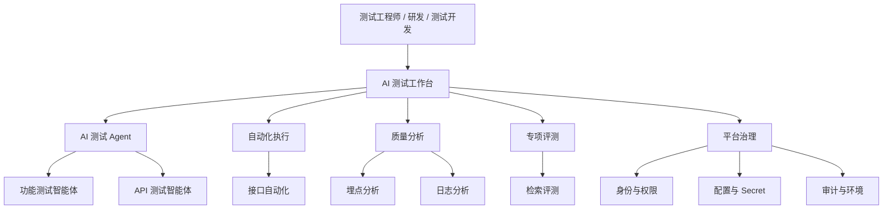

# 测试开发平台第三阶段：AI 测试工作台产品需求文档

> 文档版本：V1.0  
> 项目阶段：第三阶段 - AI 测试工作台产品化  
> 创建日期：2026-08-17  
> 文档状态：待评审  
> 适用平台：`test-platform`  
> 设计范围：桌面 Web，1280px 及以上  
> 产品方向：使命驱动的 AI 测试能力平台  

---

## 1. 文档摘要

第三阶段不增加新的测试能力，不合并现有工具，也不建设跨工具统一任务中心。本阶段通过重新定义平台定位、信息架构、首页工作台、能力分类和统一页面表达，将现有独立能力组织成一个清晰、可信、可持续扩展的 AI 测试工作台。

平台继续承担统一入口、身份、权限、配置、Secret、凭证、审计和服务状态管理。各工具继续保持独立服务、独立任务、独立数据、独立业务流程和独立发布节奏。

本阶段解决的核心问题是：

1. 用户进入平台后，能够快速理解平台可以解决哪些测试问题；
2. 用户按测试目标选择能力，而不是先理解项目名称和技术实现；
3. AI Agent、自动化工具、工程分析工具和专项评测工具具有清晰层级；
4. 各工具保持独立使命，不被强行套入同一个任务模型；
5. 平台呈现统一、克制、工程师友好的产品体验，不再像工具链接集合；
6. 后续增加新能力时，有稳定的分类、命名、导航和接入规范。

---

## 2. 背景与现状

### 2.1 已具备的平台基础

平台当前已具备：

- React、TypeScript、Vite 桌面前端；
- FastAPI、PostgreSQL、Alembic 平台后端；
- Nginx 统一入口和 Docker Compose 服务编排；
- 统一登录与服务端会话；
- 用户、角色、RBAC 和工具级权限；
- 配置 Release、Secret 和 Credential 管理；
- dev、prod 环境隔离；
- 凭证自动刷新；
- 审计日志；
- 独立工具健康检测和故障隔离。

### 2.2 当前能力清单

| 能力域 | 能力 | 当前使命 | 平台入口 |
|---|---|---|---|
| AI 测试 | 功能测试智能体 | 从需求生成测试点和测试用例，并支持人工 Review | `/functional-test-agent/` |
| AI 测试 | API 测试智能体 | 解析接口契约，设计和执行测试，发现接口问题 | `/api-test-agent/` |
| 自动化执行 | 接口自动化 | 将稳定接口沉淀为可重复执行的回归测试 | `/api-autotest/` |
| 质量分析 | 埋点分析 | 验证事件、字段和采集结果 | `/trackevents/` |
| 质量分析 | 日志分析 | 从日志中筛选异常并辅助定位问题 | `/log-filter/` |
| 专项评测 | 检索评测 | 执行检索、字段对比、质量评估和报告输出 | `/truthy-search/` |

### 2.3 当前产品问题

平台技术底座已经形成，但产品呈现仍以“工具入口”作为主要组织方式：

1. 不同性质的能力使用近似卡片平铺，层级不清晰；
2. 用户需要先理解工具名称，再判断是否适合当前任务；
3. AI 测试能力没有形成视觉和信息架构上的核心位置；
4. 自动化执行、质量分析、专项评测之间的使命差异没有表达；
5. 各工具虽然独立合理，但缺少统一的产品语言；
6. 平台管理能力较完整，但业务能力入口和管理入口的关系不够清晰；
7. 新增能力时容易继续堆叠卡片，长期会放大“工具商城”感。

### 2.4 产品判断

平台当前不适合建设通用编排平台，也不适合强行统一所有工具任务。更合适的方向是：

> 以独立测试能力为核心，由平台统一组织、统一治理和统一呈现的 AI 测试工作台。

---

## 3. 产品定位

### 3.1 一句话定位

面向 QA、研发和测试开发人员的 AI 测试与质量工程工作台。

### 3.2 产品价值主张

使用 AI 设计测试，通过自动化持续验证，并借助专业工具分析质量问题。

### 3.3 产品形态

平台采用“统一平台外壳 + 独立能力应用”的形态：



### 3.4 平台与工具职责边界

| 平台统一负责 | 各工具独立负责 |
|---|---|
| 登录与统一会话 | 核心业务流程 |
| 用户、角色和权限 | 任务模型与生命周期 |
| 配置、Secret 和凭证 | 业务数据和结果结构 |
| 环境和服务状态 | 输入、执行和产物 |
| 能力分类与导航 | 具体交互和工作台 |
| 统一视觉和状态语言 | 独立部署和迭代 |
| 审计和平台治理 | 领域内错误处理 |

---

## 4. 产品原则

### 4.1 使命优先

平台首先说明每个能力解决什么问题，而不是首先展示技术项目名、实现框架或功能列表。

### 4.2 独立能力不强行聚合

- 不要求所有工具共享 Task ID；
- 不要求所有工具写入统一任务数据库；
- 不要求所有工具使用相同任务阶段；
- 不因视觉统一而修改工具核心流程；
- 只在存在明确业务关系时提供使用建议。

### 4.3 AI 能力真实表达

- 功能测试智能体和 API 测试智能体明确归类为 AI 测试；
- 接口自动化、埋点分析、日志分析不强行添加 AI 标签；
- 检索评测按专项业务能力表达；
- 不使用“AI 全能”“一键完成全部测试”等超出实际能力的文案。

### 4.4 管理控制面与业务工作台分层

业务用户首先看到测试能力；平台管理员通过独立管理入口进入用户、角色、配置、Secret、凭证和审计页面。

### 4.5 渐进增强

本阶段只调整产品组织和视觉表达。跨工具协作、Git/MR 接入、报告中心、知识库和新 Agent 必须基于后续真实需求单独立项。

---

## 5. 本阶段目标与成功标准

### 5.1 产品目标

#### G1：形成明确的平台认知

用户进入首页后能够理解：

- 这是 AI 测试与质量工程平台；
- 平台当前有哪些能力域；
- 哪些能力使用 AI；
- 每个能力适合解决什么问题。

#### G2：降低能力选择成本

用户可通过“我现在想做什么”直接进入对应能力，不需要先理解工具内部名称。

#### G3：建立稳定的信息架构

新增工具或 Agent 时，必须先确定使命和能力域，不继续无序增加首页卡片。

#### G4：保持现有功能和架构稳定

第三阶段上线不得改变各工具业务能力、任务数据、URL、部署方式和独立运行能力。

### 5.2 可衡量成功标准

- 10 秒内可以从首页判断六项现有能力各自解决的问题；
- 任一能力最多通过两次明确操作进入；
- 首页不再将所有能力作为同级工具卡片平铺；
- AI 测试、自动化执行、质量分析和专项评测分组清晰；
- 所有既有入口 URL 和权限行为保持不变；
- API 返回结构和数据库业务 Schema 不因本阶段改造发生变化；
- 服务不可用、无权限和凭证异常使用统一平台表达；
- 1280px、1440px 桌面浏览器下导航不换行，核心内容无需横向滚动；
- Tab、Shift+Tab、Enter 和可见焦点状态可完成主要导航；
- 正文和控件满足 WCAG AA 对比度；
- `prefers-reduced-motion` 下不依赖动画传达关键信息。

---

## 6. 范围与边界

### 6.1 本阶段包含

1. 平台定位、首页标题和说明文案调整；
2. 一级导航和能力分类调整；
3. 首页“我现在想做什么”使命导航；
4. AI 测试、自动化执行、质量分析、专项评测四个能力域；
5. 工具卡片信息结构调整；
6. AI Agent 与普通工程工具的视觉层级区分；
7. 平台状态与异常提示区域调整；
8. 平台管理入口重新归组；
9. 各独立工具的平台上下文、返回入口和基础状态语言统一；
10. 桌面端加载、空、错误、无权限和服务不可用状态规范；
11. README、产品说明和导航文案更新；
12. 现有前端组件在最小范围内重组和复用。

### 6.2 本阶段不包含

- 新增 AI Agent 或测试工具；
- 建设平台统一任务中心；
- 聚合功能测试智能体和 API 测试智能体任务；
- 建设跨工具任务编排；
- 修改各工具核心算法、提示词或业务流程；
- 迁移各工具任务数据到平台 PostgreSQL；
- 新增 Git、GitLab、GitHub 或 MR/PR 接入；
- 新增知识库、Prompt 管理或模型中心；
- 新增统一报告中心或缺陷平台联动；
- 新增用例管理平台；
- 新增移动端和窄屏适配；
- 重写现有 React、FastAPI 或 Nginx 架构；
- 新增 UI 组件库、状态库或图标库；
- 修改现有权限模型和 Secret 管理模型。

---

## 7. 目标用户与核心场景

### 7.1 目标用户

| 用户 | 核心诉求 |
|---|---|
| 功能测试工程师 | 从需求生成测试点和测试用例，并完成 Review |
| API 测试工程师 | 理解接口、设计测试、执行验证并发现问题 |
| 自动化测试工程师 | 将稳定接口沉淀为持续回归资产 |
| 测试开发工程师 | 使用分析工具定位日志、埋点和环境问题 |
| 专项评测人员 | 对检索结果进行对比和质量评估 |
| 测试负责人 | 理解平台已有能力和使用边界 |
| 平台管理员 | 管理权限、配置、Secret、凭证和审计 |

### 7.2 用户目标到能力映射

| 用户目标 | 推荐能力 | 首页行动文案 |
|---|---|---|
| 从需求生成测试用例 | 功能测试智能体 | 生成测试用例 |
| 测试新接口并发现问题 | API 测试智能体 | 开始接口测试 |
| 执行稳定接口回归 | 接口自动化 | 执行自动化回归 |
| 验证埋点事件和字段 | 埋点分析 | 验证埋点数据 |
| 筛选日志并定位异常 | 日志分析 | 分析日志 |
| 评估检索结果质量 | 检索评测 | 开始检索评测 |

---

## 8. 信息架构

### 8.1 一级导航

```text
工作台
AI 测试
自动化
质量分析
专项评测
平台管理
```

导航约束：

- “工作台”是默认首页；
- “AI 测试”只包含功能测试智能体和 API 测试智能体；
- “自动化”当前只包含接口自动化；
- “质量分析”包含埋点分析和日志分析；
- “专项评测”包含检索评测；
- “平台管理”根据权限展示用户、角色、配置、Secret、凭证和审计；
- 无权限的能力域不显示，但直接 URL 仍由服务端校验；
- 不新增空壳导航项；
- 导航结构允许未来新增能力，但不得预先展示未实现模块。

### 8.2 页面树

```text
/
├── 工作台
├── AI 测试
│   ├── 功能测试智能体（独立工具）
│   └── API 测试智能体（独立工具）
├── 自动化
│   └── 接口自动化（独立工具）
├── 质量分析
│   ├── 埋点分析（独立工具）
│   └── 日志分析（独立工具）
├── 专项评测
│   └── 检索评测（独立工具）
└── 平台管理
    ├── 用户
    ├── 角色
    ├── 配置
    ├── Secret
    ├── 凭证
    └── 审计
```

能力域页面可以通过前端状态、锚点或轻量路由实现，详细方案由开发设计阶段结合现有 React Router 决定。本 PRD 不要求新增后端业务接口。

---

## 9. 首页工作台需求

### 9.1 页面目标

首页用于帮助用户理解平台能力并进入正确工具，不承担统一任务汇总职责。

### 9.2 页面结构

#### A. 平台页头

必须包含：

- 平台标识和名称；
- 一级导航；
- 当前环境；
- 当前用户和账户入口；
- 管理入口按权限显示。

#### B. 定位区域

推荐文案：

```text
AI 测试与质量工程工作台
使用 AI 设计测试，通过自动化持续验证，并借助专业工具分析质量问题。
```

要求：

- 不使用夸张营销语；
- 不展示虚假任务、虚假指标或虚假实时数据；
- 不使用 AI 紫色渐变作为默认主视觉；
- 只保留一个明确主标题。

#### C. 我现在想做什么

展示六个任务导向入口：

1. 从需求生成测试用例；
2. 测试新接口并发现问题；
3. 执行接口自动化回归；
4. 验证埋点数据；
5. 分析日志；
6. 评估检索质量。

每个入口直接跳转至对应工具，不建立平台任务。

#### D. 核心能力

按四个能力域展示现有六项能力。AI 测试 Agent 在视觉顺序上优先，但其他工具不降低可发现性。

#### E. 平台状态

复用现有健康和凭证状态，展示：

- 当前环境；
- 服务可用数量；
- 服务异常；
- 凭证异常或临期；
- 配置待生效。

本区域只显示真实已有数据，不新增任务统计。

### 9.3 首页不展示的内容

- 不展示不存在的统一任务数量；
- 不展示跨工具成功率；
- 不展示虚构 Token 消耗；
- 不展示“全部 AI 自动完成”等承诺；
- 不展示尚未建设的报告中心、用例中心和知识库入口。

---

## 10. 能力域页面需求

### 10.1 AI 测试

页面说明：

> 使用独立 AI Agent 完成测试设计或接口验证。每个 Agent 保持自己的任务、Review 和结果流程。

包含：

#### 功能测试智能体

- 使命：将需求文档转化为可 Review、可维护、可导出的测试点和测试用例；
- 输入：需求文档；
- 输出：测试点、测试用例和导出文件；
- 当前边界：不负责自动执行功能测试；
- 行动：生成测试用例。

#### API 测试智能体

- 使命：理解接口契约，通过 AI 设计和执行测试，发现接口问题并形成证据；
- 输入：API 文档、目标环境和测试数据；
- 输出：接口契约、测试用例、执行结果和缺陷草稿；
- 当前边界：新接口探索验证，不替代长期自动化回归；
- 行动：开始接口测试。

### 10.2 自动化

#### 接口自动化

- 使命：将已经稳定的接口沉淀为可重复执行的自动化回归测试；
- 输入：自动化用例、环境和执行配置；
- 输出：运行结果和自动化报告；
- 当前边界：不负责 AI 探索式测试；
- 行动：执行自动化回归。

页面可以提供静态使用建议：

> 新接口优先使用 API 测试智能体验证。接口稳定后，再沉淀到接口自动化中持续回归。

该建议只提供说明和跳转，不传递任务数据。

### 10.3 质量分析

#### 埋点分析

- 使命：验证埋点事件、参数和采集结果是否符合预期；
- 输入：埋点或 TrackEvents 日志；
- 输出：事件统计、字段校验和结果报告；
- 行动：验证埋点数据。

#### 日志分析

- 使命：从复杂日志中筛选异常、定位问题并提取有效信息；
- 输入：日志内容或文件；
- 输出：过滤结果、异常信息和导出文件；
- 行动：分析日志。

### 10.4 专项评测

#### 检索评测

- 使命：对检索结果进行执行、字段对比、质量评估和报告输出；
- 输入：评测数据、查询和候选结果；
- 输出：字段对比、评测结论和报告；
- 当前边界：与具体检索项目和账号环境强相关；
- 行动：开始检索评测。

---

## 11. 能力卡片规范

### 11.1 信息结构

每个能力卡片必须包含：

1. 能力名称；
2. 能力域标签；
3. 一句话使命；
4. 适用场景；
5. 输入摘要；
6. 输出摘要；
7. 服务状态；
8. 明确行动入口。

### 11.2 卡片不应包含

- 过长功能清单；
- 无法验证的效果承诺；
- 与用户目标无关的技术栈；
- 多个同权重主按钮；
- 仅靠图标表达的操作；
- 为普通工具强行增加 AI 标识。

### 11.3 状态表达

| 状态 | 文案 | 行为 |
|---|---|---|
| 正常 | 服务正常 | 入口可用 |
| 检测中 | 正在检测 | 入口保持可用，状态更新 |
| 不可用 | 服务暂时不可用 | 入口可见，进入后使用现有不可用页 |
| 无权限 | 无访问权限 | 不展示卡片或展示受限说明，服务端继续校验 |
| 凭证异常 | 需要管理员处理凭证 | 工具入口按现有业务安全策略处理 |

---

## 12. 独立工具页面统一要求

本阶段不重构工具业务页面，只统一最小平台上下文：

- 显示平台名称或平台上下文；
- 提供返回平台工作台入口；
- 显示所属能力域；
- 保留工具自身业务导航；
- 使用统一的主文字、次要文字、系统蓝、分隔线和焦点环；
- 服务不可用、无权限和会话过期使用平台统一页面；
- 不强制工具使用平台首页的卡片布局；
- 不要求工具业务页面完全视觉一致；
- 不改变现有表单、任务和结果字段。

---

## 13. 视觉与交互原则

### 13.1 视觉语言

延续现有 Apple Developer-inspired 工程工作台方向：

- 清晰、克制、内容优先；
- 近白画布和白色内容表面；
- 文字使用近黑和中性灰；
- 系统蓝作为唯一主交互强调色；
- 状态色只用于真实状态；
- 8px 间距网格；
- 控件圆角 10px，内容容器圆角 16px；
- 阴影只用于确实需要浮起的层级；
- 不使用大面积玻璃卡片和 AI 紫色光效；
- 不复制 Apple 商标、素材或页面结构。

### 13.2 页面层级

信息顺序固定为：

```text
用户目标 → 推荐能力 → 能力使命 → 输入与输出 → 当前状态 → 进入能力
```

### 13.3 交互

- 主操作使用明确动词；
- 卡片可点击时仍保留可访问的文字链接；
- 悬停不作为唯一信息载体；
- 动效只用于导航、状态更新和展开反馈；
- 常规过渡控制在 150-250ms；
- reduced-motion 下关闭非必要位移和动画。

### 13.4 桌面范围

- 仅设计和验收 1280px 以上桌面 Web；
- 推荐设计基准为 1440×900；
- 不要求移动端导航、断点和触摸交互；
- 页面最小宽度可保持现有 1080px 策略。

---

## 14. 统一状态设计

### 14.1 加载状态

- 使用与最终内容结构一致的骨架；
- 不使用阻塞全页的无限旋转图标；
- 工具目录加载不影响平台页头和管理入口。

### 14.2 空状态

- 明确说明当前没有可见能力、权限或状态数据的原因；
- 提供可执行的下一步；
- 不将“无权限”和“暂无数据”混用。

### 14.3 错误状态

- 区分平台 API 异常、单个工具异常、权限不足和凭证异常；
- 显示简明原因和建议处理人；
- 不暴露容器地址、内部异常或 Secret；
- 单个工具异常不影响其他能力入口。

### 14.4 无权限状态

- 页面和 API 均由现有 RBAC 校验；
- 前端隐藏无权限入口不替代服务端鉴权；
- 直接访问返回统一 403 页面；
- 不泄露未授权工具的任务和结果信息。

---

## 15. 权限与环境行为

### 15.1 能力可见性

- 首页仅展示用户具备 `tool.view` 的能力；
- 能力域为空时不显示空壳分组，或显示明确无权限说明；
- 管理导航根据平台权限展示；
- 工具入口继续由 Nginx 和 Platform API 强制鉴权。

### 15.2 环境

- 页头继续显示当前 dev 或 prod；
- 切换环境只影响现有配置和 Secret 管理上下文；
- 本阶段不为各工具新增环境切换逻辑；
- 不将工具内部目标环境与平台 dev/prod 混为一类。

---

## 16. 数据与接口影响

### 16.1 后端

原则上不新增业务 API。继续复用：

- `GET /api/v1/tools`；
- `GET /api/v1/tools/{tool_id}/health`；
- 登录和当前用户接口；
- 权限和环境上下文；
- 现有配置、Secret、凭证和审计接口。

### 16.2 工具目录

如现有 Tool Schema 已包含 `category`、`features` 和展示字段，优先通过前端确定性映射补充使命文案，不为本阶段立即扩展数据库字段。

开发设计阶段必须评估以下两种方式，并选择改动更小者：

1. 前端根据稳定 Tool ID 维护产品文案；
2. 复用现有工具目录字段表达能力域和使命。

不得为了文案管理引入通用 CMS。

### 16.3 不发生的数据变化

- 不新增平台 Task 表；
- 不迁移工具任务；
- 不增加跨工具关联表；
- 不改变工具健康协议；
- 不改变工具业务接口返回结构；
- 不改变审计、配置和 Secret 数据模型。

---

## 17. 埋点与产品验证

如平台当前没有产品分析系统，本阶段不要求引入新依赖。可优先使用现有审计或服务端访问日志验证：

- 首页访问；
- 能力域入口访问；
- 六项能力的打开次数；
- 工具不可用入口访问；
- 403 和会话过期出现次数。

不得将包含用户上传内容、Secret 或测试数据的明细写入产品分析事件。

---

## 18. 验收标准

### 18.1 功能验收

- 首页展示新的平台定位；
- 用户可以通过使命入口进入六项现有能力；
- 能力按四个能力域展示；
- 工具状态继续动态更新；
- 重新检测状态继续可用；
- 用户仅看到有权限的工具；
- 平台管理入口按权限显示；
- 原有六个工具入口和业务功能不变；
- 平台 API、数据库或单个工具异常时使用既有安全策略；
- 不恢复匿名工具 fallback。

### 18.2 视觉验收

- 1440×900 下首屏能看到定位、使命入口和主要 AI 能力；
- AI Agent 与普通工程工具层级清楚；
- 页面只有一个主视觉强调色；
- 不使用三列完全同权重的通用功能卡片墙；
- 卡片信息可在一次扫视中理解；
- 长文案不会遮挡行动入口；
- 页面延续现有设计 Token。

### 18.3 无障碍验收

- 所有入口可通过 Tab、Shift+Tab 和 Enter 操作；
- 焦点环清晰；
- 图标按钮具有可访问名称；
- 状态不仅依赖颜色；
- 正文和按钮满足 WCAG AA；
- reduced-motion 下关键信息完整。

### 18.4 回归验收

- 平台前端现有测试通过；
- 平台后端测试通过；
- 六个独立工具现有测试不因本阶段产生新增失败；
- Nginx 鉴权和路由测试通过；
- `git diff --check` 通过；
- 宿主机端口暴露策略不变。

---

## 19. 发布与回滚

### 19.1 发布原则

- 本阶段主要变更平台前端、文案和必要的工具公共样式；
- 不执行数据库业务迁移；
- 不切换工具配置来源；
- 不暂停工具任务；
- 可通过单独重建平台网关前端发布。

### 19.2 回滚

如新工作台出现导航或权限问题：

1. 回滚平台前端镜像；
2. 保留平台 API、数据库和工具服务；
3. 恢复现有工具目录首页；
4. 验证六个工具原 URL；
5. 不需要回滚工具数据或任务。

---

## 20. 风险与缓解

| 风险 | 影响 | 缓解措施 |
|---|---|---|
| 只改视觉，仍像工具集合 | 平台认知改善有限 | 以使命和用户目标重写信息架构，不只换颜色 |
| 为了平台感强行统一流程 | 破坏工具独立性 | 明确禁止统一任务模型和数据迁移 |
| AI 标签泛化 | 用户预期失真 | 只对两个 Agent 使用 AI 定位 |
| 导航层级过多 | 找工具变慢 | 保持六个一级入口以内，空能力域不展示 |
| 文案维护散落 | 后续不一致 | 形成稳定能力清单和卡片规范 |
| 权限过滤后能力域为空 | 页面结构异常 | 按授权结果动态隐藏空分组 |
| 工具视觉改造范围扩大 | 回归风险增加 | 工具页只做最小平台上下文统一 |

---

## 21. 后续演进方向

以下内容不属于第三阶段，仅作为后续决策参考。

### 21.1 轻量能力协作

当真实用户需要时，可在 API 测试智能体结果页提供“进入接口自动化”的明确跳转。首期只传递用户意图，不自动迁移任务和数据。

### 21.2 代码变更驱动测试

根据团队 Git 使用情况再评估仓库、MR/PR、变更影响分析和报告回写。

### 21.3 测试资产与报告

只有当跨工具查询、复用和度量成为稳定需求时，再建设测试资产中心或统一报告中心。

### 21.4 新能力接入

新工具接入前必须回答：

1. 它解决的独立测试问题是什么；
2. 目标用户是谁；
3. 输入和输出是什么；
4. 应归入哪个能力域；
5. 是否真的使用 AI；
6. 是否需要与现有能力协作；
7. 为什么不能由现有能力完成。

---

## 22. 已确认产品结论

1. 平台采用“使命驱动的 AI 测试能力平台”定位；
2. 不复制参考平台的完整能力集合；
3. 不将所有工具包装为 AI；
4. 功能测试智能体和 API 测试智能体继续独立；
5. 不建设功能/API Agent 统一任务中心；
6. 接口自动化继续独立承担稳定接口回归；
7. API 测试智能体和接口自动化只表达业务衔接，不在本阶段实现编排；
8. 埋点分析和日志分析归入质量分析；
9. 检索评测归入专项评测；
10. 本阶段不增加能力，只调整平台产品组织和统一体验；
11. 保持现有技术栈、URL、权限、配置和部署方式；
12. 桌面 Web 是唯一设计与验收范围。

---

## 23. 交付物

- 本 PRD；
- Figma 信息架构和页面概念稿；
- 第三阶段详细开发设计与计划；
- 首页和能力域页面前端改造；
- 平台统一文案清单；
- 桌面浏览器验收记录；
- 发布、回滚和回归测试记录。

