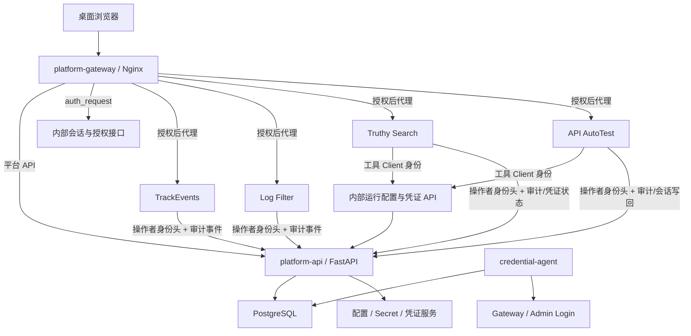
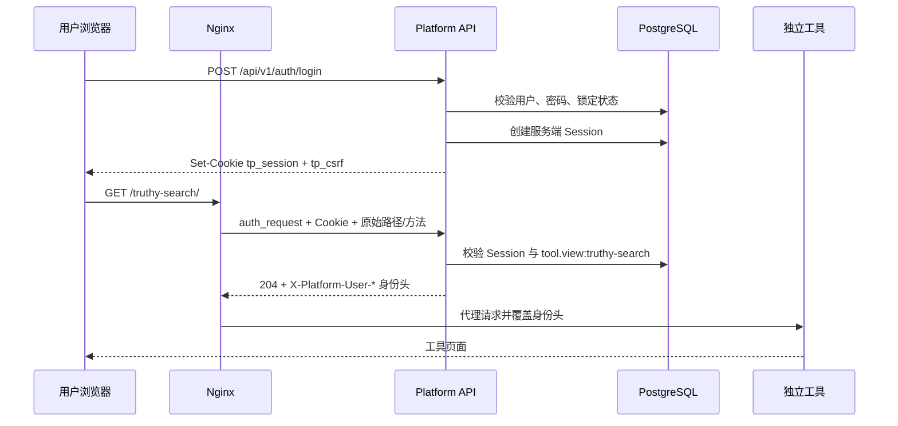

# 测试开发平台第二阶段开发设计与计划

> 文档版本：V1.0  
> 创建日期：2026-08-10  
> 文档状态：待评审  
> 需求依据：[TestPlatform_第二阶段_PRD.md](./TestPlatform_第二阶段_PRD.md) V1.1  
> 目标平台：`test-platform`  
> 关联工具：`TrackEvents_tess`、`log_filter_tool`、`Truthy_Search`、`api-autotest`<br>
> 设计定位：身份、权限、审计、配置与 Secret 控制面

---

## 1. 文档目标

本文将第二阶段 PRD 转换为可实施的技术设计和执行计划，回答以下问题：

1. 统一登录和跨工具会话如何实现；
2. 用户、角色和工具权限如何建模并在网关强制执行；
3. 审计日志如何保证完整、可查且不泄露 Secret；
4. 分散的 `.env` 如何迁移为平台配置与 Secret；
5. Truthy_Search 和 api-autotest 的 Token 如何自动刷新；
6. 哪些配置即时生效、下一任务生效、需要重启或属于部署变更；
7. 前后端、数据库、Nginx、Compose 和四个工具分别修改什么；
8. 如何分批上线、验证和回滚。

本文是详细设计和开发计划，不直接修改代码。后续实施应按本文顺序执行，并在每个里程碑完成后通过对应质量门禁。

---

## 2. 当前基线与差距

### 2.1 当前技术基线

| 层级 | 当前实现 |
|---|---|
| 平台前端 | React 19 + TypeScript + Vite；仅首页和 404；无登录、路由库和管理页面 |
| 平台后端 | FastAPI + 同步 SQLAlchemy Session；仅 `health`、`tools` 模块 |
| 数据库 | PostgreSQL 17 + Alembic；目前只有 `tools` 表 |
| 网关 | Nginx；统一代理平台 API 和四个工具；当前没有鉴权 |
| 编排 | Docker Compose；宿主机只暴露平台网关 |
| Truthy_Search | Flask + SQLite；每个新 Run 重新读取运行凭证；Admin Session 已支持自动登录和内存续期 |
| api-autotest | Flask 工具壳 + pytest 子进程；每个任务加载会话；刷新后写回 `.env.platform` |
| TrackEvents_tess | Python HTTP 服务；配置在模块导入时读取 |
| log_filter_tool | Flask；配置在 `create_app()` 时读取 |

### 2.2 关键差距

- Nginx 当前直接代理四个工具，知道 URL 即可访问；
- 平台 API 没有用户、会话或权限上下文；
- 工具目录对所有访问者返回相同内容；
- 工具写操作无法识别操作者，也无法形成可靠审计；
- Secret 与普通配置混在项目 `.env`；
- 动态 Token 以文件作为写回状态，存在双写和覆盖风险；
- 前端 API 异常时会使用静态回退并直接访问工具健康地址，该行为与第二阶段“鉴权失败关闭”冲突；
- 当前只有进程启动配置，没有配置版本、环境隔离和生效确认。

### 2.3 必须保留的能力

- 四个工具继续作为独立服务运行；
- 不复制工具核心分析或测试逻辑；
- 工具仍可脱离平台独立启动；
- `/trackevents/`、`/log-filter/`、`/truthy-search/`、`/api-autotest/` 路径保持不变；
- 平台对外仍只有统一网关；
- 任一工具异常不影响平台和其他工具；
- PostgreSQL 结构只通过 Alembic 修改；
- 不引入 Redis、Celery、通用 Worker、Vault、Kubernetes 或 Docker Socket。

---

## 3. 设计原则与关键决策

### 3.1 设计原则

- **服务端强制**：权限不能只靠前端隐藏，网关和 API 都必须校验；
- **安全失败关闭**：身份服务不可用时拒绝新访问，不能匿名降级；
- **配置与 Secret 分离**：普通配置可显示差异，Secret 永不回显明文；
- **单一写入源**：迁移期允许双读，但动态凭证只能有一个写入源；
- **任务版本固定**：运行中任务绑定提交时配置版本，不被新发布影响；
- **最小工具改动**：只增加身份、CSRF、配置读取和审计适配，不改业务算法；
- **不盲目重放**：只读请求可重放一次，非幂等写请求默认不重放；
- **桌面优先**：仅设计和验收 1280px 及以上桌面 Web。

### 3.2 关键技术决策

| 主题 | 决策 | 理由 |
|---|---|---|
| 登录方式 | 本地用户名/密码 | 第二阶段不引入外部 SSO，落地成本可控 |
| 密码存储 | Argon2id 哈希 | 不可逆、适合密码存储 |
| 浏览器会话 | PostgreSQL 服务端会话 + 随机不透明 Cookie | 可立即撤销，不把权限放入长期 JWT |
| 跨工具鉴权 | Nginx `auth_request` 调用平台内部授权接口 | 保持工具子路径不变，先拦截再代理 |
| RBAC | 用户—角色—授权项，授权项带工具范围 | 同时支持平台权限和工具权限 |
| CSRF | 平台 API 双提交 Token；工具表单双提交 + 同源校验 | 兼容 React、Fetch 和现有 HTML 表单 |
| Secret 加密 | AES-256-GCM 信封加密，主密钥在部署 Secret | 数据库泄露后不能直接得到明文 |
| 工具身份 | 每工具独立的不透明 Client Token，数据库只存哈希 | 防止工具 A 读取工具 B 的 Secret |
| 动态配置 | 工具通过内部 API 按环境获取版本化运行快照 | 不写文件，支持下一任务生效 |
| Token 维护 | 按需刷新 + 独立轻量 `credential-agent` 定时扫描 | 不依赖 Celery，又能提前发现临期凭证 |
| 审计 | 与业务变更同事务写入、应用层禁止更新删除 | 避免变更成功但审计丢失 |
| 前端路由 | 增加 `react-router-dom`，不引入 UI/状态管理库 | 管理页面与权限路由已超过当前手写两路由能力 |
| 部署环境 | 配置作用域支持 `dev`、`prod`；运行实例通过启动配置固定自身环境 | 配置可准备和提升，工具不能跨环境读取 |

### 3.3 新增依赖边界

后端只新增：

- `argon2-cffi`：密码哈希与校验；
- `cryptography`：AES-GCM 信封加密。

前端只新增：

- `react-router-dom`：多页面路由、受保护路由和 404。

实施时在现有依赖文件中固定经过 Python 3.12、Node 24 验证的确切版本，并提交 `package-lock.json`。不新增 ORM、表单库、状态管理库、组件库、图标库或动画库。

---

## 4. 总体架构

### 4.1 逻辑架构



### 4.2 信任边界

1. 浏览器只信任统一网关；
2. Nginx 覆盖所有 `X-Platform-*` 身份头，浏览器伪造值无效；
3. 工具端口只在内部 Docker 网络开放；
4. 平台管理 API 使用用户会话；
5. 工具内部 API 使用独立 Client Token，不接受用户 Cookie；
6. Secret 明文只在平台解密过程和授权工具进程内短暂存在；
7. 主加密密钥不进入 PostgreSQL、前端、Git 或普通日志；
8. 生产环境外部链路必须 HTTPS；容器内部网络不暴露到宿主机。

### 4.3 登录与工具访问时序



---

## 5. 身份、密码与统一会话设计

### 5.1 用户标识

- 用户 ID 使用不可变字符串 ID，例如 `usr_<随机值>`；
- `username` 保存原始显示值；
- `username_normalized` 保存小写标准值并建立唯一约束；
- 用户状态：`active`、`disabled`；
- 删除用户采用禁用，不物理删除，保留审计关联；
- 用户姓名可修改，但审计同时保存操作发生时的用户名快照。

### 5.2 密码

- 使用 Argon2id；参数由安全模块集中定义；
- 密码最少 12 个字符，最多 256 个字符；
- API 永不返回 `password_hash`；
- 管理员重置密码时生成一次性临时密码或由管理员填写新密码；
- 重置后撤销用户全部现有会话；
- 首次使用临时密码要求修改；
- 登录错误统一返回 `INVALID_CREDENTIALS`，不区分用户不存在或密码错误。

### 5.3 Session Token

浏览器 Cookie：

| 名称 | 用途 | 属性 |
|---|---|---|
| `tp_session` | 不透明会话 Token | `HttpOnly`、`Path=/`、`SameSite=Lax`；prod 必须 `Secure` |
| `tp_csrf` | 双提交 CSRF Token | `Path=/`、`SameSite=Lax`；允许页面 JS 读取；prod 必须 `Secure` |

服务端只保存：

- `SHA-256(tp_session)`；
- `SHA-256(tp_csrf)`；
- 用户 ID、创建时间、最后活动时间；
- 空闲过期和绝对过期时间；
- 撤销时间、来源 IP 和 User-Agent 摘要。

不得把原始 Session Token 或 CSRF Token写入数据库、日志或审计。

### 5.4 会话生命周期

- 默认空闲超时 8 小时；
- 默认绝对有效期 24 小时；
- 每次授权检查验证两种过期时间；
- `last_seen_at` 最多每 5 分钟更新一次，避免每个静态请求写数据库；
- 退出登录、用户禁用、密码重置、管理员强制退出时立即撤销；
- 权限变更不依赖会话内缓存，下一请求重新计算或使用不超过 5 秒的授权缓存；
- 不做自动延长绝对有效期；
- 会话表定期清理已过期且超过保留期的数据。

### 5.5 登录限速与锁定

- 以标准化用户名和来源 IP 两个维度记录失败窗口；
- 默认 15 分钟内连续失败 5 次，锁定 15 分钟；
- 成功登录清除该用户名失败计数；
- 对不存在用户执行等价的哈希耗时，降低用户名枚举；
- 锁定状态只返回统一安全信息，具体原因写入审计；
- 不使用进程内计数作为唯一来源，避免重启绕过。

### 5.6 首个管理员引导

- 数据库无用户时开放 `/setup` 页面和一次性初始化接口；
- 使用部署时生成的高强度 `PLATFORM_BOOTSTRAP_TOKEN_FILE`；
- 初始化请求必须同时提交引导 Token、管理员用户名和密码；
- 成功创建第一个管理员后，引导接口永久返回 404；
- 不提供默认管理员密码；
- 引导 Token 文件不得提交 Git，初始化后应从运行环境移除；
- 初始化事件写入审计，操作者标记为 `system/bootstrap`。

---

## 6. RBAC 与网关鉴权设计

### 6.1 权限模型

权限代码沿用 PRD：

**平台权限**

- `platform.user.manage`
- `platform.role.manage`
- `platform.audit.view`
- `platform.audit.export`
- `platform.config.manage`
- `platform.secret.manage`

**工具权限**

- `tool.view`
- `tool.execute`
- `tool.result.view`
- `tool.config.manage`
- `tool.secret.manage`

授权项结构：

```text
role_id + permission_code + resource_type + resource_id
```

示例：

```text
role_tester + tool.view    + tool + truthy-search
role_tester + tool.execute + tool + truthy-search
role_admin  + tool.view    + tool + *
```

不使用 `NULL` 表示全局范围，统一使用明确的 `resource_id="*"`，避免唯一约束歧义。

### 6.2 权限计算

- 一个用户可关联多个角色；
- 权限取所有有效角色授权项的并集；
- 本阶段没有显式 Deny；
- 用户禁用优先级最高；
- 内置角色 ID 固定，名称可本地化但权限代码不可改变；
- 管理员修改权限后递增 `permission_version`；
- 授权缓存键包含用户 ID 和 `permission_version`，最大缓存 5 秒；
- 所有管理 API 在后端依赖层再次校验，不依赖 Nginx。

### 6.3 Nginx `auth_request`

为每个工具路由增加内部鉴权子请求：

```nginx
auth_request /_platform_authorize;
auth_request_set $platform_user_id $upstream_http_x_platform_user_id;
auth_request_set $platform_username $upstream_http_x_platform_username;
auth_request_set $platform_tool_permissions $upstream_http_x_platform_tool_permissions;
proxy_set_header X-Platform-User-Id $platform_user_id;
proxy_set_header X-Platform-Username $platform_username;
proxy_set_header X-Platform-Tool-Permissions $platform_tool_permissions;
proxy_set_header X-Platform-Request-Id $request_id;
```

内部鉴权请求必须传递：

- 原始 Cookie；
- 固定的工具 ID（由对应 Nginx location 写入，不能信任浏览器 Header）；
- `X-Original-URI`；
- `X-Original-Method`；
- `X-Real-IP`；
- User-Agent；
- Origin、Referer、`Sec-Fetch-Site`；
- `X-CSRF-Token`（如存在）。

授权接口结果：

| 状态 | Nginx 行为 |
|---|---|
| `204` | 代理到工具，并覆盖平台身份头 |
| `401` | 页面导航跳转登录页；API 请求返回统一 401 |
| `403` | 返回统一无权限页或 JSON 错误 |
| `503` | 返回“平台身份服务不可用”，不得继续代理 |

### 6.4 工具路径权限策略

授权接口根据固定工具 ID、HTTP 方法和受控路径规则计算所需权限：

| 路径/操作类型 | 默认权限 |
|---|---|
| 页面、静态资源、样例、目录 | `tool.view` |
| 任务/Run/报告/日志/Raw/下载等结果读取 | `tool.result.view` |
| 分析、创建 Run、重试、导入、处理、取消、导出等写操作 | `tool.execute` |
| 工具普通配置管理 | `tool.config.manage` |
| 工具凭证校验或替换 | `tool.secret.manage` |

路径策略在平台后端代码中显式维护并测试，不开放为 Web 任意编辑，避免管理员误配导致越权。

部分工具首页同时包含入口、任务列表和报告摘要。Nginx 对首页只要求 `tool.view`，同时把当前用户在该工具上的完整权限集合通过受信任的 `X-Platform-Tool-Permissions` 传给工具；工具根据该集合隐藏结果区和执行控件。任务、结果和报告 API 仍分别由网关强制要求 `tool.execute` 或 `tool.result.view`，因此隐藏页面内容不是唯一安全边界。

工具重点映射：

| 工具 | `tool.execute` 代表操作 | `tool.result.view` 代表操作 |
|---|---|---|
| TrackEvents | `POST /api/analyze` | 分析结果随请求返回；查看页仍需 `tool.view` |
| Log Filter | 首页 POST 分析、`POST /export` | 导出结果与页面结果 |
| Truthy Search | 创建评测/Run、重试、导入、处理、创建报告、修改阈值 | Run、Query、Candidate、Raw、报告、下载和状态 API |
| API AutoTest | 提交任务、取消任务 | 任务列表、详情、结果、日志、报告和用例目录 |

### 6.5 身份头安全

- Nginx 先清空浏览器传入的所有 `X-Platform-*`；
- 只有鉴权子请求返回的值才能传给工具；
- `X-Platform-Tool-Permissions` 只包含当前工具的权限代码，不包含其他工具或平台管理权限；
- 工具服务端口不得映射到宿主机；
- 工具读取用户 ID 用于审计，不把 Header 当成配置/Secret 访问凭据；
- 工具调用内部平台 API 时使用自己的 Client Token，而不是用户身份头。

### 6.6 CSRF

平台 React API：

- 所有 `POST/PUT/PATCH/DELETE` 读取 `tp_csrf` Cookie 并发送 `X-CSRF-Token`；
- 平台 API 比较 Header Token 的哈希与 Session 中的 CSRF 哈希；
- 同时校验 Origin/Referer 为平台允许来源。

现有工具：

- Fetch/JSON 写请求增加 `X-CSRF-Token`；
- HTML 表单增加隐藏字段 `_csrf`；
- 工具比较 `_csrf`/Header 与 Host-only `tp_csrf` Cookie；
- Nginx 授权接口对不安全方法执行 Origin/Referer 和 `Sec-Fetch-Site` 校验；
- 缺失或不匹配返回 403；
- GET/HEAD/OPTIONS 不执行状态变更。

---

## 7. 审计日志设计

### 7.1 审计边界

审计记录关键业务和安全事件，不复制所有访问日志。必须覆盖：

- 登录、退出、失败、锁定、强制撤销；
- 用户、角色和授权项变更；
- 配置草稿、校验、发布、回滚；
- Secret 创建、替换、验证和版本激活；
- 凭证刷新、重新登录、刷新失败；
- 工具任务/Run 提交、取消、重试和最终结果；
- 审计导出。

静态资源请求、普通页面浏览和健康探测不写审计，避免噪声。

### 7.2 审计写入

- 平台管理操作与审计记录在同一数据库事务提交；
- 操作失败也记录 `outcome=failed/denied`，使用独立短事务；
- 工具通过内部审计接口提交结构化事件；
- 平台只接受登记过的事件类型和字段白名单；
- 工具提交事件使用幂等 `event_id`，重复事件只保存一次；
- 自动凭证维护事件的 actor 为 `system/credential-agent`；
- 禁止自由传入 `before/after` 大对象或原始响应。

### 7.3 脱敏

以下键及其常见变体进入统一脱敏器：

```text
password, secret, token, auth_token, refresh_token, session_token,
authorization, cookie, client_secret, private_key
```

规则：

- Secret 变更只记录 Secret ID、版本、环境、操作者和结果；
- 普通配置记录结构化前后差异；
- URL 查询参数、Header、异常对象和上游响应不能直接写入审计；
- 审计导出再次经过同一脱敏器；
- 自动化测试使用哨兵 Secret 扫描 API、数据库、日志和导出文件。

### 7.4 不可修改与保留

- 应用 API 不提供更新和单条删除审计接口；
- PostgreSQL 使用触发器拒绝应用数据库角色对审计表执行 UPDATE/DELETE；
- 保留清理由专用数据库函数或迁移角色按时间批量执行；
- 默认保留 180 天；
- 清理批次写入新的审计事件；
- CSV 导出使用流式响应和分页，避免一次加载全部记录。

---

## 8. 配置中心设计

### 8.1 配置定义

每个 Web 可管理配置必须先登记 `ConfigDefinition`：

| 字段 | 说明 |
|---|---|
| `key` | 稳定键名，例如 `SEARCH_API_URL` |
| `owner_type/owner_id` | 平台或工具 |
| `group_key` | 页面分组 |
| `value_type` | string/int/bool/enum/json/url/logical_path/secret |
| `required` | 是否必填 |
| `default_value` | 非敏感默认值 |
| `validation_schema` | 长度、范围、枚举、URL 协议等 |
| `sensitivity` | normal/secret |
| `apply_mode` | immediate/next_task/restart/deployment |
| `editable` | 是否允许 Web 修改 |
| `description` | 中文说明与影响 |
| `sort_order` | 页面顺序 |

Web 不提供任意键创建能力。新增配置定义必须通过代码和 Alembic/确定性种子评审。

### 8.2 配置版本与发布

配置以 Release 为单位：

```text
draft → validating → ready → publishing → active
                  ↘ validation_failed
                         publishing → failed
active → superseded
```

核心规则：

- 一个工具和环境同一时间只有一个 active Release；
- 草稿基于当前 active 版本创建；
- 保存使用 `revision` 做乐观锁，冲突返回 409；
- 普通配置值保存在 Release Item；
- Secret Item 只引用 Secret Version ID；
- 发布前完成类型、必填、交叉字段和凭证连通性校验；
- 发布使用数据库事务切换 active 指针；
- 工具通过内部 API 确认已加载版本；
- 加载失败保持上一已确认版本，并把 Release 标记为 `apply_failed`；
- 回滚本质是创建一个引用旧值的新 Release，不篡改历史。

### 8.3 Apply Mode

| 模式 | 行为 |
|---|---|
| `immediate` | 发布后新请求立即读取 |
| `next_task` | 新 Run/任务获取新快照；运行中任务保持旧版本 |
| `restart` | 等待任务结束后执行受控服务重启并确认健康 |
| `deployment` | 只生成变更说明，不由平台 API直接修改容器/网关 |

本阶段平台不挂载 Docker Socket，因此 `restart` 的自动化边界为：

- Web 标记“已发布、等待运维重启”；或
- 由受控部署命令读取待应用版本后重启并回报结果。

不得让 FastAPI 直接执行任意 Docker 命令。第一轮实现推荐“发布 + 明确待重启状态 + 文档化 Compose 命令”，自动编排另立后续需求。

### 8.4 运行快照

工具请求运行配置时，平台返回不可变快照：

```json
{
  "tool_id": "truthy-search",
  "environment": "dev",
  "release_id": "rel_xxx",
  "release_version": 3,
  "normal": {
    "SEARCH_API_URL": "https://example.invalid/gateway/invoke"
  },
  "secrets": {
    "AUTH_TOKEN": "<plaintext-only-in-authorized-response>"
  },
  "credential_metadata": {
    "expires_time": 0,
    "refresh_expires_time": 0
  }
}
```

响应要求：

- 只通过内部工具身份接口返回；
- `Cache-Control: no-store`；
- 不进入访问日志响应体；
- 每次只返回该工具定义允许的键；
- 工具进程只在内存中保存；
- 运行记录保存 Release ID，不保存 Secret 值。

---

## 9. Secret 与加密设计

### 9.1 信封加密

每个 Secret Version 独立生成随机 256 位 DEK：

1. 使用 DEK + AES-256-GCM 加密 Secret 明文；
2. 使用平台 KEK + AES-256-GCM 加密 DEK；
3. 数据库保存密文、两个 nonce、wrapped DEK、KEK 版本和认证附加数据；
4. AAD 包含 `secret_id + environment + version`，防止密文跨记录替换；
5. 解密认证失败时返回安全错误并生成高风险审计，不尝试使用损坏值。

数据库字段示意：

```text
ciphertext
cipher_nonce
wrapped_dek
wrap_nonce
kek_version
aad_version
```

### 9.2 主密钥

- 通过 `PLATFORM_SECRET_KEK_FILE` 指向只读 Secret 文件；
- 文件内容为 Base64 编码的 32 字节随机密钥和版本标识；
- 不允许使用代码默认值；
- dev 和 prod 使用不同 KEK；
- 数据库备份与 KEK 备份分离；
- 缺失或格式错误时，平台 ready 失败且 Secret 接口不可用；
- live 仍可用于判断进程存在。

### 9.3 KEK 轮换

- 新增 KEK 版本后，旧版本暂时保留只读解密能力；
- 轮换命令逐批解密 wrapped DEK 并用新 KEK 重新包裹；
- Secret 密文本身无需重加密；
- 每批事务提交并记录进度；
- 全部完成并验证后才移除旧 KEK；
- 轮换过程写入审计，但不记录任何密钥材料。

### 9.4 Secret Web 行为

- 创建/替换时只能输入新值；
- 响应只返回 `configured`、版本、状态、修改人和时间；
- 不提供显示、复制、下载、批量导出明文；
- 浏览器不把 Secret 草稿写入 localStorage/sessionStorage；
- 会话过期后丢弃未提交 Secret 输入；
- 连接测试只返回成功或安全错误分类；
- 验证失败的新版本保持 inactive。

---

## 10. 工具 Client 身份与内部 API

### 10.1 Client Token

只为需要平台配置/审计的工具创建 Client：

```text
trackevents
log-filter
truthy-search
api-autotest
credential-agent
```

每个 Client Token：

- 使用至少 256 位随机值；
- 数据库只保存 SHA-256 哈希；
- 通过独立只读文件注入容器；
- 绑定工具 ID、允许环境和能力；
- 可撤销、轮换并记录最后使用时间；
- 不共用一个全平台 Token。

Client Token 属于部署级 Bootstrap Secret，不是日常业务配置。它解决的是工作负载身份问题，不能由同一工具在未认证状态下从 Web 自助获取。

### 10.2 Client 能力

| Client | 能力 |
|---|---|
| TrackEvents / Log Filter | 提交自身审计事件、确认配置版本 |
| Truthy Search | 获取自身运行快照、提交审计、上报 Admin 登录状态 |
| API AutoTest | 获取自身运行快照、原子写回自身会话、提交审计 |
| credential-agent | 扫描待刷新凭证、调用受控刷新 Provider、更新状态 |

Client A 请求 Client B 的资源返回 403，并写安全审计。

---

## 11. 凭证生命周期与自动刷新

### 11.1 领域模型

`Credential` 是对一组相关 Secret 的生命周期封装，例如：

```text
truthy-search / dev / gateway-session
  ├── AUTH_TOKEN
  ├── REFRESH_TOKEN
  ├── USER_ID
  ├── DEVICE_ID
  ├── EXPIRES_TIME
  └── REFRESH_EXPIRES_TIME
```

状态：

```text
missing → pending_validation → healthy → expiring → refreshing
                                      ↘ expired
refreshing → healthy
refreshing → action_required
```

### 11.2 并发控制

- 刷新前对 Credential 行执行 `SELECT ... FOR UPDATE`；
- 记录 `refresh_lease_until` 和 `refresh_owner`；
- agent 扫描使用 `FOR UPDATE SKIP LOCKED`；
- 同一 Credential 同时只有一个刷新者；
- 更新使用当前版本号做 Compare-And-Swap；
- 外部调用超时后不直接重复非幂等业务请求；
- 刷新接口自身可以有限重试，但每次使用唯一请求 ID并记录尝试次数。

### 11.3 普通 Gateway Session Provider

适用于 Truthy_Search 和 api-autotest 普通会话。

刷新流程：

1. 读取当前 Credential 版本；
2. 比较 `expires_time` 和提前量；
3. Access Token 临期且 Refresh Token 有效时调用 `RefreshSession`；
4. 按请求 ID 匹配 `responses[]`；
5. 校验外层/内层成功状态及五个返回字段；
6. 在一个事务中写入新 Secret Versions 和两个过期时间；
7. 激活新 Credential Version；
8. 写审计并释放刷新租约。

Refresh Token 临期/过期或刷新失败：

- 调用已经确认存在的正式 Login/建会话接口；
- 获得完整会话后原子替换；
- 不允许只写 Access Token；
- 连续失败进入 `action_required` 并显示站内告警。

### 11.4 Admin Login Provider

Truthy_Search 与 api-autotest 使用相同 Admin Login 契约，但按工具和环境保存独立服务账号。

Truthy_Search：

- 第二阶段最小改动继续复用现有 `AdminClient`；
- 平台向新 Run 下发 Admin 用户名/密码；
- AdminClient 在内存登录并按过期时间提前一小时重登；
- 工具只向平台上报登录状态、过期时间和安全错误，不上报 Session Token；
- 新 Run 自动使用最新账号，运行中 Run 不切换。

api-autotest：

- 增加同契约 Admin Login Provider；
- 任务前确保 Admin Session 有效；
- Session Token、Operator 和过期时间作为 Credential Version 加密保存；
- 子进程通过任务快照获得当前版本；
- 只读 Admin 查询认证失败后可登录并重放一次；
- 非幂等 Admin 请求默认不重放。

### 11.5 `credential-agent`

新增同后端镜像的独立服务：

```text
command: python -m app.jobs.credential_agent
```

职责：

- 每分钟扫描临期 Credential；
- 根据 Provider 类型执行刷新或登录；
- 更新状态和站内告警；
- 清理已过期会话和过期刷新租约；
- 不执行工具测试任务；
- 不监听宿主机端口；
- 使用数据库锁保证单实例语义，即使误启动两个实例也不重复刷新。

不引入 APScheduler；使用简单循环、信号安全退出和短事务。进程健康由 Compose 检查最近心跳时间。

### 11.6 请求重放

- 主要策略是“请求前检查并刷新”，减少失败后重放；
- Get/List/Debug/Cost 等只读请求可在认证刷新后重放一次；
- CreateIntentTask、修改、删除、扣费、上传完成默认不自动重放；
- 上游提供正式幂等键时，保持同一幂等键才允许重放一次；
- 请求结果不确定时记录 `outcome_unknown`，交由用户确认；
- 不把超时、5xx 或普通业务错误一概识别为 Token 失效。

---

## 12. 环境、配置提升与运行实例

### 12.1 两类环境概念

必须区分：

1. **平台配置环境**：`dev`、`prod`；
2. **接口自动化被测环境参数**：当前 `test`，来自 `config/env/test.yaml`。

两者使用不同字段：

```text
platform_environment = dev | prod
target_environment = test | 后续新增值
```

### 12.2 环境隔离

- Config Release、Secret、Credential、Tool Client 都带 `platform_environment`；
- 当前 Compose 工具实例固定 `PLATFORM_RUNTIME_ENV=dev`；
- prod 工具实例固定 `PLATFORM_RUNTIME_ENV=prod`；
- Tool Client 的允许环境与实例一致，不能通过请求参数改成另一个环境；
- dev/prod 使用不同服务账号和 KEK；
- prod Secret 不从 dev 自动复制。

### 12.3 提升流程

```text
dev active Release
  → 创建 prod draft
  → 重新校验普通配置
  → 单独配置/确认 prod Secret
  → prod 凭证连通性校验
  → 二次确认
  → 发布 prod Release
```

生产发布必须展示：

- 配置差异；
- Secret 是否已配置和验证，不显示值；
- Apply Mode；
- 是否影响运行任务；
- 回滚目标版本。

### 12.4 TLS

- dev 可继续通过受控内网 `8080` 使用 HTTP，但只能使用测试账号和测试 Secret；
- prod 必须通过 HTTPS；
- 可由平台 Nginx 或受信任的上层入口终止 TLS；
- prod `tp_session`、`tp_csrf` Cookie 强制 `Secure`；
- 平台只信任来自已配置代理地址的 `X-Forwarded-Proto`；
- 工具和数据库端口不对宿主机公开。

---

## 13. 数据库设计

### 13.1 表清单

#### 身份与权限

| 表 | 关键字段 |
|---|---|
| `users` | id、username、username_normalized、display_name、password_hash、status、must_change_password、permission_version、last_login_at、created_at、updated_at |
| `roles` | id、name、description、is_builtin、created_at、updated_at |
| `permissions` | code、name、description、resource_type |
| `user_roles` | user_id、role_id、created_by、created_at |
| `role_grants` | id、role_id、permission_code、resource_type、resource_id、created_by、created_at |
| `sessions` | id、token_hash、csrf_hash、user_id、idle_expires_at、absolute_expires_at、last_seen_at、revoked_at、ip、user_agent_hash |
| `login_throttles` | key_hash、key_type、window_started_at、attempt_count、blocked_until |

#### 配置与 Secret

| 表 | 关键字段 |
|---|---|
| `environments` | id (`dev/prod`)、name、is_active、sort_order |
| `config_definitions` | id、key、owner_type、owner_id、group_key、value_type、sensitivity、validation_schema、apply_mode、editable |
| `config_releases` | id、environment_id、owner_type、owner_id、version、revision、status、based_on_release_id、created_by、published_by、timestamps |
| `config_release_items` | release_id、definition_id、value_json、secret_version_id |
| `config_activations` | environment_id、owner_type、owner_id、active_release_id、confirmed_release_id、confirmed_at |
| `secrets` | id、environment_id、owner_type、owner_id、definition_id、current_version_id、status |
| `secret_versions` | id、secret_id、version、ciphertext、cipher_nonce、wrapped_dek、wrap_nonce、kek_version、aad_version、status、expires_at、created_by |
| `credentials` | id、tool_id、environment_id、provider_type、status、current_version、expires_at、refresh_expires_at、refresh_lease_until、last_error_code |
| `credential_items` | credential_id、credential_version、key、secret_version_id/value_json |
| `tool_clients` | id、tool_id、environment_id、token_hash、capabilities、status、last_used_at、rotated_at |

#### 审计

| 表 | 关键字段 |
|---|---|
| `audit_logs` | id、occurred_at、actor_type、actor_id、actor_snapshot、action、resource_type、resource_id、tool_id、environment_id、outcome、error_code、request_id、ip、user_agent、before_json、after_json、metadata_json |

### 13.2 约束与索引

- `users.username_normalized` 唯一；
- `user_roles(user_id, role_id)` 唯一；
- `role_grants(role_id, permission_code, resource_type, resource_id)` 唯一；
- Session Token/CSRF 只存固定长度哈希并建立唯一索引；
- `config_releases(environment_id, owner_type, owner_id, version)` 唯一；
- 每个作用域只允许一个 active activation；
- `secrets(environment_id, owner_type, owner_id, definition_id)` 唯一；
- `secret_versions(secret_id, version)` 唯一；
- `audit_logs(occurred_at)`、actor、tool/environment/action/outcome 建组合索引；
- `audit_logs.request_id` 建索引；
- JSON 字段只保存结构化白名单数据，不存 Secret；
- 所有时间使用带时区 UTC。

### 13.3 Alembic 迁移拆分

不得修改已有 `0001`～`0003`：

1. `0004_add_identity_and_rbac`：用户、角色、权限、授权、会话、登录限速；
2. `0005_add_audit_logs`：审计表、索引和禁止 UPDATE/DELETE 触发器；
3. `0006_add_config_and_secrets`：环境、配置版本、Secret、Credential、Tool Client；
4. `0007_seed_phase2_definitions`：内置角色、权限、dev/prod、配置定义和默认非敏感配置。

迁移要求：

- 空库可一次升级到 head；
- 现有四条工具记录保持不变；
- 重复 upgrade 不产生重复种子；
- downgrade 按反向依赖顺序执行；
- downgrade 不在未备份情况下解密或导出 Secret；
- prod 上线前对数据库创建一致性备份。

---

## 14. 平台后端设计

### 14.1 模块结构

建议在现有 `backend/app` 下按领域增加：

```text
app/
├── api/
│   ├── auth.py
│   ├── admin.py
│   ├── configuration.py
│   ├── audit.py
│   └── internal.py
├── core/
│   ├── security.py
│   ├── permissions.py
│   └── redaction.py
├── models/
│   ├── identity.py
│   ├── configuration.py
│   └── audit.py
├── schemas/
│   ├── auth.py
│   ├── admin.py
│   ├── configuration.py
│   ├── audit.py
│   └── internal.py
├── services/
│   ├── auth.py
│   ├── authorization.py
│   ├── audit.py
│   ├── config_release.py
│   ├── secret_store.py
│   └── credential_broker.py
└── jobs/
    └── credential_agent.py
```

结构原则：

- API 层只做输入校验、依赖注入和响应；
- 事务、权限、加密、发布和刷新在 Service 层；
- Model 不包含网络调用；
- Secret 明文不进入 Pydantic 响应模型；
- 所有新增函数按项目约束提供中文功能、参数、返回和异常说明。

### 14.2 数据库事务

- 一个请求一个同步 SQLAlchemy Session；
- 登录创建 Session、配置发布、Secret 激活、权限变更使用显式事务；
- 业务变更与成功审计同事务；
- 外部凭证刷新分为“加锁—外部调用—短事务写入”，不得持有数据库连接等待长网络请求；
- 使用刷新租约防止释放锁后并发重复；
- 网络失败不覆盖当前有效 Secret。

### 14.3 统一依赖

后端依赖函数：

```text
get_current_session()
get_current_user()
require_platform_permission(code)
require_tool_permission(code, tool_id)
get_tool_client()
require_csrf()
```

所有管理路由必须显式声明所需权限，代码审查可直接看到授权边界。

### 14.4 错误码

继续使用统一结构：

```json
{
  "code": "PERMISSION_DENIED",
  "message": "无权执行此操作",
  "request_id": "req_xxx"
}
```

新增稳定错误码：

| 错误码 | HTTP | 场景 |
|---|---:|---|
| `AUTH_REQUIRED` | 401 | 未登录 |
| `INVALID_CREDENTIALS` | 401 | 登录失败 |
| `SESSION_EXPIRED` | 401 | 会话过期或撤销 |
| `ACCOUNT_DISABLED` | 403 | 账号禁用 |
| `ACCOUNT_LOCKED` | 423 | 登录失败锁定 |
| `PERMISSION_DENIED` | 403 | 权限不足 |
| `CSRF_INVALID` | 403 | CSRF 校验失败 |
| `VERSION_CONFLICT` | 409 | 草稿或 Secret 版本冲突 |
| `CONFIG_VALIDATION_FAILED` | 422 | 配置校验失败 |
| `CONFIG_APPLY_PENDING` | 202 | 发布成功但等待重启/确认 |
| `SECRET_UNAVAILABLE` | 503 | KEK 或 Secret 服务不可用 |
| `CREDENTIAL_REFRESH_FAILED` | 503 | 凭证刷新失败 |
| `TOOL_CLIENT_UNAUTHORIZED` | 401 | 工具 Client 无效 |
| `TOOL_CLIENT_FORBIDDEN` | 403 | 工具越权读取其他资源 |

错误响应不得包含密码、Token、密文、内部 URL、SQL、堆栈或上游完整响应。

---

## 15. 公共与内部接口设计

### 15.1 身份接口

```text
POST   /api/v1/setup
POST   /api/v1/auth/login
POST   /api/v1/auth/logout
GET    /api/v1/auth/me
POST   /api/v1/auth/change-password
GET    /api/v1/auth/sessions
DELETE /api/v1/auth/sessions/{session_id}
```

`GET /auth/me` 返回：

- 用户基本信息；
- 角色摘要；
- 平台权限代码；
- 工具权限按工具分组；
- 当前 Session 过期时间；
- CSRF Cookie 是否就绪。

不返回密码、Token、Secret 或完整内部授权记录。

### 15.2 用户与角色

```text
GET/POST          /api/v1/admin/users
GET/PATCH         /api/v1/admin/users/{user_id}
POST              /api/v1/admin/users/{user_id}/reset-password
DELETE            /api/v1/admin/users/{user_id}/sessions
GET/POST          /api/v1/admin/roles
GET/PATCH/DELETE  /api/v1/admin/roles/{role_id}
GET               /api/v1/admin/permissions
```

所有列表使用：

- `page`、`page_size`；
- 稳定排序；
- 服务端筛选；
- 最大 page_size 100。

### 15.3 配置与 Secret

```text
GET    /api/v1/config/definitions
GET    /api/v1/config/releases
POST   /api/v1/config/releases
PUT    /api/v1/config/releases/{id}/items
POST   /api/v1/config/releases/{id}/validate
POST   /api/v1/config/releases/{id}/publish
POST   /api/v1/config/releases/{id}/rollback
GET    /api/v1/secrets
PUT    /api/v1/secrets/{secret_id}
POST   /api/v1/secrets/{secret_id}/validate
POST   /api/v1/credentials/{credential_id}/refresh
GET    /api/v1/credentials
```

Secret PUT 请求可以包含明文，但：

- 请求体不写日志；
- 响应不回显；
- API 文档示例只用占位符；
- 新版本校验失败时不激活。

### 15.4 审计

```text
GET  /api/v1/audit/events
GET  /api/v1/audit/events/{event_id}
POST /api/v1/audit/exports
```

导出使用异步文件生成会引入任务系统，因此本阶段采用受限同步流式 CSV：

- 必须指定时间范围；
- 最大 100,000 行；
- 超限提示缩小范围；
- 导出动作先写审计；
- 内容再次脱敏。

### 15.5 Nginx 内部授权

```text
GET /api/v1/internal/authorize
```

只接受来自内部网关的请求。输入来自 Header，成功返回 204 和：

```text
X-Platform-User-Id
X-Platform-Username
X-Platform-Display-Name
X-Platform-Tool-Permissions
X-Platform-Request-Id
```

### 15.6 工具内部接口

```text
GET  /api/v1/internal/tools/{tool_id}/runtime-config
POST /api/v1/internal/tools/{tool_id}/config-ack
POST /api/v1/internal/tools/{tool_id}/audit-events
POST /api/v1/internal/tools/{tool_id}/credential-status
PUT  /api/v1/internal/tools/{tool_id}/credentials/{credential_id}/session
```

约束：

- 使用 `Authorization: Bearer <tool-client-token>`；
- URL 中 tool_id 必须与 Client 绑定工具一致；
- 环境来自 Client 绑定信息，不信任自由请求参数；
- runtime-config 和 credential 响应加 `Cache-Control: no-store`；
- session 写回使用 `expected_version` 防止旧任务覆盖新会话；
- API AutoTest 子进程写回成功后才更新当前运行上下文。

---

## 16. 平台前端设计

### 16.1 设计判断

面向 QA、测试开发和平台管理员的桌面工程工作台，信息密度中高。界面按“当前状态 → 风险与下一步 → 详细内容”组织，延续现有 Apple Developer-inspired 的清晰、克制和内容优先语言，不使用营销式卡片墙。

### 16.2 路由

```text
/login
/setup
/
/settings/config
/settings/secrets
/admin/users
/admin/users/:userId
/admin/roles
/admin/roles/:roleId
/audit
/403
/*
```

### 16.3 前端状态架构

- `AuthProvider`：加载 `/auth/me`、登录、退出、权限判断；
- `ProtectedRoute`：要求登录；
- `PermissionRoute`：要求平台权限；
- 环境选择使用 URL 查询参数 `?environment=dev`，刷新后可恢复；
- 不引入全局状态库，页面远程状态使用 React Hook；
- API Client 统一添加 CSRF Header、3 秒普通请求超时和 10 秒管理/校验超时；
- 401 清空用户状态并跳转登录；
- 403 进入统一无权限页；
- Secret 表单值只存在组件内存。

### 16.4 AppShell 与导航

一级导航：

- 工具；
- 配置中心；
- 凭证状态；
- 用户与角色（有权限时）；
- 审计日志（有权限时）。

右侧区域：

- 当前环境；
- 当前用户；
- 修改密码；
- 退出登录。

权限不足的导航不展示，但直接访问仍由路由和后端拦截。

### 16.5 页面设计

#### 登录/初始化

- 一个主标题和简短说明；
- 用户名、密码、显示密码；
- 登录中禁用重复提交；
- 错误与输入关联；
- Enter 提交；
- 初始化页额外包含一次性引导 Token，完成后不可再访问。

#### 工具首页

- 只显示用户有 `tool.view` 的工具；
- Hero 工具数量按授权后目录计算；
- 工具健康与凭证异常分开显示；
- 没有权限时显示“暂无可用工具”，不显示未授权工具名称；
- API 不可用时显示平台服务异常，不再启用匿名 fallback health 探测。

#### 配置中心

- 左侧工具/配置组导航，右侧配置表单；
- 顶部固定显示环境、版本、状态和 Apply Mode；
- 普通配置使用对应类型控件；
- 未保存草稿离开确认；
- 发布前差异视图；
- `restart/deployment` 配置显示明确影响；
- 不把每个字段放入独立卡片，优先分组和分隔线。

#### Secret/凭证状态

- Secret 名称、用途、状态、版本、到期时间、最后验证；
- 不显示末尾字符等可能帮助猜测的值；
- 替换 Secret 使用独立对话框；
- 高风险 prod 操作二次确认；
- “立即刷新”显示执行中、成功、失败和下一步；
- 错误只展示安全摘要和 request_id。

#### 用户与角色

- 用户列表提供状态、角色、最后登录；
- 用户详情包含角色、有效权限和活跃会话；
- 角色页按平台/工具权限分组；
- 工具权限使用表格矩阵，不使用大量开关卡片；
- 保存前展示受影响用户数量。

#### 审计

- 默认最近 24 小时；
- 支持用户、工具、环境、事件、结果筛选；
- 详情字段化展示；
- 高风险事件使用图标 + 文本 + 状态色；
- CSV 导出前确认时间范围。

### 16.6 设计 Token 与可访问性

- 复用现有颜色、字体、圆角、阴影和 8px 间距体系；
- 页面背景 `#FFFFFF/#F5F5F7`，系统蓝 `#0071E3`，正文 `#1D1D1F`；
- 数据表和表单优先边界、分隔线和留白，不增加重阴影；
- 正文与背景满足 WCAG AA；
- 状态同时使用文字和图标，不只依赖颜色；
- 所有控件支持 Tab、Shift+Tab、Enter、Esc；
- 对话框管理焦点进入、循环和返回；
- `aria-live` 宣布保存、发布、刷新结果；
- `prefers-reduced-motion` 关闭非必要过渡；
- 仅验收 1280px 及以上桌面，不新增移动断点工作量。

---

## 17. 四个工具的接入改造

### 17.1 TrackEvents_tess

最小修改：

- 信任由 Nginx 覆盖的用户身份头，仅用于页面上下文和审计；
- `/api/analyze` 校验双提交 CSRF；
- 分析请求生成 `tool.run.submit`/`tool.run.complete` 审计事件；
- 独立模式没有平台身份头时保持原行为；
- 主机、端口、基础路径等仍是启动配置，修改后需重启。

不修改日志分析算法和接口响应结构。

### 17.2 log_filter_tool

最小修改：

- 首页 POST 和 `/export` 增加 CSRF 隐藏字段/校验；
- 页面显示平台用户上下文；
- 分析和导出写入结构化审计事件；
- 独立模式保持现有表单行为；
- 路由和导出目录仍需重启生效。

不修改筛选、统计和导出业务逻辑。

### 17.3 Truthy_Search

配置读取：

- 增加 `SEARCH_CONFIG_SOURCE=env|platform`；
- 独立模式默认 `env`；平台模式固定 `platform`；
- RunCoordinator 在新 Run 真正执行前获取平台运行快照；
- 使用映射构造不可变 Config，不写入全局 `os.environ`；
- 快照包含 Release ID，写入 Run 元数据用于复现；
- 平台不可用且无最近有效内存快照时拒绝新 Run，不影响历史结果查看；
- 运行中 Run 不热切换配置。

凭证：

- 普通 Session 由平台 Credential Broker 确保有效后下发；
- Admin 用户名/密码由 Secret 下发；
- 继续复用现有 AdminClient 内存登录与提前重登；
- 上报 Admin 登录成功、过期时间或安全失败状态，不上传 Token；
- 移除平台模式对 `Truthy_Search/.env` 的日常凭证依赖；
- 独立模式仍可使用 `.env`。

权限与审计：

- 所有写表单/Fetch 增加 CSRF；
- Run、重试、导入、阈值、处理、报告操作提交审计；
- 审计字段只使用 ID、参数摘要、状态和 Release ID；
- Raw、请求日志和报告继续执行现有 Token 脱敏。

### 17.4 api-autotest

任务配置：

- TaskManager 接收 PlatformConfigProvider；
- 提交后、启动 pytest 子进程前获取配置快照；
- 使用 `subprocess.Popen(env=task_env)` 将任务专属值注入子进程；
- 不生成磁盘 Secret 文件；
- 任务记录保存 Release ID和 Credential Version；
- 运行中任务保持自己的环境快照。

会话写回：

- 将 `persist_session_to_dotenv()` 抽象为 Session Persistence Provider；
- 独立模式继续使用 dotenv Provider；
- 平台模式使用 Platform Provider 调用内部原子写回接口；
- 提交 `expected_version`，冲突时重新读取，不覆盖更新版本；
- 平台写回成功后再更新运行时上下文；
- 平台模式不再写 `.env.platform`。

Admin：

- 复用 Truthy_Search Admin Login 契约；
- 增加 Admin 账号配置和自动登录；
- 登录响应提取 Session Token、Operator、过期时间；
- 只读 Admin 步骤认证失败后最多登录并重放一次；
- 凭证状态页面改为读取平台状态，不读取 `.env` 完整性作为最终真源。

权限与审计：

- 提交、取消任务需要 `tool.execute`；
- 任务、日志、结果和报告需要 `tool.result.view`；
- 提交、取消和终态写审计；
- 所有审计和控制台输出继续二次脱敏。

---

## 18. Nginx、Compose 与运行配置

### 18.1 Nginx

修改：

- 新增内部 `/_platform_authorize` location；
- 四个工具 location 全部增加 `auth_request`；
- 平台 `/api/v1/` 由 FastAPI 自身鉴权；
- `/assets/`、`/login`、`/setup` 和必要健康接口保持可访问；
- 401/403/503 使用不同错误处理；
- 清除并重写 `X-Platform-*`；
- 增加 CSP，按现有页面内联脚本情况分阶段收紧；
- 保留 25 MB 限制、动态 Docker DNS、安全头和工具不可用页。

安全变化：

- 平台 API/数据库故障时，工具新访问返回 503；
- 不再绕过鉴权直接开放工具；
- 已经打开的工具页面后续 API 请求同样经过鉴权。

### 18.2 Compose

新增：

- `platform-credential-agent`：复用 backend 镜像；
- KEK、Bootstrap Token、Tool Client Token 的只读 Secret 文件挂载；
- `PLATFORM_RUNTIME_ENV=dev|prod`；
- credential-agent 心跳健康检查。

调整：

- Truthy_Search 平台模式移除 `.env` 只读挂载，改为内部配置 API；
- API AutoTest 平台模式最终移除 `.env.platform:/app/.env` 可写挂载；
- 工具继续保留数据、报告、日志等非 Secret 持久卷；
- 所有内部服务只 `expose`，不映射宿主机端口；
- platform-api 和 credential-agent 使用相同 KEK 版本集合；
- prod 通过 Compose override 或部署系统提供不同 Secret 和 `PLATFORM_RUNTIME_ENV=prod`。

### 18.3 启动配置白名单

以下配置保留在部署层，不能全部迁移到 Web：

```text
DATABASE_URL / POSTGRES_*
APP_ENV
PLATFORM_PUBLIC_URL
PLATFORM_RUNTIME_ENV
PLATFORM_SECRET_KEK_FILE
PLATFORM_BOOTSTRAP_TOKEN_FILE（初始化后移除）
PLATFORM_TOOL_CLIENT_TOKEN_FILE（各工具独立）
COOKIE_SECURE
TRUSTED_PROXY_CIDRS
监听端口、基础路由、Docker 网络、卷和 TLS 证书
```

普通业务 URL、超时、轮询、功能开关、账号、密码和业务 Token 不在白名单，必须迁入平台。

---

## 19. 文件级变更计划

以下是实施时预计修改/新增的文件。新增文件是本阶段功能所必需，具体命名可在不改变职责的前提下微调。

### 19.1 test-platform

| 路径 | 变更 |
|---|---|
| `backend/requirements.txt` | 增加并固定 Argon2、cryptography |
| `backend/app/core/config.py` | 增加会话、Cookie、KEK、Bootstrap、环境配置 |
| `backend/app/core/security.py` | 新增密码、Token 哈希、CSRF、常量时间比较 |
| `backend/app/core/permissions.py` | 新增权限代码和工具路径策略 |
| `backend/app/core/redaction.py` | 统一审计/错误脱敏 |
| `backend/app/models/identity.py` | 用户、角色、授权、会话、限速、Tool Client |
| `backend/app/models/configuration.py` | 环境、Release、Secret、Credential |
| `backend/app/models/audit.py` | 审计模型 |
| `backend/app/api/auth.py` | setup、登录、退出、me、密码、会话 |
| `backend/app/api/admin.py` | 用户、角色、权限管理 |
| `backend/app/api/configuration.py` | 配置、Secret、Credential 管理 |
| `backend/app/api/audit.py` | 审计查询与导出 |
| `backend/app/api/internal.py` | Nginx 授权和工具内部接口 |
| `backend/app/services/*` | 身份、授权、审计、配置发布、Secret、Credential 业务 |
| `backend/app/jobs/credential_agent.py` | 凭证扫描、刷新和心跳 |
| `backend/app/main.py` | 注册新路由、中间件和错误码 |
| `backend/alembic/versions/0004~0007` | 第二阶段结构和确定性种子 |
| `backend/tests/*` | 身份、RBAC、审计、加密、配置、凭证和迁移测试 |
| `frontend/package.json`、`package-lock.json` | 增加 React Router |
| `frontend/src/App.tsx` | 路由入口和受保护页面 |
| `frontend/src/api/client.ts` | CSRF、401/403、管理请求和 no-store |
| `frontend/src/auth/*` | AuthProvider、权限 Hook、路由守卫 |
| `frontend/src/pages/*` | 登录、配置、Secret、用户、角色、审计页面 |
| `frontend/src/components/*` | 环境选择、状态、表格、表单、确认对话框 |
| `frontend/src/app.css` | 复用 Token，增加管理工作台样式 |
| `nginx/nginx.conf` | auth_request、错误处理、身份头和安全策略 |
| `docker-compose.yml` | credential-agent、Secret 挂载、工具配置来源 |
| `.env.example` | 只保留并说明启动白名单 |
| `README.md`、`docs/接口文档.md` | 登录、初始化、密钥、迁移、排障和 API |
| `tests/test_smoke.py` | 登录、权限、工具路由、故障关闭冒烟 |

### 19.2 TrackEvents_tess

| 文件 | 变更 |
|---|---|
| `trackevents_web.py` | 平台身份上下文、CSRF、审计事件客户端 |
| 现有测试文件 | 独立/平台模式、CSRF、审计失败降级测试 |
| `.env.example`/README | 标注启动配置和平台模式 |

### 19.3 log_filter_tool

| 文件 | 变更 |
|---|---|
| `app.py` | 身份头、CSRF、审计事件 |
| 模板/JS（如现有结构需要） | 隐藏 CSRF 字段与用户上下文 |
| 测试、README | 平台/独立模式验证 |

### 19.4 Truthy_Search

| 文件 | 变更 |
|---|---|
| `web_app.py` | Run 前配置快照、用户上下文、CSRF、审计 |
| `search_tool.py` | 从受控 Mapping 构造 Config，保持 env 独立模式 |
| `templates/base.html` | 用户上下文和 CSRF 元数据 |
| `static/app.js` | Fetch 写请求 CSRF Header |
| `.env.example` | 平台模式只保留 Bootstrap/运行参数说明 |
| 测试、README | 配置快照、下一任务生效、Admin 状态、无 Secret 落盘 |

### 19.5 api-autotest

| 文件 | 变更 |
|---|---|
| `web/app.py` | 用户上下文、权限状态、CSRF |
| `web/task_manager.py` | 任务快照和 Popen env 注入 |
| `web/credentials.py` | 改读平台凭证状态 |
| `utils/custom/config_loader.py` | Config/Session Provider 抽象 |
| `api/gateway_api.py` | 平台 Session 写回和 Admin 自动登录 |
| 模板/JS | CSRF、用户上下文、权限禁用说明 |
| `.env.platform.example` | 标为迁移期文件，最终不作为平台真源 |
| 测试、README | 原子写回、版本冲突、Admin Login 和独立模式回归 |

---

## 20. 测试设计

### 20.1 后端单元与集成

身份：

- 密码哈希/验证和错误密码；
- 首次管理员只能创建一次；
- 登录成功/失败/锁定；
- 空闲和绝对过期；
- 退出、禁用、改密和强制撤销；
- Session/CSRF 原值不落库。

权限：

- 多角色并集；
- 工具单项和 `*` 范围；
- 禁用用户；
- 用户/角色管理权限；
- 四工具路径策略；
- 权限版本变更及时生效；
- Client 跨工具/跨环境拒绝。

审计：

- 成功/失败/拒绝事件；
- 业务变更与审计同事务；
- 重复 event_id 幂等；
- Secret 字段脱敏；
- 导出再次脱敏；
- UPDATE/DELETE 触发器拒绝。

配置/Secret：

- 定义类型和交叉校验；
- 草稿乐观锁；
- 发布、确认、失败和回滚；
- AES-GCM 加解密；
- AAD 被篡改时拒绝；
- Secret 不回显；
- KEK 缺失时 ready 失败；
- KEK 轮换分批恢复。

凭证：

- `expires_time` 临期刷新；
- 按响应 ID 匹配；
- 五字段原子更新；
- Refresh 过期后的 Login；
- 并发刷新只执行一次；
- 版本冲突不覆盖；
- 只读重放一次；
- 非幂等请求不重放；
- 上游超时和认证失败脱敏。

### 20.2 数据库迁移

- PostgreSQL 空库升级；
- 现有 0003 数据库升级；
- 重复 upgrade；
- 内置角色、权限、dev/prod 和定义种子；
- 四条 tools 数据不变；
- downgrade 顺序；
- 审计触发器；
- Secret 数据备份/恢复演练不输出明文。

### 20.3 前端

- setup、登录、退出和会话过期；
- 权限导航与受保护路由；
- 授权工具目录；
- 配置加载、草稿、冲突、校验、发布和回滚；
- Secret 不回显、不持久化；
- 凭证加载、空、临期、失败和刷新；
- 用户/角色管理；
- 审计筛选和导出；
- 401、403、503；
- Tab、Enter、Esc、焦点返回和 `aria-live`。

### 20.4 工具回归

- TrackEvents 原全量测试；
- log_filter_tool 原全量测试；
- Truthy_Search Web 与全量测试；
- api-autotest 框架与工具壳测试；
- 独立模式不需要平台 API；
- 平台模式不读取/写回旧 Secret 文件；
- 哨兵 Token 不出现在日志、Raw、报告、JUnit、审计和错误响应。

### 20.5 Nginx 与端到端

- `nginx -t`；
- 未登录访问四个路径；
- 只有某工具权限时直接访问其他工具；
- 查看权限调用执行接口；
- 结果权限与执行权限分离；
- 伪造 `X-Platform-*` 被覆盖；
- CSRF 缺失/错误；
- 平台 API 或数据库停止后工具拒绝新访问；
- 单个工具停止后其他工具可用；
- credential-agent 停止后手动按需刷新仍受控；
- 宿主机端口扫描只有统一网关。

### 20.6 桌面浏览器验收

仅在 1280px 及以上 Chrome 桌面验证，推荐 1440×900：

- setup、登录、退出；
- 工具权限切换；
- 配置草稿、发布、待重启和回滚；
- Secret 替换、验证、临期和失败；
- 用户、角色和审计；
- 加载、空、错误、权限不足和会话过期状态；
- Tab、Shift+Tab、Enter、Esc；
- 对话框焦点；
- `prefers-reduced-motion`；
- 不执行真实非幂等检索/扣费操作，外部契约使用 Mock；必要的真实凭证只做获授权的只读连通性验证。

---

## 21. 最终执行计划

### 阶段 0：安全处置与基线

1. 立即撤销/刷新曾在对话中出现的 Access Token 和 Refresh Token；
2. 记录四个项目和平台 `git status`，不覆盖已有修改；
3. 记录 Compose 服务、镜像、路由、端口和数据库版本；
4. 运行四个工具全量测试、平台前后端测试、冒烟和 `nginx -t`；
5. 记录现有失败基线；
6. 备份 PostgreSQL、Truthy_Search SQLite、API AutoTest 任务/报告；
7. 盘点 `.env` 键，仅记录键名和分类，不输出值；
8. 生成 dev KEK、Bootstrap Token 和工具 Client Token，写入 Git 忽略的受限文件。

完成门禁：基线可复现，真实泄露 Token 已失效，备份可读取。

### 阶段 1：数据库与安全原语

1. 增加并锁定 Argon2、cryptography；
2. 实现密码哈希、随机 Token、哈希、CSRF 和脱敏；
3. 新增 0004～0007 迁移；
4. 写迁移、加密、脱敏和种子测试；
5. 实现 KEK 加载和 ready 检查。

完成门禁：空库/现有库迁移通过；加密篡改测试通过；无默认密钥。

### 阶段 2：登录与统一会话

1. 实现 setup、login、logout、me、改密和 Session 管理；
2. 实现限速、锁定、禁用和强制撤销；
3. 实现 CSRF；
4. 前端实现 setup/login/AuthProvider；
5. 写身份、会话和键盘测试。

完成门禁：平台管理页面要求登录；会话撤销立即生效；Cookie 安全属性正确。

### 阶段 3：RBAC 与 Nginx 强制鉴权

1. 实现内置角色、授权计算和后端依赖；
2. 实现工具路径策略；
3. 实现内部 authorize；
4. Nginx 四个工具启用 `auth_request`；
5. 实现统一 401/403/503；
6. 前端工具目录按权限返回；
7. 移除匿名 fallback health 行为；
8. 验证伪造 Header 和直接 URL 无法绕过。

完成门禁：匿名和越权访问全部被服务端拒绝；平台身份故障安全失败关闭。

### 阶段 4：用户、角色与审计

1. 实现用户、角色、权限管理 API；
2. 实现用户/角色桌面页面；
3. 实现审计服务、触发器、查询和导出；
4. 身份与权限操作全部接入审计；
5. 完成审计哨兵 Secret 扫描。

完成门禁：权限可 Web 管理；关键安全事件可查；审计无 Secret 且不可修改。

### 阶段 5：配置与 Secret 控制面

1. 实现配置定义、Release、草稿、校验、发布、确认和回滚；
2. 实现信封加密、Secret 版本和 KEK 轮换命令；
3. 实现 dev/prod 环境隔离和配置提升；
4. 实现配置、Secret、凭证状态页面；
5. 实现工具 Client 和内部 runtime-config；
6. 登记四个工具配置定义并完成普通配置迁移。

完成门禁：普通配置可发布/回滚；Secret 不回显；Client 不能跨工具/环境读取。

### 阶段 6：凭证 Broker 与 Agent

1. 实现 Gateway Session Provider；
2. 实现 Admin Login Provider；
3. 实现 Credential 行锁、租约和版本；
4. 实现 credential-agent、心跳和 Compose 服务；
5. 实现手动立即刷新和站内异常；
6. 使用 Mock 验证刷新/Login/重放契约。

完成门禁：临期凭证自动更新；并发不重复刷新；写请求不盲目重放。

### 阶段 7：Truthy_Search 迁移

1. 增加平台配置 Provider 与 Mapping Config；
2. 新 Run 获取并记录 Release；
3. 普通会话改读平台 Credential；
4. Admin 账号改由平台 Secret 下发；
5. 加入 CSRF、身份上下文、审计和状态上报；
6. 先双读单写，再关闭平台模式 `.env` 凭证读取；
7. 运行 Web、全量、平台模式和独立模式回归。

完成门禁：新 Run 下一任务生效；运行中 Run 不变；平台模式无 Secret 文件依赖。

### 阶段 8：api-autotest 迁移

1. TaskManager 获取任务快照并注入 Popen env；
2. Session 写回从 dotenv 切到平台 Provider；
3. 实现 expected_version 冲突处理；
4. 接入 Admin Login；
5. 接入 CSRF、身份、权限和审计；
6. 关闭平台模式 `.env.platform` 写回和最终读取；
7. 运行框架、壳服务、平台模式和独立模式回归。

完成门禁：普通和 Admin 会话自动维护；平台模式不修改 `.env.platform`。

### 阶段 9：TrackEvents 与 Log Filter 最小接入

1. 增加 CSRF；
2. 接收平台用户上下文；
3. 分析/导出提交审计；
4. 保持独立模式；
5. 运行原有测试和平台权限测试。

完成门禁：核心响应不变；写操作有操作者和审计；独立模式无回归。

### 阶段 10：dev 切换与 prod 准备

1. 从备份恢复演练环境完整升级；
2. 迁移 dev 普通配置和 Secret；
3. 轮换所有旧 Token，验证新凭证；
4. 停止新任务，确认无运行中 Run/任务；
5. 启动 migrate、platform-api、credential-agent；
6. 重建网关和工具服务；
7. 执行自动化和桌面端到端验收；
8. 关闭旧平台模式 Secret 文件挂载；
9. 创建 prod 配置草稿、独立账号和 KEK，但不使用 dev Secret；
10. prod 正式启用前完成 HTTPS、备份和回滚演练。

完成门禁：dev 全量验收通过；prod 配置隔离验证通过；只有统一网关对外。

### 阶段 11：文档与交付

1. 更新 README、接口文档、启动配置白名单；
2. 编写首次管理员、KEK、Client Token、配置发布和凭证排障手册；
3. 记录已知限制和后续 SSO/Vault 方向；
4. 执行 `git diff --check`；
5. 核对未覆盖工作区原有修改；
6. 输出测试结果和回滚点。

完成门禁：文档可让新维护者在不查看 Secret 明文的情况下完成启动、发布和排障。

---

## 22. 上线与回滚

### 22.1 上线前检查

- 真实泄露 Token 已撤销；
- 无运行中 Truthy_Search Run 和 API AutoTest 任务；
- PostgreSQL、SQLite、任务和报告备份完成；
- KEK 与数据库备份分开保存；
- dev Client Token 文件权限正确；
- Alembic upgrade 在恢复副本验证通过；
- 四工具独立模式测试通过；
- Nginx 鉴权失败关闭验证通过。

### 22.2 切换顺序

1. 暂停新任务；
2. 执行数据库迁移；
3. 运行一次性角色、权限、定义种子；
4. 完成首个管理员初始化；
5. 导入普通配置和 Secret；
6. 验证所有 Credential；
7. 启动 credential-agent；
8. 切换 Truthy_Search 配置来源；
9. 切换 API AutoTest 配置与写回来源；
10. 为四工具启用 Nginx `auth_request`；
11. 执行只读冒烟和权限测试；
12. 恢复新任务提交。

### 22.3 回滚顺序

1. 再次暂停新任务；
2. 停止 credential-agent，避免继续写入新凭证版本；
3. 确认无运行中任务后，恢复 Truthy_Search/API AutoTest 到 env Provider；
4. 恢复只读备份的旧凭证文件，但不得与平台同时写；
5. 回滚 Nginx 到上一已验证配置；
6. 回滚平台前后端镜像；
7. 只有确认数据库 Schema 与旧代码不兼容时才执行 Alembic downgrade；
8. Secret 表降级前保留加密数据库副本和 KEK，不导出明文；
9. 验证四工具、原路由和数据完整性；
10. 记录回滚审计和根因。

安全说明：回滚到第一阶段会暂时恢复匿名工具入口，只能在受控内网和明确批准的应急窗口执行。优先回滚业务配置/工具适配，不优先撤销统一鉴权。

---

## 23. 风险与缓解

| 风险 | 缓解 |
|---|---|
| Nginx 只保护页面未保护 API | 所有工具前缀统一 auth_request，路径策略覆盖写接口 |
| 身份服务故障导致全部新访问失败 | 安全失败关闭；提供 live/ready、备份和快速恢复，不匿名降级 |
| 工具伪造另一个工具读取 Secret | 每工具独立 Client Token + DB 绑定 tool/environment |
| Secret 出现在日志或审计 | 请求体不日志、统一脱敏、白名单事件、哨兵扫描 |
| 新旧 `.env` 双写覆盖 | 双读单写；切换后移除旧写挂载；回滚前先停 Agent |
| Credential 并发刷新 | 行锁、刷新租约、expected_version |
| 创建任务被重复重放 | 请求前刷新；非幂等写默认不重放 |
| 配置发布影响运行任务 | 保存 Release ID和任务快照；下一任务生效 |
| 重启型配置无法由 Web 自动应用 | 明确 pending_restart；受控部署命令，不挂 Docker Socket |
| KEK 丢失 | 独立备份、版本化、恢复演练；不与数据库同位置 |
| dev Secret 被提升到 prod | Secret 不参与自动提升；prod 单独配置和验证 |
| 审计表无限增长 | 180 天策略、索引、批量清理和清理审计 |
| 当前静态 fallback 绕过登录 | 第二阶段启用鉴权时删除匿名 fallback 行为 |

---

## 24. 完成定义

以下条件全部满足才视为第二阶段完成：

1. 平台和四工具共享统一会话；
2. 匿名、越权、直接 URL 和伪造 Header 均无法访问受限能力；
3. 用户、角色和工具权限可在 Web 管理并立即生效；
4. 登录、权限、配置、Secret、凭证和任务关键事件均可审计；
5. 审计、日志、错误、报告、导出和前端均无 Secret 明文；
6. 普通配置支持草稿、校验、发布、确认和回滚；
7. Secret 使用信封加密、版本和最小权限下发；
8. Truthy_Search 普通 Session 自动刷新，Admin 账号由平台管理；
9. API AutoTest 普通 Session 不再写 `.env.platform`，Admin 自动登录；
10. 配置按即时、下一任务、重启和部署变更正确生效；
11. dev/prod 配置与 Secret 隔离，prod 不复用 dev 账号或 KEK；
12. 四工具独立模式、核心业务和数据完整性无回归；
13. 平台 API/数据库故障不会导致匿名放行；
14. 自动化测试、PostgreSQL 迁移、Nginx、桌面浏览器和安全验收全部通过；
15. 启动、发布、密钥、排障和回滚文档完整。
