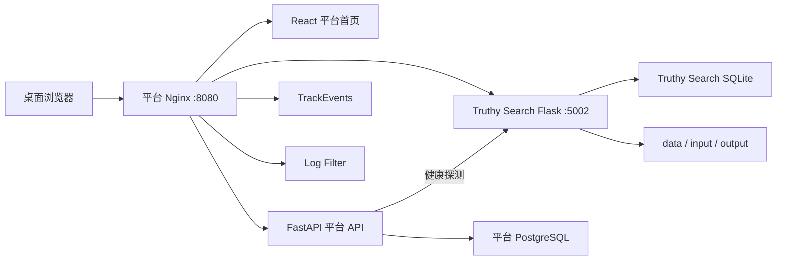

# Truthy_Search 接入测试开发平台开发设计与计划

> 文档版本：V1.0  
> 创建日期：2026-07-31  
> 文档状态：待评审  
> 接入工具：`Truthy_Search` / `searchTool v1.3`  
> 目标平台：`test-platform`  
> 目标入口：`/truthy-search/`

---

## 1. 文档目的

本文档用于指导 `Truthy_Search` 以独立服务方式接入测试开发平台，形成统一入口、统一导航、统一健康状态和统一部署编排，同时保留工具自身的数据模型、业务流程和独立运行能力。

本文档重点解决：

- Truthy_Search 当前只支持根路径运行，无法直接挂载到平台子路径；
- Truthy_Search 与平台之间的服务边界、数据边界和配置边界；
- SQLite、Raw 数据、导入文件和报告文件的安全迁移与持久化；
- 平台工具目录、首页卡片、Nginx 路由和 Docker Compose 的接入；
- 单实例约束、上线切换、验收、故障隔离和回滚；
- 当前无登录、无 RBAC 条件下的安全边界。

本文档不直接实施代码修改。

---

## 2. 任务目标与成功标准

### 2.1 任务目标

将 Truthy_Search 作为第三个独立工具接入测试开发平台：

```text
测试开发平台
├── 埋点测试
├── 日志分析
└── 检索评测
```

用户通过平台唯一对外端口 `8080` 访问：

```text
http://<platform-host>:8080/truthy-search/
```

### 2.2 成功标准

- 平台首页动态展示“检索评测”工具卡片；
- 工具入口固定为 `/truthy-search/`；
- Truthy_Search 的页面、静态资源、表单、跳转、轮询、Raw API 和下载均能在子路径下正常工作；
- 平台能够通过独立健康接口检测 Truthy_Search 状态；
- 停止 Truthy_Search 不影响平台首页、埋点测试和日志分析；
- 平台 API 或 PostgreSQL 异常时，首页仍保留 Truthy_Search 基础入口；
- Truthy_Search 继续使用自己的 SQLite、Raw、导入归档和报告目录；
- Truthy_Search 不连接平台 PostgreSQL，不复制平台业务代码；
- 平台部署时不向宿主机暴露 `5002`；
- Truthy_Search 仍可通过自身 Compose 独立运行；
- 平台模式和独立模式不得同时访问同一份 SQLite 数据；
- 不修改检索、字段处理、指标、报告和导出核心业务逻辑；
- 完成自动化测试、平台冒烟测试和桌面浏览器验收；
- 提供明确的数据备份、切换和回滚步骤。

### 2.3 交付物

- Truthy_Search 子路径兼容能力；
- Truthy_Search 专用健康接口；
- Truthy_Search 平台上下文和返回入口；
- 平台 Compose、Nginx 和工具目录配置；
- 平台首页静态回退目录和搜索工具图标；
- Truthy_Search 与平台相关自动化测试；
- 启动、切换、排障和回滚文档。

---

## 3. 实施范围

### 3.1 本次包含

- Truthy_Search 以独立 Flask 服务接入；
- `/truthy-search/` 子路径代理；
- 工具健康状态；
- 平台首页工具卡片；
- Docker Compose 统一启动；
- 原有 SQLite 和文件目录复用；
- 平台故障降级入口；
- 最小范围视觉和导航衔接；
- 桌面浏览器验证。

### 3.2 本次不包含

- 登录和统一身份认证；
- RBAC 和工具级权限；
- 将 Truthy_Search SQLite 迁移到 PostgreSQL；
- 将 Truthy_Search 任务同步到平台任务中心；
- 平台统一结果模型；
- Redis、Celery 或独立 Worker；
- 多实例部署和水平扩容；
- Truthy_Search 全量视觉重构；
- Truthy_Search 核心分析测试失败修复；
- 容器内 processed Excel 能力改造；
- 移动端和窄屏适配。

---

## 4. 当前系统评估

### 4.1 Truthy_Search 当前架构

```text
浏览器
  │
  ▼
Flask Web :5002
  ├── Evaluation 与 Run
  ├── Dataset 与历史结果导入
  ├── Query / Candidate / Raw
  ├── FieldSchema 与字段处理
  ├── Baseline 与身份复核
  ├── Metrics 与报告
  └── HTML / JSONL / Excel 导出
        │
        ├── SQLite
        ├── data/
        ├── input/
        └── output/
```

### 4.2 技术栈

| 能力 | 当前实现 |
|---|---|
| Web 后端 | Flask 3 |
| 页面 | Jinja 模板 |
| 前端交互 | 原生 JavaScript |
| 样式 | 原生 CSS |
| 数据库 | SQLite |
| HTTP 客户端 | Requests |
| Excel | OpenPyXL，部分 processed Excel 依赖宿主能力 |
| 容器 | Python 3.12-slim |
| 服务编排 | 独立 Docker Compose |
| 默认端口 | `127.0.0.1:5002` |

### 4.3 当前持久化规模

评估时目录规模约为：

| 目录 | 规模 |
|---|---:|
| `data/` | 149 MB |
| `output/` | 153 MB |
| `outputs/` | 5.1 MB |

接入过程中不得复制、覆盖或初始化为空目录。首次切换前必须完成 SQLite 一致性备份和目录清单。

### 4.4 当前测试基线

- 测试文件中约有 105 个测试用例；
- `test_web_app.py` 共 20 项，全部通过；
- 全量测试存在 2 个既有失败：
  - `test_data_processing_phase0_v3_identity_pending_reason_contract`
  - `test_stage4_metrics_v3_and_report_model_v3_explain_not_ready`
- 两个失败均是 `BASELINE_NOT_LINKED` 原因集合断言差异；
- 既有失败与 Web 子路径和平台接入无关；
- 接入实施不得顺便修改对应分析逻辑；
- 验收时应保存“接入前”和“接入后”测试结果，确保失败数量和内容没有扩大。

### 4.5 当前接入阻碍

#### 根路径依赖

当前页面生成的典型地址为：

```text
/static/app.css
/static/app.js
/evaluations/new
/reports
/api/runs/{run_id}/status
/api/raw/{raw_id}
/downloads/{file_type}/{id}
```

直接将首页代理到 `/truthy-search/` 会导致静态资源、跳转和 API 请求落到平台根路径。

#### 缺少专用健康接口

当前 Docker 健康检查访问 `/`。首页会读取业务数据并返回 HTML，不适合作为平台服务健康协议。

#### SQLite 单实例约束

当前 Truthy_Search 独立容器已经使用原有 SQLite 和文件目录。平台不得再启动第二个容器同时连接相同数据，否则可能产生：

- SQLite 写锁竞争；
- 两个后台协调器竞争执行 Run；
- 运行状态不一致；
- 报告和 JSONL 文件写入冲突；
- 应用重启恢复逻辑互相干扰。

#### 视觉上下文不一致

Truthy_Search 当前使用绿色品牌、较大的 Hero 和独立顶栏；平台使用蓝色系统强调色和紧凑工程工作台。该差异不阻塞接入，但需要最小范围的平台上下文衔接。

---

## 5. 方案选择

### 5.1 推荐方案

采用：

```text
独立 Flask 服务
+ 显式应用子路径
+ Nginx 反向代理
+ 平台动态工具目录
+ 原目录持久化
```

推荐路径：

```text
/truthy-search/
```

推荐工具 ID：

```text
truthy-search
```

### 5.2 不采用 iframe

不使用 iframe 嵌入，原因包括：

- 页面包含大量跳转、表单、下载和对话框；
- iframe 会增加焦点、地址栏、下载和错误处理复杂度；
- 后续登录和权限难以统一；
- 工具已经具备完整 Web 应用，不需要再套一层页面容器。

### 5.3 不采用外部端口跳转

不将平台卡片直接链接到 `127.0.0.1:5002`，原因包括：

- 破坏平台唯一 `8080` 入口；
- 远程用户访问时 `127.0.0.1` 指向用户本机；
- 无法统一状态、错误页和未来鉴权；
- 增加部署和防火墙配置。

### 5.4 不迁移数据库

本次不将 Truthy_Search SQLite 合并到平台 PostgreSQL：

- Truthy_Search 数据模型复杂且已经版本化；
- SQLite 与业务服务的事务、迁移和恢复逻辑已经稳定；
- 平台只需要工具目录和健康状态；
- 数据库迁移会显著扩大范围并影响核心分析逻辑。

---

## 6. 目标架构



### 6.1 服务边界

| 服务 | 负责 | 不负责 |
|---|---|---|
| 平台首页 | 工具入口、状态和平台导航 | 执行检索任务 |
| 平台 API | 工具目录和健康探测 | 读取 Truthy Search 业务数据库 |
| 平台 PostgreSQL | 工具元数据 | 保存 Truthy Search Raw 和报告 |
| 平台 Nginx | 唯一入口、路由和错误隔离 | 业务权限判断 |
| Truthy Search | 检索、处理、复核、指标和报告 | 平台导航和工具目录 |
| Truthy Search SQLite | 工具业务数据 | 平台用户与工具权限 |

### 6.2 运行模式

#### 平台模式

```text
test-platform/docker-compose.yml
  └── truthy-search
        ├── 不映射宿主机 5002
        ├── 使用 /truthy-search 前缀
        └── 复用 Truthy_Search 原有数据目录
```

#### 独立模式

```text
Truthy_Search/compose.yml
  └── searchtool
        ├── 映射 127.0.0.1:5002
        ├── 使用根路径 /
        └── 复用同一份数据目录
```

两个模式互斥，不得同时启动。

---

## 7. 子路径设计

### 7.1 环境变量

新增：

```dotenv
SEARCH_WEB_BASE_PATH=/truthy-search
PLATFORM_HOME_URL=/
```

规则：

- 未配置或配置为 `/` 时，保持独立根路径运行；
- 平台模式固定为 `/truthy-search`；
- 自动补齐开头斜杠；
- 移除末尾斜杠；
- 拒绝 `..`、查询参数、协议、重复斜杠和非法字符；
- 子路径配置错误时应用拒绝启动，不静默回退。

### 7.2 WSGI 前缀适配

在 Truthy_Search 内新增轻量 WSGI 中间件，不引入第三方依赖。

平台请求：

```text
/truthy-search/reports
```

进入 Flask 前转换为：

```text
SCRIPT_NAME=/truthy-search
PATH_INFO=/reports
```

效果：

- Flask 原有路由继续保持 `/reports`；
- `url_for()` 自动生成 `/truthy-search/reports`；
- 静态资源自动生成 `/truthy-search/static/app.css`；
- 表单和重定向自动保留前缀；
- 独立模式不设置前缀，行为保持不变。

### 7.3 原生 JavaScript 处理

当前 `static/app.js` 中的 Raw 请求使用硬编码：

```javascript
fetch(`/api/raw/${rawId}`)
```

需要改为由页面提供应用前缀：

```html
<body data-app-base-path="{{ request.script_root }}">
```

JavaScript 根据 `data-app-base-path` 生成：

```text
独立模式：/api/raw/{id}
平台模式：/truthy-search/api/raw/{id}
```

不得在 JavaScript 中写死平台域名、端口或容器名称。

### 7.4 尾斜杠

Nginx 负责：

```text
/truthy-search
    308
/truthy-search/
```

避免相对路径和浏览器地址基准不一致。

---

## 8. Truthy_Search 后端设计

### 8.1 专用健康接口

新增：

```http
GET /health
```

独立模式：

```text
GET /health
```

平台模式：

```text
GET /truthy-search/health
```

正常响应：

```json
{
  "service": "truthy-search",
  "status": "ok"
}
```

设计要求：

- 不读取 Evaluation、Run、Raw 或报告内容；
- 不返回数据库路径、环境变量或异常堆栈；
- 至少验证应用已初始化；
- 推荐执行轻量 SQLite `SELECT 1`；
- 正常返回 `200`；
- SQLite 不可访问时返回 `503`；
- 平台健康探测只根据 HTTP 状态判断，不读取内部路径。

### 8.2 平台返回入口

通过：

```dotenv
PLATFORM_HOME_URL=/
```

在顶栏增加“返回平台首页”链接。

要求：

- 只有配置该变量时显示；
- 独立模式不强制显示；
- 使用文字链接，不增加新的图标依赖；
- 键盘可访问且具有清晰焦点；
- 不修改 Truthy_Search 原有一级业务导航。

### 8.3 错误处理

子路径相关错误不得返回 Flask 调试堆栈。

需要覆盖：

- 非法 `SEARCH_WEB_BASE_PATH`；
- 前缀不匹配；
- SQLite 不可用；
- 上传超过限制；
- 静态资源不存在；
- 上游接口或 Run 执行失败。

现有业务错误页面继续复用。

---

## 9. 平台工具目录设计

### 9.1 新增 Alembic 迁移

新增独立迁移：

```text
backend/alembic/versions/20260731_0002_add_truthy_search_tool.py
```

不得修改已经执行的首个迁移。

工具记录：

```json
{
  "id": "truthy-search",
  "name": "检索评测",
  "description": "运行检索任务，对比基准结果并生成评测报告",
  "entry_url": "/truthy-search/",
  "health_url": "http://truthy-search:5002/truthy-search/health",
  "short_code": "SEARCH",
  "icon_key": "search",
  "category": "evaluation",
  "features": [
    "检索执行",
    "字段对比",
    "评测报告"
  ],
  "sort_order": 30,
  "is_enabled": true
}
```

迁移回滚只删除 `id=truthy-search`，不得删除现有两个工具或重建 `tools` 表。

### 9.2 平台 API

现有 API 已支持动态工具目录，无需新增接口：

```http
GET /api/v1/tools
GET /api/v1/tools/truthy-search/health
```

健康探测继续由平台后端读取数据库中的内部 `health_url`。

禁止将 `health_url` 返回前端。

### 9.3 静态回退目录

平台 API 或 PostgreSQL 异常时，React 首页继续展示：

```json
{
  "id": "truthy-search",
  "name": "检索评测",
  "entry_url": "/truthy-search/",
  "fallback_health_path": "/truthy-search/health"
}
```

这样平台 API 故障不会使检索工具入口消失。

---

## 10. 平台首页设计

### 10.1 工具卡片

卡片信息：

- 名称：检索评测
- 短码：SEARCH
- 描述：运行检索任务，对比基准结果并生成评测报告
- 特性：检索执行、字段对比、评测报告
- 状态：检测中、正常、服务异常
- 操作：打开工具

### 10.2 图标

现有 `ToolCard` 需要显式支持：

```text
icon_key=search
```

使用现有 CSS 绘制 `SR` 或 `SE` 字符标识，不引入第三方图标库。

不得让未知图标回退成埋点工具 `EV`。

### 10.3 视觉范围

本次仅做最小衔接：

- 复用平台蓝色强调色；
- 复用系统字体和可见焦点环；
- Truthy_Search 顶栏增加平台上下文；
- 保留 Truthy_Search 高密度表格和业务工作流；
- 不在接入阶段重构所有页面。

桌面端以 `1280px` 及以上为验收范围，不实施移动端改造。

---

## 11. Docker Compose 设计

### 11.1 新增服务

在平台 `docker-compose.yml` 中增加：

```yaml
truthy-search:
  build:
    context: ../Truthy_Search
  environment:
    SEARCH_DATA_DIR: /app/data
    SEARCH_DB_FILE: /app/data/searchtool_v1_3.db
    SEARCH_IMPORT_DIR: /app/data/imports
    SEARCH_RAW_DIR: /app/data/raw
    SEARCH_REPORT_DIR: /app/output/reports
    SEARCH_OUTPUT_DIR: /app/output
    SEARCH_WEB_HOST: 0.0.0.0
    SEARCH_WEB_PORT: "5002"
    SEARCH_WEB_BASE_PATH: /truthy-search
    SEARCH_WEB_MAX_UPLOAD_BYTES: "26214400"
    SEARCH_REPORT_EXCEL_ENABLED: "false"
    PLATFORM_HOME_URL: /
  volumes:
    - ../Truthy_Search/.env:/run/secrets/searchtool.env:ro
    - ../Truthy_Search/data:/app/data
    - ../Truthy_Search/output:/app/output
    - ../Truthy_Search/input:/app/input:ro
  expose:
    - "5002"
```

实际实现需要保留 Truthy_Search Dockerfile 中：

```text
--env-file /run/secrets/searchtool.env
```

### 11.2 健康检查

```yaml
healthcheck:
  test:
    - CMD
    - python3
    - -c
    - >-
      import urllib.request;
      urllib.request.urlopen(
        'http://127.0.0.1:5002/truthy-search/health',
        timeout=3
      )
  interval: 15s
  timeout: 5s
  retries: 3
  start_period: 10s
```

### 11.3 端口要求

- 平台模式不允许配置 `ports: 5002:5002`；
- 只允许 `expose: 5002`；
- 宿主机继续只暴露 `${PLATFORM_PORT:-8080}:80`；
- 独立 Compose 仍可使用 `127.0.0.1:5002:5002`。

### 11.4 启动依赖

平台网关增加对 `truthy-search` 的依赖，但 Truthy_Search 启动失败不得阻止其他工具运行。

Nginx 使用 Docker DNS 动态解析，避免 Truthy_Search 容器暂时不存在时网关整体启动失败。

---

## 12. Nginx 设计

新增：

```nginx
location = /truthy-search {
    return 308 /truthy-search/;
}

location /truthy-search/ {
    set $truthy_search_upstream truthy-search:5002;
    proxy_pass http://$truthy_search_upstream;
    proxy_http_version 1.1;
    proxy_set_header Host $host;
    proxy_set_header X-Real-IP $remote_addr;
    proxy_set_header X-Forwarded-For $proxy_add_x_forwarded_for;
    proxy_set_header X-Forwarded-Proto $scheme;
    proxy_set_header X-Forwarded-Prefix /truthy-search;
    proxy_connect_timeout 3s;
    proxy_read_timeout 60s;
    proxy_intercept_errors on;
    error_page 502 503 504 /tool-unavailable.html;
}
```

约束：

- `proxy_pass` 保留完整 `/truthy-search/...` 路径；
- 前缀由 Truthy_Search 自身 WSGI 中间件处理；
- 不使用 Nginx HTML 内容替换；
- 不在 Nginx 中逐条重写 Truthy_Search 内部路由；
- 继续使用平台统一安全响应头；
- 继续使用工具不可用错误页；
- MVP 上传限制统一为 25 MB。

---

## 13. 数据与文件安全

### 13.1 数据所有权

| 数据 | 所有者 | 存储 |
|---|---|---|
| 工具目录 | 平台 | PostgreSQL |
| Evaluation / Run / Query / Candidate | Truthy_Search | SQLite |
| Raw | Truthy_Search | `data/raw/` |
| 导入归档 | Truthy_Search | `data/imports/` |
| JSONL 输出 | Truthy_Search | `output/` |
| 报告 | Truthy_Search | `output/reports/` |
| API Token 与设备标识 | Truthy_Search | `.env` |

平台后端不得直接读取 Truthy_Search SQLite 或 `.env`。

### 13.2 切换前备份

必须执行：

1. 停止独立 Truthy_Search 容器；
2. 确认没有 `RUNNING` Run；
3. 使用 SQLite Backup API 创建一致性数据库备份；
4. 记录 `data/`、`input/`、`output/` 的文件数量和容量；
5. 保存当前镜像 ID 和 Compose 配置；
6. 验证备份数据库可以只读打开；
7. 再启动平台管理的 Truthy_Search 服务。

不得直接在运行中的 WAL 数据库上只复制主 `.db` 文件作为唯一备份。

### 13.3 单实例保护

启动平台模式前检查：

```text
Truthy_Search 独立容器必须停止
```

回滚到独立模式前检查：

```text
平台 truthy-search 容器必须停止
```

运维文档必须将该约束列为高风险检查项。

### 13.4 密钥

- `.env` 只读挂载；
- `.env` 不进入镜像；
- `.env` 不提交 Git；
- 前端构建不读取 Token、Device ID 和 User ID；
- `SEARCH_WEB_SECRET_KEY` 必须使用本地随机值；
- 错误页面、日志和健康接口不得输出密钥；
- Nginx 访问日志不得记录请求体。

---

## 14. Excel 能力边界

Truthy_Search Docker 当前设置：

```dotenv
SEARCH_REPORT_EXCEL_ENABLED=false
```

原因是部分 processed Excel 依赖宿主机 `@oai/artifact-tool`，当前 Python 容器没有对应运行时。

本次保持：

- Web 报告可用；
- 静态 HTML 可用；
- JSONL 下载可用；
- 已存在 Excel 文件下载不受影响；
- 容器内新的 processed Excel 生成保持关闭。

若 Excel 自动生成是上线前必需条件，应另立任务评估 Node 运行时和依赖封装，不在本次接入中临时扩充镜像。

---

## 15. 文件影响范围

### 15.1 Truthy_Search

| 文件 | 修改内容 |
|---|---|
| `web_app.py` | 基础路径校验、WSGI 前缀、健康接口、平台 URL 配置 |
| `templates/base.html` | 注入应用前缀、返回平台入口 |
| `static/app.js` | Raw API 使用应用前缀 |
| `static/app.css` | 最小平台上下文和焦点样式 |
| `.env.example` | 新增基础路径和平台 URL 示例 |
| `compose.yml` | 专用健康接口，保持独立模式根路径 |
| `README.md` | 平台模式、独立模式和互斥运行说明 |
| `tests/test_web_app.py` | 根路径、前缀、健康和资源路径测试 |

### 15.2 test-platform

| 文件 | 修改内容 |
|---|---|
| `docker-compose.yml` | 新增 Truthy_Search 服务和挂载 |
| `nginx/nginx.conf` | 新增 `/truthy-search/` 路由 |
| `backend/alembic/versions/20260731_0002_*.py` | 写入工具目录记录 |
| `frontend/src/data/fallbackTools.ts` | 增加降级入口 |
| `frontend/src/components/ToolCard.tsx` | 支持 `search` 图标 |
| `web/styles.css` | 搜索工具图标样式 |
| `frontend/src/App.test.tsx` | 第三个工具和降级测试 |
| `tests/test_smoke.py` | Truthy_Search 冒烟测试 |
| `.env.example` | 如有必要补充平台接入说明 |
| `README.md` | 启动、切换、备份和排障 |
| `docs/接口文档.md` | 增加工具目录示例和健康接口说明 |

不得修改：

- Truthy_Search 核心检索流程；
- Truthy_Search 分析指标公式；
- Truthy_Search Schema 和报告模型；
- 平台现有两个工具的业务逻辑；
- 平台首个 Alembic 迁移。

---

## 16. 开发执行顺序

### 阶段 0：基线冻结

1. 记录两个仓库 `git status`；
2. 保存 Truthy_Search 当前镜像和容器状态；
3. 记录数据库、Raw 和报告目录规模；
4. 运行 Truthy_Search 全量测试；
5. 单独运行 `test_web_app.py`；
6. 保存 2 个既有失败的完整信息；
7. 验证独立首页、静态资源、报告和下载；
8. 确认没有正在执行的 Run；
9. 创建 SQLite 一致性备份。

完成标准：

- 既有业务数据可恢复；
- 既有测试失败清单明确；
- 接入前行为可复现。

### 阶段 1：Truthy_Search 子路径能力

1. 增加 `SEARCH_WEB_BASE_PATH` 校验；
2. 实现 WSGI 前缀处理；
3. 调整 Raw API 地址；
4. 增加 `/health`；
5. 增加 `PLATFORM_HOME_URL`；
6. 为根路径和子路径补充测试；
7. 验证独立模式没有回归。

完成标准：

- 根路径和 `/truthy-search/` 两种模式均可运行；
- 所有 `url_for()`、静态资源和 Raw API 带正确前缀；
- 无新增依赖。

### 阶段 2：平台目录和首页

1. 新增 Alembic 迁移；
2. 增加 Truthy_Search 工具记录；
3. 更新前端静态回退；
4. 增加搜索工具图标；
5. 更新首页组件测试；
6. 验证 API 返回顺序为：

```text
trackevents
log-filter
truthy-search
```

完成标准：

- 正常模式和平台 API 降级模式都展示第三个入口；
- 工具状态使用文字和颜色共同表达。

### 阶段 3：Compose 和 Nginx

1. 停止独立 Truthy_Search 容器；
2. 在平台 Compose 增加服务；
3. 挂载原有数据目录和只读 `.env`；
4. 增加 Nginx 路由；
5. 执行 `nginx -t`；
6. 构建并启动完整平台；
7. 确认只有 `8080` 暴露到宿主机。

完成标准：

- 平台模式使用原有数据；
- 不创建第二份空 SQLite；
- 不暴露 `5002`。

### 阶段 4：端到端验收

依次验证：

1. 平台首页显示第三个工具；
2. Truthy_Search 状态为正常；
3. 打开 `/truthy-search/`；
4. 静态 CSS 和 JavaScript 正常；
5. 首页业务数据正常；
6. 主导航所有入口保留前缀；
7. Evaluation、Run、Query、Candidate 页面可打开；
8. Run 状态轮询请求使用正确前缀；
9. Raw 对话框请求使用正确前缀；
10. 报告和下载地址使用正确前缀；
11. 返回平台首页正常；
12. 键盘可操作主导航、按钮、表单和对话框；
13. 空状态、加载状态、错误状态可理解；
14. `prefers-reduced-motion` 不出现非必要持续动效；
15. 在 `1280px` 及以上桌面浏览器检查主要页面。

### 阶段 5：故障隔离与恢复

1. 停止 Truthy_Search；
2. 验证平台首页和另外两个工具正常；
3. 验证 Truthy_Search 卡片显示服务异常；
4. 验证访问工具时展示统一不可用页面；
5. 恢复 Truthy_Search；
6. 验证状态自动恢复；
7. 停止平台 API；
8. 验证首页使用三工具静态回退；
9. 恢复平台 API；
10. 验证动态目录恢复。

---

## 17. 自动化测试计划

### 17.1 Truthy_Search 单元与 Web 测试

必须新增：

- 基础路径空值；
- 基础路径 `/`；
- 基础路径 `/truthy-search`；
- 尾斜杠标准化；
- 非法父路径、协议、查询参数和重复斜杠；
- 前缀首页；
- 前缀静态资源；
- 前缀表单 action；
- 前缀重定向；
- 前缀 Run 状态 URL；
- 前缀 Raw API；
- 前缀下载；
- 独立 `/health`；
- 前缀 `/truthy-search/health`；
- 健康接口数据库异常返回 `503`；
- 页面和错误响应不泄漏 `.env`。

### 17.2 平台前端测试

必须覆盖：

- API 返回三个工具；
- Truthy_Search 卡片内容；
- `search` 图标不会回退成埋点图标；
- Truthy_Search 健康状态；
- API 异常时三个入口都存在；
- 重新检测状态不重新请求工具目录；
- 工具链接为 `/truthy-search/`。

### 17.3 平台后端测试

现有工具 API 逻辑无需新增分支，但需要通过迁移和集成验证：

- 新工具记录存在；
- 排序为第三；
- `health_url` 不返回前端；
- 健康接口上游正常；
- 上游异常仍返回 `200 + unhealthy`；
- 未知工具返回统一 `404`；
- 回滚只删除 Truthy_Search。

### 17.4 平台冒烟测试

新增：

```text
GET /truthy-search/
GET /truthy-search/health
GET /truthy-search/static/app.css
GET /truthy-search/static/app.js
GET /api/v1/tools/truthy-search/health
```

只读冒烟不创建真实检索任务，不调用外部检索接口。

---

## 18. 验收标准

### 18.1 功能验收

- [ ] 平台首页展示三个工具；
- [ ] Truthy_Search 工具卡片来自数据库；
- [ ] 平台降级时仍展示三个入口；
- [ ] Truthy_Search 页面可通过 `/truthy-search/` 使用；
- [ ] 所有业务导航保留前缀；
- [ ] Raw、轮询和下载正常；
- [ ] 返回平台首页正常；
- [ ] Truthy_Search 独立模式仍可运行。

### 18.2 数据验收

- [ ] 平台模式打开的是原有 SQLite；
- [ ] Evaluation、Run 和报告数量与切换前一致；
- [ ] Raw 和报告目录没有被覆盖；
- [ ] 数据库备份可恢复；
- [ ] 没有同时运行两个 Truthy_Search 实例。

### 18.3 部署验收

- [ ] `nginx -t` 通过；
- [ ] 所有容器健康；
- [ ] 宿主机只暴露 `8080`；
- [ ] `.env` 未进入镜像；
- [ ] 平台停止或重建不会删除 Truthy_Search 数据；
- [ ] Truthy_Search 故障不影响其他工具。

### 18.4 质量验收

- [ ] Truthy_Search 20 个 Web 测试继续全部通过；
- [ ] 全量测试没有新增失败；
- [ ] 平台前端测试通过；
- [ ] 平台后端测试通过；
- [ ] 平台冒烟测试通过；
- [ ] `git diff --check` 通过；
- [ ] 桌面键盘和状态反馈通过。

---

## 19. 上线切换步骤

### 19.1 切换前

1. 通知使用者暂停创建新 Run；
2. 确认没有运行中的任务；
3. 记录当前容器、镜像和数据目录；
4. 创建 SQLite 一致性备份；
5. 运行基线测试；
6. 构建新镜像但不启动第二实例。

### 19.2 切换

1. 停止 Truthy_Search 独立容器；
2. 启动平台数据库迁移；
3. 启动平台管理的 Truthy_Search；
4. 等待 Truthy_Search 健康；
5. 启动或重建平台网关；
6. 执行只读冒烟；
7. 执行桌面浏览器验收；
8. 解除使用暂停。

### 19.3 切换后观察

重点观察：

- SQLite locked；
- Run 重复执行；
- `/truthy-search/` 下 404；
- 静态资源错误；
- Raw 加载错误；
- 报告下载错误；
- Nginx 502、503、504；
- 数据目录权限；
- 平台健康探测超时。

---

## 20. 回滚方案

### 20.1 应用回滚

1. 停止平台管理的 `truthy-search`；
2. 从 Nginx 移除或禁用 `/truthy-search/` 路由；
3. 回滚新增工具目录迁移，或将工具设置为禁用；
4. 确认平台容器已经释放 SQLite；
5. 在 Truthy_Search 目录启动原独立 Compose；
6. 验证 `127.0.0.1:5002`；
7. 验证 Evaluation、Run、Raw 和报告。

### 20.2 数据回滚

只有确认数据损坏时才恢复 SQLite 备份。

恢复前必须：

- 停止全部 Truthy_Search 实例；
- 保留故障数据库副本；
- 记录恢复原因；
- 使用 SQLite 完整性检查验证备份；
- 恢复后只启动一个实例。

### 20.3 前端降级

如果 Truthy_Search 暂时不可用：

- 保留平台和另外两个工具；
- 将数据库中的 `truthy-search.is_enabled` 暂时设为 `false`，或回滚迁移；
- 不删除 Truthy_Search 数据目录；
- 修复后重新启用。

---

## 21. 风险清单

| 风险 | 等级 | 缓解措施 |
|---|---|---|
| 两个实例同时写 SQLite | 高 | 平台模式和独立模式互斥，切换前检查容器 |
| 子路径遗漏导致跳转到平台根路径 | 高 | WSGI 前缀、Raw API 改造、全路由测试 |
| 真实接口凭证和 Raw 数据暴露 | 高 | 内网部署、只读挂载、错误脱敏、未来接入登录 |
| 切换时 SQLite 或 WAL 备份不一致 | 高 | 停止任务并使用 SQLite Backup API |
| Nginx 25 MB 与工具 50 MB 不一致 | 中 | MVP 统一为 25 MB，并在页面和文档说明 |
| processed Excel 在容器内不可生成 | 中 | 保持关闭，单独规划运行时能力 |
| 当前两项分析测试失败被误认为接入回归 | 中 | 冻结失败名称和断言差异 |
| 视觉风格不一致 | 低 | 只做平台上下文和基础 token 衔接 |
| Truthy_Search 启动较慢导致平台显示异常 | 低 | 独立 start period、动态 DNS 和自动恢复 |

---

## 22. 工期与任务拆分

| 阶段 | 主要工作 | 预估 |
|---|---|---:|
| 基线与备份 | 测试、数据清单、SQLite 备份 | 0.5 天 |
| Truthy_Search 适配 | 子路径、健康接口、平台入口、测试 | 0.5 至 1 天 |
| 平台接入 | Compose、Nginx、迁移、卡片、回退 | 0.5 天 |
| 验收与切换 | 冒烟、桌面浏览器、故障和回滚验证 | 0.5 天 |
| 可选视觉衔接 | 顶栏、基础 token、焦点状态 | 0.5 天 |

MVP 接入预计：

```text
1.5 至 2 天
```

包含最小视觉衔接预计：

```text
2 至 2.5 天
```

---

## 23. 最终执行检查单

### 开发前

- [ ] 确认 `/truthy-search/` 路径；
- [ ] 确认独立容器切换窗口；
- [ ] 确认没有运行中的 Run；
- [ ] 完成 SQLite 一致性备份；
- [ ] 保存既有两项测试失败。

### 开发中

- [ ] 不修改核心分析逻辑；
- [ ] 不新增不必要依赖；
- [ ] 不修改历史 Alembic 迁移；
- [ ] 不复制 `.env` 到镜像；
- [ ] 不启动第二个 SQLite 写实例；
- [ ] 根路径和子路径同时有测试。

### 上线前

- [ ] 全部 Web 测试通过；
- [ ] 全量测试没有新增失败；
- [ ] 平台前后端测试通过；
- [ ] Nginx 配置检查通过；
- [ ] 只读冒烟通过；
- [ ] 桌面键盘和状态测试通过；
- [ ] 只有 `8080` 对外暴露；
- [ ] 回滚步骤完成演练。

---

## 24. 最终建议

本次采用“轻量子路径适配 + 平台反向代理 + 原数据目录复用”的方案。

该方案具有以下特点：

- 不重写 Truthy_Search；
- 不迁移复杂业务数据库；
- 不改变平台现有技术栈；
- 不增加前端或后端大型依赖；
- 保留工具独立运行方式；
- 与现有 TrackEvents 和 Log Filter 接入模式一致；
- 可以独立验证和快速回滚。

接入实施的最高优先级不是页面样式，而是：

```text
单实例安全
→ 数据备份
→ 子路径完整性
→ 健康与故障隔离
→ 平台入口和最小视觉衔接
```

登录、RBAC、统一任务中心和结果汇总应在本次稳定接入后另立计划。
