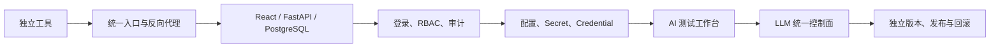
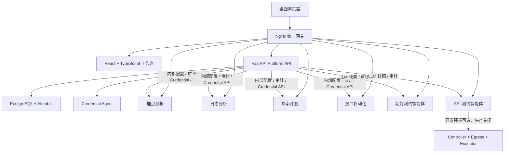
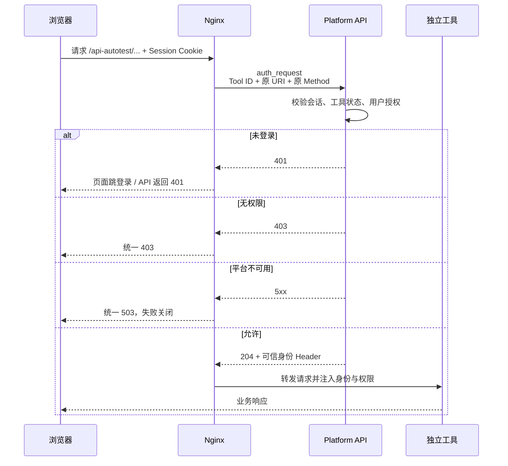
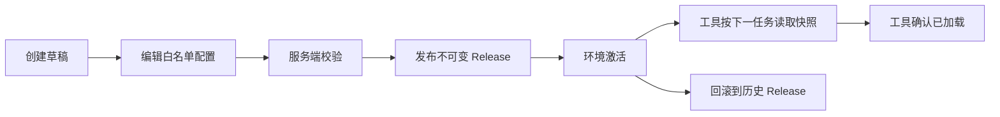

# 测试开发平台：从工具入口到 AI 测试与质量工程控制面

> 分享定位：这是整个测试工具体系的底座项目。它没有把所有工具重写成一个“大而全”的系统，而是通过统一入口、身份权限、配置与 Secret、审计、版本和部署治理，把六个独立工具组织成一个可持续演进的测试开发平台。

---

## 1. 一句话介绍

测试开发平台是 QA、研发和测试工程师的统一身份与配置控制面，也是六项测试能力的统一访问入口。

它解决的不是某一种测试问题，而是：

> 当测试工具越来越多、技术栈不同、运行方式不同、权限和配置分散时，怎样在不破坏工具独立性的前提下，让用户通过一个平台安全、清晰、可追溯地使用这些能力。

当前平台产品版本由 `versions.json` 管理，机器真源中的产品版本为 `1.1.0`。

---

## 2. 为什么要开发这个平台

### 2.1 单个工具可用，不代表工具体系可用

平台建设前，各个测试工具可以独立运行，但用户需要分别记住：

- 工具地址和端口；
- 哪个工具适合处理什么问题；
- 不同工具的启动、配置和凭证方式；
- 日志、结果和报告保存在哪里；
- 工具是否正常、配置是否完整、凭证是否过期；
- 谁可以访问、执行或查看结果。

随着埋点、日志、检索评测、接口自动化和两个 AI 智能体陆续加入，这些问题会被成倍放大。

### 2.2 直接把所有工具合成一个项目并不是好方案

六个工具的业务目标和技术边界差异明显：

- 有的是粘贴日志后即时分析；
- 有的是带 SQLite 数据的任务型工具；
- 有的是连接外部 Gateway 的接口自动化；
- 有的是需要 LLM、人工 Review 和文件版本的测试智能体；
- API 智能体还包含更高安全等级的受控执行组件。

如果为了统一而复制或重写业务逻辑，会带来：

- 发布和回滚互相牵连；
- 依赖冲突和测试范围扩大；
- 工具无法继续独立运行；
- 平台团队需要理解所有业务实现；
- 一个工具故障可能拖垮全部能力。

因此平台从一开始就坚持：

> 平台负责控制面和统一体验，工具负责自己的业务面。

---

## 3. 当前平台包含哪些能力

平台当前聚合六个独立工具，并按照用户任务组织为四个能力域。

| 能力域 | 工具 | 核心使命 |
| --- | --- | --- |
| AI 测试 | 功能测试智能体 | 从需求中提炼测试点和测试用例 |
| AI 测试 | API 测试智能体 | 围绕接口契约完成探索式验证 |
| 自动化 | 接口自动化 | 持续验证已经稳定的接口 |
| 质量分析 | 埋点分析 | 校验事件上报和字段质量 |
| 质量分析 | 日志分析 | 从运行日志中提取故障线索 |
| 专项评测 | 检索评测 | 对特定项目的检索结果进行质量评估 |

首页不是按照内部工程名称堆放六张同权重卡片，而是先回答用户的问题：

- 我想从需求生成测试用例；
- 我想测试一个新接口；
- 我想执行稳定接口回归；
- 我想验证埋点；
- 我想分析日志；
- 我想评估检索质量。

---

## 4. 项目的演进路线

### 阶段一：MVP——先把入口统一

最初只接入：

- `TrackEvents_tess`；
- `log_filter_tool`。

MVP 解决：

- 一个地址访问平台；
- 首页展示工具导航和健康状态；
- Nginx 通过子路径代理独立工具；
- 工具容器端口不直接暴露；
- 停止一个工具不影响另一个工具；
- 工具仍可脱离平台独立运行。

这一阶段刻意不做登录、RBAC、跨工具任务中心、公共数据库和复杂基础设施。

### 阶段二：从入口升级为控制面

工具数量增加后，平台补上：

- 登录与统一会话；
- 用户、角色和 RBAC；
- Nginx 网关强制鉴权；
- 审计日志；
- 普通配置、Secret 和 Credential；
- dev/prod 环境隔离；
- 配置 Release、发布和回滚；
- 工具 Client 机器身份。

### 阶段三：从工具目录升级为 AI 测试工作台

平台已经拥有六个工具后，新的问题不再是“入口在哪里”，而是“用户应该选哪个能力”。

第三阶段完成：

- 平台定位升级为“AI 测试与质量工程工作台”；
- 按四个能力域组织六个工具；
- AI 能力成为首要入口；
- 工具卡片说明场景、输入、输出和能力边界；
- 首页只展示服务端实际授权的能力；
- 工具异常、无权限和目录失败都采用失败关闭。

### 后续治理：统一 LLM 和独立发布

随后平台继续增加：

- LLM Profile 与工具 Binding；
- 不可变运行配置快照；
- 组件版本矩阵和 Release BOM；
- 两个测试智能体的源码物理拆分；
- 独立镜像、runtime、Client Token 和回滚边界。

整个演进可以概括为：



---

## 5. 当前总体架构



### 技术栈

| 层级 | 当前实现 |
| --- | --- |
| 前端 | React、TypeScript、Vite、React Router |
| 后端 | FastAPI、SQLAlchemy、Pydantic |
| 数据库 | PostgreSQL、Alembic |
| 网关 | Nginx `auth_request` 与反向代理 |
| 部署 | Docker Compose |
| 安全 | Argon2id、CSRF、AES-256-GCM 信封加密 |
| 测试 | pytest、Vitest、Testing Library、unittest 冒烟测试 |

---

## 6. 为什么平台不承载工具业务逻辑

平台与工具的职责边界如下：

| 平台负责 | 独立工具负责 |
| --- | --- |
| 登录、会话和身份 | 业务表单和业务流程 |
| RBAC 和网关授权 | 输入解析和领域规则 |
| 工具目录与健康状态 | 任务执行和结果生成 |
| 配置、Secret、Credential | 业务数据和领域资产 |
| LLM Profile 与运行快照 | Prompt、Schema 和 Agent 工作流 |
| 跨工具审计 | 任务内详细日志与产物 |
| 组件版本和发布治理 | 独立测试、镜像和回滚 |

这样的收益是：

- 每个工具可以独立开发和测试；
- 一个工具停止不影响其他工具；
- 工具可以保留适合自身的 UI 和数据模型；
- 平台只需要维护稳定接入协议；
- 安全和配置能力不需要在每个项目重复实现。

---

## 7. 工具是怎样接入平台的

### 7.1 第一层：子路径和健康检查

每个工具至少提供：

- 唯一 Tool ID；
- 名称、说明、分类和入口；
- 独立 Dockerfile 与端口；
- 可配置的 Base Path；
- 健康检查；
- 数据目录和输入大小约束。

平台通过统一路径访问：

```text
/trackevents/
/log-filter/
/truthy-search/
/api-autotest/
/functional-test-agent/
/api-test-agent/
```

### 7.2 第二层：用户身份和权限

Nginx 在转发工具请求前调用平台内部授权接口。授权成功后，网关才向工具注入：

```text
X-Platform-User-ID
X-Platform-Username
X-Platform-Display-Name
X-Platform-Permissions
```

工具不信任浏览器自己传入的身份 Header；网关会覆盖这些值。

### 7.3 第三层：工具 Client 机器身份

工具后台不能使用用户 Cookie 获取 Secret。每个工具和环境都有独立的 Tool Client Token，并且只能访问自己的内部接口：

- 读取当前环境配置快照；
- 确认配置 Release 已加载；
- 上报幂等审计事件；
- 上报 Credential 状态；
- 按版本原子写回刷新后的会话；
- 获取属于自己的 LLM Binding 快照。

平台同时检查：

- Client 的 `tool_id`；
- `environment_id`；
- 被授予的最小 capability；
- 请求路径中的 Tool ID 是否与 Client 一致。

这样可以阻止一个工具读取另一个工具的配置或 Secret。

---

## 8. 统一网关鉴权是怎样运行的



权限不仅按工具区分，还会根据 HTTP Method 和路径确定动作：

- `tool.view`：进入工具和查看普通页面；
- `tool.execute`：提交分析或任务；
- `tool.result.view`：查看结果和报告；
- `tool.config.manage`：维护工具普通配置；
- `tool.secret.manage`：替换工具 Secret；
- `api-test-agent.execute`：API 智能体真实执行的独立高风险权限。

前端隐藏按钮只是体验优化，真正的判断始终在 Nginx、Platform API 和工具服务端完成。

---

## 9. 登录与会话安全

当前默认值包括：

| 项目 | 默认策略 |
| --- | --- |
| 密码哈希 | Argon2id |
| Session 空闲有效期 | 8 小时 |
| Session 绝对有效期 | 24 小时 |
| 登录失败限制 | 15 分钟内失败 5 次 |
| 锁定时间 | 15 分钟 |
| 会话 Cookie | `tp_session`，HttpOnly |
| CSRF | `tp_csrf` 双提交校验 |
| 用户会话 | 可查看和单独撤销 |
| 密码重置 | 强制修改，并可撤销其他会话 |

平台只在数据库中保存 Session Token 哈希，不保存明文 Token。用户名和 IP 都参与登录失败频率控制，且对不存在的用户仍执行虚拟密码校验，降低账号枚举与时序差异。

当前生产部署仍使用 HTTP，Cookie Secure 被明确配置为 `false`，该传输风险已在 README 中记录为已接受风险；如果部署边界变化，应优先升级 HTTPS 并重新评审 Cookie 策略。

---

## 10. RBAC 为什么要拆成平台权限和工具权限

### 平台权限

- `platform.user.manage`；
- `platform.role.manage`；
- `platform.audit.view` / `platform.audit.export`；
- `platform.config.manage`；
- `platform.secret.manage`；
- `platform.llm.manage`；
- `platform.llm.secret.manage`。

### 工具权限

- 查看；
- 执行；
- 查看结果；
- 管理普通配置；
- 管理 Secret；
- 少量工具专用高风险权限。

角色通过 Grant 关联权限，工具 Grant 可以作用于具体 Tool ID 或 `*`。这样既能表达“平台管理员”，也能表达“只允许使用日志工具但不能管理配置”的用户。

内置角色包括：

- 平台管理员；
- 测试开发；
- 测试执行者；
- 只读查看者；
- 审计查看者。

---

## 11. 配置中心是怎样设计的

平台把配置分为五类：

| 配置类型 | 例子 | Web 管理 |
| --- | --- | --- |
| 启动配置 | 数据库、KEK、Bootstrap Token | 否 |
| 平台普通配置 | 会话、审计保留、预警阈值 | 是 |
| 工具普通配置 | URL、超时、开关、目录逻辑 | 是 |
| 工具 Secret | 密码、Token、API Key | 只能替换 |
| 运行期 Credential | Session、过期时间、Operator | 自动管理 |

关键原则是“配置白名单”，而不是允许管理员编辑任意环境变量。

每个定义包含：

- Key、类型和默认值；
- 是否必填；
- 校验规则；
- 敏感级别；
- 生效方式。

生效方式包括：

- `immediate`；
- `next_task`；
- `restart`；
- `deployment`。

平台不挂载 Docker Socket，因此 `restart` 和 `deployment` 类型只显示待操作状态，不从 Web 直接重启容器。

---

## 12. 配置 Release 生命周期



发布时会冻结：

- 普通配置值；
- 引用的 Secret Version；
- Release 版本和创建人；
- 工具实际读取的运行快照。

运行中的任务继续使用启动时读取的旧快照，新任务才使用新 Release，避免任务中途配置漂移。

普通配置可以从 dev 人工提升为 prod 草稿，但不会自动发布；Secret 永远不会随普通配置自动复制到 prod。

---

## 13. Secret 为什么不能和普通配置放在一起

Secret 的核心要求是：管理员可以替换，但不能再次读取明文。

当前实现使用 AES-256-GCM 信封加密：

1. 每个 Secret Version 生成独立 DEK；
2. DEK 加密 Secret 明文；
3. 环境独立 KEK 包装 DEK；
4. AAD 绑定 `secret_id + environment_id + version`；
5. 保存前执行一次完整解密校验；
6. 数据库只保存密文、Nonce、Wrapped DEK 和 KEK Version；
7. KEK 位于只读文件，不进入数据库和版本库。

Secret 不得进入：

- URL；
- API 响应；
- 普通日志；
- 审计前后差异；
- 任务文件和报告；
- 浏览器缓存；
- 配置导出。

允许展示的只有是否已配置、版本、更新时间和稳定错误状态。

---

## 14. Credential Agent 解决什么问题

Gateway Session 和 Admin Login 等凭证会过期，仅保存静态用户名密码并不能保证工具长期可用。

Credential Agent 每分钟扫描临期凭证，并根据 Provider：

- 尝试刷新已有 Session；
- 刷新失败时重新登录；
- 原子写入新 Credential Version；
- 更新过期时间和健康状态；
- 记录脱敏审计；
- 提前 60 分钟处理临期凭证。

工具写回凭证时必须提供 `expected_version`。如果其他任务已经刷新，旧任务返回 409，不能覆盖更新后的 Session。

平台首页会显示凭证异常或临期数量，但不暴露凭证值。

---

## 15. LLM 统一配置中心

如果每个 AI 工具都维护独立 Base URL、模型、Temperature 和 API Key，会出现：

- 配置重复；
- 模型变更难以统一；
- Secret 散落在多个 `.env`；
- 无法说明某个任务使用了哪套配置；
- 回滚工具镜像时配置来源不明确。

平台将 LLM 配置拆成两层：

### Profile

公共模型连接配置：

- OpenAI-compatible Base URL；
- Model；
- Temperature；
- Max Tokens；
- Timeout；
- Enabled；
- 加密 API Key。

### Binding

工具能力与 Profile 的绑定，可以覆盖：

- Model；
- Temperature；
- Max Tokens；
- Timeout；
- 独立 API Key。

首期只登记真实使用 LLM 的三项能力：

- `functional-test-agent/default`；
- `api-test-agent/default`；
- `log-filter/people-search-summary`。

没有直接 LLM 调用的工具不会显示“未配置”，避免制造虚假的管理项。

### 每任务固定一次运行快照

Agent 创建任务时只读取一次已发布快照，并记录：

- Profile / Binding Release；
- 模型名称；
- 非敏感运行参数；
- Prompt Bundle SHA；
- 配置 Release 元数据。

API Key 只进入进程环境，不进入任务记录。连接测试也只返回成功状态或稳定错误码，不回显 Provider 原始敏感响应。

---

## 16. 审计系统

平台审计覆盖：

- 登录成功与失败；
- 用户、角色和权限变更；
- 配置草稿、校验、发布和回滚；
- Secret 替换；
- Credential 刷新和状态变化；
- LLM Profile、Binding 和连接测试；
- 工具任务和关键 Review 操作；
- 版本和发布相关操作。

工具通过内部 API 上报带 `event_id` 的审计事件。相同事件重复提交会幂等返回成功，不重复写入。

审计记录包含操作者、动作、资源、环境、结果、错误码、Request ID 和脱敏元数据；不保存密码、Token、Secret 或完整业务正文。普通用户不能修改或删除审计记录，具备权限的用户可以查询和导出。

审计保留目标为 180 天。

---

## 17. 前端工作台是怎样组织的

### 17.1 信息架构

当前前端主要包括：

- 登录与首次初始化；
- AI 测试与质量工程首页；
- 四个能力域页面；
- 账号、密码和会话管理；
- 用户管理；
- 角色与权限管理；
- LLM 配置；
- 普通配置；
- Secret；
- Credential 状态；
- 审计日志；
- 版本状态。

### 17.2 权限目录失败关闭

前端的 Capability Catalog 只提供展示文案，不会凭空补回工具。

页面能力集合来自：

```text
服务端返回的已授权工具
        ∩
前端已登记且入口安全的能力定义
```

如果工具目录请求失败，页面不会退回静态六工具入口；如果某个入口不是站内绝对路径，也不会渲染。这避免了前端 Catalog 绕过服务端授权或造成开放重定向。

### 17.3 当前不做统一任务汇总

首页负责帮助用户选对能力，不承担跨工具任务中心。功能测试智能体、API 测试智能体、接口自动化等任务仍由各自工作台管理。

这是有意保留的边界：在任务状态、资产和生命周期尚未统一前，不用一个表格强行混合不同语义的任务。

---

## 18. 健康检查与错误模型

平台区分：

- Platform API 存活；
- Platform API 就绪，包括数据库；
- 每个工具的健康状态；
- 工具凭证异常；
- 单个服务不可用；
- 身份服务不可用。

单个工具异常只影响对应卡片和入口，不影响其他工具。

FastAPI 统一错误体：

```json
{
  "code": "STABLE_ERROR_CODE",
  "message": "对用户可理解的说明",
  "request_id": "req_xxx"
}
```

Request ID 同时进入响应 Header 和日志。数据库不可用返回 `DATABASE_UNAVAILABLE`；未处理异常不会把内部栈直接暴露给浏览器。

Nginx 为上游 502/503/504 提供统一不可用页，并设置 `nosniff`、`SAMEORIGIN` 和同源 Referrer Policy。

---

## 19. 数据模型概览

### 身份与授权

- User；
- Role；
- Permission；
- UserRole；
- RoleGrant；
- PlatformSession；
- LoginThrottle；
- ToolClient。

### 工具与配置

- Tool；
- Environment；
- ConfigDefinition；
- ConfigRelease / ConfigReleaseItem；
- ConfigActivation；
- Secret / SecretVersion；
- Credential / CredentialItem。

### LLM 与审计

- LlmProfile；
- ToolLlmBinding；
- AuditLog。

数据库 Schema 通过 Alembic 演进，目前迁移历史从初始工具表逐步增加检索评测、接口自动化、身份 RBAC、审计、配置 Secret、两个智能体、Review 开关、LLM 配置中心和工作台 V3。

---

## 20. 版本矩阵与发布治理

`versions.json` 是平台产品和独立组件版本的唯一机器真源。

当前记录的组件包括：

- platform-gateway；
- platform-backend；
- trackevents-web；
- log-filter-tool；
- truthy-search；
- api-autotest；
- functional-test-agent；
- api-test-agent。

运行状态不仅比较 Semantic Version，还记录：

- Git Revision；
- Dirty 状态；
- 内容 SHA；
- 镜像 Digest；
- Runtime Environment；
- 配置指纹；
- Alembic Revision；
- dev/prod 差异。

版本页面可以识别：

- 一致；
- Dirty 构建；
- 待发布；
- Prod 领先；
- 同版本不同内容；
- 组件与产品主版本不兼容。

这样可以避免“镜像标签看起来一样，但实际内容、配置或数据库结构不同”的伪一致。

---

## 21. 部署与环境隔离

### 21.1 Docker Compose

本机环境由 Compose 管理：

- PostgreSQL；
- Alembic Migration；
- Tool Client Bootstrap；
- Platform API；
- Credential Agent；
- Nginx Gateway 和前端静态资源；
- 六个独立工具；
- API Agent 可选 Controller、Egress 和 Executor 镜像。

宿主机默认只暴露 `${PLATFORM_PORT:-8080}`，工具端口只存在于内部网络。

### 21.2 dev/prod 必须隔离

以下内容不能跨环境复用：

- PostgreSQL Volume；
- 工具任务目录；
- 普通配置和 Secret；
- Credential；
- Tool Client Token；
- KEK；
- 两个智能体 runtime。

普通配置只能显式提升为 prod 草稿；Secret 和 Session 不复制。

### 21.3 生产发布

README 约定：

- 本机仅在 dev 原生构建；
- 生产版本从 `main` 创建 Release Tag；
- GitHub Actions 构建 `linux/amd64` 镜像；
- 经过 production Environment 审批；
- 服务器只拉取镜像，不执行 `git pull` 或 `docker compose build`；
- `.env.images` 固定完整镜像 Digest；
- 部署前备份数据库并执行迁移；
- 部署失败恢复上一镜像组合，数据库默认不自动降级；
- API 智能体的四个镜像作为同一 Release 原子切换。

---

## 22. 安全设计汇总

| 风险 | 平台控制 |
| --- | --- |
| 直接访问工具绕过登录 | Nginx 对六个前缀统一 `auth_request` |
| 前端隐藏按钮被绕过 | Platform API 和工具服务端再次鉴权 |
| 浏览器伪造身份 Header | 网关覆盖并只注入授权结果 |
| 身份服务异常时匿名回退 | 统一失败关闭并返回 503 |
| 密码泄露 | Argon2id；密码和 Token 不进日志 |
| 会话盗用 | HttpOnly Session、CSRF、空闲/绝对过期、可撤销 |
| 暴力登录 | 用户名和 IP 双维度节流与锁定 |
| Secret 数据库泄露 | AES-256-GCM 信封加密、独立 DEK、环境 KEK |
| 工具跨域读取配置 | Tool Client 与 Tool/Environment 双重绑定 |
| 旧任务覆盖新 Credential | `expected_version` 乐观并发控制 |
| 配置漂移 | 不可变 Release 和每任务快照 |
| 开放重定向 | 前端只接受安全站内绝对入口 |
| 单工具故障扩散 | 独立容器、数据目录和健康状态 |
| 生产 API 误执行 | 默认关闭、空目标列表、生产代码级禁止 |

---

## 23. 当前实现验证情况

### 平台后端

执行：

```bash
cd test-platform/backend
python3 -m pytest -q
```

结果：

```text
32 passed, 1 warning
```

覆盖健康检查、工具目录、会话、Argon2id、Secret 篡改检测、KEK 轮换、CSRF、Tool Client 隔离、权限映射、Credential 刷新、LLM 快照、数据库迁移、环境提升和版本矩阵。

警告来自 FastAPI TestClient 对当前 Starlette/httpx 组合的弃用提示，不代表测试失败。

### 平台前端

执行：

```bash
cd test-platform/frontend
npm test -- --run
npm run build
```

结果：

```text
15 tests passed
TypeScript 与 Vite production build 成功
```

覆盖登录失败关闭、六项授权能力、工具目录异常、权限管理入口、版本详情、入口安全、健康状态、初始化、Secret 元数据和 LLM Profile/Binding 页面。

### Compose 与平台级测试

```text
docker compose config --quiet：通过
智能体拆分与安全默认检查：4 项通过
```

依赖当前已运行平台的顶层在线冒烟测试在 `setUpClass` 登录阶段收到 HTTP 401，因此后续 8 个在线入口场景没有执行。此次没有更改当前部署用户或凭证，也没有把该结果标记为代码回归失败；在正式分享前，应使用当前环境有效测试账号重新执行在线冒烟验收。

---

## 24. 最值得重点分享的设计取舍

### 1. 先统一入口，再逐步统一控制面

MVP 没有一开始就引入登录、数据库和任务协议，而是先验证子路径、健康检查和工具隔离，再分阶段增加能力。

### 2. 平台不吞并工具

平台统一身份、配置和发布，工具保留业务逻辑、数据和工作台。这让六个不同成熟度的项目可以并行演进。

### 3. 鉴权必须放在工具之前

如果只在平台首页隐藏卡片，用户仍可以直接输入工具 URL。Nginx `auth_request` 把授权变成所有工具请求的强制前置步骤。

### 4. 人和机器使用不同身份

浏览器使用 Session；工具后台使用作用域受限的 Tool Client Token。工具不会拿用户 Cookie 去读取运行 Secret。

### 5. Secret 管理不是加一个密码输入框

它需要版本、信封加密、不可回显、环境隔离、Release 冻结、轮换和审计共同成立。

### 6. 配置生效必须可解释

每个任务绑定一次 Release/LLM 快照，避免管理员修改配置后无法解释历史结果。

### 7. 首页按用户目标组织，而不是按仓库名称组织

工程结构属于开发者，任务目标才属于用户。第三阶段的信息架构让能力选择更直接。

### 8. 不急于建立假的统一任务中心

不同工具的状态和资产语义尚未统一时，强行汇总只会制造一个无法操作的列表。当前平台只统一入口和控制面，任务仍归工具工作台。

### 9. 版本不能只看镜像 Tag

版本矩阵同时比较版本、Revision、Digest、内容 SHA、配置指纹和数据库 Revision，才能真正支持发布与回滚判断。

---

## 25. 当前局限与后续方向

### 当前局限

- 当前仍是 Docker Compose 单机/小规模部署，不是 Kubernetes 多节点平台；
- 首页不提供跨工具任务汇总和搜索；
- 工具接入仍需要 Nginx、Compose、数据库种子和前端 Catalog 多处登记；
- 不同工具的任务、结果和 Artifact 协议尚未完全统一；
- 部分老工具对平台配置、审计和 Credential 协议的接入深度不同；
- 生产部署仍为 HTTP，Cookie Secure 风险已接受但未消除；
- 在线端到端冒烟依赖有效部署账号和当前运行环境；
- Credential Provider 仍以现有 Gateway/Admin 场景为主；
- 暂无组织、项目空间和多租户隔离模型。

### 推荐后续方向

1. 建立声明式 Tool Manifest，减少接入时的多处人工登记；
2. 在保持领域差异的前提下，定义最小任务摘要和 Artifact 查询协议；
3. 增加跨工具“最近工作”而不是过早建设全量任务中心；
4. 推进 HTTPS、Cookie Secure 和生产传输安全；
5. 完善在线冒烟的专用测试身份与自动轮换；
6. 增加配置、Credential、工具健康和任务成功率的运营指标；
7. 逐步形成发布 BOM、SBOM、签名和漏洞扫描闭环；
8. 当单机资源或可用性成为真实瓶颈时，再评估容器编排平台。

---

## 26. 推荐的重点分享讲法

### 第一部分：从六个独立工具带来的问题开始

不要先讲 React 或 FastAPI。先展示：地址分散、权限分散、配置分散、用户不知道选哪个工具、一个 Secret 可能存在多个 `.env`。

### 第二部分：讲最核心的架构选择

> 平台统一控制面，但不重写工具业务面。

用总体架构图说明 Nginx、Platform API、PostgreSQL 和六个工具之间的边界。

### 第三部分：讲三次演进

1. MVP：统一入口；
2. 第二阶段：身份、权限、配置和审计；
3. 第三阶段：按用户目标组织 AI 测试与质量工程能力。

### 第四部分：选一条真实请求链路演示

例如用户进入 API 测试智能体：

1. 登录平台；
2. 首页只展示有权限能力；
3. Nginx 发起内部授权；
4. Platform API 根据 Method 和 Path 判断权限；
5. 网关注入可信身份；
6. Agent 使用自己的 Tool Client 获取 LLM 快照；
7. 任务记录固定 Release 和 Prompt SHA；
8. 审计事件回传平台。

### 第五部分：重点讲配置和 Secret

通过“草稿 → 校验 → 发布 → 每任务快照 → 回滚”说明配置为什么是平台能力；通过“Secret Version → DEK → KEK → 不回显”说明安全不是 UI 遮罩。

### 第六部分：讲清楚当前边界

- 平台不是所有工具业务代码的集合；
- 当前没有统一任务中心；
- API 智能体生产真实执行仍关闭；
- 当前部署适合单机和团队级使用；
- 业务效果数据需要从真实使用中补充。

---

## 27. 分享时可以直接使用的总结

> 这个平台最初只是想解决两个工具入口分散的问题，所以 MVP 用 Nginx 和 Docker Compose 做了一个统一入口，同时保留工具独立运行。随着工具增加到六个，真正的问题变成了统一身份、权限、配置、Secret、凭证和审计，因此平台升级成 React、FastAPI 和 PostgreSQL 的控制面。再往后，有了两个 AI 测试智能体，我们又把首页从工具列表升级成按用户目标组织的 AI 测试与质量工程工作台，并增加统一 LLM Profile、工具 Binding 和每任务不可变快照。整个过程中最重要的选择，是平台只统一共性治理，不吞并每个工具的业务逻辑。这样既能提供一致的安全和管理体验，也能让各工具独立开发、发布、故障和回滚。

---

## 28. 本文档依据

本总结主要依据以下资料与当前实现交叉整理：

- `test-platform/README.md`
- `test-platform/versions.json`
- `test-platform/docs/TestPlatform_MVP_PRD.md`
- `test-platform/docs/TestPlatform_MVP_开发设计与计划.md`
- `test-platform/docs/平台框架升级开发设计与计划.md`
- `test-platform/docs/TestPlatform_第二阶段_PRD.md`
- `test-platform/docs/TestPlatform_第二阶段_开发设计与计划.md`
- `test-platform/docs/TestPlatform_第三阶段_AI测试工作台_PRD.md`
- `test-platform/docs/TestPlatform_第三阶段_AI测试工作台_开发设计与实施计划.md`
- `test-platform/docs/TestPlatform_LLM统一配置中心_开发设计与实施计划.md`
- `test-platform/docs/AI测试智能体独立接入PRD.md`
- `test-platform/docs/两个AI测试智能体源码物理拆分与独立发布_PRD.md`
- `test-platform/backend/app/`
- `test-platform/frontend/src/`
- `test-platform/nginx/nginx.conf`
- `test-platform/docker-compose.yml`
- `test-platform/backend/tests/`
- `test-platform/frontend/src/App.test.tsx`
- `test-platform/tests/`

> 待补充的业务数据：当前仓库没有统一沉淀月活用户、各工具使用次数、任务成功率、配置变更耗时、凭证故障下降比例和故障恢复时间。重点分享时建议补入真实平台截图、一次完整工具访问演示，以及上线前后可核验的效率与稳定性数据。
